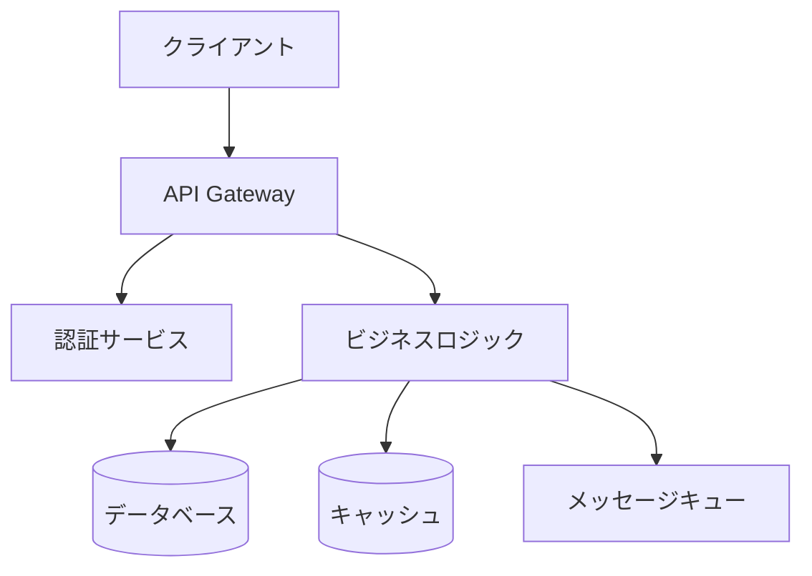
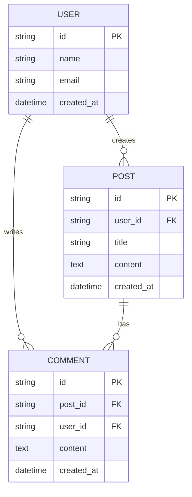

# 設計方針作成スキル

## 概要
アーキテクチャ設計、技術選定、設計判断を支援するスキルです。

## 使用方法
- `/design-policy [Issue番号または要件概要]`
- 「[機能名]の設計方針を作成してください」
- 「Issue #123の設計方針を作成してください」

## 実行内容

あなたはソフトウェアアーキテクトです。以下の手順で設計方針を策定してください：

---

### 0. 現状調査（必須）

**重要**: 設計方針を作成する前に、必ず以下の現状調査を実施してください。

#### 0.1 Issue情報の取得（Issue番号指定時）

Issue番号が指定された場合、以下を実行：

```bash
gh issue view [Issue番号] --json title,body,labels,assignees
```

取得した情報から：
- 対象プロジェクト（ラベルから判定: `project: expertAgent`, `project: myAgentDesk`等）
- 関連する要件定義書（dev-reports/内）
- 既存の議論内容

#### 0.2 関連ドキュメントの確認

CLAUDE.mdの「必須参照ドキュメント」を確認し、対象プロジェクトに応じて以下を読み込み：

| プロジェクト | 必須ドキュメント |
|-------------|----------------|
| expertAgent | `expertAgent/docs/API_REFERENCE.md`, `docs/spec/job-generation-workflow.md` |
| graphAiServer | `graphAiServer/docs/GRAPHAI_WORKFLOW_GENERATION_RULES.md` |
| myAgentDesk | `myAgentDesk/README.md` |
| 全サービス | `docs/arch/service-dependencies.md`, `docs/design/architecture-overview.md` |

#### 0.3 既存アーキテクチャの調査（Task tool使用）

Task tool (subagent_type=Explore) を使用して以下を調査：

```
調査項目：
1. 「既存のアーキテクチャパターンは何か」（Repository, Factory, Observer等）
2. 「類似機能の設計はどうなっているか」
3. 「モジュール間の依存関係はどうなっているか」
4. 「既存のAPI設計パターンは何か」（エンドポイント命名、レスポンス形式等）
```

**調査の目的**:
- 既存アーキテクチャとの整合性確保
- 設計パターンの一貫性維持
- 技術的負債の回避

#### 0.4 調査結果のサマリ

現状調査の結果を以下の形式でまとめる：

```markdown
## 現状調査サマリ

### 対象プロジェクト
- プロジェクト名: [特定されたプロジェクト]
- 主要モジュール: [関連する主要モジュール]

### 既存アーキテクチャパターン
- [パターン1]: [使用箇所と目的]
- [パターン2]: [使用箇所と目的]

### 類似機能の設計
- [類似機能1]: [設計概要]
- [類似機能2]: [設計概要]

### モジュール間依存関係
- [依存関係の概要]

### 既存API設計パターン
- エンドポイント命名規則: [規則]
- レスポンス形式: [形式]
- エラーハンドリング: [パターン]

### 参照したドキュメント
- [ドキュメント1]: [関連する内容のサマリ]

### 設計上の制約
- [調査で判明した制約1]
- [調査で判明した制約2]
```

---

### 1. アーキテクチャ設計

現状調査の結果を踏まえて、既存アーキテクチャと整合性のある設計を行う：

#### システム構成図

既存のサービス構成を考慮した図を作成：



#### レイヤー構成

既存のレイヤー構成に合わせた設計：

- プレゼンテーション層
- ビジネスロジック層
- データアクセス層
- インフラストラクチャ層

### 2. 技術選定

既存の技術スタックとの整合性を考慮した選定：

| カテゴリ | 選定技術 | 選定理由 | 既存との整合性 |
|---------|---------|---------|---------------|
| 言語/フレームワーク | | | |
| データベース | | | |
| キャッシュ | | | |
| メッセージング | | | |
| 監視/ログ | | | |

### 3. 設計パターン

既存コードベースで使用されているパターンを優先的に採用：

適用する設計パターンと理由：
- Repository パターン（既存で使用: [使用箇所]）
- Factory パターン（既存で使用: [使用箇所]）
- Observer パターン
- その他

**新規パターン導入時の判断基準**:
- 既存パターンで対応不可能な場合のみ新規導入
- 導入理由と既存との共存方法を明記

### 4. データモデル設計

既存のデータモデルとの整合性を確認：

#### ER図


#### 主要テーブル設計
- テーブル名、カラム、インデックス
- 既存テーブルとの関連

### 5. API設計

既存APIの設計パターンに従った設計：

#### RESTful API
- エンドポイント設計（既存の命名規則に従う）
- リクエスト/レスポンス形式（既存形式との一貫性）
- エラーハンドリング（既存のエラーコード体系に従う）

### 6. セキュリティ設計

既存のセキュリティ実装との整合性：

- 認証/認可方式（既存方式を踏襲）
- データ暗号化
- 脆弱性対策

### 7. パフォーマンス設計

既存のパフォーマンス基準に合わせた設計：

- キャッシング戦略
- 非同期処理
- スケーリング方針

### 8. 設計上の決定事項とトレードオフ

現状調査結果に基づく判断：

- 採用した設計の理由（既存パターンとの整合性を含む）
- 代替案との比較
- 想定されるリスクと対策

---

## 制約条件の確認

CLAUDE.mdの以下の原則に準拠：
- SOLID原則
- KISS原則
- YAGNI原則
- DRY原則

---

## 出力フォーマット

設計方針書（design-policy.md）形式で出力。図表を含む構造化されたMarkdownドキュメント。

### 出力構成

```markdown
# 設計方針書: [機能名]

## 現状調査サマリ
[調査結果のサマリ]

## アーキテクチャ設計
[システム構成図、レイヤー構成]

## 技術選定
[選定表]

## 設計パターン
[採用パターンと理由]

## データモデル設計
[ER図、テーブル設計]

## API設計
[エンドポイント、形式]

## セキュリティ設計
[セキュリティ方針]

## パフォーマンス設計
[パフォーマンス方針]

## 設計判断とトレードオフ
[判断内容と根拠]

## 参照ドキュメント
[読み込んだドキュメントのリスト]
```

---

## 注意事項

1. **現状調査は必須**: 調査をスキップして設計方針を作成しないこと
2. **既存パターンの優先**: 新規パターン導入は既存で対応不可能な場合のみ
3. **整合性の確保**: 既存のAPI設計、データモデル、命名規則との一貫性を維持
4. **ドキュメント参照の明記**: 参照したドキュメントを設計方針書に記載すること
5. **トレードオフの明示**: 設計判断の根拠と代替案を明記すること
