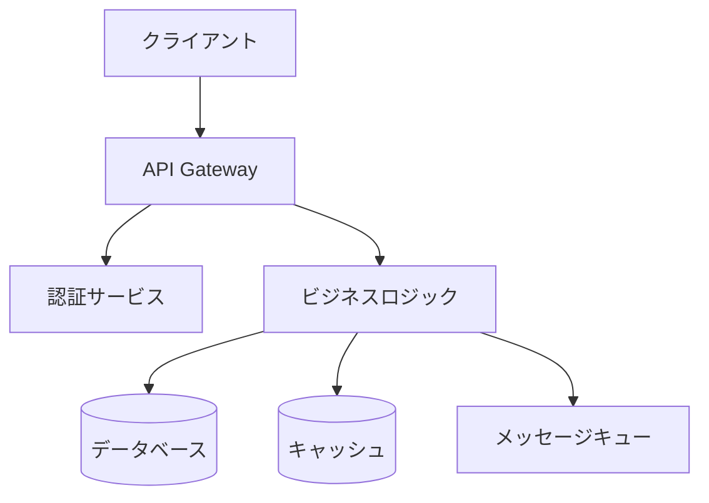
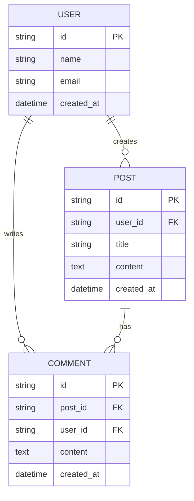

# 設計方針作成スキル

## 概要
アーキテクチャ設計、技術選定、設計判断を支援するスキルです。

## 使用方法
- `/design-policy [要件概要]`
- 「[機能名]の設計方針を作成してください」

## 実行内容

あなたはソフトウェアアーキテクトです。以下の観点から設計方針を策定してください：

### 1. アーキテクチャ設計

#### システム構成図

#### レイヤー構成
- プレゼンテーション層
- ビジネスロジック層
- データアクセス層
- インフラストラクチャ層

### 2. 技術選定

| カテゴリ | 選定技術 | 選定理由 |
|---------|---------|---------|
| 言語/フレームワーク | | |
| データベース | | |
| キャッシュ | | |
| メッセージング | | |
| 監視/ログ | | |

### 3. 設計パターン

適用する設計パターンと理由：
- Repository パターン
- Factory パターン
- Observer パターン
- その他

### 4. データモデル設計

#### ER図

#### 主要テーブル設計
- テーブル名、カラム、インデックス

### 5. API設計

#### RESTful API
- エンドポイント設計
- リクエスト/レスポンス形式
- エラーハンドリング

### 6. セキュリティ設計
- 認証/認可方式
- データ暗号化
- 脆弱性対策

### 7. パフォーマンス設計
- キャッシング戦略
- 非同期処理
- スケーリング方針

### 8. 設計上の決定事項とトレードオフ
- 採用した設計の理由
- 代替案との比較
- 想定されるリスクと対策

## 制約条件の確認

CLAUDE.mdの以下の原則に準拠：
- SOLID原則
- KISS原則
- YAGNI原則
- DRY原則

## 出力フォーマット

設計方針書（design-policy.md）形式で出力。図表を含む構造化されたMarkdownドキュメント。