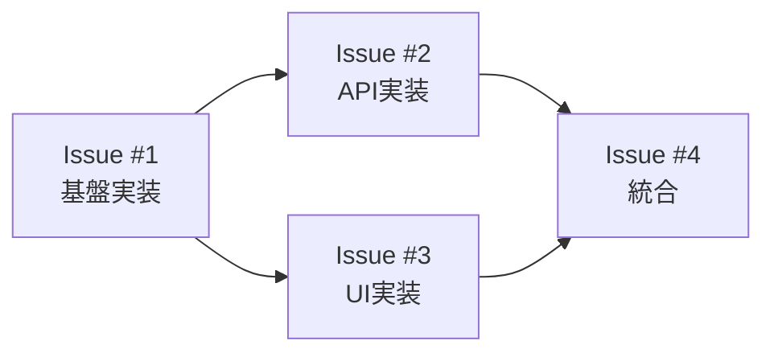

# Issue分割スキル

## 概要
Feature全体を実装可能な単位のIssueに分割し、依存関係を整理するスキルです。

## 使用方法
- `/issue-split [Feature概要]`
- 「[Feature名]をIssueに分割してください」

## 実行内容

あなたはプロジェクトマネージャー兼テックリードです。Feature全体を適切なIssueに分割してください：

### 1. Issue分割戦略

#### 分割の原則
- **縦割り（Vertical Slice）優先**
  - 各Issueが独立してデプロイ可能
  - UI + API + DB + テストを1つのIssueに含める
  - フェーズ（要件→設計→実装）で分割しない

#### Issue サイズの目安

| サイズ | Story Point | 作業時間 | 推奨 |
|-------|------------|---------|------|
| XS | 1 | 2-4時間 | ✅ 小さなバグ修正 |
| S | 2 | 0.5-1日 | ✅ 単純な機能追加 |
| M | 3-5 | 1-3日 | ✅ 標準的な機能 |
| L | 8 | 3-5日 | ⚠️ 分割を推奨 |
| XL | 13+ | 1週間以上 | ❌ 必ず分割 |

### 2. Issue一覧の作成

各Issueについて以下を定義：

```markdown
## Feature: [Feature名]

### Issue #1: [タイトル]
**概要**: [1-2文で説明]
**サイズ**: S/M/L
**優先度**: High/Medium/Low
**作業見積**: [X]時間
**担当候補**: Backend/Frontend/Full-stack

**スコープ**:
- [ ] 実装内容1
- [ ] 実装内容2
- [ ] テスト作成
- [ ] ドキュメント更新

**技術スタック**:
- 言語/FW: Python/FastAPI
- データベース: PostgreSQL
- その他:

### Issue #2: [タイトル]
...
```

### 3. 依存関係マトリクス

Issue間の依存関係を可視化：



| Issue | 依存先 | 並列実行可能 | ブロッカー |
|-------|--------|-------------|------------|
| #1 | なし | Yes | なし |
| #2 | #1 | No | #1の完了待ち |
| #3 | #1 | Yes（#2と並列可） | #1の完了待ち |
| #4 | #2, #3 | No | #2,#3の完了待ち |

### 4. マイルストーン計画

Issue完了順序とマイルストーン：

**Milestone 1: 基本機能（Week 1-2）**
- Issue #1: 基盤実装
- Issue #2: API実装
- Issue #3: UI実装（並列）

**Milestone 2: 統合・テスト（Week 3-4）**
- Issue #4: 統合テスト
- Issue #5: パフォーマンス最適化
- Issue #6: ドキュメント整備

### 5. リソース配分

| 役割 | 必要人数 | スキル要件 | 担当Issue |
|------|---------|-----------|-----------|
| Backend | 2名 | Python/FastAPI | #1, #2 |
| Frontend | 1名 | React/TypeScript | #3 |
| QA | 1名 | E2Eテスト | #4, #5 |

### 6. リスク評価

| Issue | リスク | 影響度 | 対策 |
|-------|-------|-------|------|
| #1 | 技術的複雑性 | 高 | 早期プロトタイピング |
| #2 | 外部API依存 | 中 | モック作成 |
| #4 | 統合時の不具合 | 高 | 段階的統合 |

### 7. 分割判断チェックリスト

各Issueについて確認：
- [ ] 独立してデプロイ可能か
- [ ] 1-3日で完了可能か
- [ ] 明確な完了条件があるか
- [ ] テストが定義できるか
- [ ] 他Issueへの影響が最小か

## 出力フォーマット

GitHub Projects や Issue に直接転記可能なMarkdown形式。

## 次のステップ

Issue分割後、各Issueの詳細な作業計画は `/work-plan` スキルで立案してください。

## モデル設定
- model: opus（複雑な分割判断のため）
- temperature: 0.6（柔軟性と論理性のバランス）