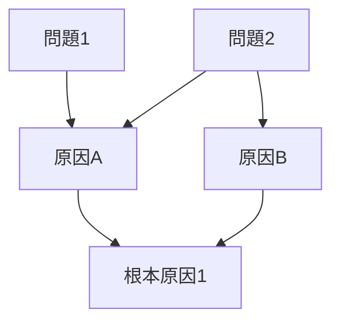

# PM自動開発スキル

## 概要
Issue開発（Phase 8-11: TDD実装 → 受入テスト → リファクタリング → 進捗報告）を**完全自動化**するプロジェクトマネージャースキルです。ユーザーはIssue番号を指定するだけで、開発完了まで自律的に実行します。

**新アーキテクチャ**: サブエージェント方式を採用し、各フェーズを専門エージェントに委譲します。

## 使用方法
- `/pm-auto-dev [Issue番号]`
- `/pm-auto-dev [Issue番号] --max-iterations=5`（イテレーション回数変更）
- 「Issue #145を開発してください」

## 実行内容

あなたはプロジェクトマネージャーとして、Issue開発を統括します。各フェーズは**専門サブエージェント**に委譲し、結果ファイルを確認しながら品質基準を満たすまで完了させてください。

### 📋 パラメータ

- **issue_number**: 開発対象のIssue番号（必須）
- **max_iterations**: 最大イテレーション回数（デフォルト: 3）
- **target_coverage**: 目標カバレッジ（デフォルト: 90）

---

## 🔄 実行フェーズ

### Phase 0: 初期設定とTodoリスト作成

まず、TodoWriteツールで作業計画を作成してください：

```
- [ ] Phase 1: Issue情報収集
- [ ] Phase 1.5-A: 受入テスト計画立案【必須・TDD前】
- [ ] Phase 1.5-B: 受入テスト計画レビュー【必須・TDD前】
- [ ] Phase 2: TDD実装 (イテレーション 0/3)
- [ ] Phase 2.5: TDD結果検証【必須】
- [ ] Phase 2.6: 実装機能一覧の生成【必須】
- [ ] Phase 2.7: 実装検証【必須】（デッドコード検出）
- [ ] Phase 3: 受入テスト実行【必須】
- [ ] Phase 3.5: 受入テストファイル検証【必須】
- [ ] Phase 4: リファクタリング
- [ ] Phase 5: 進捗報告
```

各フェーズ開始時に`in_progress`に、完了時に`completed`に更新してください。

---

### Phase 1: Issue情報収集

#### 1-1. Issue情報取得

```bash
gh issue view {issue_number} --json number,title,body,labels,assignees
```

#### 1-2. 必要情報の抽出

Issue本文から以下を抽出：

- **タイトル**: Issue件名
- **受入条件** (`## 受入条件`セクション)
- **技術要件** (`## 技術要件`セクション)
- **実装タスク** (`## 実装タスク`セクション)

#### 1-3. ディレクトリ構造作成

```bash
BRANCH=$(git branch --show-current)
ISSUE_NUM=$(echo "$BRANCH" | grep -oE '[0-9]+$')

if [ -z "$ISSUE_NUM" ]; then
  echo "❌ Error: Issue番号がブランチ名から取得できません"
  exit 1
fi

# ベースディレクトリ作成
BASE_DIR="dev-reports/feature/issue/${ISSUE_NUM}/pm-auto-dev/iteration-1"
mkdir -p "$BASE_DIR"

echo "✅ ディレクトリ作成: $BASE_DIR"
```

#### 1-4. 作業計画ファイル確認

Readツールで作業計画ファイルの存在を確認：

```bash
WORK_PLAN_FILE="dev-reports/feature/issue/${ISSUE_NUM}/work-plan.md"

if [ -f "$WORK_PLAN_FILE" ]; then
  echo "✅ 作業計画ファイル発見: $WORK_PLAN_FILE"
  cat "$WORK_PLAN_FILE"
else
  echo "⚠️  作業計画ファイルが存在しません"
  echo "推奨: /work-plan ${ISSUE_NUM} を実行して作業計画を作成してください"
fi
```

**作業計画ファイルが存在する場合**:
- 作業計画の内容を読み込み、以降のフェーズで活用
- 詳細タスク分解、タスク依存関係、作業スケジュールを考慮
- 成果物チェックリスト、Definition of Doneを検証項目に追加

**作業計画ファイルが存在しない場合**:
- Issue本文の情報のみで進行（従来通り）
- ユーザーに作業計画作成を推奨

TodoWriteでPhase 1を`completed`に、Phase 1.5-Aを`in_progress`に設定してください。

---

### Phase 1.5-A: 受入テスト計画立案【TDD前・必須】

**重要**: TDD実装を開始する**前に**受入テスト計画を立案します。これにより、TDD実装時に何を達成すべきかが明確になります。

#### 1.5-A-1. 受入テスト計画コンテキストファイル作成

Writeツールで以下のファイルを作成：

**ファイルパス**:
```
dev-reports/feature/issue/{issue_number}/pm-auto-dev/iteration-{N}/acceptance-plan-context.json
```

**内容**:
```json
{
  "issue_number": {issue_number},
  "issue_title": "Issue title",
  "acceptance_criteria": [
    "受入条件1",
    "受入条件2"
  ],
  "technical_requirements": [
    "技術要件1",
    "技術要件2"
  ],
  "target_project": "expertAgent",
  "design_policy_path": "dev-reports/feature/issue/{issue_number}/design-policy.md",
  "work_plan_path": "dev-reports/feature/issue/{issue_number}/work-plan.md",
  "phase": "pre-tdd"
}
```

#### 1.5-A-2. 受入テスト計画立案サブエージェント呼び出し

以下のテキストを記述してください：

```
Use acceptance-plan-agent to create acceptance test plan for Issue #{issue_number}.

Context file: dev-reports/feature/issue/{issue_number}/pm-auto-dev/iteration-{N}/acceptance-plan-context.json
Output file: dev-reports/feature/issue/{issue_number}/acceptance-plan.md

Please create a comprehensive acceptance test plan that includes:
1. Acceptance criteria analysis
2. Design policy verification items
3. Dead code detection plan
4. Test environment and methods
5. Test items (TC-001, TC-002, ...)

Note: This is PRE-TDD planning. Unit test review will be added after TDD implementation.
```

#### 1.5-A-3. 結果確認

サブエージェントが完了したら、Readツールで計画書を確認：

```bash
cat dev-reports/feature/issue/{issue_number}/acceptance-plan.md
```

**確認項目**:
- 受入条件がすべて分析されているか
- 設計方針検証項目が含まれているか
- デッドコード検証計画が含まれているか
- テスト項目（TC-XXX）が作成されているか
- テスト環境・方法が明確か

→ TodoWriteでPhase 1.5-Aを`completed`に、Phase 1.5-Bを`in_progress`に設定

---

### Phase 1.5-B: 受入テスト計画レビュー【TDD前・必須】

立案した計画をレビューし、品質を確保します。

#### 1.5-B-1. レビューコンテキストファイル作成

Writeツールで以下のファイルを作成：

**ファイルパス**:
```
dev-reports/feature/issue/{issue_number}/pm-auto-dev/iteration-{N}/acceptance-plan-review-context.json
```

**内容**:
```json
{
  "issue_number": {issue_number},
  "acceptance_plan_path": "dev-reports/feature/issue/{issue_number}/acceptance-plan.md",
  "design_policy_path": "dev-reports/feature/issue/{issue_number}/design-policy.md",
  "work_plan_path": "dev-reports/feature/issue/{issue_number}/work-plan.md"
}
```

#### 1.5-B-2. 受入テスト計画レビューサブエージェント呼び出し

以下のテキストを記述してください：

```
Use acceptance-plan-review-agent to review acceptance test plan for Issue #{issue_number}.

Context file: dev-reports/feature/issue/{issue_number}/pm-auto-dev/iteration-{N}/acceptance-plan-review-context.json
Output file: dev-reports/feature/issue/{issue_number}/acceptance-plan-review.md

Please review:
1. Issue coverage - all acceptance criteria are covered
2. Design policy coverage - design decisions are verified
3. Test environment validity - executable configuration
4. Test item validity - E2E perspective, no excessive mocking
```

#### 1.5-B-3. レビュー結果確認

サブエージェントが完了したら、Readツールでレビュー結果を確認：

```bash
cat dev-reports/feature/issue/{issue_number}/acceptance-plan-review.md
```

**結果判定**:

| 判定 | 次のアクション |
|------|--------------|
| ✅ 承認 | Phase 2（TDD実装）へ進む |
| ⚠️ 条件付き承認 | 改善を適用後、Phase 2 へ進む |
| ❌ 却下 | **Phase 1.5 問題解決プロセス**へ進む |

---

### Phase 1.5 問題解決プロセス（受入テスト計画失敗時）

受入テスト計画が却下された場合、以下の構造化された問題解決プロセスを実行します。

#### Step 1: 現状を整理

```markdown
## 現状整理

### 受入テスト計画の状態
- **計画書パス**: dev-reports/feature/issue/{issue_number}/acceptance-plan.md
- **レビュー結果**: ❌ 却下
- **却下理由**: {レビューファイルから抽出}

### 関連ドキュメントの状態
| ドキュメント | 存在 | 内容の充実度 |
|-------------|------|-------------|
| design-policy.md | ✅/❌ | 高/中/低 |
| work-plan.md | ✅/❌ | 高/中/低 |
| Issue本文 | ✅ | 高/中/低 |

### 現在のカバレッジ
| 項目 | カバー率 | 詳細 |
|------|---------|------|
| 受入条件 | {X}/{Y} ({Z}%) | {未カバー項目リスト} |
| 設計方針 | {X}/{Y} ({Z}%) | {未カバー項目リスト} |
```

#### Step 2: 問題点の洗い出し

```markdown
## 問題点の洗い出し

### レビューで指摘された問題
1. **[P1] 問題1**: {問題の説明}
   - 重要度: 高/中/低
   - 影響範囲: {影響する受入条件/テスト項目}

2. **[P2] 問題2**: {問題の説明}
   - 重要度: 高/中/低
   - 影響範囲: {影響する受入条件/テスト項目}

### 問題の分類
| カテゴリ | 件数 | 問題ID |
|---------|------|--------|
| Issue網羅性不足 | X件 | P1, P3 |
| 設計方針網羅性不足 | X件 | P2 |
| テスト環境不備 | X件 | P4 |
| テスト項目の妥当性 | X件 | P5 |
```

#### Step 3: 原因の深掘り

```markdown
## 原因の深掘り

### 各問題の原因分析

#### [P1] {問題1}
- **表面的原因**: {直接的な原因}
- **背景要因**: {なぜその原因が発生したか}
  - 情報不足: {欠けている情報}
  - 認識齟齬: {誤解していた点}
  - プロセス問題: {プロセス上の問題}

#### [P2] {問題2}
- **表面的原因**: {直接的な原因}
- **背景要因**: {なぜその原因が発生したか}

### 原因間の関連性

```

#### Step 4: 真因の特定

```markdown
## 真因の特定

### 根本原因
1. **[RC1] 根本原因1**: {根本原因の説明}
   - 関連する問題: P1, P2
   - なぜこれが真因か: {説明}

2. **[RC2] 根本原因2**: {根本原因の説明}
   - 関連する問題: P3, P4
   - なぜこれが真因か: {説明}

### 真因の優先度
| 真因ID | 影響度 | 解決の難易度 | 優先度 |
|--------|--------|-------------|--------|
| RC1 | 高 | 低 | 🔴 最優先 |
| RC2 | 中 | 中 | 🟡 次点 |
```

#### Step 5: 解決策案の立案

```markdown
## 解決策案

### 解決策オプション

#### オプション1: {解決策名}
- **概要**: {解決策の概要}
- **対象真因**: RC1, RC2
- **実施内容**:
  1. {実施内容1}
  2. {実施内容2}
- **メリット**: {メリット}
- **デメリット**: {デメリット}
- **工数見積**: {見積もり}

#### オプション2: {解決策名}
- **概要**: {解決策の概要}
- **対象真因**: RC1
- **実施内容**:
  1. {実施内容1}
- **メリット**: {メリット}
- **デメリット**: {デメリット}
- **工数見積**: {見積もり}

#### オプション3: {解決策名}
- **概要**: {解決策の概要}
- **対象真因**: RC2
- **実施内容**:
  1. {実施内容1}
- **メリット**: {メリット}
- **デメリット**: {デメリット}
- **工数見積**: {見積もり}

### 解決策比較表
| オプション | 効果 | 工数 | リスク | 推奨度 |
|-----------|------|------|--------|--------|
| オプション1 | 高 | 中 | 低 | ⭐⭐⭐ |
| オプション2 | 中 | 低 | 低 | ⭐⭐ |
| オプション3 | 中 | 高 | 中 | ⭐ |
```

#### Step 6: ユーザに方針確認

問題分析結果をユーザーに提示し、方針を確認します：

```
❌ 受入テスト計画が却下されました

## 問題サマリ
- 却下理由: {却下理由の要約}
- 特定された真因: {真因の要約}

## 解決策オプション

### オプション1（推奨）: {解決策名}
{概要}
- 工数: {見積もり}
- 効果: 高

### オプション2: {解決策名}
{概要}
- 工数: {見積もり}
- 効果: 中

### オプション3: {解決策名}
{概要}
- 工数: {見積もり}
- 効果: 中

## ご確認ください
どのオプションで進めますか？または、別のアプローチをご提案ください。

1. オプション1で進める
2. オプション2で進める
3. オプション3で進める
4. Issue要件を見直す
5. 開発を中止する
```

**ユーザーの選択に基づく次のアクション**:

| 選択 | アクション |
|------|----------|
| オプション1-3 | 選択した解決策を実行 → Phase 1.5-A を再実行 |
| Issue要件を見直す | ユーザーにIssue修正を依頼 → 修正後に Phase 1 から再開 |
| 開発を中止 | PM Auto-Dev を終了 |

---

### Phase 1.5完了時

受入テスト計画が承認されたら：

1. TodoWriteでPhase 1.5-Bを`completed`に、Phase 2を`in_progress`に設定
2. Phase 2（TDD実装）へ進む

**重要**: TDD実装は承認済みの受入テスト計画に沿って行います。計画書のテスト項目（TC-XXX）を満たす実装を目指してください。

---

### Phase 2: TDD実装（イテレーション可能）

**最大イテレーション回数**: `{max_iterations}`回（デフォルト: 3回）

現在のイテレーション回数を変数で管理し、Todoリストに表示してください：
```
- [x] Phase 2: TDD実装 (イテレーション 1/3)
```

#### 2-1. TDDコンテキストファイル作成

Writeツールで以下のファイルを作成：

**ファイルパス**:
```
dev-reports/feature/issue/{issue_number}/pm-auto-dev/iteration-1/tdd-context.json
```

**内容**:
```json
{
  "issue_number": {issue_number},
  "acceptance_criteria": [
    "受入条件1",
    "受入条件2"
  ],
  "implementation_tasks": [
    "実装タスク1",
    "実装タスク2"
  ],
  "work_plan_tasks": [
    {
      "task_id": "1.1",
      "description": "データモデル定義",
      "estimated_hours": 2,
      "deliverables": ["models/user.py"],
      "dependencies": []
    },
    {
      "task_id": "1.2",
      "description": "API エンドポイント実装",
      "estimated_hours": 4,
      "deliverables": ["api/profile.py"],
      "dependencies": ["1.1"]
    }
  ],
  "deliverables_checklist": [
    "models/user.py",
    "api/profile.py",
    "tests/unit/test_user.py"
  ],
  "definition_of_done": [
    "すべてのタスクが完了",
    "単体テストカバレッジ90%以上",
    "CI/CDグリーン"
  ],
  "target_coverage": 90
}
```

**重要**:
- Phase 1で取得したIssue情報を正確に転記してください
- 作業計画ファイルが存在する場合は、`work_plan_tasks`、`deliverables_checklist`、`definition_of_done` を追加
- 作業計画ファイルが存在しない場合は、これらのフィールドは空配列または省略

#### 2-2. TDD実装サブエージェント呼び出し

以下のテキストを記述してください（サブエージェントが自動起動されます）：

```
Use tdd-impl-agent to implement Issue #{issue_number} with TDD approach.

Context file: dev-reports/feature/issue/{issue_number}/pm-auto-dev/iteration-1/tdd-context.json
Output file: dev-reports/feature/issue/{issue_number}/pm-auto-dev/iteration-1/tdd-result.json

Please follow the Red-Green-Refactor cycle and ensure all tests pass with 90% coverage.
```

#### 2-3. 結果確認

サブエージェントが完了したら、Readツールで結果ファイルを確認：

```bash
cat dev-reports/feature/issue/{issue_number}/pm-auto-dev/iteration-1/tdd-result.json
```

**結果判定**:

##### ケース1: TDD実装成功 (`status: "success"`)

```json
{
  "status": "success",
  "coverage": 92.5,
  "unit_tests": {
    "total": 25,
    "passed": 25,
    "failed": 0
  },
  "static_analysis": {
    "ruff_errors": 0,
    "mypy_errors": 0
  }
}
```

→ **Phase 2.5（TDD結果検証）へ進む**

##### ケース2: TDD実装失敗 (`status: "failed"`)

```json
{
  "status": "failed",
  "coverage": 75.0,
  "error": "目標カバレッジ90%に達していません（現在: 75.0%）"
}
```

→ **イテレーション回数確認**:

- **イテレーション回数 < max_iterations**:
  - イテレーション回数を+1
  - Todoリストを更新: `Phase 2: TDD実装 (イテレーション 2/3)`
  - **Phase 2-1に戻る**（新しいコンテキストファイルを作成し、再度サブエージェント呼び出し）

- **イテレーション回数 >= max_iterations**:
  - ユーザーにエスカレーション:
    ```
    ❌ TDD実装が{max_iterations}回のイテレーション後も失敗しました。

    ## 最終エラー
    - カバレッジ: 75.0%（目標: 90%）
    - 静的解析エラー: 3件

    ## 次のアクション
    1. 目標カバレッジを下げる（--target-coverage=80）
    2. 手動でテストを追加する
    3. Issue要件を見直す
    ```

---

### Phase 2.5: TDD結果の検証【必須】（Issue #333教訓）

**重要**: TDDサブエージェントの「成功」報告を鵜呑みにせず、以下を必ず検証してください。

#### 2.5-1. ファイル変更の確認

```bash
# tdd-result.json から変更ファイルを確認
cat dev-reports/feature/issue/{issue_number}/pm-auto-dev/iteration-1/tdd-result.json | jq '.files_modified'
```

**確認項目**:
- 期待されるファイルが `files_modified` に含まれているか
- 統合ファイル（`agent.py`, `__init__.py` 等）が含まれているか

#### 2.5-2. 統合の確認

新規コードが実際に使用されているか、Grepツールで確認：

```bash
# 新規ノードがグラフに組み込まれているか
grep -n "new_node_name" path/to/agent.py

# 新規定数が実際に使用されているか
grep -rn "NEW_CONSTANT" path/to/project/

# エクスポートが追加されているか
grep -n "new_function" path/to/nodes/__init__.py
```

**確認項目**:
| チェック項目 | 確認方法 | 期待値 |
|-------------|---------|--------|
| グラフに組み込まれているか | `agent.py` に `add_node` があるか | マッチあり |
| 定数が使用されているか | 参照箇所が存在するか | マッチあり |
| エクスポートが追加されているか | `__init__.py` に追加されているか | マッチあり |

#### 2.5-3. 不足タスクの検出

tdd-context.json の `implementation_tasks` と tdd-result.json を比較：

```bash
# 期待されるタスク一覧を確認
cat dev-reports/feature/issue/{issue_number}/pm-auto-dev/iteration-1/tdd-context.json | jq '.implementation_tasks'

# 実行されたタスクを確認（files_modified から推測）
cat dev-reports/feature/issue/{issue_number}/pm-auto-dev/iteration-1/tdd-result.json | jq '.files_modified'
```

**不足タスクのパターン**:

| 期待されるタスク | files_modified に期待されるファイル | 不足判定 |
|----------------|----------------------------------|---------|
| グラフエッジ追加 | `agent.py` | 含まれていなければ不足 |
| プロンプトへのルール組み込み | 定数を使用する `.py` ファイル | Grepでマッチなければ不足 |
| 結合テスト作成 | `tests/integration/test_*.py` | 存在しなければ不足 |

#### 2.5-4. 判定基準

| 状態 | 次のアクション |
|------|--------------|
| 全タスク完了 & 統合確認OK | → Phase 3 へ進む |
| 不足タスクあり（1-2件） | → Phase 2 を再実行（不足タスクのみ指示） |
| 重大な不足あり（3件以上） | → ユーザーにエスカレーション |

**Phase 2 再実行時のコンテキスト例**:

```json
{
  "issue_number": 333,
  "retry_reason": "Phase 2.5 検証で不足タスクを検出",
  "missing_tasks": [
    "グラフエッジ追加（agent.py への組み込み）",
    "TYPE_VALIDATION_RULES のプロンプトへの組み込み"
  ],
  "already_completed": [
    "workflow_schema_validator.py 作成",
    "state.py フィールド追加"
  ]
}
```

#### 2.5-5. 検証完了

検証がすべてパスしたら：

1. TodoWriteでPhase 2.5を`completed`に、Phase 2.6を`in_progress`に設定
2. Phase 2.6（実装機能一覧の生成）へ進む

---

### Phase 2.6: 実装機能一覧の生成【必須】（Issue #338教訓）

**重要**: TDD実装で作成した機能を一覧化し、Phase 2.7での統合検証に使用します。

#### 2.6-1. 実装機能の抽出

tdd-result.json の `files_modified` から実装した機能を抽出します：

```bash
cat dev-reports/feature/issue/{issue_number}/pm-auto-dev/iteration-1/tdd-result.json | jq '.files_modified'
```

各ファイルについて、新規追加した関数/クラス/定数を特定してください。

#### 2.6-2. 実装機能一覧ファイルの作成

Writeツールで以下のファイルを作成：

**ファイルパス**:
```
dev-reports/feature/issue/{issue_number}/pm-auto-dev/iteration-1/implemented-features.json
```

**内容**:
```json
{
  "issue_number": {issue_number},
  "iteration": 1,
  "implemented_features": [
    {
      "feature_id": "F1",
      "name": "function_name",
      "type": "function",
      "file_path": "path/to/file.py",
      "line_number": 100,
      "description": "機能の説明",
      "expected_callers": ["caller_function_name"],
      "expected_call_location": "path/to/caller.py"
    },
    {
      "feature_id": "F2",
      "name": "ClassName",
      "type": "class",
      "file_path": "path/to/file.py",
      "line_number": 50,
      "description": "クラスの説明",
      "expected_callers": ["main_module"],
      "expected_call_location": "path/to/main.py"
    },
    {
      "feature_id": "F3",
      "name": "CONSTANT_NAME",
      "type": "constant",
      "file_path": "path/to/constants.py",
      "line_number": 10,
      "description": "定数の説明",
      "expected_callers": ["function_using_constant"],
      "expected_call_location": "path/to/user.py"
    },
    {
      "feature_id": "F4",
      "name": "PROMPT_RULE_NAME",
      "type": "prompt_rule",
      "file_path": "prompts/default.yaml",
      "line_number": 25,
      "description": "プロンプトルールの説明",
      "expected_callers": ["LLM via prompt"],
      "expected_call_location": "ワークフロー生成時"
    }
  ],
  "test_mappings": [
    {
      "feature_id": "F1",
      "unit_tests": ["test_function_name_*"],
      "integration_tests": ["test_caller_uses_function_name"],
      "acceptance_tests": ["test_issue_{issue_number}_scenario_1"]
    }
  ],
  "integration_points": [
    {
      "feature_id": "F1",
      "integration_file": "path/to/agent.py",
      "integration_type": "graph_node",
      "integration_method": "add_node('node_name', function_name)"
    },
    {
      "feature_id": "F2",
      "integration_file": "path/to/__init__.py",
      "integration_type": "export",
      "integration_method": "from .module import ClassName"
    }
  ]
}
```

**重要**:
- 全ての新規実装機能を漏れなくリストアップ
- `expected_callers` は必須（どこから呼ばれるべきか）
- `expected_call_location` は必須（どのファイルで呼ばれるべきか）
- `integration_points` で統合方法を明確化

#### 2.6-3. 次のフェーズへ

1. TodoWriteでPhase 2.6を`completed`に、Phase 2.7を`in_progress`に設定
2. Phase 2.7（実装検証）へ進む

---

### Phase 2.7: 実装検証【必須】（Issue #338教訓）

**重要**: 実装した機能が実際にコードベースに統合されているかを検証します。
**デッドコード（定義されているが呼び出されていない関数）を検出します。**

#### 2.7-1. 実装検証サブエージェント呼び出し

以下のテキストを記述してください：

```
Use implementation-verification-agent to verify Issue #{issue_number} implementation.

Context file: dev-reports/feature/issue/{issue_number}/pm-auto-dev/iteration-1/implemented-features.json
Output file: dev-reports/feature/issue/{issue_number}/pm-auto-dev/iteration-1/implementation-verification-result.json

Please verify:
1. Each function/class is actually CALLED (not just defined)
2. Each constant is actually USED (not just defined)
3. Each prompt rule is actually INCLUDED in prompts
4. Integration tests exist that verify actual usage

CRITICAL: Detect DEAD CODE - functions that exist but are never called.
```

#### 2.7-2. 結果確認

Readツールで結果ファイルを確認：

```bash
cat dev-reports/feature/issue/{issue_number}/pm-auto-dev/iteration-1/implementation-verification-result.json
```

**結果判定**:

##### ケース1: 全機能が統合済み (`status: "passed"`)

```json
{
  "status": "passed",
  "summary": {
    "total_features": 3,
    "passed": 3,
    "dead_code": 0,
    "missing_tests": 0
  },
  "verification_results": [
    {
      "feature_id": "F1",
      "name": "_transform_to_interface",
      "classification": "PASSED",
      "checks": {
        "exists": { "passed": true },
        "is_called": { "passed": true, "evidence": "Called at worker.py:223" },
        "has_integration_test": { "passed": true }
      }
    }
  ]
}
```

→ **Phase 3へ進む**

TodoWriteでPhase 2.7を`completed`に、Phase 3を`in_progress`に設定。

##### ケース2: デッドコード検出 (`status: "failed"`)

```json
{
  "status": "failed",
  "summary": {
    "total_features": 3,
    "passed": 1,
    "dead_code": 2,
    "missing_tests": 0
  },
  "dead_code_list": [
    {
      "feature_id": "F1",
      "name": "_transform_to_interface",
      "file": "jobqueue/app/core/worker.py",
      "line": 606,
      "recommended_caller": "_execute_tasks",
      "recommended_location": "jobqueue/app/core/worker.py:223"
    }
  ],
  "recommended_actions": [
    {
      "priority": "P0",
      "feature_id": "F1",
      "action": "Add call to _transform_to_interface in _execute_tasks",
      "file": "jobqueue/app/core/worker.py",
      "line": 223
    }
  ]
}
```

→ **Phase 2に戻る**

デッドコードが検出された場合：

1. `recommended_actions` を tdd-context.json の `implementation_tasks` に追加
2. Phase 2（TDD実装）を再実行
3. イテレーション回数を+1

**Phase 2 再実行時のコンテキスト例**:

```json
{
  "issue_number": 338,
  "retry_reason": "Phase 2.7 でデッドコードを検出",
  "dead_code_fixes": [
    {
      "feature": "_transform_to_interface",
      "action": "worker.py の _execute_tasks 内で呼び出しを追加",
      "file": "jobqueue/app/core/worker.py",
      "line": 223
    }
  ],
  "already_completed": [
    "_transform_to_interface 関数の実装",
    "単体テストの作成"
  ]
}
```

#### 2.7-3. 検証完了

検証がすべてパスしたら：

1. TodoWriteでPhase 2.7を`completed`に、Phase 3を`in_progress`に設定
2. Phase 3（受入テスト実行）へ進む

---

### Phase 3: 受入テスト実行【必須】

**重要**: Phase 1.5で承認済みの受入テスト計画に従ってテストを実行します。

計画立案とレビューはTDD前のPhase 1.5-A/Bで完了しています。このフェーズでは計画に沿った実行のみを行います。

#### スキップ条件

以下のラベルが付与されているIssueの場合のみ、Phase 3をスキップできます：

| ラベル | 説明 |
|--------|------|
| `docs-only` | ドキュメントのみの変更 |
| `internal` | 内部リファクタリング |
| `test-only` | テストコードのみの変更 |
| `ci-only` | CI/CD設定のみの変更 |

**上記以外のIssueでは、Phase 3は必須です。**

#### テストレベルの分類

| テストレベル | 実行環境 | Phase |
|-------------|----------|-------|
| L1 単体テスト | CI (GitHub Actions) | Phase 2 で実施済み |
| L2 結合テスト | CI (GitHub Actions) | Phase 2 で実施済み |
| **L3 ローカル受入テスト** | **ローカル（APIキー必要）** | **Phase 3【必須】** |

#### 3-1. 受入テスト計画の読み込み【必須】

**重要**: 必ず `acceptance-plan.md` を読み込んでからテストを実行してください。

```bash
cat dev-reports/feature/issue/{issue_number}/acceptance-plan.md
```

計画書から以下を確認：
- テスト項目（TC-001, TC-002, ...）
- テスト環境（必須サービス、環境変数）
- curlコマンド（各テスト用）
- 期待結果

#### 3-2. work-plan.md の L3テスト計画読み込み

**推奨**: Phase 1で確認したwork-plan.mdの「L3受入テスト計画」セクションも参照します。

```bash
WORK_PLAN_FILE="dev-reports/feature/issue/${ISSUE_NUM}/work-plan.md"

if [ -f "$WORK_PLAN_FILE" ]; then
  echo "✅ L3テスト計画を読み込み中..."
  # L3受入テスト計画セクションを抽出
  sed -n '/### 8\. L3受入テスト計画/,/### 9\./p' "$WORK_PLAN_FILE"
fi
```

**work-plan.md から抽出する情報**:
- 具体的なcurlコマンド（正常系・異常系）
- 期待するHTTPステータスコード
- 期待するレスポンスボディ
- 外部サービス連携確認コマンド

#### 3-3. プロジェクト判定とテスト方法決定

**Issueのラベルからプロジェクトを判定し、適切なテスト方法を決定します。**

```bash
# プロジェクトラベルを取得
PROJECT_LABEL=$(gh issue view {issue_number} --json labels --jq '.labels[] | select(.name | startswith("project:")) | .name')

echo "Target project: $PROJECT_LABEL"
```

**プロジェクト別テスト要否**:

| プロジェクト | pytest | curl API | Playwright | 備考 |
|-------------|--------|----------|------------|------|
| `project: expertAgent` | ✅ 必須 | ✅ 必須 | ❌ 不要 | バックエンドAPI |
| `project: graphAiServer` | ✅ 必須 | ✅ 必須 | ❌ 不要 | ワークフローAPI |
| `project: myAgentDesk` | ✅ 必須 | ✅ 必須 | **✅ 必須** | フロントエンドUI |
| `project: jobqueue` | ✅ 必須 | ✅ 必須 | ❌ 不要 | ジョブキューAPI |
| `project: myVault` | ✅ 必須 | ✅ 必須 | ❌ 不要 | シークレット管理API |
| `project: myscheduler` | ✅ 必須 | ✅ 必須 | ❌ 不要 | スケジューラAPI |
| `project: commonUI` | ✅ 必須 | ❌ 不要 | **✅ 必須** | 共通UIコンポーネント |

**Playwright必須判定**:
```bash
PLAYWRIGHT_REQUIRED=false
if [[ "$PROJECT_LABEL" == *"myAgentDesk"* ]] || [[ "$PROJECT_LABEL" == *"commonUI"* ]]; then
  PLAYWRIGHT_REQUIRED=true
  echo "🎭 Playwright test required for: $PROJECT_LABEL"
else
  echo "⏭️ Playwright test not required for: $PROJECT_LABEL"
fi
```

#### 3-4. 受入テストコンテキストファイル作成

Writeツールで以下のファイルを作成：

**ファイルパス**:
```
dev-reports/feature/issue/{issue_number}/pm-auto-dev/iteration-1/acceptance-context.json
```

**内容**（work-plan.mdのL3テスト計画を含む）:
```json
{
  "issue_number": {issue_number},
  "feature_summary": "Issue件名",
  "acceptance_criteria": [
    "受入条件1",
    "受入条件2"
  ],
  "labels": ["feature", "agent-layer"],
  "target_project": "myAgentDesk",
  "playwright_required": true,
  "required_services": ["expertAgent", "myVault", "myAgentDesk"],
  "external_dependencies": ["LLM API", "Langfuse"],
  "l3_test_plan": {
    "source": "work-plan.md",
    "health_checks": [
      {"service": "expertAgent", "url": "http://localhost:8104/health"},
      {"service": "myVault", "url": "http://localhost:8103/health"},
      {"service": "myAgentDesk", "url": "http://localhost:5173"}
    ],
    "test_commands": [
      {
        "name": "正常系テスト",
        "command": "curl -s -X POST http://localhost:8104/v1/endpoint -H 'Content-Type: application/json' -d '{\"param\": \"value\"}'",
        "expected_status": 200,
        "expected_response_contains": ["result", "success"]
      },
      {
        "name": "異常系テスト",
        "command": "curl -s -X GET http://localhost:8104/v1/resource/nonexistent -w '\\nHTTP_STATUS:%{http_code}'",
        "expected_status": 404,
        "expected_response_contains": ["detail", "not found"]
      }
    ],
    "external_service_checks": [
      {"name": "Langfuse", "command": "curl -sf http://localhost:3001/api/public/health"},
      {"name": "Valkey", "command": "docker exec myswiftagent-valkey redis-cli PING"}
    ]
  },
  "pytest_test_file": "tests/acceptance/test_issue_{issue_number}_acceptance.py",
  "playwright_test_file": "myAgentDesk/tests/e2e/test_issue_{issue_number}.spec.ts"
}
```

**重要**:
- `target_project` はプロジェクトラベルから取得
- `playwright_required` はプロジェクトラベルに基づいて設定
- `playwright_test_file` はPlaywright必須の場合のみ設定
- `l3_test_plan` はwork-plan.mdの「L3受入テスト計画」セクションから転記
- work-plan.mdが存在しない場合は、受入条件からテストコマンドを生成

#### 3-5. pytest受入テストファイル生成【必須】

**必須**: `tests/acceptance/test_issue_{issue_number}_acceptance.py` を生成します。

Writeツールで以下のファイルを作成：

**ファイルパス**:
```
tests/acceptance/test_issue_{issue_number}_acceptance.py
```

**テンプレート**:
```python
"""
Issue #{issue_number} 受入テスト（L3: ローカル受入テスト）

前提条件:
- サービスが起動していること (./scripts/dev-start.sh または make dev-all)
- .env に必要なAPIキーが設定されていること

実行方法:
  uv run pytest tests/acceptance/test_issue_{issue_number}_acceptance.py -v
"""
import pytest
import requests
from typing import Any


@pytest.mark.acceptance
class TestIssue{issue_number}Acceptance:
    """Issue #{issue_number}: {issue_title}"""

    # サービスURL（環境変数で上書き可能）
    EXPERT_AGENT_URL = "http://localhost:8104"
    MYVAULT_URL = "http://localhost:8103"

    @pytest.fixture(autouse=True)
    def check_services_running(self) -> None:
        """サービス起動確認"""
        services = [
            (self.EXPERT_AGENT_URL, "expertAgent"),
            (self.MYVAULT_URL, "myVault"),
        ]
        for url, name in services:
            try:
                response = requests.get(f"{url}/health", timeout=5)
                assert response.status_code == 200, f"{name} is not healthy"
            except requests.exceptions.ConnectionError:
                pytest.skip(
                    f"{name} is not running. "
                    "Run: ./scripts/dev-start.sh or make dev-all"
                )

    # ==========================================================================
    # 正常系テスト
    # ==========================================================================

    def test_scenario_1_api_returns_expected_response(self) -> None:
        """シナリオ1: APIが期待する応答を返す

        受入条件: {acceptance_criterion_1}
        """
        # Arrange
        endpoint = f"{self.EXPERT_AGENT_URL}/v1/endpoint"
        payload: dict[str, Any] = {"param": "value"}

        # Act
        response = requests.post(
            endpoint,
            json=payload,
            headers={"Content-Type": "application/json"},
            timeout=30,
        )

        # Assert
        assert response.status_code == 200, (
            f"Expected 200, got {response.status_code}: {response.text}"
        )
        data = response.json()
        assert "result" in data, f"Response missing 'result' field: {data}"

    # ==========================================================================
    # 異常系テスト
    # ==========================================================================

    def test_scenario_2_error_handling_returns_404(self) -> None:
        """シナリオ2: 存在しないリソースへのアクセスで404を返す

        受入条件: {acceptance_criterion_2}
        """
        # Arrange
        endpoint = f"{self.EXPERT_AGENT_URL}/v1/resource/nonexistent-id"

        # Act
        response = requests.get(endpoint, timeout=10)

        # Assert
        assert response.status_code == 404, (
            f"Expected 404, got {response.status_code}: {response.text}"
        )
        data = response.json()
        assert "detail" in data or "error" in data, (
            f"Error response missing 'detail' or 'error' field: {data}"
        )

    # ==========================================================================
    # 外部サービス連携テスト（該当する場合）
    # ==========================================================================

    @pytest.mark.external
    def test_scenario_3_external_service_integration(self) -> None:
        """シナリオ3: 外部サービス連携が正常動作

        受入条件: {acceptance_criterion_3}

        Note: このテストは実際のAPIキーが必要です。
        スキップする場合: pytest -m "not external"
        """
        # Arrange
        endpoint = f"{self.EXPERT_AGENT_URL}/v1/generate"
        payload: dict[str, Any] = {"prompt": "Test prompt for acceptance test"}

        # Act
        response = requests.post(
            endpoint,
            json=payload,
            headers={"Content-Type": "application/json"},
            timeout=60,  # LLM APIは時間がかかる場合がある
        )

        # Assert
        assert response.status_code == 200, (
            f"Expected 200, got {response.status_code}: {response.text}"
        )
        data = response.json()
        assert len(data.get("content", "")) > 0, (
            f"Response content is empty: {data}"
        )
```

**カスタマイズ指示**:
- `{issue_number}`, `{issue_title}` を実際の値に置換
- `{acceptance_criterion_N}` を実際の受入条件に置換
- work-plan.mdのL3テスト計画に記載されたcurlコマンドをpytestメソッドに変換
- 外部サービス連携テストは `@pytest.mark.external` マーカーを付与

#### 3-6. 受入テストサブエージェント呼び出し

以下のテキストを記述してください：

```
Use acceptance-test-agent to verify Issue #{issue_number} acceptance criteria.

Context file: dev-reports/feature/issue/{issue_number}/pm-auto-dev/iteration-1/acceptance-context.json
Output file: dev-reports/feature/issue/{issue_number}/pm-auto-dev/iteration-1/acceptance-result.json

IMPORTANT: This is L3 (Local Acceptance Test). You MUST:
1. Start required services (./scripts/dev-start.sh or make dev-all)
2. Execute health checks for all services
3. RUN THE PYTEST ACCEPTANCE TEST FILE:
   uv run pytest tests/acceptance/test_issue_{issue_number}_acceptance.py -v
4. Execute additional curl commands from l3_test_plan if pytest passes
5. IF playwright_required is true (myAgentDesk/commonUI):
   RUN THE PLAYWRIGHT TEST:
   cd myAgentDesk && npm test -- --run tests/e2e/test_issue_{issue_number}.spec.ts
6. Verify external service integrations (LLM, Langfuse, Valkey)
7. Collect evidence (pytest output, Playwright output, API responses, logs)

REQUIRED:
- The pytest acceptance test file MUST pass. Do NOT mark as passed if pytest fails.
- If playwright_required=true, Playwright tests MUST pass. Do NOT mark as passed if Playwright fails.
Focus on ACTUAL service behavior with real HTTP requests and real UI interactions.
```

#### 3-7. 結果確認

Readツールで結果ファイルを確認：

```bash
cat dev-reports/feature/issue/{issue_number}/pm-auto-dev/iteration-1/acceptance-result.json
```

**結果判定**:

##### ケース1: 受入テスト成功 (`status: "passed"`)

**Playwright必須プロジェクト（myAgentDesk/commonUI）の場合**:
```json
{
  "status": "passed",
  "test_level": "L3",
  "test_type": "local_acceptance_test",
  "target_project": "myAgentDesk",
  "service_health": {
    "expertAgent": {"status": "healthy", "url": "http://localhost:8104"},
    "myVault": {"status": "healthy", "url": "http://localhost:8103"},
    "myAgentDesk": {"status": "healthy", "url": "http://localhost:5173"}
  },
  "pytest_results": {
    "test_file": "tests/acceptance/test_issue_{issue_number}_acceptance.py",
    "total": 3,
    "passed": 3,
    "failed": 0,
    "skipped": 0,
    "output": "... pytest output ..."
  },
  "playwright_results": {
    "required": true,
    "test_file": "myAgentDesk/tests/e2e/test_issue_{issue_number}.spec.ts",
    "total": 5,
    "passed": 5,
    "failed": 0,
    "skipped": 0,
    "output": "... playwright output ..."
  },
  "acceptance_criteria_status": [
    {"criterion": "受入条件1", "verified": true, "verification_method": "pytest"},
    {"criterion": "受入条件2（UI）", "verified": true, "verification_method": "playwright"}
  ],
  "evidence_files": [
    "tests/acceptance/test_issue_{issue_number}_acceptance.py",
    "myAgentDesk/tests/e2e/test_issue_{issue_number}.spec.ts",
    "/tmp/acceptance_pytest_output.log",
    "/tmp/playwright_output.log"
  ]
}
```

**Playwright不要プロジェクト（expertAgent等）の場合**:
```json
{
  "status": "passed",
  "test_level": "L3",
  "test_type": "local_acceptance_test",
  "target_project": "expertAgent",
  "service_health": {
    "expertAgent": {"status": "healthy", "url": "http://localhost:8104"},
    "myVault": {"status": "healthy", "url": "http://localhost:8103"}
  },
  "pytest_results": {
    "test_file": "tests/acceptance/test_issue_{issue_number}_acceptance.py",
    "total": 3,
    "passed": 3,
    "failed": 0,
    "skipped": 0,
    "output": "... pytest output ..."
  },
  "playwright_results": {
    "required": false,
    "reason": "Project 'expertAgent' does not require Playwright testing"
  },
  "acceptance_criteria_status": [
    {"criterion": "受入条件1", "verified": true, "verification_method": "pytest"},
    {"criterion": "受入条件2", "verified": true, "verification_method": "pytest"}
  ],
  "evidence_files": [
    "tests/acceptance/test_issue_{issue_number}_acceptance.py",
    "/tmp/acceptance_pytest_output.log"
  ]
}
```

→ **Phase 4へ進む**

TodoWriteでPhase 3を`completed`に、Phase 4を`in_progress`に設定。

##### ケース2: pytest受入テスト失敗 (`status: "failed"`)

```json
{
  "status": "failed",
  "test_level": "L3",
  "service_health": {
    "expertAgent": {"status": "healthy", "url": "http://localhost:8104"}
  },
  "pytest_results": {
    "test_file": "tests/acceptance/test_issue_{issue_number}_acceptance.py",
    "total": 3,
    "passed": 1,
    "failed": 2,
    "skipped": 0,
    "failures": [
      {
        "method": "test_scenario_1_api_returns_expected_response",
        "error": "AssertionError: Expected 200, got 500: Internal Server Error"
      },
      {
        "method": "test_scenario_2_error_handling_returns_404",
        "error": "AssertionError: Expected 404, got 500"
      }
    ]
  },
  "error": "pytest受入テストが失敗しました（2/3テスト失敗）",
  "suggested_fixes": [
    "エンドポイント /v1/endpoint の実装を確認してください",
    "エラーハンドリングのステータスコードを確認してください"
  ]
}
```

→ **イテレーション回数確認** → **Phase 2に戻る**（TDD実装からやり直し）

##### ケース3: Playwrightテスト失敗 (`status: "failed"`)

```json
{
  "status": "failed",
  "test_level": "L3",
  "target_project": "myAgentDesk",
  "pytest_results": {
    "total": 3,
    "passed": 3,
    "failed": 0
  },
  "playwright_results": {
    "required": true,
    "test_file": "myAgentDesk/tests/e2e/test_issue_{issue_number}.spec.ts",
    "total": 5,
    "passed": 3,
    "failed": 2,
    "failures": [
      {
        "test": "test_ui_displays_result_correctly",
        "error": "Expected element to be visible, but it was not found"
      },
      {
        "test": "test_form_submission_shows_success_message",
        "error": "Timeout waiting for success message"
      }
    ]
  },
  "error": "Playwrightテストが失敗しました（2/5テスト失敗）",
  "suggested_fixes": [
    "UIコンポーネントの表示ロジックを確認してください",
    "フォーム送信後の成功メッセージ表示を確認してください"
  ]
}
```

→ **イテレーション回数確認** → **Phase 2に戻る**（TDD実装からやり直し）

##### ケース4: スキップ (`status: "skipped"`)

```json
{
  "status": "skipped",
  "test_level": "L3",
  "reason": "Issue has 'docs-only' label - L3 acceptance test not required",
  "label_found": "docs-only"
}
```

→ **Phase 4へ進む**（ドキュメントのみの変更のため）

---

### Phase 3.5: 受入テストファイル検証【必須】（Issue #333教訓）

**重要**: 受入テストサブエージェントの「成功」報告を鵜呑みにせず、以下を必ず検証してください。

#### 3.5-1. 受入テストファイル存在確認

```bash
# 受入テストファイルが存在するか確認
ls tests/acceptance/test_issue_{issue_number}_acceptance.py

# ファイルが存在しない場合
if [ ! -f "tests/acceptance/test_issue_{issue_number}_acceptance.py" ]; then
  echo "❌ 受入テストファイルが存在しません"
  echo "→ Phase 3-4 を再実行してください"
fi
```

#### 3.5-2. 受入テスト内容確認

受入テストファイルが存在する場合、内容を確認：

```bash
# テストケース数を確認
grep -c "def test_" tests/acceptance/test_issue_{issue_number}_acceptance.py

# 実際のAPI呼び出しがあるか確認
grep -E "requests\.(get|post|put|delete)" tests/acceptance/test_issue_{issue_number}_acceptance.py
```

**確認項目**:
| チェック項目 | 期待値 | 不合格時のアクション |
|-------------|--------|-------------------|
| テストファイル存在 | ファイルあり | Phase 3-4 を再実行 |
| テストケース数 | 1件以上 | テストケースを追加 |
| 実API呼び出し | requests使用あり | モックのみは不可 |

#### 3.5-3. 受入テスト実行確認

acceptance-result.json で実際にテストが実行されたか確認：

```bash
# pytest_results が存在するか確認
cat dev-reports/feature/issue/{issue_number}/pm-auto-dev/iteration-1/acceptance-result.json | jq '.pytest_results'

# pytest_results.total が 0 でないか確認
TOTAL=$(cat dev-reports/feature/issue/{issue_number}/pm-auto-dev/iteration-1/acceptance-result.json | jq '.pytest_results.total // 0')
if [ "$TOTAL" -eq 0 ]; then
  echo "❌ 受入テストが実行されていません"
  echo "→ Phase 3-5 を再実行してください"
fi
```

#### 3.5-4. 判定基準

| 状態 | 次のアクション |
|------|--------------|
| ファイル存在 & テスト実行済み & 全パス | → Phase 4 へ進む |
| ファイル不存在 | → Phase 3-4 を再実行（ファイル作成から） |
| テスト未実行 (total=0) | → Phase 3-5 を再実行（サブエージェント再呼び出し） |
| テスト失敗 | → Phase 2 を再実行（TDD実装からやり直し） |

#### 3.5-5. 検証完了

検証がすべてパスしたら：

1. TodoWriteでPhase 3を`completed`に、Phase 4を`in_progress`に設定
2. Phase 4（リファクタリング）へ進む

---

### Phase 4: リファクタリング

#### 4-1. リファクタリングコンテキストファイル作成

Writeツールで以下のファイルを作成：

**ファイルパス**:
```
dev-reports/feature/issue/{issue_number}/pm-auto-dev/iteration-1/refactor-context.json
```

**内容**:
```json
{
  "issue_number": {issue_number},
  "refactor_targets": [
    "app/services/database.py",
    "app/models/job.py"
  ],
  "quality_metrics": {
    "before_coverage": 92.5,
    "complexity_score": 12
  },
  "design_patterns_to_apply": [
    "Repository Pattern",
    "Dependency Injection"
  ],
  "improvement_goals": [
    "カバレッジを95%以上に向上",
    "循環的複雑度を10以下に削減",
    "重複コードの削除"
  ]
}
```

**重要**: TDD結果ファイルから現在のカバレッジを取得して `before_coverage` に設定してください。

#### 4-2. リファクタリングサブエージェント呼び出し

以下のテキストを記述してください：

```
Use refactoring-agent to improve code quality for Issue #{issue_number}.

Context file: dev-reports/feature/issue/{issue_number}/pm-auto-dev/iteration-1/refactor-context.json
Output file: dev-reports/feature/issue/{issue_number}/pm-auto-dev/iteration-1/refactor-result.json

Please apply SOLID principles and design patterns while maintaining all tests passing.
```

#### 4-3. 結果確認

Readツールで結果ファイルを確認：

```bash
cat dev-reports/feature/issue/{issue_number}/pm-auto-dev/iteration-1/refactor-result.json
```

**結果判定**:

##### ケース1: リファクタリング成功 (`status: "success"`)

```json
{
  "status": "success",
  "quality_metrics": {
    "before_coverage": 92.5,
    "after_coverage": 95.0,
    "before_complexity": 12,
    "after_complexity": 8
  },
  "refactorings_applied": [
    "Repository Pattern適用",
    "重複コード削除"
  ]
}
```

→ **Phase 5へ進む**

TodoWriteでPhase 4を`completed`に、Phase 5を`in_progress`に設定。

##### ケース2: リファクタリング失敗 (`status: "failed"`)

リファクタリングは任意フェーズのため、失敗してもPhase 5へ進みます。
ただし、失敗理由をユーザーに報告してください。

---

### Phase 5: 進捗報告

#### 5-1. 進捗レポートコンテキストファイル作成

Writeツールで以下のファイルを作成：

**ファイルパス**:
```
dev-reports/feature/issue/{issue_number}/pm-auto-dev/iteration-1/progress-context.json
```

**内容**:
```json
{
  "issue_number": {issue_number},
  "iteration": 1,
  "phase_results": {
    "tdd": {
      "status": "success",
      "coverage": 92.5
    },
    "acceptance": {
      "status": "passed"
    },
    "refactor": {
      "status": "success"
    }
  },
  "work_plan_comparison": {
    "has_work_plan": true,
    "planned_tasks": [
      {
        "task_id": "1.1",
        "description": "データモデル定義",
        "estimated_hours": 2,
        "status": "completed"
      },
      {
        "task_id": "1.2",
        "description": "API エンドポイント実装",
        "estimated_hours": 4,
        "status": "completed"
      }
    ],
    "deliverables_status": [
      {"file": "models/user.py", "created": true},
      {"file": "api/profile.py", "created": true}
    ],
    "definition_of_done_status": [
      {"criterion": "すべてのタスクが完了", "verified": true},
      {"criterion": "単体テストカバレッジ90%以上", "verified": true}
    ],
    "estimated_vs_actual_hours": {
      "estimated": 6,
      "actual": 7,
      "variance": "+1h"
    }
  }
}
```

**重要**:
- 各フェーズの実際の結果を正確に転記してください
- 作業計画ファイルが存在する場合は、`work_plan_comparison` を追加
  - 計画されたタスクの完了状況
  - 成果物の作成状況
  - Definition of Doneの検証状況
  - 予定工数と実績工数の比較
- 作業計画ファイルが存在しない場合は、`has_work_plan: false` を設定

#### 5-2. 進捗レポートサブエージェント呼び出し

以下のテキストを記述してください：

```
Use progress-report-agent to generate progress report for Issue #{issue_number} iteration 1.

Context file: dev-reports/feature/issue/{issue_number}/pm-auto-dev/iteration-1/progress-context.json
Output file: dev-reports/feature/issue/{issue_number}/pm-auto-dev/iteration-1/progress-report.md

Please summarize all phase results and suggest next steps.
```

#### 5-3. レポート表示

サブエージェントが完了したら、Readツールでレポートを読み込んで表示：

```bash
cat dev-reports/feature/issue/{issue_number}/pm-auto-dev/iteration-1/progress-report.md
```

**レポート内容**:
- 概要（Issue番号、イテレーション、ステータス）
- フェーズ別結果（TDD、受入テスト、リファクタリング）
- 総合品質メトリクス
- **作業計画比較**（作業計画が存在する場合）
  - 計画タスクの完了率
  - 成果物の作成状況
  - Definition of Done達成率
  - 予定工数 vs 実績工数
- ブロッカー（あれば）
- 次のステップ

TodoWriteでPhase 5を`completed`に設定。

---

## 🔄 イテレーション制御ロジック

### イテレーションが必要になるケース

1. **TDD実装失敗** (Phase 2):
   - カバレッジ不足
   - 静的解析エラー
   - テスト失敗

2. **デッドコード検出** (Phase 2.7)【Issue #338教訓】:
   - 関数が定義されているが呼び出されていない
   - 定数が定義されているが使用されていない
   - 統合テストが不足している

3. **受入テスト失敗** (Phase 3):
   - テストシナリオ失敗
   - 受入条件未達成

### イテレーション処理フロー

```
Phase 1 → Phase 1.5-A → Phase 1.5-B
                             ↓
                    計画レビュー却下?
                         ↓ Yes
                → 問題解決プロセス → ユーザー確認
                         ↓
                Phase 1.5-A 再実行
                         ↓ No（承認）
Phase 2 → Phase 2.5 → Phase 2.6 → Phase 2.7
                                      ↓
                              デッドコード検出?
                                   ↓ Yes
                       ←──────────┘
                     (イテレーション+1)
                                   ↓ No
Phase 3 → Phase 3.5 → 受入テスト失敗?
                           ↓ Yes
          ←───────────────┘
        (Phase 2からイテレーション+1)

Phase 2 (イテレーション2) → Phase 2.7 → Phase 3 → ...
```

### 最大イテレーション到達時

```
❌ Issue #{issue_number} の開発が{max_iterations}回のイテレーション後も完了しませんでした。

## 最終状態
- TDD実装: {tdd_status}
- 受入テスト: {acceptance_status}
- カバレッジ: {coverage}%

## 推奨アクション
1. 目標カバレッジを下げる（--target-coverage=80）
2. 最大イテレーション回数を増やす（--max-iterations=5）
3. Issue要件を見直す
4. 手動で実装を修正する

## 作業ファイル
- コンテキストファイル: dev-reports/feature/issue/{issue_number}/pm-auto-dev/iteration-{N}/
- 結果ファイル: dev-reports/feature/issue/{issue_number}/pm-auto-dev/iteration-{N}/
```

---

## 📂 ファイル構造

```
dev-reports/feature/issue/{issue_number}/
├── work-plan.md                       ← 作業計画（/work-plan で作成）
├── design-policy.md                   ← 設計方針書（/design-policy で作成）
├── acceptance-plan.md                 ← 受入テスト計画書（Phase 1.5-A で作成）
├── acceptance-plan-review.md          ← 受入テスト計画レビュー結果（Phase 1.5-B で作成）
└── pm-auto-dev/
    ├── iteration-1/
    │   ├── tdd-context.json                        ← TDD実装の入力（作業計画情報含む）
    │   ├── tdd-result.json                         ← TDD実装の出力
    │   ├── implemented-features.json               ← 実装機能一覧
    │   ├── implementation-verification-result.json ← 実装検証結果
    │   ├── acceptance-plan-context.json            ← 【新規】受入テスト計画の入力
    │   ├── acceptance-plan-review-context.json     ← 【新規】受入テスト計画レビューの入力
    │   ├── acceptance-context.json                 ← 受入テスト実行の入力
    │   ├── acceptance-result.json                  ← 受入テスト実行の出力
    │   ├── refactor-context.json                   ← リファクタリングの入力
    │   ├── refactor-result.json                    ← リファクタリングの出力
    │   ├── progress-context.json                   ← 進捗レポートの入力（作業計画比較含む）
    │   └── progress-report.md                      ← 進捗レポート（Markdown）
    ├── iteration-2/                                ← イテレーション2（失敗時）
    │   ├── tdd-context.json
    │   └── ...
    └── iteration-3/                                ← イテレーション3（失敗時）
        └── ...
```

---

## 🎯 完了条件

以下をすべて満たすこと：

- ✅ Phase 1: Issue情報収集完了
- ✅ Phase 1.5-A: 受入テスト計画立案完了（acceptance-plan.md 作成済み）【TDD前】
- ✅ Phase 1.5-B: 受入テスト計画レビュー完了（承認済み）【TDD前】
- ✅ Phase 2: TDD実装成功（カバレッジ90%以上、静的解析エラー0件）
- ✅ Phase 2.5: TDD結果検証完了
- ✅ Phase 2.6: 実装機能一覧の生成完了
- ✅ Phase 2.7: 実装検証成功（デッドコード0件）【Issue #338教訓】
- ✅ Phase 3: 受入テスト実行成功（全シナリオ合格、全受入条件検証済み）
- ✅ Phase 3.5: 受入テストファイル検証完了
- ✅ Phase 4: リファクタリング完了（または失敗時は理由報告）
- ✅ Phase 5: 進捗レポート作成完了

---

## 🚨 エラーハンドリング

### サブエージェントが応答しない場合

サブエージェントが10分以上応答しない場合：

1. **タイムアウト判定**: サブエージェントを中断
2. **ユーザーに報告**:
   ```
   ⚠️ {agent-name} がタイムアウトしました（10分経過）

   ## 次のアクション
   1. サブエージェントを再実行する
   2. 手動で該当フェーズを実行する
   3. Issue要件を簡素化する
   ```

### コンテキストファイル作成失敗

Phase 1でIssue情報が不足している場合：

```
❌ Issue #{issue_number} の情報が不足しています

## 不足情報
- 受入条件（## 受入条件セクションが存在しません）

## 次のアクション
1. Issue本文を修正して受入条件を追加
2. PM Auto-Devを再実行
```

---

## 📝 使用例

### 基本的な使用方法

```
User: /pm-auto-dev 166

PM Auto-Dev:
✅ Phase 1: Issue情報収集完了
  - Issue #166: jobqueueにaiosqlite対応のDATABASE_URL設定
  - 受入条件: 2件
  - 実装タスク: 3件
  - 作業計画: 存在 (dev-reports/feature/issue/166/work-plan.md)
    - 計画タスク: 5件
    - 予定工数: 8時間

🔄 Phase 2: TDD実装 (イテレーション 1/3)
  - コンテキストファイル作成完了（作業計画情報含む）
  - tdd-impl-agent を起動中...

✅ Phase 2: TDD実装成功
  - カバレッジ: 92.5%
  - テスト: 25/25 passed
  - 静的解析: 0 errors
  - 成果物: 5/5 created

✅ Phase 3: 受入テスト成功
  - テストシナリオ: 2/2 passed
  - 受入条件: 2/2 verified

✅ Phase 4: リファクタリング成功
  - カバレッジ: 92.5% → 95.0%
  - 複雑度: 12 → 8

✅ Phase 5: 進捗レポート作成完了
  - 計画タスク完了率: 100% (5/5)
  - Definition of Done達成率: 100% (3/3)
  - 予定工数: 8h / 実績工数: 9h (差分: +1h)

🎉 Issue #166 の開発が完了しました！
```

### 作業計画なしで実行する場合

```
User: /pm-auto-dev 167

PM Auto-Dev:
✅ Phase 1: Issue情報収集完了
  - Issue #167: 新機能実装
  - 受入条件: 3件
  - 実装タスク: 4件
  ⚠️  作業計画: 未作成
    推奨: /work-plan 167 を実行して作業計画を作成してください

🔄 Phase 2: TDD実装 (イテレーション 1/3)
  - コンテキストファイル作成完了（Issue情報のみ）
  - tdd-impl-agent を起動中...

（以降、従来通りの実行）
```

---

## 🔧 トラブルシューティング

### Q1: サブエージェントが見つからない

**エラー**:
```
Error: Subagent 'tdd-impl-agent' not found
```

**対応**:
`.claude/agents/tdd-impl-agent.md` が存在するか確認してください。

### Q2: コンテキストファイルが見つからない

**エラー**:
```
Error: tdd-context.json not found
```

**対応**:
Phase 2-1でWriteツールを使ってコンテキストファイルを作成してください。

### Q3: イテレーションが進まない

**現象**:
Phase 2で失敗しているのにPhase 3に進んでしまう

**対応**:
Phase 2-3の結果判定ロジックを確認し、`status: "failed"` の場合はPhase 2に戻るようにしてください。

---

## 📚 関連ドキュメント

- [作業計画立案スキル](/work-plan) - Issue単位の詳細な作業計画を作成
- [サブエージェント設計](../../workspace/pm-auto-dev-design/06-official-subagent-implementation.md)
- [統合仕様](../../workspace/pm-auto-dev-design/07-slash-command-subagent-integration.md)
- [実装完了レポート](../../workspace/pm-auto-dev-design/08-implementation-complete.md)
- [検証レポート](../../workspace/pm-auto-dev-design/09-verification-report.md)

## 💡 推奨ワークフロー

Issue開発を最も効率的に進めるための推奨ワークフローです：

1. **Phase 6: 作業計画立案** - `/work-plan {issue_number}` を実行
   - 詳細タスク分解、依存関係、スケジュールを策定
   - 成果物チェックリスト、Definition of Doneを定義
   - 作業計画書を `dev-reports/feature/issue/{issue_number}/work-plan.md` に保存

2. **Phase 8-11: 自動開発** - `/pm-auto-dev {issue_number}` を実行
   - 作業計画を自動的に読み込み、計画に沿った開発を実行
   - TDD実装、受入テスト、リファクタリングを自動化
   - 進捗レポートで計画との差分を確認

この2ステップで、計画から実装、検証、報告までを一貫して管理できます。
