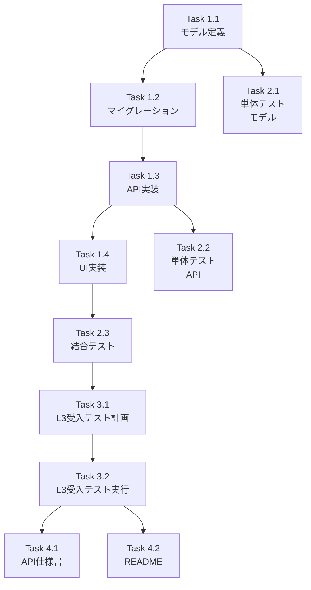

# 作業計画立案スキル（Issue単位）

## 概要
Issue単位での具体的な作業計画を立案し、実装タスクの詳細化とスケジュールを策定するスキルです。

## 使用方法
- `/work-plan [Issue番号または概要]`
- 「Issue #123の作業計画を立案してください」

## 前提条件
- Featureは既にIssueに分割済み（`/issue-split`で実施）
- 対象Issueの概要と要件が明確

## 実行内容

あなたはテックリードです。1つのIssue実装のための具体的な作業計画を立案してください：

### 1. Issue概要の確認

```markdown
## Issue: [タイトル]
**Issue番号**: #XXX
**サイズ**: S/M/L
**作業見積**: [X]時間
**優先度**: High/Medium/Low
**依存Issue**: #YYY（あれば）
```

### 2. 詳細タスク分解

#### 実装タスク（Phase 1）
- [ ] **Task 1.1**: データモデル定義
  - 所要時間: 2時間
  - 成果物: `models/user.py`
  - 依存: なし

- [ ] **Task 1.2**: データベースマイグレーション
  - 所要時間: 1時間
  - 成果物: `migrations/001_add_user_profile.sql`
  - 依存: Task 1.1

- [ ] **Task 1.3**: API エンドポイント実装
  - 所要時間: 4時間
  - 成果物: `api/profile.py`
  - 依存: Task 1.2

- [ ] **Task 1.4**: UI コンポーネント実装
  - 所要時間: 3時間
  - 成果物: `components/ProfileView.tsx`
  - 依存: Task 1.3

#### テストタスク（Phase 2: TDD - CI実行可能）
- [ ] **Task 2.1**: 単体テスト（モデル）
  - 所要時間: 2時間
  - 成果物: `tests/unit/test_user.py`
  - カバレッジ目標: 95%

- [ ] **Task 2.2**: 単体テスト（API）
  - 所要時間: 3時間
  - 成果物: `tests/unit/test_profile_api.py`
  - カバレッジ目標: 90%

- [ ] **Task 2.3**: 結合テスト
  - 所要時間: 2時間
  - 成果物: `tests/integration/test_profile_flow.py`
  - シナリオ数: 3

#### 受入テストタスク（Phase 3: L3ローカル受入テスト）【必須】

**重要**: L3受入テストは**実際のサービスを起動してAPIを叩く**実践的なテストです。
スキップ可能な条件: `docs-only`, `internal`, `test-only`, `ci-only` ラベル付与時のみ

- [ ] **Task 3.1**: L3受入テスト計画
  - 所要時間: 0.5時間
  - 成果物: 受入テストシナリオ（具体的なcurlコマンド）

- [ ] **Task 3.2**: L3受入テスト実行
  - 所要時間: 1時間
  - 成果物: `tests/acceptance/test_issue_XXX_acceptance.sh`
  - **必須内容**:
    - サービス起動確認（ヘルスチェック）
    - 実際のAPIエンドポイント呼び出し
    - 外部サービス連携確認（該当する場合）
    - エビデンス収集

#### ドキュメントタスク（Phase 4）
- [ ] **Task 4.1**: API仕様書更新
  - 所要時間: 1時間
  - 成果物: `docs/api/profile.md`

- [ ] **Task 4.2**: README更新
  - 所要時間: 0.5時間
  - 成果物: `README.md`

### 3. タスク依存関係



### 4. 作業スケジュール

#### 日次計画

**Day 1 (6時間)**
- 09:00-11:00: Task 1.1（モデル定義）
- 11:00-12:00: Task 1.2（マイグレーション）
- 13:00-17:00: Task 1.3（API実装）

**Day 2 (7時間)**
- 09:00-12:00: Task 1.4（UI実装）
- 13:00-15:00: Task 2.1（単体テスト・モデル）
- 15:00-18:00: Task 2.2（単体テスト・API）

**Day 3 (3.5時間)**
- 09:00-11:00: Task 2.3（結合テスト）
- 11:00-12:00: Task 3.1（API仕様書）
- 13:00-13:30: Task 3.2（README）
- 13:30-15:00: コードレビュー準備、PR作成

**総作業時間**: 16.5時間（約2.5日）

### 5. チェックポイント

| タイミング | 確認事項 | 対応 |
|-----------|---------|------|
| Task 1.2完了時 | マイグレーション動作確認 | ローカルDB確認 |
| Task 1.4完了時 | UI動作確認 | 手動テスト実施 |
| Phase 2完了時 | カバレッジ目標達成 | 未達の場合追加テスト |
| PR作成前 | CI/CDパス | エラー時は修正 |

### 6. リスクと対策

| リスク | 発生確率 | 影響 | 対策 |
|-------|---------|------|------|
| 外部APIレスポンス遅延 | 中 | 実装遅延2時間 | モックAPI先行実装 |
| UIデザイン仕様不明確 | 低 | 実装遅延1時間 | デザイナーと事前確認 |
| テストデータ不足 | 中 | テスト遅延1時間 | フィクスチャ事前準備 |

### 7. 成果物チェックリスト

#### コード
- [ ] `models/user.py`
- [ ] `migrations/001_add_user_profile.sql`
- [ ] `api/profile.py`
- [ ] `components/ProfileView.tsx`

#### テスト
- [ ] `tests/unit/test_user.py`
- [ ] `tests/unit/test_profile_api.py`
- [ ] `tests/integration/test_profile_flow.py`

#### ドキュメント
- [ ] `docs/api/profile.md`
- [ ] `README.md`更新

### 8. L3受入テスト計画（具体的なコマンド）【必須セクション】

**重要**: このセクションは必ず**具体的なcurlコマンド**を記載すること。
抽象的な説明（「APIを叩く」等）は不可。

#### Step 1: サービス起動確認

```bash
# サービス起動
./scripts/dev-start.sh

# ヘルスチェック（必須）
curl -sf http://localhost:8104/health && echo "✅ expertAgent: healthy"
curl -sf http://localhost:8103/health && echo "✅ myVault: healthy"
# 必要に応じて追加
```

#### Step 2: 実際のAPIエンドポイント呼び出し

```bash
# 正常系テスト（具体的なエンドポイントとパラメータを記載）
curl -s -X POST http://localhost:8104/v1/[endpoint] \
  -H "Content-Type: application/json" \
  -d '{
    "param1": "value1",
    "param2": "value2"
  }'

# 期待するレスポンス:
# - HTTPステータス: 200
# - レスポンスボディ: {"result": "...", ...}

# 異常系テスト
curl -s -X GET http://localhost:8104/v1/[endpoint]/nonexistent \
  -w "\nHTTP Status: %{http_code}\n"

# 期待するレスポンス:
# - HTTPステータス: 404
# - エラーメッセージ: {"detail": "Not found"}
```

#### Step 3: 外部サービス連携確認（該当する場合）

```bash
# Valkey連携確認
docker exec myswiftagent-valkey redis-cli PING

# Langfuse連携確認
curl -sf http://localhost:3001/api/public/health

# LLM API連携確認（実際のAPIキー必要）
curl -s -X POST http://localhost:8104/v1/aiagent/... \
  -H "Content-Type: application/json" \
  -d '{"prompt": "test"}'
```

#### Step 4: エビデンス収集

```bash
# レスポンスをファイルに保存
curl -s ... > /tmp/acceptance_response.json

# サービスログ確認
tail -50 expertAgent/logs/expertagent.log | grep -E "(ERROR|WARNING|INFO)"
```

---

### 9. Definition of Done

Issue完了条件：
- [ ] すべてのタスクが完了
- [ ] 単体テストカバレッジ90%以上
- [ ] 結合テスト全シナリオパス
- [ ] **L3受入テスト全パス**（実際のサービス起動・API呼び出し確認）
- [ ] CI/CDグリーン
- [ ] コードレビュー承認
- [ ] ドキュメント更新完了
- [ ] フィーチャーフラグ設定（必要な場合）

**L3受入テストスキップ条件**:
以下のラベルが付与されている場合のみスキップ可能:
- `docs-only`: ドキュメントのみの変更
- `internal`: 内部リファクタリング
- `test-only`: テストコードのみの変更
- `ci-only`: CI/CD設定のみの変更

### 10. 次のアクション

作業計画承認後：
1. **ブランチ作成**: `issue/XXX-[feature-name]`
2. **worktree作成**: 別セッションで作業開始
3. **タスク実行**: 計画に従って実装
4. **進捗報告**: `/progress-report`で定期報告

## 出力フォーマット

GitHub Issueのコメントやプロジェクト管理ツールに転記可能なMarkdown形式。