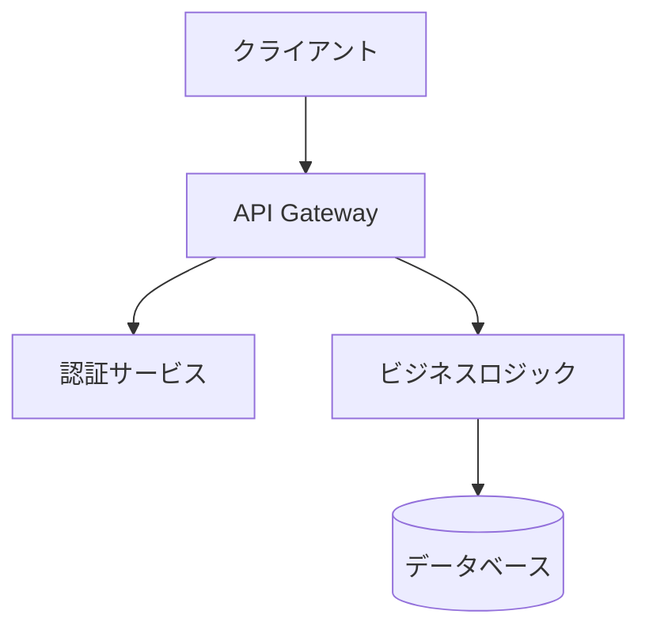
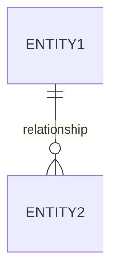

# 設計方針作成スキル

アーキテクチャ設計、技術選定、設計判断を支援します。

## 適用条件

以下のキーワード・文脈で自動的に適用：
- 設計方針、アーキテクチャ設計
- 技術選定、フレームワーク選定
- データモデル設計、ER図
- API設計、エンドポイント設計
- システム構成図
- 設計パターンの適用

## 実行内容

ソフトウェアアーキテクトとして、以下の手順で設計方針を策定：

### 0. 現状調査（必須）

設計方針を作成する前に、必ず以下の現状調査を実施：

#### Issue情報の取得
Issue番号が指定された場合：
```bash
gh issue view [Issue番号] --json title,body,labels,assignees
```

#### 関連ドキュメントの確認
対象プロジェクトに応じて必須ドキュメントを読み込み：
- expertAgent: `expertAgent/docs/API_REFERENCE.md`
- graphAiServer: `graphAiServer/docs/GRAPHAI_WORKFLOW_GENERATION_RULES.md`
- myAgentDesk: `myAgentDesk/README.md`
- 全サービス: `docs/arch/service-dependencies.md`

#### 既存アーキテクチャの調査
Task tool (subagent_type=Explore) を使用：
- 既存のアーキテクチャパターン
- 類似機能の設計
- モジュール間の依存関係
- 既存のAPI設計パターン

### 1. アーキテクチャ設計

#### システム構成図


#### レイヤー構成
- プレゼンテーション層
- ビジネスロジック層
- データアクセス層
- インフラストラクチャ層

### 2. 技術選定

| カテゴリ | 選定技術 | 選定理由 | 既存との整合性 |
|---------|---------|---------|---------------|
| 言語/フレームワーク | | | |
| データベース | | | |
| キャッシュ | | | |
| メッセージング | | | |

### 3. 設計パターン

既存コードベースで使用されているパターンを優先的に採用：
- Repository パターン
- Factory パターン
- Observer パターン

### 4. データモデル設計

#### ER図


### 5. API設計

- エンドポイント設計（既存の命名規則に従う）
- リクエスト/レスポンス形式
- エラーハンドリング

### 6. セキュリティ設計

- 認証/認可方式
- データ暗号化
- 脆弱性対策

### 7. パフォーマンス設計

- キャッシング戦略
- 非同期処理
- スケーリング方針

### 8. 設計上の決定事項とトレードオフ

- 採用した設計の理由
- 代替案との比較
- 想定されるリスクと対策

## 制約条件

CLAUDE.mdの以下の原則に準拠：
- SOLID原則
- KISS原則
- YAGNI原則
- DRY原則

## 出力形式

設計方針書（design-policy.md）形式。図表を含む構造化されたMarkdownドキュメント。

出力先: `dev-reports/feature/issue/{issue_number}/design-policy.md`

## 注意事項

1. **現状調査は必須**: 調査をスキップして設計方針を作成しないこと
2. **既存パターンの優先**: 新規パターン導入は既存で対応不可能な場合のみ
3. **整合性の確保**: 既存のAPI設計、データモデル、命名規則との一貫性を維持
4. **ドキュメント参照の明記**: 参照したドキュメントを設計方針書に記載
5. **トレードオフの明示**: 設計判断の根拠と代替案を明記
