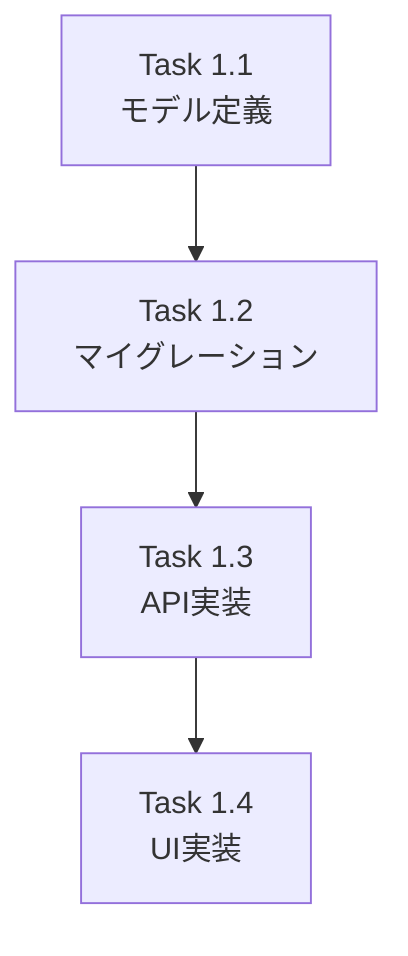

# 作業計画立案スキル

Issue単位での具体的な作業計画を立案し、実装タスクの詳細化とスケジュールを策定します。

## 適用条件

以下のキーワード・文脈で自動的に適用：
- 作業計画、実装計画
- タスク分解、タスク詳細化
- スケジュール立案
- Issue実装計画
- 工数見積もり

## 前提条件

- Featureは既にIssueに分割済み（`/issue-split`で実施）
- 対象Issueの概要と要件が明確

## 実行内容

テックリードとして、1つのIssue実装のための具体的な作業計画を立案：

### 1. Issue概要の確認

```markdown
## Issue: [タイトル]
**Issue番号**: #XXX
**サイズ**: S/M/L
**作業見積**: [X]時間
**優先度**: High/Medium/Low
**依存Issue**: #YYY（あれば）
```

### 2. 詳細タスク分解

#### 実装タスク（Phase 1）
- データモデル定義
- データベースマイグレーション
- API エンドポイント実装
- UI コンポーネント実装

#### テストタスク（Phase 2: TDD - CI実行可能）
- 単体テスト（モデル）
- 単体テスト（API）
- 結合テスト

#### 受入テストタスク（Phase 3: L3ローカル受入テスト）【必須】
- L3受入テスト計画
- L3受入テスト実行

#### ドキュメントタスク（Phase 4）
- API仕様書更新
- README更新

### 3. タスク依存関係



### 4. 作業スケジュール

日次計画を立案

### 5. チェックポイント

| タイミング | 確認事項 | 対応 |
|-----------|---------|------|
| Task完了時 | 動作確認 | テスト実施 |
| Phase完了時 | 品質基準達成 | レビュー |

### 6. リスクと対策

| リスク | 発生確率 | 影響 | 対策 |
|-------|---------|------|------|
| 技術的リスク | | | |

### 7. 成果物チェックリスト

#### コード
- 実装ファイル一覧

#### テスト
- テストファイル一覧

#### ドキュメント
- ドキュメント一覧

### 8. L3受入テスト計画【必須セクション】

**重要**: 具体的なcurlコマンドを記載

```bash
# サービス起動確認
curl -sf http://localhost:8104/health && echo "✅ healthy"

# 正常系テスト
curl -s -X POST http://localhost:8104/v1/[endpoint] \
  -H "Content-Type: application/json" \
  -d '{"param": "value"}'
```

### 9. Definition of Done

Issue完了条件：
- すべてのタスクが完了
- 単体テストカバレッジ90%以上
- L3受入テスト全パス
- CI/CDグリーン
- コードレビュー承認

## 出力形式

出力先: `dev-reports/feature/issue/{issue_number}/work-plan.md`

GitHub Issueのコメントやプロジェクト管理ツールに転記可能なMarkdown形式。

## 明示的呼び出し

スラッシュコマンドでも呼び出し可能：
```
/work-plan [Issue番号]
```
