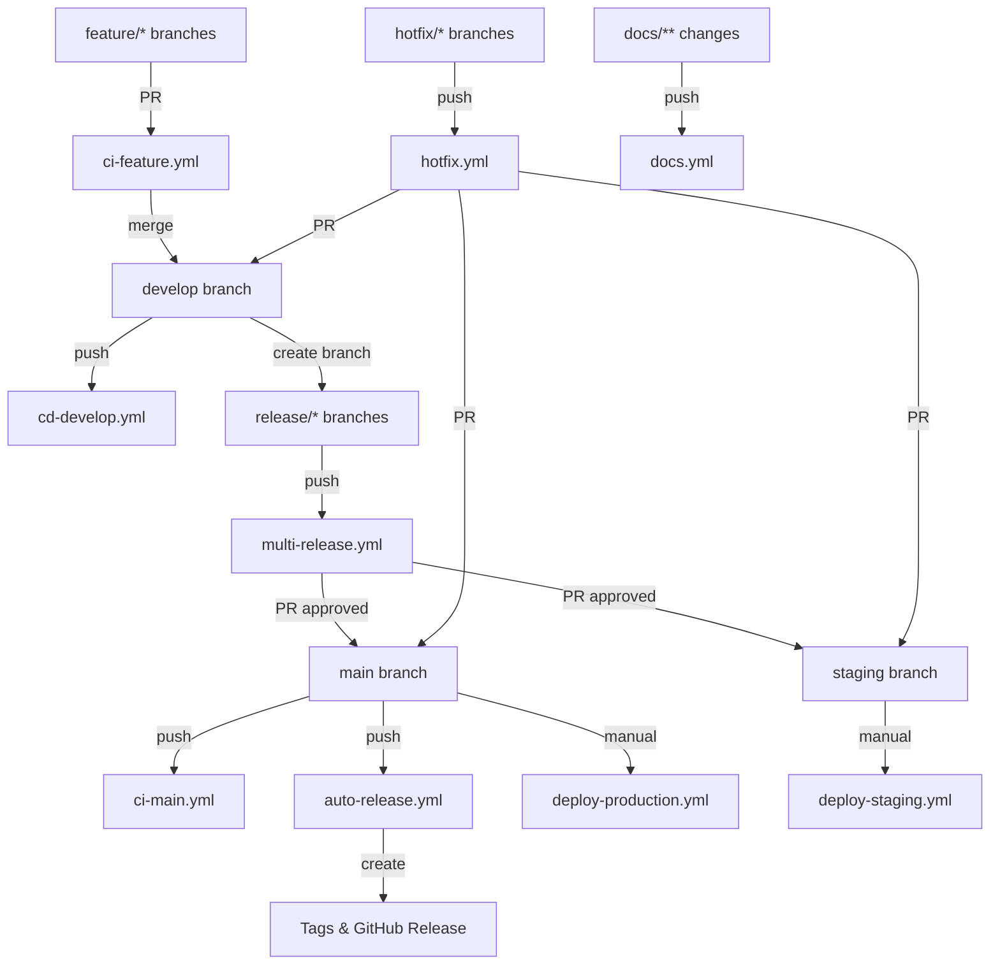

# ブランチ保護設定

このドキュメントでは、MySwiftAgentプロジェクトで推奨されるGitHubブランチ保護設定について説明します。

## 📋 ワークフロー構成

### 現在のワークフロー一覧

| ワークフロー | トリガー | 目的 | 状態 |
|-------------|----------|------|------|
| `ci-feature.yml` | feature/*, fix/*, refactor/*, test/*, vibe/* ブランチへのPR<br>→ developブランチ<br>**（docs/** を除外） | フィーチャーブランチの品質チェック・テスト実行 | 🟢 有効 |
| `cd-develop.yml` | developブランチへのpush<br>**（docs/** を除外） | 開発統合環境への自動デプロイ・統合テスト | 🟢 有効 |
| `ci-main.yml` | mainブランチへのpush<br>**（docs/** を除外） | 本番品質チェック・セキュリティ検証 | 🟢 有効 |
| `multi-release.yml` | release/* ブランチへのpush<br>staging/mainブランチへのPR<br>workflow_dispatch | **マルチプロジェクト対応リリース品質保証**<br>バージョン管理・QA・承認ゲート | 🟢 有効 |
| `auto-release.yml` | mainブランチへのpush<br>workflow_dispatch | **自動タグ作成・GitHub Release生成**<br>変更プロジェクト自動検出 | 🟢 有効 |
| `hotfix.yml` | hotfix/* ブランチへのpush<br>main/staging/developブランチへのPR<br>**docs変更時は軽量実行** | 緊急修正の品質チェック・バージョン管理 | 🟢 有効 |
| `docs.yml` | docs/** の変更時<br>**全ブランチ対応** | **ドキュメント専用軽量処理**<br>Markdownlinting・構造検証 | 🟢 有効 |
| `deploy-production.yml` | workflow_dispatch（手動実行のみ） | 本番環境への手動デプロイ | 🟡 手動 |
| `deploy-staging.yml` | workflow_dispatch（手動実行のみ） | ステージング環境への手動デプロイ | 🟡 手動 |

### ワークフロー依存関係



## 🔒 推奨ブランチ保護設定

### main ブランチ

**トリガーされるワークフロー:**
- `ci-main.yml`: 本番品質チェック
- `auto-release.yml`: 自動タグ作成・GitHub Release生成

```json
{
  "required_status_checks": {
    "strict": true,
    "contexts": [
      "Test Suite (myscheduler)",
      "Test Suite (jobqueue)",
      "Test Suite (commonUI)",
      "Security Verification",
      "Main Branch Quality Verification",
      "Build Verification",
      "Quality Check Results"
    ]
  },
  "enforce_admins": true,
  "required_pull_request_reviews": {
    "required_approving_review_count": 2,
    "dismiss_stale_reviews": true,
    "require_code_owner_reviews": true,
    "require_last_push_approval": true
  },
  "restrictions": {
    "users": [],
    "teams": ["core-team"],
    "apps": ["github-actions"]
  },
  "allow_force_pushes": false,
  "allow_deletions": false,
  "block_creations": false,
  "required_conversation_resolution": true
}
```

### staging ブランチ

**トリガーされるワークフロー:**
- `deploy-staging.yml`: ステージング環境への手動デプロイ（workflow_dispatch）

```json
{
  "required_status_checks": {
    "strict": true,
    "contexts": [
      "Test Suite (myscheduler)",
      "Test Suite (jobqueue)",
      "Test Suite (commonUI)",
      "Security Scan (myscheduler)",
      "Security Scan (jobqueue)",
      "Security Scan (commonUI)",
      "Build Release Candidate (myscheduler)",
      "Build Release Candidate (jobqueue)",
      "Build Release Candidate (commonUI)",
      "QA Tests"
    ]
  },
  "enforce_admins": false,
  "required_pull_request_reviews": {
    "required_approving_review_count": 1,
    "dismiss_stale_reviews": true,
    "require_code_owner_reviews": false,
    "require_last_push_approval": false
  },
  "restrictions": {
    "users": [],
    "teams": ["release-team"],
    "apps": ["github-actions"]
  },
  "allow_force_pushes": false,
  "allow_deletions": false,
  "required_conversation_resolution": true
}
```

### develop ブランチ

**トリガーされるワークフロー:**
- `ci-feature.yml`: フィーチャーブランチからのPR時の品質チェック
- `cd-develop.yml`: developブランチへのpush時の統合テスト

```json
{
  "required_status_checks": {
    "strict": true,
    "contexts": [
      "Test Suite (myscheduler)",
      "Test Suite (jobqueue)",
      "Test Suite (commonUI)",
      "Security Scan (myscheduler)",
      "Security Scan (jobqueue)",
      "Security Scan (commonUI)",
      "Build Check (myscheduler)",
      "Build Check (jobqueue)",
      "Build Check (commonUI)",
      "Integration Tests"
    ]
  },
  "enforce_admins": false,
  "required_pull_request_reviews": {
    "required_approving_review_count": 1,
    "dismiss_stale_reviews": true,
    "require_code_owner_reviews": false,
    "require_last_push_approval": false
  },
  "restrictions": null,
  "allow_force_pushes": false,
  "allow_deletions": false,
  "required_conversation_resolution": true
}
```

## 🛠️ 設定手順

### GitHub UI での設定

1. **リポジトリ設定へ移動**
   - Settings → Branches

2. **ブランチ保護ルール追加**
   - "Add rule" をクリック
   - ブランチ名パターンを入力（例: `main`）

3. **保護設定を有効化**
   - 上記の推奨設定に従って各オプションを設定

### GitHub CLI での設定

```bash
# main ブランチの保護設定
gh api repos/:owner/:repo/branches/main/protection \
  --method PUT \
  --field required_status_checks='{"strict":true,"contexts":["Test Suite","Security Scan","Build Release Candidate","QA Tests"]}' \
  --field enforce_admins=true \
  --field required_pull_request_reviews='{"required_approving_review_count":2,"dismiss_stale_reviews":true,"require_code_owner_reviews":true,"require_last_push_approval":true}' \
  --field restrictions='{"users":[],"teams":["core-team"],"apps":["github-actions"]}' \
  --field allow_force_pushes=false \
  --field allow_deletions=false \
  --field required_conversation_resolution=true

# staging ブランチの保護設定
gh api repos/:owner/:repo/branches/staging/protection \
  --method PUT \
  --field required_status_checks='{"strict":true,"contexts":["Test Suite","Integration Tests","Security Scan"]}' \
  --field enforce_admins=false \
  --field required_pull_request_reviews='{"required_approving_review_count":1,"dismiss_stale_reviews":true}' \
  --field restrictions='{"users":[],"teams":["release-team"],"apps":["github-actions"]}' \
  --field allow_force_pushes=false \
  --field allow_deletions=false \
  --field required_conversation_resolution=true

# develop ブランチの保護設定
gh api repos/:owner/:repo/branches/develop/protection \
  --method PUT \
  --field required_status_checks='{"strict":true,"contexts":["Test Suite","Security Scan","Build Check"]}' \
  --field enforce_admins=false \
  --field required_pull_request_reviews='{"required_approving_review_count":1,"dismiss_stale_reviews":true}' \
  --field restrictions=null \
  --field allow_force_pushes=false \
  --field allow_deletions=false \
  --field required_conversation_resolution=true
```

## 👥 チーム・権限設定

### 推奨チーム構成

1. **core-team**
   - main ブランチへの直接アクセス権限
   - 緊急時の管理者権限オーバーライド可能

2. **release-team**
   - staging ブランチへのアクセス権限
   - リリース管理担当

3. **developers**
   - develop ブランチへのPR作成権限
   - feature ブランチでの開発作業

### CODEOWNERS ファイル

`.github/CODEOWNERS` ファイルを作成して、コードレビューの責任者を定義：

```
# Global owners
* @core-team

# CI/CD workflows
/.github/workflows/ @core-team @devops-team

# Application code
/myscheduler/ @core-team @backend-team

# Infrastructure
/docker/ @devops-team
/kubernetes/ @devops-team

# Documentation
/docs/ @core-team
*.md @core-team
```

## 🚨 緊急時の対応

### ホットフィックス用の一時的権限

緊急時（ホットフィックス）には、以下の手順で一時的に保護を緩和：

1. **緊急承認環境の設定**
   ```yaml
   emergency-approval:
     if: contains(github.ref, 'hotfix/')
     environment: emergency-approval
   ```

2. **管理者による一時的オーバーライド**
   - Settings → Branches → Edit rule
   - "Include administrators" を一時的に無効化
   - 作業完了後に再有効化

## 📋 チェックリスト

### 初期設定

- [ ] main ブランチ保護設定完了
- [ ] staging ブランチ保護設定完了
- [ ] develop ブランチ保護設定完了
- [ ] CODEOWNERS ファイル作成
- [ ] チーム作成・権限設定
- [ ] ステータスチェック設定

### 定期確認

- [ ] 保護設定の有効性確認（月次）
- [ ] チームメンバー権限確認（四半期）
- [ ] ステータスチェック項目見直し（リリース時）
- [ ] 緊急時手順の確認・テスト（年次）

## 🔍 トラブルシューティング

### よくある問題

1. **ステータスチェック失敗**
   ```bash
   # CI状態確認
   gh pr checks

   # 特定ワークフロー再実行
   gh workflow run ci-feature.yml
   ```

2. **レビュー承認不足**
   - 必要な承認者数の確認
   - CODEOWNERS 設定の確認

3. **管理者権限でのオーバーライド**
   ```bash
   # 緊急時の一時的設定変更
   gh api repos/:owner/:repo/branches/main/protection \
     --method PUT \
     --field enforce_admins=false
   ```

### 設定確認コマンド

```bash
# 現在の保護設定確認
gh api repos/:owner/:repo/branches/main/protection

# ブランチ一覧と保護状態
gh api repos/:owner/:repo/branches --jq '.[] | {name: .name, protected: .protected}'

# 最近のPR状態確認
gh pr list --state all --limit 10
```