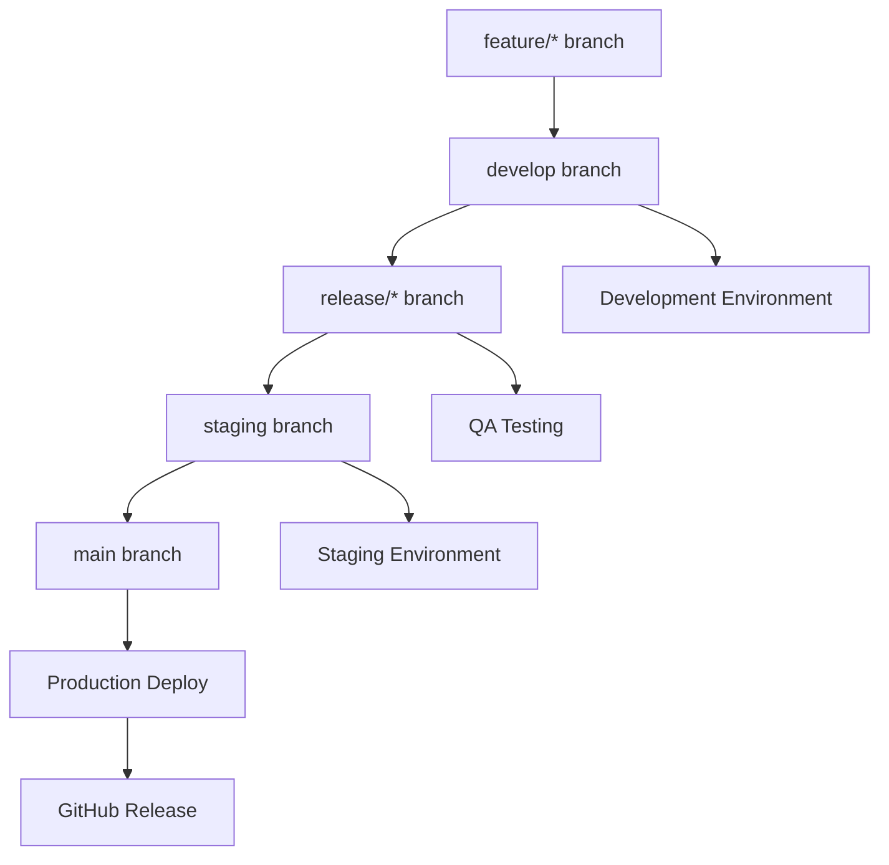
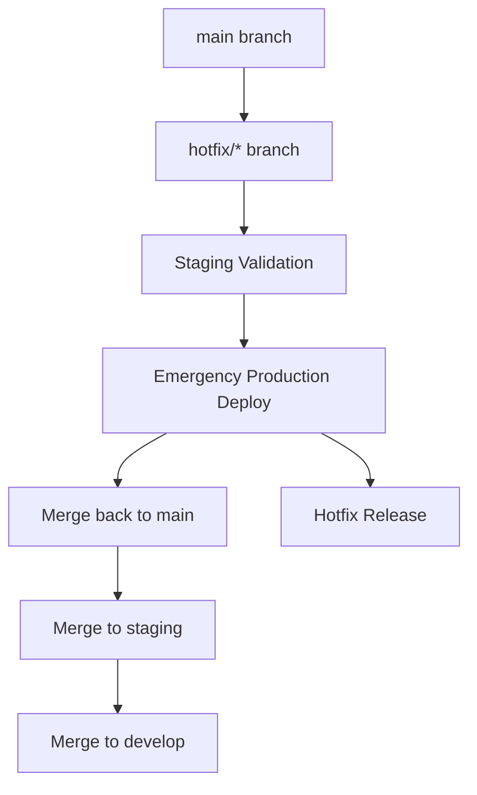

# CI/CDワークフロー概要

このドキュメントは、MySwiftAgentプロジェクトのGitHub ActionsによるCI/CDパイプラインについて説明します。

## 🌿 ブランチ戦略に基づくワークフロー

### ワークフロー構成

| ワークフロー | トリガー | 目的 |
|-------------|----------|------|
| `ci-feature.yml` | feature/*, fix/*, refactor/*, test/*, vibe/* ブランチへのpush<br>developブランチへのPR | CI/テスト実行 |
| `cd-develop.yml` | developブランチへのpush | 開発環境への継続的デプロイ |
| `release.yml` | release/* ブランチへのpush<br>staging/mainブランチへのPR | リリース準備・QA |
| `deploy-staging.yml` | stagingブランチへのpush<br>手動実行 | ステージング環境デプロイ |
| `deploy-production.yml` | mainブランチへのpush<br>手動実行 | 本番環境デプロイ |
| `hotfix.yml` | hotfix/* ブランチへのpush<br>main/staging/developブランチへのPR | 緊急修正対応 |

## 🔄 デプロイメントフロー

### 通常リリースフロー



### ホットフィックスフロー



## 📋 各ワークフローの詳細

### CI - Feature/Fix Branches (`ci-feature.yml`)

**トリガー**:
- `feature/*`, `fix/*`, `refactor/*`, `test/*`, `vibe/*` ブランチへのpush
- `develop` ブランチへのPull Request

**実行内容**:
1. **Test Suite**: リント、型チェック、テスト実行
2. **Security Scan**: Trivyによる脆弱性スキャン
3. **Build Check**: パッケージビルド、Dockerイメージビルド・テスト

### CD - Develop Integration (`cd-develop.yml`)

**トリガー**:
- `develop` ブランチへのpush

**実行内容**:
1. **Test Suite**: 全テスト実行
2. **Integration Tests**: 結合テスト
3. **Build and Push**: Dockerイメージビルド・プッシュ
4. **Deploy Dev**: 開発環境デプロイ
5. **Notify**: Slack通知

### Release Workflow (`release.yml`)

**トリガー**:
- `release/*` ブランチへのpush
- `staging`, `main` ブランチへのPR

**実行内容**:
1. **Validate Release**: バージョン形式検証
2. **Test Suite**: 全テスト + セキュリティスキャン
3. **Build Release**: リリース候補イメージビルド
4. **QA Tests**: QA・パフォーマンステスト
5. **Approval Gate**: 手動承認（PR時）
6. **Create Release Notes**: リリースノート自動生成

### Deploy to Staging (`deploy-staging.yml`)

**トリガー**:
- `staging` ブランチへのpush
- 手動実行（workflow_dispatch）

**実行内容**:
1. **Validate Staging**: デプロイ前検証
2. **Pre-deployment Tests**: クリティカルテスト
3. **Deploy Staging**: ステージング環境デプロイ
4. **Post-deployment Tests**: デプロイ後検証
5. **Auto-update Notification**: 自動アップデート通知
6. **Rollback**: 失敗時ロールバック

### Deploy to Production (`deploy-production.yml`)

**トリガー**:
- `main` ブランチへのpush
- 手動実行（緊急時テストスキップ可能）

**実行内容**:
1. **Validate Production**: 本番デプロイ検証
2. **Pre-deployment Tests**: 本番前テスト
3. **Backup Production**: 本番環境バックアップ
4. **Deploy Production**: Blue-Greenデプロイ
5. **Post-deployment Verification**: デプロイ後検証
6. **Create Release**: GitHub Release作成
7. **Rollback**: 失敗時緊急ロールバック

### Hotfix Workflow (`hotfix.yml`)

**トリガー**:
- `hotfix/*` ブランチへのpush
- `main`, `staging`, `develop` ブランチへのPR

**実行内容**:
1. **Validate Hotfix**: ホットフィックス検証
2. **Emergency Tests**: 最小限のクリティカルテスト
3. **Build Hotfix**: ホットフィックスイメージビルド
4. **Deploy Hotfix Staging**: ステージング検証デプロイ
5. **Emergency Approval**: 緊急承認（PR時）
6. **Deploy Hotfix Production**: 本番緊急デプロイ
7. **Merge Back**: 全ブランチへのマージバック
8. **Create Hotfix Release**: ホットフィックスリリース作成

## 🔒 セキュリティ・品質ゲート

### 必須チェック項目

1. **コード品質**
   - Ruff リンター
   - MyPy 型チェック
   - テストカバレッジ

2. **セキュリティ**
   - Trivy 脆弱性スキャン
   - 依存関係セキュリティチェック

3. **機能検証**
   - 単体テスト
   - 結合テスト
   - スモークテスト

### 承認ゲート

- **Release Approval**: リリース前の手動承認
- **Emergency Approval**: ホットフィックスの緊急承認
- **Production Environment**: 本番環境デプロイ保護

## 🚀 デプロイメント戦略

### 開発環境
- **自動デプロイ**: develop ブランチマージ時
- **イメージタグ**: `develop-<sha>`

### ステージング環境
- **自動デプロイ**: staging ブランチマージ時
- **手動デプロイ**: 指定バージョンでの実行可能
- **自動アップデート**: 対象クライアントへの通知

### 本番環境
- **Blue-Green デプロイ**: ダウンタイム最小化
- **自動ロールバック**: 異常検知時の即座復旧
- **バックアップ**: デプロイ前の自動バックアップ

## 📊 モニタリング・通知

### 通知チャネル
- **Slack**: 各段階の成功・失敗通知
- **GitHub**: リリース・ホットフィックス情報
- **監視システム**: パフォーマンスメトリクス

### 失敗時対応
1. **自動ロールバック**: 本番・ステージング環境
2. **緊急通知**: Slack緊急チャネル
3. **ログ保存**: デバッグ用アーティファクト

## ⚙️ 環境変数・シークレット

### 必要なシークレット
- `GITHUB_TOKEN`: 自動設定（Actions権限）
- `SLACK_WEBHOOK_URL`: 通常通知用
- `SLACK_EMERGENCY_WEBHOOK_URL`: 緊急通知用

### 環境別設定
- **development**: 開発環境設定
- **staging**: ステージング環境保護
- **production**: 本番環境保護
- **release-approval**: リリース承認
- **emergency-approval**: 緊急承認

## 🛠️ トラブルシューティング

### よくある問題

1. **テスト失敗**
   - ログの確認: Actions タブ → 失敗したジョブ
   - ローカル実行: `make check-all`

2. **デプロイ失敗**
   - 自動ロールバック確認
   - 手動ロールバック: 環境ごとのロールバック手順

3. **ブランチ保護**
   - PR必須設定の確認
   - レビュー承認の確認

### 手動操作

```bash
# 緊急時の手動デプロイ
gh workflow run deploy-production.yml -f version=v1.2.3 -f skip_tests=true

# ホットフィックス作成
git checkout main
git pull
git checkout -b hotfix/urgent-fix
# 修正作業...
git push origin hotfix/urgent-fix
```