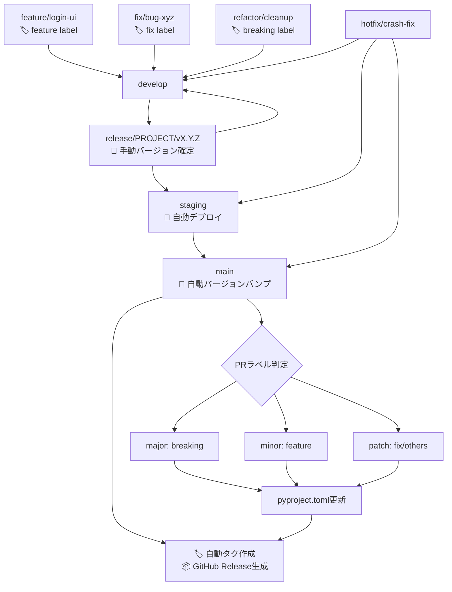

# CI/CD品質保証ワークフロー概要

このドキュメントは、MySwiftAgentプロジェクトのGitHub Actionsによる品質重視のCI/CDパイプラインについて説明します。
**マルチプロジェクト対応のリリースフローと自動バージョン管理機能を実装しています。**

## 🏗️ プロジェクト構成

MySwiftAgentは複数のマイクロサービスを含むモノレポ構成です：

| プロジェクト | 目的 | 技術スタック | リリース状況 |
|-------------|------|-------------|-------------|
| `myscheduler` | ジョブスケジューリング | FastAPI + APScheduler + SQLAlchemy | ✅ 本番運用中 |
| `jobqueue` | ジョブキュー管理 | FastAPI + Redis/PostgreSQL | 🚀 初回リリース準備中 |
| `docs` | プロジェクトドキュメント | Markdown + 静的サイトジェネレータ | 📝 軽量ワークフロー対応 |

## 🌿 ブランチ戦略に基づくワークフロー

### ワークフロー構成

| ワークフロー | トリガー | 目的 | 状態 |
|-------------|----------|------|------|
| `ci-feature.yml` | feature/*, fix/*, refactor/*, test/*, vibe/* ブランチへのpush<br>developブランチへのPR<br>**（docs/** を除外） | 品質チェック・テスト実行 | 🟢 有効 |
| `cd-develop.yml` | developブランチへのpush<br>**（docs/** を除外） | 統合品質チェック | 🟢 有効 |
| `multi-release.yml` | release/* ブランチへのpush<br>staging/mainブランチへのPR<br>workflow_dispatch | **マルチプロジェクト対応リリース品質保証**<br>**docs専用バリデーション追加** | 🟢 有効 |
| `ci-main.yml` | mainブランチへのpush<br>**（docs/** を除外） | 本番品質チェック | 🟢 有効 |
| `hotfix.yml` | hotfix/* ブランチへのpush<br>main/staging/developブランチへのPR<br>**docs変更時は軽量実行** | 緊急修正品質チェック | 🟢 有効 |
| `docs.yml` | docs/** の変更時<br>**全ブランチ対応** | **ドキュメント専用軽量処理**<br>Markdownlinting・構造検証・バージョン管理 | 🆕 **新規追加** |

## 🔄 マルチプロジェクト対応デプロイメントフロー

### 標準リリースフロー（自動バージョン管理対応）



### リリースブランチ命名規則

| 形式 | 例 | 対象プロジェクト | 備考 |
|------|---|-----------------|------|
| `release/{project}/vX.Y.Z` | `release/myscheduler/v1.2.0`<br/>`release/jobqueue/v0.1.0` | 指定プロジェクト | **単一プロジェクト** |
| `release/multi/vYYYY.MM.DD` | `release/multi/v2025.09.30` | 複数プロジェクト同時 | **マルチプロジェクト** |
| `release/vX.Y.Z` | `release/v1.2.0` | myscheduler | レガシー形式（後方互換） |

### プロジェクト別リリースフロー

#### 1. **Workflow Dispatch** によるリリース

##### 単一プロジェクトリリース

```bash
# GitHub Actions UIから実行、または以下のコマンド
gh workflow run multi-release.yml \
  -f projects="myscheduler" \
  -f release_type=minor

# 入力パラメータ：
# - projects: リリースするプロジェクト（単一）
# - release_type: major / minor / patch / custom
# - custom_version: カスタムバージョン（optional）
```

##### マルチプロジェクトリリース（🆕 新機能）

```bash
# 複数プロジェクトを同時にリリース
gh workflow run multi-release.yml \
  -f projects="myscheduler,jobqueue,commonUI" \
  -f release_type=minor

# または日付ベースのバージョン
gh workflow run multi-release.yml \
  -f projects="myscheduler,jobqueue" \
  -f release_type=custom \
  -f custom_version="2025.09.30"
```

**自動生成されるもの:**
- リリースブランチ: `release/multi/v2025.09.30`
- 各プロジェクトの pyproject.toml バージョン更新
- 統合PRの作成（staging向け）

**📝 docsプロジェクトの特殊処理:**
- pyproject.tomlが存在しない場合、自動で軽量版を生成
- Docker処理は実行せず、軽量なMarkdownlinting・構造検証のみ実行

#### 2. **手動ブランチ作成** によるリリース

##### 単一プロジェクト

```bash
# 1. developから新しいリリースブランチを作成
git checkout develop
git pull origin develop
git checkout -b release/jobqueue/v0.1.0

# 2. バージョン更新
sed -i 's/^version = ".*"/version = "0.1.0"/' jobqueue/pyproject.toml

# 3. プッシュしてワークフロー開始
git add jobqueue/pyproject.toml
git commit -m "🔖 Bump version to 0.1.0 for jobqueue release"
git push origin release/jobqueue/v0.1.0

# 4. PR作成
gh pr create --title "🚀 Release jobqueue v0.1.0" --base staging
```

##### マルチプロジェクト（🆕 新機能）

```bash
# 1. developから統合リリースブランチを作成
git checkout develop
git pull origin develop
git checkout -b release/multi/v2025.09.30

# 2. 各プロジェクトのバージョン更新
sed -i 's/^version = ".*"/version = "1.3.0"/' myscheduler/pyproject.toml
sed -i 's/^version = ".*"/version = "0.2.0"/' jobqueue/pyproject.toml
sed -i 's/^version = ".*"/version = "0.1.5"/' commonUI/pyproject.toml

# 3. まとめてコミット
git add myscheduler/pyproject.toml jobqueue/pyproject.toml commonUI/pyproject.toml
git commit -m "🔖 Multi-project release v2025.09.30

- myscheduler: v1.3.0
- jobqueue: v0.2.0
- commonUI: v0.1.5"

# 4. プッシュしてPR作成
git push origin release/multi/v2025.09.30
gh pr create \
  --title "🚀 Multi-Project Release v2025.09.30" \
  --base staging
```

## 📋 各ワークフローの詳細

### Release Workflow (`multi-release.yml`) - マルチプロジェクト対応 🆕

**トリガー**:
- `release/*` ブランチへのpush（単一プロジェクト・マルチプロジェクト両対応）
- `staging`, `main` ブランチへのPR
- `workflow_dispatch`（手動実行）

**主要機能**:

#### 1. **自動リリースブランチ作成** (`workflow_dispatch`時)
```yaml
inputs:
  projects: "myscheduler,jobqueue"  # カンマ区切りで複数指定可能
  release_type: [major, minor, patch, custom]
  custom_version: "カスタムバージョン"
```

#### 2. **プロジェクト自動判別**
- **単一プロジェクト**: `release/jobqueue/v0.1.0` → プロジェクト: `jobqueue`, バージョン: `v0.1.0`
- **マルチプロジェクト**: `release/multi/v2025.09.30` → 変更されたプロジェクトを自動検出

#### 3. **実行内容**（マトリックス戦略による並列実行）
1. **Validate Release**: バージョン形式・プロジェクト存在確認（全プロジェクト）
2. **Test Suite**: マトリックス戦略で各プロジェクトを並列テスト
   ```yaml
   strategy:
     matrix:
       project: ${{ fromJson(needs.validate-release.outputs.projects_json) }}
   ```
3. **Documentation Validation**: docsプロジェクト専用軽量バリデーション
4. **Security Scan**: 各プロジェクトの並列脆弱性スキャン
5. **Build Release**: 各プロジェクトのイメージビルド・テスト（並列実行）
6. **QA Tests**: 統合QA・パフォーマンステスト
7. **Approval Gate**: 手動承認（PR時）
8. **Create Release Notes**: プロジェクト別リリースノート生成

### CI - Main Branch Quality Check (`ci-main.yml`)

**トリガー**:
- `main` ブランチへのpush

**実行内容**:
1. **Security Verification**: Trivy脆弱性スキャン
2. **Main Branch Quality Verification**:
   - 依存関係インストール
   - Ruffリンター
   - MyPy型チェック
   - pytest テスト実行（カバレッジ付き）
   - Codecovアップロード
3. **Build Verification**: myschedulerのビルド検証
4. **Quality Check Results**: 結果サマリー

### CI - Feature/Fix Branches (`ci-feature.yml`)

**トリガー**:
- `feature/*`, `fix/*`, `refactor/*`, `test/*`, `vibe/*` ブランチへのpush
- `develop` ブランチへのPull Request
- **📝 docs/** パスは除外（専用ワークフローで処理）

**実行内容**:
1. **Test Suite**: アプリケーションプロジェクト限定テスト（リント、型チェック、テスト実行）
2. **Security Scan**: Trivyによる脆弱性スキャン
3. **Build Check**: パッケージビルド、Dockerイメージビルド・テスト

### CD - Develop Integration (`cd-develop.yml`)

**トリガー**:
- `develop` ブランチへのpush
- **📝 docs/** パスは除外（専用ワークフローで処理）

**実行内容**:
1. **Test Suite**: myscheduler統合テスト
2. **Integration Tests**: 結合テスト
3. **Build and Push**: Dockerイメージビルド（現在コメントアウト）
4. **Notify**: 成功・失敗通知

### 📝 Documentation Workflow (`docs.yml`) - 🆕 新規追加

**トリガー**:
- `docs/**` パスの変更時
- 対応ブランチ: main, develop, hotfix/*, release/*, feature/*, fix/*

**実行内容**:
1. **Validate Documentation**:
   - Markdownファイルのlinting（markdownlint-cli）
   - ドキュメント構造検証
   - リンクチェック（将来対応）
2. **Build Documentation Site**:
   - 静的サイト生成
   - バージョン情報の自動付与（リリースブランチ時）
   - GitHub Pages対応（将来）
3. **Notification**: ドキュメント更新通知

**特徴:**
- **軽量処理**: Docker、Python依存関係、セキュリティスキャンなし
- **高速実行**: ドキュメント変更専用の最適化された処理
- **バージョン対応**: `release/docs/vX.Y.Z` ブランチでバージョン管理

## 🔒 セキュリティ・品質ゲート

### 必須チェック項目

1. **コード品質**
   - Ruff リンター
   - MyPy 型チェック
   - pytest テストカバレッジ

2. **セキュリティ**
   - Trivy 脆弱性スキャン
   - 依存関係セキュリティチェック

3. **機能検証**
   - 単体テスト（pytest）
   - 結合テスト
   - APIエンドポイントテスト

### 承認ゲート

- **Release Approval Environment**: リリース前の手動承認
- **Emergency Approval**: ホットフィックスの緊急承認
- **Production Environment**: 本番環境デプロイ保護

## 🏷️ セマンティックバージョニング自動化

### PRラベル運用ルール

**必須ラベル（自動バージョンバンプ対応）:**
- `breaking` → Major バージョンアップ（例: 1.2.3 → 2.0.0）
- `feature` → Minor バージョンアップ（例: 1.2.3 → 1.3.0）
- `fix` → Patch バージョンアップ（例: 1.2.3 → 1.2.4）

**補助ラベル:**
- `refactor`, `docs`, `test`, `ci` → 基本的にpatch扱い
- `dependencies` → セキュリティ更新時はpatch、機能追加時はminor

### 自動化されるバージョン管理フロー（マルチプロジェクト対応 🆕）

| トリガー | 自動実行内容 | 対象ワークフロー |
|---------|-------------|----------------|
| **PR → `develop`** | ラベル検証、コンベンショナルコミットチェック | `conventional-commits.yml` |
| **PR → `main` (merged)** | **変更プロジェクト自動検出**、個別タグ作成、マルチプロジェクトタグ作成 | `auto-release.yml` 🆕 |
| **`release/*` push** | リリース候補検証、**マトリックス戦略による並列テスト** | `multi-release.yml` 🆕 |
| **GitHub Release published** | 本番・ステージング自動デプロイ | `deploy-on-release.yml` |

**🆕 マルチプロジェクトリリースの動作:**
- **単一プロジェクト変更時**: 個別タグのみ作成 (例: `myscheduler/v1.3.0`)
- **複数プロジェクト変更時**:
  - 各プロジェクトの個別タグ作成 (例: `myscheduler/v1.3.0`, `jobqueue/v0.2.0`)
  - マルチプロジェクト統合タグ作成 (例: `multi/v2025.09.30`)
  - 統合リリースノート自動生成

## 🚀 デプロイメント戦略

### プロジェクト別デプロイメント

#### myscheduler
- **本番環境**: 稼働中
- **ステージング**: UAT環境
- **開発環境**: develop統合環境

#### jobqueue
- **本番環境**: 初回リリース準備中
- **ステージング**: 初回リリース検証中
- **開発環境**: 開発中

### 環境別タグ戦略（マルチプロジェクト対応 🆕）

```bash
# 単一プロジェクトタグ形式
{project}/v{version}

# 例:
myscheduler/v1.2.0
jobqueue/v0.1.0
commonUI/v0.1.5

# マルチプロジェクトタグ形式（🆕 新機能）
multi/v{YYYY.MM.DD}

# 例:
multi/v2025.09.30
```

**マルチプロジェクトタグに含まれる情報:**
- 統合リリースノート（全プロジェクトのバージョン情報）
- 各プロジェクトの個別タグへのリンク
- 変更されたプロジェクトの一覧

## 📊 アーティファクト管理

### 自動生成アーティファクト

1. **リリースアーティファクト**
   - 名前: `release-artifacts-{project}-{version}`
   - 内容: `dist/` ディレクトリ（Python wheel/tarball）

2. **リリースノート**
   - 名前: `release-notes-{project}-v{version}`
   - 内容: プロジェクト別変更履歴

3. **テストレポート**
   - カバレッジレポート
   - セキュリティスキャン結果

## 🛠️ トラブルシューティング

### よくある問題

1. **プロジェクト判別エラー**
   ```bash
   # ブランチ名確認
   echo $BRANCH_NAME

   # 正しい形式：
   release/myscheduler/v1.2.0  # ✅
   release/jobqueue/v0.1.0     # ✅
   release/v1.2.0              # ✅（レガシー、myscheduler想定）
   release/invalid             # ❌
   ```

2. **バージョン不整合**
   ```bash
   # pyproject.tomlのバージョン確認
   grep '^version = ' {project}/pyproject.toml

   # 修正方法
   sed -i 's/^version = ".*"/version = "1.2.0"/' {project}/pyproject.toml
   ```

3. **未使用type ignoreエラー**
   ```bash
   # MyPyエラー修正
   uv run mypy app/  # unused-ignore エラー確認
   # 不要な # type: ignore コメントを削除
   ```

### 手動操作

```bash
# マルチプロジェクト リリース作成
gh workflow run multi-release.yml \
  -f projects=jobqueue \
  -f release_type=minor \
  -f custom_version=""

# 緊急ホットフィックス
git checkout main
git pull
git checkout -b hotfix/urgent-security-fix
# 修正作業...
git push origin hotfix/urgent-security-fix

# プロジェクト別 PR作成
gh pr create \
  --title "🚀 Release jobqueue v0.1.0" \
  --body "初回リリース..." \
  --base staging \
  --head release/jobqueue/v0.1.0
```

## 📝 リリースチェックリスト

### リリース前確認事項

- [ ] 対象プロジェクトのテストが全て通過
- [ ] セキュリティスキャンでCRITICAL/HIGHエラーなし
- [ ] バージョン番号がpyproject.tomlと一致
- [ ] リリースノートが自動生成される
- [ ] 適切なPRラベルが付与されている

### リリース後確認事項

- [ ] GitHub Releaseが自動作成されている
- [ ] タグが正しく作成されている（{project}/v{version}）
- [ ] アーティファクトがアップロードされている
- [ ] stagingブランチとmainブランチの同期が完了
- [ ] developブランチにバックポートされている