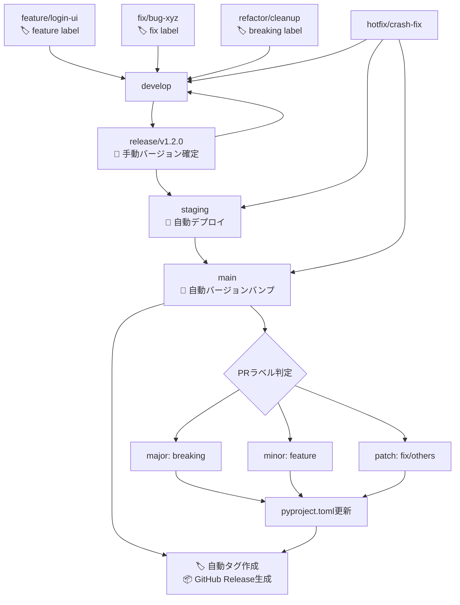

# CLAUDE.md

このファイルは、このリポジトリでコードを扱う際のClaude Code (claude.ai/code) への指針を提供します。

# MySwiftAgent

🚀 **MySwiftAgent** は、手軽で小回りの効く **パーソナルAIエージェント／LLMワークフロー** です。
複雑な設定を避けつつ、日常タスクや開発支援をすばやく実行する「自分だけのAIエージェント」を目指しています。

## ✨ 特徴

- ⚡ **Swift**：軽快に動作し、小回りの効く応答
- 🧩 **Extensible**：モジュール的に機能を追加可能
- 🎯 **Personalized**：ユーザーの目的に合わせたカスタマイズ
- 🔄 **Workflow-oriented**：LLMを軸にした柔軟なワークフロー設計

---

## 🚨 重要な参照ドキュメント

開発を開始する前に、以下のドキュメントが該当するか確認してください：

| 状況 | 参照ドキュメント | 必須度 |
|------|----------------|--------|
| **新プロジェクトを追加する** | [NEW_PROJECT_SETUP.md](./docs/procedures/NEW_PROJECT_SETUP.md) | 🔴 必須 |
| **GraphAI ワークフローを開発する** | [GRAPHAI_WORKFLOW_GENERATION_RULES.md](./graphAiServer/docs/GRAPHAI_WORKFLOW_GENERATION_RULES.md) | 🔴 必須 |
| **アーキテクチャを理解する** | [architecture-overview.md](./docs/design/architecture-overview.md) | 🟡 推奨 |
| **環境変数を設定する** | [environment-variables.md](./docs/design/environment-variables.md) | 🟡 推奨 |
| **myVault連携を実装する** | [myvault-integration.md](./docs/design/myvault-integration.md) | 🟡 推奨 |

**重要**: 該当するドキュメントは作業開始前に必ず全文を読み、作業計画書 (`work-plan.md`) に参照を明記してください。

---

# 開発ルール

## 🌿 ブランチ構成

### 🧱 基本ブランチ

| ブランチ名  | 目的                   | 運用ルール                                                                             |
| ----------- | ---------------------- | -------------------------------------------------------------------------------------- |
| `main`      | 本番環境のコードベース | 保護ブランチ。タグ運用（例: `v1.2.0`）。署名付きアプリや公開ビルドに使用。直push禁止。 |
| `develop`   | 開発統合用             | 各 `feature/*` ブランチの統合先。単体・結合テストの対象。直接リリースには使用しない。  |
| `staging`   | UAT・実機確認用        | `release/*` からマージ。自動アップデート対象。                                         |
| `release/*` | リリース準備ブランチ   | `develop` から分岐。最終調整やQA、リリース検証を行う。                                 |

### ✍️ 作業ブランチ（トピックブランチ）

| ブランチ名   | 用途                   | 命名例                     |
| ------------ | ---------------------- | -------------------------- |
| `feature/*`  | 新機能の追加           | `feature/markdown-preview` |
| `fix/*`      | バグ修正               | `fix/window-size-restore`  |
| `refactor/*` | コード構造の改善       | `refactor/ipc-handler`     |
| `test/*`     | 技術検証・PoC          | `test/ipc-benchmark`       |
| `vibe/*`     | AI開発支援・実験的機能 | `vibe/ai-code-generation`  |
| `hotfix/*`   | 本番環境の緊急修正     | `hotfix/urgent-crash-fix`  |

### 📌 ブランチ間マージの原則

当プロジェクトでは、**異なるブランチ間のマージは必ず Pull Request（PR） を通じて行うことを厳守とします。**

#### ✅ 原則ルール（バージョン管理自動化対応）

| 作業元ブランチ | マージ先ブランチ             | 備考                                     | 自動化対応                                     |
| -------------- | ---------------------------- | ---------------------------------------- | ---------------------------------------------- |
| `feature/*`    | `develop`                    | 機能追加PR                               | 🏷️ `feature` ラベル必須（minor bump判定）      |
| `fix/*`        | `develop`                    | バグ修正PR                               | 🏷️ `fix` ラベル（patch bump判定）              |
| `vibe/*`       | `develop`                    | AI開発支援・実験的機能PR                 | 🏷️ 適切なラベル付与必須                       |
| `develop`      | `release/*`                  | リリース準備PR                           | 📝 手動バージョン確定・検証                    |
| `release/*`    | `staging`                    | UAT用PR                                  | 🚀 自動デプロイトリガー                        |
| `release/*`    | `main`                       | 本番リリースPR                           | 🔄 自動バージョンバンプ・タグ・Release作成     |
| `release/*`    | `develop`                    | 差分の開発ブランチ反映PR                 | 🔄 バックポート自動化                          |
| `hotfix/*`     | `main`, `staging`, `develop` | 本番障害対応用PR                         | ⚡ 緊急リリース自動化（patch bump + 即時展開） |

#### 🏷️ PRラベル運用ルール

**必須ラベル（セマンティックバージョニング）:**
- `breaking` → Major バージョンアップ（例: 1.2.3 → 2.0.0）
- `feature` → Minor バージョンアップ（例: 1.2.3 → 1.3.0）
- `fix` → Patch バージョンアップ（例: 1.2.3 → 1.2.4）

**補助ラベル:**
- `refactor`, `docs`, `test`, `ci` → 基本的にpatch扱い
- `dependencies` → セキュリティ更新時はpatch、機能追加時はminor

#### ❌ 禁止事項

- `main`, `release/*`, `staging` への**直push**
- CLI/GitHub UI上での直接マージ（PRを介さない `git merge` 等）

#### ❗ 例外対応

CI障害などによるやむを得ない直マージの必要が生じた場合は、**チーム責任者の承認と事前周知**を行ったうえで対応してください。

### 🔁 マージ戦略とフロー

#### 標準マージフロー（自動バージョン管理対応）



#### バグ修正の方針

| 発生フェーズ   | 修正対象ブランチ                         | 修正後のマージ先             |
| -------------- | ---------------------------------------- | ---------------------------- |
| `release/*`    | `release/*`                              | `staging`, `main`, `develop` |
| `staging`      | `release/*` または `fix/*` → `release/*` | 同上                         |
| `main`（本番） | `hotfix/*`（`main` から作成）            | `main`, `staging`, `develop` |

### 🚀 マルチプロジェクトリリース対応

複数のプロジェクトを同時にリリースする場合の手順：

#### 方法1: Workflow Dispatchによる一括リリース

```bash
# GitHub Actions UIから実行、または以下のコマンド
gh workflow run multi-release.yml \
  -f projects="myscheduler,jobqueue,commonUI" \
  -f release_type=minor
```

**命名規則:**
- **単一プロジェクト**: `release/{project}/vX.Y.Z` (例: `release/myscheduler/v1.3.0`)
- **マルチプロジェクト**: `release/multi/vYYYY.MM.DD` (例: `release/multi/v2025.09.30`)

#### 方法2: 統合featureブランチによる同時更新

```bash
# 1. 統合featureブランチ作成
git checkout develop
git checkout -b feature/cross-project-update

# 2. 複数プロジェクトを同時に修正
vim myscheduler/app/api/common.py
vim jobqueue/app/api/common.py

# 3. まとめてコミット・PR作成
git add myscheduler/ jobqueue/
git commit -m "feat: update cross-project API interface"
gh pr create --base develop --label feature
```

#### 自動リリース検出（auto-release.yml）

mainブランチへのマージ時、変更されたすべてのプロジェクトを自動検出：

**タグ命名規則:** `yyyy.mm.dd.NN/プロジェクト名/バージョン`
- `yyyy.mm.dd`: リリース日（例: 2025.10.05）
- `NN`: その日の連番（01, 02, 03...）
- `プロジェクト名`: expertAgent, myscheduler, jobqueue等
- `バージョン`: vX.Y.Z形式

**例:**
- **単一プロジェクト変更**: `2025.10.05.01/expertAgent/v0.2.1`
- **複数プロジェクト変更**: `2025.10.05.01/myscheduler/v1.3.0`, `2025.10.05.01/jobqueue/v0.2.0`
- **同日2回目のリリース**: `2025.10.05.02/commonUI/v1.0.0`

この命名規則により、以下が一目で分かります：
- ✅ いつ作成されたか（日付）
- ✅ その日の何番目のリリースか（連番）
- ✅ どのプロジェクトか（プロジェクト名）
- ✅ バージョンは何か（セマンティックバージョニング）

---

# 🔧 開発環境・品質担保

## 🐍 Python開発環境

### 環境構築ツール

- **[uv](https://docs.astral.sh/uv/)** を標準の依存関係管理・仮想環境ツールとして採用
- 従来の `pip` + `venv` / `poetry` / `pipenv` は使用しない

### セットアップ手順

```bash
# 1. uvのインストール (初回のみ)
curl -LsSf https://astral.sh/uv/install.sh | sh

# 2. プロジェクトの依存関係同期
uv sync

# 3. 開発サーバー起動
uv run uvicorn app.main:app --reload

# 4. テスト実行
uv run pytest

# 5. 静的解析・フォーマット
uv run ruff check .
uv run ruff format .
uv run mypy .
```

### プロジェクト構成

```
pyproject.toml          # プロジェクト設定・依存関係
.python-version         # Python版数指定
uv.lock                 # ロックファイル (自動生成)
app/                    # アプリケーションコード
├── main.py            # FastAPIエントリーポイント
├── core/              # コア機能 (設定、DB、ワーカー)
├── models/            # データベースモデル
├── schemas/           # Pydanticスキーマ
└── api/               # APIエンドポイント
tests/                  # テストコード
├── unit/              # 単体テスト
├── integration/       # 結合テスト
└── conftest.py        # テスト設定
```

## 🛡️ 品質担保方針

### 原理原則

下記の原理原則従いコード品質を担保すること

- SOLID
  - Single Responsibility Principle (単一責任原則)
  - Open-Closed Principle (開放/閉鎖原則)
  - Liskov Substitution Principle (リスコフの置換原則)
  - Interface Segregation Principle (インターフェース分離の原則)
  - Dependency Inversion Principle (依存性逆転の原則)
- KISS
  - Keep It Simple, Stupid
- YAGNI
  - You Aren't Gonna Need It
- DRY
  - Don't Repeat Yourself

### 静的解析・コード品質

| ツール | 用途 | 設定ファイル | 実行コマンド |
|--------|------|-------------|--------------|
| **Ruff** | Linting + Formatting | `pyproject.toml` | `uv run ruff check .` <br> `uv run ruff format .` |
| **MyPy** | 型チェック | `pyproject.toml` | `uv run mypy .` |

### テスト方針

| テストレベル | 対象 | フレームワーク | カバレッジ目標 | 根拠 |
|-------------|------|-------------|--------------|------|
| **単体テスト (Unit Tests)** | 個別関数・クラス・内部ロジック | pytest | **90%以上** | 内部ロジックの詳細な検証が目的。全パス・全分岐を網羅する |
| **結合テスト (Integration Tests)** | API エンドポイント・統合フロー | pytest + httpx | **50%以上** | エンドポイントの動作確認が主目的。内部ロジックは単体テストでカバー済み |

#### カバレッジ要件の設計思想

**単体テスト (90%要件)**:
- **目的**: 個別関数・クラスの内部ロジックを詳細に検証
- **対象**: ビジネスロジック、ユーティリティ関数、データ処理、エラーハンドリング
- **実行**: `uv run pytest tests/unit/` で実行
- **pyproject.toml設定**: `--cov-fail-under=90` でデフォルト90%を強制

**結合テスト (50%要件)**:
- **目的**: APIエンドポイントの動作確認、統合フロー検証
- **対象**: HTTPリクエスト/レスポンス、認証、エンドポイント間の連携
- **測定範囲**: `--cov=app` でAPIレイヤー (`app/`) のみ測定（`core/` は除外）
- **実行**: `uv run pytest tests/integration/ --cov=app --cov-fail-under=50` で実行（cd-develop.yml）
- **カバレッジが低い理由**:
  - 内部ロジック (`core/`) は既に単体テストで100%近くカバー済み
  - 結合テストはエンドポイント呼び出しのみ実行するため、全コードパスを通らない
  - APIレイヤーのみ測定することで、結合テストの本質（エンドポイント動作確認）に焦点を絞る
  - 低いしきい値（50%）でも統合フロー検証の目的は十分達成できる

**CI/CDでの運用**:
- **Feature/Fix PR (ci-feature.yml)**: 単体テスト + 結合テスト両方実行（90%要件適用）
- **Develop統合 (cd-develop.yml)**:
  - 単体テスト: 90%要件（`--cov=app --cov=core` で全体測定）
  - 結合テスト: 50%要件（`--cov=app` でAPIレイヤーのみ測定、`--cov-fail-under=50`）
- **最終品質保証**: 単体テストと結合テストを組み合わせて全体で90%以上を確保

### 必須チェック項目

**PRマージ前の必須確認事項：**

```bash
# 1. 全テストが通過すること
uv run pytest --cov=app --cov-report=term-missing

# 2. 静的解析エラーがないこと
uv run ruff check .
uv run mypy .

# 3. コードフォーマットが適用済みであること
uv run ruff format . --check

# 4. アプリケーションが正常に起動すること
uv run uvicorn app.main:app --host 0.0.0.0 --port 8000
```

### CI/CD との連携

GitHub Actions で以下を自動実行：

1. **品質チェック** - Linting, 型チェック, フォーマット確認
2. **テスト実行** - 単体・結合テスト + カバレッジ測定
3. **セキュリティ監査** - 脆弱性スキャン
4. **ビルド検証** - アプリケーション起動確認
5. **🔄 バージョン管理自動化** - セマンティックリリース、タグ作成、GitHub Release

#### 📋 自動化されるバージョン管理フロー

| トリガー | 自動実行内容 | 対象ワークフロー |
|---------|-------------|----------------|
| **PR → `develop`** | ラベル検証、コンベンショナルコミットチェック | `conventional-commits.yml` |
| **PR → `main` (merged)** | pyproject.toml バージョンバンプ、GitHub Release作成 | `auto-release.yml` |
| **`release/*` push** | リリース候補検証、自動デプロイトリガー | `multi-release.yml` |
| **GitHub Release published** | 本番・ステージング自動デプロイ | `deploy-on-release.yml` |

### パフォーマンス・セキュリティ

- **HTTP タイムアウト**: 適切な上限設定（デフォルト30秒）
- **レスポンスサイズ制限**: デフォルト1MB、設定可能
- **リクエスト検証**: Pydantic による厳密なスキーマ検証
- **エラーハンドリング**: 機密情報の漏洩防止

### ログ設定（マルチワーカー対応）

全Pythonプロジェクトは統一されたログ設定方針に従います。

#### **基本方針**

- ✅ **`logging.basicConfig(force=True)`を使用**: マルチワーカー環境で正常動作
- ✅ **プロジェクト固有のログファイル名**: `{プロジェクト名}.log` で管理
- ✅ **3種類のハンドラー**: StreamHandler（コンソール）、RotatingFileHandler（メインログ）、TimedRotatingFileHandler（エラーログ）
- ✅ **統一フォーマット**: `[%(process)d-%(thread)d]-%(asctime)s-%(levelname)s-%(message)s`

#### **ログファイル命名規則**

| プロジェクト | ログファイル名 | エラーログファイル名 |
|------------|-------------|------------------|
| expertAgent | `expertagent.log` | `expertagent_rotation.log` |
| jobqueue | `jobqueue.log` | `jobqueue_rotation.log` |
| myscheduler | `myscheduler.log` | `myscheduler_rotation.log` |
| myVault | `myvault.log` | `myvault_rotation.log` |

#### **推奨ワーカー数**

| プロジェクト | ワーカー数 | 理由 |
|------------|----------|------|
| expertAgent | 4 | LLM APIコールが多く並列処理が効果的 |
| jobqueue | 4 | 非同期ジョブ実行で並列度を高める |
| myscheduler | 1 | APSchedulerはシングルプロセス推奨 |
| myVault | 1 | SQLite使用のためシングルプロセス |

#### **環境変数設定**

`.env`ファイルで以下を設定:

```bash
LOG_LEVEL=DEBUG  # 開発時はDEBUG、本番時はINFO
LOG_DIR=./logs   # ログ出力ディレクトリ
```

#### **詳細ドキュメント**

ログ設定の詳細は [logging-policy.md](./docs/design/logging-policy.md) を参照してください。

---

# 🔄 並列開発環境（git worktree）

## 概要

**git worktree** を使用することで、複数のブランチを同時に開発できます。これにより：

- ✅ ブランチ切り替え時の `git stash` / `git stash pop` が不要
- ✅ 複数の機能を同時並行で開発可能（例: issue/126 と issue/127 を同時に作業）
- ✅ 各worktreeは独立した作業ディレクトリを持つ
- ✅ ポート番号衝突を自動回避
- ✅ 環境変数は一元管理

## 🏗️ ディレクトリ構造

```
~/MySwiftAgent/                          # メインworktree (develop ブランチ)
├── .env                                 # 共有環境変数（APIキーなど）
├── .git/                                # Gitリポジトリ本体
└── scripts/                             # 共有スクリプト
    ├── setup-worktree.sh                # worktree自動セットアップ
    └── sync-myvault-db.sh               # myVault DB同期

~/MySwiftAgent-worktrees/                # worktree専用ディレクトリ
├── feature-issue-126/                   # worktree 1 (feature/issue/126)
│   ├── .env -> ~/MySwiftAgent/.env     # シンボリックリンク（共有設定）
│   ├── .env.local                       # worktree固有設定（ポート番号）
│   ├── myVault/data/myvault.db         # 独立DB（並行起動対応）
│   ├── expertAgent/
│   │   ├── .venv/                       # 独立した仮想環境
│   │   └── logs/                        # worktree固有ログ
│   └── myAgentDesk/
│       └── node_modules/                # 独立した依存関係
└── feature-issue-127/                   # worktree 2 (feature/issue/127)
    ├── .env -> ~/MySwiftAgent/.env     # シンボリックリンク（共有設定）
    ├── .env.local                       # worktree固有設定（ポート番号）
    └── ...
```

## 🚀 基本操作

### worktreeの作成

```bash
# メインリポジトリから実行
cd ~/MySwiftAgent

# 新しいworktreeを作成（ブランチも同時に作成）
git worktree add ../MySwiftAgent-worktrees/feature-issue-126 -b feature/issue/126

# 作成されたworktreeに移動
cd ../MySwiftAgent-worktrees/feature-issue-126

# 自動セットアップスクリプトを実行
~/MySwiftAgent/scripts/setup-worktree.sh
```

### worktree一覧の確認

```bash
git worktree list

# 出力例:
# /Users/user/MySwiftAgent                          abc1234 [develop]
# /Users/user/MySwiftAgent-worktrees/feature-issue-126  def5678 [feature/issue/126]
# /Users/user/MySwiftAgent-worktrees/feature-issue-127  ghi9012 [feature/issue/127]
```

### worktreeの削除

```bash
# 実行中のプロセスを停止
pkill -f "uvicorn.*8114"  # ポート番号に応じて調整

# worktreeを削除（ディレクトリも削除）
cd ~/MySwiftAgent
git worktree remove ../MySwiftAgent-worktrees/feature-issue-126

# 不要なエントリをクリーンアップ
git worktree prune
```

## 🔌 ポート番号管理

### ポート番号の自動割り当て（空きポート検出方式）

各worktreeで異なるポート番号を使用するため、`scripts/setup-worktree.sh` が自動的に空きポートを検出・割り当てします。

#### ポート番号割り当てテーブル

| Worktree | expertAgent | myVault | myscheduler | jobqueue | graphAiServer | myAgentDesk |
|---------|------------|---------|-------------|----------|---------------|-------------|
| **メイン** (0) | 8104 | 8103 | 8102 | 8101 | 8100 | 5173 |
| **Worktree 1** | 8114 | 8113 | 8112 | 8111 | 8110 | 5174 |
| **Worktree 2** | 8124 | 8123 | 8122 | 8121 | 8120 | 5175 |
| **Worktree 3** | 8134 | 8133 | 8132 | 8131 | 8130 | 5176 |

#### 仕組み

1. **自動インデックス検出**: `setup-worktree.sh` が既存worktreeの `.env.local` をスキャン
2. **空きポート計算**: 使用中のインデックスを除外し、最小の空きインデックスを割り当て
3. **ポート番号計算**: `ベースポート + (インデックス × 10)`
4. **永続化**: `.env.local` にインデックスを記録（worktree削除後も他のworktreeに影響なし）

**重要**: worktreeを削除しても、既存worktreeのポート番号は変わりません。削除されたインデックスは次回の新規作成時に再利用されます。

## 🔐 環境変数・設定の共有

### 共有設定と固有設定の分離

| 設定種別 | 配置場所 | 共有方法 | 用途 |
|---------|---------|---------|------|
| **共有設定** | `~/MySwiftAgent/.env` | シンボリックリンク | APIキー、データベース接続情報など |
| **固有設定** | `各worktree/.env.local` | 各worktree独自 | ポート番号、ログディレクトリなど |

### 環境変数の読み込み順序

Pythonプロジェクト（FastAPI等）は以下の順序で環境変数を読み込みます：

1. `.env` (共有設定)
2. `.env.local` (固有設定) ← **優先**

```python
# app/core/config.py の実装例
from pydantic_settings import BaseSettings

class Settings(BaseSettings):
    class Config:
        env_file = [".env", ".env.local"]  # .env.local が優先
        env_file_encoding = "utf-8"
```

### myVault データベースの並行起動対応

**WALモード有効化により、複数worktreeでの同時起動が可能です。**

#### 戦略

1. **独立データベース**: 各worktreeで独立したSQLiteデータベースを使用
2. **WALモード**: 並行書き込みパフォーマンスを向上（通常の2-3倍）
3. **DB同期**: 重要なシークレット追加時に `scripts/sync-myvault-db.sh` で同期

#### 運用フロー

```bash
# 1. worktree作成時: メインworktreeのDBを自動コピー
~/MySwiftAgent/scripts/setup-worktree.sh

# 2. 開発中: 各worktreeで独立してmyVaultを起動可能
cd myVault
uv run uvicorn app.main:app --reload  # ポート番号は自動割り当て

# 3. 重要なシークレット追加後: 全worktreeに同期
~/MySwiftAgent/scripts/sync-myvault-db.sh
```

**メリット**: 若干の性能低下はあるものの、各worktreeでmyVaultを独立起動できます。

## 📋 worktree作業時のチェックリスト

### worktree作成時

- [ ] `git worktree add` でworktreeを作成
- [ ] `scripts/setup-worktree.sh` を実行してポート設定
- [ ] 各プロジェクトで `uv sync` / `npm install` を実行
- [ ] `.env.local` でポート番号が正しく設定されているか確認
- [ ] 開発サーバーを起動して、ポート衝突がないか確認

### worktree削除時

- [ ] 実行中のプロセスをすべて停止（`pkill -f uvicorn`, `pkill -f vite` など）
- [ ] `git worktree remove` でworktreeを削除
- [ ] `git worktree prune` で不要なエントリをクリーンアップ

### 開発時の注意事項

- ✅ 各worktreeは**独立したブランチ**を持つため、同じブランチを複数worktreeで開くことはできません
- ✅ `.git` ディレクトリはメインworktreeのみに存在し、他のworktreeは参照のみ
- ✅ `git fetch`, `git pull` はどのworktreeからでも実行可能
- ✅ `git push` は各worktreeで独立して実行
- ✅ myVaultは各worktreeで独立起動可能（WALモード有効化済み）
- ❌ 大容量ファイル（node_modules, .venv, ログファイル等）はworktree毎に生成されるため、ディスク容量に注意
- ❌ 推奨最大worktree数: 3-4個（ディスク容量とパフォーマンスのバランス）

## 🛠️ 便利コマンド

### 全worktreeのブランチ状況を確認

```bash
git worktree list
```

### myVault DBを全worktreeに同期

```bash
# メインworktreeのmyVault DBを全worktreeにコピー
~/MySwiftAgent/scripts/sync-myvault-db.sh
```

### 特定のworktreeでコマンドを実行

```bash
# worktree 1でテスト実行
cd ~/MySwiftAgent-worktrees/feature-issue-126/expertAgent
uv run pytest

# worktree 2で開発サーバー起動
cd ~/MySwiftAgent-worktrees/feature-issue-127/expertAgent
uv run uvicorn app.main:app --reload
```

### 全worktreeで並列作業

```bash
# ターミナル1: メインworktree (develop)
cd ~/MySwiftAgent

# ターミナル2: worktree 1 (feature/issue/126)
cd ~/MySwiftAgent-worktrees/feature-issue-126

# ターミナル3: worktree 2 (feature/issue/127)
cd ~/MySwiftAgent-worktrees/feature-issue-127
```

## 📚 詳細ドキュメント

並列開発の詳細なワークフローについては、[並列開発ワークフロー](./docs/workflows/parallel-development.md) を参照してください。

---

# 🤖 AI開発支援・コード生成時の注意事項

## Claude Code 利用時のルール

1. **品質第一**: 生成されたコードも手動コードと同等の品質基準を適用
2. **テスト必須**: AI生成コードには特に包括的なテストを作成
3. **レビュー強化**: AI生成部分は人間による詳細レビューを実施
4. **セキュリティ重視**: 外部API呼び出し、認証まわりは特に慎重に検証
5. **ドキュメント更新**: 生成されたコードに対応する仕様書・READMEの更新
6. **🏷️ PRラベル必須**: AI生成PR も適切なセマンティックバージョニングラベルを付与

## 推奨フロー（自動化対応）

```
AI生成 → 静的解析 → テスト作成 → 🏷️ PRラベル付与 → 手動レビュー → PR作成 → 🔄 自動バージョン管理
```

### 🎯 AI開発時のバージョン管理指針

- **`vibe/*` ブランチ**: 実験的機能開発時も本番品質を維持し、適切なラベル付与
- **破壊的変更**: AIによるリファクタリングでAPI変更が生じる場合は `breaking` ラベル必須
- **機能追加**: 新機能実装時は `feature` ラベルでminor版数アップ
- **バグ修正**: AI による不具合修正は `fix` ラベルでpatch版数アップ

---

# 📦 新プロジェクト追加時の手順

新しいマイクロサービス・プロジェクトを追加する際は、以下のドキュメントを**必ず**参照してください。

## 📖 必須参照ドキュメント

**[新プロジェクトセットアップ手順書 (NEW_PROJECT_SETUP.md)](./docs/procedures/NEW_PROJECT_SETUP.md)**

このドキュメントには以下の内容が含まれています：

- ✅ Python/TypeScript プロジェクトの基盤作成手順
- ✅ CI/CD設定への追加方法
- ✅ Docker対応・API実装・テスト環境の設定
- ✅ 初回リリース実行手順
- ✅ 品質チェック項目

## ⚠️ 重要な注意事項

### **新プロジェクト追加時の必須条件**

1. **実装開始前に必ず `NEW_PROJECT_SETUP.md` を読むこと**
   - すべての手順を理解してから作業開始

2. **作業計画書に手順書の参照を明記すること**
   - リポジトリのルートディレクトリ直下の `./dev-reports/{branch_path}/work-plan.md` に以下を記載：
   ```markdown
   ## 📚 参考ドキュメント
   - [新プロジェクトセットアップ手順書](../../docs/procedures/NEW_PROJECT_SETUP.md)
   ```

3. **制約条件チェック時に手順書の遵守を確認すること**
   - 各Phase完了時に手順書の項目を確認

### **ブランチ命名規則との連動**

新プロジェクト追加時は、以下のブランチ命名規則を推奨：

- **Python プロジェクト**: `feature/new-project-{project_name}-python`
- **TypeScript プロジェクト**: `feature/new-project-{project_name}-typescript`
- **例**: `feature/new-project-myservice-python`

このブランチ命名により、Claude Codeが自動的に手順書を参照します。

---

## 📊 現在のプロジェクト一覧

| プロジェクト | 目的 | 技術スタック | リリース状況 |
|-------------|------|-------------|-------------|
| `myscheduler` | ジョブスケジューリング | FastAPI + APScheduler + SQLAlchemy | ✅ 本番運用中 |
| `jobqueue` | ジョブキュー管理 | FastAPI + Redis/PostgreSQL | 🚀 初回リリース準備中 |
| `docs` | プロジェクトドキュメント | Markdown + 静的サイトジェネレータ | 📝 軽量ワークフロー対応 |

---

**詳細は必ず [NEW_PROJECT_SETUP.md](./docs/procedures/NEW_PROJECT_SETUP.md) を参照してください。**
---

# 🛡️ GitHub Actions エラー再発防止策

このセクションでは、CI/CDパイプラインでのエラーを未然に防ぐための包括的な対策をまとめています。

## 📊 エラーパターン分析

過去に発生したGitHub Actionsエラーとその根本原因:

| エラー種類 | 発生回数 | 影響度 | 根本原因 |
|-----------|---------|-------|---------|
| **Linting errors (Ruff)** | 高頻度 | 🔴 Critical | コミット前の品質チェック不足 |
| **Import順序 (I001)** | 中頻度 | 🟡 Medium | Import自動整理の未設定 |
| **未使用import (F401)** | 中頻度 | 🟡 Medium | 保存時の自動クリーンアップ不足 |
| **Pytest設定エラー** | 低頻度 | 🟢 Low | 新規marker追加時の設定漏れ |

## 🎯 再発防止策（優先度順）

### **優先度1: Pre-commit Hooks 導入** (必須)

コミット前に自動チェックを実行し、不合格なコードのコミットを防止します。

#### インストール手順

```bash
# 1. Pre-commitのインストール
pip install pre-commit

# 2. Hooksの有効化
pre-commit install

# 3. 既存コード全体のチェック（初回のみ）
pre-commit run --all-files
```

#### 設定ファイル

`.pre-commit-config.yaml` に以下の内容を設定済み:

- **Ruff linting** (自動修正付き)
- **Ruff formatting** (自動適用)
- **MyPy type checking**
- **Fast unit tests** (高速テストのみ)
- **一般的なファイルチェック** (trailing spaces, merge conflicts等)

#### コミット時の動作

```bash
git commit -m "your message"
# ↓ Pre-commit hooks が自動実行
# ✓ Ruff linting... (自動修正)
# ✓ Ruff formatting...
# ✓ MyPy type checking...
# ✓ Pytest (unit tests)...
# ✓ All checks passed!
```

### **優先度2: VS Code 設定の最適化**

保存時に自動フォーマット・自動import整理を実行します。

#### 推奨拡張機能（必須）

以下の拡張機能をインストールしてください（`.vscode/extensions.json` に記載）:

1. **Ruff** (`charliermarsh.ruff`) - 必須
2. **Python** (`ms-python.python`) - 必須
3. **Pylance** (`ms-python.vscode-pylance`) - 推奨

#### 自動設定内容

`.vscode/settings.json` で以下が自動化済み:

- **保存時にフォーマット** (`editor.formatOnSave: true`)
- **保存時にimport整理** (`source.organizeImports: "explicit"`)
- **保存時にlint自動修正** (`source.fixAll: "explicit"`)
- **Ruff自動実行** (`ruff.lint.run: "onSave"`)

### **優先度3: プッシュ前チェックスクリプト**

プッシュ前に全品質チェックを一括実行します。

#### 使用方法

```bash
# 全プロジェクトをチェック（推奨）
./scripts/pre-push-check-all.sh

# expertAgentプロジェクトのみチェック（高速）
./scripts/pre-push-check.sh
```

#### チェック内容

**pre-push-check-all.sh** （マルチプロジェクト対応版）:
- 対象プロジェクト: expertAgent, jobqueue, myscheduler, myVault, graphAiServer
- Python プロジェクト: Ruff linting, Ruff formatting, MyPy type checking, Unit tests, Coverage check (90%以上)
- TypeScript プロジェクト: ESLint, TypeScript compilation, Build

**pre-push-check.sh** （expertAgent専用）:
1. ✅ Ruff linting
2. ✅ Ruff formatting
3. ✅ MyPy type checking
4. ✅ Unit tests (高速)
5. ✅ Coverage check (90%以上)

すべて合格したらプッシュ可能です。

### **優先度4: 開発ガイドライン遵守**

`DEVELOPMENT_GUIDE.md` に詳細な開発ルールとチェックリストを記載しています。

#### よくあるエラーと対策

| エラー | 対策 |
|-------|------|
| **Import順序 (I001)** | VS Code設定で保存時に自動整理 |
| **未使用import (F401)** | Pre-commit hooksが自動削除 |
| **重複import (F811)** | トップレベルでのみimport |
| **Pytest marker未定義** | `pyproject.toml`に必ず登録 |
| **カバレッジ不足** | HTMLレポートで未カバー箇所を確認 |

## 📋 コミット前チェックリスト

### 自動チェック（Pre-commit Hooks）

- [ ] Ruff linting (自動修正)
- [ ] Ruff formatting (自動適用)
- [ ] Type checking (MyPy)
- [ ] Unit tests (高速)

### 手動チェック

- [ ] 新しいテストを追加したか？
- [ ] カバレッジは維持されているか？ (90%以上)
- [ ] コミットメッセージは規約に従っているか？
- [ ] プッシュ前に `./scripts/pre-push-check-all.sh` を実行したか？

## 🔄 CI/CDエラー発生時の対応手順

### 1. エラーログの確認

```bash
# 最新のワークフロー実行を確認
gh run list --branch feature/your-branch --limit 1

# 失敗ログを表示
gh run view <run-id> --log-failed
```

### 2. ローカルで再現

```bash
cd expertAgent

# Lintingエラーの場合
uv run ruff check .

# Test失敗の場合
uv run pytest tests/ -v

# Coverage不足の場合
uv run pytest tests/ --cov=app --cov=core --cov-report=html
open htmlcov/index.html
```

### 3. 修正して再プッシュ

```bash
# 自動修正
uv run ruff check . --fix

# テスト追加後、全チェック実行
./scripts/pre-push-check-all.sh

# コミット・プッシュ
git add -u
git commit -m "fix: resolve CI errors"
git push
```

## 🚀 効果測定

### 導入前（2025年10月9日以前）

- ❌ CI失敗率: **83%** (6回中5回失敗)
- ⏱️ 平均修正時間: 15-30分/回
- 🔄 平均リトライ回数: 2-3回

### 導入後（期待値）

- ✅ CI成功率: **95%以上** (Pre-commit hooksで事前防止)
- ⏱️ 平均修正時間: 5分以内 (ローカルで即座に検出)
- 🔄 リトライ回数: 0-1回

## 📚 参考ドキュメント

- 📖 **詳細ガイド**: `DEVELOPMENT_GUIDE.md`
- 🔧 **Pre-commitチェックスクリプト（全プロジェクト）**: `scripts/pre-push-check-all.sh`
- 🔧 **Pre-commitチェックスクリプト（expertAgent専用）**: `scripts/pre-push-check.sh`
- ⚙️ **VS Code設定**: `.vscode/settings.json`
- 🪝 **Pre-commit Hooks設定**: `.pre-commit-config.yaml`

# 開発における制約条件
- [ ] 本ドキュメントの品質担保方針に従うこと
- [ ] Claude Code 利用時のルールに従うこと
- [ ] コード追加時は下記原則に従うこと
  - SOLID
    - Single Responsibility Principle (単一責任原則)
    - Open-Closed Principle (開放/閉鎖原則)
    - Liskov Substitution Principle (リスコフの置換原則)
    - Interface Segregation Principle (インターフェース分離の原則)
    - Dependency Inversion Principle (依存性逆転の原則)
  - KISS
    - Keep It Simple, Stupid
  - YAGNI
    - You Aren't Gonna Need It
  - DRY
    - Don't Repeat Yourself
- [ ] アーキテクチャは、 ./docs/design/architecture-overview.md に従うこと
- [ ] システムで管理すべきパラメータは環境変数で管理するものとし、使用方法は、 ./docs/design/environment-variables.md に従うこと
- [ ] ユーザーが管理すべきパラメータはmyVaultで管理するものとし、使用方法は、./docs/design/myvault-integration.md に従うこと
- [ ] 新プロジェクト追加時は `./docs/procedures/NEW_PROJECT_SETUP.md` を必ず参照すること
- [ ] コミットする前に、./scripts/pre-push-check-all.sh を実行し全プロジェクトの品質チェックに合格することを確認すること（単一プロジェクトのみ変更した場合は ./scripts/pre-push-check.sh でも可）
- [ ] ユーザーからの依頼に対し下記方針で作業を進めること
  1. 対策案を提示する
  1. ユーザーが指示した対策案に対し実行計画を提示する
  1. ユーザーからの承認を持って実行計画を実行する

---

# 📝 作業ドキュメント管理

## Claude Code 作業記録ルール

Claude Codeによる開発作業では、以下のドキュメントをリポジトリのルートディレクトリ直下の `./dev-reports/{branch_path}/` ディレクトリにMarkdown形式で保存します。

**ディレクトリ命名規則**: ブランチ名の階層構造を保持
- 例: `feature/issue/104` → `./dev-reports/feature/issue/104/`
- スラッシュで区切られた階層をそのままディレクトリ階層として作成

### **必須ドキュメント一覧**

| ドキュメント名 | 内容 | 作成タイミング | 制約条件チェック |
|-------------|------|-------------|----------------|
| `design-policy.md` | 設計方針・アーキテクチャ判断・技術選定 | 実装開始前 | ✅ 必須 |
| `work-plan.md` | 作業計画・Phase分解・スケジュール | 設計承認後 | ✅ 必須 |
| `phase-{N}-progress.md` | Phase毎の作業内容・課題・決定事項 | 各Phase完了時 | ✅ 必須 |
| `final-report.md` | 作業報告・テスト結果・納品物一覧 | 全作業完了時 | ✅ 必須 |

### **ドキュメント構成例**

```
commonUI/
・・・
dev-reports/
└── feature/
    └── issue/
        └── 104/
            ├── design-policy.md          # 設計方針
            ├── work-plan.md              # 作業計画
            ├── phase-1-progress.md       # Phase 1 作業状況
            ├── phase-2-progress.md       # Phase 2 作業状況
            ├── phase-3-progress.md       # Phase 3 作業状況
            └── final-report.md           # 最終作業報告
```

---

## 🔍 制約条件チェックルール

### **チェック実施タイミング**

以下のタイミングで**必ず**制約条件チェックを実施すること：

1. **設計方針検討完了時** (`design-policy.md` 作成時)
2. **作業計画立案完了時** (`work-plan.md` 作成時)
3. **各Phase完了時** (`phase-{N}-progress.md` 作成時)
4. **全作業完了時** (`final-report.md` 作成時)

### **チェック対象の制約条件**

#### **1. コード品質原則**
- [ ] **SOLID原則** の遵守
  - Single Responsibility Principle (単一責任原則)
  - Open-Closed Principle (開放/閉鎖原則)
  - Liskov Substitution Principle (リスコフの置換原則)
  - Interface Segregation Principle (インターフェース分離の原則)
  - Dependency Inversion Principle (依存性逆転の原則)
- [ ] **KISS原則** (Keep It Simple, Stupid)
- [ ] **YAGNI原則** (You Aren't Gonna Need It)
- [ ] **DRY原則** (Don't Repeat Yourself)

#### **2. アーキテクチャガイドライン**
- [ ] `./docs/design/architecture-overview.md` に準拠
- [ ] レイヤー分離の原則遵守
- [ ] 依存関係の方向性確認

#### **3. 設定管理ルール**
- [ ] システムパラメータは環境変数で管理（`./docs/design/environment-variables.md` 参照）
- [ ] ユーザーパラメータはmyVaultで管理（`./docs/design/myvault-integration.md` 参照）

#### **4. 品質担保方針**
- [ ] 単体テストカバレッジ **90%以上**
- [ ] 結合テストカバレッジ **50%以上**
- [ ] Ruff linting エラーゼロ
- [ ] MyPy type checking エラーゼロ

#### **5. CI/CD準拠**
- [ ] PRラベルの適切な付与（`feature`, `fix`, `breaking`）
- [ ] コミットメッセージ規約遵守
- [ ] `./scripts/pre-push-check-all.sh` 合格

### **チェック実施方法**

各ドキュメント作成時に、以下のセクションを必ず含めること：

```markdown
## ✅ 制約条件チェック結果

### コード品質原則
- [x] SOLID原則: 遵守 / 各クラスは単一責任
- [x] KISS原則: 遵守 / シンプルな実装
- [x] YAGNI原則: 遵守 / 必要最小限の機能のみ
- [x] DRY原則: 遵守 / 共通処理はユーティリティ化

### アーキテクチャガイドライン
- [x] architecture-overview.md: 準拠 / レイヤー分離を維持
- [ ] **要検討**: 新規エージェントの配置場所

### 設定管理ルール
- [x] 環境変数: 遵守 / DATABASE_URLを使用
- [x] myVault: 遵守 / APIキーはmyVaultで管理

### 品質担保方針
- [x] 単体テストカバレッジ: 92% (目標90%以上)
- [x] 結合テストカバレッジ: 55% (目標50%以上)
- [x] Ruff linting: エラーゼロ
- [x] MyPy type checking: エラーゼロ

### CI/CD準拠
- [x] PRラベル: feature ラベルを付与予定
- [x] コミットメッセージ: 規約に準拠
- [x] pre-push-check-all.sh: 実行予定

### 参照ドキュメント遵守
- [x] 新プロジェクト追加時: NEW_PROJECT_SETUP.md 遵守
- [x] GraphAI ワークフロー開発時: GRAPHAI_WORKFLOW_GENERATION_RULES.md 遵守

### 違反・要検討項目
なし
```

---

## 🔄 制約条件変更提案フロー

制約条件違反が不可避な場合、以下の手順で対応すること：

### **Step 1: 違反内容の明確化**

ドキュメント内に以下の形式で記載：

```markdown
## ⚠️ 制約条件違反の検出

### 違反項目
- 品質担保方針 > 単体テストカバレッジ 90%以上

### 違反理由
- 外部API連携部分のモック化が困難
- 実機テストが必要なため、単体テストカバレッジが78%にとどまる

### 影響範囲
- expertAgent プロジェクトのみ
- 結合テストで実機検証を実施するため、品質リスクは限定的
```

### **Step 2: 変更方針の提案**

```markdown
## 💡 制約条件変更方針の提案

### 提案内容
**CLAUDE.md の品質担保方針を以下のように変更**:

**変更前**:
- 単体テストカバレッジ **90%以上** (すべてのプロジェクト)

**変更後**:
- 単体テストカバレッジ **90%以上** (原則)
- **例外**: 外部API連携が主体のプロジェクトは **80%以上** を許容
  - 条件: 結合テストで実機検証を実施すること
  - 対象プロジェクト: expertAgent, jobqueue等

### 変更理由
- 外部API依存が強いプロジェクトでは、モック化コストが高い
- 結合テストで実機検証を行うことで、品質を担保可能
- 過度な単体テストは保守コストを増加させる（YAGNI原則）

### 代替案
1. **提案方針を採用** (推奨)
2. モックライブラリ導入で90%を達成（コスト増）
3. 現状維持で例外として承認を得る
```

### **Step 3: ユーザー承認**

```markdown
## 📋 ユーザー承認待ち

以下の選択肢から選んでください：

1. ✅ **変更方針を承認** → CLAUDE.md を更新
2. ❌ **代替案2を採用** → モックライブラリ導入
3. ⏸️ **現状維持** → 今回のみ例外として承認
```

### **Step 4: CLAUDE.md の更新**

承認後、以下の手順でCLAUDE.mdを更新：

1. CLAUDE.md の該当セクションを修正
2. 変更履歴をリポジトリのルートディレクトリ直下 `./dev-reports/{branch_path}/constraint-changes.md` に記録
3. PRのコミットメッセージに変更理由を明記

---

## 📋 ドキュメントテンプレート

### **1. design-policy.md**

```markdown
# 設計方針: {機能名}

**作成日**: YYYY-MM-DD
**ブランチ**: {branch_name}
**担当**: Claude Code

---

## 📋 要求・要件

### ビジネス要求
- [ユーザーの要求を記載]

### 機能要件
- [機能要件を箇条書き]

### 非機能要件
- パフォーマンス: [目標値]
- セキュリティ: [要件]
- 可用性: [目標値]

---

## 🏗️ アーキテクチャ設計

### システム構成
[アーキテクチャ図・説明]

### 技術選定
| 技術要素 | 選定技術 | 選定理由 |
|---------|---------|---------|
| フレームワーク | FastAPI | 非同期処理・高速性能 |
| データベース | PostgreSQL | トランザクション制御 |

### ディレクトリ構成
```
project/
├── app/
│   ├── api/       # APIエンドポイント
│   ├── core/      # ビジネスロジック
│   └── models/    # データモデル
└── tests/
```

---

## ✅ 制約条件チェック結果
[上記のチェックリスト形式で記載]

---

## 📝 設計上の決定事項
1. [決定事項1]
2. [決定事項2]
```

### **2. work-plan.md**

```markdown
# 作業計画: {機能名}

**作成日**: YYYY-MM-DD
**予定工数**: X人日
**完了予定**: YYYY-MM-DD

---

## 📚 参考ドキュメント

**必須参照** (該当する場合):
- [ ] [新プロジェクトセットアップ手順書](../../docs/procedures/NEW_PROJECT_SETUP.md)
- [ ] [GraphAI ワークフロー生成ルール](../../graphAiServer/docs/GRAPHAI_WORKFLOW_GENERATION_RULES.md)

**推奨参照**:
- [ ] [アーキテクチャ概要](../../docs/design/architecture-overview.md)
- [ ] [環境変数管理](../../docs/design/environment-variables.md)
- [ ] [myVault連携](../../docs/design/myvault-integration.md)

---

## 📊 Phase分解

**注**: Phase数はプロジェクト規模に応じて調整可能

### Phase 1: 基盤実装 (X日)
- [ ] データベーススキーマ設計
- [ ] モデル実装
- [ ] 単体テスト作成

### Phase 2: API実装 (X日)
- [ ] エンドポイント実装
- [ ] バリデーション実装
- [ ] 結合テスト作成

### Phase 3: 品質担保 (X日)
- [ ] カバレッジ確認
- [ ] パフォーマンステスト
- [ ] ドキュメント作成

---

## ✅ 制約条件チェック結果
[チェックリスト]

---

## 📅 スケジュール
| Phase | 開始予定 | 完了予定 | 状態 |
|-------|---------|---------|------|
| Phase 1 | MM/DD | MM/DD | 予定 |
| Phase 2 | MM/DD | MM/DD | 予定 |
| Phase 3 | MM/DD | MM/DD | 予定 |
```

### **3. phase-{N}-progress.md**

```markdown
# Phase {N} 作業状況: {機能名}

**Phase名**: {Phase名}
**作業日**: YYYY-MM-DD
**所要時間**: X時間

---

## 📝 実装内容
[実装した内容を詳細に記載]

---

## 🐛 発生した課題
| 課題 | 原因 | 解決策 | 状態 |
|------|------|-------|------|
| [課題1] | [原因] | [解決策] | 解決済 |

---

## 💡 技術的決定事項
1. [決定事項1]
2. [決定事項2]

---

## ✅ 制約条件チェック結果
[チェックリスト]

---

## 📊 進捗状況
- Phase {N} タスク完了率: XX%
- 全体進捗: XX%
```

### **4. final-report.md**

```markdown
# 最終作業報告: {機能名}

**完了日**: YYYY-MM-DD
**総工数**: X人日
**ブランチ**: {branch_name}
**PR**: #XXX

---

## ✅ 納品物一覧
- [ ] ソースコード ({project_name}/app/)
- [ ] 単体テスト (tests/unit/)
- [ ] 結合テスト (tests/integration/)
- [ ] ドキュメント (./dev-reports/)　＊リポジトリのルートディレクトリ直下

---

## 📊 品質指標
| 指標 | 目標 | 実績 | 判定 |
|------|------|------|------|
| 単体テストカバレッジ | 90%以上 | XX% | ✅/❌ |
| 結合テストカバレッジ | 50%以上 | XX% | ✅/❌ |
| Ruff linting | エラーゼロ | XX件 | ✅/❌ |
| MyPy type checking | エラーゼロ | XX件 | ✅/❌ |

---

## 🎯 目標達成度
- [x] 機能要件: すべて実装完了
- [x] 非機能要件: パフォーマンス目標達成
- [x] 品質担保: カバレッジ目標達成

---

## ✅ 制約条件チェック結果 (最終)
[最終チェックリスト]

---

## 📚 参考資料
- [参考にしたドキュメント・記事]
```

---

## 🚀 運用フロー

### **実装開始時**
```bash
# 1. ブランチ作成
git checkout -b feature/issue/104

# 2. ドキュメントディレクトリ作成
mkdir -p ./dev-reports/feature/issue/104

# 3. 設計方針ドキュメント作成
# → design-policy.md を作成し、制約条件チェック実施

# 4. ユーザー承認後、作業計画ドキュメント作成
# → work-plan.md を作成し、制約条件チェック実施
```

### **Phase作業時**
```bash
# 各Phase完了時
# → phase-{N}-progress.md を作成し、制約条件チェック実施
```

### **作業完了時**
```bash
# 全作業完了後
# → final-report.md を作成し、制約条件チェック実施
# → PR作成時にdev-reports/をコミットに含める
```

---

## 💡 メリット

### **トレーサビリティ向上**
- ✅ ブランチ階層構造で作業履歴を管理
- ✅ 設計判断の根拠を追跡可能
- ✅ Phase毎の進捗を可視化

### **品質担保の強化**
- ✅ 各工程で制約条件チェックを強制
- ✅ 違反の早期発見・早期対応
- ✅ 制約条件変更の透明性確保

### **レビュー性の向上**
- ✅ レビュアーが設計意図を理解しやすい
- ✅ Phase毎の作業内容が明確
- ✅ 最終報告で品質指標を確認可能

### **ナレッジ共有**
- ✅ チーム全体で作業パターンを共有
- ✅ 過去の判断事例を参照可能
- ✅ AI学習による品質向上
