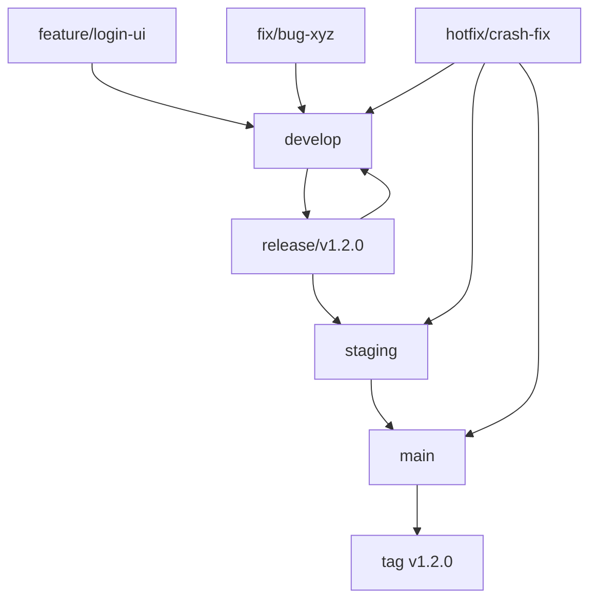

# CLAUDE.md

このファイルは、このリポジトリでコードを扱う際のClaude Code (claude.ai/code) への指針を提供します。

# MySwiftAgent

🚀 **MySwiftAgent** は、手軽で小回りの効く **パーソナルAIエージェント／LLMワークフロー** です。  
複雑な設定を避けつつ、日常タスクや開発支援をすばやく実行する「自分だけのAIエージェント」を目指しています。  

## ✨ 特徴

- ⚡ **Swift**：軽快に動作し、小回りの効く応答  
- 🧩 **Extensible**：モジュール的に機能を追加可能  
- 🎯 **Personalized**：ユーザーの目的に合わせたカスタマイズ  
- 🔄 **Workflow-oriented**：LLMを軸にした柔軟なワークフロー設計 

# 開発ルール

## 🌿 ブランチ構成

### 🧱 基本ブランチ

| ブランチ名  | 目的                   | 運用ルール                                                                             |
| ----------- | ---------------------- | -------------------------------------------------------------------------------------- |
| `main`      | 本番環境のコードベース | 保護ブランチ。タグ運用（例: `v1.2.0`）。署名付きアプリや公開ビルドに使用。直push禁止。 |
| `develop`   | 開発統合用             | 各 `feature/*` ブランチの統合先。単体・結合テストの対象。直接リリースには使用しない。  |
| `staging`   | UAT・実機確認用        | `release/*` からマージ。自動アップデート対象。                                         |
| `release/*` | リリース準備ブランチ   | `develop` から分岐。最終調整やQA、リリース検証を行う。                                 |

### ✍️ 作業ブランチ（トピックブランチ）

| ブランチ名   | 用途                   | 命名例                     |
| ------------ | ---------------------- | -------------------------- |
| `feature/*`  | 新機能の追加           | `feature/markdown-preview` |
| `fix/*`      | バグ修正               | `fix/window-size-restore`  |
| `refactor/*` | コード構造の改善       | `refactor/ipc-handler`     |
| `test/*`     | 技術検証・PoC          | `test/ipc-benchmark`       |
| `vibe/*`     | AI開発支援・実験的機能 | `vibe/ai-code-generation`  |
| `hotfix/*`   | 本番環境の緊急修正     | `hotfix/urgent-crash-fix`  |

### 📌 ブランチ間マージの原則

当プロジェクトでは、**異なるブランチ間のマージは必ず Pull Request（PR） を通じて行うことを厳守とします。**

#### ✅ 原則ルール

| 作業元ブランチ | マージ先ブランチ             | 備考                     |
| -------------- | ---------------------------- | ------------------------ |
| `feature/*`    | `develop`                    | 機能追加PR               |
| `fix/*`        | `develop`                    | バグ修正PR               |
| `vibe/*`       | `develop`                    | AI開発支援・実験的機能PR |
| `develop`      | `release/*`                  | リリース準備PR           |
| `release/*`    | `staging`                    | UAT用PR                  |
| `release/*`    | `main`                       | 本番リリースPR           |
| `release/*`    | `develop`                    | 差分の開発ブランチ反映PR |
| `hotfix/*`     | `main`, `staging`, `develop` | 本番障害対応用PR         |

#### ❌ 禁止事項

- `main`, `release/*`, `staging` への**直push**
- CLI/GitHub UI上での直接マージ（PRを介さない `git merge` 等）

#### ❗ 例外対応

CI障害などによるやむを得ない直マージの必要が生じた場合は、**チーム責任者の承認と事前周知**を行ったうえで対応してください。

### 🔁 マージ戦略とフロー

#### 標準マージフロー

#### バグ修正の方針

| 発生フェーズ   | 修正対象ブランチ                         | 修正後のマージ先             |
| -------------- | ---------------------------------------- | ---------------------------- |
| `release/*`    | `release/*`                              | `staging`, `main`, `develop` |
| `staging`      | `release/*` または `fix/*` → `release/*` | 同上                         |
| `main`（本番） | `hotfix/*`（`main` から作成）            | `main`, `staging`, `develop` |