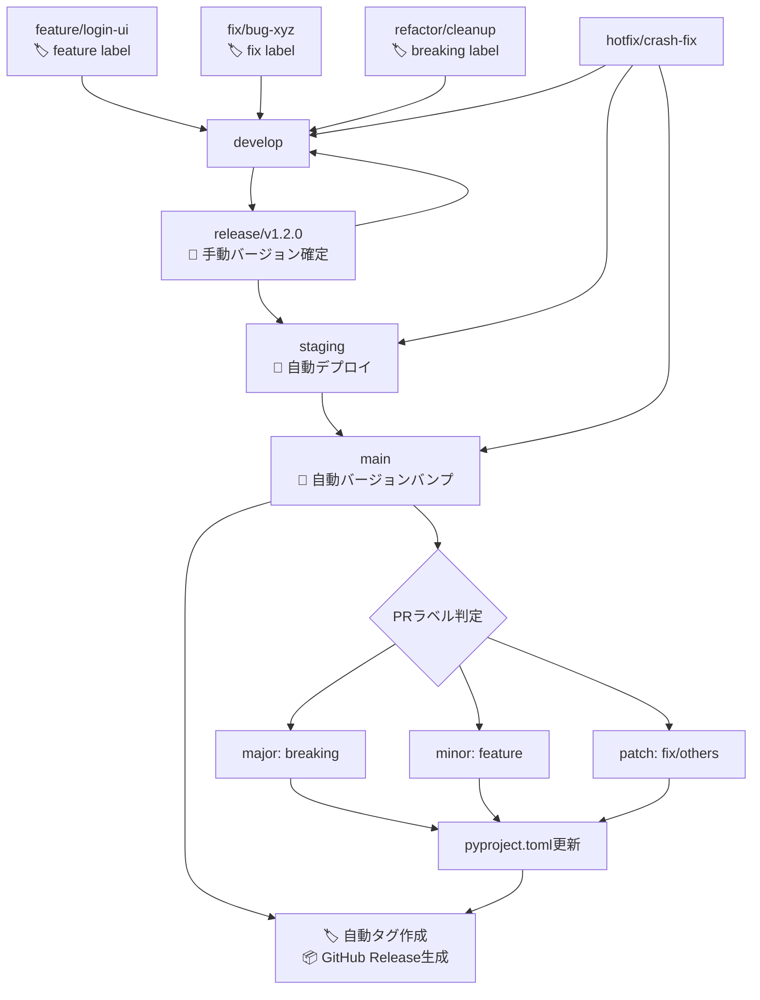

# CLAUDE.md

このファイルは、このリポジトリでコードを扱う際のClaude Code (claude.ai/code) への指針を提供します。

# MySwiftAgent

🚀 **MySwiftAgent** は、手軽で小回りの効く **パーソナルAIエージェント／LLMワークフロー** です。
複雑な設定を避けつつ、日常タスクや開発支援をすばやく実行する「自分だけのAIエージェント」を目指しています。

## ✨ 特徴

- ⚡ **Swift**：軽快に動作し、小回りの効く応答
- 🧩 **Extensible**：モジュール的に機能を追加可能
- 🎯 **Personalized**：ユーザーの目的に合わせたカスタマイズ
- 🔄 **Workflow-oriented**：LLMを軸にした柔軟なワークフロー設計

# 開発ルール

## 🌿 ブランチ構成

### 🧱 基本ブランチ

| ブランチ名  | 目的                   | 運用ルール                                                                             |
| ----------- | ---------------------- | -------------------------------------------------------------------------------------- |
| `main`      | 本番環境のコードベース | 保護ブランチ。タグ運用（例: `v1.2.0`）。署名付きアプリや公開ビルドに使用。直push禁止。 |
| `develop`   | 開発統合用             | 各 `feature/*` ブランチの統合先。単体・結合テストの対象。直接リリースには使用しない。  |
| `staging`   | UAT・実機確認用        | `release/*` からマージ。自動アップデート対象。                                         |
| `release/*` | リリース準備ブランチ   | `develop` から分岐。最終調整やQA、リリース検証を行う。                                 |

### ✍️ 作業ブランチ（トピックブランチ）

| ブランチ名   | 用途                   | 命名例                     |
| ------------ | ---------------------- | -------------------------- |
| `feature/*`  | 新機能の追加           | `feature/markdown-preview` |
| `fix/*`      | バグ修正               | `fix/window-size-restore`  |
| `refactor/*` | コード構造の改善       | `refactor/ipc-handler`     |
| `test/*`     | 技術検証・PoC          | `test/ipc-benchmark`       |
| `vibe/*`     | AI開発支援・実験的機能 | `vibe/ai-code-generation`  |
| `hotfix/*`   | 本番環境の緊急修正     | `hotfix/urgent-crash-fix`  |

### 📌 ブランチ間マージの原則

当プロジェクトでは、**異なるブランチ間のマージは必ず Pull Request（PR） を通じて行うことを厳守とします。**

#### ✅ 原則ルール（バージョン管理自動化対応）

| 作業元ブランチ | マージ先ブランチ             | 備考                                     | 自動化対応                                     |
| -------------- | ---------------------------- | ---------------------------------------- | ---------------------------------------------- |
| `feature/*`    | `develop`                    | 機能追加PR                               | 🏷️ `feature` ラベル必須（minor bump判定）      |
| `fix/*`        | `develop`                    | バグ修正PR                               | 🏷️ `fix` ラベル（patch bump判定）              |
| `vibe/*`       | `develop`                    | AI開発支援・実験的機能PR                 | 🏷️ 適切なラベル付与必須                       |
| `develop`      | `release/*`                  | リリース準備PR                           | 📝 手動バージョン確定・検証                    |
| `release/*`    | `staging`                    | UAT用PR                                  | 🚀 自動デプロイトリガー                        |
| `release/*`    | `main`                       | 本番リリースPR                           | 🔄 自動バージョンバンプ・タグ・Release作成     |
| `release/*`    | `develop`                    | 差分の開発ブランチ反映PR                 | 🔄 バックポート自動化                          |
| `hotfix/*`     | `main`, `staging`, `develop` | 本番障害対応用PR                         | ⚡ 緊急リリース自動化（patch bump + 即時展開） |

#### 🏷️ PRラベル運用ルール

**必須ラベル（セマンティックバージョニング）:**
- `breaking` → Major バージョンアップ（例: 1.2.3 → 2.0.0）
- `feature` → Minor バージョンアップ（例: 1.2.3 → 1.3.0）
- `fix` → Patch バージョンアップ（例: 1.2.3 → 1.2.4）

**補助ラベル:**
- `refactor`, `docs`, `test`, `ci` → 基本的にpatch扱い
- `dependencies` → セキュリティ更新時はpatch、機能追加時はminor

#### ❌ 禁止事項

- `main`, `release/*`, `staging` への**直push**
- CLI/GitHub UI上での直接マージ（PRを介さない `git merge` 等）

#### ❗ 例外対応

CI障害などによるやむを得ない直マージの必要が生じた場合は、**チーム責任者の承認と事前周知**を行ったうえで対応してください。

### 🔁 マージ戦略とフロー

#### 標準マージフロー（自動バージョン管理対応）



#### バグ修正の方針

| 発生フェーズ   | 修正対象ブランチ                         | 修正後のマージ先             |
| -------------- | ---------------------------------------- | ---------------------------- |
| `release/*`    | `release/*`                              | `staging`, `main`, `develop` |
| `staging`      | `release/*` または `fix/*` → `release/*` | 同上                         |
| `main`（本番） | `hotfix/*`（`main` から作成）            | `main`, `staging`, `develop` |

### 🚀 マルチプロジェクトリリース対応

複数のプロジェクトを同時にリリースする場合の手順：

#### 方法1: Workflow Dispatchによる一括リリース

```bash
# GitHub Actions UIから実行、または以下のコマンド
gh workflow run multi-release.yml \
  -f projects="myscheduler,jobqueue,commonUI" \
  -f release_type=minor
```

**命名規則:**
- **単一プロジェクト**: `release/{project}/vX.Y.Z` (例: `release/myscheduler/v1.3.0`)
- **マルチプロジェクト**: `release/multi/vYYYY.MM.DD` (例: `release/multi/v2025.09.30`)

#### 方法2: 統合featureブランチによる同時更新

```bash
# 1. 統合featureブランチ作成
git checkout develop
git checkout -b feature/cross-project-update

# 2. 複数プロジェクトを同時に修正
vim myscheduler/app/api/common.py
vim jobqueue/app/api/common.py

# 3. まとめてコミット・PR作成
git add myscheduler/ jobqueue/
git commit -m "feat: update cross-project API interface"
gh pr create --base develop --label feature
```

#### 自動リリース検出（auto-release.yml）

mainブランチへのマージ時、変更されたすべてのプロジェクトを自動検出：

**タグ命名規則:** `yyyy.mm.dd.NN/プロジェクト名/バージョン`
- `yyyy.mm.dd`: リリース日（例: 2025.10.05）
- `NN`: その日の連番（01, 02, 03...）
- `プロジェクト名`: expertAgent, myscheduler, jobqueue等
- `バージョン`: vX.Y.Z形式

**例:**
- **単一プロジェクト変更**: `2025.10.05.01/expertAgent/v0.2.1`
- **複数プロジェクト変更**: `2025.10.05.01/myscheduler/v1.3.0`, `2025.10.05.01/jobqueue/v0.2.0`
- **同日2回目のリリース**: `2025.10.05.02/commonUI/v1.0.0`

この命名規則により、以下が一目で分かります：
- ✅ いつ作成されたか（日付）
- ✅ その日の何番目のリリースか（連番）
- ✅ どのプロジェクトか（プロジェクト名）
- ✅ バージョンは何か（セマンティックバージョニング）

---

# 🔧 開発環境・品質担保

## 🐍 Python開発環境

### 環境構築ツール

- **[uv](https://docs.astral.sh/uv/)** を標準の依存関係管理・仮想環境ツールとして採用
- 従来の `pip` + `venv` / `poetry` / `pipenv` は使用しない

### セットアップ手順

```bash
# 1. uvのインストール (初回のみ)
curl -LsSf https://astral.sh/uv/install.sh | sh

# 2. プロジェクトの依存関係同期
uv sync

# 3. 開発サーバー起動
uv run uvicorn app.main:app --reload

# 4. テスト実行
uv run pytest

# 5. 静的解析・フォーマット
uv run ruff check .
uv run ruff format .
uv run mypy .
```

### プロジェクト構成

```
pyproject.toml          # プロジェクト設定・依存関係
.python-version         # Python版数指定
uv.lock                 # ロックファイル (自動生成)
app/                    # アプリケーションコード
├── main.py            # FastAPIエントリーポイント
├── core/              # コア機能 (設定、DB、ワーカー)
├── models/            # データベースモデル
├── schemas/           # Pydanticスキーマ
└── api/               # APIエンドポイント
tests/                  # テストコード
├── unit/              # 単体テスト
├── integration/       # 結合テスト
└── conftest.py        # テスト設定
```

## 🛡️ 品質担保方針

### 原理原則

下記の原理原則従いコード品質を担保すること

- SOLID
  - Single Responsibility Principle (単一責任原則)
  - Open-Closed Principle (開放/閉鎖原則)
  - Liskov Substitution Principle (リスコフの置換原則)
  - Interface Segregation Principle (インターフェース分離の原則)
  - Dependency Inversion Principle (依存性逆転の原則)
- KISS
  - Keep It Simple, Stupid
- YAGNI
  - You Aren't Gonna Need It
- DRY
  - Don't Repeat Yourself

### 静的解析・コード品質

| ツール | 用途 | 設定ファイル | 実行コマンド |
|--------|------|-------------|--------------|
| **Ruff** | Linting + Formatting | `pyproject.toml` | `uv run ruff check .` <br> `uv run ruff format .` |
| **MyPy** | 型チェック | `pyproject.toml` | `uv run mypy .` |

### テスト方針

| テストレベル | 対象 | フレームワーク | カバレッジ目標 | 根拠 |
|-------------|------|-------------|--------------|------|
| **単体テスト (Unit Tests)** | 個別関数・クラス・内部ロジック | pytest | **90%以上** | 内部ロジックの詳細な検証が目的。全パス・全分岐を網羅する |
| **結合テスト (Integration Tests)** | API エンドポイント・統合フロー | pytest + httpx | **50%以上** | エンドポイントの動作確認が主目的。内部ロジックは単体テストでカバー済み |

#### カバレッジ要件の設計思想

**単体テスト (90%要件)**:
- **目的**: 個別関数・クラスの内部ロジックを詳細に検証
- **対象**: ビジネスロジック、ユーティリティ関数、データ処理、エラーハンドリング
- **実行**: `uv run pytest tests/unit/` で実行
- **pyproject.toml設定**: `--cov-fail-under=90` でデフォルト90%を強制

**結合テスト (50%要件)**:
- **目的**: APIエンドポイントの動作確認、統合フロー検証
- **対象**: HTTPリクエスト/レスポンス、認証、エンドポイント間の連携
- **測定範囲**: `--cov=app` でAPIレイヤー (`app/`) のみ測定（`core/` は除外）
- **実行**: `uv run pytest tests/integration/ --cov=app --cov-fail-under=50` で実行（cd-develop.yml）
- **カバレッジが低い理由**:
  - 内部ロジック (`core/`) は既に単体テストで100%近くカバー済み
  - 結合テストはエンドポイント呼び出しのみ実行するため、全コードパスを通らない
  - APIレイヤーのみ測定することで、結合テストの本質（エンドポイント動作確認）に焦点を絞る
  - 低いしきい値（50%）でも統合フロー検証の目的は十分達成できる

**CI/CDでの運用**:
- **Feature/Fix PR (ci-feature.yml)**: 単体テスト + 結合テスト両方実行（90%要件適用）
- **Develop統合 (cd-develop.yml)**:
  - 単体テスト: 90%要件（`--cov=app --cov=core` で全体測定）
  - 結合テスト: 50%要件（`--cov=app` でAPIレイヤーのみ測定、`--cov-fail-under=50`）
- **最終品質保証**: 単体テストと結合テストを組み合わせて全体で90%以上を確保

### 必須チェック項目

**PRマージ前の必須確認事項：**

```bash
# 1. 全テストが通過すること
uv run pytest --cov=app --cov-report=term-missing

# 2. 静的解析エラーがないこと
uv run ruff check .
uv run mypy .

# 3. コードフォーマットが適用済みであること
uv run ruff format . --check

# 4. アプリケーションが正常に起動すること
uv run uvicorn app.main:app --host 0.0.0.0 --port 8000
```

### CI/CD との連携

GitHub Actions で以下を自動実行：

1. **品質チェック** - Linting, 型チェック, フォーマット確認
2. **テスト実行** - 単体・結合テスト + カバレッジ測定
3. **セキュリティ監査** - 脆弱性スキャン
4. **ビルド検証** - アプリケーション起動確認
5. **🔄 バージョン管理自動化** - セマンティックリリース、タグ作成、GitHub Release

#### 📋 自動化されるバージョン管理フロー

| トリガー | 自動実行内容 | 対象ワークフロー |
|---------|-------------|----------------|
| **PR → `develop`** | ラベル検証、コンベンショナルコミットチェック | `conventional-commits.yml` |
| **PR → `main` (merged)** | pyproject.toml バージョンバンプ、GitHub Release作成 | `auto-release.yml` |
| **`release/*` push** | リリース候補検証、自動デプロイトリガー | `multi-release.yml` |
| **GitHub Release published** | 本番・ステージング自動デプロイ | `deploy-on-release.yml` |

### パフォーマンス・セキュリティ

- **HTTP タイムアウト**: 適切な上限設定（デフォルト30秒）
- **レスポンスサイズ制限**: デフォルト1MB、設定可能
- **リクエスト検証**: Pydantic による厳密なスキーマ検証
- **エラーハンドリング**: 機密情報の漏洩防止

---

# 🤖 AI開発支援・コード生成時の注意事項

## Claude Code 利用時のルール

1. **品質第一**: 生成されたコードも手動コードと同等の品質基準を適用
2. **テスト必須**: AI生成コードには特に包括的なテストを作成
3. **レビュー強化**: AI生成部分は人間による詳細レビューを実施
4. **セキュリティ重視**: 外部API呼び出し、認証まわりは特に慎重に検証
5. **ドキュメント更新**: 生成されたコードに対応する仕様書・READMEの更新
6. **🏷️ PRラベル必須**: AI生成PR も適切なセマンティックバージョニングラベルを付与

## 推奨フロー（自動化対応）

```
AI生成 → 静的解析 → テスト作成 → 🏷️ PRラベル付与 → 手動レビュー → PR作成 → 🔄 自動バージョン管理
```

### 🎯 AI開発時のバージョン管理指針

- **`vibe/*` ブランチ**: 実験的機能開発時も本番品質を維持し、適切なラベル付与
- **破壊的変更**: AIによるリファクタリングでAPI変更が生じる場合は `breaking` ラベル必須
- **機能追加**: 新機能実装時は `feature` ラベルでminor版数アップ
- **バグ修正**: AI による不具合修正は `fix` ラベルでpatch版数アップ

---

# 📦 新プロジェクト追加時の手順

MySwiftAgentはマルチプロジェクト対応のモノレポ構成を採用しており、新しいマイクロサービス・プロジェクトの追加は以下の手順で行います。

**対応言語**: Python、TypeScript/Node.js

## 📋 追加手順チェックリスト

### 1. **プロジェクト基盤の作成**

#### Python プロジェクトの場合

```bash
# 新プロジェクトディレクトリ作成
mkdir {project_name}
cd {project_name}

# 必須ファイルの作成
touch pyproject.toml
touch Dockerfile
mkdir -p app tests/unit tests/integration
```

**必須ファイル構成:**
```
{project_name}/
├── pyproject.toml          # プロジェクト設定・依存関係・バージョン
├── Dockerfile              # コンテナイメージ定義
├── app/                    # アプリケーションコード
│   ├── main.py            # FastAPIエントリーポイント
│   └── core/              # コア機能
├── tests/                  # テストコード
│   ├── unit/              # 単体テスト
│   ├── integration/       # 結合テスト
│   └── conftest.py        # テスト設定
└── README.md              # プロジェクト固有ドキュメント
```

#### TypeScript プロジェクトの場合

```bash
# 新プロジェクトディレクトリ作成
mkdir {project_name}
cd {project_name}

# 必須ファイルの作成
npm init -y
touch tsconfig.json
touch Dockerfile
mkdir -p src tests
```

**必須ファイル構成:**
```
{project_name}/
├── package.json           # プロジェクト設定・依存関係・バージョン
├── package-lock.json      # 依存関係ロックファイル
├── tsconfig.json          # TypeScript設定
├── Dockerfile             # コンテナイメージ定義
├── src/                   # ソースコード
│   ├── index.ts          # アプリケーションエントリーポイント
│   └── app.ts            # Express/Fastifyアプリケーション
├── tests/                 # テストコード
│   ├── unit/             # 単体テスト
│   └── integration/      # 結合テスト
├── dist/                  # ビルド出力（.gitignore対象）
└── README.md             # プロジェクト固有ドキュメント
```

### 2. **バージョン管理ファイルの設定**

#### Python: pyproject.toml の設定

```toml
[project]
name = "{project_name}"
version = "0.1.0"  # 初回リリース用バージョン
description = "プロジェクトの説明"
authors = [
    {name = "Your Name", email = "your.email@example.com"},
]
dependencies = [
    "fastapi>=0.100.0",
    "uvicorn>=0.23.0",
    # その他の依存関係
]

[project.optional-dependencies]
dev = [
    "pytest>=7.0.0",
    "pytest-cov>=4.0.0",
    "ruff>=0.1.0",
    "mypy>=1.0.0",
]

[tool.ruff]
target-version = "py312"
line-length = 88

[tool.mypy]
python_version = "3.12"
warn_return_any = true
warn_unused_configs = true
```

#### TypeScript: package.json の設定

```json
{
  "name": "{project_name}",
  "version": "0.1.0",
  "description": "プロジェクトの説明",
  "main": "dist/index.js",
  "scripts": {
    "build": "tsc",
    "start": "node dist/index.js",
    "dev": "ts-node src/index.ts",
    "test": "jest",
    "lint": "eslint src/**/*.ts",
    "type-check": "tsc --noEmit"
  },
  "keywords": [],
  "author": "Your Name <your.email@example.com>",
  "license": "MIT",
  "dependencies": {
    "express": "^4.18.0"
  },
  "devDependencies": {
    "@types/express": "^4.17.0",
    "@types/node": "^20.0.0",
    "@typescript-eslint/eslint-plugin": "^6.0.0",
    "@typescript-eslint/parser": "^6.0.0",
    "eslint": "^8.0.0",
    "jest": "^29.0.0",
    "ts-jest": "^29.0.0",
    "ts-node": "^10.0.0",
    "typescript": "^5.0.0"
  }
}
```

**tsconfig.json の設定:**
```json
{
  "compilerOptions": {
    "target": "ES2022",
    "module": "commonjs",
    "lib": ["ES2022"],
    "outDir": "./dist",
    "rootDir": "./src",
    "strict": true,
    "esModuleInterop": true,
    "skipLibCheck": true,
    "forceConsistentCasingInFileNames": true,
    "resolveJsonModule": true,
    "declaration": true,
    "declarationMap": true,
    "sourceMap": true
  },
  "include": ["src/**/*"],
  "exclude": ["node_modules", "dist", "tests"]
}
```

### 3. **CI/CD設定への追加**

#### 3.1 multi-release.yml ワークフローの更新

**🎉 自動言語検出対応**

`multi-release.yml` は **Python と TypeScript の両方に自動対応** しています。以下の検出ロジックで動作します：

- **Python プロジェクト**: `pyproject.toml` の存在で検出
- **TypeScript プロジェクト**: `package.json` の存在で検出

**変更が必要な箇所:**

プロジェクト検出リストに新プロジェクトを追加（行395付近）:

```yaml
# Multi-project format: release/multi/vYYYY.MM.DD or vX.Y.Z
if [[ $BRANCH_NAME =~ ^release/multi/v(.+)$ ]]; then
  # Detect changed projects from git diff
  CHANGED_PROJECTS=""
  for project in myscheduler jobqueue docs commonUI {project_name}; do  # ← 新プロジェクト追加
    # Check if project has version file (pyproject.toml or package.json)
    if ([[ -f "$project/pyproject.toml" ]] || [[ -f "$project/package.json" ]]) && git diff HEAD~1 HEAD --name-only | grep -q "^$project/"; then
```

**バージョン管理ファイル対応:**
- **Python**: `pyproject.toml` の `version = "X.Y.Z"` 行を自動更新
- **TypeScript**: `package.json` の `"version": "X.Y.Z"` フィールドを jq で自動更新

**テスト・ビルドコマンド自動切替:**
| 言語 | Linting | Type Check | Tests | Build |
|------|---------|-----------|-------|-------|
| **Python** | `uv run ruff check .` | `uv run mypy app/` | `uv run pytest` | `uv build` |
| **TypeScript** | `npm run lint` | `npm run type-check` または `npx tsc --noEmit` | `npm test` | `npm run build` |

#### 3.2 他のワークフローファイルの更新確認

以下のワークフローが新プロジェクトに対応するか確認・更新：
- `ci-feature.yml`
- `cd-develop.yml`
- `ci-main.yml`

### 4. **Dockerfileの作成**

#### Python プロジェクト用 Dockerfile

```dockerfile
FROM python:3.12-slim

WORKDIR /app

# Install uv
COPY --from=ghcr.io/astral-sh/uv:latest /uv /bin/uv

# Copy dependency files
COPY pyproject.toml uv.lock ./

# Install dependencies
RUN uv sync --no-dev

# Copy application code
COPY app/ ./app/

# Health check endpoint
HEALTHCHECK --interval=30s --timeout=3s --start-period=5s --retries=3 \
  CMD curl -f http://localhost:8000/health || exit 1

EXPOSE 8000

CMD ["uv", "run", "uvicorn", "app.main:app", "--host", "0.0.0.0", "--port", "8000"]
```

#### TypeScript プロジェクト用 Dockerfile（Multi-stage build）

```dockerfile
# Build stage
FROM node:20-alpine AS builder

WORKDIR /app

# Copy dependency files
COPY package*.json ./
COPY tsconfig.json ./

# Install dependencies
RUN npm ci

# Copy source code
COPY src/ ./src/

# Build TypeScript
RUN npm run build

# Production stage
FROM node:20-alpine

WORKDIR /app

# Copy only production dependencies
COPY package*.json ./
RUN npm ci --only=production

# Copy built application
COPY --from=builder /app/dist ./dist

# Health check endpoint
HEALTHCHECK --interval=30s --timeout=3s --start-period=5s --retries=3 \
  CMD wget --no-verbose --tries=1 --spider http://localhost:8000/health || exit 1

EXPOSE 8000

CMD ["node", "dist/index.js"]
```

### 5. **基本APIエンドポイントの実装**

#### Python (FastAPI) 実装例

**`app/main.py`**:
```python
from fastapi import FastAPI

app = FastAPI(
    title="{project_name}",
    version="0.1.0",
    description="プロジェクトの説明"
)

@app.get("/health")
async def health_check():
    """ヘルスチェックエンドポイント（CI/CDで使用）"""
    return {"status": "healthy", "service": "{project_name}"}

@app.get("/")
async def root():
    """ルートエンドポイント"""
    return {"message": "Welcome to {project_name}"}

@app.get("/api/v1/")
async def api_root():
    """API v1 ルート"""
    return {"version": "1.0", "service": "{project_name}"}
```

#### TypeScript (Express) 実装例

**`src/app.ts`**:
```typescript
import express, { Request, Response } from 'express';

const app = express();

app.use(express.json());

// Health check endpoint (required for CI/CD)
app.get('/health', (req: Request, res: Response) => {
  res.json({ status: 'healthy', service: '{project_name}' });
});

// Root endpoint
app.get('/', (req: Request, res: Response) => {
  res.json({ message: 'Welcome to {project_name}' });
});

// API v1 root
app.get('/api/v1/', (req: Request, res: Response) => {
  res.json({ version: '1.0', service: '{project_name}' });
});

export default app;
```

**`src/index.ts`**:
```typescript
import app from './app';

const PORT = process.env.PORT || 8000;

app.listen(PORT, () => {
  console.log(`🚀 Server is running on port ${PORT}`);
});
```

### 6. **テスト環境の設定**

#### Python テストの設定

**`tests/conftest.py`**:
```python
import pytest
from fastapi.testclient import TestClient
from app.main import app

@pytest.fixture
def client():
    return TestClient(app)
```

**`tests/integration/test_api.py`**:
```python
def test_health_check(client):
    response = client.get("/health")
    assert response.status_code == 200
    assert response.json() == {"status": "healthy", "service": "{project_name}"}

def test_root_endpoint(client):
    response = client.get("/")
    assert response.status_code == 200
```

#### TypeScript テストの設定

**`tests/integration/app.test.ts`**:
```typescript
import request from 'supertest';
import app from '../../src/app';

describe('API Endpoints', () => {
  describe('GET /health', () => {
    it('should return health status', async () => {
      const response = await request(app).get('/health');
      expect(response.status).toBe(200);
      expect(response.body).toEqual({
        status: 'healthy',
        service: '{project_name}'
      });
    });
  });

  describe('GET /', () => {
    it('should return welcome message', async () => {
      const response = await request(app).get('/');
      expect(response.status).toBe(200);
      expect(response.body.message).toBeDefined();
    });
  });
});
```

**jest.config.js**:
```javascript
module.exports = {
  preset: 'ts-jest',
  testEnvironment: 'node',
  roots: ['<rootDir>/tests'],
  testMatch: ['**/*.test.ts'],
  collectCoverageFrom: [
    'src/**/*.ts',
    '!src/**/*.d.ts'
  ]
};
```

**必須追加パッケージ:**
```bash
npm install --save-dev supertest @types/supertest jest ts-jest
```

### 7. **初回リリースの実行**

#### Python プロジェクトの場合

```bash
# 1. 開発ブランチから作業開始
git checkout develop
git pull origin develop

# 2. 新プロジェクト用feature/vibe ブランチ作成
git checkout -b feature/{project_name}-initial-setup

# 3. ファイル追加・コミット
git add {project_name}/
git commit -m "feat({project_name}): add initial Python project structure

- Add pyproject.toml with basic dependencies
- Add FastAPI application with health check
- Add Docker configuration
- Add test structure and basic tests
- Add CI/CD integration

🤖 Generated with [Claude Code](https://claude.ai/code)

Co-Authored-By: Claude <noreply@anthropic.com>"

# 4. プッシュしてPR作成
git push origin feature/{project_name}-initial-setup

# 5. developブランチへのPR作成（featureラベル付与）
gh pr create \
  --title "🎉 Add new Python project: {project_name}" \
  --body "初回Pythonプロジェクト追加..." \
  --base develop \
  --label feature
```

#### TypeScript プロジェクトの場合

```bash
# 1. 開発ブランチから作業開始
git checkout develop
git pull origin develop

# 2. 新プロジェクト用feature/vibe ブランチ作成
git checkout -b feature/{project_name}-initial-setup

# 3. ファイル追加・コミット
git add {project_name}/
git commit -m "feat({project_name}): add initial TypeScript project structure

- Add package.json with basic dependencies
- Add Express application with health check
- Add TypeScript configuration
- Add Docker configuration (multi-stage build)
- Add test structure with Jest and Supertest
- Add CI/CD integration

🤖 Generated with [Claude Code](https://claude.ai/code)

Co-Authored-By: Claude <noreply@anthropic.com>"

# 4. プッシュしてPR作成
git push origin feature/{project_name}-initial-setup

# 5. developブランチへのPR作成（featureラベル付与）
gh pr create \
  --title "🎉 Add new TypeScript project: {project_name}" \
  --body "初回TypeScriptプロジェクト追加..." \
  --base develop \
  --label feature
```

### 8. **リリースワークフローの実行**

```bash
# developマージ後、リリースワークフロー実行
gh workflow run multi-release.yml \
  -f projects={project_name} \
  -f release_type=minor \
  -f custom_version="0.1.0"

# または手動でリリースブランチ作成
git checkout develop
git pull origin develop
git checkout -b release/{project_name}/v0.1.0
git push origin release/{project_name}/v0.1.0
```

## 📊 マルチプロジェクト対応状況

### 現在のプロジェクト一覧

| プロジェクト | 目的 | 技術スタック | リリース状況 |
|-------------|------|-------------|-------------|
| `myscheduler` | ジョブスケジューリング | FastAPI + APScheduler + SQLAlchemy | ✅ 本番運用中 |
| `jobqueue` | ジョブキュー管理 | FastAPI + Redis/PostgreSQL | 🚀 初回リリース準備中 |
| `docs` | プロジェクトドキュメント | Markdown + 静的サイトジェネレータ | 📝 軽量ワークフロー対応 |

### プロジェクト追加時のCI/CD更新箇所

- **`.github/workflows/multi-release.yml`**: workflow_dispatch inputsとジョブ条件
- **`.github/workflows/ci-feature.yml`**: フィーチャーブランチ用品質チェック（docs/** パス除外設定済み）
- **`.github/workflows/cd-develop.yml`**: 開発統合用テスト（docs/** パス除外設定済み）
- **`.github/workflows/ci-main.yml`**: 本番品質チェック（docs/** パス除外設定済み）
- **`.github/workflows/hotfix.yml`**: 緊急修正ワークフロー（docs変更時は軽量実行）
- **`.github/workflows/docs.yml`**: **🆕 ドキュメント専用軽量ワークフロー**
- **`.github/DEPLOYMENT.md`**: プロジェクト一覧表とリリース手順

### 📝 ドキュメントプロジェクト専用の最適化

**docs プロジェクト** は他のアプリケーションプロジェクトと異なり、以下の最適化が実装されています：

#### **軽量ワークフロー分離**
- **専用ワークフロー**: `.github/workflows/docs.yml`
- **処理内容**: Markdownlinting、構造検証、静的サイト生成のみ
- **除外処理**: Docker、Python依存関係、セキュリティスキャンは実行しない

#### **パス除外設定**
他の重いワークフローから `docs/**` パスを除外：
```yaml
paths:
  - 'myscheduler/**'
  - 'jobqueue/**'
  - '.github/workflows/**'
  # docs changes are handled by separate docs workflow
  - '!docs/**'
```

#### **バージョン管理対応**
- **リリースブランチ**: `release/docs/vX.Y.Z` 形式をサポート
- **pyproject.toml**: 存在しない場合は軽量版を自動生成
- **専用バリデーション**: multi-release.ymlでdocs専用の軽量チェックを実行

## 🔧 新プロジェクト追加後の品質チェック

### Python プロジェクトの品質チェック

```bash
# 新プロジェクトのローカル検証
cd {project_name}

# 1. 依存関係インストール
uv sync --extra dev

# 2. 品質チェック実行
uv run ruff check .
uv run ruff format . --check
uv run mypy app/

# 3. テスト実行
uv run pytest tests/unit/ -v
uv run pytest tests/integration/ -v

# 4. アプリケーション起動テスト
uv run uvicorn app.main:app --host 0.0.0.0 --port 8000

# 5. ヘルスチェック
curl -f http://localhost:8000/health
```

### TypeScript プロジェクトの品質チェック

```bash
# 新プロジェクトのローカル検証
cd {project_name}

# 1. 依存関係インストール
npm ci

# 2. 品質チェック実行
npm run lint
npm run type-check

# 3. テスト実行
npm test

# 4. ビルド検証
npm run build

# 5. アプリケーション起動テスト
npm start &
sleep 5

# 6. ヘルスチェック
curl -f http://localhost:8000/health

# 7. プロセス停止
pkill -f "node dist/index.js"
```

## ⚠️ 注意事項

1. **リリースブランチ命名**: 必ず `release/{project_name}/vX.Y.Z` 形式を使用
2. **初回バージョン**: 新プロジェクトは `0.1.0` から開始することを推奨
3. **CI/CD設定**: validate-releaseジョブのプロジェクトリスト（行395付近）への新プロジェクト追加が必須
4. **依存関係管理**:
   - **Python**: `uv`を使用し、`pyproject.toml`で一元管理
   - **TypeScript**: `npm`を使用し、`package.json`で一元管理
5. **Docker対応**: リリースフローではDockerイメージビルド・テストが必須
6. **API規約**: ヘルスチェック（`/health`）とルートエンドポイント（`/`、`/api/v1/`）は実装必須（両言語共通）
7. **必須npmスクリプト（TypeScript）**: `build`, `test`, `lint`, `type-check` は package.json に定義必須
8. **バージョンファイル**: Python は `pyproject.toml`、TypeScript は `package.json` にバージョン記載必須
---

# 🛡️ GitHub Actions エラー再発防止策

このセクションでは、CI/CDパイプラインでのエラーを未然に防ぐための包括的な対策をまとめています。

## 📊 エラーパターン分析

過去に発生したGitHub Actionsエラーとその根本原因:

| エラー種類 | 発生回数 | 影響度 | 根本原因 |
|-----------|---------|-------|---------|
| **Linting errors (Ruff)** | 高頻度 | 🔴 Critical | コミット前の品質チェック不足 |
| **Import順序 (I001)** | 中頻度 | 🟡 Medium | Import自動整理の未設定 |
| **未使用import (F401)** | 中頻度 | 🟡 Medium | 保存時の自動クリーンアップ不足 |
| **Pytest設定エラー** | 低頻度 | 🟢 Low | 新規marker追加時の設定漏れ |

## 🎯 再発防止策（優先度順）

### **優先度1: Pre-commit Hooks 導入** (必須)

コミット前に自動チェックを実行し、不合格なコードのコミットを防止します。

#### インストール手順

```bash
# 1. Pre-commitのインストール
pip install pre-commit

# 2. Hooksの有効化
pre-commit install

# 3. 既存コード全体のチェック（初回のみ）
pre-commit run --all-files
```

#### 設定ファイル

`.pre-commit-config.yaml` に以下の内容を設定済み:

- **Ruff linting** (自動修正付き)
- **Ruff formatting** (自動適用)
- **MyPy type checking**
- **Fast unit tests** (高速テストのみ)
- **一般的なファイルチェック** (trailing spaces, merge conflicts等)

#### コミット時の動作

```bash
git commit -m "your message"
# ↓ Pre-commit hooks が自動実行
# ✓ Ruff linting... (自動修正)
# ✓ Ruff formatting...
# ✓ MyPy type checking...
# ✓ Pytest (unit tests)...
# ✓ All checks passed!
```

### **優先度2: VS Code 設定の最適化**

保存時に自動フォーマット・自動import整理を実行します。

#### 推奨拡張機能（必須）

以下の拡張機能をインストールしてください（`.vscode/extensions.json` に記載）:

1. **Ruff** (`charliermarsh.ruff`) - 必須
2. **Python** (`ms-python.python`) - 必須
3. **Pylance** (`ms-python.vscode-pylance`) - 推奨

#### 自動設定内容

`.vscode/settings.json` で以下が自動化済み:

- **保存時にフォーマット** (`editor.formatOnSave: true`)
- **保存時にimport整理** (`source.organizeImports: "explicit"`)
- **保存時にlint自動修正** (`source.fixAll: "explicit"`)
- **Ruff自動実行** (`ruff.lint.run: "onSave"`)

### **優先度3: プッシュ前チェックスクリプト**

プッシュ前に全品質チェックを一括実行します。

#### 使用方法

```bash
# 全プロジェクトをチェック（推奨）
./scripts/pre-push-check-all.sh

# expertAgentプロジェクトのみチェック（高速）
./scripts/pre-push-check.sh
```

#### チェック内容

**pre-push-check-all.sh** （マルチプロジェクト対応版）:
- 対象プロジェクト: expertAgent, jobqueue, myscheduler, myVault, graphAiServer
- Python プロジェクト: Ruff linting, Ruff formatting, MyPy type checking, Unit tests, Coverage check (90%以上)
- TypeScript プロジェクト: ESLint, TypeScript compilation, Build

**pre-push-check.sh** （expertAgent専用）:
1. ✅ Ruff linting
2. ✅ Ruff formatting
3. ✅ MyPy type checking
4. ✅ Unit tests (高速)
5. ✅ Coverage check (90%以上)

すべて合格したらプッシュ可能です。

### **優先度4: 開発ガイドライン遵守**

`DEVELOPMENT_GUIDE.md` に詳細な開発ルールとチェックリストを記載しています。

#### よくあるエラーと対策

| エラー | 対策 |
|-------|------|
| **Import順序 (I001)** | VS Code設定で保存時に自動整理 |
| **未使用import (F401)** | Pre-commit hooksが自動削除 |
| **重複import (F811)** | トップレベルでのみimport |
| **Pytest marker未定義** | `pyproject.toml`に必ず登録 |
| **カバレッジ不足** | HTMLレポートで未カバー箇所を確認 |

## 📋 コミット前チェックリスト

### 自動チェック（Pre-commit Hooks）

- [ ] Ruff linting (自動修正)
- [ ] Ruff formatting (自動適用)
- [ ] Type checking (MyPy)
- [ ] Unit tests (高速)

### 手動チェック

- [ ] 新しいテストを追加したか？
- [ ] カバレッジは維持されているか？ (90%以上)
- [ ] コミットメッセージは規約に従っているか？
- [ ] プッシュ前に `./scripts/pre-push-check-all.sh` を実行したか？

## 🔄 CI/CDエラー発生時の対応手順

### 1. エラーログの確認

```bash
# 最新のワークフロー実行を確認
gh run list --branch feature/your-branch --limit 1

# 失敗ログを表示
gh run view <run-id> --log-failed
```

### 2. ローカルで再現

```bash
cd expertAgent

# Lintingエラーの場合
uv run ruff check .

# Test失敗の場合
uv run pytest tests/ -v

# Coverage不足の場合
uv run pytest tests/ --cov=app --cov=core --cov-report=html
open htmlcov/index.html
```

### 3. 修正して再プッシュ

```bash
# 自動修正
uv run ruff check . --fix

# テスト追加後、全チェック実行
./scripts/pre-push-check-all.sh

# コミット・プッシュ
git add -u
git commit -m "fix: resolve CI errors"
git push
```

## 🚀 効果測定

### 導入前（2025年10月9日以前）

- ❌ CI失敗率: **83%** (6回中5回失敗)
- ⏱️ 平均修正時間: 15-30分/回
- 🔄 平均リトライ回数: 2-3回

### 導入後（期待値）

- ✅ CI成功率: **95%以上** (Pre-commit hooksで事前防止)
- ⏱️ 平均修正時間: 5分以内 (ローカルで即座に検出)
- 🔄 リトライ回数: 0-1回

## 📚 参考ドキュメント

- 📖 **詳細ガイド**: `DEVELOPMENT_GUIDE.md`
- 🔧 **Pre-commitチェックスクリプト（全プロジェクト）**: `scripts/pre-push-check-all.sh`
- 🔧 **Pre-commitチェックスクリプト（expertAgent専用）**: `scripts/pre-push-check.sh`
- ⚙️ **VS Code設定**: `.vscode/settings.json`
- 🪝 **Pre-commit Hooks設定**: `.pre-commit-config.yaml`

# 開発における制約条件
- [ ] 本ドキュメントの品質担保方針に従うこと
- [ ] Claude Code 利用時のルールに従うこと
- [ ] コード追加時は下記原則に従うこと
  - SOLID
    - Single Responsibility Principle (単一責任原則)
    - Open-Closed Principle (開放/閉鎖原則)
    - Liskov Substitution Principle (リスコフの置換原則)
    - Interface Segregation Principle (インターフェース分離の原則)
    - Dependency Inversion Principle (依存性逆転の原則)
  - KISS
    - Keep It Simple, Stupid
  - YAGNI
    - You Aren't Gonna Need It
  - DRY
    - Don't Repeat Yourself
- [ ] アーキテクチャは、 ./docs/design/architecture-overview.md に従うこと
- [ ] システムで管理すべきパラメータは環境変数で管理するものとし、使用方法は、 ./docs/design/environment-variables.md に従うこと
- [ ] ユーザーが管理すべきパラメータはmyVaultで管理するものとし、使用方法は、./docs/design/myvault-integration.md に従うこと
- [ ] コミットする前に、./scripts/pre-push-check-all.sh を実行し全プロジェクトの品質チェックに合格することを確認すること（単一プロジェクトのみ変更した場合は ./scripts/pre-push-check.sh でも可）
- [ ] ユーザーからの依頼に対し下記方針で作業を進めること
  1. 対策案を提示する
  1. ユーザーが指示した対策案に対し実行計画を提示する
  1. ユーザーからの承認を持って実行計画を実行する

---

# 📝 作業ドキュメント管理

## GraphAI ワークフロー開発時の参照ドキュメント

GraphAI ワークフローを開発する際は、以下のドキュメントを必ず参照してください：

### 必須ドキュメント
1. **GRAPHAI_WORKFLOW_GENERATION_RULES.md**
   - パス: `./graphAiServer/docs/GRAPHAI_WORKFLOW_GENERATION_RULES.md`
   - 内容: GraphAI の完全リファレンス
   - 特に重要: 「mapAgentの出力形式と参照方法」セクション（Lines 189-303）

2. **WORKFLOW_DEVELOPMENT_TEMPLATE.md**
   - パス: `./graphAiServer/docs/WORKFLOW_DEVELOPMENT_TEMPLATE.md`
   - 内容: ワークフロー開発の標準テンプレート
   - 使用タイミング: 開発開始前に必ず読む

3. **ITERATION_RECORD_TEMPLATE.md**
   - パス: `./graphAiServer/docs/ITERATION_RECORD_TEMPLATE.md`
   - 内容: イテレーション記録の標準フォーマット
   - 使用タイミング: テスト・デバッグ時

### 重要な注意事項

#### mapAgent使用時
- ✅ 必ず `compositeResult: true` を指定
- ✅ 後続ノードでは `:mapAgentノード名.isResultノード名` で参照
- ✅ `console.after: true` を追加してログを有効化

#### デバッグ時
- ✅ GraphAI APIレスポンスの `results` フィールドを必ず確認
- ✅ `[object Object]` エラーが出たら、GRAPHAI_WORKFLOW_GENERATION_RULES.md の「よくあるエラーパターン」（Lines 2798-3020）を参照
- ⚠️ YML実装が正しくても、実行結果が異なる可能性があるため、APIレスポンスを信頼

#### Silent Failure に注意
- LLMは破損データを受け取っても「それらしい出力」を生成する
- 中間ノードの出力を必ず検証
- エラーなし ≠ 正しい動作

---

## Claude Code 作業記録ルール

Claude Codeによる開発作業では、以下のドキュメントを `./workspace/claudecode/` ディレクトリにMarkdown形式で保存します。

### **必須ドキュメント**

| ドキュメント名 | 内容 | 更新タイミング |
|-------------|------|-------------|
| `{feature}-implementation-plan.md` | 要求・要件・外部仕様・設計方針・テスト計画 | 実装開始前 |
| `{feature}-progress.md` | 途中経過・実装ログ・課題・決定事項 | 各フェーズ完了時 |
| `{feature}-test-results.md` | テスト結果・カバレッジレポート・検証結果 | テスト実行後 |

### **ドキュメント構成例**

```
workspace/
└── claudecode/
    ├── file-reader-implementation-plan.md    # 実装計画書
    ├── file-reader-progress.md               # 進捗記録
    ├── file-reader-test-results.md           # テスト結果
    └── README.md                              # ディレクトリ説明
```

### **記録対象の情報**

#### **実装計画書 (`*-implementation-plan.md`)**
- ビジネス要求
- 機能要件・非機能要件
- 外部仕様（APIエンドポイント、インターフェース）
- 設計方針（アーキテクチャ、ディレクトリ構成）
- テスト計画（テストデータ、シナリオ）
- 実装スケジュール

#### **進捗記録 (`*-progress.md`)**
- 各フェーズの実装内容
- 発生した課題と解決策
- 設計変更の理由と内容
- レビューコメントと対応
- 技術的な決定事項

#### **テスト結果 (`*-test-results.md`)**
- 単体テスト結果
- 統合テスト結果
- カバレッジレポート
- パフォーマンステスト結果
- 不具合リストと修正状況

### **運用ルール**

1. **実装開始前に必ず計画書を作成**
   - ユーザーの承認を得てから実装開始

2. **各フェーズ完了時に進捗記録を更新**
   - 実装内容、課題、決定事項を記録

3. **テスト実行後に結果を記録**
   - カバレッジ、失敗ケース、修正内容を記録

4. **ドキュメントは常に最新状態を維持**
   - 設計変更時は速やかに更新

5. **PRマージ時にドキュメントも含める**
   - 作業記録をリポジトリに残す

### **メリット**

- ✅ **トレーサビリティ**: 設計判断の根拠を追跡可能
- ✅ **再現性**: 同様の作業を再現しやすい
- ✅ **レビュー性**: レビュアーが背景を理解しやすい
- ✅ **ナレッジ共有**: チーム全体で知見を共有
- ✅ **AI学習**: Claude Codeが過去の作業から学習可能
