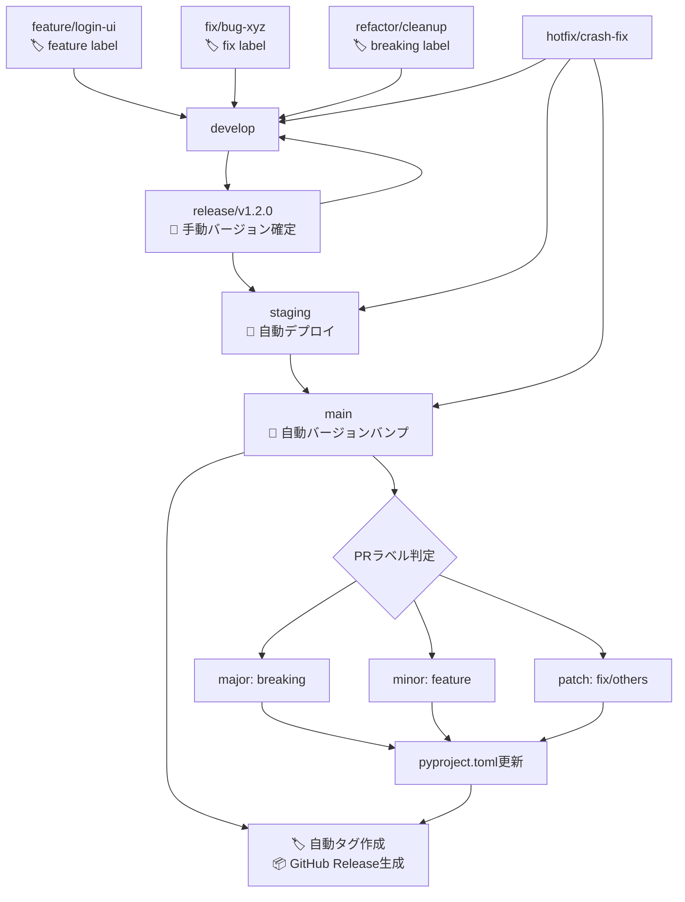

# CLAUDE.md

このファイルは、このリポジトリでコードを扱う際のClaude Code (claude.ai/code) への指針を提供します。

# MySwiftAgent

🚀 **MySwiftAgent** は、手軽で小回りの効く **パーソナルAIエージェント／LLMワークフロー** です。  
複雑な設定を避けつつ、日常タスクや開発支援をすばやく実行する「自分だけのAIエージェント」を目指しています。  

## ✨ 特徴

- ⚡ **Swift**：軽快に動作し、小回りの効く応答  
- 🧩 **Extensible**：モジュール的に機能を追加可能  
- 🎯 **Personalized**：ユーザーの目的に合わせたカスタマイズ  
- 🔄 **Workflow-oriented**：LLMを軸にした柔軟なワークフロー設計 

# 開発ルール

## 🌿 ブランチ構成

### 🧱 基本ブランチ

| ブランチ名  | 目的                   | 運用ルール                                                                             |
| ----------- | ---------------------- | -------------------------------------------------------------------------------------- |
| `main`      | 本番環境のコードベース | 保護ブランチ。タグ運用（例: `v1.2.0`）。署名付きアプリや公開ビルドに使用。直push禁止。 |
| `develop`   | 開発統合用             | 各 `feature/*` ブランチの統合先。単体・結合テストの対象。直接リリースには使用しない。  |
| `staging`   | UAT・実機確認用        | `release/*` からマージ。自動アップデート対象。                                         |
| `release/*` | リリース準備ブランチ   | `develop` から分岐。最終調整やQA、リリース検証を行う。                                 |

### ✍️ 作業ブランチ（トピックブランチ）

| ブランチ名   | 用途                   | 命名例                     |
| ------------ | ---------------------- | -------------------------- |
| `feature/*`  | 新機能の追加           | `feature/markdown-preview` |
| `fix/*`      | バグ修正               | `fix/window-size-restore`  |
| `refactor/*` | コード構造の改善       | `refactor/ipc-handler`     |
| `test/*`     | 技術検証・PoC          | `test/ipc-benchmark`       |
| `vibe/*`     | AI開発支援・実験的機能 | `vibe/ai-code-generation`  |
| `hotfix/*`   | 本番環境の緊急修正     | `hotfix/urgent-crash-fix`  |

### 📌 ブランチ間マージの原則

当プロジェクトでは、**異なるブランチ間のマージは必ず Pull Request（PR） を通じて行うことを厳守とします。**

#### ✅ 原則ルール（バージョン管理自動化対応）

| 作業元ブランチ | マージ先ブランチ             | 備考                                     | 自動化対応                                     |
| -------------- | ---------------------------- | ---------------------------------------- | ---------------------------------------------- |
| `feature/*`    | `develop`                    | 機能追加PR                               | 🏷️ `feature` ラベル必須（minor bump判定）      |
| `fix/*`        | `develop`                    | バグ修正PR                               | 🏷️ `fix` ラベル（patch bump判定）              |
| `vibe/*`       | `develop`                    | AI開発支援・実験的機能PR                 | 🏷️ 適切なラベル付与必須                       |
| `develop`      | `release/*`                  | リリース準備PR                           | 📝 手動バージョン確定・検証                    |
| `release/*`    | `staging`                    | UAT用PR                                  | 🚀 自動デプロイトリガー                        |
| `release/*`    | `main`                       | 本番リリースPR                           | 🔄 自動バージョンバンプ・タグ・Release作成     |
| `release/*`    | `develop`                    | 差分の開発ブランチ反映PR                 | 🔄 バックポート自動化                          |
| `hotfix/*`     | `main`, `staging`, `develop` | 本番障害対応用PR                         | ⚡ 緊急リリース自動化（patch bump + 即時展開） |

#### 🏷️ PRラベル運用ルール

**必須ラベル（セマンティックバージョニング）:**
- `breaking` → Major バージョンアップ（例: 1.2.3 → 2.0.0）
- `feature` → Minor バージョンアップ（例: 1.2.3 → 1.3.0）
- `fix` → Patch バージョンアップ（例: 1.2.3 → 1.2.4）

**補助ラベル:**
- `refactor`, `docs`, `test`, `ci` → 基本的にpatch扱い
- `dependencies` → セキュリティ更新時はpatch、機能追加時はminor

#### ❌ 禁止事項

- `main`, `release/*`, `staging` への**直push**
- CLI/GitHub UI上での直接マージ（PRを介さない `git merge` 等）

#### ❗ 例外対応

CI障害などによるやむを得ない直マージの必要が生じた場合は、**チーム責任者の承認と事前周知**を行ったうえで対応してください。

### 🔁 マージ戦略とフロー

#### 標準マージフロー（自動バージョン管理対応）



#### バグ修正の方針

| 発生フェーズ   | 修正対象ブランチ                         | 修正後のマージ先             |
| -------------- | ---------------------------------------- | ---------------------------- |
| `release/*`    | `release/*`                              | `staging`, `main`, `develop` |
| `staging`      | `release/*` または `fix/*` → `release/*` | 同上                         |
| `main`（本番） | `hotfix/*`（`main` から作成）            | `main`, `staging`, `develop` |

---

# 🔧 開発環境・品質担保

## 🐍 Python開発環境

### 環境構築ツール

- **[uv](https://docs.astral.sh/uv/)** を標準の依存関係管理・仮想環境ツールとして採用
- 従来の `pip` + `venv` / `poetry` / `pipenv` は使用しない

### セットアップ手順

```bash
# 1. uvのインストール (初回のみ)
curl -LsSf https://astral.sh/uv/install.sh | sh

# 2. プロジェクトの依存関係同期
uv sync

# 3. 開発サーバー起動
uv run uvicorn app.main:app --reload

# 4. テスト実行
uv run pytest

# 5. 静的解析・フォーマット
uv run ruff check .
uv run ruff format .
uv run mypy .
```

### プロジェクト構成

```
pyproject.toml          # プロジェクト設定・依存関係
.python-version         # Python版数指定
uv.lock                 # ロックファイル (自動生成)
app/                    # アプリケーションコード
├── main.py            # FastAPIエントリーポイント
├── core/              # コア機能 (設定、DB、ワーカー)
├── models/            # データベースモデル
├── schemas/           # Pydanticスキーマ
└── api/               # APIエンドポイント
tests/                  # テストコード
├── unit/              # 単体テスト
├── integration/       # 結合テスト
└── conftest.py        # テスト設定
```

## 🛡️ 品質担保方針

### 静的解析・コード品質

| ツール | 用途 | 設定ファイル | 実行コマンド |
|--------|------|-------------|--------------|
| **Ruff** | Linting + Formatting | `pyproject.toml` | `uv run ruff check .` <br> `uv run ruff format .` |
| **MyPy** | 型チェック | `pyproject.toml` | `uv run mypy .` |

### テスト方針

| テストレベル | 対象 | フレームワーク | カバレッジ目標 |
|-------------|------|-------------|--------------|
| **単体テスト** | 個別関数・クラス | pytest | 80%以上 |
| **結合テスト** | API エンドポイント | pytest + httpx | 90%以上 |

### 必須チェック項目

**PRマージ前の必須確認事項：**

```bash
# 1. 全テストが通過すること
uv run pytest --cov=app --cov-report=term-missing

# 2. 静的解析エラーがないこと
uv run ruff check .
uv run mypy .

# 3. コードフォーマットが適用済みであること
uv run ruff format . --check

# 4. アプリケーションが正常に起動すること
uv run uvicorn app.main:app --host 0.0.0.0 --port 8000
```

### CI/CD との連携

GitHub Actions で以下を自動実行：

1. **品質チェック** - Linting, 型チェック, フォーマット確認
2. **テスト実行** - 単体・結合テスト + カバレッジ測定
3. **セキュリティ監査** - 脆弱性スキャン
4. **ビルド検証** - アプリケーション起動確認
5. **🔄 バージョン管理自動化** - セマンティックリリース、タグ作成、GitHub Release

#### 📋 自動化されるバージョン管理フロー

| トリガー | 自動実行内容 | 対象ワークフロー |
|---------|-------------|----------------|
| **PR → `develop`** | ラベル検証、コンベンショナルコミットチェック | `conventional-commits.yml` |
| **PR → `main` (merged)** | pyproject.toml バージョンバンプ、GitHub Release作成 | `auto-release.yml` |
| **`release/*` push** | リリース候補検証、自動デプロイトリガー | `release.yml` |
| **GitHub Release published** | 本番・ステージング自動デプロイ | `deploy-on-release.yml` |

### パフォーマンス・セキュリティ

- **HTTP タイムアウト**: 適切な上限設定（デフォルト30秒）
- **レスポンスサイズ制限**: デフォルト1MB、設定可能
- **リクエスト検証**: Pydantic による厳密なスキーマ検証
- **エラーハンドリング**: 機密情報の漏洩防止

---

# 🤖 AI開発支援・コード生成時の注意事項

## Claude Code 利用時のルール

1. **品質第一**: 生成されたコードも手動コードと同等の品質基準を適用
2. **テスト必須**: AI生成コードには特に包括的なテストを作成
3. **レビュー強化**: AI生成部分は人間による詳細レビューを実施
4. **セキュリティ重視**: 外部API呼び出し、認証まわりは特に慎重に検証
5. **ドキュメント更新**: 生成されたコードに対応する仕様書・READMEの更新
6. **🏷️ PRラベル必須**: AI生成PR も適切なセマンティックバージョニングラベルを付与

## 推奨フロー（自動化対応）

```
AI生成 → 静的解析 → テスト作成 → 🏷️ PRラベル付与 → 手動レビュー → PR作成 → 🔄 自動バージョン管理
```

### 🎯 AI開発時のバージョン管理指針

- **`vibe/*` ブランチ**: 実験的機能開発時も本番品質を維持し、適切なラベル付与
- **破壊的変更**: AIによるリファクタリングでAPI変更が生じる場合は `breaking` ラベル必須
- **機能追加**: 新機能実装時は `feature` ラベルでminor版数アップ
- **バグ修正**: AI による不具合修正は `fix` ラベルでpatch版数アップ