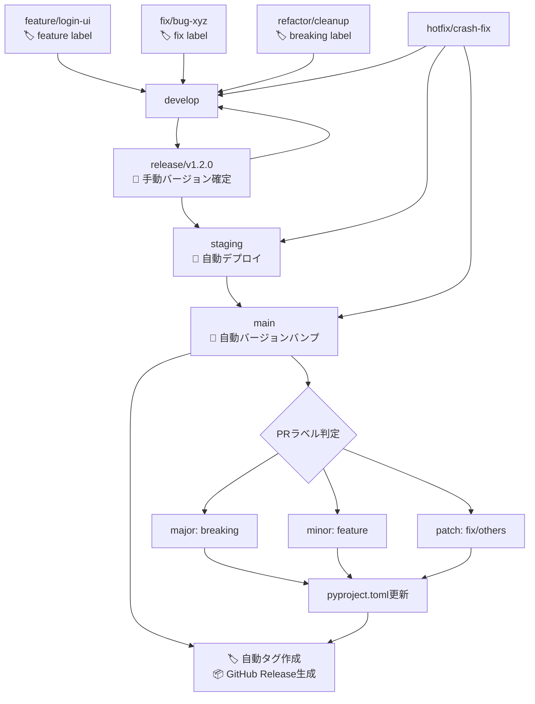

# CLAUDE.md

このファイルは、このリポジトリでコードを扱う際のClaude Code (claude.ai/code) への指針を提供します。

# MySwiftAgent

🚀 **MySwiftAgent** は、手軽で小回りの効く **パーソナルAIエージェント／LLMワークフロー** です。  
複雑な設定を避けつつ、日常タスクや開発支援をすばやく実行する「自分だけのAIエージェント」を目指しています。  

## ✨ 特徴

- ⚡ **Swift**：軽快に動作し、小回りの効く応答  
- 🧩 **Extensible**：モジュール的に機能を追加可能  
- 🎯 **Personalized**：ユーザーの目的に合わせたカスタマイズ  
- 🔄 **Workflow-oriented**：LLMを軸にした柔軟なワークフロー設計 

# 開発ルール

## 🌿 ブランチ構成

### 🧱 基本ブランチ

| ブランチ名  | 目的                   | 運用ルール                                                                             |
| ----------- | ---------------------- | -------------------------------------------------------------------------------------- |
| `main`      | 本番環境のコードベース | 保護ブランチ。タグ運用（例: `v1.2.0`）。署名付きアプリや公開ビルドに使用。直push禁止。 |
| `develop`   | 開発統合用             | 各 `feature/*` ブランチの統合先。単体・結合テストの対象。直接リリースには使用しない。  |
| `staging`   | UAT・実機確認用        | `release/*` からマージ。自動アップデート対象。                                         |
| `release/*` | リリース準備ブランチ   | `develop` から分岐。最終調整やQA、リリース検証を行う。                                 |

### ✍️ 作業ブランチ（トピックブランチ）

| ブランチ名   | 用途                   | 命名例                     |
| ------------ | ---------------------- | -------------------------- |
| `feature/*`  | 新機能の追加           | `feature/markdown-preview` |
| `fix/*`      | バグ修正               | `fix/window-size-restore`  |
| `refactor/*` | コード構造の改善       | `refactor/ipc-handler`     |
| `test/*`     | 技術検証・PoC          | `test/ipc-benchmark`       |
| `vibe/*`     | AI開発支援・実験的機能 | `vibe/ai-code-generation`  |
| `hotfix/*`   | 本番環境の緊急修正     | `hotfix/urgent-crash-fix`  |

### 📌 ブランチ間マージの原則

当プロジェクトでは、**異なるブランチ間のマージは必ず Pull Request（PR） を通じて行うことを厳守とします。**

#### ✅ 原則ルール（バージョン管理自動化対応）

| 作業元ブランチ | マージ先ブランチ             | 備考                                     | 自動化対応                                     |
| -------------- | ---------------------------- | ---------------------------------------- | ---------------------------------------------- |
| `feature/*`    | `develop`                    | 機能追加PR                               | 🏷️ `feature` ラベル必須（minor bump判定）      |
| `fix/*`        | `develop`                    | バグ修正PR                               | 🏷️ `fix` ラベル（patch bump判定）              |
| `vibe/*`       | `develop`                    | AI開発支援・実験的機能PR                 | 🏷️ 適切なラベル付与必須                       |
| `develop`      | `release/*`                  | リリース準備PR                           | 📝 手動バージョン確定・検証                    |
| `release/*`    | `staging`                    | UAT用PR                                  | 🚀 自動デプロイトリガー                        |
| `release/*`    | `main`                       | 本番リリースPR                           | 🔄 自動バージョンバンプ・タグ・Release作成     |
| `release/*`    | `develop`                    | 差分の開発ブランチ反映PR                 | 🔄 バックポート自動化                          |
| `hotfix/*`     | `main`, `staging`, `develop` | 本番障害対応用PR                         | ⚡ 緊急リリース自動化（patch bump + 即時展開） |

#### 🏷️ PRラベル運用ルール

**必須ラベル（セマンティックバージョニング）:**
- `breaking` → Major バージョンアップ（例: 1.2.3 → 2.0.0）
- `feature` → Minor バージョンアップ（例: 1.2.3 → 1.3.0）
- `fix` → Patch バージョンアップ（例: 1.2.3 → 1.2.4）

**補助ラベル:**
- `refactor`, `docs`, `test`, `ci` → 基本的にpatch扱い
- `dependencies` → セキュリティ更新時はpatch、機能追加時はminor

#### ❌ 禁止事項

- `main`, `release/*`, `staging` への**直push**
- CLI/GitHub UI上での直接マージ（PRを介さない `git merge` 等）

#### ❗ 例外対応

CI障害などによるやむを得ない直マージの必要が生じた場合は、**チーム責任者の承認と事前周知**を行ったうえで対応してください。

### 🔁 マージ戦略とフロー

#### 標準マージフロー（自動バージョン管理対応）



#### バグ修正の方針

| 発生フェーズ   | 修正対象ブランチ                         | 修正後のマージ先             |
| -------------- | ---------------------------------------- | ---------------------------- |
| `release/*`    | `release/*`                              | `staging`, `main`, `develop` |
| `staging`      | `release/*` または `fix/*` → `release/*` | 同上                         |
| `main`（本番） | `hotfix/*`（`main` から作成）            | `main`, `staging`, `develop` |

### 🚀 マルチプロジェクトリリース対応

複数のプロジェクトを同時にリリースする場合の手順：

#### 方法1: Workflow Dispatchによる一括リリース

```bash
# GitHub Actions UIから実行、または以下のコマンド
gh workflow run release.yml \
  -f projects="myscheduler,jobqueue,commonUI" \
  -f release_type=minor
```

**命名規則:**
- **単一プロジェクト**: `release/{project}/vX.Y.Z` (例: `release/myscheduler/v1.3.0`)
- **マルチプロジェクト**: `release/multi/vYYYY.MM.DD` (例: `release/multi/v2025.09.30`)

#### 方法2: 統合featureブランチによる同時更新

```bash
# 1. 統合featureブランチ作成
git checkout develop
git checkout -b feature/cross-project-update

# 2. 複数プロジェクトを同時に修正
vim myscheduler/app/api/common.py
vim jobqueue/app/api/common.py

# 3. まとめてコミット・PR作成
git add myscheduler/ jobqueue/
git commit -m "feat: update cross-project API interface"
gh pr create --base develop --label feature
```

#### 自動リリース検出（auto-release.yml）

mainブランチへのマージ時、変更されたすべてのプロジェクトを自動検出：

- **単一プロジェクト変更**: 個別タグ作成 (例: `myscheduler/v1.3.0`)
- **複数プロジェクト変更**: マルチプロジェクトタグ作成 (例: `multi/v2025.09.30`) + 個別プロジェクトタグ

---

# 🔧 開発環境・品質担保

## 🐍 Python開発環境

### 環境構築ツール

- **[uv](https://docs.astral.sh/uv/)** を標準の依存関係管理・仮想環境ツールとして採用
- 従来の `pip` + `venv` / `poetry` / `pipenv` は使用しない

### セットアップ手順

```bash
# 1. uvのインストール (初回のみ)
curl -LsSf https://astral.sh/uv/install.sh | sh

# 2. プロジェクトの依存関係同期
uv sync

# 3. 開発サーバー起動
uv run uvicorn app.main:app --reload

# 4. テスト実行
uv run pytest

# 5. 静的解析・フォーマット
uv run ruff check .
uv run ruff format .
uv run mypy .
```

### プロジェクト構成

```
pyproject.toml          # プロジェクト設定・依存関係
.python-version         # Python版数指定
uv.lock                 # ロックファイル (自動生成)
app/                    # アプリケーションコード
├── main.py            # FastAPIエントリーポイント
├── core/              # コア機能 (設定、DB、ワーカー)
├── models/            # データベースモデル
├── schemas/           # Pydanticスキーマ
└── api/               # APIエンドポイント
tests/                  # テストコード
├── unit/              # 単体テスト
├── integration/       # 結合テスト
└── conftest.py        # テスト設定
```

## 🛡️ 品質担保方針

### 静的解析・コード品質

| ツール | 用途 | 設定ファイル | 実行コマンド |
|--------|------|-------------|--------------|
| **Ruff** | Linting + Formatting | `pyproject.toml` | `uv run ruff check .` <br> `uv run ruff format .` |
| **MyPy** | 型チェック | `pyproject.toml` | `uv run mypy .` |

### テスト方針

| テストレベル | 対象 | フレームワーク | カバレッジ目標 |
|-------------|------|-------------|--------------|
| **単体テスト** | 個別関数・クラス | pytest | 80%以上 |
| **結合テスト** | API エンドポイント | pytest + httpx | 90%以上 |

### 必須チェック項目

**PRマージ前の必須確認事項：**

```bash
# 1. 全テストが通過すること
uv run pytest --cov=app --cov-report=term-missing

# 2. 静的解析エラーがないこと
uv run ruff check .
uv run mypy .

# 3. コードフォーマットが適用済みであること
uv run ruff format . --check

# 4. アプリケーションが正常に起動すること
uv run uvicorn app.main:app --host 0.0.0.0 --port 8000
```

### CI/CD との連携

GitHub Actions で以下を自動実行：

1. **品質チェック** - Linting, 型チェック, フォーマット確認
2. **テスト実行** - 単体・結合テスト + カバレッジ測定
3. **セキュリティ監査** - 脆弱性スキャン
4. **ビルド検証** - アプリケーション起動確認
5. **🔄 バージョン管理自動化** - セマンティックリリース、タグ作成、GitHub Release

#### 📋 自動化されるバージョン管理フロー

| トリガー | 自動実行内容 | 対象ワークフロー |
|---------|-------------|----------------|
| **PR → `develop`** | ラベル検証、コンベンショナルコミットチェック | `conventional-commits.yml` |
| **PR → `main` (merged)** | pyproject.toml バージョンバンプ、GitHub Release作成 | `auto-release.yml` |
| **`release/*` push** | リリース候補検証、自動デプロイトリガー | `release.yml` |
| **GitHub Release published** | 本番・ステージング自動デプロイ | `deploy-on-release.yml` |

### パフォーマンス・セキュリティ

- **HTTP タイムアウト**: 適切な上限設定（デフォルト30秒）
- **レスポンスサイズ制限**: デフォルト1MB、設定可能
- **リクエスト検証**: Pydantic による厳密なスキーマ検証
- **エラーハンドリング**: 機密情報の漏洩防止

---

# 🤖 AI開発支援・コード生成時の注意事項

## Claude Code 利用時のルール

1. **品質第一**: 生成されたコードも手動コードと同等の品質基準を適用
2. **テスト必須**: AI生成コードには特に包括的なテストを作成
3. **レビュー強化**: AI生成部分は人間による詳細レビューを実施
4. **セキュリティ重視**: 外部API呼び出し、認証まわりは特に慎重に検証
5. **ドキュメント更新**: 生成されたコードに対応する仕様書・READMEの更新
6. **🏷️ PRラベル必須**: AI生成PR も適切なセマンティックバージョニングラベルを付与

## 推奨フロー（自動化対応）

```
AI生成 → 静的解析 → テスト作成 → 🏷️ PRラベル付与 → 手動レビュー → PR作成 → 🔄 自動バージョン管理
```

### 🎯 AI開発時のバージョン管理指針

- **`vibe/*` ブランチ**: 実験的機能開発時も本番品質を維持し、適切なラベル付与
- **破壊的変更**: AIによるリファクタリングでAPI変更が生じる場合は `breaking` ラベル必須
- **機能追加**: 新機能実装時は `feature` ラベルでminor版数アップ
- **バグ修正**: AI による不具合修正は `fix` ラベルでpatch版数アップ

---

# 📦 新プロジェクト追加時の手順

MySwiftAgentはマルチプロジェクト対応のモノレポ構成を採用しており、新しいマイクロサービス・プロジェクトの追加は以下の手順で行います。

## 📋 追加手順チェックリスト

### 1. **プロジェクト基盤の作成**

```bash
# 新プロジェクトディレクトリ作成
mkdir {project_name}
cd {project_name}

# 必須ファイルの作成
touch pyproject.toml
touch Dockerfile
mkdir -p app tests/unit tests/integration
```

**必須ファイル構成:**
```
{project_name}/
├── pyproject.toml          # プロジェクト設定・依存関係・バージョン
├── Dockerfile              # コンテナイメージ定義
├── app/                    # アプリケーションコード
│   ├── main.py            # FastAPIエントリーポイント
│   └── core/              # コア機能
├── tests/                  # テストコード
│   ├── unit/              # 単体テスト
│   ├── integration/       # 結合テスト
│   └── conftest.py        # テスト設定
└── README.md              # プロジェクト固有ドキュメント
```

### 2. **pyproject.toml の設定**

```toml
[project]
name = "{project_name}"
version = "0.1.0"  # 初回リリース用バージョン
description = "プロジェクトの説明"
authors = [
    {name = "Your Name", email = "your.email@example.com"},
]
dependencies = [
    "fastapi>=0.100.0",
    "uvicorn>=0.23.0",
    # その他の依存関係
]

[project.optional-dependencies]
dev = [
    "pytest>=7.0.0",
    "pytest-cov>=4.0.0",
    "ruff>=0.1.0",
    "mypy>=1.0.0",
]

[tool.ruff]
target-version = "py312"
line-length = 88

[tool.mypy]
python_version = "3.12"
warn_return_any = true
warn_unused_configs = true
```

### 3. **CI/CD設定への追加**

#### 3.1 release.yml ワークフローの更新

**`/.github/workflows/release.yml`** の以下の箇所を更新：

```yaml
# workflow_dispatch inputs への追加
project:
  description: 'Project to release'
  required: true
  type: choice
  options: ['myscheduler', 'jobqueue', '{project_name}']  # 新プロジェクト追加
  default: 'myscheduler'

# 各ジョブの条件に新プロジェクトを追加
test:
  if: |
    needs.validate-release.outputs.project == 'myscheduler' ||
    needs.validate-release.outputs.project == 'jobqueue' ||
    needs.validate-release.outputs.project == '{project_name}'  # 新プロジェクト追加

security-scan:
  if: |
    needs.validate-release.outputs.project == 'myscheduler' ||
    needs.validate-release.outputs.project == 'jobqueue' ||
    needs.validate-release.outputs.project == '{project_name}'  # 新プロジェクト追加

# 他のジョブでも同様に条件を追加
```

#### 3.2 他のワークフローファイルの更新確認

以下のワークフローが新プロジェクトに対応するか確認・更新：
- `ci-feature.yml`
- `cd-develop.yml`
- `ci-main.yml`

### 4. **Dockerfileの作成**

```dockerfile
FROM python:3.12-slim

WORKDIR /app

# Install uv
COPY --from=ghcr.io/astral-sh/uv:latest /uv /bin/uv

# Copy dependency files
COPY pyproject.toml uv.lock ./

# Install dependencies
RUN uv sync --no-dev

# Copy application code
COPY app/ ./app/

# Health check endpoint
HEALTHCHECK --interval=30s --timeout=3s --start-period=5s --retries=3 \
  CMD curl -f http://localhost:8000/health || exit 1

EXPOSE 8000

CMD ["uv", "run", "uvicorn", "app.main:app", "--host", "0.0.0.0", "--port", "8000"]
```

### 5. **基本APIエンドポイントの実装**

**`app/main.py`**:
```python
from fastapi import FastAPI

app = FastAPI(
    title="{project_name}",
    version="0.1.0",
    description="プロジェクトの説明"
)

@app.get("/health")
async def health_check():
    """ヘルスチェックエンドポイント（CI/CDで使用）"""
    return {"status": "healthy", "service": "{project_name}"}

@app.get("/")
async def root():
    """ルートエンドポイント"""
    return {"message": "Welcome to {project_name}"}

@app.get("/api/v1/")
async def api_root():
    """API v1 ルート"""
    return {"version": "1.0", "service": "{project_name}"}
```

### 6. **テスト環境の設定**

**`tests/conftest.py`**:
```python
import pytest
from fastapi.testclient import TestClient
from app.main import app

@pytest.fixture
def client():
    return TestClient(app)
```

**`tests/integration/test_api.py`**:
```python
def test_health_check(client):
    response = client.get("/health")
    assert response.status_code == 200
    assert response.json() == {"status": "healthy", "service": "{project_name}"}

def test_root_endpoint(client):
    response = client.get("/")
    assert response.status_code == 200
```

### 7. **初回リリースの実行**

```bash
# 1. 開発ブランチから作業開始
git checkout develop
git pull origin develop

# 2. 新プロジェクト用feature/vibe ブランチ作成
git checkout -b feature/{project_name}-initial-setup

# 3. ファイル追加・コミット
git add {project_name}/
git commit -m "feat({project_name}): add initial project structure

- Add pyproject.toml with basic dependencies
- Add FastAPI application with health check
- Add Docker configuration
- Add test structure and basic tests
- Add CI/CD integration

🤖 Generated with [Claude Code](https://claude.ai/code)

Co-Authored-By: Claude <noreply@anthropic.com>"

# 4. プッシュしてPR作成
git push origin feature/{project_name}-initial-setup

# 5. developブランチへのPR作成（featureラベル付与）
gh pr create \
  --title "🎉 Add new project: {project_name}" \
  --body "初回プロジェクト追加..." \
  --base develop \
  --label feature
```

### 8. **初回リリースの実行**

```bash
# developマージ後、リリースワークフロー実行
gh workflow run release.yml \
  -f project={project_name} \
  -f release_type=minor \
  -f custom_version="0.1.0"

# または手動でリリースブランチ作成
git checkout develop
git pull origin develop
git checkout -b release/{project_name}/v0.1.0
git push origin release/{project_name}/v0.1.0
```

## 📊 マルチプロジェクト対応状況

### 現在のプロジェクト一覧

| プロジェクト | 目的 | 技術スタック | リリース状況 |
|-------------|------|-------------|-------------|
| `myscheduler` | ジョブスケジューリング | FastAPI + APScheduler + SQLAlchemy | ✅ 本番運用中 |
| `jobqueue` | ジョブキュー管理 | FastAPI + Redis/PostgreSQL | 🚀 初回リリース準備中 |
| `docs` | プロジェクトドキュメント | Markdown + 静的サイトジェネレータ | 📝 軽量ワークフロー対応 |

### プロジェクト追加時のCI/CD更新箇所

- **`.github/workflows/release.yml`**: workflow_dispatch inputsとジョブ条件
- **`.github/workflows/ci-feature.yml`**: フィーチャーブランチ用品質チェック（docs/** パス除外設定済み）
- **`.github/workflows/cd-develop.yml`**: 開発統合用テスト（docs/** パス除外設定済み）
- **`.github/workflows/ci-main.yml`**: 本番品質チェック（docs/** パス除外設定済み）
- **`.github/workflows/hotfix.yml`**: 緊急修正ワークフロー（docs変更時は軽量実行）
- **`.github/workflows/docs.yml`**: **🆕 ドキュメント専用軽量ワークフロー**
- **`.github/DEPLOYMENT.md`**: プロジェクト一覧表とリリース手順

### 📝 ドキュメントプロジェクト専用の最適化

**docs プロジェクト** は他のアプリケーションプロジェクトと異なり、以下の最適化が実装されています：

#### **軽量ワークフロー分離**
- **専用ワークフロー**: `.github/workflows/docs.yml`
- **処理内容**: Markdownlinting、構造検証、静的サイト生成のみ
- **除外処理**: Docker、Python依存関係、セキュリティスキャンは実行しない

#### **パス除外設定**
他の重いワークフローから `docs/**` パスを除外：
```yaml
paths:
  - 'myscheduler/**'
  - 'jobqueue/**'
  - '.github/workflows/**'
  # docs changes are handled by separate docs workflow
  - '!docs/**'
```

#### **バージョン管理対応**
- **リリースブランチ**: `release/docs/vX.Y.Z` 形式をサポート
- **pyproject.toml**: 存在しない場合は軽量版を自動生成
- **専用バリデーション**: release.ymlでdocs専用の軽量チェックを実行

## 🔧 新プロジェクト追加後の品質チェック

```bash
# 新プロジェクトのローカル検証
cd {project_name}

# 1. 依存関係インストール
uv sync --extra dev

# 2. 品質チェック実行
uv run ruff check .
uv run ruff format . --check
uv run mypy app/

# 3. テスト実行
uv run pytest tests/unit/ -v
uv run pytest tests/integration/ -v

# 4. アプリケーション起動テスト
uv run uvicorn app.main:app --host 0.0.0.0 --port 8000

# 5. ヘルスチェック
curl -f http://localhost:8000/health
```

## ⚠️ 注意事項

1. **リリースブランチ命名**: 必ず `release/{project_name}/vX.Y.Z` 形式を使用
2. **初回バージョン**: 新プロジェクトは `0.1.0` から開始することを推奨
3. **CI/CD設定**: 各ワークフローファイルへの新プロジェクト追加を忘れずに実施
4. **依存関係管理**: `uv`を使用し、`pyproject.toml`で一元管理
5. **Docker対応**: リリースフローではDockerイメージビルド・テストが必須
6. **API規約**: ヘルスチェック（`/health`）とルートエンドポイント（`/`、`/api/v1/`）は実装必須