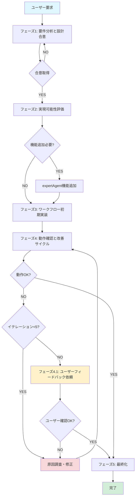

# GEMINI.md

このファイルは、Gemini CLI (Google AI Studio) を使用してGraphAI YMLワークフローファイルを自動生成する際の指針を提供します。

## 📑 目次

- [📋 概要](#-概要)
- [🎯 目的](#-目的)
- [📖 ワークフロー生成ルール](#-ワークフロー生成ルール)
- [💬 Gemini CLI への指示方法](#-gemini-cli-への指示方法)
- [🔧 生成されたワークフローの動作確認](#-生成されたワークフローの動作確認)
- [✅ チェックリスト](#-チェックリスト)
- [📚 参考リンク](#-参考リンク)
- [開発の進め方（5フェーズワークフロー）](#開発の進め方5フェーズワークフロー)
- [📝 LLMワークフロー作成手順（詳細）](#-llmワークフロー作成手順詳細)
- [動作確認とトラブルシューティング](#動作確認とトラブルシューティング)
- [ワークフロー作成時の動作確認方法](#ワークフロー作成時の動作確認方法)
- [まとめ](#まとめ)
- [📂 開発状況の記録](#-開発状況の記録)
- [🤝 サポート](#-サポート)
- [📘 ドキュメント改善ポリシー](#-ドキュメント改善ポリシー)

---

## 📋 概要

Gemini CLIを使用することで、自然言語の指示からGraphAI YMLワークフローファイルを自動生成できます。このドキュメントでは、Gemini CLIの設定方法と、効果的なワークフロー生成のためのガイドラインを提供します。

## 🎯 目的

- **自然言語からのワークフロー生成**: ユーザーの要求を自然言語で受け取り、GraphAI YMLファイルを自動生成
- **品質担保**: 生成されたワークフローが設計ルールに準拠し、動作確認済みであることを保証
- **効率化**: 手動でのYMLファイル作成にかかる時間を大幅に削減

## 📖 ワークフロー生成ルール

**重要**: ワークフロー生成の詳細なルールと設計指針は以下のドキュメントを参照してください:

📄 **[GraphAI Workflow Generation Rules](./graphAiServer/docs/GRAPHAI_WORKFLOW_GENERATION_RULES.md)**

このドキュメントには以下の情報が含まれています:

- ✅ 基本構造と必須要素
- ✅ エージェント種別と使用方法
- ✅ データフローパターン
- ✅ expertAgent API統合
- ✅ エラー回避パターン
- ✅ パフォーマンス最適化
- ✅ 命名規則とデバッグ方法
- ✅ 実装例（シンプルから複雑まで）
- ✅ YMLヘッダーコメント規約
- ✅ Agent専用ガイド（Playwright, Explorer, File Reader）

## 💬 Gemini CLI への指示方法

Gemini CLIを使用してワークフロー生成を行う際は、**[GraphAI Workflow Generation Rules](./graphAiServer/docs/GRAPHAI_WORKFLOW_GENERATION_RULES.md)** を必ず参照してください。

詳細なシステムプロンプト、ユーザー指示の例、5フェーズの作業手順については、上記ドキュメントに記載されています。

## 🔧 生成されたワークフローの動作確認

### 1. ファイル保存

生成されたYMLファイルを以下のディレクトリに保存:

```bash
./graphAiServer/config/graphai/llmwork/{purpose}_{timestamp}.yml
```

### 2. graphAiServer起動確認

```bash
# graphAiServerが起動していることを確認
curl http://127.0.0.1:8105/health

# expertAgentが起動していることを確認（4ワーカー推奨）
curl http://127.0.0.1:8104/health
```

### 3. ワークフロー実行

```bash
# 開発用エンドポイントで実行（想定）
curl -X POST http://127.0.0.1:8105/api/v1/myagent/llmwork/{your_workflow_name_without_extension} \
  -H "Content-Type: application/json" \
  -d '{
    "user_input": "ユーザー入力テキスト"
  }' ```

### 4. エラー発生時の対応

エラーが発生した場合は、以下のログを確認:

```bash
# graphAiServerログ
tail -n 100 logs/graphaiserver.log | grep -i error

# expertAgentログ
tail -n 100 logs/expertagent.log | grep -i error
```

**よくあるエラーと対応**:

| エラー | 原因 | 対応 |
|-------|------|------|
| `TypeError: fetch failed` | expertAgentへの接続失敗 | ポート番号確認（8104）、ワーカー数確認 |
| `undefined` が出力 | sourceノード参照エラー | `:source.text` → `:source` に修正 |
| `mapAgentでタイムアウト` | 並列処理過負荷 | `concurrency: 2` を追加 |


## ✅ チェックリスト

ワークフロー生成時に以下を確認してください:

### 基本構造
- [ ] `version: 0.5` を含む
- [ ] `nodes:` セクションがある
- [ ] `source: {}` ノードがある
- [ ] 最低1つの `isResult: true` ノードがある

### データフロー
- [ ] すべてのノード間のデータ参照が正しい（`:node_name.field`）
- [ ] `source` ノードは直接参照（`:source`）している
- [ ] `mapAgent` 内では `:row.field` でアクセスしている

### expertAgent API統合
- [ ] すべてのAPI URLが `http://127.0.0.1:8104` を使用
- [ ] 使用するエンドポイントが存在する
- [ ] `model_name` パラメータが有効なモデル名

### モデル選択
- [ ] ローカルLLMを優先使用（gpt-oss:20b, gpt-oss:120b）
- [ ] タスクの複雑度に応じたモデルを選択

### エラー処理
- [ ] タイムアウトが適切に設定されている
- [ ] 重要なノードで `console.after: true` を設定
- [ ] 並列処理に `concurrency` パラメータを設定

### 命名規則
- [ ] ノード名が意味のある名前
- [ ] 小文字スネークケースを使用
- [ ] 適切な接尾辞（`_builder`, `_mapper` など）を使用

## 📚 参考リンク

- 📄 **[GraphAI Workflow Generation Rules](./graphAiServer/docs/GRAPHAI_WORKFLOW_GENERATION_RULES.md)** - 必須参照ドキュメント
- 🌐 **[Google AI Studio](https://aistudio.google.com/)** - Gemini API管理
- 🔧 **[GraphAI公式ドキュメント](https://github.com/receptron/graphai)** - GraphAIフレームワーク仕様
- 📖 **[expertAgent API仕様](./expertAgent/docs/)** - expertAgent統合ガイド

## 開発の進め方（5フェーズワークフロー）

GraphAI YMLワークフローの開発は、以下の5フェーズで進めます。各フェーズの詳細は **[GRAPHAI_WORKFLOW_GENERATION_RULES.md](./graphAiServer/docs/GRAPHAI_WORKFLOW_GENERATION_RULES.md)** を参照してください。

### フェーズ1: 要件分析と設計合意 ✅

**目的**: ユーザーの要求を正確に理解し、実現可能性を評価

**実施内容**:
1. ユーザーからの要求を理解する
2. 必要な機能を整理（検索、Agent、LLM処理等）
3. 概算工数・技術的制約を確認
4. 作業計画を立案し、ユーザーに合意を得る

**成果物**: 要求定義書、作業計画

---

### フェーズ2: ワークフロー設計 📐

**目的**: データフローと処理構造を明確化

**実施内容**:
1. ワークフロー全体の流れを設計
   ```sh
   graphai -m <ワークフローファイル名>  # Mermaid図で視覚化
   ```
2. ノード間のインターフェース（入出力データ）を設計
3. 使用するAgentとモデルを選択（**[Agent選択指針](./graphAiServer/docs/GRAPHAI_WORKFLOW_GENERATION_RULES.md#agent選択指針)** 参照）
4. エラー処理・並列処理の方針を決定

**チェックポイント**:
- [ ] すべてのノードの入出力が明確
- [ ] データ参照パス（`:node_name.field`）が正しい
- [ ] 並列処理に `concurrency` を設定済み

**成果物**: ワークフローYMLファイル（初版）、設計ドキュメント

---

### フェーズ3: テストモード検証 🧪

**目的**: LLM呼び出しなしで構造を検証（高速・低コスト）

**実施内容**:
1. 複数パターンのテストデータを用意（最低3パターン）
2. testモードで実行し、ノード間のデータ受け渡しを確認
   ```bash
   # expertAgent APIのtest_mode機能を使用
   curl -X POST http://127.0.0.1:8104/aiagent-api/v1/mylllm \
     -H "Content-Type: application/json" \
     -d '{"test_mode": true, "test_response": {...}}'
   ```
3. エラーが発生した場合は設計を見直し（**[よくあるエラーと対応](./graphAiServer/docs/GRAPHAI_WORKFLOW_GENERATION_RULES.md#よくあるエラーと対応)** 参照）

**合格基準**:
- [ ] すべてのテストパターンで構造エラーが発生しない
- [ ] データフローが期待通り動作
- [ ] `undefined` や参照エラーが発生しない

**成果物**: テスト済みワークフローYML、テストデータ

---

### フェーズ4: 段階的本番実行 🚀

**目的**: ブロック毎に実際のLLM呼び出しで動作確認

**実施内容**:
1. ワークフローを2〜4つのブロックに分割
   - 例: ①入力処理 → ②検索・情報収集 → ③LLM生成 → ④出力整形
2. ブロック毎に本番モードで実行・検証
3. 各ブロックの出力品質を確認
4. エラー発生時は **[トラブルシューティング](#動作確認とトラブルシューティング)** を参照

**検証ポイント**:
- [ ] 各ブロックの出力が期待通り
- [ ] LLMの応答品質が要求を満たす
- [ ] タイムアウト・エラーが発生しない
- [ ] `console.after: true` で重要ノードの出力をログ確認

**イテレーション改善**:
- 最大5回のイテレーションで品質を改善
- ルール更新が必要な場合は **[GRAPHAI_WORKFLOW_GENERATION_RULES.md](./graphAiServer/docs/GRAPHAI_WORKFLOW_GENERATION_RULES.md)** を更新

**成果物**: 本番検証済みワークフローYML、実行ログ

---

### フェーズ5: 最終化とドキュメント整備 📝

**目的**: 本番運用可能な状態に整備

**実施内容**:
1. YMLヘッダーコメントを完成させる
   - Created, User Request, Test Results, Description, Notes
2. 最終動作確認（全体テスト）
3. パフォーマンス最適化
   - モデル選択の見直し（**[モデル選択指針](./graphAiServer/docs/GRAPHAI_WORKFLOW_GENERATION_RULES.md#モデル選択指針)** 参照）
   - 不要なノードの削減
4. ドキュメント更新

**最終チェックリスト**: 下記「✅ チェックリスト」セクションを参照

**成果物**: 本番リリース用ワークフローYML、完全ドキュメント

---

### 📊 フェーズ進行の目安

| フェーズ | 所要時間 | 主要アウトプット |
|---------|---------|----------------|
| フェーズ1 | 10〜30分 | 要求定義、作業計画 |
| フェーズ2 | 30〜60分 | ワークフローYML初版 |
| フェーズ3 | 15〜30分 | テスト済みYML |
| フェーズ4 | 30〜90分 | 本番検証済みYML |
| フェーズ5 | 15〜30分 | リリース版YML |

**合計**: 約2〜4時間（複雑度により変動）

---

## 📝 LLMワークフロー作成手順（詳細）

GraphAI YMLワークフローの作成を5つのフェーズに分けて実施します。このセクションでは、各フェーズの詳細な実施手順と、イテレーション改善フローを説明します。

### 5フェーズ開発フロー概要図



**Mermaidダイアグラムの見方**:
- 青色（水色）: 開始ノード
- 緑色: 完了ノード
- 黄色: 警告（ユーザーフィードバック必要）
- 赤色（ピンク）: エラー修正

---

### フェーズ1: 要件分析と設計合意

#### 目的
ユーザーの要求を正確に理解し、実装すべきワークフローの全体像を合意する。

#### 実施内容

1. **ユーザー要求の確認**
   - 入力データ形式
   - 期待される出力形式
   - 処理フロー（順次処理 or 並列処理）
   - 品質要件（精度、速度、コスト）

2. **大まかな処理フローの提示**
   ```
   例：
   1. ユーザー入力（キーワード）
   2. Google検索でクエリ生成
   3. 検索実行（3件取得）
   4. 情報整理（explorerエージェント）
   5. レポート生成（LLM）
   6. 結果出力
   ```

3. **ユーザーとの合意形成**
   - 処理フローが要求に合致しているか確認
   - 必要に応じてフローを調整
   - 処理時間の目安を提示（軽量: 1-2分、中程度: 5-10分、重い: 20-30分）

---

### フェーズ2: 実現可能性評価

#### 目的
現在のexpertAgent機能で要求を実現できるか評価し、不足機能があればユーザーに提案する。

#### 評価項目と判定基準

| 評価項目 | 判定基準 | 対応 |
|---------|---------|------|
| **エンドポイントの存在** | 必要なAPIエンドポイントがexpertAgentに実装済みか | 未実装なら機能追加提案 |
| **データ形式の互換性** | 入力/出力データ形式が既存エンドポイントと互換性があるか | 不整合なら中間変換処理を追加 |
| **並列処理の必要性** | 大量データ処理でmapAgentが必要か | 必要ならconcurrency設定を計画 |
| **タイムアウトリスク** | 処理時間が長く、タイムアウトのリスクがあるか | リスクあればユーザーに事前通知 |

#### 不足機能の例と提案方法

**例1: YouTube字幕取得機能が必要な場合**

```
【実現可能性評価結果】

ユーザー要求: YouTubeの動画URLから字幕テキストを取得し、要約レポートを生成

評価結果:
  ✅ Google検索: 実装済み (/utility/google_search)
  ✅ LLM要約: 実装済み (/mylllm)
  ❌ YouTube字幕取得: 未実装

【機能追加提案】

expertAgentに以下のエンドポイント追加を推奨します：

エンドポイント: /utility/youtube_transcript
機能: YouTubeのURLまたは動画IDから字幕テキストを取得
実装方法: youtube-transcript-api パッケージを使用
処理時間: 約5-10秒（動画長により変動）

追加実装の工数: 約1-2時間

このまま進めますか？
  A) 機能追加を実施してから続行
  B) 現在の機能でできる範囲で代替案を検討
  C) 要求を見直す
```

**例2: 外部API連携が必要な場合**

```
【実現可能性評価結果】

ユーザー要求: 株価データを取得して投資レポートを生成

評価結果:
  ✅ Google検索: 実装済み
  ✅ LLM分析: 実装済み
  ⚠️ 株価データ取得: fetchAgentで外部API呼び出しは可能だが、
                      専用エンドポイントがないため、YMLファイルで
                      直接APIを指定する必要がある

【実装方針提案】

方針A（推奨）: Yahoo Finance APIを直接fetchAgentで呼び出す
  - YMLファイルで以下を記述:
    url: https://query1.finance.yahoo.com/v8/finance/chart/{symbol}
  - expertAgentへの変更: 不要
  - 制約: API仕様変更リスクあり

方針B: expertAgentに専用エンドポイント追加
  - エンドポイント: /utility/stock_data
  - 工数: 約2-3時間
  - メリット: エラーハンドリング、キャッシュ機能を実装可能

どちらで進めますか？
```

#### 機能追加が必要な場合の対応フロー

1. **ユーザーへ提案を提示**（上記例を参照）
2. **承認待ち**
   - 承認された場合: expertAgentへの機能追加を実施
   - 却下された場合: 代替案を検討、または要求を見直し
3. **機能追加後の確認**
   - 新エンドポイントの動作テスト
   - ドキュメント更新（本ルールファイルへの追記）

---

### フェーズ3: ワークフロー初期実装

#### 目的
`./graphAiServer/config/graphai/llmwork` ディレクトリにYMLファイルを作成し、初期実装を行う。

#### 実施内容

1. **ファイル命名**
   ```
   命名規則: {purpose}_{timestamp}.yml
   例: podcast_generation_20251012.yml
       stock_report_20251012.yml
   ```

2. **ヘッダーコメント記載**（前述の規約に従う）
   ```yaml
   # =============================================================================
   # GraphAI Workflow File
   # =============================================================================
   # Created: 2025-10-12 16:00:00
   # User Request:
   #   [フェーズ1で合意した内容を記載]
   #
   # Test Results:
   #   - [初期実装時点では空欄]
   #
   # Description:
   #   [フェーズ1で設計した処理フローを記載]
   # =============================================================================
   ```

3. **ワークフロー実装のチェックリスト**

   - [ ] `version: 0.5` を記載
   - [ ] `source: {}` ノードを定義
   - [ ] 最低1つの `isResult: true` ノードを定義
   - [ ] データフロー参照が正しい（`:source`, `:node_name.field`）
   - [ ] mapAgent使用時は `concurrency` を設定（推奨: 2-3）
   - [ ] 重要ノードに `console.after: true` を設定
   - [ ] モデル選択が適切（軽量: 4B、通常: 20B、複雑: 120B）
   - [ ] エンドポイントURLが正しい（ポート8104）

4. **実装時の注意点**

   | 注意項目 | 推奨事項 |
   |---------|---------|
   | **sourceノード参照** | `:source` で直接参照（`:source.text` は NG） |
   | **mapAgent並列数** | 軽量:4-8、中程度:2-3、重い:1-2 |
   | **タイムアウト** | graphAiServerでグローバル300秒設定を確認 |
   | **expertAgentワーカー** | 並列処理時は `--workers 4` 以上を推奨 |

---

### フェーズ4: 動作確認と改善サイクル（最大5イテレーション）

#### 目的
graphAiServer経由で動作確認を行い、エラーがあれば原因を調査・修正する。

#### イテレーションフロー

```
イテレーション N (N = 1, 2, 3, 4, 5)
├─ ステップ1: graphAiServerで実行
├─ ステップ2: 結果判定
│   ├─ SUCCESS → フェーズ5へ
│   └─ FAILED → ステップ3へ
├─ ステップ3: エラー原因調査
│   ├─ ログ確認（graphAiServer、expertAgent）
│   ├─ YMLファイル検証
│   └─ エンドポイント動作確認
├─ ステップ4: ルール更新・YML修正
│   ├─ 本ドキュメント（GRAPHAI_WORKFLOW_GENERATION_RULES.md）更新
│   ├─ YMLファイル修正
│   └─ expertAgent側の修正（必要に応じて）
└─ ステップ5: Test Resultsヘッダー更新
    └─ YMLファイルのヘッダーに動作確認結果を追記
```

#### ステップ1: graphAiServerで実行

**実行コマンド例**:
```bash
# graphAiServerが起動していることを確認
curl http://127.0.0.1:8105/health

# ワークフロー実行（新形式: モデル名をURLパスに含める）
curl -X POST http://127.0.0.1:8105/api/v1/myagent/llmwork/{your_workflow_name_without_extension} \
  -H "Content-Type: application/json" \
  -d '{
    "user_input": "ユーザー入力テキスト"
  }'
```

**確認ポイント**:
- HTTPステータスコード（200 OK / 500 Internal Server Error）
- レスポンスボディの内容
- 処理時間

#### ステップ2: 結果判定

| 判定 | 条件 | 次のアクション |
|-----|------|--------------|
| **SUCCESS** | - HTTPステータス200<br>- 期待通りの出力<br>- エラーログなし | フェーズ5へ進む |
| **FAILED** | - HTTPエラー<br>- 出力が不正<br>- タイムアウト<br>- エラーログあり | ステップ3（原因調査）へ |

#### ステップ3: エラー原因調査

**調査手順**:

1. **graphAiServerログ確認**
   ```bash
   tail -n 100 logs/graphaiserver.log | grep -i error
   ```

2. **expertAgentログ確認**
   ```bash
   tail -n 100 logs/expertagent.log | grep -i error
   ```

3. **YMLファイル構文検証**
   - sourceノード参照が正しいか
   - mapAgent使用時に `concurrency` があるか
   - エンドポイントURLが正しいか（ポート8104）

4. **エンドポイント動作確認**
   ```bash
   # expertAgentエンドポイントを直接テスト
   curl -X POST http://127.0.0.1:8104/aiagent-api/v1/mylllm \
     -H "Content-Type: application/json" \
     -d '{"user_input": "test", "model_name": "gpt-oss:20b"}'
   ```

**よくあるエラーと対応**:

| エラーパターン | 原因 | 対応 |
|-------------|------|------|
| `TypeError: fetch failed` | expertAgentへの接続失敗 | - expertAgent起動確認<br>- ポート番号確認（8104）<br>- ワーカー数確認（`--workers 4`） |
| `undefined` が出力に含まれる | sourceノード参照エラー | `:source.text` → `:source` に修正 |
| `RuntimeWarning: coroutine was never awaited` | expertAgent側のawait漏れ | expertAgentのPythonコードに `await` 追加 |
| `mapAgentでタイムアウト` | 並列処理過負荷 | YMLに `concurrency: 2` 追加 |

#### ステップ4: ルール更新・YML修正

**ルール更新の判断基準**:

| 状況 | ルール更新の必要性 | 更新内容 |
|-----|----------------|---------|
| **新しいエラーパターン発見** | ✅ 必要 | 「エラー回避パターン」セクションに追記 |
| **新機能追加** | ✅ 必要 | 「expertAgent API統合」セクションに追記 |
| **既知のエラー** | ⭕ 不要 | YMLファイルのみ修正 |
| **ユーザー固有のエラー** | ⭕ 不要 | YMLファイルのNotesに記載 |

**YML修正例**:

```yaml
# 修正前（エラー発生）
explorer_mapper:
  agent: mapAgent
  inputs:
    rows: :planner.result.outline
  params:
    compositeResult: true
  # ← concurrency がない

# 修正後（エラー解消）
explorer_mapper:
  agent: mapAgent
  inputs:
    rows: :planner.result.outline
  params:
    compositeResult: true
    concurrency: 2  # ← 追加
```

#### ステップ5: Test Resultsヘッダー更新

**YMLファイルのヘッダーに動作確認結果を追記**:

```yaml
# Test Results:
#   - [2025-10-12 16:30] Status: FAILED - mapAgentでfetch failed、concurrency未設定
#   - [2025-10-12 16:45] Status: SUCCESS - concurrency:2追加で全ノード正常動作
```

#### イテレーション終了条件

| 条件 | 判定 | 次のアクション |
|-----|------|--------------|
| **SUCCESS判定** | ✅ | フェーズ5へ進む |
| **イテレーション回数 < 5** | ⏩ | 次のイテレーションへ |
| **イテレーション回数 ≥ 5** | ⚠️ | フェーズ4.1（ユーザーフィードバック依頼）へ |

---

### フェーズ4.1: ユーザーフィードバック依頼（イテレーション5回超過時）

#### 目的
5回のイテレーションで解決できない場合、ユーザーに動作確認を依頼し、フィードバックを得る。

#### 実施内容

1. **現状報告**
   ```
   【動作確認依頼】

   5回のイテレーションを実施しましたが、以下の課題が未解決です：

   問題点:
     - [具体的なエラー内容]
     - [再現手順]
     - [試した対策]

   確認依頼事項:
     1. 以下のコマンドでワークフローを実行してください
        $ curl -X POST http://127.0.0.1:8105/api/v1/workflow/execute ...

     2. 実行結果（成功 or 失敗）を教えてください

     3. 失敗した場合、エラーログを共有してください
        $ tail -n 50 logs/graphaiserver.log
        $ tail -n 50 logs/expertagent.log
   ```

2. **ユーザーからのフィードバック受領**
   - 成功した場合: フェーズ5へ進む
   - 失敗した場合: 新しいエラー情報をもとに再度原因調査

3. **フィードバックをもとにした修正**
   - ユーザー環境固有の問題であれば、YMLファイルのNotesに記載
   - 一般的な問題であれば、ルール更新を実施

---

### フェーズ5: 最終化

#### 目的
動作確認が完了したワークフローを最終化し、ヘッダー情報を更新する。

#### 実施内容

1. **Test Resultsヘッダーの最終更新**
   ```yaml
   # Test Results:
   #   - [2025-10-12 16:30] Status: FAILED - mapAgentでfetch failed、concurrency未設定
   #   - [2025-10-12 16:45] Status: SUCCESS - concurrency:2追加で全4章正常処理
   #   - [2025-10-12 17:00] Status: SUCCESS - 音声合成・Google Driveアップロード確認
   #   - [2025-10-12 17:15] Status: SUCCESS - ユーザー環境での最終動作確認完了
   ```

2. **Notesセクションの追加（必要に応じて）**
   ```yaml
   # Notes:
   #   - expertAgent起動時は必ず --workers 4 を指定すること
   #   - 大型モデル（gpt-oss:120b）使用時はタイムアウト300秒を確認
   #   - YouTube動画URLの場合、字幕が存在しない動画ではエラーになる
   ```

3. **ファイル配置の確認**
   - 初期実装時: `./graphAiServer/config/graphai/llmwork/` に配置
   - 本番運用時: `./graphAiServer/config/graphai/default/` または `./graphAiServer/config/graphai/tutorial/` に移動（用途に応じて）

4. **ドキュメント更新（必要に応じて）**
   - 新しいエンドポイントを追加した場合: 本ドキュメントの「expertAgent API統合」セクションに追記
   - 新しいエラーパターンを発見した場合: 「エラー回避パターン」セクションに追記

5. **ユーザーへの完了報告**
   ```
   【ワークフロー作成完了】

   ファイル: ./graphAiServer/config/graphai/llmwork/podcast_generation_20251012.yml

   動作確認結果: SUCCESS
   - 全ノードが正常に動作
   - 期待通りの出力を確認
   - 処理時間: 約15分（4章構成の場合）

   使用方法:
     $ curl -X POST http://127.0.0.1:8105/api/v1/workflow/execute \
       -H "Content-Type: application/json" \
       -d '{"workflow_file": "llmwork/podcast_generation_20251012.yml", "input": "量子コンピュータの最新動向"}'

   注意事項:
     - expertAgentは --workers 4 で起動してください
     - 処理時間は入力内容により変動します（10-30分程度）
   ```

---

### 作成手順のチェックリスト（全フェーズ共通）

AIエージェントは以下のチェックリストを参照し、各フェーズで必要な確認を実施してください。

#### フェーズ1: 要件分析と設計合意

- [ ] ユーザー要求の入力データ形式を確認した
- [ ] 期待される出力形式を確認した
- [ ] 処理フロー（順次 or 並列）を確認した
- [ ] 品質要件（精度、速度、コスト）を確認した
- [ ] 大まかな処理フローをユーザーに提示した
- [ ] ユーザーから設計合意を得た

#### フェーズ2: 実現可能性評価

- [ ] 必要なエンドポイントがexpertAgentに実装済みか確認した
- [ ] データ形式の互換性を確認した
- [ ] 並列処理の必要性を評価した
- [ ] タイムアウトリスクを評価した
- [ ] 不足機能がある場合、ユーザーに提案を提示した
- [ ] 提案が承認された場合、expertAgentへの機能追加を実施した

#### フェーズ3: ワークフロー初期実装

- [ ] ファイル名を適切に命名した（`{purpose}_{timestamp}.yml`）
- [ ] ヘッダーコメントを規約に従って記載した
- [ ] `version: 0.5` を記載した
- [ ] `source: {}` ノードを定義した
- [ ] 最低1つの `isResult: true` ノードを定義した
- [ ] データフロー参照が正しい（`:source`, `:node_name.field`）
- [ ] mapAgent使用時は `concurrency` を設定した
- [ ] 重要ノードに `console.after: true` を設定した
- [ ] モデル選択が適切（軽量: 4B、通常: 20B、複雑: 120B）
- [ ] エンドポイントURLが正しい（ポート8104）

#### フェーズ4: 動作確認と改善サイクル

- [ ] graphAiServer経由でワークフローを実行した
- [ ] 実行結果を判定した（SUCCESS or FAILED）
- [ ] FAILED時、エラー原因を調査した
- [ ] 必要に応じてルールを更新した
- [ ] YMLファイルを修正した
- [ ] Test Resultsヘッダーに動作確認結果を追記した
- [ ] イテレーション回数を確認した（最大5回）
- [ ] 5回超過時、ユーザーにフィードバック依頼を送信した

#### フェーズ5: 最終化

- [ ] Test Resultsヘッダーを最終更新した
- [ ] Notesセクションに注意事項を記載した（必要に応じて）
- [ ] ファイル配置が適切か確認した
- [ ] ドキュメント更新を実施した（必要に応じて）
- [ ] ユーザーへ完了報告を送信した

---

## 動作確認とトラブルシューティング

GraphAI YMLワークフローの動作確認を行う際の標準手順と、エラー発生時のトラブルシューティング方法を提供します。

### サービス起動確認

ワークフローを実行する前に、必要なサービスが正常に起動しているか確認してください。

#### 1. graphAiServerの起動確認

**ポート**: 8105

**確認方法**:
```bash
# ヘルスチェック
curl http://127.0.0.1:8105/health

# 期待されるレスポンス
# {"status": "healthy", "service": "graphAiServer"}
```

**起動方法（未起動の場合）**:
```bash
# プロジェクトルートから実行
./scripts/dev-start.sh

# またはgraphAiServerディレクトリから実行
cd graphAiServer
npm run dev
```

**ログ確認**:
```bash
# graphAiServerのログを確認
tail -f logs/graphaiserver.log
```

#### 2. expertAgentの起動確認

**ポート**: 8104

**確認方法**:
```bash
# ヘルスチェック
curl http://127.0.0.1:8104/health

# 期待されるレスポンス
# {"status": "healthy", "service": "expertAgent"}
```

**起動方法（未起動の場合）**:
```bash
# expertAgentディレクトリから実行
cd expertAgent

# 並列処理対応のため、4ワーカー推奨
uv run uvicorn app.main:app --host 0.0.0.0 --port 8104 --workers 4
```

**ワーカー数の重要性**:
- **ワーカー数 = 1**: 並列処理（mapAgent）が実行されない
- **ワーカー数 ≥ 4**: 推奨設定（並列処理に対応）
- **concurrency値との関係**: `workers ≥ concurrency` を確保すること

**ログ確認**:
```bash
# expertAgentのログを確認
tail -f logs/expertagent.log

# ワーカー数確認
grep "Started server process" logs/expertagent.log | wc -l
# 出力が4以上であればOK
```

---

### ワークフロー実行方法

#### 基本的な実行コマンド

```bash
# 開発用エンドポイントで実行（新形式: モデル名をURLパスに含める）
curl -X POST http://127.0.0.1:8105/api/v1/myagent/llmwork/{your_workflow_name_without_extension} \
  -H "Content-Type: application/json" \
  -d '{
    "user_input": "ユーザー入力テキスト"
  }'
```

**パラメータ説明**:
- **URLパス**: `/api/v1/myagent/{category}/{model}`
  - `category`: ワークフローのカテゴリ（例: `llmwork`）
  - `model`: YMLファイル名（拡張子なし、例: `podcast_generation_20251012`）
- **リクエストボディ**:
  - `user_input`: sourceノードに渡される入力文字列（必須）
  - `project`: プロジェクト名（オプション）

**後方互換性**: 旧形式（`model_name`をリクエストボディに含める）も引き続きサポートされています：
```bash
# 旧形式（非推奨だが動作する）
curl -X POST http://127.0.0.1:8105/api/v1/myagent \
  -H "Content-Type: application/json" \
  -d '{
    "model_name": "llmwork/podcast_generation_20251012",
    "user_input": "ユーザー入力テキスト"
  }'
```

#### レスポンス確認

**成功時のレスポンス例**:
```json
{
  "status": "success",
  "result": {
    "text": "ワークフローの最終出力結果"
  },
  "execution_time": 123.45
}
```

**失敗時のレスポンス例**:
```json
{
  "status": "error",
  "error_message": "TypeError: fetch failed",
  "node": "explorer_mapper"
}
```

---

### ログ確認

#### 1. graphAiServerログ

```bash
# リアルタイムでログを表示
tail -f logs/graphaiserver.log

# 最新100行を確認
tail -n 100 logs/graphaiserver.log

# エラーのみ抽出
tail -n 100 logs/graphaiserver.log | grep -i error

# 特定ノードのログを抽出
grep "node_name start" logs/graphaiserver.log
```

**確認ポイント**:
- ノード実行の開始・終了タイムスタンプ
- エラーメッセージとスタックトレース
- データフロー参照エラー（`undefined` など）

#### 2. expertAgentログ

```bash
# リアルタイムでログを表示
tail -f logs/expertagent.log

# 最新100行を確認
tail -n 100 logs/expertagent.log

# エラーのみ抽出
tail -n 100 logs/expertagent.log | grep -i error

# ワーカー起動確認
grep "Started server process" logs/expertagent.log
```

**確認ポイント**:
- API呼び出しの成功・失敗
- モデルのロード状況
- RuntimeWarning（coroutine never awaited 等）
- タイムアウトエラー

---

### よくあるエラーと対応

| エラー | 原因 | 対応 |
|-------|------|------|
| `TypeError: fetch failed` | expertAgentへの接続失敗 | - expertAgent起動確認<br>- ポート番号確認（8104）<br>- ワーカー数確認（`--workers 4`） |
| `undefined` が出力に含まれる | sourceノード参照エラー | YMLファイルで `:source.text` → `:source` に修正 |
| `mapAgentでタイムアウト` | 並列処理過負荷 | YMLに `concurrency: 2` パラメータを追加 |
| `RuntimeWarning: coroutine was never awaited` | expertAgent側のawait漏れ | expertAgentのPythonコードに `await` 追加 |
| `Connection refused (port 8104)` | expertAgentが起動していない | expertAgentを起動（`--workers 4`） |
| `HTTP 500 Internal Server Error` | graphAiServer内部エラー | - graphAiServerログ確認<br>- YML構文エラーをチェック |
| `Model not found: gpt-oss:xxx` | 指定モデルが存在しない | - モデル名のタイポ確認<br>- 利用可能なモデルリスト確認 |

詳細なエラー回避パターンは「[エラー回避パターン](#エラー回避パターン)」セクションを参照してください。

---

### エラー発生時の診断手順

エラーが発生した場合、以下の手順で原因を特定してください。

#### ステップ1: ログのタイムスタンプ確認

```bash
grep "node_name start" logs/graphaiserver.log
# リクエストが同時刻に集中していないか確認
```

**確認ポイント**:
- 並列処理（mapAgent）でリクエストが集中していないか
- expertAgentへのリクエスト間隔が適切か

#### ステップ2: expertAgentのワーカー数確認

```bash
grep "Started server process" logs/expertagent.log | wc -l
# 出力が1の場合は並列処理に対応できていない
```

**判定基準**:
- ワーカー数 = 1 → **NG**: 並列処理不可、起動オプションに `--workers 4` を追加
- ワーカー数 ≥ 4 → **OK**: 並列処理対応

#### ステップ3: 並列数（concurrency）確認

YMLファイルでmapAgentに `concurrency` パラメータがあるか確認してください。

```yaml
# ❌ NG: concurrency がない
explorer_mapper:
  agent: mapAgent
  inputs:
    rows: :planner.result.outline
  params:
    compositeResult: true
  # ← concurrency がない

# ✅ OK: concurrency が設定されている
explorer_mapper:
  agent: mapAgent
  inputs:
    rows: :planner.result.outline
  params:
    compositeResult: true
    concurrency: 2  # ← 追加
```

**推奨concurrency値**:
| 処理の重さ | concurrency推奨値 | 説明 |
|-----------|-----------------|------|
| **軽量** | 4-8 | gpt-oss:4b 等、軽量モデル使用時 |
| **中程度** | 2-3 | gpt-oss:20b、gpt-4o-mini 等 |
| **重い** | 1-2 | gpt-oss:120b、gpt-4o 等、大型モデル使用時 |

#### ステップ4: データフロー参照の確認

YMLファイルのデータフロー参照が正しいか確認してください。

**よくある誤り**:
```yaml
# ❌ NG: source.text としている
inputs:
  keywords: :source.text  # ← undefined になる

# ✅ OK: source を直接参照
inputs:
  keywords: :source  # ← 正しい
```

#### ステップ5: エンドポイント動作確認

expertAgentのエンドポイントが正常に動作するか直接テストしてください。

```bash
# expertAgentエンドポイントを直接テスト
curl -X POST http://127.0.0.1:8104/aiagent-api/v1/mylllm \
  -H "Content-Type: application/json" \
  -d '{"user_input": "test", "model_name": "gpt-oss:20b"}'
```

**期待されるレスポンス**:
```json
{
  "response": "テストレスポンス内容",
  "model": "gpt-oss:20b"
}
```

---

### ルール更新の判断基準

エラー修正後、本ドキュメント（GRAPHAI_WORKFLOW_GENERATION_RULES.md）の更新が必要か判断してください。

| 状況 | ルール更新の必要性 | 更新内容 |
|-----|----------------|---------|
| **新しいエラーパターン発見** | ✅ 必要 | 「エラー回避パターン」セクションに追記 |
| **新機能追加** | ✅ 必要 | 「expertAgent API統合」セクションに追記 |
| **既知のエラー** | ⭕ 不要 | YMLファイルのみ修正 |
| **ユーザー固有のエラー** | ⭕ 不要 | YMLファイルのNotesに記載 |

**ルール更新の例**:

**新しいエラーパターン発見時**:
```markdown
### エラー回避パターン

#### [追加] sourceノード参照エラー

**問題**: `:source.text` として参照すると `undefined` が出力される

**原因**: sourceノードは文字列が直接注入されるため、プロパティアクセス不要

**解決策**: `:source` で直接参照する
```

**新機能追加時**:
```markdown
### expertAgent API統合

#### [追加] /utility/youtube_transcript エンドポイント

**機能**: YouTubeの動画URLから字幕テキストを取得

**使用例**:
\`\`\`yaml
youtube_fetcher:
  agent: fetchAgent
  params:
    url: "http://127.0.0.1:8104/aiagent-api/v1/utility/youtube_transcript"
    method: "POST"
    data:
      video_url: ":source"
\`\`\`
```

---

## ワークフロー作成時の動作確認方法

GraphAI YMLワークフローを実行する前に、必要なサービスが正常に起動しているか確認し、適切な方法でワークフローを実行してください。

### 前提条件の確認

#### 1. graphAiServerの起動確認

**ポート**: 8105

**確認方法**:
```bash
# ヘルスチェック
curl http://127.0.0.1:8105/health

# 期待されるレスポンス
# {"status": "healthy", "service": "graphAiServer"}
```

**起動方法（未起動の場合）**:
```bash
# プロジェクトルートから実行
./scripts/dev-start.sh

# またはgraphAiServerディレクトリから実行
cd graphAiServer
npm run dev
```

**ログ確認**:
```bash
# graphAiServerのログを確認
tail -f logs/graphaiserver.log
```

#### 2. expertAgentの起動確認

**ポート**: 8104

**確認方法**:
```bash
# ヘルスチェック
curl http://127.0.0.1:8104/health

# 期待されるレスポンス
# {"status": "healthy", "service": "expertAgent"}
```

**起動方法（未起動の場合）**:
```bash
# プロジェクトルートから実行
./scripts/dev-start.sh

# または手動でワーカー数を指定して起動
cd expertAgent
uv run uvicorn app.main:app --host 0.0.0.0 --port 8104 --workers 4
```

**ワーカー数の確認**:
```bash
# expertAgentのプロセス一覧を確認
ps aux | grep "uvicorn.*8104"

# 並列処理を行う場合は --workers 4 以上を推奨
# 1ワーカーのみの場合、mapAgentで並列処理がタイムアウトする可能性がある
```

**ログ確認**:
```bash
# expertAgentのログを確認
tail -f logs/expertagent.log

# エラーログのみ確認
tail -f logs/expertagent.log | grep -i error
```

#### 3. myVaultの起動確認

**ポート**: 8103

**確認方法**:
```bash
# ヘルスチェック
curl http://127.0.0.1:8103/health

# 期待されるレスポンス
# {"status": "healthy", "service": "myVault"}
```

**起動方法（未起動の場合）**:
```bash
# プロジェクトルートから実行
./scripts/dev-start.sh

# または手動で起動
cd myVault
uv run uvicorn app.main:app --host 0.0.0.0 --port 8103
```

**ログ確認**:
```bash
# myVaultのログを確認
tail -f logs/myvault.log
```

### LLMワークフローの実行方法

#### 方法1: graphAiServer経由での実行（推奨）

graphAiServerは、YMLワークフローファイルを読み込み、GraphAIエンジンで実行します。

**実行コマンド例**:
```bash
# graphAiServerのAPIエンドポイント経由で実行
curl -X POST http://127.0.0.1:8105/api/v1/workflow/execute \
  -H "Content-Type: application/json" \
  -d '{
    "workflow_file": "llmwork/podcast_generation_20251012.yml",
    "input": "量子コンピュータの最新動向"
  }'
```

**パラメータ説明**:
- `workflow_file`: `./graphAiServer/config/graphai/` 以下の相対パス
  - 例: `llmwork/sample.yml` → `./graphAiServer/config/graphai/llmwork/sample.yml`
  - 例: `default/test.yml` → `./graphAiServer/config/graphai/default/test.yml`
- `input`: sourceノードに注入される文字列データ

**成功時のレスポンス例**:
```json
{
  "status": "success",
  "result": {
    "text": "生成された最終テキスト..."
  },
  "execution_time_ms": 45000
}
```

**エラー時のレスポンス例**:
```json
{
  "status": "error",
  "error": "TypeError: fetch failed",
  "details": "expertAgentへの接続失敗。ポート8104が起動しているか確認してください。"
}
```

#### 方法2: expertAgentのエンドポイント直接呼び出し

expertAgentの個別機能を単体テストする場合に使用します。

**mylllmエンドポイント（汎用LLM実行）**:
```bash
curl -X POST http://127.0.0.1:8104/aiagent-api/v1/mylllm \
  -H "Content-Type: application/json" \
  -d '{
    "user_input": "量子コンピュータの最新動向を教えてください",
    "model_name": "gpt-oss:20b"
  }'
```

**jsonoutputエンドポイント（JSON構造化出力）**:
```bash
curl -X POST http://127.0.0.1:8104/aiagent-api/v1/aiagent/utility/jsonoutput \
  -H "Content-Type: application/json" \
  -d '{
    "user_input": "以下の形式でアウトラインを生成してください: {\"outline\": [{\"title\": \"章タイトル\", \"overview\": \"概要\"}]}",
    "model_name": "gpt-oss:20b"
  }'
```

**google_searchエンドポイント（Google検索）**:
```bash
curl -X POST http://127.0.0.1:8104/aiagent-api/v1/utility/google_search \
  -H "Content-Type: application/json" \
  -d '{
    "queries": ["量子コンピュータ 2025", "量子ビット 最新技術"],
    "num": 3
  }'
```

### トラブルシューティング

#### エラーパターン1: サービス起動失敗

**症状**:
```bash
curl: (7) Failed to connect to 127.0.0.1 port 8104: Connection refused
```

**原因**: expertAgentが起動していない

**対応**:
```bash
# expertAgentを起動
cd expertAgent
uv run uvicorn app.main:app --host 0.0.0.0 --port 8104 --workers 4

# または dev-start.sh で全サービス起動
./scripts/dev-start.sh
```

#### エラーパターン2: fetch failed（並列処理時）

**症状**:
```
TypeError: fetch failed
    at node:internal/deps/undici/undici:15363:13
```

**原因**:
1. expertAgentのワーカー数不足（1ワーカーで並列リクエスト処理不可）
2. mapAgentの`concurrency`設定なし

**対応**:
```yaml
# YMLファイルに concurrency を追加
explorer_mapper:
  agent: mapAgent
  params:
    concurrency: 2  # ← 追加
```

```bash
# expertAgentをワーカー数4で再起動
pkill -f "uvicorn.*8104"
cd expertAgent
uv run uvicorn app.main:app --host 0.0.0.0 --port 8104 --workers 4
```

#### エラーパターン3: タイムアウトエラー

**症状**:
```
Error: Request timeout after 30000ms
```

**原因**: graphAiServerのグローバルfetchタイムアウトが短い

**対応**:
graphAiServer/src/index.ts で以下を確認:
```typescript
// グローバルfetchタイムアウト設定（300秒）
const originalFetch = global.fetch;
global.fetch = async (url: RequestInfo | URL, options?: RequestInit): Promise<Response> => {
  const controller = new AbortController();
  const timeoutId = setTimeout(() => controller.abort(), 300000); // 300秒

  try {
    const response = await originalFetch(url, {
      ...options,
      signal: controller.signal,
    });
    return response;
  } finally {
    clearTimeout(timeoutId);
  }
};
```

設定後、graphAiServerを再起動:
```bash
./scripts/dev-start.sh restart
```

### 動作確認チェックリスト

ワークフローを実行する前に、以下を確認してください：

- [ ] graphAiServerが起動している（ポート8105）
- [ ] expertAgentが起動している（ポート8104）
- [ ] myVaultが起動している（ポート8103）
- [ ] expertAgentは `--workers 4` 以上で起動している（並列処理を行う場合）
- [ ] YMLファイルが正しいディレクトリに配置されている（`./graphAiServer/config/graphai/`）
- [ ] YMLファイルに `concurrency` パラメータが設定されている（mapAgent使用時）
- [ ] graphAiServerのグローバルfetchタイムアウトが300秒に設定されている

### ログ監視方法

ワークフロー実行中は、以下のコマンドで各サービスのログをリアルタイム監視してください：

```bash
# graphAiServerのログ監視（新しいターミナル）
tail -f logs/graphaiserver.log

# expertAgentのログ監視（新しいターミナル）
tail -f logs/expertagent.log

# エラーログのみ監視
tail -f logs/graphaiserver.log | grep -i error
tail -f logs/expertagent.log | grep -i error
```

---

## まとめ

このルールに従うことで、GraphAI YMLワークフローファイルを効率的かつエラーなく生成できます。

### 最重要ポイント

#### 基本設定

1. **ポート番号**: expertAgentは `8104`
2. **sourceノード**: `:source` で直接参照（`.text` は不要）
3. **mapAgent**: `:row.field` でデータアクセス

#### パフォーマンス最適化

4. **並列処理**: mapAgentに `concurrency` を設定（推奨: 2-3）
5. **タイムアウト**: グローバルfetchタイムアウト300秒を確認
6. **ワーカー数**: expertAgentは `--workers 4` 以上で起動

#### エージェントとモデル選択

7. **エージェント選択**:
   - 情報収集・アクション実行: fetchAgent (expertAgent)
   - 高度な推論: anthropicAgent / fetchAgent (gpt-oss:120b)
   - 高速処理: geminiAgent / fetchAgent

8. **モデル選択**:


## 📂 開発状況の記録

Gemini CLIでのLLMワークフロー開発時、以下のディレクトリに開発記録を保存してください：

```
./workspace/geminicli/{ワークフローファイル名}/
├── phase1-requirements.md       # フェーズ1: 要件分析と設計合意の記録
├── phase2-design.md             # フェーズ2: ワークフロー設計の記録
├── phase3-test-verification.md # フェーズ3: テストモード検証の記録
├── phase4-production-test.md   # フェーズ4: 段階的本番実行の記録
├── phase5-finalization.md       # フェーズ5: 最終化とドキュメント整備の記録
└── summary.md                   # 全体サマリー
```

**記録する内容**:
- 各フェーズの作業ログ（実施内容、コマンド実行結果）
- 設計判断の根拠と理由
- テスト結果とエラー対応
- expertAgentからのエラーレスポンスとその対処法
- イテレーション改善の履歴

**記録方針**:
- 各フェーズ完了時に対応するmarkdownファイルを作成・更新
- トレーサビリティを確保し、同様のワークフロー開発時に参照可能に
- 失敗した設計案も含めて記録し、ナレッジとして蓄積

---

## 🤝 サポート

ワークフロー生成で問題が発生した場合:

1. **[GRAPHAI_WORKFLOW_GENERATION_RULES.md](./graphAiServer/docs/GRAPHAI_WORKFLOW_GENERATION_RULES.md)** の該当セクションを確認
2. エラーログを確認（graphAiServer、expertAgent）
3. イテレーション改善フローに従って修正
4. 5回のイテレーションで解決しない場合は、チームに相談

---

## 📘 ドキュメント改善ポリシー

このドキュメント群は **Single Source of Truth (SSOT)** 原則に基づいて運用されています。

### 📂 ドキュメント構成

| ドキュメント | 役割 | 更新頻度 |
|-------------|------|---------|
| **GEMINI.md** (本書) | エントリーポイント、開発ワークフロー、チェックリスト | 低頻度 |
| **[GRAPHAI_WORKFLOW_GENERATION_RULES.md](./graphAiServer/docs/GRAPHAI_WORKFLOW_GENERATION_RULES.md)** | 完全リファレンス、技術仕様、実装例 | 高頻度 |
| **[各Agent詳細ガイド](./graphAiServer/docs/agents/)** | Agent別の詳細仕様（Playwright, Explorer, File Reader） | 中頻度 |

### 🔄 更新ルール

#### **新機能・新Agent追加時**

1. **GRAPHAI_WORKFLOW_GENERATION_RULES.md** に詳細を追加
   - 基本構造、実装例、エラーパターンを記載
   - Agent選択指針・モデル選択指針を更新
2. **GEMINI.md** のチェックリストを見直し（必要に応じて更新）
3. 参照リンクの整合性を確認

#### **エラーパターン・トラブルシューティング追加時**

1. **GRAPHAI_WORKFLOW_GENERATION_RULES.md** の「よくあるエラーと対応」セクションに追加
2. 診断手順・ルール更新基準を更新
3. **GEMINI.md** の「生成されたワークフローの動作確認」セクションを見直し

#### **開発プロセス改善時**

1. **GEMINI.md** の「開発の進め方（5フェーズワークフロー）」を更新
2. チェックリストを見直し
3. **GRAPHAI_WORKFLOW_GENERATION_RULES.md** の「LLMワークフロー作成手順」を同期

### ❌ 禁止事項

- **重複記述**: 同じ内容を複数のドキュメントに記載しない
- **不整合**: ドキュメント間で矛盾する情報を記載しない
- **古い情報の放置**: 更新時は必ず全ドキュメントの整合性を確認

### ✅ レビュー基準

新規PR・ドキュメント更新時は以下を確認:

- [ ] **SSOT原則**: 各情報が唯一の正しい場所に記載されているか
- [ ] **参照リンク**: すべてのリンクが正しく機能するか
- [ ] **整合性**: GEMINI.md と GRAPHAI_WORKFLOW_GENERATION_RULES.md の内容が矛盾していないか
- [ ] **例示の最新性**: 実装例がcurrent versionに対応しているか
- [ ] **チェックリストの網羅性**: 新機能に対応したチェック項目が追加されているか

### 🛠️ メンテナンス手順

**月次レビュー** (推奨):
1. エラーパターンの蓄積状況を確認
2. Agent・モデル選択指針の妥当性を検証
3. 参照リンクのリンク切れチェック
4. 実装例の動作確認

**四半期レビュー** (必須):
1. ドキュメント構成の見直し
2. 新規ベストプラクティスの追加
3. 非推奨機能の削除・警告追加
4. バージョン情報の更新

---

**最終更新日**: 2025-10-13

**バージョン**: 2.0.0
