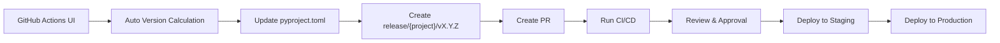

# MySwiftAgent

🚀 **MySwiftAgent** は、手軽で小回りの効く **パーソナルAIエージェント／LLMワークフロー** です。
複雑な設定を避けつつ、日常タスクや開発支援をすばやく実行する「自分だけのAIエージェント」を目指しています。

## ✨ 特徴

- ⚡ **Swift**：軽快に動作し、小回りの効く応答
- 🧩 **Extensible**：モジュール的に機能を追加可能
- 🎯 **Personalized**：ユーザーの目的に合わせたカスタマイズ
- 🔄 **Workflow-oriented**：LLMを軸にした柔軟なワークフロー設計

## 📋 プロジェクト構成

```
MySwiftAgent/
├── myscheduler/     # スケジューリングシステム
├── jobqueue/        # FastAPI ベースジョブキューシステム
├── docs/            # プロジェクトドキュメント（軽量ワークフロー対応）
├── .github/         # GitHub Actions ワークフロー
└── CLAUDE.md        # 開発ガイドライン（詳細）
```

## 🚀 クイックスタート

### 環境構築

```bash
# 1. uvのインストール (初回のみ)
curl -LsSf https://astral.sh/uv/install.sh | sh

# 2. myscheduler のセットアップ
cd myscheduler
uv sync
uv run uvicorn app.main:app --reload

# 3. jobqueue のセットアップ
cd ../jobqueue
uv sync
uv run uvicorn app.main:app --reload --port 8001

# 4. docs の確認
cd ../docs
ls -la  # ドキュメントファイルを確認
```

### 動作確認

```bash
# myscheduler ヘルスチェック
curl http://localhost:8000/health

# jobqueue ヘルスチェック
curl http://localhost:8001/health

# docsディレクトリ確認
ls docs/  # ドキュメントファイル一覧
```

---

# 📖 開発・リリースガイド

## 🧑‍💻 開発者が気をつけるべきこと

### 1. **🏷️ PRラベルの必須付与**

**セマンティックバージョニング対応のため、全PRに必ずラベルを付与してください：**

| ラベル | 用途 | バージョン影響 | 例 |
|--------|------|----------------|-----|
| `breaking` | 破壊的変更 | Major アップ (1.0.0 → 2.0.0) | API仕様変更、設定ファイル形式変更 |
| `feature` | 新機能追加 | Minor アップ (1.0.0 → 1.1.0) | 新エンドポイント、新コマンド追加 |
| `fix` | バグ修正 | Patch アップ (1.0.0 → 1.0.1) | 不具合修正、セキュリティパッチ |

**⚠️ ラベル付与を忘れると自動バージョン管理が正しく動作しません。**

### 2. **📝 コミットメッセージの規約**

```bash
# 良い例
git commit -m "feat(jobqueue): add job priority queue functionality"
git commit -m "fix(myscheduler): resolve timezone handling bug"
git commit -m "refactor(api): improve error response format"

# 避けるべき例
git commit -m "update"
git commit -m "fix bug"
git commit -m "wip"
```

### 3. **🔄 ブランチ運用の徹底**

```bash
# 正しいブランチ作成
git checkout develop
git checkout -b feature/user-authentication
git checkout -b fix/memory-leak-issue
git checkout -b refactor/database-schema

# 間違った例（直push禁止）
git checkout main  # ❌ 直接作業禁止
git push origin main  # ❌ 直push禁止
```

### 4. **✅ マージ前チェックリスト**

**すべてのPRで以下を確認してください：**

- [ ] **適切なPRラベルが付与されている**
- [ ] **全CIチェックが通過している**
- [ ] **テストカバレッジが維持されている**
- [ ] **セキュリティスキャンがクリア**
- [ ] **コードレビューが完了している**

### 5. **🧪 ローカルでの品質チェック**

```bash
# PR作成前に必ず実行
cd {project_directory}

# 1. 依存関係同期
uv sync

# 2. 静的解析
uv run ruff check .
uv run mypy .

# 3. フォーマット確認
uv run ruff format . --check

# 4. テスト実行
uv run pytest --cov=app --cov-report=term-missing

# 5. アプリケーション起動確認
uv run uvicorn app.main:app --host 0.0.0.0 --port 8000
```

---

## 🚀 リリース管理

### 自動リリース作成

**GitHub Actions UI から簡単にリリースを作成できます：**

1. **GitHub リポジトリ** → **Actions** タブ
2. **"Release Quality Assurance"** ワークフロー選択
3. **"Run workflow"** ボタンクリック
4. **パラメータ設定**：
   - **Release type**: `minor` (推奨), `major`, `patch`, `custom`
   - **Project**: `myscheduler`, `jobqueue`, or `docs`
   - **Custom version**: custom選択時のみ
5. **実行** → 自動でリリースブランチ・PR作成

**📝 docsプロジェクトの特徴:**
- 軽量ワークフローで高速処理
- Dockerビルドなし、Markdownlinting・構造検証のみ
- バージョン管理対応（`release/docs/vX.Y.Z`）

### 新プロジェクト追加

**新しいマイクロサービスを追加する場合の人間による作業：**

#### 1. **プロジェクト構造の作成**
```bash
# 新プロジェクトディレクトリ作成
mkdir {project_name}
cd {project_name}

# 基本ファイル作成
touch pyproject.toml Dockerfile
mkdir -p app tests/unit tests/integration
```

#### 2. **必須ファイルの実装**
- **`pyproject.toml`**: 依存関係・バージョン・ツール設定
- **`app/main.py`**: FastAPIアプリケーション + ヘルスチェック
- **`Dockerfile`**: コンテナイメージ定義
- **`tests/`**: 単体・結合テスト

#### 3. **CI/CD設定の手動更新**
```yaml
# .github/workflows/release.yml を編集
project:
  options: ['myscheduler', 'jobqueue', 'docs', '{project_name}']  # 追加

# 各ジョブの条件に新プロジェクトを追加（docsは専用処理）
test:
  if: |
    needs.validate-release.outputs.project == 'myscheduler' ||
    needs.validate-release.outputs.project == 'jobqueue' ||
    needs.validate-release.outputs.project == '{project_name}'  # 追加
```

**⚠️ docsプロジェクトは専用の軽量処理が既に実装されています**

#### 4. **初回リリース作業**
```bash
# 1. feature ブランチで開発
git checkout -b feature/{project_name}-initial-setup

# 2. PR作成（🏷️ feature ラベル必須）
gh pr create --title "🎉 Add new project: {project_name}" --base develop --label feature

# 3. developマージ後、リリース実行
gh workflow run release.yml -f project={project_name} -f release_type=minor -f custom_version="0.1.0"
```

**⚠️ 詳細手順は [CLAUDE.md - 新プロジェクト追加時の手順](./CLAUDE.md#📦-新プロジェクト追加時の手順) を参照**

### リリースフロー



### 緊急リリース（hotfix）

**本番環境の緊急修正が必要な場合：**

```bash
# 1. main ブランチから hotfix ブランチ作成
git checkout main
git checkout -b hotfix/urgent-security-fix

# 2. 修正実装・テスト
# ...

# 3. PR作成（main, staging, develop 全てに向けて）
gh pr create --title "🚨 Hotfix: urgent security fix" --base main
gh pr create --title "🚨 Hotfix: urgent security fix" --base staging
gh pr create --title "🚨 Hotfix: urgent security fix" --base develop
```

---

## ⚠️ 注意事項・トラブルシューティング

### よくある問題と対処法

#### 1. **CI が失敗する場合**

```bash
# ローカルで同じチェックを実行して問題を特定
uv run ruff check .      # Linting エラー
uv run mypy .           # 型チェックエラー
uv run pytest          # テスト失敗
```

#### 2. **バージョン管理エラー**

```
❌ Version mismatch in project:
  Branch: v1.2.0
  pyproject.toml: v1.1.0
```

**対処法：**
```bash
# pyproject.toml のバージョンを手動修正
sed -i 's/^version = ".*"/version = "1.2.0"/' {project}/pyproject.toml
```

#### 3. **Docker ビルドエラー**

```bash
# ローカルでDockerビルド確認
cd {project}
docker build -t test-image .
docker run --rm -p 8000:8000 test-image
```

### 🆘 ヘルプが必要な場合

- **開発ガイドライン詳細**: [CLAUDE.md](./CLAUDE.md)
- **Issue報告**: GitHub Issues
- **緊急時**: プロジェクト責任者へ直接連絡

---

## 📚 参考資料

- **[uv公式ドキュメント](https://docs.astral.sh/uv/)**
- **[FastAPI公式ドキュメント](https://fastapi.tiangolo.com/)**
- **[GitHub Actions公式ドキュメント](https://docs.github.com/actions)**
- **[セマンティックバージョニング](https://semver.org/lang/ja/)**

---

**🤖 This project uses automated version management with GitHub Actions and follows semantic versioning.**