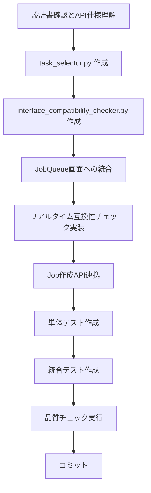

# Interface Validation commonUI統合 - 作業計画書

## 作成日時
2025-10-17

## プロジェクト概要

jobqueueで実装したInterface Validation Phase 3の機能をcommonUIに統合し、ユーザーがJob作成時にTaskを選択し、Interface互換性をリアルタイムでチェックできるUIを提供する。

---

## 📋 作業スコープ

### Phase 1: JobQueue画面へのTask選択UI統合（今回実装）

**目標:** Job作成時に複数Taskを選択でき、Interface互換性をリアルタイムチェック

**スコープ:**
- ✅ Task選択UIコンポーネント作成
- ✅ Interface互換性チェックコンポーネント作成
- ✅ JobQueue画面へのUI統合
- ✅ Job作成APIへのtasks配列送信
- ✅ テスト実装
- ✅ ドキュメント更新

**スコープ外（将来実装）:**
- ❌ Interface Validation専用ページ（Phase 3）
- ❌ JobMaster統合（Phase 4）
- ❌ 検証統計ダッシュボード

---

## 🗂️ ファイル構成

### 新規作成ファイル

```
commonUI/
├── components/
│   ├── task_selector.py                    # Task選択UIコンポーネント
│   └── interface_compatibility_checker.py  # Interface互換性チェック
├── tests/
│   └── unit/
│       ├── test_task_selector.py          # Task選択UIのテスト
│       └── test_compatibility_checker.py  # 互換性チェックのテスト
└── workspace/claudecode/
    ├── interface-validation-integration-plan.md   # 本ファイル
    ├── interface-validation-ui-design.md          # UI設計書
    └── job-task-binding-strategy.md               # タスク紐付け設計書
```

### 修正ファイル

```
commonUI/
└── pages/
    └── 1_📋_JobQueue.py  # Task選択UIを統合
```

---

## 📊 作業フロー



---

## 📝 タスク詳細

### タスク1: Phase 1の設計書確認とAPI仕様理解

**目的:** 実装に必要なAPI仕様と設計を理解

**作業内容:**
1. ✅ `/api/v1/task-masters` APIエンドポイント確認
   - レスポンス形式の確認
   - Interface情報（input_interface_id, output_interface_id）の取得方法
2. ✅ `/api/v1/interface-masters` APIエンドポイント確認
   - InterfaceMaster一覧取得
   - スキーマ情報の取得
3. ✅ `/api/v1/jobs` POST エンドポイント確認
   - `tasks` 配列の形式
   - `validate_interfaces` フラグの動作
4. ✅ 設計書レビュー
   - `interface-validation-ui-design.md`
   - `job-task-binding-strategy.md`

**成果物:**
- API仕様理解メモ（本ファイルに記載）

**所要時間:** 30分

---

### タスク2: components/task_selector.py コンポーネント作成

**目的:** TaskMaster選択と順序管理UIを提供

**実装内容:**

#### **クラス設計:**
```python
class TaskSelector:
    """TaskMaster selection and ordering UI component."""

    @staticmethod
    def render_task_selector(
        available_tasks: list[dict],
        selected_tasks: list[dict] = []
    ) -> list[dict] | None:
        """
        Render task selection and ordering UI.

        Args:
            available_tasks: List of available TaskMasters with interface info
                [{"id": "tm_01", "name": "search_task", "output_interface_id": "if_01", ...}, ...]
            selected_tasks: Currently selected tasks
                [{"master_id": "tm_01", "sequence": 0, "name": "search_task", ...}, ...]

        Returns:
            Updated task list with sequence numbers, or None if no changes
        """
```

#### **UI要素:**
1. ✅ TaskMaster選択ドロップダウン
2. ✅ 「Add Task」ボタン
3. ✅ 選択されたTask一覧表示
4. ✅ Task削除ボタン（🗑️）
5. ✅ Task順序変更ボタン（↑↓）

#### **状態管理:**
- Streamlit session_stateを使用
- `st.session_state["selected_tasks"]` にTask配列を保存

**成果物:**
- `commonUI/components/task_selector.py`

**所要時間:** 2時間

---

### タスク3: components/interface_compatibility_checker.py コンポーネント作成

**目的:** Task間のInterface互換性をチェックし、結果を視覚化

**実装内容:**

#### **クラス設計:**
```python
class InterfaceCompatibilityChecker:
    """Interface compatibility validation UI component."""

    @staticmethod
    def check_compatibility(
        tasks: list[dict],
        task_masters: dict[str, dict],
        interfaces: dict[str, dict]
    ) -> dict[str, Any]:
        """
        Check interface compatibility between consecutive tasks.

        Args:
            tasks: Selected tasks [{"master_id": "...", "sequence": 0}, ...]
            task_masters: TaskMaster details {"tm_01": {...}, ...}
            interfaces: InterfaceMaster details {"if_01": {...}, ...}

        Returns:
            {
                "is_compatible": bool,
                "issues": [
                    {
                        "task_index": int,
                        "current_task": str,
                        "next_task": str,
                        "message": str,
                        "suggestion": str
                    }
                ],
                "warnings": [...]
            }
        """

    @staticmethod
    def render_compatibility_result(
        compatibility_result: dict[str, Any]
    ) -> None:
        """
        Render compatibility check results with visual feedback.

        Displays:
        - ✅ Success message if all compatible
        - ⚠️ Warnings for missing interface definitions
        - ❌ Errors for incompatible interfaces with suggestions
        """
```

#### **互換性チェックロジック:**
1. ✅ Task N の `output_interface_id` と Task N+1 の `input_interface_id` を比較
2. ✅ 一致する場合: ✅ 互換性あり
3. ✅ 不一致の場合: ❌ 互換性エラー
4. ✅ 未定義の場合: ⚠️ 警告

#### **修正提案生成:**
- 不一致の場合、中間変換タスクの追加を提案
- 代替タスクの提案

**成果物:**
- `commonUI/components/interface_compatibility_checker.py`

**所要時間:** 2時間

---

### タスク4: JobQueue画面にTask選択UIを統合

**目的:** Job作成フォームにTask選択機能を追加

**修正ファイル:** `commonUI/pages/1_📋_JobQueue.py`

**実装内容:**

#### **追加セクション:**
```python
def render_job_creation_form() -> None:
    """Render job creation form."""
    # ... 既存のJob基本情報入力 ...

    st.divider()

    # 🆕 Task選択セクション追加
    st.subheader("🔗 Tasks (Optional)")
    st.caption("Select TaskMasters to execute in sequence. Leave empty for single HTTP request.")

    # TaskMaster一覧を取得
    task_masters = load_task_masters()
    interfaces = load_interfaces()

    # Task選択UIをレンダリング
    from components.task_selector import TaskSelector
    selected_tasks = TaskSelector.render_task_selector(
        available_tasks=task_masters,
        selected_tasks=st.session_state.get("selected_tasks", [])
    )

    if selected_tasks is not None:
        st.session_state["selected_tasks"] = selected_tasks

    # Interface互換性チェック
    if selected_tasks and len(selected_tasks) > 1:
        from components.interface_compatibility_checker import InterfaceCompatibilityChecker

        task_masters_dict = {tm["id"]: tm for tm in task_masters}
        interfaces_dict = {ifc["id"]: ifc for ifc in interfaces}

        compatibility = InterfaceCompatibilityChecker.check_compatibility(
            tasks=selected_tasks,
            task_masters=task_masters_dict,
            interfaces=interfaces_dict
        )

        InterfaceCompatibilityChecker.render_compatibility_result(compatibility)

    # Interface検証フラグ
    validate_interfaces = st.checkbox(
        "Validate interface compatibility",
        value=True,
        help="Check interface compatibility between tasks before execution",
        disabled=not selected_tasks or len(selected_tasks) < 2
    )

    # ... 既存のJob作成処理 ...
```

#### **API連携関数追加:**
```python
def load_task_masters() -> list[dict]:
    """Load TaskMasters with interface information."""
    try:
        api_config = config.get_api_config("JobQueue")
        with HTTPClient(api_config, "JobQueue") as client:
            response = client.get("/api/v1/task-masters", params={"size": 100})
            return response.get("task_masters", [])
    except Exception as e:
        st.warning(f"Could not load TaskMasters: {e}")
        return []

def load_interfaces() -> list[dict]:
    """Load InterfaceMasters."""
    try:
        api_config = config.get_api_config("JobQueue")
        with HTTPClient(api_config, "JobQueue") as client:
            response = client.get("/api/v1/interface-masters", params={"size": 100})
            return response.get("interfaces", [])
    except Exception as e:
        st.warning(f"Could not load Interfaces: {e}")
        return []
```

**成果物:**
- 修正された `commonUI/pages/1_📋_JobQueue.py`

**所要時間:** 3時間

---

### タスク5: リアルタイムInterface互換性チェック実装

**目的:** Task選択時にリアルタイムで互換性をチェックし、警告を表示

**実装内容:**

#### **リアルタイムチェックのトリガー:**
- Task追加時
- Task削除時
- Task順序変更時

#### **視覚的フィードバック:**
```python
# ✅ 互換性あり
st.success("✅ All tasks are compatible!")

# ⚠️ 警告
st.warning("⚠️ Task 2 'email_task' has no input interface defined. Validation will be skipped.")

# ❌ エラー
st.error("""
❌ Incompatibility detected between Task 1 and Task 2:
- Task 1 'transform_task' outputs: EmailPayloadInterface
- Task 2 'wrong_task' expects: UserProfileInterface

💡 Suggestion: Add 'email_to_profile_converter' task between them,
or select a different task that accepts EmailPayloadInterface.
""")
```

**成果物:**
- リアルタイムチェック機能が統合された `1_📋_JobQueue.py`

**所要時間:** 1時間

---

### タスク6: Job作成APIへのtasks配列送信実装

**目的:** Job作成時にtasks配列を含めてAPIにPOST

**実装内容:**

#### **Job作成データの構築:**
```python
def create_job(job_data: dict[str, Any]) -> None:
    """Create a new job via API."""
    try:
        api_config = config.get_api_config("JobQueue")
        with HTTPClient(api_config, "JobQueue") as client:
            NotificationManager.operation_started("Creating job")

            # 🆕 tasks配列を含める
            selected_tasks = st.session_state.get("selected_tasks", [])
            if selected_tasks:
                # tasks配列をJob作成リクエストに追加
                job_data["tasks"] = [
                    {
                        "master_id": task["master_id"],
                        "sequence": task["sequence"],
                        "input_data": task.get("input_data")
                    }
                    for task in selected_tasks
                ]

                # Interface検証フラグを追加
                job_data["validate_interfaces"] = st.session_state.get(
                    "validate_interfaces", True
                )

            response = client.post("/api/v1/jobs", job_data)

            job_id = response.get("job_id")
            NotificationManager.operation_completed("Job creation")
            NotificationManager.success(f"Job created successfully! ID: {job_id}")

            # セッションステートをクリア
            st.session_state.pop("selected_tasks", None)

            # Job詳細画面に遷移
            st.session_state.jobqueue_selected_job = job_id

    except Exception as e:
        NotificationManager.handle_exception(e, "Job Creation")
```

**成果物:**
- tasks配列送信機能が実装された `1_📋_JobQueue.py`

**所要時間:** 1時間

---

### タスク7: 単体テスト作成

**目的:** 各コンポーネントの動作を検証

**テストファイル:**

#### **test_task_selector.py:**
```python
"""Tests for TaskSelector component."""
import pytest
from components.task_selector import TaskSelector

class TestTaskSelector:
    """Test suite for TaskSelector component."""

    def test_add_task(self):
        """Test adding a task to the selection."""
        # テスト実装
        pass

    def test_remove_task(self):
        """Test removing a task from the selection."""
        pass

    def test_reorder_tasks(self):
        """Test reordering tasks (move up/down)."""
        pass

    def test_sequence_numbering(self):
        """Test automatic sequence number assignment."""
        pass
```

#### **test_compatibility_checker.py:**
```python
"""Tests for InterfaceCompatibilityChecker component."""
import pytest
from components.interface_compatibility_checker import InterfaceCompatibilityChecker

class TestInterfaceCompatibilityChecker:
    """Test suite for InterfaceCompatibilityChecker component."""

    def test_compatible_tasks(self):
        """Test compatibility check with matching interfaces."""
        tasks = [
            {"master_id": "tm_01", "sequence": 0},
            {"master_id": "tm_02", "sequence": 1}
        ]
        task_masters = {
            "tm_01": {"id": "tm_01", "output_interface_id": "if_01"},
            "tm_02": {"id": "tm_02", "input_interface_id": "if_01"}
        }
        interfaces = {}

        result = InterfaceCompatibilityChecker.check_compatibility(
            tasks, task_masters, interfaces
        )

        assert result["is_compatible"] is True
        assert len(result["issues"]) == 0

    def test_incompatible_tasks(self):
        """Test compatibility check with mismatched interfaces."""
        tasks = [
            {"master_id": "tm_01", "sequence": 0},
            {"master_id": "tm_02", "sequence": 1}
        ]
        task_masters = {
            "tm_01": {"id": "tm_01", "output_interface_id": "if_01"},
            "tm_02": {"id": "tm_02", "input_interface_id": "if_02"}
        }
        interfaces = {}

        result = InterfaceCompatibilityChecker.check_compatibility(
            tasks, task_masters, interfaces
        )

        assert result["is_compatible"] is False
        assert len(result["issues"]) > 0

    def test_missing_interface_warning(self):
        """Test warning for tasks with no interface defined."""
        tasks = [
            {"master_id": "tm_01", "sequence": 0},
            {"master_id": "tm_02", "sequence": 1}
        ]
        task_masters = {
            "tm_01": {"id": "tm_01", "output_interface_id": "if_01"},
            "tm_02": {"id": "tm_02"}  # No input_interface_id
        }
        interfaces = {}

        result = InterfaceCompatibilityChecker.check_compatibility(
            tasks, task_masters, interfaces
        )

        assert len(result["warnings"]) > 0
```

**成果物:**
- `commonUI/tests/unit/test_task_selector.py`
- `commonUI/tests/unit/test_compatibility_checker.py`

**所要時間:** 2時間

---

### タスク8: 統合テスト作成

**目的:** JobQueue画面のTask選択フロー全体をテスト

**テストファイル:** `commonUI/tests/integration/test_jobqueue_task_selection.py`

**テストシナリオ:**
```python
"""Integration tests for JobQueue task selection flow."""
import pytest

class TestJobQueueTaskSelection:
    """Test suite for JobQueue task selection integration."""

    @pytest.mark.asyncio
    async def test_create_job_with_tasks(self, client, db_session):
        """Test creating a job with multiple tasks."""
        # 1. TaskMasterを作成
        # 2. InterfaceMasterを作成してTaskMasterに関連付け
        # 3. JobQueue UIでTaskを選択
        # 4. Interface互換性チェックが成功
        # 5. Job作成
        # 6. Jobにtasksが正しく紐付いている
        pass

    @pytest.mark.asyncio
    async def test_compatibility_error_prevents_creation(self, client, db_session):
        """Test that incompatible tasks prevent job creation."""
        # 1. 互換性のないTaskを選択
        # 2. Interface互換性チェックがエラー
        # 3. Job作成がブロックされる
        pass

    @pytest.mark.asyncio
    async def test_validation_disabled(self, client, db_session):
        """Test creating job with validation disabled."""
        # 1. 互換性のないTaskを選択
        # 2. validate_interfaces = False
        # 3. Job作成が成功（警告のみ）
        pass
```

**成果物:**
- `commonUI/tests/integration/test_jobqueue_task_selection.py`

**所要時間:** 2時間

---

### タスク9: コード品質チェック実行

**目的:** コード品質基準を満たす

**実行コマンド:**
```bash
cd commonUI

# Linting
uv run ruff check .

# Auto-fix
uv run ruff check . --fix

# Formatting
uv run ruff format .

# Type checking
uv run mypy components/

# Tests
uv run pytest tests/unit/ -v
uv run pytest tests/integration/ -v

# Coverage
uv run pytest --cov=components --cov-report=term-missing
```

**品質基準:**
- ✅ Ruffエラーゼロ
- ✅ MyPy型チェック合格
- ✅ 単体テスト全て合格
- ✅ カバレッジ90%以上（components）

**成果物:**
- 品質チェック合格のコード

**所要時間:** 1時間

---

### タスク10: Phase 1の変更をコミット

**目的:** 実装をバージョン管理に反映

**コミットメッセージ:**
```bash
git add commonUI/
git commit -m "feat(commonUI): add Interface Validation Phase 1 - Task Selection UI

- Add TaskSelector component for TaskMaster selection and ordering
- Add InterfaceCompatibilityChecker for real-time validation
- Integrate task selection UI into JobQueue page
- Support tasks array in job creation API
- Add unit and integration tests
- Add documentation for task binding strategy

Phase 1 Implementation:
✅ Task selection UI with add/remove/reorder
✅ Real-time interface compatibility checking
✅ Visual feedback for compatibility issues
✅ Suggestions for resolving incompatibilities
✅ Integration with JobQueue API

🤖 Generated with [Claude Code](https://claude.com/claude-code)

Co-Authored-By: Claude <noreply@anthropic.com>"
```

**成果物:**
- Gitコミット完了

**所要時間:** 15分

---

## 📈 進捗管理

### タスクチェックリスト

- [ ] タスク1: Phase 1の設計書確認とAPI仕様理解（30分）
- [ ] タスク2: components/task_selector.py 作成（2時間）
- [ ] タスク3: components/interface_compatibility_checker.py 作成（2時間）
- [ ] タスク4: JobQueue画面にTask選択UIを統合（3時間）
- [ ] タスク5: リアルタイムInterface互換性チェック実装（1時間）
- [ ] タスク6: Job作成APIへのtasks配列送信実装（1時間）
- [ ] タスク7: 単体テスト作成（2時間）
- [ ] タスク8: 統合テスト作成（2時間）
- [ ] タスク9: コード品質チェック実行（1時間）
- [ ] タスク10: Phase 1の変更をコミット（15分）

**合計所要時間:** 約14.25時間（実作業時間）

---

## 🎯 完了基準

### 機能要件

- ✅ JobQueue画面でTaskMasterを選択できる
- ✅ 選択したTaskの順序を変更できる
- ✅ Taskを削除できる
- ✅ Task間のInterface互換性がリアルタイムでチェックされる
- ✅ 互換性エラーが視覚的にわかりやすく表示される
- ✅ 修正提案が表示される
- ✅ Job作成時にtasks配列が送信される
- ✅ validate_interfacesフラグを設定できる

### 品質要件

- ✅ Ruffエラーゼロ
- ✅ MyPy型チェック合格
- ✅ 単体テストカバレッジ90%以上
- ✅ 統合テスト全て合格
- ✅ ドキュメント完備

### ユーザー体験要件

- ✅ UI操作が直感的
- ✅ エラーメッセージがわかりやすい
- ✅ レスポンスが素早い（500ms以内）
- ✅ モバイルでも使いやすい（レスポンシブ）

---

## 🚫 制約事項

### 技術的制約

- **Streamlitの制約**: リアルタイム更新はst.rerun()に依存
- **API依存**: TaskMasterとInterfaceMasterのAPIが必要
- **ブラウザ互換性**: Streamlitがサポートするブラウザのみ

### スコープ制約

- **Phase 1のみ実装**: Interface Validation専用ページは含まない
- **基本機能のみ**: ドラッグ&ドロップは未実装（↑↓ボタンのみ）
- **簡易版互換性チェック**: 高度なスキーマ検証は含まない

---

## 🔄 次のフェーズ（参考）

### Phase 2: Interface互換性の高度化

- JSONスキーマ詳細比較
- データ変換サジェスチョン
- 互換性スコア表示

### Phase 3: Interface Validation専用画面

- `5_🔗_Interfaces.py` ページ作成
- InterfaceMaster CRUD機能
- TaskMaster Association UI

### Phase 4: JobMaster統合

- JobMasterにTask構成を保存
- JobMasterからJob作成時のTask引き継ぎ

---

## 📚 参考ドキュメント

- [Interface Validation UI 設計書](interface-validation-ui-design.md)
- [Job とタスクの紐付け方法](job-task-binding-strategy.md)
- [jobqueue API リファレンス](../../jobqueue/docs/api/interface-validation-api.md)
- [jobqueue ユーザーガイド](../../jobqueue/docs/guides/interface-validation-guide.md)

---

**作成者:** Claude Code
**日時:** 2025-10-17
**バージョン:** 1.0
**ステータス:** 承認待ち → 実装開始予定
