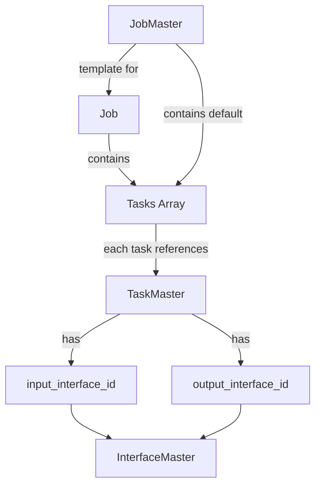
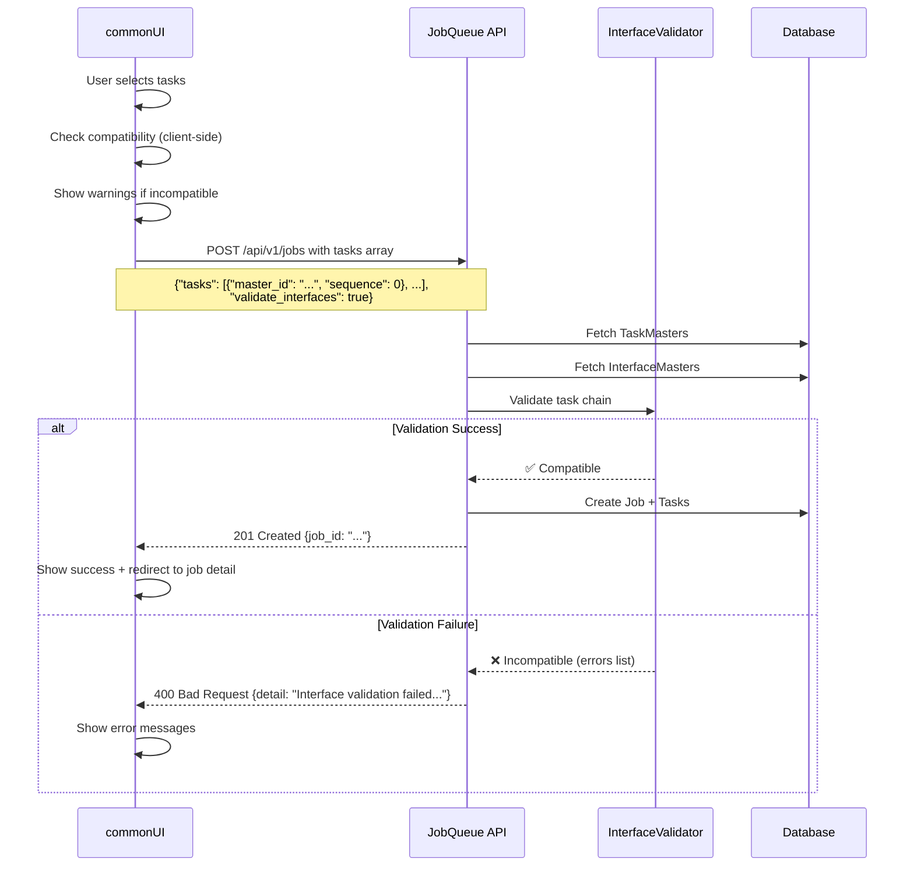

# Job とタスクの紐付け方法 - 設計方針

## 作成日時
2025-10-17

## 現状分析

### 1. jobqueueのアーキテクチャ



### 2. Job作成の2つの方法

#### **方法1: 直接Job作成**

**API:** `POST /api/v1/jobs`

**リクエストスキーマ:**
```json
{
  "name": "My Job",
  "method": "POST",
  "url": "https://api.example.com",
  "tasks": [
    {
      "master_id": "tm_01ABC",
      "sequence": 0,
      "input_data": {"key": "value"}
    },
    {
      "master_id": "tm_02DEF",
      "sequence": 1
    }
  ],
  "validate_interfaces": true
}
```

**特徴:**
- ✅ その場で自由にTaskを選択・組み合わせ可能
- ✅ Interface検証を有効/無効化可能
- ❌ 毎回すべてのパラメータを指定する必要がある

#### **方法2: JobMasterから作成**

**API:** `POST /api/v1/jobs/from-master/{master_id}`

**リクエストスキーマ:**
```json
{
  "name": "Job Override Name",
  "tasks": [
    {
      "master_id": "tm_03GHI",
      "sequence": 2,
      "input_data": {"additional": "data"}
    }
  ],
  "validate_interfaces": true,
  "headers": {"X-Override": "true"}
}
```

**特徴:**
- ✅ JobMasterのデフォルト設定（method, url, tasks等）を継承
- ✅ 必要な部分だけオーバーライド可能
- ✅ 再利用性が高い
- ❌ JobMasterの事前作成が必要

---

## Interface Validation UIでの紐付け戦略

### 🎯 推奨アプローチ：**3段階の統合**

#### **レベル1: JobQueue画面の拡張（既存画面の改善）**

**対象ページ:** `1_📋_JobQueue.py`

**追加機能:**
- ✅ Job作成フォームに「Tasks」セクションを追加
- ✅ TaskMaster選択UI（ドロップダウン + 追加ボタン）
- ✅ Task順序の並び替え（ドラッグ&ドロップまたは↑↓ボタン）
- ✅ Interface互換性チェックのリアルタイム表示
- ✅ `validate_interfaces` チェックボックス

**UI例:**
```
┌─ Job作成フォーム ─────────────────────────────────────┐
│ Job Name: [My Multi-Task Job            ]            │
│                                                        │
│ ┌─ Tasks (実行タスクの選択と順序) ───────────────┐  │
│ │                                                  │  │
│ │ [🔍 TaskMaster選択 ▼] [➕ Add Task]            │  │
│ │                                                  │  │
│ │ Task Flow:                                       │  │
│ │ ┌────────────────────────────────────────────┐  │  │
│ │ │ 0. search_task                             │  │  │
│ │ │    Output: SearchResultInterface ✅        │  │  │
│ │ │    [🗑️] [↑] [↓]                           │  │  │
│ │ ├────────────────────────────────────────────┤  │  │
│ │ │ 1. transform_task                          │  │  │
│ │ │    Input: SearchResultInterface ✅         │  │  │
│ │ │    Output: EmailPayloadInterface ⚠️        │  │  │
│ │ │    [🗑️] [↑] [↓]                           │  │  │
│ │ │    ⚠️ Warning: Output may not match next  │  │  │
│ │ │       task's input schema                  │  │  │
│ │ ├────────────────────────────────────────────┤  │  │
│ │ │ 2. send_email_task                         │  │  │
│ │ │    Input: EmailPayloadInterface ✅         │  │  │
│ │ │    [🗑️] [↑] [↓]                           │  │  │
│ │ └────────────────────────────────────────────┘  │  │
│ │                                                  │  │
│ │ ☑️ Validate interface compatibility            │  │
│ │                                                  │  │
│ │ [💾 Save as JobMaster Template]                │  │
│ └──────────────────────────────────────────────────┘  │
│                                                        │
│ [🚀 Create Job]                                       │
└────────────────────────────────────────────────────────┘
```

**実装ポイント:**
- TaskMaster一覧を取得: `GET /api/v1/task-masters`
- Interface互換性チェック:
  - Task N の `output_interface_id` と Task N+1 の `input_interface_id` を比較
  - 不一致の場合は警告表示
- Job作成時に `tasks` 配列を含めてPOST

#### **レベル2: Interface Validation専用画面（新規ページ）**

**対象ページ:** `5_🔗_Interfaces.py`（設計済み）

**タブ3: TaskMaster Associations** で実装:
- ✅ TaskMaster一覧表示（Interface設定状況付き）
- ✅ 各TaskMasterへのInterface関連付けUI
- ✅ Interface互換性マトリクス表示
- ✅ 検証エラー詳細とサジェスチョン

**役割:**
- TaskMasterとInterfaceの関連付けを管理
- Interface定義の作成・編集
- 互換性問題の事前検出と修正提案

#### **レベル3: JobMaster画面の拡張（既存画面の改善）**

**対象ページ:** `4_🗂️_JobMasters.py`

**追加機能:**
- ✅ JobMaster作成時に複数Taskを含められる
- ✅ Task選択UI（レベル1と同様）
- ✅ Interface互換性チェック
- ✅ JobMaster→Job作成時のTask構成確認

**既存機能との統合:**
- JobMasterの `tasks` 配列にTaskMaster IDと順序を保存
- JobMasterからJob作成時、tasks配列を引き継ぐ

---

## 実装優先度とフェーズ

### Phase 1: 基本的なTask紐付け（必須）

**目標:** JobにTaskを紐付けてInterface検証を有効化

**タスク:**
1. ✅ JobQueue画面にTask選択UIを追加
2. ✅ TaskMaster一覧取得API統合
3. ✅ Task配列の管理（追加・削除・並び替え）
4. ✅ `validate_interfaces` フラグの実装
5. ✅ Job作成時のtasks配列送信

**完了基準:**
- Job作成時に複数Taskを選択可能
- Interface検証フラグを設定可能
- 検証エラーがある場合はJob作成が拒否される

### Phase 2: Interface互換性の可視化（推奨）

**目標:** UI上でInterface互換性問題を事前検出

**タスク:**
1. ✅ TaskMasterのInterface情報取得
2. ✅ Task間の互換性チェックロジック実装
3. ✅ リアルタイム互換性警告表示
4. ✅ 修正提案の表示（中間Taskの追加など）

**完了基準:**
- Task選択時にリアルタイムで互換性チェック
- 互換性問題があれば警告表示
- 具体的な修正提案を提示

### Phase 3: Interface Validation専用画面（高度）

**目標:** Interface定義とTaskMaster関連付けの一元管理

**タスク:**
1. ✅ `5_🔗_Interfaces.py` ページ作成
2. ✅ InterfaceMaster CRUD機能
3. ✅ TaskMaster Association UI
4. ✅ 互換性検証ダッシュボード

**完了基準:**
- Interface定義の作成・管理が可能
- TaskMasterとの関連付けが直感的
- システム全体の互換性状況を可視化

### Phase 4: JobMaster統合（将来）

**目標:** JobMasterでTask構成をテンプレート化

**タスク:**
1. ✅ JobMaster作成時のTask選択UI
2. ✅ JobMasterにtasks配列を保存
3. ✅ JobMaster→Job作成時のTask引き継ぎ
4. ✅ Task構成のプレビュー機能

**完了基準:**
- JobMasterにTask構成を含められる
- JobMasterからのJob作成でTaskが引き継がれる
- Interface互換性が保証されたテンプレートを再利用可能

---

## UIコンポーネント設計

### 1. `components/task_selector.py`

**責務:** TaskMaster選択と順序管理

**主要機能:**
- TaskMaster一覧のドロップダウン
- 選択されたTask一覧の表示
- Task順序の変更（↑↓ボタン）
- Task削除機能

**インターフェース:**
```python
class TaskSelector:
    @staticmethod
    def render_task_selector(
        selected_tasks: list[dict] = []
    ) -> list[dict] | None:
        """
        Render task selection and ordering UI.

        Args:
            selected_tasks: Currently selected tasks [{"master_id": "...", "sequence": 0}, ...]

        Returns:
            Updated task list or None if no changes
        """
```

### 2. `components/interface_compatibility_checker.py`

**責務:** Task間のInterface互換性チェック

**主要機能:**
- Task配列の互換性検証
- 互換性問題の視覚化
- 修正提案の生成

**インターフェース:**
```python
class InterfaceCompatibilityChecker:
    @staticmethod
    def check_compatibility(
        tasks: list[dict],
        task_masters: dict[str, dict]
    ) -> dict[str, Any]:
        """
        Check interface compatibility between tasks.

        Returns:
            {
                "is_compatible": bool,
                "issues": [{"task_index": int, "message": str, "suggestion": str}],
                "warnings": [...]
            }
        """
```

---

## ユーザーフロー

### フロー1: Interface互換性のあるJobを作成

```
1. ユーザーが「1_📋_JobQueue」ページの「Create Job」タブにアクセス
   ↓
2. Job基本情報（名前等）を入力
   ↓
3. 「Tasks」セクションで「Add Task」をクリック
   ↓
4. TaskMasterドロップダウンから「search_task」を選択
   ↓
5. 「Add Task」をクリックして「transform_task」を追加
   ↓
6. リアルタイム互換性チェック:
   - search_task output: SearchResultInterface
   - transform_task input: SearchResultInterface
   - ✅ 互換性あり
   ↓
7. 「send_email_task」を追加
   ↓
8. リアルタイム互換性チェック:
   - transform_task output: EmailPayloadInterface
   - send_email_task input: EmailPayloadInterface
   - ✅ 互換性あり
   ↓
9. ☑️ "Validate interface compatibility" をチェック
   ↓
10. 「Create Job」ボタンをクリック
    ↓
11. Job作成成功 → Job詳細画面に遷移
```

### フロー2: Interface互換性エラーを修正

```
1. フロー1のステップ7で、誤って「wrong_task」を追加
   ↓
2. リアルタイム互換性チェック:
   - transform_task output: EmailPayloadInterface
   - wrong_task input: UserProfileInterface
   - ❌ 互換性なし
   ↓
3. 警告メッセージ表示:
   "⚠️ Task 2: 'wrong_task' expects UserProfileInterface,
    but previous task outputs EmailPayloadInterface"
   ↓
4. 修正提案表示:
   "💡 Suggestion: Add 'email_to_profile_converter' task between
    transform_task and wrong_task, or select a different task that
    accepts EmailPayloadInterface as input."
   ↓
5. ユーザーが「wrong_task」を削除（🗑️ボタン）
   ↓
6. 正しいタスク「send_email_task」を追加
   ↓
7. ✅ 互換性チェック成功
   ↓
8. Job作成
```

---

## データフロー

### Job作成時のInterface検証フロー



---

## API連携

### 必要なAPIエンドポイント

| Endpoint | Method | 用途 |
|----------|--------|------|
| `/api/v1/task-masters` | GET | TaskMaster一覧取得（Interface情報含む） |
| `/api/v1/task-masters/{id}` | GET | TaskMaster詳細取得 |
| `/api/v1/interface-masters` | GET | InterfaceMaster一覧取得 |
| `/api/v1/interface-masters/{id}` | GET | InterfaceMaster詳細取得 |
| `/api/v1/jobs` | POST | Job作成（tasks配列含む） |
| `/api/v1/jobs/from-master/{id}` | POST | JobMasterからJob作成 |

### クライアント側の互換性チェックロジック

```python
def check_task_compatibility(
    tasks: list[dict],
    task_masters: dict[str, dict],
    interfaces: dict[str, dict]
) -> dict:
    """
    Check compatibility between consecutive tasks.

    Args:
        tasks: [{"master_id": "tm_01", "sequence": 0}, ...]
        task_masters: {"tm_01": {"id": "...", "output_interface_id": "if_01", ...}, ...}
        interfaces: {"if_01": {"id": "...", "output_schema": {...}}, ...}

    Returns:
        {"is_compatible": bool, "issues": [...], "warnings": [...]}
    """
    issues = []
    warnings = []

    for i in range(len(tasks) - 1):
        current_task = task_masters.get(tasks[i]["master_id"])
        next_task = task_masters.get(tasks[i + 1]["master_id"])

        if not current_task or not next_task:
            continue

        current_output_id = current_task.get("output_interface_id")
        next_input_id = next_task.get("input_interface_id")

        if current_output_id and next_input_id:
            if current_output_id != next_input_id:
                issues.append({
                    "task_index": i + 1,
                    "message": f"Task {i+1} expects {next_input_id}, but Task {i} outputs {current_output_id}",
                    "suggestion": f"Add a transformation task or change Task {i+1}"
                })
        elif not next_input_id:
            warnings.append({
                "task_index": i + 1,
                "message": f"Task {i+1} has no input interface defined"
            })

    return {
        "is_compatible": len(issues) == 0,
        "issues": issues,
        "warnings": warnings
    }
```

---

## まとめ

### ✅ 推奨される実装順序

1. **Phase 1優先** - JobQueue画面にTask選択UIを追加
   - ユーザーが最も頻繁に使う画面
   - Interface Validationの価値を早期に実感できる

2. **Phase 2を並行** - Interface互換性の可視化
   - ユーザー体験を大幅に向上
   - エラーを事前防止

3. **Phase 3を将来実装** - Interface Validation専用画面
   - 高度な管理機能が必要になったら

4. **Phase 4は任意** - JobMaster統合
   - テンプレート化のニーズが高まったら

### 🎯 最重要ポイント

- **タスク紐付けはJob作成時に行う**（既存設計の継承）
- **Interface検証はJobQueue画面で完結**させる（使いやすさ優先）
- **専用画面（Interfaces）はInterface定義管理に特化**させる（役割分離）

---

**作成者:** Claude Code
**日時:** 2025-10-17
**バージョン:** 1.0
