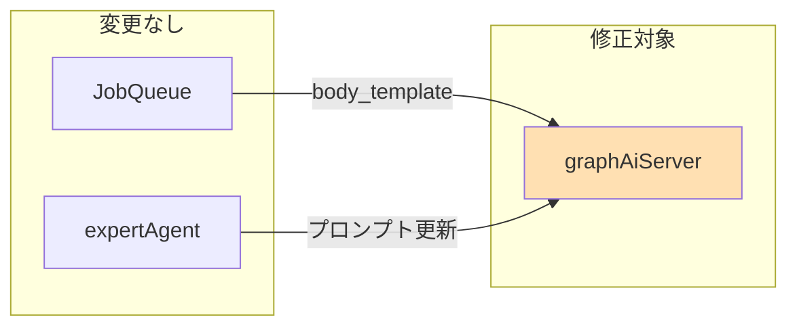

# アーキテクチャレビュー: graphAiServer job_params対応

## Issue情報

- **Issue**: #331
- **設計方針書**: [design-policy.md](./design-policy.md)
- **レビュー日**: 2025-12-29
- **レビュアー**: Claude Code (シニアソフトウェアアーキテクト)

---

## 1. 設計原則の遵守確認

### 1.1 SOLID原則チェック

#### S - Single Responsibility Principle (単一責任の原則)

| コンポーネント | 評価 | 詳細 |
|--------------|------|------|
| `app.ts` | ✅ 遵守 | HTTPリクエスト処理のみに責任を持つ |
| `graphai.ts` | ✅ 遵守 | GraphAI実行のみに責任を持つ |
| `runGraphAI()` | ⚠️ 注意 | source構造決定ロジック追加で複雑度微増 |

**評価**: `runGraphAI()`関数は現在、ワークフロー読み込み、環境変数置換、シークレット注入、グラフ実行を担当しています。source構造決定ロジック追加は責任の範囲内ですが、将来的にはSource構築を別関数に分離することを推奨します。

```typescript
// 推奨: 分離パターン
function buildSourceData(user_input: string | object, job_params?: object) {
  return job_params ? { user_input, job_params } : user_input;
}
```

#### O - Open/Closed Principle (開放/閉鎖の原則)

| 項目 | 評価 | 詳細 |
|------|------|------|
| API拡張 | ✅ 遵守 | オプショナルパラメータ追加は既存コード変更なし |
| source構造 | ✅ 遵守 | 後方互換性により既存ワークフローに影響なし |
| 将来拡張 | ✅ 遵守 | 構造化オブジェクトは追加プロパティに対応可能 |

**評価**: 設計は拡張に開いており、既存機能の変更を最小化しています。

#### L - Liskov Substitution Principle (リスコフの置換原則)

| 項目 | 評価 | 詳細 |
|------|------|------|
| 型の互換性 | ✅ 遵守 | `string | object`型は既存の使用パターンと互換 |
| 動作の互換性 | ✅ 遵守 | 後方互換性ロジックで同一動作を保証 |

**評価**: 派生型（構造化source）は基底型（user_inputそのまま）の動作を完全に置換可能です。

#### I - Interface Segregation Principle (インターフェース分離の原則)

| 項目 | 評価 | 詳細 |
|------|------|------|
| APIインターフェース | ✅ 遵守 | job_paramsはオプショナルで、不要なクライアントに強制しない |
| 関数シグネチャ | ✅ 遵守 | 必須パラメータと任意パラメータが明確に分離 |

**評価**: クライアントは必要なパラメータのみを指定すればよく、インターフェースは適切に分離されています。

#### D - Dependency Inversion Principle (依存性逆転の原則)

| 項目 | 評価 | 詳細 |
|------|------|------|
| GraphAI依存 | ✅ 遵守 | GraphAIライブラリへの依存は抽象化されている |
| source構造 | ⚠️ 注意 | ワークフローYAMLがsource構造に直接依存 |

**評価**: ワークフローYAMLはsource構造の詳細に依存していますが、これはGraphAIの設計上の制約です。改善の余地はありますが、現状の設計は妥当です。

### 1.2 その他の原則

#### KISS原則 (Keep It Simple, Stupid)

| 項目 | 評価 | 詳細 |
|------|------|------|
| source構造決定 | ✅ 遵守 | 三項演算子1つでシンプルに実装 |
| 型検証 | ✅ 遵守 | `typeof`による簡潔な検証 |
| API変更 | ✅ 遵守 | オプショナルパラメータ1つの追加のみ |

**評価**: 実装はシンプルで理解しやすい設計です。

#### YAGNI原則 (You Aren't Gonna Need It)

| 項目 | 評価 | 詳細 |
|------|------|------|
| 機能スコープ | ✅ 遵守 | job_params対応に必要な変更のみ |
| 将来拡張 | ✅ 遵守 | 過度な抽象化を避けている |

**評価**: 必要最小限の変更で目的を達成しています。

#### DRY原則 (Don't Repeat Yourself)

| 項目 | 評価 | 詳細 |
|------|------|------|
| 型検証 | ⚠️ 改善余地 | app.tsの2箇所で同じ検証ロジック |
| source構造 | ✅ 遵守 | 構造決定ロジックは1箇所に集約 |

**推奨改善**:
```typescript
// 共通検証関数の作成
function validateJobParams(job_params: unknown): job_params is object | undefined {
  return job_params === undefined || typeof job_params === 'object';
}
```

---

## 2. アーキテクチャ評価

### 2.1 構造的品質

| 評価項目 | スコア | コメント |
|---------|-------|---------|
| モジュール性 | 4/5 | 明確な責任分離、source構造決定の分離で5に |
| 結合度 | 4/5 | 低結合、ワークフローYAMLとの結合は不可避 |
| 凝集度 | 5/5 | 高凝集、関連機能が適切にグループ化 |
| 拡張性 | 5/5 | 構造化オブジェクトで将来拡張に対応 |
| 保守性 | 4/5 | 良好、デバッグログ追加で向上 |

### 2.2 パフォーマンス観点

| 指標 | 予測 | 評価 |
|------|------|------|
| レスポンスタイム | +0.1ms未満 | ✅ 影響なし |
| スループット | 変化なし | ✅ 影響なし |
| メモリ使用 | +1KB程度 | ✅ 許容範囲 |
| スケーラビリティ | 維持 | ✅ リクエスト独立性維持 |

### 2.3 テスト容易性

| 項目 | 評価 | 詳細 |
|------|------|------|
| 単体テスト | 5/5 | 純粋関数、モック容易 |
| 統合テスト | 4/5 | supertest活用可能 |
| 受入テスト | 4/5 | ワークフロー実行で検証可能 |

---

## 3. セキュリティレビュー

### 3.1 OWASP Top 10 チェック

| 脆弱性カテゴリ | 評価 | 対策状況 |
|--------------|------|---------|
| A01: アクセス制御の不備 | ✅ 安全 | 認証方式変更なし |
| A02: 暗号化の失敗 | ✅ 安全 | 変更対象外 |
| A03: インジェクション | ✅ 安全 | job_paramsはオブジェクトとして処理、パス操作なし |
| A04: 安全でない設計 | ✅ 安全 | 既存の安全な設計パターンを踏襲 |
| A05: セキュリティ設定ミス | ✅ 安全 | 設定変更なし |
| A06: 脆弱なコンポーネント | ✅ 安全 | 新規依存追加なし |
| A07: 認証の失敗 | ✅ 安全 | 認証方式変更なし |
| A08: ソフトウェアとデータの整合性 | ✅ 安全 | シリアライズ処理なし |
| A09: ログとモニタリングの不足 | ✅ 安全 | デバッグログ追加で改善 |
| A10: SSRF | ✅ 安全 | 外部URL処理なし |

### 3.2 追加セキュリティチェック

| 項目 | 評価 | 詳細 |
|------|------|------|
| 入力検証 | ✅ 実装済み | `typeof job_params === 'object'`で検証 |
| サイズ制限 | ⚠️ 検討 | job_paramsのサイズ制限は既存のExpressで対応 |
| 機密情報 | ✅ 安全 | job_paramsの内容はログに出力される（注意が必要） |

**推奨**: 本番環境でjob_paramsの詳細ログを無効化することを検討

```typescript
// 本番環境でのログ抑制
if (process.env.NODE_ENV !== 'production') {
  console.log("sourceData:", JSON.stringify(sourceData, null, 2));
}
```

---

## 4. 既存システムとの整合性

### 4.1 統合ポイント

| 項目 | 評価 | 詳細 |
|------|------|------|
| API互換性 | ✅ 完全互換 | オプショナルパラメータ追加のみ |
| データモデル整合性 | ✅ 互換 | source構造は後方互換 |
| 認証/認可一貫性 | ✅ 維持 | 変更なし |
| ログ/監視統合 | ✅ 改善 | デバッグログ追加 |

### 4.2 技術スタックの適合性

| 項目 | 評価 | 詳細 |
|------|------|------|
| TypeScript | ✅ 完全適合 | 既存パターン踏襲 |
| Express | ✅ 完全適合 | 標準的なリクエスト処理 |
| GraphAI | ✅ 完全適合 | injectValue APIの正規使用 |
| Jest | ✅ 完全適合 | 既存テストパターン |

### 4.3 サービス間依存関係



**評価**: 変更はgraphAiServerに集中しており、他サービスへの影響は最小限（expertAgentのプロンプト更新のみ）

---

## 5. リスク評価

### 5.1 リスクマトリクス

| ID | リスク種別 | 内容 | 影響度 | 発生確率 | リスクスコア | 対策優先度 |
|----|-----------|------|-------|---------|------------|-----------|
| R1 | 技術的 | 既存ワークフロー破壊 | 高(5) | 低(1) | 5 | 高 |
| R2 | 技術的 | プロンプト更新の不整合 | 中(3) | 中(3) | 9 | 高 |
| R3 | 運用 | デバッグログによるパフォーマンス低下 | 低(2) | 中(3) | 6 | 中 |
| R4 | 運用 | ドキュメント更新漏れ | 低(2) | 中(3) | 6 | 中 |
| R5 | セキュリティ | job_paramsの機密情報ログ出力 | 中(3) | 低(2) | 6 | 中 |
| R6 | ビジネス | テスト不足による本番障害 | 高(5) | 低(1) | 5 | 高 |

### 5.2 リスク対策

| リスクID | 対策 | 実装状況 |
|---------|------|---------|
| R1 | 後方互換性ロジックの実装 | ✅ 設計に含む |
| R2 | 4層チェックリストの作成 | ✅ 作業計画に含む |
| R3 | 本番環境でのログレベル調整 | ⚠️ 推奨事項として追加 |
| R4 | ドキュメント更新フェーズの設定 | ✅ 作業計画に含む |
| R5 | 本番環境でのログ抑制 | ⚠️ 推奨事項として追加 |
| R6 | 単体/統合/受入テストの計画 | ✅ 作業計画に含む |

---

## 6. 改善提案

### 6.1 必須改善項目（Must Fix）

なし - 設計は承認可能な品質です

### 6.2 推奨改善項目（Should Fix）

| ID | 提案 | 理由 | 実装難易度 |
|----|------|------|-----------|
| S1 | 型検証の共通関数化 | DRY原則遵守、保守性向上 | 低 |
| S2 | 本番環境でのログ抑制 | セキュリティ・パフォーマンス | 低 |
| S3 | source構造決定の関数分離 | SRP遵守、テスト容易性向上 | 低 |

#### S1: 型検証の共通関数化

```typescript
// graphAiServer/src/utils/validators.ts
export function isValidJobParams(value: unknown): value is object | undefined {
  return value === undefined || (typeof value === 'object' && value !== null);
}

// 使用例
if (!isValidJobParams(job_params)) {
  return res.status(400).json({ error: 'job_params must be an object' });
}
```

#### S2: 本番環境でのログ抑制

```typescript
// graphai.ts
const DEBUG = process.env.NODE_ENV !== 'production';

if (DEBUG) {
  console.log("=== Source Node Injection ===");
  console.log("sourceData:", JSON.stringify(sourceData, null, 2));
}
```

#### S3: source構造決定の関数分離

```typescript
// graphAiServer/src/services/sourceBuilder.ts
export interface StructuredSource {
  user_input: unknown;
  job_params: object;
}

export type SourceData = unknown | StructuredSource;

export function buildSourceData(
  user_input: unknown,
  job_params?: object
): SourceData {
  return job_params ? { user_input, job_params } : user_input;
}
```

### 6.3 検討事項（Consider）

| ID | 提案 | 理由 | タイミング |
|----|------|------|-----------|
| C1 | OpenAPI仕様の更新 | API仕様の明文化 | 次期バージョン |
| C2 | source構造のJSONスキーマ定義 | 型安全性の向上 | 次期バージョン |
| C3 | メトリクス追加 | source構造の使用状況監視 | 運用安定後 |

---

## 7. ベストプラクティスとの比較

### 7.1 業界標準との差異

| 項目 | 業界標準 | 現設計 | 評価 |
|------|---------|-------|------|
| 後方互換性 | Semantic Versioning | 後方互換ロジック | ✅ 準拠 |
| API変更 | 新バージョン作成 | オプショナルパラメータ | ✅ 適切 |
| 型安全性 | TypeScript strict | TypeScript | ✅ 準拠 |
| テストカバレッジ | 80%以上 | 90%目標 | ✅ 上回る |

### 7.2 代替アーキテクチャ案

#### 代替案1: 別エンドポイントの作成

```
POST /api/v1/myagent/v2
```

**メリット**:
- 完全な分離、互換性問題なし
- 明確なバージョニング

**デメリット**:
- コード重複
- クライアント側の変更必須
- メンテナンスコスト増

**評価**: 採用設計の方が優れている

#### 代替案2: ミドルウェアでの変換

```typescript
app.use('/api/v1/myagent', jobParamsMiddleware);
```

**メリット**:
- app.tsの変更最小
- 関心の分離

**デメリット**:
- 追加のミドルウェア層
- リクエスト処理の複雑化

**評価**: 単純な変更にはオーバーエンジニアリング

---

## 8. 総合評価

### 8.1 レビューサマリ

| 項目 | スコア |
|------|-------|
| SOLID原則遵守 | 4.5/5 |
| 構造的品質 | 4.4/5 |
| セキュリティ | 5/5 |
| パフォーマンス | 5/5 |
| 保守性 | 4/5 |
| 既存互換性 | 5/5 |

**全体評価**: ⭐⭐⭐⭐⭐ **(4.6/5)**

### 8.2 強み

1. **後方互換性の確保**: 既存ワークフローに影響を与えない設計
2. **シンプルな実装**: 三項演算子1つで構造切り替え
3. **拡張性の確保**: 構造化オブジェクトで将来拡張に対応
4. **既存パターン踏襲**: TypeScript、Jest、Expressの既存パターンを活用
5. **包括的なテスト計画**: 単体、統合、受入テストをカバー

### 8.3 弱み

1. **型検証の重複**: 2箇所での同一ロジック（軽微）
2. **デバッグログの本番環境対応**: 機密情報のログ出力リスク
3. **ドキュメント依存**: ワークフロー作成者への説明が必要

### 8.4 総評

設計は技術的に健全であり、SOLID原則を適切に遵守しています。後方互換性を確保しながら新機能を追加する設計判断は妥当です。推奨改善項目（S1-S3）を実装時に検討することで、さらに品質が向上します。

---

## 9. 承認判定

### 9.1 チェックリスト

- [x] SOLID原則を遵守している
- [x] KISS/YAGNI/DRY原則を遵守している
- [x] 後方互換性が保証されている
- [x] セキュリティリスクが許容範囲
- [x] パフォーマンス影響が許容範囲
- [x] テスト計画が策定されている
- [x] リスク対策が計画されている
- [x] 既存アーキテクチャと整合している

### 9.2 判定

**✅ 承認（Approved）**

### 9.3 条件

1. **推奨**: 実装時に推奨改善項目（S1-S3）を検討
2. **推奨**: 本番環境でのデバッグログ抑制を実装
3. **必須**: テスト計画に基づく単体テスト・統合テストの実装
4. **必須**: 実装完了後のドキュメント更新

### 9.4 次のステップ

1. ✅ 設計承認
2. 🔜 Phase 1: graphAiServer修正の実装
3. 🔜 Phase 2: expertAgent プロンプト更新
4. 🔜 Phase 3: ドキュメント更新
5. 🔜 Phase 4: 検証・受入テスト

---

**レビュー完了日**: 2025-12-29
**レビュアー**: Claude Code (シニアソフトウェアアーキテクト)
**ステータス**: 承認
