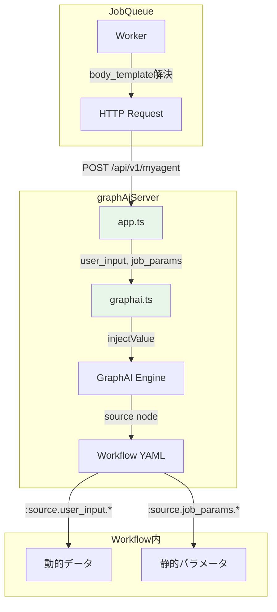
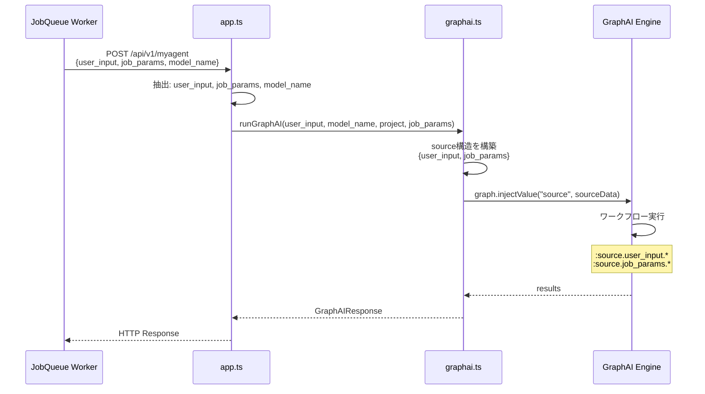

# 設計方針書: graphAiServer job_params対応 - sourceノード構造変更

## Issue情報

- **Issue**: #331
- **タイトル**: graphAiServer job_params対応 - sourceノード構造変更
- **親Issue**: #325 (Job Generator 実行信頼性向上)
- **対象プロジェクト**: graphAiServer, expertAgent

---

## 現状調査サマリ

### 対象プロジェクト

| プロジェクト | 役割 | 技術スタック |
|-------------|------|-------------|
| graphAiServer | GraphAIワークフロー実行エンジン | Express + TypeScript + GraphAI |
| expertAgent | AIエージェント・ワークフロー生成 | FastAPI + LangGraph |

### 既存アーキテクチャパターン

#### graphAiServer (src/app.ts, src/services/graphai.ts)

| パターン | 使用箇所 | 目的 |
|---------|---------|------|
| リクエスト毎独立オブジェクト | `runGraphAI()` | 並行リクエスト対応 |
| 環境変数プレースホルダー置換 | `resolveEnvVariables()` | 環境別設定切り替え |
| シークレット注入 | `injectSecretsToGraphData()` | MyVault連携 |
| 多層エラーハンドリング | `graph.errors()`, `transactionLogs()` | 詳細なエラー情報取得 |

#### 現在の API シグネチャ

```typescript
// app.ts:134
const { user_input, model_name, project } = req.body;

// graphai.ts:188
export const runGraphAI = async (
  user_input: string,  // ← 実際はstring | object
  model_name: string,
  project?: string
): Promise<GraphAIResponse>

// graphai.ts:207
graph.injectValue("source", user_input);
```

### 類似機能の設計

#### シークレット注入パターン（参考）

```typescript
// graphai.ts:148-180
async function injectSecretsToGraphData(graph_data: GraphData, project?: string): Promise<void> {
  // MyVaultから取得、graph_dataのノードに注入
  // エラー時も処理継続（フォールバック対応）
}
```

### モジュール間依存関係

```
JobQueue → TaskMaster.body_template → graphAiServer → GraphAI workflow
    ↓            ↓                        ↓              ↓
user_input   job_params              source node    :source.*
```

### 既存API設計パターン

| 項目 | パターン |
|------|---------|
| エンドポイント命名 | `/api/v1/{resource}` |
| リクエスト形式 | JSON (`req.body`) |
| レスポンス形式 | `{ results, errors, logs }` |
| エラーハンドリング | 500 + 詳細情報、本番でスタック非表示 |
| 認証 | Admin Token (`X-Admin-Token`) |

### 参照したドキュメント

- `docs/arch/service-dependencies.md`: サービス間依存関係
- `graphAiServer/docs/GRAPHAI_WORKFLOW_GENERATION_RULES.md`: ワークフロー生成ルール
- `expertAgent/.../workflow_generation.py`: ワークフロー生成プロンプト

### 設計上の制約

1. **後方互換性必須**: 既存ワークフロー（`job_params`なし）は影響を受けてはならない
2. **TypeScript型安全性**: 既存の型定義との整合性維持
3. **テストカバレッジ**: 単体テスト90%以上
4. **プロンプト一貫性**: workflow_generation.pyの4層構造で一貫した更新

---

## アーキテクチャ設計

### システム構成図



### データフロー（変更後）



---

## 技術選定

| カテゴリ | 選定技術 | 選定理由 | 既存との整合性 |
|---------|---------|---------|---------------|
| 言語 | TypeScript | 既存踏襲 | 完全互換 |
| フレームワーク | Express | 既存踏襲 | 完全互換 |
| テスト | Jest + ts-jest + supertest | 既存踏襲 | 完全互換 |
| 型定義 | TypeScript interface | 既存踏襲 | 拡張のみ |

---

## 設計パターン

### 採用パターン

| パターン | 理由 | 既存での使用箇所 |
|---------|------|----------------|
| **Optional Parameter** | 後方互換性のため`job_params`をオプショナルに | `project?: string` |
| **Default Value** | `job_params`未指定時は空オブジェクト | シークレット注入でも使用 |
| **Object Composition** | sourceノードを構造化オブジェクトに | なし（新規） |

### 新規パターン: Structured Source Injection

```typescript
// 従来: user_inputのみ
graph.injectValue("source", user_input);

// 新規: 構造化されたオブジェクト
const sourceData = {
  user_input: user_input,
  job_params: job_params || {}
};
graph.injectValue("source", sourceData);
```

**導入理由**: 既存パターンでは対応不可能（user_inputとjob_paramsの両方をワークフローに渡す必要があるため）

---

## データモデル設計

### ソースノード構造（変更後）

```typescript
// 変更前
type SourceNode = string | object;  // user_inputそのまま

// 変更後
interface StructuredSource {
  user_input: string | object;  // タスクチェーンからの動的データ
  job_params: object;           // job.bodyからの静的パラメータ
}
```

### ワークフローYAMLでの参照

```yaml
# 変更前
nodes:
  source: {}
  use_data:
    inputs:
      query: :source.query  # user_input.query

# 変更後
nodes:
  source: {}
  use_dynamic_data:
    inputs:
      summary: :source.user_input.summary_text  # 動的データ
  use_static_params:
    inputs:
      email: :source.job_params.recipient_email  # 静的パラメータ
```

---

## API設計

### エンドポイント（変更なし）

- `POST /api/v1/myagent` (レガシー形式)
- `POST /api/v1/myagent/:category/:model` (新形式)

### リクエストボディ（拡張）

```typescript
interface MyAgentRequest {
  user_input: string | object;  // 必須
  model_name: string;           // 必須（レガシー形式のみ）
  project?: string;             // オプション
  job_params?: object;          // 新規追加（オプション）
}
```

### 後方互換性保証

```typescript
// app.ts
const { user_input, model_name, project, job_params } = req.body;

// graphai.ts
export const runGraphAI = async (
  user_input: string | object,
  model_name: string,
  project?: string,
  job_params?: object  // 新規追加（オプション）
): Promise<GraphAIResponse>

// sourceノード構造（後方互換性を保持）
const sourceData = job_params
  ? { user_input, job_params }  // 新形式
  : user_input;                  // 従来形式
```

---

## セキュリティ設計

### 変更による影響

- **認証/認可**: 変更なし（既存のAdmin Token方式を維持）
- **入力検証**: `job_params`もオブジェクト型として検証
- **パストラバーサル**: 影響なし（リクエストボディのみ）

### 追加検証

```typescript
// job_paramsの型検証
if (job_params !== undefined && typeof job_params !== 'object') {
  return res.status(400).json({ error: 'job_params must be an object' });
}
```

---

## パフォーマンス設計

### 影響分析

| 項目 | 影響 | 対策 |
|------|------|------|
| メモリ | 微増（job_paramsオブジェクト分） | 影響軽微、対策不要 |
| CPU | 変更なし | - |
| レイテンシ | 変更なし | - |

### 既存最適化の維持

- リクエスト毎独立オブジェクト: 維持
- シークレットキャッシュ: 影響なし

---

## 設計判断とトレードオフ

### 判断1: sourceノード構造の変更方式

| 選択肢 | メリット | デメリット | 採用 |
|--------|---------|----------|------|
| **A: 構造化オブジェクト** | 明確な階層、将来拡張性高い | 既存ワークフロー参照パス変更 | ✅ |
| B: フラットマージ | 既存参照パス維持 | 名前衝突リスク、不明確な優先度 | ❌ |
| C: 別ノードとして注入 | 完全分離 | ワークフロー側の大幅変更必要 | ❌ |

**選択理由**:
- 明確なデータ階層により、デバッグ容易性向上
- 将来的な拡張（他のメタデータ追加）に対応可能
- 名前衝突のリスクを完全に排除

### 判断2: 後方互換性の保証方式

```typescript
// job_paramsの有無で動的に切り替え
const sourceData = job_params
  ? { user_input, job_params }  // 新形式: 構造化
  : user_input;                  // 従来形式: そのまま
```

**代替案**: 常に構造化オブジェクトを使用
**採用理由**: 既存のワークフロー（`job_params`なし）に影響を与えないため

### 判断3: プロンプト更新範囲

| 更新箇所 | 内容 |
|---------|------|
| 基本概念層（行206-216） | sourceノード構造の新説明追加 |
| 制限事項層（行218-252） | 参照パスの変更説明 |
| ルール層（行263-288） | 新参照パスのルール追加 |
| 実装例層（行315-512） | 新形式の例を追加 |

---

## 実装計画

### Phase 1: graphAiServer修正

1. `src/app.ts`: `job_params`抽出追加
2. `src/services/graphai.ts`: `runGraphAI`シグネチャ変更、sourceノード構造変更
3. `tests/`: 単体テスト・統合テスト追加

### Phase 2: expertAgent修正

1. `workflow_generation.py`: プロンプト更新（4層すべて）
2. 単体テスト更新

### Phase 3: ドキュメント更新

1. `graphAiServer/docs/GRAPHAI_WORKFLOW_GENERATION_RULES.md`: sourceノード仕様更新
2. `graphAiServer/docs/GRAPHAI_INPUT_SCHEMA.md`: 新形式の説明追加

---

## テスト計画

### 単体テスト

| テストケース | 対象 | 期待結果 |
|------------|------|---------|
| job_paramsあり | `runGraphAI()` | sourceが構造化オブジェクト |
| job_paramsなし | `runGraphAI()` | sourceが従来形式（user_inputそのまま） |
| job_paramsがundefined | `runGraphAI()` | sourceが従来形式 |
| job_paramsが空オブジェクト | `runGraphAI()` | sourceが構造化オブジェクト |

### 統合テスト

| テストケース | 対象 | 期待結果 |
|------------|------|---------|
| 新形式リクエスト | `/api/v1/myagent` | 正常実行、:source.job_params.*参照可能 |
| 従来形式リクエスト | `/api/v1/myagent` | 正常実行、:source.*参照可能（後方互換） |
| バリデーション | job_paramsが非オブジェクト | 400エラー |

### 受入テスト

- ワークフローで`:source.user_input.*`と`:source.job_params.*`の両方が参照可能
- 既存ワークフロー（job_paramsなし）が影響を受けない

---

## リスクと対策

| リスク | 発生確率 | 影響度 | 対策 |
|--------|---------|-------|------|
| 既存ワークフロー破壊 | 低 | 高 | 後方互換性ロジックで防止 |
| プロンプト更新の不整合 | 中 | 中 | 4層すべてをチェックリストで管理 |
| テスト不足 | 低 | 高 | テスト計画に基づく網羅的テスト |

---

## 参照ドキュメント

- [docs/arch/service-dependencies.md](../../docs/arch/service-dependencies.md)
- [graphAiServer/docs/GRAPHAI_WORKFLOW_GENERATION_RULES.md](../../graphAiServer/docs/GRAPHAI_WORKFLOW_GENERATION_RULES.md)
- [expertAgent/aiagent/langgraph/workflowGeneratorAgents/prompts/workflow_generation.py](../../expertAgent/aiagent/langgraph/workflowGeneratorAgents/prompts/workflow_generation.py)
- [Issue #325](https://github.com/Kewton/MySwiftAgent/issues/325)
- [Issue #331](https://github.com/Kewton/MySwiftAgent/issues/331)

---

**作成日**: 2025-12-29
**作成者**: Claude Code
