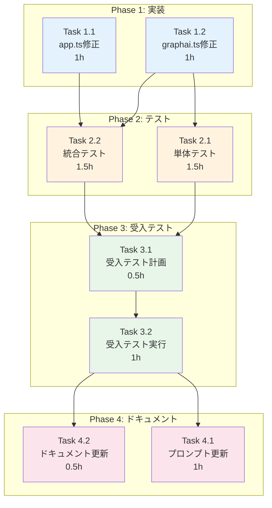

# 作業計画書: graphAiServer job_params対応

## Issue情報

```markdown
## Issue: graphAiServer job_params対応 - sourceノード構造変更
**Issue番号**: #331
**サイズ**: M（Medium）
**作業見積**: 8時間
**優先度**: High
**依存Issue**: #325（親Issue）
**関連コミット**: d2a7fa1, 883a42a
```

| 項目 | 内容 |
|------|------|
| 目的 | graphAiServerでjob_paramsを受け取り、sourceノードに注入する |
| 成果物 | 修正コード、単体テスト、統合テスト、ドキュメント更新 |
| 影響範囲 | graphAiServer、expertAgent（プロンプトのみ） |

---

## 設計ドキュメント参照

- **設計方針書**: [design-policy.md](./design-policy.md)
- **アーキテクチャレビュー**: [architecture-review.md](./architecture-review.md)

---

## 詳細タスク分解

### Phase 1: graphAiServer修正（実装タスク）

#### Task 1.1: app.ts修正 - job_params抽出

**対象ファイル**: `graphAiServer/src/app.ts`

| 項目 | 内容 |
|------|------|
| 所要時間 | 1時間 |
| 成果物 | `src/app.ts` 修正 |
| 依存 | なし |

**修正箇所（4箇所）**:

1. **行81** - 新形式エンドポイント：
```typescript
// 変更前
const { user_input, project } = req.body;
// 変更後
const { user_input, project, job_params } = req.body;

// 型検証追加
if (job_params !== undefined && (typeof job_params !== 'object' || job_params === null)) {
  return res.status(400).json({ error: 'job_params must be an object' });
}
```

2. **行101** - runGraphAI呼び出し：
```typescript
// 変更前
const result: GraphAIResponse = await runGraphAI(user_input, model_name, project);
// 変更後
const result: GraphAIResponse = await runGraphAI(user_input, model_name, project, job_params);
```

3. **行134** - レガシー形式エンドポイント：
```typescript
// 変更前
const { user_input, model_name, project } = req.body;
// 変更後
const { user_input, model_name, project, job_params } = req.body;

// 型検証追加（同上）
```

4. **行145** - runGraphAI呼び出し：
```typescript
// 変更前
const result: GraphAIResponse = await runGraphAI(user_input, model_name, project);
// 変更後
const result: GraphAIResponse = await runGraphAI(user_input, model_name, project, job_params);
```

**チェックリスト**:
- [ ] 新形式エンドポイント: job_params抽出
- [ ] 新形式エンドポイント: 型検証追加
- [ ] 新形式エンドポイント: runGraphAI呼び出し修正
- [ ] レガシー形式エンドポイント: job_params抽出
- [ ] レガシー形式エンドポイント: 型検証追加
- [ ] レガシー形式エンドポイント: runGraphAI呼び出し修正

---

#### Task 1.2: graphai.ts修正 - runGraphAIシグネチャ変更

**対象ファイル**: `graphAiServer/src/services/graphai.ts`

| 項目 | 内容 |
|------|------|
| 所要時間 | 1時間 |
| 成果物 | `src/services/graphai.ts` 修正 |
| 依存 | なし（Task 1.1と並行可能） |

**修正箇所（2箇所）**:

1. **行188** - 関数シグネチャ：
```typescript
// 変更前
export const runGraphAI = async (
  user_input: string,
  model_name: string,
  project?: string
): Promise<GraphAIResponse>

// 変更後
export const runGraphAI = async (
  user_input: string | object,
  model_name: string,
  project?: string,
  job_params?: object
): Promise<GraphAIResponse>
```

2. **行207** - sourceノード注入：
```typescript
// 変更前
graph.injectValue("source", user_input);

// 変更後
// 後方互換性: job_paramsがある場合のみ構造化
const sourceData = job_params
  ? { user_input, job_params }
  : user_input;
graph.injectValue("source", sourceData);
```

3. **行210-213** - デバッグログ更新：
```typescript
// 変更前
console.log("=== Source Node Injection ===");
console.log("user_input type:", typeof user_input);
console.log("user_input value:", JSON.stringify(user_input, null, 2));
console.log("=============================");

// 変更後
console.log("=== Source Node Injection ===");
console.log("source structure:", job_params ? "structured" : "legacy");
console.log("user_input type:", typeof user_input);
if (process.env.NODE_ENV !== 'production') {
  console.log("sourceData:", JSON.stringify(sourceData, null, 2));
}
console.log("=============================");
```

**チェックリスト**:
- [ ] 関数シグネチャ修正（job_params追加）
- [ ] user_inputの型を `string | object` に修正
- [ ] sourceノード構造の条件分岐実装
- [ ] デバッグログ更新（本番環境対応）
- [ ] 型定義の整合性確認

---

### Phase 2: テストタスク（TDD - CI実行可能）

#### Task 2.1: 単体テスト追加（graphai.ts）

**対象ファイル**: `graphAiServer/tests/unit/graphai.test.ts`（新規作成）

| 項目 | 内容 |
|------|------|
| 所要時間 | 1.5時間 |
| 成果物 | `tests/unit/graphai.test.ts` |
| 依存 | Task 1.2 |
| カバレッジ目標 | 90% |

**テストケース**:

```typescript
describe('sourceData構築ロジック', () => {
  describe('buildSourceData', () => {
    it('job_paramsがある場合、構造化オブジェクトを返す', () => {
      const user_input = { query: 'test' };
      const job_params = { recipient_email: 'test@example.com' };

      const result = buildSourceData(user_input, job_params);

      expect(result).toEqual({
        user_input: { query: 'test' },
        job_params: { recipient_email: 'test@example.com' }
      });
    });

    it('job_paramsがundefinedの場合、user_inputをそのまま返す', () => {
      const user_input = { query: 'test' };

      const result = buildSourceData(user_input, undefined);

      expect(result).toEqual({ query: 'test' });
    });

    it('job_paramsが空オブジェクトの場合、構造化オブジェクトを返す', () => {
      const user_input = 'test string';
      const job_params = {};

      const result = buildSourceData(user_input, job_params);

      expect(result).toEqual({
        user_input: 'test string',
        job_params: {}
      });
    });

    it('user_inputが文字列の場合でも正しく処理', () => {
      const user_input = 'simple string';
      const job_params = { key: 'value' };

      const result = buildSourceData(user_input, job_params);

      expect(result).toEqual({
        user_input: 'simple string',
        job_params: { key: 'value' }
      });
    });
  });
});
```

**チェックリスト**:
- [ ] job_paramsあり/なし/空のテスト
- [ ] user_inputがstring/objectの両方をテスト
- [ ] テストファイル作成
- [ ] テスト実行確認

---

#### Task 2.2: 統合テスト追加（app.test.ts）

**対象ファイル**: `graphAiServer/tests/integration/app.test.ts`

| 項目 | 内容 |
|------|------|
| 所要時間 | 1.5時間 |
| 成果物 | `tests/integration/app.test.ts` 修正 |
| 依存 | Task 1.1, Task 1.2 |
| シナリオ数 | 6 |

**追加テストケース**:

```typescript
describe('POST /api/v1/myagent (job_params対応)', () => {
  describe('レガシー形式エンドポイント', () => {
    it('job_paramsを含むリクエストが受け入れられる（構文検証）', async () => {
      const response = await request(app)
        .post('/api/v1/myagent')
        .send({
          user_input: { query: 'test' },
          model_name: 'test/nonexistent',
          job_params: { recipient_email: 'test@example.com' }
        });

      // ワークフローが存在しない場合でも、job_paramsの構文は受け入れられる
      expect(response.status).not.toBe(400);
    });

    it('job_paramsが非オブジェクトの場合400エラー（文字列）', async () => {
      const response = await request(app)
        .post('/api/v1/myagent')
        .send({
          user_input: 'test',
          model_name: 'test/workflow',
          job_params: 'invalid string'
        });

      expect(response.status).toBe(400);
      expect(response.body.error).toBe('job_params must be an object');
    });

    it('job_paramsが非オブジェクトの場合400エラー（配列）', async () => {
      const response = await request(app)
        .post('/api/v1/myagent')
        .send({
          user_input: 'test',
          model_name: 'test/workflow',
          job_params: ['invalid', 'array']
        });

      // 配列もobjectなので受け入れられる可能性あり - 設計判断
      // 厳密にするなら Array.isArray チェック追加
    });

    it('job_paramsがnullの場合400エラー', async () => {
      const response = await request(app)
        .post('/api/v1/myagent')
        .send({
          user_input: 'test',
          model_name: 'test/workflow',
          job_params: null
        });

      expect(response.status).toBe(400);
      expect(response.body.error).toBe('job_params must be an object');
    });

    it('job_paramsなしの従来リクエストが正常処理される（後方互換性）', async () => {
      const response = await request(app)
        .post('/api/v1/myagent')
        .send({
          user_input: 'test',
          model_name: 'test/nonexistent'
        });

      // ワークフローが存在しない場合は500だが、400ではない
      expect(response.status).not.toBe(400);
    });
  });

  describe('新形式エンドポイント', () => {
    it('job_paramsを含むリクエストが受け入れられる', async () => {
      const response = await request(app)
        .post('/api/v1/myagent/test/workflow')
        .send({
          user_input: { query: 'test' },
          job_params: { recipient_email: 'test@example.com' }
        });

      expect(response.status).not.toBe(400);
    });

    it('job_paramsが非オブジェクトの場合400エラー', async () => {
      const response = await request(app)
        .post('/api/v1/myagent/test/workflow')
        .send({
          user_input: 'test',
          job_params: 'invalid'
        });

      expect(response.status).toBe(400);
      expect(response.body.error).toBe('job_params must be an object');
    });
  });
});
```

**チェックリスト**:
- [ ] レガシー形式: 正常系テスト
- [ ] レガシー形式: job_params文字列エラーテスト
- [ ] レガシー形式: job_params nullエラーテスト
- [ ] レガシー形式: 後方互換性テスト
- [ ] 新形式: 正常系テスト
- [ ] 新形式: バリデーションテスト

---

### Phase 3: L3ローカル受入テスト【必須】

#### Task 3.1: L3受入テスト計画・スクリプト作成

**対象ファイル**: `tests/acceptance/test_issue_331_acceptance.sh`（新規作成）

| 項目 | 内容 |
|------|------|
| 所要時間 | 0.5時間 |
| 成果物 | 受入テストスクリプト |
| 依存 | Phase 1, Phase 2完了 |

#### Task 3.2: L3受入テスト実行

| 項目 | 内容 |
|------|------|
| 所要時間 | 1時間 |
| 成果物 | テスト実行結果・エビデンス |
| 依存 | Task 3.1 |

**詳細は「8. L3受入テスト計画」セクション参照**

---

### Phase 4: ドキュメント・プロンプト更新

#### Task 4.1: workflow_generation.py プロンプト更新

**対象ファイル**: `expertAgent/aiagent/langgraph/workflowGeneratorAgents/prompts/workflow_generation.py`

| 項目 | 内容 |
|------|------|
| 所要時間 | 1時間 |
| 成果物 | プロンプト更新 |
| 依存 | Phase 1完了 |

**修正箇所（行206-216付近）**:

```python
# 変更前
"""3. **sourceNode and user_input Reference** (CRITICAL):
   - ALWAYS define source node as: source: {}
   - user_input from API request is injected into source node as-is
   ..."""

# 変更後
"""3. **sourceNode and user_input Reference** (CRITICAL):
   - ALWAYS define source node as: source: {}
   - **NEW FORMAT (when job_params is provided)**:
     Source has structured format:
     {
       "user_input": <original user_input>,
       "job_params": <job_params object>
     }
     Access patterns:
     * Dynamic data (from task chain): :source.user_input.property
     * Static parameters (from job.body): :source.job_params.property
   - **LEGACY FORMAT (when job_params is NOT provided)**:
     source = user_input directly (backward compatible)
     Access with :source.property_name
   ..."""
```

**4層更新チェックリスト**:
- [ ] 基本概念層（行206-216）: sourceノード構造の新説明追加
- [ ] 制限事項層（行218-252）: 参照パスの変更説明
- [ ] ルール層（行263-288）: 新参照パスのルール追加
- [ ] 実装例層（行315-512）: 新形式の例を追加
- [ ] 4層の一貫性確認

---

#### Task 4.2: GRAPHAI_WORKFLOW_GENERATION_RULES.md更新

**対象ファイル**: `graphAiServer/docs/GRAPHAI_WORKFLOW_GENERATION_RULES.md`

| 項目 | 内容 |
|------|------|
| 所要時間 | 0.5時間 |
| 成果物 | ドキュメント更新 |
| 依存 | Phase 1完了 |

**修正内容**:
- sourceノード仕様セクション更新
- 新しい参照パスの説明追加
- 使用例の追加

---

## タスク依存関係



**並行実行可能なタスク**:
- Task 1.1 と Task 1.2（相互依存なし）
- Task 4.1 と Task 4.2（受入テスト完了後）

---

## 作業スケジュール

### 日次計画

**Day 1 (4時間)**

| 時間 | タスク | 成果物 |
|------|--------|--------|
| 09:00-10:00 | Task 1.1: app.ts修正 | app.ts 修正完了 |
| 10:00-11:00 | Task 1.2: graphai.ts修正 | graphai.ts 修正完了 |
| 11:00-12:30 | Task 2.1: 単体テスト作成 | graphai.test.ts 作成 |
| 13:30-15:00 | Task 2.2: 統合テスト追加 | app.test.ts 追加 |

**Day 2 (4時間)**

| 時間 | タスク | 成果物 |
|------|--------|--------|
| 09:00-09:30 | Task 3.1: 受入テスト計画 | テストスクリプト作成 |
| 09:30-10:30 | Task 3.2: 受入テスト実行 | エビデンス収集 |
| 10:30-11:30 | Task 4.1: プロンプト更新 | workflow_generation.py 更新 |
| 11:30-12:00 | Task 4.2: ドキュメント更新 | GRAPHAI_WORKFLOW_GENERATION_RULES.md 更新 |
| 13:00-14:00 | レビュー準備・PR作成 | PR作成完了 |

**総作業時間**: 8時間（2日間）

---

## チェックポイント

| タイミング | 確認事項 | 対応 |
|-----------|---------|------|
| Task 1.2完了時 | TypeScriptコンパイル確認 | `npm run build` |
| Phase 2完了時 | 全テストパス確認 | `npm test` |
| Phase 2完了時 | カバレッジ90%以上確認 | `npm run test:coverage` |
| Task 3.2完了時 | 受入テスト全パス | 実際のAPIリクエスト確認 |
| PR作成前 | CI/CDパス | GitHub Actionsで確認 |

---

## リスクと対策

| リスク | 発生確率 | 影響 | 対策 |
|-------|---------|------|------|
| 既存ワークフロー破壊 | 低 | 高 | 後方互換性ロジックの実装・テスト |
| プロンプト更新の不整合 | 中 | 中 | 4層チェックリストで管理 |
| GraphAI APIの仕様変更 | 低 | 中 | 既存のinjectValue APIを使用 |
| テスト不足 | 低 | 高 | 単体・統合・受入テストの3層実施 |
| デバッグログによるパフォーマンス低下 | 低 | 低 | 本番環境でのログ抑制 |

---

## 成果物チェックリスト

### コード
- [ ] `graphAiServer/src/app.ts`（修正）
- [ ] `graphAiServer/src/services/graphai.ts`（修正）

### テスト
- [ ] `graphAiServer/tests/unit/graphai.test.ts`（新規）
- [ ] `graphAiServer/tests/integration/app.test.ts`（追加）
- [ ] `tests/acceptance/test_issue_331_acceptance.sh`（新規）

### ドキュメント
- [ ] `expertAgent/.../workflow_generation.py`（プロンプト更新）
- [ ] `graphAiServer/docs/GRAPHAI_WORKFLOW_GENERATION_RULES.md`（更新）

---

## 8. L3受入テスト計画（具体的なコマンド）【必須セクション】

### Step 1: サービス起動確認

```bash
# ハイブリッド起動（Agent層ローカル + Platform層Docker）
./scripts/dev-hybrid.sh

# または全ローカル起動
./scripts/dev-start.sh

# ヘルスチェック（必須）
echo "=== Health Check ==="
curl -sf http://localhost:8005/health && echo "✅ graphAiServer: healthy" || echo "❌ graphAiServer: not healthy"
curl -sf http://localhost:8004/health && echo "✅ expertAgent: healthy" || echo "❌ expertAgent: not healthy"
curl -sf http://localhost:8003/health && echo "✅ myVault: healthy" || echo "❌ myVault: not healthy"
```

### Step 2: job_params対応の基本動作確認

```bash
# テスト用ワークフロー確認（既存のechoワークフローを使用）
echo "=== Test 1: job_params付きリクエスト（構文確認） ==="

curl -s -X POST http://localhost:8005/api/v1/myagent \
  -H "Content-Type: application/json" \
  -d '{
    "user_input": {"query": "test input"},
    "model_name": "default/echo",
    "job_params": {
      "recipient_email": "test@example.com",
      "subject": "Test Subject"
    }
  }' | jq .

# 期待するレスポンス:
# - HTTPステータス: 200（echoワークフローが存在する場合）
# - または 500（ワークフロー未存在の場合、但し400ではない）
```

```bash
# 後方互換性テスト
echo "=== Test 2: job_paramsなしリクエスト（後方互換性） ==="

curl -s -X POST http://localhost:8005/api/v1/myagent \
  -H "Content-Type: application/json" \
  -d '{
    "user_input": "simple test string",
    "model_name": "default/echo"
  }' | jq .

# 期待するレスポンス:
# - 従来と同じ動作（400エラーではない）
```

```bash
# バリデーションテスト
echo "=== Test 3: job_paramsが不正な型（400エラー期待） ==="

curl -s -X POST http://localhost:8005/api/v1/myagent \
  -H "Content-Type: application/json" \
  -d '{
    "user_input": "test",
    "model_name": "default/echo",
    "job_params": "invalid_string"
  }' -w "\nHTTP Status: %{http_code}\n"

# 期待するレスポンス:
# - HTTPステータス: 400
# - エラーメッセージ: {"error": "job_params must be an object"}
```

```bash
echo "=== Test 4: job_paramsがnull（400エラー期待） ==="

curl -s -X POST http://localhost:8005/api/v1/myagent \
  -H "Content-Type: application/json" \
  -d '{
    "user_input": "test",
    "model_name": "default/echo",
    "job_params": null
  }' -w "\nHTTP Status: %{http_code}\n"

# 期待するレスポンス:
# - HTTPステータス: 400
# - エラーメッセージ: {"error": "job_params must be an object"}
```

### Step 3: 実際のワークフローでの動作確認

```bash
# send_summary_emailワークフローでのテスト（Issue #325の対象）
echo "=== Test 5: send_summary_emailワークフロー ==="

curl -s -X POST http://localhost:8005/api/v1/myagent \
  -H "Content-Type: application/json" \
  -d '{
    "user_input": {
      "summary_text": "これはテストサマリです",
      "key_points": "- ポイント1\n- ポイント2",
      "sources": "https://example.com"
    },
    "model_name": "taskmaster/tm_01KDN7BKJHZY7K074BERJHJ0F1/send_summary_email",
    "job_params": {
      "to": "test@example.com",
      "subject": "テストサマリ"
    }
  }' | jq .

# 注意: 実際のGmail送信はAPI認証が必要なため、422エラーは正常
# 重要なのは source.user_input.* と source.job_params.* が参照可能であること
```

### Step 4: デバッグログ確認

```bash
# graphAiServerのログでsource構造を確認
echo "=== Test 6: デバッグログ確認 ==="

# ログから "=== Source Node Injection ===" を検索
tail -100 graphAiServer/logs/*.log 2>/dev/null | grep -A5 "Source Node Injection" || echo "ログファイルなし（コンソール出力確認）"

# 期待するログ出力:
# === Source Node Injection ===
# source structure: structured
# user_input type: object
# sourceData: { "user_input": {...}, "job_params": {...} }
# =============================
```

### Step 5: 新形式エンドポイントテスト

```bash
echo "=== Test 7: 新形式エンドポイント（/:category/:model） ==="

curl -s -X POST http://localhost:8005/api/v1/myagent/default/echo \
  -H "Content-Type: application/json" \
  -d '{
    "user_input": {"query": "test"},
    "job_params": {"key": "value"}
  }' -w "\nHTTP Status: %{http_code}\n"

# 期待するレスポンス:
# - job_paramsが受け入れられる（400ではない）
```

### Step 6: エビデンス収集

```bash
# 全テスト結果をファイルに保存
echo "=== エビデンス収集 ==="

mkdir -p /tmp/issue-331-evidence

# Test 1: job_params付きリクエスト
curl -s -X POST http://localhost:8005/api/v1/myagent \
  -H "Content-Type: application/json" \
  -d '{"user_input": {"query": "test"}, "model_name": "default/echo", "job_params": {"key": "value"}}' \
  > /tmp/issue-331-evidence/test1_with_job_params.json

# Test 2: 後方互換性
curl -s -X POST http://localhost:8005/api/v1/myagent \
  -H "Content-Type: application/json" \
  -d '{"user_input": "test", "model_name": "default/echo"}' \
  > /tmp/issue-331-evidence/test2_backward_compat.json

# Test 3: バリデーション（文字列）
curl -s -X POST http://localhost:8005/api/v1/myagent \
  -H "Content-Type: application/json" \
  -d '{"user_input": "test", "model_name": "default/echo", "job_params": "invalid"}' \
  > /tmp/issue-331-evidence/test3_validation_string.json

# Test 4: バリデーション（null）
curl -s -X POST http://localhost:8005/api/v1/myagent \
  -H "Content-Type: application/json" \
  -d '{"user_input": "test", "model_name": "default/echo", "job_params": null}' \
  > /tmp/issue-331-evidence/test4_validation_null.json

echo "エビデンス保存完了: /tmp/issue-331-evidence/"
ls -la /tmp/issue-331-evidence/
```

---

## 9. Definition of Done

Issue完了条件：

### 必須条件
- [ ] graphAiServerがjob_paramsを受け取り、sourceノードに注入する
- [ ] ワークフローYAMLで`:source.job_params.*`が参照可能
- [ ] 既存ワークフロー（job_paramsなし）に影響がない（後方互換性）
- [ ] 単体テストカバレッジ90%以上
- [ ] 統合テスト全シナリオパス
- [ ] **L3受入テスト全パス**（実際のサービス起動・API呼び出し確認）
- [ ] CI/CDグリーン
- [ ] 静的解析エラーゼロ（`npm run lint`）

### 推奨条件
- [ ] ワークフロー生成プロンプトが新形式を説明（workflow_generation.py更新）
- [ ] ドキュメントが更新されている（GRAPHAI_WORKFLOW_GENERATION_RULES.md）
- [ ] コードレビュー承認

---

## 10. 次のアクション

作業計画承認後：

1. **ブランチ作成**: `issue/331-graphaiserver-job-params`
2. **worktree作成**（並列開発の場合）:
   ```bash
   ./scripts/worktree-create-from-issue.sh 331
   ```
3. **タスク実行**: 計画に従って実装
4. **進捗報告**: `/progress-report`で定期報告
5. **PR作成**: `/pm-create-pr`でPR作成

---

**作成日**: 2025-12-29
**作成者**: Claude Code
**ステータス**: 承認待ち
