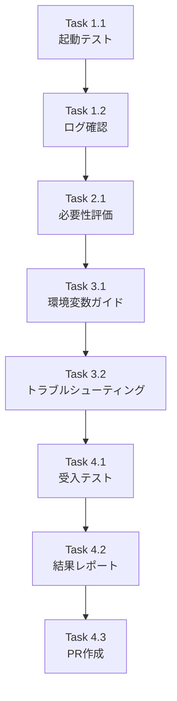

# 作業計画書: Issue #166

## Issue: [Bug] dev-start.sh実行時にSQLAlchemy非同期ドライバーエラーが発生

**Issue番号**: #166
**サイズ**: S (Small)
**作業見積**: 4時間
**優先度**: High（開発環境に影響）
**依存Issue**: なし

---

## 1. 事前調査結果

### 現状分析（2025-11-29）

| サービス | エンジン種別 | デフォルト設定 | 現状 |
|---------|------------|--------------|------|
| jobqueue | `create_async_engine` | `sqlite+aiosqlite:///./data/jobqueue.db` | ✅ 正しい |
| myscheduler | `create_engine`（同期） | `sqlite:///./data/jobs.db` | ✅ 正しい |
| myVault | `create_engine`（同期） | `sqlite:///./data/myvault.db` | ✅ 正しい |

### 重要な発見

1. **jobqueue**: `create_async_engine`を使用 → `sqlite+aiosqlite:///`が必要
   - config.py: 正しく設定済み ✅
   - .env.example: 正しく設定済み ✅
   - dev-start.sh (line 1054): 明示的に設定済み ✅

2. **myscheduler**: APSchedulerの`SQLAlchemyJobStore`は同期SQLAlchemyを使用
   - `create_engine`を使用（repositories/execution_repository.py:21）
   - `sqlite:///`形式が**正しい**（aiosqliteは不要）
   - config.py: 正しく設定済み ✅

3. **Issue記載内容との差異**:
   - Issue記載: 「myschedulerのデフォルトが誤り」
   - 実際: myschedulerは同期エンジンを使用するため`sqlite:///`が正しい

### 結論

**主要な問題は既に解決済み**と判断。ただし、以下の恒久対策が未実施：
- dev-start.shでの.env自動生成機能
- ドキュメント整備

---

## 2. 詳細タスク分解

### Phase 1: 検証（1時間）

- [ ] **Task 1.1**: 現環境での起動テスト
  - 所要時間: 30分
  - 成果物: テスト結果のログ
  - 内容:
    - `./scripts/dev-start.sh`で全サービス起動確認
    - ヘルスチェック確認（jobqueue, myscheduler）
  - 依存: なし

- [ ] **Task 1.2**: ログ確認・エラー有無検証
  - 所要時間: 30分
  - 成果物: 検証レポート
  - 内容:
    - `logs/jobqueue.log`でエラー確認
    - `logs/myscheduler.log`でエラー確認
    - SQLAlchemy関連エラーがないことを確認
  - 依存: Task 1.1

### Phase 2: 恒久対策の検討（30分）

- [ ] **Task 2.1**: .env自動生成の必要性評価
  - 所要時間: 30分
  - 成果物: 評価レポート（本ドキュメントに追記）
  - 内容:
    - 現在のdev-start.shが環境変数を直接設定している
    - .env自動生成が本当に必要か検討
    - 代替案: ドキュメント整備のみで対応可能か
  - 依存: Task 1.2

### Phase 3: ドキュメント更新（1時間）

- [ ] **Task 3.1**: 環境変数設定ガイド更新
  - 所要時間: 30分
  - 成果物: `docs/design/environment-variables.md`更新
  - 内容:
    - DATABASE_URLの設定方法明記
    - サービス別のドライバー要件明記
    - .env.exampleからのコピー手順
  - 依存: Task 2.1

- [ ] **Task 3.2**: トラブルシューティングガイド追加
  - 所要時間: 30分
  - 成果物: `docs/troubleshooting/`に追加
  - 内容:
    - SQLAlchemy非同期ドライバーエラーの対処法
    - サービス別の設定確認方法
  - 依存: Task 3.1

### Phase 4: 受入テスト・クローズ（1.5時間）

- [ ] **Task 4.1**: クリーン環境での起動テスト
  - 所要時間: 30分
  - 成果物: テスト結果
  - 内容:
    - .envファイルを削除した状態で起動テスト
    - デフォルト設定のみでの動作確認
  - 依存: Task 3.2

- [ ] **Task 4.2**: 結果レポート作成
  - 所要時間: 30分
  - 成果物: `dev-reports/bug/issue/166/result-report.md`
  - 内容:
    - 調査結果のまとめ
    - 実施した対策
    - 残存リスク
  - 依存: Task 4.1

- [ ] **Task 4.3**: PR作成・Issue クローズ
  - 所要時間: 30分
  - 成果物: PR, Issueコメント
  - 内容:
    - ドキュメント更新のPR作成
    - Issue #166へのクローズコメント
  - 依存: Task 4.2

---

## 3. タスク依存関係

---

## 4. 作業スケジュール

### Day 1（4時間）

| 時間 | タスク | 成果物 |
|------|-------|--------|
| 0:00-0:30 | Task 1.1（起動テスト） | テストログ |
| 0:30-1:00 | Task 1.2（ログ確認） | 検証結果 |
| 1:00-1:30 | Task 2.1（必要性評価） | 評価レポート |
| 1:30-2:00 | Task 3.1（環境変数ガイド） | ドキュメント |
| 2:00-2:30 | Task 3.2（トラブルシューティング） | ドキュメント |
| 2:30-3:00 | Task 4.1（受入テスト） | テスト結果 |
| 3:00-3:30 | Task 4.2（結果レポート） | レポート |
| 3:30-4:00 | Task 4.3（PR作成） | PR |

**総作業時間**: 4時間（1日以内）

---

## 5. チェックポイント

| タイミング | 確認事項 | 対応 |
|-----------|---------|------|
| Phase 1完了 | エラーなく起動確認 | 問題あれば追加調査 |
| Phase 2完了 | 対策方針決定 | ユーザー確認必要な場合は質問 |
| Phase 4完了 | 全テストパス | CI/CD確認 |

---

## 6. リスクと対策

| リスク | 発生確率 | 影響 | 対策 |
|-------|---------|------|------|
| 実際には問題が解決していない | 低 | 追加調査2時間 | Phase 1で早期発見 |
| ドキュメント不足で再発 | 中 | 将来の工数ロス | Phase 3で詳細ドキュメント作成 |
| 他サービスにも同様の問題 | 低 | 追加作業1時間 | 全サービスの設定を確認済み |

---

## 7. 成果物チェックリスト

### ドキュメント
- [ ] `docs/design/environment-variables.md`（更新）
- [ ] `docs/troubleshooting/sqlalchemy-driver-error.md`（新規）
- [ ] `dev-reports/bug/issue/166/work-plan.md`（本ファイル）
- [ ] `dev-reports/bug/issue/166/result-report.md`

### コード変更
- [ ] なし（ドキュメントのみ）

---

## 8. Definition of Done

Issue完了条件：
- [ ] dev-start.shで全サービスが正常に起動する
- [ ] SQLAlchemy関連エラーが発生しない
- [ ] 環境変数設定ガイドが更新されている
- [ ] トラブルシューティングガイドが追加されている
- [ ] 結果レポートが作成されている
- [ ] PR がマージされている
- [ ] Issue #166 がクローズされている

---

## 9. 次のアクション

作業計画承認後：
1. **ブランチ作成**: `bug/issue/166-sqlalchemy-driver-error`
2. **Phase 1実行**: 現環境での検証
3. **結果に基づき対応**: 問題あれば修正、なければドキュメント更新
4. **PR作成**: `/pm-create-pr`で自動作成

---

## 10. 備考

### Issue記載内容との差異について

Issue #166 では「myschedulerのデフォルト設定が誤り」と記載されていますが、実際にはmyschedulerはAPSchedulerの`SQLAlchemyJobStore`を使用しており、これは**同期SQLAlchemy**（`create_engine`）を使用します。

そのため、`sqlite:///`形式（aiosqliteなし）が**正しい設定**です。

Issue記載の分析は、myschedulerがasync SQLAlchemyを使用していると誤認したものと推測されます。
