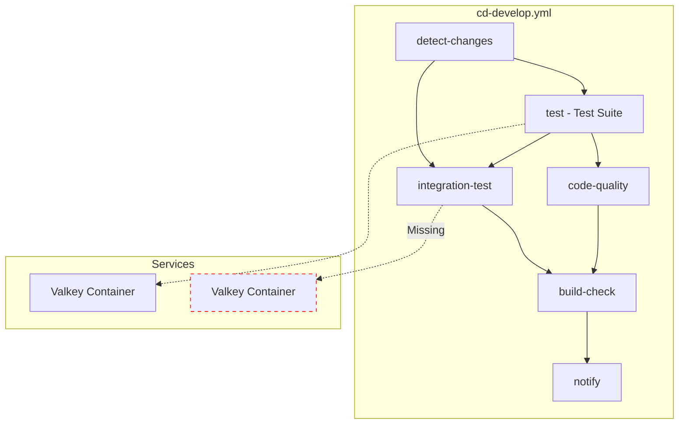
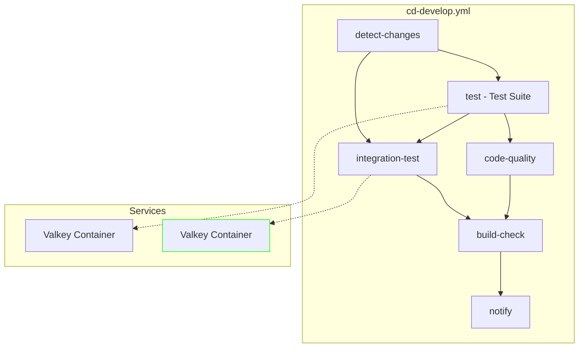
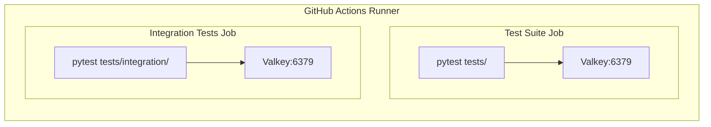

# 設計方針書: Integration Tests ジョブへの Valkey サービスコンテナ追加

> Issue #182: fix(ci): Add Valkey service container to Integration Tests job

## 1. 設計概要

### 1.1 変更の性質

| 項目 | 内容 |
|------|------|
| 変更種別 | CI/CD 設定修正 |
| 影響範囲 | GitHub Actions ワークフロー |
| コード変更 | なし（YAML 設定のみ） |
| リスクレベル | 低 |

### 1.2 設計目標

1. **一貫性**: Test Suite ジョブと Integration Tests ジョブで同一のサービス設定を使用
2. **最小変更**: 既存の動作実績のある設定をそのまま流用
3. **保守性**: 将来の設定変更時に影響範囲を把握しやすい構造

## 2. CI/CD パイプラインアーキテクチャ

### 2.1 現在のワークフロー構成



### 2.2 修正後のワークフロー構成



### 2.3 サービスコンテナの配置



## 3. 技術選定

### 3.1 採用技術

| カテゴリ | 選定技術 | 選定理由 |
|---------|---------|---------|
| サービスコンテナ | GitHub Actions Services | 既存インフラ活用、追加コストなし |
| Valkey イメージ | `valkey/valkey:latest` | Test Suite で動作実績あり |
| ヘルスチェック | `valkey-cli ping` | 標準的なヘルスチェック方法 |
| ポート | 6379 | Valkey/Redis 標準ポート |

### 3.2 設定値の根拠

| 設定項目 | 値 | 根拠 |
|----------|-----|------|
| `health-interval` | 10s | GitHub Actions 推奨値 |
| `health-timeout` | 5s | Valkey 応答時間を考慮 |
| `health-retries` | 5 | 最大50秒の待機時間を許容 |

## 4. 設計判断とトレードオフ

### 4.1 採用した設計

**方針**: Test Suite ジョブの設定を**そのままコピー**する

```yaml
services:
  valkey:
    image: valkey/valkey:latest
    ports:
      - 6379:6379
    options: >-
      --health-cmd "valkey-cli ping"
      --health-interval 10s
      --health-timeout 5s
      --health-retries 5
```

### 4.2 代替案の検討

| 代替案 | 説明 | 不採用理由 |
|--------|------|-----------|
| YAML アンカーで共通化 | `&valkey-service` で定義を共有 | GitHub Actions は複数ジョブ間のアンカー参照に制限あり |
| 別ワークフローファイルに分割 | `valkey-tests.yml` を作成 | 過度な複雑化、YAGNI 違反 |
| Valkey テストを Test Suite に統合 | Integration Tests から除外 | テスト分類の意図を崩す |
| 環境変数で設定を管理 | `VALKEY_IMAGE` 等 | 単純なコピーで十分、過度な抽象化 |

### 4.3 トレードオフ分析

| 観点 | 採用案 | トレードオフ |
|------|--------|-------------|
| **保守性** | 設定の重複 | 変更時に2箇所修正が必要 |
| **シンプルさ** | 直接コピー | 理解しやすく、バグ混入リスク低 |
| **実績** | 既存設定の流用 | 新規設定のテスト不要 |
| **リスク** | 最小変更 | 予期しない副作用なし |

### 4.4 CLAUDE.md 原則への準拠

| 原則 | 準拠状況 | 説明 |
|------|---------|------|
| **KISS** | 準拠 | 最もシンプルな解決策（設定コピー）を採用 |
| **YAGNI** | 準拠 | 将来の拡張を見越した過度な抽象化を避けた |
| **DRY** | 部分的非準拠 | 設定の重複を許容（GitHub Actions の制約） |
| **SOLID** | N/A | コード変更なしのため該当せず |

## 5. 実装方針

### 5.1 変更対象

```
.github/workflows/cd-develop.yml
└── integration-test ジョブ (line 150-200)
    └── services セクション追加 (line 154)
```

### 5.2 変更内容（差分）

```diff
  integration-test:
    name: Integration Tests
    runs-on: ubuntu-latest
    needs: [test, detect-changes]
    if: needs.detect-changes.outputs.myscheduler == 'true' || needs.detect-changes.outputs.jobqueue == 'true' || needs.detect-changes.outputs.expertAgent == 'true' || needs.detect-changes.outputs.commonUI == 'true'
+   services:
+     valkey:
+       image: valkey/valkey:latest
+       ports:
+         - 6379:6379
+       options: >-
+         --health-cmd "valkey-cli ping"
+         --health-interval 10s
+         --health-timeout 5s
+         --health-retries 5
    strategy:
      matrix:
```

### 5.3 実装手順

1. `cd-develop.yml` を編集
2. Integration Tests ジョブの `if:` と `strategy:` の間に `services:` セクションを追加
3. インデントを確認（`services:` は `if:` と同じレベル）
4. YAML 構文を検証

## 6. 品質保証方針

### 6.1 検証方法

| 検証項目 | 方法 | 期待結果 |
|----------|------|----------|
| YAML 構文 | ローカルで `yamllint` 実行 | エラーなし |
| ワークフロー実行 | PR 作成後に CI 実行 | ジョブ開始成功 |
| Valkey 接続 | テストログ確認 | 接続エラーなし |
| テスト結果 | CI 結果確認 | 22テスト全て PASSED |

### 6.2 受入基準の検証

| AC | 検証方法 | 判定基準 |
|----|----------|----------|
| AC1 | CI ログで Valkey コンテナ起動確認 | "Starting service containers" 出力 |
| AC2 | CI ログでヘルスチェック確認 | "healthy" ステータス |
| AC3 | テスト結果確認 | 22テスト PASSED |
| AC4 | CI 全体の結果確認 | 全ジョブ緑色 |

### 6.3 ロールバック計画

| 状況 | 対応 |
|------|------|
| YAML 構文エラー | PR をクローズし、修正後に再作成 |
| Valkey 起動失敗 | 設定を Test Suite からコピーし直す |
| テスト失敗（設定以外の原因） | 別 Issue として切り出し |

## 7. 影響分析

### 7.1 影響を受けるコンポーネント

| コンポーネント | 影響 |
|---------------|------|
| Integration Tests ジョブ | 直接影響（サービス追加） |
| Test Suite ジョブ | 影響なし |
| build-check ジョブ | 影響なし（依存関係のみ） |
| テストコード | 影響なし（変更なし） |

### 7.2 CI 実行時間への影響

| 項目 | 現在 | 修正後 | 差分 |
|------|------|--------|------|
| Valkey 起動時間 | 0s | ~15s | +15s |
| ヘルスチェック待機 | 0s | ~10s | +10s |
| **合計オーバーヘッド** | - | - | **~25-30s** |

## 8. 関連ドキュメント

| ドキュメント | 内容 |
|-------------|------|
| [requirements.md](./requirements.md) | 要件定義書 |
| [current-state-analysis.md](./current-state-analysis.md) | 現状整理レポート |
| [GitHub Actions Services](https://docs.github.com/en/actions/using-containerized-services/about-service-containers) | 公式ドキュメント |

---

**作成日**: 2024-12-04
**ステータス**: 設計完了・実装待ち
**レビュー**: -
