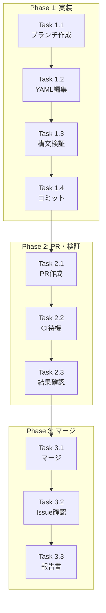

# 作業計画書: Issue #182

> Integration Tests ジョブへの Valkey サービスコンテナ追加

## Issue概要

| 項目 | 内容 |
|------|------|
| **Issue番号** | #182 |
| **タイトル** | fix(ci): Add Valkey service container to Integration Tests job |
| **サイズ** | XS |
| **作業見積** | 0.5時間（30分） |
| **優先度** | Medium |
| **依存Issue** | なし |
| **ブランチ** | `fix/issue/182` |

---

## 設計ドキュメント（完了済み）

| ドキュメント | 状態 | リンク |
|-------------|------|--------|
| 現状分析 | ✅ 完了 | [current-state-analysis.md](./current-state-analysis.md) |
| 要件定義 | ✅ 完了 | [requirements.md](./requirements.md) |
| 設計方針 | ✅ 完了 | [design-policy.md](./design-policy.md) |
| アーキテクチャレビュー | ✅ 承認 | [architecture-review.md](./architecture-review.md) |
| Issue分割 | ✅ 不要 | [issue-split.md](./issue-split.md) |

---

## 詳細タスク分解

### Phase 1: 実装（10分）

- [ ] **Task 1.1**: ブランチ作成
  - 所要時間: 1分
  - コマンド: `git checkout -b fix/issue/182`
  - 依存: なし

- [ ] **Task 1.2**: cd-develop.yml 編集
  - 所要時間: 5分
  - 成果物: `.github/workflows/cd-develop.yml`
  - 変更箇所: line 154（`if:` と `strategy:` の間）
  - 変更内容: `services` セクション追加（8行）
  - 依存: Task 1.1

- [ ] **Task 1.3**: YAML構文検証
  - 所要時間: 2分
  - 検証方法: ローカルで `yamllint` または構文チェック
  - 依存: Task 1.2

- [ ] **Task 1.4**: コミット作成
  - 所要時間: 2分
  - コミットメッセージ: `fix(ci): add Valkey service container to Integration Tests job`
  - 依存: Task 1.3

### Phase 2: PR作成・検証（15分）

- [ ] **Task 2.1**: PR作成
  - 所要時間: 3分
  - ベースブランチ: `develop`
  - PR タイトル: `fix(ci): Add Valkey service container to Integration Tests job (#182)`
  - 依存: Task 1.4

- [ ] **Task 2.2**: CI実行待機
  - 所要時間: 10分（自動）
  - 確認事項:
    - Integration Tests ジョブが開始される
    - Valkey サービスコンテナが起動する
    - 22個のテストが PASSED になる
  - 依存: Task 2.1

- [ ] **Task 2.3**: CI結果確認
  - 所要時間: 2分
  - 確認項目:
    - [ ] Valkey コンテナ起動ログ確認
    - [ ] ヘルスチェック成功確認
    - [ ] 全テスト PASSED 確認
  - 依存: Task 2.2

### Phase 3: マージ（5分）

- [ ] **Task 3.1**: PR承認・マージ
  - 所要時間: 2分
  - マージ方法: Squash merge
  - 依存: Task 2.3

- [ ] **Task 3.2**: Issue クローズ確認
  - 所要時間: 1分
  - 確認: Issue #182 が自動クローズされる
  - 依存: Task 3.1

- [ ] **Task 3.3**: 進捗報告書作成
  - 所要時間: 2分
  - 成果物: `implementation-report.md`
  - 依存: Task 3.2

---

## タスク依存関係



---

## 作業スケジュール

### 単一セッション計画（30分）

| 時間 | タスク | 成果物 |
|------|--------|--------|
| 0:00-0:01 | Task 1.1: ブランチ作成 | `fix/issue/182` ブランチ |
| 0:01-0:06 | Task 1.2: YAML編集 | 修正済み `cd-develop.yml` |
| 0:06-0:08 | Task 1.3: 構文検証 | 検証完了 |
| 0:08-0:10 | Task 1.4: コミット | コミット作成 |
| 0:10-0:13 | Task 2.1: PR作成 | PR作成完了 |
| 0:13-0:23 | Task 2.2: CI待機 | CI実行中（待機） |
| 0:23-0:25 | Task 2.3: 結果確認 | CI成功確認 |
| 0:25-0:27 | Task 3.1: マージ | PR マージ完了 |
| 0:27-0:28 | Task 3.2: Issue確認 | Issue クローズ確認 |
| 0:28-0:30 | Task 3.3: 報告書 | 完了報告書作成 |

**総作業時間**: 30分

---

## 変更内容詳細

### 修正対象ファイル

```
.github/workflows/cd-develop.yml
└── integration-test ジョブ (line 150-200)
    └── services セクション追加 (line 154)
```

### 追加するコード

```yaml
  services:
    valkey:
      image: valkey/valkey:latest
      ports:
        - 6379:6379
      options: >-
        --health-cmd "valkey-cli ping"
        --health-interval 10s
        --health-timeout 5s
        --health-retries 5
```

### 修正後の構造

```yaml
integration-test:
  name: Integration Tests
  runs-on: ubuntu-latest
  needs: [test, detect-changes]
  if: needs.detect-changes.outputs.myscheduler == 'true' || ...

  services:                          # ← 追加開始
    valkey:
      image: valkey/valkey:latest
      ports:
        - 6379:6379
      options: >-
        --health-cmd "valkey-cli ping"
        --health-interval 10s
        --health-timeout 5s
        --health-retries 5          # ← 追加終了

  strategy:
    matrix:
      # ...
```

---

## チェックポイント

| タイミング | 確認事項 | 判定基準 | 対応 |
|-----------|---------|---------|------|
| Task 1.3完了時 | YAML構文正常 | パースエラーなし | エラー時は修正 |
| Task 2.2完了時 | CI実行成功 | 全ジョブ緑 | 失敗時は原因調査 |
| Task 2.3完了時 | 22テストPASSED | ERROR/FAILED なし | 失敗テストあれば調査 |

---

## リスクと対策

| リスク | 発生確率 | 影響 | 対策 |
|--------|---------|------|------|
| YAMLインデントエラー | 低 | PR作成不可 | Task 1.3で事前検証 |
| Valkey起動失敗 | 極低 | テスト失敗 | Test Suite設定と完全一致で回避 |
| CI時間超過 | 低 | 待機時間延長 | 許容範囲内（+30秒程度） |

---

## 成果物チェックリスト

### コード
- [ ] `.github/workflows/cd-develop.yml` （8行追加）

### ドキュメント（既存）
- [x] `dev-reports/fix/issue/182/current-state-analysis.md`
- [x] `dev-reports/fix/issue/182/requirements.md`
- [x] `dev-reports/fix/issue/182/design-policy.md`
- [x] `dev-reports/fix/issue/182/architecture-review.md`
- [x] `dev-reports/fix/issue/182/issue-split.md`
- [x] `dev-reports/fix/issue/182/work-plan.md`

### ドキュメント（作成予定）
- [ ] `dev-reports/fix/issue/182/implementation-report.md`

---

## Definition of Done

Issue #182 完了条件：

- [ ] `services` セクションが Integration Tests ジョブに追加されている
- [ ] Valkey コンテナが CI 環境で起動する
- [ ] ヘルスチェックが成功する
- [ ] 22個の Valkey テストが全て PASSED
- [ ] CI 全体が成功（緑色）
- [ ] PR がマージされている
- [ ] Issue #182 がクローズされている

---

## 次のアクション

作業計画承認後：

1. **ブランチ作成**: `fix/issue/182`
2. **YAML編集**: `cd-develop.yml` line 154 に services 追加
3. **PR作成**: develop へのマージリクエスト
4. **CI確認**: 22テストの PASSED 確認
5. **マージ**: Squash merge で完了

---

**作成日**: 2024-12-04
**ステータス**: 作業計画完了・実装待ち
**承認**: -
