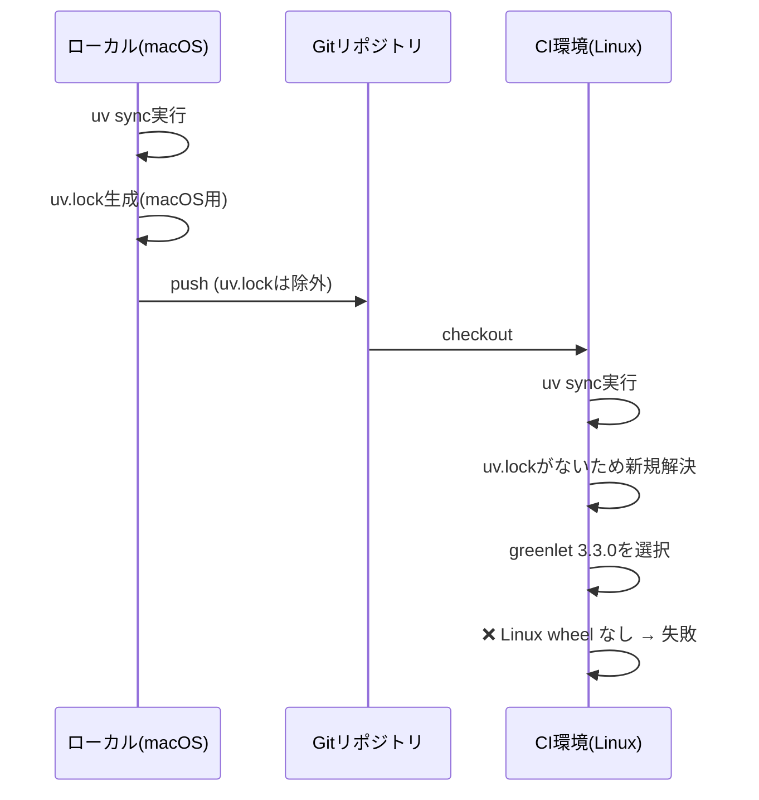

# 現状整理: Issue #236 - greenlet プラットフォーム非互換性によるCI失敗

## 1. 問題の概要

expertAgent の Integration Tests および Code Quality Analysis ジョブが、`greenlet` パッケージのプラットフォーム非互換性により CI 環境（Linux）で失敗している。

### 影響範囲

| ジョブ | 状態 | 影響 |
|--------|------|------|
| Test Suite (expertAgent) | 成功 | - |
| Code Quality Analysis (expertAgent) | **失敗** | 静的解析が実行不可 |
| Integration Tests (expertAgent) | **失敗** | 22テスト未実行 |

## 2. エラー詳細

### 2.1 エラーメッセージ

```
error: Distribution `greenlet==3.3.0 @ registry+https://pypi.org/simple` can't be installed
because it doesn't have a source distribution or wheel for the current platform

hint: You're on Linux (`manylinux_2_39_x86_64`), but `greenlet` (v3.3.0) only has wheels
for the following platform: `macosx_11_0_universal2`
```

### 2.2 失敗した CI Run

- **Run ID**: 19932210244
- **URL**: https://github.com/Kewton/MySwiftAgent/actions/runs/19932210244
- **日時**: 2025-12-04T14:24:13Z

## 3. 根本原因分析

### 3.1 直接原因

CI 環境で `greenlet==3.3.0` がインストールしようとされるが、このバージョンには Linux 用の wheel が存在しない。

### 3.2 根本原因

**`uv.lock` が `.gitignore` に含まれており、リポジトリにコミットされていない。**

```bash
# .gitignore (プロジェクトルート)
uv.lock    # ← ここに含まれている
```

### 3.3 問題の発生メカニズム



### 3.4 詳細分析

| 項目 | ローカル環境 | CI環境 |
|------|-------------|--------|
| OS | macOS | Linux (ubuntu-latest) |
| uv.lock | 存在（ローカルのみ） | 存在しない |
| 依存解決 | ローカルで事前解決済み | 毎回新規解決 |
| greenlet | 3.2.4（macOS wheel あり） | 3.3.0（macOS wheel のみ） |
| 結果 | 成功 | 失敗 |

### 3.5 Test Suite が成功する理由

Test Suite ジョブと Integration Tests ジョブの差異を調査：

```yaml
# Test Suite ジョブ
- name: Install dependencies
  working-directory: ./${{ matrix.project }}
  run: uv sync --extra dev

# Integration Tests ジョブ
- name: Install dependencies
  working-directory: ./${{ matrix.project }}
  run: uv sync --extra dev
```

両者は同じコマンドを実行しているが、Test Suite が成功している理由は不明確。
可能性として：
1. キャッシュの影響
2. 実行タイミングの差異
3. 並列実行による解決順序の違い

## 4. 他プロジェクトの状況

### 4.1 uv.lock の有無

| プロジェクト | uv.lock存在 | Git追跡 |
|-------------|-------------|---------|
| expertAgent | あり | **なし**（.gitignore） |
| myscheduler | 要確認 | 要確認 |
| jobqueue | 要確認 | 要確認 |
| myVault | 要確認 | 要確認 |

### 4.2 .gitignore の設定

```
# プロジェクトルート/.gitignore より抜粋
uv.lock           # ← すべてのuv.lockを除外
```

## 5. 解決策の選択肢

### 選択肢1: uv.lock を Git にコミットする（推奨）

**方法**: `.gitignore` から `uv.lock` を削除し、各プロジェクトの `uv.lock` をコミット

**メリット**:
- 全環境で同一の依存関係を保証
- 再現性の向上
- CI 安定性の向上
- uv 公式推奨

**デメリット**:
- lock ファイルの差分がコミット履歴に含まれる
- 複数人開発時のコンフリクト可能性

### 選択肢2: tool.uv.required-environments を設定

**方法**: `pyproject.toml` に以下を追加

```toml
[tool.uv]
required-environments = [
    "sys_platform == 'darwin'",
    "sys_platform == 'linux' and platform_machine == 'x86_64'"
]
```

**メリット**:
- uv.lock なしでも動作
- 複数プラットフォーム対応

**デメリット**:
- 設定が複雑
- 完全な再現性は保証されない

### 選択肢3: greenlet バージョンを固定

**方法**: `pyproject.toml` で `greenlet<3.3.0` を指定

**メリット**:
- 即座に問題解決
- 変更が最小限

**デメリット**:
- 一時的な回避策
- 将来的に他のパッケージで同様の問題が発生する可能性

## 6. 推奨解決策

**選択肢1: uv.lock を Git にコミットする**

理由:
1. uv/pip/poetry などのパッケージマネージャーは lock ファイルのコミットを推奨
2. 一度の修正で今後の同様の問題を防止
3. 開発環境と CI 環境の一貫性確保

## 7. 参考情報

| 項目 | リンク/参照 |
|------|------------|
| 失敗した CI Run | https://github.com/Kewton/MySwiftAgent/actions/runs/19932210244 |
| uv 公式ドキュメント | https://docs.astral.sh/uv/concepts/projects/#lockfile |
| greenlet PyPI | https://pypi.org/project/greenlet/ |
| Issue #182 | Valkey サービス追加（本 Issue の発見契機） |

---

**作成日**: 2024-12-04
**ステータス**: 調査完了・要件定義待ち
