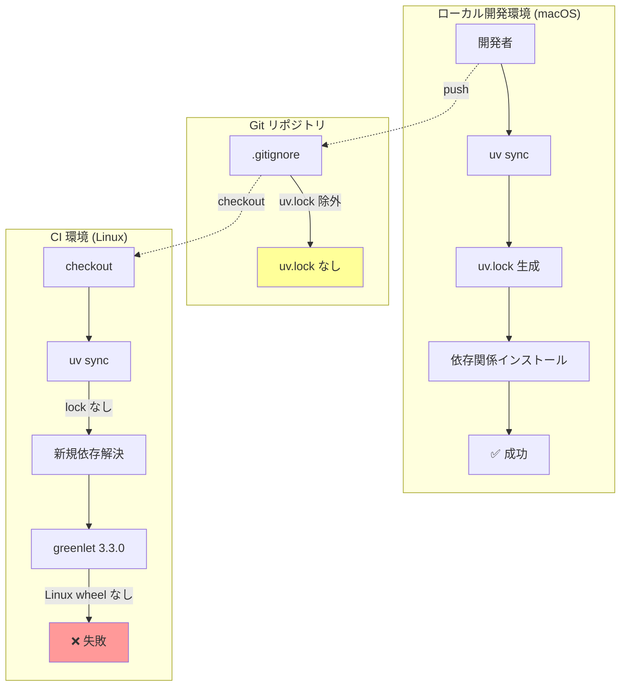
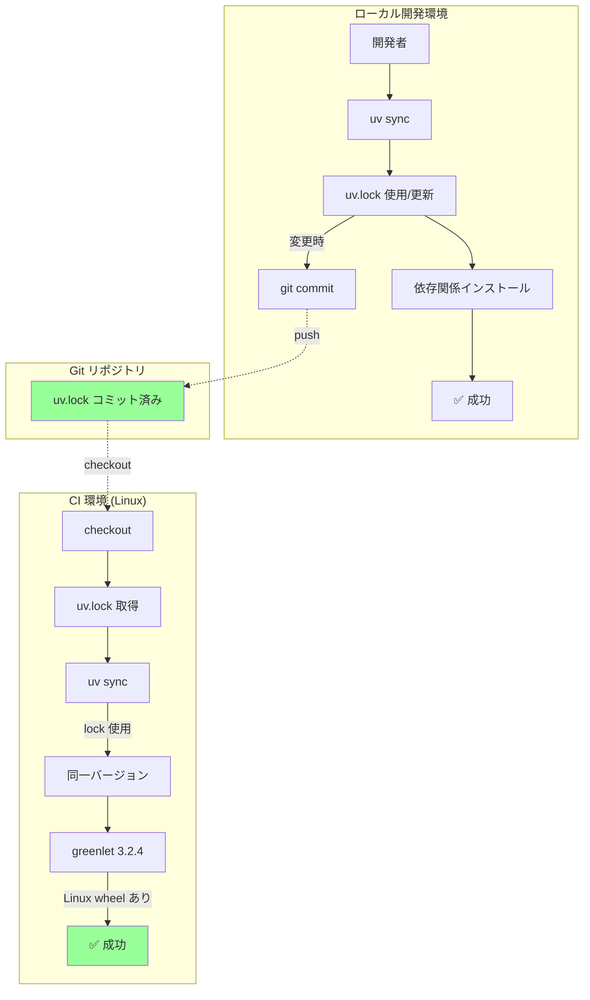
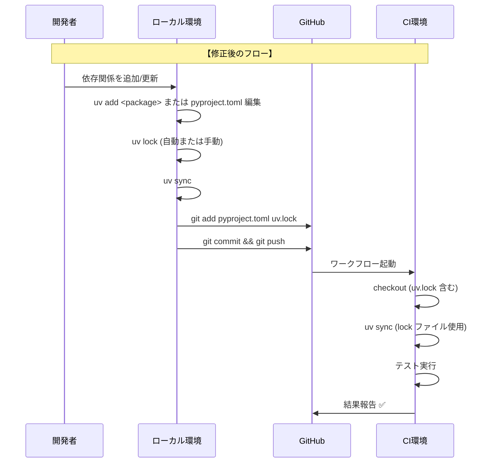

# 設計方針書: greenlet プラットフォーム非互換性の修正

> Issue #236: fix(ci): expertAgent Integration Tests fail due to greenlet platform incompatibility

## 1. 設計概要

### 1.1 変更の性質

| 項目 | 内容 |
|------|------|
| 変更種別 | 構成管理（.gitignore 修正） |
| 影響範囲 | 依存関係管理、CI/CD |
| コード変更 | なし（設定ファイルのみ） |
| リスクレベル | 低 |

### 1.2 設計目標

1. **再現性**: 全環境（ローカル、CI）で同一の依存関係を使用
2. **安定性**: プラットフォーム起因の CI 失敗を防止
3. **保守性**: 依存関係更新プロセスの明確化

## 2. 依存関係管理アーキテクチャ

### 2.1 現在の状態（問題あり）



### 2.2 修正後の状態（目標）



### 2.3 依存関係フロー



## 3. 技術選定

### 3.1 採用技術

| カテゴリ | 選定技術 | 選定理由 |
|---------|---------|---------|
| パッケージマネージャー | uv | 既存採用、高速、lock ファイルサポート |
| Lock ファイル形式 | uv.lock | uv 標準形式、プラットフォーム互換性情報含む |
| バージョン管理 | Git | 既存採用 |

### 3.2 uv.lock の特徴

| 特徴 | 説明 |
|------|------|
| クロスプラットフォーム | 複数プラットフォームの wheel 情報を保持 |
| 決定論的解決 | 同一 lock から常に同一環境を再現 |
| 高速インストール | 解決済みのため再計算不要 |
| 差分表示可能 | テキスト形式で git diff 可能 |

## 4. 設計判断とトレードオフ

### 4.1 採用した設計

**方針**: `.gitignore` から `uv.lock` を削除し、lock ファイルをコミットする

### 4.2 代替案の検討

| 代替案 | 説明 | 不採用理由 |
|--------|------|-----------|
| required-environments 設定 | pyproject.toml でプラットフォーム指定 | 完全な再現性なし、設定が複雑 |
| greenlet バージョン固定 | `greenlet<3.3.0` を指定 | 一時的な回避策、他パッケージで再発リスク |
| CI で lock 再生成 | `uv lock` を CI で実行 | 毎回異なる解決になる可能性 |
| 環境別 lock ファイル | `uv.lock.linux`, `uv.lock.macos` | 複雑、uv 非対応 |

### 4.3 トレードオフ分析

| 観点 | 採用案 | トレードオフ |
|------|--------|-------------|
| **再現性** | lock コミット | 完全な再現性を保証 |
| **保守性** | lock コミット | 依存更新時に lock も更新必要 |
| **コンフリクト** | lock コミット | マージ時にコンフリクト可能性あり |
| **透明性** | lock コミット | 依存変更が履歴で追跡可能 |

### 4.4 コンフリクト発生時の対処

```bash
# uv.lock でコンフリクト発生時
git checkout --theirs uv.lock  # または --ours
uv lock                         # 再生成
git add uv.lock
git commit
```

### 4.5 CLAUDE.md 原則への準拠

| 原則 | 準拠状況 | 説明 |
|------|---------|------|
| **KISS** | 準拠 | 最もシンプルな解決策（.gitignore 修正のみ） |
| **YAGNI** | 準拠 | 必要最小限の変更（expertAgent のみ） |
| **DRY** | N/A | 設定変更のため該当せず |
| **SOLID** | N/A | コード変更なしのため該当せず |

## 5. 実装方針

### 5.1 変更対象ファイル

```
.gitignore                    # uv.lock 行を削除
expertAgent/uv.lock           # Git 追跡開始（新規追加）
```

### 5.2 変更内容（差分）

#### .gitignore

```diff
  #Pipfile.lock
  #poetry.lock
  #pdm.lock
- uv.lock
  /.emacs.desktop.lock
  *.pid.lock
  yarn.lock
  Cargo.lock
```

#### expertAgent/uv.lock

```bash
# 新規追跡開始
git add expertAgent/uv.lock
```

### 5.3 実装手順

1. `.gitignore` から `uv.lock` 行を削除
2. `expertAgent/uv.lock` の内容確認（greenlet 3.2.4 であること）
3. `git add .gitignore expertAgent/uv.lock`
4. コミット作成
5. PR 作成・CI 確認

### 5.4 uv.lock 内容の事前確認

```bash
# greenlet バージョン確認
grep -A2 'name = "greenlet"' expertAgent/uv.lock
# 期待出力: version = "3.2.4"

# Linux wheel 存在確認
grep "manylinux.*greenlet" expertAgent/uv.lock
# 期待出力: Linux wheel URL が含まれる
```

## 6. 品質保証方針

### 6.1 検証方法

| 検証項目 | 方法 | 期待結果 |
|----------|------|----------|
| uv.lock 追跡 | `git ls-files expertAgent/uv.lock` | ファイルパス出力 |
| CI 依存インストール | CI ログ確認 | エラーなし |
| Integration Tests | CI 結果確認 | 全テスト PASSED |
| Code Quality | CI 結果確認 | 静的解析成功 |

### 6.2 受入基準の検証

| AC | 検証方法 | 判定基準 |
|----|----------|----------|
| AC1 | `grep uv.lock .gitignore` | 出力なし |
| AC2 | `git ls-files expertAgent/uv.lock` | ファイルパス出力 |
| AC3 | CI ログ: "Install dependencies" | exit code 0 |
| AC4 | CI 結果: Integration Tests | 全テスト PASSED |
| AC5 | CI 結果: Code Quality | 成功 |
| AC6 | CI 全体 | 全ジョブ緑 |

### 6.3 ロールバック計画

| 状況 | 対応 |
|------|------|
| uv.lock コミット後に問題 | `git revert` で変更を戻す |
| 別の依存関係問題 | `uv lock --upgrade` で再生成 |

## 7. 影響分析

### 7.1 影響を受けるコンポーネント

| コンポーネント | 影響 |
|---------------|------|
| expertAgent | 直接影響（uv.lock 追跡開始） |
| CI ワークフロー | 間接影響（依存解決方法変更） |
| 他プロジェクト | 影響なし（今回は対象外） |

### 7.2 他プロジェクトへの展開

本修正が成功した場合、同様の問題を防ぐため、他プロジェクトの `uv.lock` も段階的にコミットすることを推奨：

| プロジェクト | 優先度 | 理由 |
|-------------|--------|------|
| myscheduler | 高 | 本番運用中 |
| jobqueue | 中 | 準備中 |
| myVault | 高 | 本番運用中 |
| graphAiServer | 中 | 開発中 |
| commonUI | 低 | TypeScript（uv 不使用） |

> **注**: 他プロジェクトの対応は別 Issue として切り出すことを推奨

## 8. 関連ドキュメント

| ドキュメント | 内容 |
|-------------|------|
| [requirements.md](./requirements.md) | 要件定義書 |
| [current-state-analysis.md](./current-state-analysis.md) | 現状整理レポート |
| [uv 公式: Lock files](https://docs.astral.sh/uv/concepts/projects/#lockfile) | uv lock ファイルの説明 |

---

**作成日**: 2024-12-04
**ステータス**: 設計完了・レビュー待ち
**レビュー**: -
