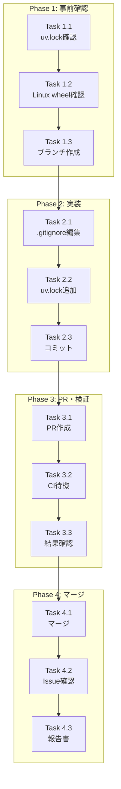

# 作業計画書: Issue #236

> greenlet プラットフォーム非互換性によるCI失敗の修正

## Issue概要

| 項目 | 内容 |
|------|------|
| **Issue番号** | #236 |
| **タイトル** | fix(ci): expertAgent Integration Tests fail due to greenlet platform incompatibility |
| **サイズ** | XS |
| **作業見積** | 30分 |
| **優先度** | High（CI失敗中） |
| **依存Issue** | なし |
| **ブランチ** | `fix/issue/236` |

---

## 設計ドキュメント（完了済み）

| ドキュメント | 状態 | リンク |
|-------------|------|--------|
| 現状分析 | ✅ 完了 | [current-state-analysis.md](./current-state-analysis.md) |
| 要件定義 | ✅ 完了 | [requirements.md](./requirements.md) |
| 設計方針 | ✅ 完了 | [design-policy.md](./design-policy.md) |
| アーキテクチャレビュー | ✅ 承認 (4.9/5) | [architecture-review.md](./architecture-review.md) |
| Issue分割 | ✅ 不要 | [issue-split.md](./issue-split.md) |

---

## 詳細タスク分解

### Phase 1: 事前確認（5分）

- [ ] **Task 1.1**: uv.lock 内容確認
  - 所要時間: 2分
  - 確認事項: greenlet バージョンが 3.2.4 であること
  - コマンド: `grep -A2 'name = "greenlet"' expertAgent/uv.lock`
  - 依存: なし

- [ ] **Task 1.2**: Linux wheel 存在確認
  - 所要時間: 2分
  - 確認事項: manylinux wheel URL が含まれていること
  - コマンド: `grep "manylinux.*greenlet" expertAgent/uv.lock | head -3`
  - 依存: Task 1.1

- [ ] **Task 1.3**: ブランチ作成
  - 所要時間: 1分
  - コマンド: `git checkout -b fix/issue/236`
  - 依存: Task 1.2

### Phase 2: 実装（5分）

- [ ] **Task 2.1**: .gitignore 編集
  - 所要時間: 2分
  - 成果物: `.gitignore`
  - 変更内容: `uv.lock` 行を削除
  - 依存: Task 1.3

- [ ] **Task 2.2**: uv.lock を Git 追跡開始
  - 所要時間: 1分
  - コマンド: `git add expertAgent/uv.lock`
  - 依存: Task 2.1

- [ ] **Task 2.3**: コミット作成
  - 所要時間: 2分
  - メッセージ: `fix(ci): commit uv.lock to resolve greenlet platform incompatibility`
  - 依存: Task 2.2

### Phase 3: PR作成・検証（15分）

- [ ] **Task 3.1**: PR作成
  - 所要時間: 3分
  - ベースブランチ: `develop`
  - PR タイトル: `fix(ci): Commit uv.lock to resolve greenlet platform incompatibility (#236)`
  - 依存: Task 2.3

- [ ] **Task 3.2**: CI実行待機
  - 所要時間: 10分（自動）
  - 確認事項:
    - 依存関係インストール成功
    - Integration Tests 成功
    - Code Quality Analysis 成功
  - 依存: Task 3.1

- [ ] **Task 3.3**: CI結果確認
  - 所要時間: 2分
  - 確認項目:
    - [ ] `uv sync` 成功
    - [ ] 全テスト PASSED
    - [ ] 静的解析成功
  - 依存: Task 3.2

### Phase 4: マージ（5分）

- [ ] **Task 4.1**: PR承認・マージ
  - 所要時間: 2分
  - マージ方法: Squash merge
  - 依存: Task 3.3

- [ ] **Task 4.2**: Issue クローズ確認
  - 所要時間: 1分
  - 確認: Issue #236 が自動クローズされる
  - 依存: Task 4.1

- [ ] **Task 4.3**: 完了報告書作成
  - 所要時間: 2分
  - 成果物: `implementation-report.md`
  - 依存: Task 4.2

---

## タスク依存関係



---

## 作業スケジュール

### 単一セッション計画（30分）

| 時間 | タスク | 成果物 |
|------|--------|--------|
| 0:00-0:02 | Task 1.1: uv.lock確認 | greenlet 3.2.4 確認 |
| 0:02-0:04 | Task 1.2: Linux wheel確認 | manylinux URL 確認 |
| 0:04-0:05 | Task 1.3: ブランチ作成 | `fix/issue/236` |
| 0:05-0:07 | Task 2.1: .gitignore編集 | uv.lock 行削除 |
| 0:07-0:08 | Task 2.2: uv.lock追加 | git add 完了 |
| 0:08-0:10 | Task 2.3: コミット | コミット作成 |
| 0:10-0:13 | Task 3.1: PR作成 | PR作成完了 |
| 0:13-0:23 | Task 3.2: CI待機 | CI実行中（待機） |
| 0:23-0:25 | Task 3.3: 結果確認 | CI成功確認 |
| 0:25-0:27 | Task 4.1: マージ | PR マージ完了 |
| 0:27-0:28 | Task 4.2: Issue確認 | Issue クローズ確認 |
| 0:28-0:30 | Task 4.3: 報告書 | 完了報告書作成 |

**総作業時間**: 30分

---

## 変更内容詳細

### 修正対象ファイル

```
.gitignore                    # uv.lock 行を削除
expertAgent/uv.lock           # Git 追跡開始（新規追加）
```

### .gitignore の変更

```diff
  #Pipfile.lock
  #poetry.lock
  #pdm.lock
- uv.lock
  /.emacs.desktop.lock
  *.pid.lock
  yarn.lock
  Cargo.lock
```

### expertAgent/uv.lock

```bash
# 新規追跡開始（既存ファイルを追加）
git add expertAgent/uv.lock
```

---

## チェックポイント

| タイミング | 確認事項 | 判定基準 | 対応 |
|-----------|---------|---------|------|
| Task 1.2完了時 | greenlet バージョン | 3.2.4 であること | 異なる場合は `uv lock` で再生成 |
| Task 2.1完了時 | .gitignore 変更 | uv.lock 行がないこと | grep で確認 |
| Task 3.2完了時 | CI 実行成功 | 全ジョブ緑 | 失敗時は原因調査 |
| Task 3.3完了時 | テスト結果 | Integration Tests 成功 | 失敗テストあれば調査 |

---

## リスクと対策

| リスク | 発生確率 | 影響 | 対策 |
|--------|---------|------|------|
| greenlet バージョン不一致 | 低 | 実装遅延 | `uv lock` で再生成 |
| .gitignore 編集ミス | 極低 | コミットエラー | git diff で確認 |
| CI 依然失敗 | 低 | 追加調査必要 | ログ詳細確認 |

---

## 成果物チェックリスト

### 設定ファイル
- [ ] `.gitignore`（uv.lock 行削除）
- [ ] `expertAgent/uv.lock`（Git 追跡開始）

### ドキュメント（既存）
- [x] `dev-reports/fix/issue/236/current-state-analysis.md`
- [x] `dev-reports/fix/issue/236/requirements.md`
- [x] `dev-reports/fix/issue/236/design-policy.md`
- [x] `dev-reports/fix/issue/236/architecture-review.md`
- [x] `dev-reports/fix/issue/236/issue-split.md`
- [x] `dev-reports/fix/issue/236/work-plan.md`

### ドキュメント（作成予定）
- [ ] `dev-reports/fix/issue/236/implementation-report.md`

---

## Definition of Done

Issue #236 完了条件：

- [ ] `.gitignore` から `uv.lock` が削除されている
- [ ] `expertAgent/uv.lock` が Git で追跡されている
- [ ] CI 環境で `uv sync` が成功する
- [ ] Integration Tests が全て成功する
- [ ] Code Quality Analysis が成功する
- [ ] CI 全体が成功（緑色）
- [ ] PR がマージされている
- [ ] Issue #236 がクローズされている

---

## 次のアクション

作業計画承認後：

1. **事前確認**: `grep -A2 'name = "greenlet"' expertAgent/uv.lock`
2. **ブランチ作成**: `git checkout -b fix/issue/236`
3. **.gitignore 編集**: `uv.lock` 行を削除
4. **uv.lock 追加**: `git add expertAgent/uv.lock`
5. **コミット・プッシュ**: `git commit && git push`
6. **PR作成**: develop へのマージリクエスト
7. **CI確認**: 全ジョブ成功確認
8. **マージ**: Squash merge で完了

---

**作成日**: 2024-12-04
**ステータス**: 作業計画完了・実装待ち
**承認**: -
