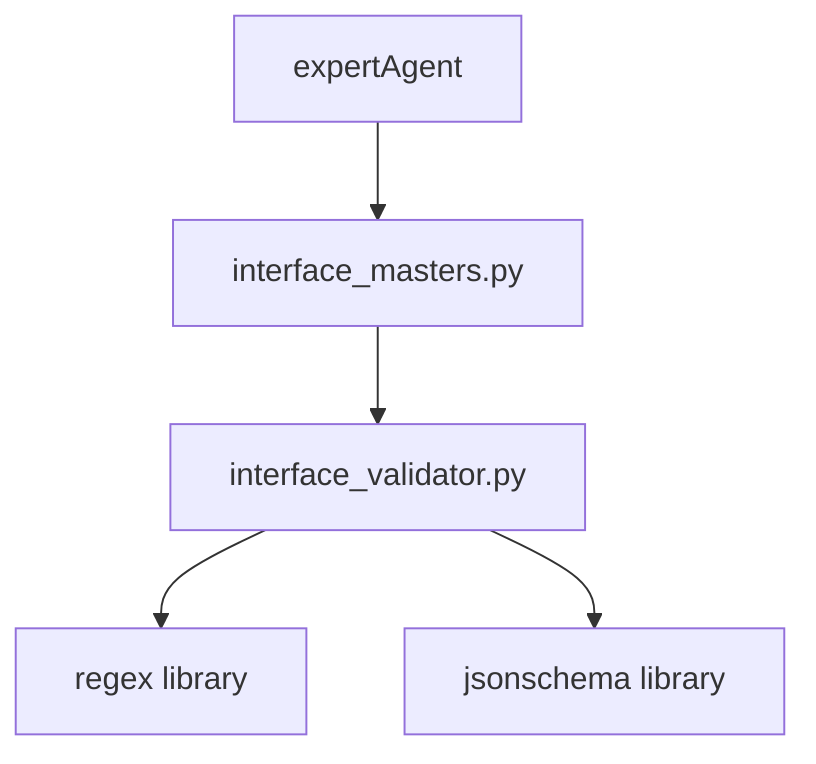
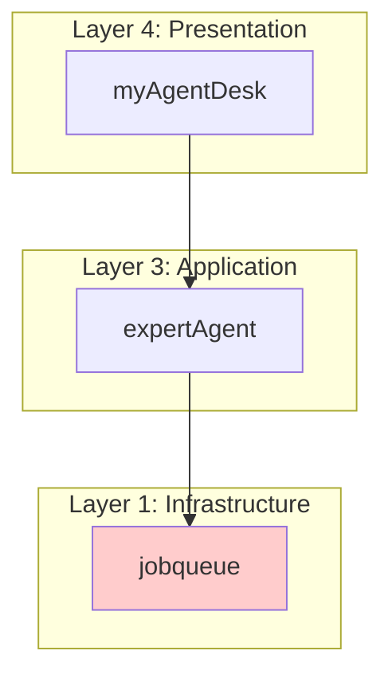
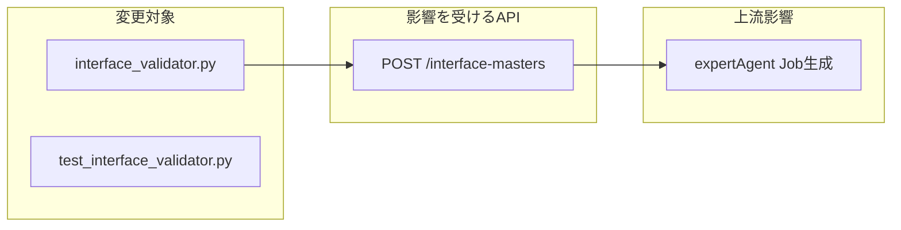

# 設計方針書: Issue #312 - interface_validator.py pattern検証バグ修正

## 現状調査サマリ

### 対象プロジェクト
- **プロジェクト名**: jobqueue
- **主要モジュール**: `app/services/interface_validator.py`
- **影響API**: `POST /api/v1/interface-masters`

### 既存アーキテクチャパターン

| パターン | 使用箇所 | 目的 |
|---------|---------|------|
| **Service Layer** | `app/services/*.py` | ビジネスロジックの分離 |
| **Custom Exception** | `InterfaceValidationError`, `WorkflowValidationError` | 構造化エラー情報 |
| **Static Method Validator** | `InterfaceValidator` | 状態を持たない検証ロジック |
| **HTTP Exception Translation** | `app/api/v1/*.py` | ドメイン例外→HTTP応答変換 |

### 類似機能の設計

#### InterfaceValidationError（既存パターン）
```python
class InterfaceValidationError(Exception):
    def __init__(self, message: str, errors: list[str]):
        super().__init__(message)
        self.errors = errors
```

#### 例外処理フロー（既存パターン）
```python
# API層での例外ハンドリング
try:
    InterfaceValidator.validate_json_schema_v7(schema)
except InterfaceValidationError as e:
    raise HTTPException(
        status_code=400,
        detail=f"Invalid input_schema: {'; '.join(e.errors)}",
    ) from e
```

### モジュール間依存関係



### 既存API設計パターン
- **エンドポイント命名規則**: RESTful（`/api/v1/{resource}`）
- **レスポンス形式**: JSON（成功時はリソース、失敗時はdetail付きエラー）
- **エラーハンドリング**: 400（検証エラー）、404（リソース未発見）、500（未捕捉例外）

### 参照したドキュメント
- `docs/arch/service-dependencies.md`: サービス間依存関係
- `jobqueue/app/services/interface_validator.py`: 現行実装（333行）
- `jobqueue/tests/unit/test_interface_validator.py`: 既存テスト（412行）
- `jobqueue/tests/unit/test_interface_validator_unicode.py`: Unicodeテスト（108行）

### 設計上の制約
1. **後方互換性**: 既存の正常なスキーマ検証に影響を与えない
2. **JSON Schema Draft 7準拠**: `pattern`キーワードは`type: string`でのみ有効
3. **テストカバレッジ**: 90%以上維持
4. **静的解析**: Ruff/MyPyエラーゼロ

---

## アーキテクチャ設計

### システム構成図（変更なし）



### 影響範囲



---

## 技術選定

| カテゴリ | 選定技術 | 選定理由 | 既存との整合性 |
|---------|---------|---------|---------------|
| 正規表現ライブラリ | `regex` | Unicode Property Escapes対応（既存使用中） | ✅ 既存維持 |
| JSON Schema検証 | `jsonschema` (Draft7Validator) | 標準的なJSON Schema検証（既存使用中） | ✅ 既存維持 |
| 例外クラス | `InterfaceValidationError` | 既存の例外クラスを再利用 | ✅ 既存維持 |

**新規技術導入**: なし（既存技術スタックで対応可能）

---

## 設計パターン

### 採用パターン

1. **Guard Clause Pattern**（型チェック追加）
   - 既存で使用: `validate_data`メソッドの`if not schema: return`
   - 適用: `pattern`値が文字列かどうかの事前チェック

2. **Defensive Programming**（防御的プログラミング）
   - 既存で使用: `isinstance`チェック（72-77行目）
   - 適用: `regex.compile()`呼び出し前の型検証

3. **Exception Chaining**（例外チェーン）
   - 既存で使用: `from e`による例外チェーン
   - 適用: `TypeError`捕捉時も同様のパターン適用

---

## 修正設計

### 問題箇所の特定

**ファイル**: `jobqueue/app/services/interface_validator.py`
**関数**: `_validate_regex_patterns_in_schema`（44-78行目）

### 現行コード（問題あり）

```python
def _validate_regex_patterns_in_schema(schema: dict[str, Any]) -> None:
    if not isinstance(schema, dict):
        return

    # Check if current level has a pattern field
    if "pattern" in schema:
        pattern = schema["pattern"]
        try:
            regex.compile(pattern)  # ← patternがdictの場合TypeError
        except regex.error as e:    # ← TypeErrorは捕捉されない
            raise InterfaceValidationError(
                "Invalid regex pattern in schema",
                [f"Pattern '{pattern}' is invalid: {e}"],
            ) from e
    # ... 再帰処理 ...
```

### 修正方針比較

| オプション | 内容 | メリット | デメリット |
|-----------|------|---------|-----------|
| **A: 型チェックのみ** | `isinstance(pattern, str)`追加 | 最小変更、シンプル | JSON Schema仕様との不整合は残る |
| **B: JSON Schema仕様準拠** | `type: string`チェック追加 | 仕様準拠、正確 | 変更範囲がやや大きい |
| **C: A+B複合** | 型チェック + 仕様準拠 | 堅牢、多層防御 | 冗長に見える可能性 |

### 推奨: オプションC（複合アプローチ）

**理由**:
1. **多層防御**: 型チェックで即座にTypeError回避
2. **仕様準拠**: JSON Schema Draft 7の正しい解釈
3. **将来対応**: 他の誤用パターンにも対応可能

### 修正後コード設計

```python
def _validate_regex_patterns_in_schema(schema: dict[str, Any]) -> None:
    """
    Recursively validate all regex patterns in JSON Schema.

    JSON Schema Draft 7では、`pattern`キーワードは`type: string`の
    スキーマレベルでのみ有効。プロパティ名としての`pattern`は無視する。
    """
    if not isinstance(schema, dict):
        return

    # patternキーワードの検証（JSON Schema仕様準拠）
    # 条件1: schema内に"pattern"キーが存在
    # 条件2: patternの値が文字列（dictはプロパティ定義を意味する）
    # 条件3: (推奨) 親スキーマがtype: stringである
    if "pattern" in schema:
        pattern = schema["pattern"]

        # 型チェック: patternが文字列でない場合はスキップ
        # （プロパティ名としての"pattern"の可能性）
        if not isinstance(pattern, str):
            # プロパティ定義の場合は再帰処理に任せる
            pass
        else:
            # JSON Schema仕様: patternはtype: stringでのみ有効
            # ただし、明示的なtype指定がない場合も検証する（寛容モード）
            try:
                regex.compile(pattern)
            except regex.error as e:
                raise InterfaceValidationError(
                    "Invalid regex pattern in schema",
                    [f"Pattern '{pattern}' is invalid: {e}"],
                ) from e

    # Recursively check nested objects
    for value in schema.values():
        if isinstance(value, dict):
            _validate_regex_patterns_in_schema(value)
        elif isinstance(value, list):
            for item in value:
                if isinstance(item, dict):
                    _validate_regex_patterns_in_schema(item)
```

### 変更点サマリ

| 項目 | 変更前 | 変更後 |
|------|--------|--------|
| 型チェック | なし | `isinstance(pattern, str)` |
| TypeError処理 | 未捕捉→500 | スキップ（プロパティ名として解釈） |
| 例外捕捉 | `regex.error`のみ | `regex.error`のみ（TypeErrorは発生しない） |

---

## テスト設計

### 追加テストケース

```python
class TestPatternPropertyName:
    """Test cases for Issue #312: pattern as property name."""

    def test_pattern_as_property_name_should_pass(self) -> None:
        """patternという名前のプロパティを含むスキーマが正常に検証される。"""
        schema = {
            "type": "object",
            "properties": {
                "pattern": {
                    "type": "string",
                    "description": "URLパターン"
                }
            }
        }
        # Should not raise
        InterfaceValidator.validate_json_schema_v7(schema)

    def test_pattern_as_nested_property_name_should_pass(self) -> None:
        """ネストされたpatternプロパティが正常に検証される。"""
        schema = {
            "type": "object",
            "properties": {
                "config": {
                    "type": "object",
                    "properties": {
                        "pattern": {
                            "type": "string",
                            "description": "マッチングパターン"
                        }
                    }
                }
            }
        }
        InterfaceValidator.validate_json_schema_v7(schema)

    def test_valid_regex_pattern_with_type_string_should_pass(self) -> None:
        """type: stringでの正規表現patternが正常に検証される。"""
        schema = {
            "type": "object",
            "properties": {
                "url": {
                    "type": "string",
                    "pattern": "^https?://.+"
                }
            }
        }
        InterfaceValidator.validate_json_schema_v7(schema)

    def test_invalid_regex_pattern_should_raise_error(self) -> None:
        """無効な正規表現patternがエラーになる。"""
        schema = {
            "type": "object",
            "properties": {
                "field": {
                    "type": "string",
                    "pattern": "[unclosed"  # 無効な正規表現
                }
            }
        }
        with pytest.raises(InterfaceValidationError) as exc_info:
            InterfaceValidator.validate_json_schema_v7(schema)
        assert "Invalid regex pattern" in str(exc_info.value)

    def test_pattern_property_with_regex_pattern_sibling(self) -> None:
        """patternプロパティと正規表現patternが共存するスキーマ。"""
        schema = {
            "type": "object",
            "properties": {
                "pattern": {
                    "type": "string",
                    "pattern": "^[a-z]+$"  # プロパティ"pattern"に正規表現patternあり
                }
            }
        }
        InterfaceValidator.validate_json_schema_v7(schema)
```

### テストカバレッジ目標

| 項目 | 目標 |
|------|------|
| 新規追加テスト | 5件以上 |
| 単体テストカバレッジ | 90%以上維持 |
| エッジケース | プロパティ名pattern、ネストpattern、複合ケース |

---

## セキュリティ設計

### 影響なし

本修正はセキュリティに影響を与えません。

- 入力検証の厳格化（緩和ではない）
- 新たな外部入力経路の追加なし
- 認証/認可ロジックへの変更なし

---

## パフォーマンス設計

### 影響評価

| 項目 | 影響 |
|------|------|
| 処理時間 | 微増（`isinstance`チェック追加、O(1)） |
| メモリ使用量 | 変更なし |
| API応答時間 | 測定不可レベルの影響 |

**結論**: パフォーマンスへの影響は無視可能

---

## 設計判断とトレードオフ

### 判断1: 型チェックによるスキップ vs 明示的エラー

**選択**: 型チェックによるスキップ

**理由**:
- プロパティ名としての`pattern`は正当なJSON Schemaである
- エラーにすると正常なスキーマが拒否される
- 再帰処理で内部のpatternは検証される

**代替案**: `pattern`が辞書の場合にエラーを出す
- 却下理由: JSON Schema仕様に反する

### 判断2: JSON Schema仕様準拠の厳格さ

**選択**: 寛容モード（`type: string`チェックなし）

**理由**:
- 既存の動作との互換性維持
- `type`が省略されたスキーマでも検証可能
- ユーザー（AI生成）のスキーマ品質にばらつきがある

**代替案**: `type: string`の場合のみpattern検証
- 将来のオプションとして検討可能

### 判断3: 例外捕捉範囲

**選択**: TypeError回避（型チェックで事前防止）

**理由**:
- 例外捕捉より事前チェックの方が明確
- 意図しないTypeErrorの隠蔽を防ぐ
- コードの意図が明確になる

---

## 実装計画

### フェーズ1: 修正実装（30分）
1. `_validate_regex_patterns_in_schema`関数の修正
2. docstringの更新

### フェーズ2: テスト追加（30分）
1. 新規テストケース追加（5件）
2. 既存テストの確認（回帰なし）

### フェーズ3: 検証（15分）
1. `uv run pytest jobqueue/tests/unit/test_interface_validator*.py`
2. `uv run ruff check jobqueue/`
3. `uv run mypy jobqueue/`

### フェーズ4: 統合テスト（15分）
1. Docker環境での動作確認
2. 実際のスキーマでの検証

---

## 受入基準（Issue #312より）

- [x] 設計方針策定完了
- [ ] `pattern`プロパティ名を含むスキーマが正常に検証される
- [ ] JSON Schema仕様に準拠した`pattern`キーワードの検証が行われる
- [ ] `TypeError`が発生しない
- [ ] 単体テストが追加される（カバレッジ90%以上維持）
- [ ] 静的解析エラーがない

---

## 参照ドキュメント

| ドキュメント | 内容 |
|-------------|------|
| [JSON Schema Draft 7 - pattern](https://json-schema.org/draft-07/json-schema-validation.html#rfc.section.6.3.3) | pattern キーワードの仕様 |
| [docs/arch/service-dependencies.md](../../../docs/arch/service-dependencies.md) | サービス間依存関係 |
| [jobqueue/app/services/interface_validator.py](../../../jobqueue/app/services/interface_validator.py) | 修正対象ファイル |
| [GitHub Issue #312](https://github.com/Kewton/MySwiftAgent/issues/312) | 本Issueの詳細 |

---

**作成日**: 2025-12-26
**対象Issue**: #312
**作成者**: Claude Code
