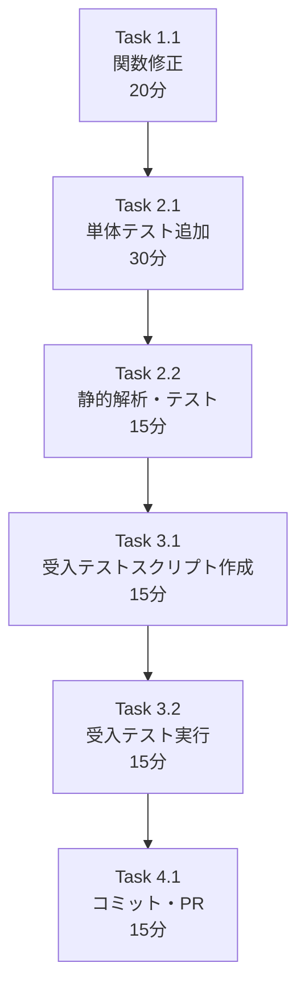

# 作業計画書: Issue #312

## Issue概要の確認

```markdown
## Issue: fix(jobqueue): interface_validator.pyでプロパティ名 'pattern' を含むスキーマ検証時にTypeError発生
**Issue番号**: #312
**サイズ**: S（Small）
**作業見積**: 2時間
**優先度**: High（Job生成フロー全体に影響）
**依存Issue**: なし
**ラベル**: bug, fix
```

### 問題概要

AIが生成したJSON Schemaに`pattern`という名前のプロパティが含まれている場合、`interface_validator.py`の`_validate_regex_patterns_in_schema`関数で`TypeError: unhashable type: 'dict'`が発生し、500 Internal Server Errorとなる。

### 根本原因

`pattern`キーワード（JSON Schemaの正規表現指定）とプロパティ名としての`pattern`を区別していない。

---

## 詳細タスク分解

### Phase 1: 実装タスク

- [ ] **Task 1.1**: `_validate_regex_patterns_in_schema`関数の修正
  - 所要時間: 20分
  - 成果物: `jobqueue/app/services/interface_validator.py`
  - 依存: なし
  - 変更内容:
    - `isinstance(pattern, str)`チェック追加
    - docstring更新
    - DEBUGログ追加（推奨）

### Phase 2: テストタスク（TDD - CI実行可能）

- [ ] **Task 2.1**: 単体テスト追加
  - 所要時間: 30分
  - 成果物: `jobqueue/tests/unit/test_interface_validator.py`
  - カバレッジ目標: 90%以上維持
  - テストケース:
    1. `test_pattern_as_property_name_should_pass`
    2. `test_pattern_as_nested_property_name_should_pass`
    3. `test_valid_regex_pattern_with_type_string_should_pass`
    4. `test_invalid_regex_pattern_should_raise_error`
    5. `test_pattern_property_with_regex_pattern_sibling`

- [ ] **Task 2.2**: 静的解析・テスト実行
  - 所要時間: 15分
  - コマンド:
    ```bash
    cd jobqueue
    uv run ruff check .
    uv run mypy .
    uv run pytest tests/unit/test_interface_validator*.py -v
    ```

### Phase 3: 受入テストタスク（L3ローカル受入テスト）【必須】

- [ ] **Task 3.1**: 受入テストスクリプト作成
  - 所要時間: 15分
  - 成果物: `tests/acceptance/test_issue_312_acceptance.sh`
  - 内容:
    - 自動化された受入テストスクリプト
    - 正常系・異常系の網羅
    - レスポンス検証（jq使用）
    - 自動クリーンアップ

- [ ] **Task 3.2**: 受入テスト実行・エビデンス収集
  - 所要時間: 15分
  - 成果物: エビデンスログ
  - 内容:
    - jobqueue API直接テスト
    - expertAgent経由End-to-Endテスト（オプション）
    - エビデンス保存

### Phase 4: 完了タスク

- [ ] **Task 4.1**: コミット・PR準備
  - 所要時間: 15分
  - 成果物: Git commit, PR description

---

## タスク依存関係



---

## 作業スケジュール

### 単日計画（約2時間）

| 時間 | タスク | 成果物 |
|------|--------|--------|
| 00:00-00:20 | Task 1.1: 関数修正 | `interface_validator.py` |
| 00:20-00:50 | Task 2.1: 単体テスト追加 | `test_interface_validator.py` |
| 00:50-01:05 | Task 2.2: 静的解析・テスト | テスト結果 |
| 01:05-01:20 | Task 3.1: 受入テストスクリプト作成 | `test_issue_312_acceptance.sh` |
| 01:20-01:35 | Task 3.2: 受入テスト実行 | エビデンス |
| 01:35-01:50 | Task 4.1: コミット・PR | PR URL |

**総作業時間**: 約2時間

---

## チェックポイント

| タイミング | 確認事項 | 判断基準 |
|-----------|---------|----------|
| Task 1.1完了時 | コード変更確認 | `isinstance`チェックが追加されている |
| Task 2.1完了時 | テストケース網羅性 | 5件のテストが追加されている |
| Task 2.2完了時 | CI品質基準 | Ruff/MyPyエラーゼロ、pytest全パス |
| Task 3.2完了時 | 受入基準達成 | スクリプトが全パス（exit 0） |

---

## リスクと対策

| リスク | 発生確率 | 影響 | 対策 |
|-------|---------|------|------|
| 既存テストの回帰 | 低 | 修正に1時間追加 | 変更前にテスト実行確認 |
| Docker環境起動失敗 | 低 | L3テスト遅延30分 | ローカル環境で代替実行 |
| 予期しないエッジケース | 低 | 追加テスト30分 | 設計方針に基づく対応 |
| jqコマンド未インストール | 低 | 手動検証に切替 | Homebrewでインストール |

---

## 成果物チェックリスト

### コード
- [ ] `jobqueue/app/services/interface_validator.py`（修正）

### テスト
- [ ] `jobqueue/tests/unit/test_interface_validator.py`（追加テストケース5件）
- [ ] `tests/acceptance/test_issue_312_acceptance.sh`（受入テストスクリプト）

### ドキュメント
- [ ] `dev-reports/fix/issue/312/design-policy.md`（作成済み）
- [ ] `dev-reports/fix/issue/312/architecture-review.md`（作成済み）
- [ ] `dev-reports/fix/issue/312/work-plan.md`（本ファイル）

---

## L3受入テストスクリプト【完全版】

### スクリプト本体: `tests/acceptance/test_issue_312_acceptance.sh`

```bash
#!/bin/bash
# =============================================================================
# Issue #312 Acceptance Test
#
# Tests: interface_validator.py pattern property name fix
# Target: jobqueue API /api/v1/interface-masters
# =============================================================================

set -e

# Configuration
JOBQUEUE_URL="${JOBQUEUE_URL:-http://localhost:8001}"
EXPERTAGENT_URL="${EXPERTAGENT_URL:-http://localhost:8004}"
TIMESTAMP=$(date +%s)
EVIDENCE_DIR="/tmp/issue312_evidence_${TIMESTAMP}"
CREATED_IDS=()

# Colors for output
RED='\033[0;31m'
GREEN='\033[0;32m'
YELLOW='\033[1;33m'
NC='\033[0m' # No Color

# Cleanup function
cleanup() {
    echo -e "\n${YELLOW}🧹 Cleaning up test resources...${NC}"
    for id in "${CREATED_IDS[@]}"; do
        curl -s -X DELETE "${JOBQUEUE_URL}/api/v1/interface-masters/${id}" > /dev/null 2>&1 || true
        echo "  Deleted: ${id}"
    done
    echo "  Evidence saved to: ${EVIDENCE_DIR}"
}
trap cleanup EXIT

# Helper function: Make API request and validate
test_api() {
    local test_name="$1"
    local expected_status="$2"
    local data="$3"
    local should_have_id="$4"

    echo -e "\n[Test] ${test_name}"

    RESPONSE=$(curl -s -X POST "${JOBQUEUE_URL}/api/v1/interface-masters" \
        -H "Content-Type: application/json" \
        -d "${data}" \
        -w "\n%{http_code}")

    HTTP_CODE=$(echo "$RESPONSE" | tail -1)
    BODY=$(echo "$RESPONSE" | sed '$d')

    # Save evidence
    echo "${BODY}" > "${EVIDENCE_DIR}/${test_name// /_}.json"

    if [ "$HTTP_CODE" = "$expected_status" ]; then
        echo -e "${GREEN}✅ PASSED: HTTP ${HTTP_CODE}${NC}"

        # If we expect an ID, extract and save for cleanup
        if [ "$should_have_id" = "true" ] && command -v jq &> /dev/null; then
            ID=$(echo "$BODY" | jq -r '.interface_id // .id // empty')
            if [ -n "$ID" ] && [ "$ID" != "null" ]; then
                CREATED_IDS+=("$ID")
                echo "  Created ID: ${ID}"
            fi
        fi
        return 0
    else
        echo -e "${RED}❌ FAILED: Expected ${expected_status}, got ${HTTP_CODE}${NC}"
        echo "  Response: ${BODY}"
        return 1
    fi
}

# =============================================================================
# Main Test Execution
# =============================================================================

echo "=============================================="
echo "Issue #312 Acceptance Test"
echo "=============================================="
echo "Timestamp: $(date)"
echo "JobQueue URL: ${JOBQUEUE_URL}"
echo "Evidence Dir: ${EVIDENCE_DIR}"
echo "=============================================="

# Create evidence directory
mkdir -p "${EVIDENCE_DIR}"

# -----------------------------------------------------------------------------
# Step 1: Health Check
# -----------------------------------------------------------------------------
echo -e "\n${YELLOW}[Step 1] Health Check${NC}"

if curl -sf "${JOBQUEUE_URL}/health" > /dev/null 2>&1; then
    echo -e "${GREEN}✅ jobqueue: healthy${NC}"
else
    echo -e "${RED}❌ jobqueue: not responding at ${JOBQUEUE_URL}${NC}"
    echo "Please start jobqueue service first: make dev-platform"
    exit 1
fi

# -----------------------------------------------------------------------------
# Step 2: Main Bug Fix Test - Pattern as Property Name
# -----------------------------------------------------------------------------
echo -e "\n${YELLOW}[Step 2] Main Bug Fix: Pattern as Property Name${NC}"
echo "This is the primary test for Issue #312"

test_api "pattern_as_property_name" "201" "{
    \"name\": \"test_pattern_prop_${TIMESTAMP}\",
    \"description\": \"Issue #312 - pattern as property name\",
    \"input_schema\": {
        \"type\": \"object\",
        \"properties\": {
            \"pattern\": {
                \"type\": \"string\",
                \"description\": \"URL pattern for matching\"
            }
        }
    },
    \"output_schema\": {}
}" "true" || exit 1

# -----------------------------------------------------------------------------
# Step 3: Nested Pattern Property
# -----------------------------------------------------------------------------
echo -e "\n${YELLOW}[Step 3] Nested Pattern Property${NC}"

test_api "nested_pattern_property" "201" "{
    \"name\": \"test_nested_pattern_${TIMESTAMP}\",
    \"description\": \"Nested pattern property test\",
    \"input_schema\": {
        \"type\": \"object\",
        \"properties\": {
            \"config\": {
                \"type\": \"object\",
                \"properties\": {
                    \"pattern\": {
                        \"type\": \"string\",
                        \"description\": \"Matching pattern\"
                    }
                }
            }
        }
    },
    \"output_schema\": {}
}" "true" || exit 1

# -----------------------------------------------------------------------------
# Step 4: Valid Regex Pattern (Regression Test)
# -----------------------------------------------------------------------------
echo -e "\n${YELLOW}[Step 4] Valid Regex Pattern (Regression Test)${NC}"

test_api "valid_regex_pattern" "201" "{
    \"name\": \"test_regex_${TIMESTAMP}\",
    \"description\": \"Valid regex pattern test\",
    \"input_schema\": {
        \"type\": \"object\",
        \"properties\": {
            \"url\": {
                \"type\": \"string\",
                \"pattern\": \"^https?://.+\"
            }
        }
    },
    \"output_schema\": {}
}" "true" || exit 1

# -----------------------------------------------------------------------------
# Step 5: Pattern Property WITH Regex Pattern (Complex Case)
# -----------------------------------------------------------------------------
echo -e "\n${YELLOW}[Step 5] Pattern Property with Regex Pattern${NC}"

test_api "pattern_property_with_regex" "201" "{
    \"name\": \"test_complex_${TIMESTAMP}\",
    \"description\": \"Pattern property with regex pattern\",
    \"input_schema\": {
        \"type\": \"object\",
        \"properties\": {
            \"pattern\": {
                \"type\": \"string\",
                \"pattern\": \"^[a-z]+$\",
                \"description\": \"Pattern must be lowercase letters\"
            }
        }
    },
    \"output_schema\": {}
}" "true" || exit 1

# -----------------------------------------------------------------------------
# Step 6: Invalid Regex Pattern (Should Fail with 400)
# -----------------------------------------------------------------------------
echo -e "\n${YELLOW}[Step 6] Invalid Regex Pattern (Expect 400)${NC}"

test_api "invalid_regex_pattern" "400" "{
    \"name\": \"test_invalid_${TIMESTAMP}\",
    \"description\": \"Invalid regex pattern test\",
    \"input_schema\": {
        \"type\": \"object\",
        \"properties\": {
            \"field\": {
                \"type\": \"string\",
                \"pattern\": \"[unclosed\"
            }
        }
    },
    \"output_schema\": {}
}" "false" || exit 1

# -----------------------------------------------------------------------------
# Step 7: (Optional) End-to-End via expertAgent
# -----------------------------------------------------------------------------
echo -e "\n${YELLOW}[Step 7] End-to-End Check (Optional)${NC}"

if curl -sf "${EXPERTAGENT_URL}/health" > /dev/null 2>&1; then
    echo -e "${GREEN}✅ expertAgent: available${NC}"
    echo "  Note: Full E2E test via /v1/job-generator requires LLM API key"
    echo "  Skipping LLM-dependent test in automated mode"
else
    echo -e "${YELLOW}⚠️ expertAgent: not available (skipping E2E test)${NC}"
fi

# -----------------------------------------------------------------------------
# Summary
# -----------------------------------------------------------------------------
echo -e "\n=============================================="
echo -e "${GREEN}All Tests PASSED ✅${NC}"
echo "=============================================="
echo "Evidence saved to: ${EVIDENCE_DIR}"
echo ""
echo "Created resources (will be cleaned up):"
for id in "${CREATED_IDS[@]}"; do
    echo "  - ${id}"
done
echo "=============================================="

exit 0
```

---

## L3受入テスト手動実行コマンド

スクリプトを使わない場合の手動テストコマンド：

### Step 1: サービス起動確認

```bash
# Docker環境起動（Platform層）
make dev-platform

# ヘルスチェック
curl -sf http://localhost:8001/health && echo "✅ jobqueue: healthy"
```

### Step 2: 問題再現確認（修正前→500, 修正後→201）

```bash
# 問題を引き起こすスキーマ（patternプロパティ名を含む）
curl -s -X POST http://localhost:8001/api/v1/interface-masters \
  -H "Content-Type: application/json" \
  -d '{
    "name": "test_pattern_property_'$(date +%s)'",
    "description": "Test schema with pattern property name",
    "input_schema": {
      "type": "object",
      "properties": {
        "pattern": {
          "type": "string",
          "description": "URL pattern for matching"
        }
      }
    },
    "output_schema": {}
  }' \
  -w "\nHTTP Status: %{http_code}\n"

# 修正前の期待結果: HTTP Status: 500
# 修正後の期待結果: HTTP Status: 201
```

### Step 3: レスポンス検証（jq使用）

```bash
# レスポンスを変数に保存
RESPONSE=$(curl -s -X POST http://localhost:8001/api/v1/interface-masters \
  -H "Content-Type: application/json" \
  -d '{
    "name": "test_verify_'$(date +%s)'",
    "input_schema": {"type":"object","properties":{"pattern":{"type":"string"}}},
    "output_schema": {}
  }')

# interface_idの存在確認
echo "$RESPONSE" | jq -e '.interface_id' > /dev/null && echo "✅ interface_id exists" || echo "❌ interface_id missing"

# IDを取得してクリーンアップ
ID=$(echo "$RESPONSE" | jq -r '.interface_id')
echo "Created: $ID"
curl -s -X DELETE "http://localhost:8001/api/v1/interface-masters/${ID}"
```

### Step 4: 異常系テスト（修正後も400であること）

```bash
# 無効な正規表現パターン（エラーになるべき）
curl -s -X POST http://localhost:8001/api/v1/interface-masters \
  -H "Content-Type: application/json" \
  -d '{
    "name": "test_invalid_regex",
    "input_schema": {"type":"object","properties":{"field":{"type":"string","pattern":"[unclosed"}}},
    "output_schema": {}
  }' \
  -w "\nHTTP Status: %{http_code}\n"

# 期待結果: HTTP Status: 400
```

---

## Definition of Done

Issue完了条件：

### 必須
- [ ] `_validate_regex_patterns_in_schema`関数に`isinstance(pattern, str)`チェック追加
- [ ] 単体テスト5件追加・全パス
- [ ] 静的解析エラーゼロ（Ruff, MyPy）
- [ ] 単体テストカバレッジ90%以上維持
- [ ] **受入テストスクリプト作成**: `tests/acceptance/test_issue_312_acceptance.sh`
- [ ] **L3受入テスト全パス**: スクリプト実行でexit 0

### 推奨
- [ ] DEBUGログ追加（非文字列patternスキップ時）
- [ ] コード簡潔化（`if isinstance(pattern, str):` 形式）

### 完了確認コマンド

```bash
# 1. 単体テスト
cd jobqueue && uv run pytest tests/unit/test_interface_validator*.py -v

# 2. 静的解析
cd jobqueue && uv run ruff check . && uv run mypy .

# 3. カバレッジ確認
cd jobqueue && uv run pytest tests/unit/ --cov=app --cov-report=term-missing | grep -E "TOTAL|interface_validator"

# 4. L3受入テスト（スクリプト実行）
chmod +x tests/acceptance/test_issue_312_acceptance.sh
./tests/acceptance/test_issue_312_acceptance.sh
```

---

## 次のアクション

作業計画承認後：

1. **現在のブランチ確認**: `develop`ブランチで作業
2. **Task 1.1開始**: `interface_validator.py`修正
3. **Task 2.1-2.2実行**: テスト追加・静的解析
4. **Task 3.1実行**: 受入テストスクリプト作成
5. **Task 3.2実行**: 受入テスト実行・エビデンス収集
6. **Task 4.1実行**: コミット・PR作成
7. **進捗報告**: `/progress-report`で報告

---

## 参照ドキュメント

| ドキュメント | 状態 |
|-------------|------|
| [Issue #312](https://github.com/Kewton/MySwiftAgent/issues/312) | 作成済み |
| [design-policy.md](./design-policy.md) | ✅ 作成済み |
| [architecture-review.md](./architecture-review.md) | ✅ 承認済み |
| 本作業計画書 | ✅ 改善済み |

---

**作成日**: 2025-12-26
**更新日**: 2025-12-26
**対象Issue**: #312
**作成者**: Claude Code
**見積時間**: 2時間
