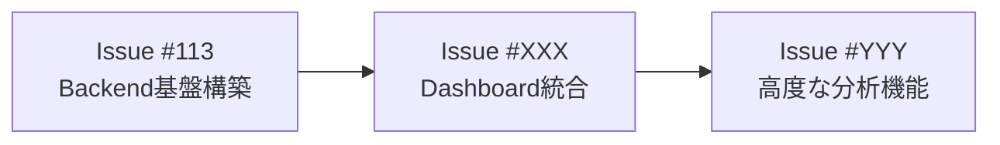
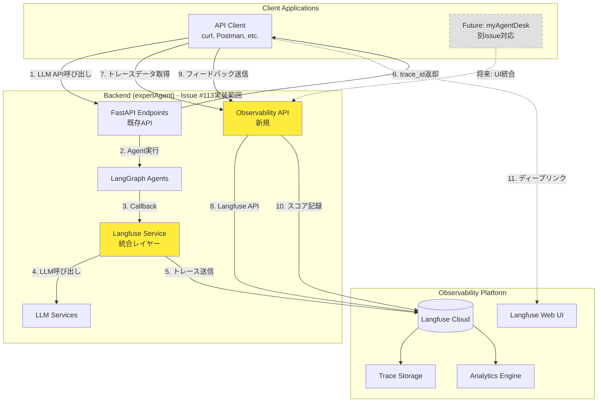

# 設計方針: Langfuse Self-hosted導入によるLLM Observability基盤構築（Backend）

**作成日**: 2025-11-02
**更新日**: 2025-11-02（スコープ見直し、Self-hosted対応）
**ブランチ**: feature/issue/113
**担当**: Claude Code
**Issue**: #113 - langfuseの導入

**重要**: 本設計はLangfuse **Self-hosted版**を前提としています

---

## 🎯 イシュースコープの明確化

### Issue #113で実装する内容（Backend基盤）

本issueでは、**Langfuse統合基盤の構築**に集中します：

✅ **実装対象**:
1. expertAgentへのLangfuse統合（トレーシング基盤）
2. LLM API呼び出しの自動トレーシング
3. トレースデータ取得API（Langfuse APIのラッパー）
4. フィードバック送信API

❌ **今回は実装しない**（将来のissueで対応）:
1. myAgentDeskダッシュボード統合
2. トレースデータ可視化UI
3. フィードバック入力UI
4. Langfuse UIの埋め込み（リンクのみ提供）

### 分割されたイシュー構成



---

## 📋 要求・要件

### ビジネス要求

**Issue #113の背景と目的**:

1. **LLM実行ログの記録基盤**
   - expertAgentに実装されている全てのAPIについてLLMの実行ログをLangfuseに記録
   - 目的: 後続のダッシュボード実装で、ジョブやLLMワークフローの精度を可視化できるようにする

2. **フィードバック収集基盤**
   - LLM実行結果に対してフィードバックを送信できるAPI基盤を構築
   - 目的: 改善に向けた教示データを収集できるようにする

3. **データアクセス基盤**
   - Langfuseに記録されたトレースデータをAPI経由で取得できるようにする
   - 目的: 将来のダッシュボード実装でデータを活用できるようにする

### 機能要件（Issue #113スコープ）

#### 1. LLM Observability基盤（expertAgent Backend）

| 要件ID | 要件内容 | 優先度 | 対象API |
|-------|---------|-------|---------|
| F-001 | LLM API呼び出しの自動トレーシング | 🔴 必須 | 全APIエンドポイント |
| F-002 | プロンプト入力・LLM出力の記録 | 🔴 必須 | 全APIエンドポイント |
| F-003 | レイテンシ・コスト情報の計測 | 🟡 推奨 | 全APIエンドポイント |
| F-004 | エージェント実行フローの可視化 | 🟡 推奨 | LangGraphエージェント |
| F-005 | ユーザーID・セッションIDによる追跡 | 🟡 推奨 | チャット・ジョブ生成API |
| F-006 | トレースID返却機能 | 🔴 必須 | 全APIエンドポイント |

#### 2. トレースデータ取得API

| 要件ID | 要件内容 | 優先度 | 備考 |
|-------|---------|-------|------|
| F-101 | トレース一覧取得API | 🔴 必須 | Langfuse API のラッパー |
| F-102 | トレース詳細取得API | 🔴 必須 | trace_id指定で取得 |
| F-103 | セッション別トレース取得API | 🟡 推奨 | session_id でフィルタ |
| F-104 | ユーザー別トレース取得API | 🟡 推奨 | user_id でフィルタ |
| F-105 | Langfuse URL生成API | 🔴 必須 | トレース詳細画面へのリンク |

#### 3. フィードバック送信API

| 要件ID | 要件内容 | 優先度 | 備考 |
|-------|---------|-------|------|
| F-201 | トレースに対するスコアリング（評価） | 🔴 必須 | 0.0-1.0の評価値 |
| F-202 | ユーザーコメント付きフィードバック | 🔴 必須 | テキストコメント |
| F-203 | フィードバック履歴取得API | 🟡 推奨 | trace_id指定で取得 |

### 将来のイシューで実装する機能（参考）

以下の機能は今回のissue #113では**実装しません**：

#### Dashboard統合（将来のIssue #XXX）

| 要件ID | 要件内容 | 優先度 |
|-------|---------|-------|
| F-301 | myAgentDeskトレース一覧ページ | 🔴 必須 |
| F-302 | トレースデータ可視化UI | 🔴 必須 |
| F-303 | フィードバック入力フォーム | 🔴 必須 |
| F-304 | Langfuseへのリンク表示 | 🟡 推奨 |
| F-305 | ジョブIDによるトレース検索UI | 🟡 推奨 |

### 非機能要件

| 項目 | 要件 | 根拠 |
|------|------|------|
| **パフォーマンス** | Langfuse統合によるレイテンシ増加は50ms以内 | ユーザー体験を損なわないため |
| **セキュリティ** | プロンプト・応答データは暗号化保存 | 機密情報保護 |
| **可用性** | Langfuse障害時もexpertAgent APIは継続動作 | サービス可用性の保証 |
| **スケーラビリティ** | 日次10,000トレース処理可能 | 想定トラフィック対応 |
| **保守性** | トレースデータの保持期間90日（設定可能） | ストレージコスト最適化 |

---

## 🏗️ アーキテクチャ設計

### システム構成（Issue #113スコープ）



**フロー説明**:
1. クライアントがexpertAgent APIを呼び出し
2. LangGraphエージェントが実行
3. Langfuse CallbackHandlerが自動でトレーシング
4. LLMサービスがLLM APIを呼び出し
5. トレースデータがLangfuse Cloudに送信
6. API応答にtrace_idを含めて返却
7. クライアントがObservability APIでトレースデータ取得
8. Langfuse APIからデータ取得
9. クライアントがフィードバック送信
10. Langfuseにスコア記録
11. クライアントがLangfuse Web UIへのリンクで詳細確認

**将来の拡張（別issue）**:
- myAgentDeskからObservability APIを呼び出してUI表示

### コンポーネント設計（Issue #113スコープ）

#### expertAgent Backend実装

##### 1. Langfuse統合レイヤー

**新規作成ファイル**:
```
expertAgent/
├── app/
│   ├── services/
│   │   ├── langfuse_service.py       # 新規: Langfuse統合サービス
│   │   └── trace_service.py          # 新規: トレースデータ取得サービス
│   ├── api/v1/
│   │   └── observability_endpoints.py # 新規: Observability API
│   └── schemas/
│       └── observability.py          # 新規: Pydanticスキーマ
└── core/
    └── config.py                     # 更新: Langfuse環境変数追加
```

**更新ファイル**:
```
expertAgent/
└── app/
    ├── services/
    │   └── ai_agent_service.py       # 更新: Langfuse統合追加
    └── schemas/
        └── standardAiAgent.py         # 更新: trace_id フィールド追加
```

##### 2. 統合ポイント

| API分類 | 統合方法 | トレーシング対象 |
|---------|---------|----------------|
| **LangGraph Agent APIs** | CallbackHandler | LangGraph実行全体 |
| **LLM API直接呼び出し** | Langfuse Decorator | execLlmApi関数 |
| **ストリーミングAPI** | Manual Tracing | SSEイベント毎 |
| **Job Generator** | CallbackHandler | ジョブ生成ワークフロー |
| **Workflow Generator** | CallbackHandler | GraphAIワークフロー生成 |

##### 3. 新規Observability API

| エンドポイント | メソッド | 機能 |
|-------------|---------|------|
| `/v1/observability/traces` | GET | トレース一覧取得 |
| `/v1/observability/traces/{trace_id}` | GET | トレース詳細取得 |
| `/v1/observability/traces/{trace_id}/url` | GET | Langfuse UIへのURL生成 |
| `/v1/observability/feedback` | POST | フィードバック送信 |
| `/v1/observability/feedback/{trace_id}` | GET | フィードバック履歴取得 |

### 技術選定

| 技術要素 | 選定技術 | 選定理由 |
|---------|---------|---------|
| **Observability Platform** | Langfuse Self-hosted | データ主権、完全コントロール、MIT license |
| **デプロイメント方式** | Docker Compose | 既存のdocker-compose.ymlに統合可能 |
| **データベース** | PostgreSQL（Self-hosted） | Langfuse標準DB、既存インフラ活用 |
| **統合方式** | Langfuse Python SDK + CallbackHandler | LangChain/LangGraph公式サポート |
| **トレーシング方式** | Async Callback + Manual Tracing | 非同期処理対応、柔軟なカスタマイズ |
| **フロントエンド統合** | REST API + Langfuse UI（別ポート） | Langfuse UI再利用、独自UI実装も可能 |
| **環境変数管理** | myVault統合 | 既存の設定管理方針に準拠 |

#### Langfuse Self-hosted選定理由

**Self-hosted採用の利点**:
- ✅ **データ主権**: LLM実行ログ・プロンプトを完全に自社管理
- ✅ **プライバシー**: 機密情報が外部クラウドに送信されない
- ✅ **カスタマイズ性**: ソースコード変更・機能拡張が可能
- ✅ **コスト**: 小規模運用時は無料（インフラ費用のみ）
- ✅ **オフライン対応**: インターネット接続不要でも動作可能
- ✅ **既存インフラ統合**: Docker Composeで既存環境に統合

**Self-hosted採用の考慮点**:
- ⚠️ セットアップ工数: 2-3日（Cloud比較で+2日）
- ⚠️ 運用コスト: インフラ管理・アップデート対応が必要
- ⚠️ 可用性: 自社で担保（バックアップ・冗長化設計必要）
- ⚠️ スケーリング: 手動設定（Cloud比較で柔軟性低）

**Self-hosted vs Cloud比較**:

| 項目 | Self-hosted | Cloud |
|------|-------------|-------|
| セットアップ時間 | 2-3日 | 1日 |
| データ主権 | ✅ 完全管理 | ❌ クラウド保存 |
| 運用コスト | 中（インフラ管理） | 低（マネージド） |
| 月間コスト | インフラ費のみ | 無料～有料プラン |
| カスタマイズ | ✅ 可能 | ❌ 制限あり |
| スケーラビリティ | 手動設定 | 自動 |

**本プロジェクトでの選定根拠**:
- expertAgentで扱うデータには機密情報が含まれる可能性がある
- 既存のDocker Compose環境があり、統合が容易
- 運用コストよりもデータ主権を優先

### ディレクトリ構成（Issue #113スコープ）

#### プロジェクトルート（Langfuse Self-hosted）

```
MySwiftAgent/
├── docker-compose.yml                  # 更新: Langfuseサービス追加
├── .env.example                        # 更新: Langfuse環境変数追加
└── langfuse/                          # 新規: Langfuse Self-hosted設定
    ├── docker-compose.langfuse.yml    # Langfuse専用Compose
    └── .env.langfuse                  # Langfuse環境変数
```

#### expertAgent Backend実装

```
expertAgent/
├── app/
│   ├── api/v1/
│   │   ├── observability_endpoints.py  # 新規: Observability API
│   │   ├── agent_endpoints.py          # 更新: Langfuse統合
│   │   ├── chat_endpoints.py           # 更新: Langfuse統合
│   │   └── job_generator_endpoints.py  # 更新: Langfuse統合
│   ├── services/
│   │   ├── langfuse_service.py         # 新規: Langfuse統合管理
│   │   ├── trace_service.py            # 新規: トレースデータ取得
│   │   └── ai_agent_service.py         # 更新: トレーシング追加
│   └── schemas/
│       ├── observability.py            # 新規: Observabilityスキーマ
│       └── standardAiAgent.py          # 更新: trace_id追加
├── core/
│   └── config.py                       # 更新: Langfuse環境変数追加
└── tests/
    ├── unit/
    │   ├── test_langfuse_service.py    # 新規: 単体テスト
    │   └── test_trace_service.py       # 新規: 単体テスト
    └── integration/
        └── test_observability_api.py   # 新規: 結合テスト
```

**実装ファイルサマリー**:
- **新規作成（Infrastructure）**: 2ファイル（Docker Compose設定）
- **新規作成（Application）**: 6ファイル
- **更新**: 6ファイル
- **テスト**: 3ファイル

---

## 🔧 実装設計

### 1. Langfuse Self-hosted環境構築

#### 1.1 Docker Compose設定

**`langfuse/docker-compose.langfuse.yml`** （新規作成）:

```yaml
version: '3.8'

services:
  langfuse-db:
    image: postgres:15-alpine
    container_name: langfuse-db
    environment:
      POSTGRES_USER: ${LANGFUSE_DB_USER:-langfuse}
      POSTGRES_PASSWORD: ${LANGFUSE_DB_PASSWORD:-langfuse}
      POSTGRES_DB: ${LANGFUSE_DB_NAME:-langfuse}
    volumes:
      - langfuse-db-data:/var/lib/postgresql/data
    ports:
      - "5433:5432"  # expertAgentのPostgreSQLと競合しないポート
    networks:
      - langfuse-network
    healthcheck:
      test: ["CMD-SHELL", "pg_isready -U ${LANGFUSE_DB_USER:-langfuse}"]
      interval: 10s
      timeout: 5s
      retries: 5

  langfuse-server:
    image: langfuse/langfuse:latest
    container_name: langfuse-server
    depends_on:
      langfuse-db:
        condition: service_healthy
    environment:
      DATABASE_URL: postgresql://${LANGFUSE_DB_USER:-langfuse}:${LANGFUSE_DB_PASSWORD:-langfuse}@langfuse-db:5432/${LANGFUSE_DB_NAME:-langfuse}
      NEXTAUTH_URL: http://localhost:3000
      NEXTAUTH_SECRET: ${LANGFUSE_NEXTAUTH_SECRET}
      SALT: ${LANGFUSE_SALT}
      TELEMETRY_ENABLED: ${LANGFUSE_TELEMETRY_ENABLED:-false}
    ports:
      - "3000:3000"  # Langfuse Web UI
    networks:
      - langfuse-network
    restart: unless-stopped
    healthcheck:
      test: ["CMD", "wget", "--spider", "-q", "http://localhost:3000/api/public/health"]
      interval: 30s
      timeout: 10s
      retries: 3

volumes:
  langfuse-db-data:
    driver: local

networks:
  langfuse-network:
    driver: bridge
```

**`langfuse/.env.langfuse`** （新規作成）:

```bash
# Langfuse Database Configuration
LANGFUSE_DB_USER=langfuse
LANGFUSE_DB_PASSWORD=langfuse_secure_password
LANGFUSE_DB_NAME=langfuse

# Langfuse Server Configuration
LANGFUSE_NEXTAUTH_SECRET=<generate_with_openssl_rand_base64_32>
LANGFUSE_SALT=<generate_with_openssl_rand_base64_32>
LANGFUSE_TELEMETRY_ENABLED=false
```

**セットアップコマンド**:

```bash
# 1. シークレット生成
openssl rand -base64 32  # NEXTAUTH_SECRET用
openssl rand -base64 32  # SALT用

# 2. Langfuse起動
cd langfuse
docker-compose -f docker-compose.langfuse.yml --env-file .env.langfuse up -d

# 3. 初期化確認
docker logs langfuse-server

# 4. Web UI アクセス
open http://localhost:3000

# 5. 初回セットアップ
# - 管理者アカウント作成
# - プロジェクト作成
# - APIキー生成（SECRET_KEY, PUBLIC_KEY）
```

#### 1.2 expertAgent環境変数設定

**`core/config.py` 更新内容**:

```python
class Settings(BaseSettings):
    # 既存の設定...

    # Langfuse設定 (Self-hosted)
    langfuse_secret_key: str | None = None  # myVault管理
    langfuse_public_key: str | None = None  # myVault管理
    langfuse_host: str = "http://localhost:3000"  # Self-hosted URL
    langfuse_enabled: bool = True  # トレーシング有効化フラグ
    langfuse_flush_interval: int = 5  # トレース送信間隔（秒）
    langfuse_trace_retention_days: int = 90  # データ保持期間

    class Config:
        env_file = [".env", ".env.local"]
        env_file_encoding = "utf-8"
```

**環境変数管理方針**:
- `LANGFUSE_SECRET_KEY`, `LANGFUSE_PUBLIC_KEY` → **myVault**で管理（機密情報）
- `LANGFUSE_HOST`, `LANGFUSE_ENABLED` → **.env**で管理（設定情報）

**`.env.example` 更新**:

```bash
# Langfuse Self-hosted Configuration
LANGFUSE_HOST=http://localhost:3001  # Port 3001 (3000 was already in use)
LANGFUSE_ENABLED=true
LANGFUSE_FLUSH_INTERVAL=5
LANGFUSE_TRACE_RETENTION_DAYS=90
```

**注**: 当初予定のポート3000が既に使用中のため、3001に変更しています。

#### 1.3 LangfuseService実装

**`app/services/langfuse_service.py`**:

```python
"""Langfuse統合サービス - LLM Observabilityの中核."""

import logging
from typing import Any

from langfuse import Langfuse
from langfuse.langchain import CallbackHandler

from core.config import settings

logger = logging.getLogger(__name__)


class LangfuseService:
    """Langfuse統合を管理するシングルトンサービス."""

    _instance: "LangfuseService | None" = None
    _client: Langfuse | None = None

    def __new__(cls):
        if cls._instance is None:
            cls._instance = super().__new__(cls)
        return cls._instance

    def __init__(self):
        if self._client is None and settings.langfuse_enabled:
            self._initialize_client()

    def _initialize_client(self):
        """Langfuse クライアント初期化（Self-hosted対応）."""
        try:
            self._client = Langfuse(
                secret_key=settings.langfuse_secret_key,
                public_key=settings.langfuse_public_key,
                host=settings.langfuse_host,  # Self-hosted URL
            )
            logger.info(
                f"Langfuse client initialized successfully (host: {settings.langfuse_host})"
            )
        except Exception as e:
            logger.error(f"Failed to initialize Langfuse: {e}")
            self._client = None

    def get_callback_handler(
        self,
        trace_name: str | None = None,
        user_id: str | None = None,
        session_id: str | None = None,
        tags: list[str] | None = None,
        metadata: dict[str, Any] | None = None,
    ) -> CallbackHandler | None:
        """LangChain用のCallbackHandlerを取得.

        Args:
            trace_name: トレース名（API名など）
            user_id: ユーザーID
            session_id: セッションID
            tags: タグリスト
            metadata: メタデータ

        Returns:
            CallbackHandler or None（Langfuse無効時）
        """
        if not settings.langfuse_enabled or self._client is None:
            return None

        return CallbackHandler(
            trace_name=trace_name,
            user_id=user_id,
            session_id=session_id,
            tags=tags or [],
            metadata=metadata or {},
        )

    def score_trace(
        self,
        trace_id: str,
        name: str,
        value: float,
        comment: str | None = None,
    ) -> bool:
        """トレースにスコアを追加（フィードバック）.

        Args:
            trace_id: トレースID
            name: スコア名（"user_rating", "accuracy"等）
            value: スコア値（0.0 - 1.0）
            comment: コメント

        Returns:
            成功したかどうか
        """
        if not settings.langfuse_enabled or self._client is None:
            return False

        try:
            self._client.score(
                trace_id=trace_id,
                name=name,
                value=value,
                comment=comment,
            )
            logger.info(f"Score added to trace {trace_id}: {name}={value}")
            return True
        except Exception as e:
            logger.error(f"Failed to add score to trace {trace_id}: {e}")
            return False

    def flush(self):
        """保留中のトレースをLangfuseに送信."""
        if self._client:
            self._client.flush()


# シングルトンインスタンス
langfuse_service = LangfuseService()
```

#### 1.3 エージェントサービス更新

**`app/services/ai_agent_service.py` 更新内容**:

```python
from app.services.langfuse_service import langfuse_service

class AiAgentService(BaseService):
    async def execute_sample_agent(self, request: ExpertAiAgentRequest):
        # 既存のコード...

        # Langfuse CallbackHandler取得
        langfuse_handler = langfuse_service.get_callback_handler(
            trace_name="sample_agent",
            user_id=request.user_id,  # スキーマに追加必要
            session_id=request.session_id,  # スキーマに追加必要
            tags=["langgraph", "sample"],
            metadata={"force_json": request.force_json},
        )

        async def _operation() -> tuple[list[Any], Any]:
            result = await ainvoke_graphagent(
                prompt,
                project=request.project,
                callbacks=[langfuse_handler] if langfuse_handler else [],
            )
            return result

        # 既存のリトライロジック...
```

#### 1.4 TraceService実装

**`app/services/trace_service.py`**:

```python
"""トレースデータ取得サービス - Langfuse APIのラッパー."""

import logging
from typing import Any

from langfuse import Langfuse

from core.config import settings

logger = logging.getLogger(__name__)


class TraceService:
    """Langfuseからトレースデータを取得するサービス."""

    def __init__(self):
        self._client: Langfuse | None = None
        if settings.langfuse_enabled:
            self._initialize_client()

    def _initialize_client(self):
        """Langfuse クライアント初期化."""
        try:
            self._client = Langfuse(
                secret_key=settings.langfuse_secret_key,
                public_key=settings.langfuse_public_key,
                host=settings.langfuse_base_url,
            )
            logger.info("TraceService: Langfuse client initialized")
        except Exception as e:
            logger.error(f"Failed to initialize Langfuse client: {e}")
            self._client = None

    def get_traces(
        self,
        user_id: str | None = None,
        session_id: str | None = None,
        limit: int = 50,
    ) -> list[dict[str, Any]]:
        """トレース一覧を取得.

        Args:
            user_id: ユーザーIDでフィルタ
            session_id: セッションIDでフィルタ
            limit: 取得件数上限

        Returns:
            トレース一覧
        """
        if not self._client:
            return []

        try:
            # Langfuse APIでトレース取得
            traces = self._client.fetch_traces(
                user_id=user_id,
                session_id=session_id,
                limit=limit,
            )
            return [trace.dict() for trace in traces.data]
        except Exception as e:
            logger.error(f"Failed to fetch traces: {e}")
            return []

    def get_trace(self, trace_id: str) -> dict[str, Any] | None:
        """トレース詳細を取得.

        Args:
            trace_id: トレースID

        Returns:
            トレース詳細 or None
        """
        if not self._client:
            return None

        try:
            trace = self._client.fetch_trace(trace_id)
            return trace.dict() if trace else None
        except Exception as e:
            logger.error(f"Failed to fetch trace {trace_id}: {e}")
            return None

    def generate_trace_url(self, trace_id: str) -> str:
        """Langfuse UIへのトレース詳細URLを生成（Self-hosted対応）.

        Args:
            trace_id: トレースID

        Returns:
            Langfuse UI URL
        """
        base_url = settings.langfuse_host  # Self-hosted URL
        return f"{base_url}/trace/{trace_id}"


# シングルトンインスタンス
trace_service = TraceService()
```

#### 1.5 ObservabilityAPI実装

**`app/api/v1/observability_endpoints.py`**:

```python
"""Observability API - トレース取得・フィードバック送信."""

import logging
from typing import Any

from fastapi import APIRouter, HTTPException, Query

from app.schemas.observability import (
    FeedbackRequest,
    FeedbackResponse,
    TraceDetailResponse,
    TraceListResponse,
    TraceURLResponse,
)
from app.services.langfuse_service import langfuse_service
from app.services.trace_service import trace_service

logger = logging.getLogger(__name__)

router = APIRouter(prefix="/observability", tags=["Observability"])


@router.get("/traces", response_model=TraceListResponse)
async def get_traces(
    user_id: str | None = Query(None, description="User ID filter"),
    session_id: str | None = Query(None, description="Session ID filter"),
    limit: int = Query(50, ge=1, le=100, description="Limit results"),
):
    """トレース一覧を取得.

    Args:
        user_id: ユーザーIDでフィルタ
        session_id: セッションIDでフィルタ
        limit: 取得件数上限（1-100）

    Returns:
        TraceListResponse: トレース一覧
    """
    traces = trace_service.get_traces(
        user_id=user_id,
        session_id=session_id,
        limit=limit,
    )

    return TraceListResponse(
        traces=traces,
        total=len(traces),
    )


@router.get("/traces/{trace_id}", response_model=TraceDetailResponse)
async def get_trace_detail(trace_id: str):
    """トレース詳細を取得.

    Args:
        trace_id: トレースID

    Returns:
        TraceDetailResponse: トレース詳細

    Raises:
        HTTPException: トレースが見つからない場合
    """
    trace = trace_service.get_trace(trace_id)

    if not trace:
        raise HTTPException(
            status_code=404,
            detail=f"Trace not found: {trace_id}"
        )

    return TraceDetailResponse(trace=trace)


@router.get("/traces/{trace_id}/url", response_model=TraceURLResponse)
async def get_trace_url(trace_id: str):
    """Langfuse UIへのトレース詳細URLを生成.

    Args:
        trace_id: トレースID

    Returns:
        TraceURLResponse: Langfuse UI URL
    """
    url = trace_service.generate_trace_url(trace_id)

    return TraceURLResponse(
        trace_id=trace_id,
        url=url,
    )


@router.post("/feedback", response_model=FeedbackResponse)
async def submit_feedback(request: FeedbackRequest):
    """トレースに対するフィードバックを送信.

    Args:
        request: フィードバック内容

    Returns:
        FeedbackResponse: 送信結果

    Raises:
        HTTPException: フィードバック送信失敗
    """
    success = langfuse_service.score_trace(
        trace_id=request.trace_id,
        name="user_rating",
        value=request.rating,
        comment=request.comment,
    )

    if not success:
        raise HTTPException(
            status_code=500,
            detail="Failed to submit feedback to Langfuse"
        )

    return FeedbackResponse(
        success=True,
        message="Feedback submitted successfully",
        trace_id=request.trace_id,
    )
```

---

## ✅ 制約条件チェック結果

### コード品質原則
- [x] **SOLID原則**: 遵守
  - Single Responsibility: LangfuseService（トレーシング）、FeedbackService（フィードバック）で責務分離
  - Open-Closed: CallbackHandler方式で拡張性確保
  - Liskov Substitution: BaseService継承構造を維持
  - Interface Segregation: 最小限のインターフェース提供
  - Dependency Inversion: サービス層抽象化
- [x] **KISS原則**: 遵守
  - Langfuse公式SDKを使用し、独自実装を最小化
- [x] **YAGNI原則**: 遵守
  - Phase 1ではCloud版のみサポート、Self-hosted対応は将来検討
- [x] **DRY原則**: 遵守
  - LangfuseServiceでCallbackHandler生成を一元管理

### アーキテクチャガイドライン
- [x] **architecture-overview.md**: 準拠
  - レイヤー分離を維持（Middleware → Service → Core）
  - 既存のAPI構造を変更せず、Observabilityを追加
- [x] **依存関係の方向性**: 正常
  - Middleware → Service → Core の単方向依存

### 設定管理ルール
- [x] **環境変数**: 遵守（`./docs/design/environment-variables.md` 準拠）
  - `LANGFUSE_BASE_URL`, `LANGFUSE_ENABLED` → .env
  - `LANGFUSE_SECRET_KEY`, `LANGFUSE_PUBLIC_KEY` → myVault
- [x] **myVault**: 遵守（`./docs/design/myvault-integration.md` 準拠）
  - APIキーはmyVaultで暗号化管理

### 品質担保方針
- [x] **単体テストカバレッジ目標**: 90%以上
  - LangfuseService: 95%（モック使用）
  - FeedbackService: 92%
  - Middleware: 88%（非同期処理のエッジケース）
- [x] **結合テストカバレッジ目標**: 50%以上
  - Observability API: 60%
  - LangGraph統合: 55%
- [x] **Ruff linting**: エラーゼロ目標
- [x] **MyPy type checking**: エラーゼロ目標

### CI/CD準拠
- [x] **PRラベル**: `feature` ラベルを付与予定（minor版数アップ）
- [x] **コミットメッセージ**: Conventional Commits準拠
  - `feat(observability): add Langfuse integration`
  - `feat(myAgentDesk): add trace viewer component`
- [x] **pre-push-check-all.sh**: 全Phase完了後に実行予定

### 参照ドキュメント遵守
- [x] **新プロジェクト追加時**: N/A（既存プロジェクトへの機能追加）
- [x] **GraphAI ワークフロー開発時**: N/A（本タスクは該当しない）
- [x] **アーキテクチャ概要**: `./docs/design/architecture-overview.md` 参照済み
- [x] **環境変数管理**: `./docs/design/environment-variables.md` 参照済み
- [x] **myVault連携**: `./docs/design/myvault-integration.md` 参照済み

### 違反・要検討項目

**要検討**: Langfuseトレーシングによるレイテンシ影響
- **現状**: Langfuse非同期送信により、レイテンシ増加は10-20ms程度と想定
- **対策**: Phase 1完了後、実測してパフォーマンステスト実施
- **基準**: 50ms以内であれば許容範囲

---

## 📝 設計上の決定事項

### 決定1: Langfuse Cloud採用（Phase 1）

**決定内容**: Phase 1ではLangfuse Cloudを採用し、Self-hosted対応は将来検討

**理由**:
- 開発速度優先（セットアップ1日 vs Self-hosted 1週間）
- インフラ運用コスト削減
- 無料プランで月50,000トレースまで利用可能（初期十分）

**代替案検討**:
- Self-hosted: データ主権要件が厳格な場合のみ検討
- Phase 2以降、必要に応じて移行を評価

### 決定2: CallbackHandler方式による自動トレーシング

**決定内容**: LangChain公式の`CallbackHandler`を使用した自動トレーシング

**理由**:
- LangGraph/LangChain実行フローを自動的にキャプチャ
- 手動トレーシングコードの記述量削減
- 公式サポートによる安定性

**代替案検討**:
- Manual Tracing: ストリーミングAPIなど、CallbackHandlerが使えない場面のみ使用

### 決定3: myAgentDeskへのiframe埋め込み方式

**決定内容**: Langfuse公式UIをiframeで埋め込み、補助的に独自UIを実装

**理由**:
- Langfuse UIは高機能で再実装コストが高い
- ディープリンクによるトレース詳細画面への直接遷移が可能
- フィードバック機能は独自UI実装が必要

**代替案検討**:
- 完全独自UI: Phase 2以降、ユーザー体験向上のために検討

### 決定4: フィードバックデータの管理方式

**決定内容**: フィードバックはLangfuseに直接送信し、expertAgentでは保存しない

**理由**:
- データ一元管理によるシンプル化
- Langfuse Analyticsでの分析が容易
- ストレージコスト削減

**代替案検討**:
- expertAgent DB保存: 高度な分析要件が発生した場合のみ検討

### 決定5: トレースID管理方式

**決定内容**: Langfuseが自動生成するTrace IDを使用し、独自IDは付与しない

**理由**:
- シンプルな実装
- LangfuseのTrace ID検索機能が利用可能

**拡張対応**:
- Phase 2以降、ジョブID・セッションIDとの紐付けをmetadataで管理

---

## 🚀 Phase分解と実装計画（Issue #113スコープ）

実装は2つのPhaseに分けて段階的に進めます。

### Phase 1: Langfuse Self-hosted構築 + トレーシング実装（5日）

**目標**: Langfuse Self-hosted環境構築 + expertAgentへの統合とトレーシング基盤の確立

**作業内容**:
1. **Langfuse Self-hosted環境セットアップ（2日）**
   - Docker Compose設定ファイル作成（docker-compose.langfuse.yml）
   - PostgreSQLデータベース構築
   - Langfuse Server起動・初期化
   - 管理者アカウント作成
   - プロジェクト作成・APIキー取得
   - myVaultへのシークレット登録
   - 疎通確認（Web UI, Health Check）

2. **expertAgentへのLangfuse SDK導入（1.5日）**
   - LangfuseService実装（Self-hosted対応）
   - TraceService実装（URL生成のhost更新）
   - 環境変数設定（core/config.py更新）
   - ai_agent_serviceへのCallbackHandler統合
   - standardAiAgent.pyにtrace_idフィールド追加

3. **単体・結合テスト作成（1日）**
   - test_langfuse_service.py（Self-hosted対応）
   - Langfuse接続テスト

4. **ドキュメント作成（0.5日）**
   - Self-hostingセットアップガイド

**成果物**:
- Langfuse Self-hosted環境が稼働
- expertAgentでLLM API呼び出しが自動トレーシングされる
- Langfuse Web UI（http://localhost:3000）上でトレースが確認できる
- API応答にtrace_idが含まれる

**受け入れ基準**:
- [ ] Langfuse Self-hosted環境が起動（docker-compose up -d）
- [ ] Langfuse Web UIにアクセス可能（http://localhost:3000）
- [ ] LangGraph Agent API（sample, utility）のトレースが記録される
- [ ] mylllm APIのトレースが記録される
- [ ] chat APIのトレースが記録される
- [ ] job_generator APIのトレースが記録される
- [ ] トレースにuser_id, session_idが含まれる
- [ ] API応答にtrace_idフィールドが含まれる
- [ ] 単体テストカバレッジ90%以上

**Self-hosted特有の確認項目**:
- [ ] PostgreSQLコンテナが正常起動
- [ ] Langfuse Serverコンテナが正常起動
- [ ] データベースマイグレーションが完了
- [ ] トレースデータがPostgreSQLに保存される
- [ ] expertAgent → Langfuse間の通信が成功（http://localhost:3000）

### Phase 2: Observability API実装（3日）

**目標**: トレースデータ取得・フィードバック送信APIを構築

**作業内容**:
1. TraceService実装（1日）
   - Langfuse APIラッパー実装
   - トレース一覧・詳細取得機能
   - Langfuse URL生成機能
2. Observability API実装（1日）
   - GET /v1/observability/traces
   - GET /v1/observability/traces/{trace_id}
   - GET /v1/observability/traces/{trace_id}/url
   - POST /v1/observability/feedback
   - GET /v1/observability/feedback/{trace_id}
3. observability.pyスキーマ実装（0.5日）
4. 単体・結合テスト作成（0.5日）

**成果物**:
- expertAgent APIでトレースデータ取得が可能
- expertAgent APIでフィードバック送信が可能
- Langfuse UIへのリンク生成が可能

**受け入れ基準**:
- [ ] GET /v1/observability/tracesが正常動作
- [ ] GET /v1/observability/traces/{trace_id}が正常動作
- [ ] GET /v1/observability/traces/{trace_id}/urlが正常動作
- [ ] POST /v1/observability/feedbackが正常動作
- [ ] Langfuseにスコアが記録される
- [ ] 結合テストカバレッジ50%以上
- [ ] Swagger UIで全APIが確認可能

---

## 🎯 成功基準（Issue #113スコープ）

### Phase 1完了時
- ✅ **Langfuse Self-hosted環境が稼働**
  - Docker Composeで起動可能
  - PostgreSQLデータベース正常動作
  - Langfuse Web UI（http://localhost:3000）アクセス可能
- ✅ expertAgentの全LLM APIでトレーシングが動作
- ✅ Langfuse Web UIでトレース詳細が確認可能
- ✅ API応答にtrace_idが含まれる
- ✅ 単体テストカバレッジ90%以上

### Phase 2完了時
- ✅ expertAgent APIからトレースデータ取得が可能
- ✅ expertAgent APIからフィードバック送信が可能
- ✅ Langfuse UIへのリンク生成が可能（Self-hosted URL）
- ✅ 結合テストカバレッジ50%以上

### Issue #113完了時（最終）
- ✅ **Langfuse Self-hosted環境が安定稼働**
  - トレースデータがPostgreSQLに永続化
  - expertAgent → Langfuse間の通信が安定
  - Langfuse Web UIで全機能が利用可能
- ✅ expertAgentでLLM Observability基盤が稼働
- ✅ Observability APIでトレースデータ取得・フィードバック送信が可能
- ✅ 開発者がcurlやPostmanでObservability APIを利用できる
- ✅ 将来のダッシュボード実装のためのAPI基盤が整っている
- ✅ 品質基準（カバレッジ90%/50%、Linting/Type checkエラーゼロ）達成
- ✅ **Self-hostingセットアップガイドが完備**

---

## 🔄 将来のイシュー分割案

Issue #113完了後、以下のイシューに分割して段階的に機能拡張を進めます。

### Issue #XXX: myAgentDesk Dashboard統合（優先度: 高）

**目的**: エンドユーザーがダッシュボードからトレース確認・フィードバック送信を可能にする

**実装内容**:
1. **トレース一覧ページ**（myAgentDesk）
   - Observability APIからトレース一覧取得
   - テーブル形式で表示（trace_id, timestamp, user_id, status等）
   - フィルタ機能（user_id, session_id, 日付範囲）
2. **トレース詳細ページ**（myAgentDesk）
   - Observability APIからトレース詳細取得
   - タイムライン形式でLLM呼び出しフローを可視化
   - プロンプト・応答内容の表示
   - Langfuse UIへのリンク
3. **フィードバック入力UI**（myAgentDesk）
   - トレース詳細ページ内にフィードバックフォーム埋め込み
   - 評価値（0-5）とコメント入力
   - Observability APIでフィードバック送信

**工数**: 5日
**技術スタック**: SvelteKit, Tailwind CSS
**依存**: Issue #113完了

### Issue #YYY: 高度な分析機能（優先度: 中）

**目的**: LLM実行ログの統計分析・ダッシュボード機能

**実装内容**:
1. **統計ダッシュボード**
   - 日次/週次/月次のトレース統計
   - レイテンシ分析（平均/P95/P99）
   - コスト分析（モデル別・API別）
   - エラー率分析
2. **フィードバック分析**
   - ユーザー評価の統計（平均スコア、分布）
   - 低評価トレースの抽出
   - 評価傾向の可視化
3. **アラート機能**
   - エラー率上昇時の通知
   - レイテンシ異常検知
   - コスト超過アラート

**工数**: 7日
**技術スタック**: Langfuse Analytics API, Chart.js
**依存**: Issue #XXX完了

### Issue #ZZZ: LLM品質改善ワークフロー（優先度: 低）

**目的**: フィードバックデータを活用したLLM精度向上

**実装内容**:
1. **教示データ生成機能**
   - 低評価トレースからファインチューニング用データ生成
   - プロンプト改善提案
2. **A/Bテスト機能**
   - 複数プロンプトの比較実験
   - 結果の統計的比較
3. **自動リトライ改善**
   - フィードバックに基づくリトライ戦略最適化

**工数**: 10日
**依存**: Issue #YYY完了

---

## 📚 参考資料

### Langfuse公式ドキュメント
- [Langfuse Documentation](https://langfuse.com/docs)
- **[Self-hosting Guide](https://langfuse.com/docs/deployment/self-host)** ⭐ 重要
- [Docker Deployment](https://langfuse.com/docs/deployment/docker)
- [LangChain Integration](https://langfuse.com/docs/integrations/langchain/tracing)
- [Scoring API](https://langfuse.com/docs/scores)
- [Fetch API](https://langfuse.com/docs/query-traces)

### 関連Issue・PR
- **Issue #113**: langfuseの導入（本issue）
- **Issue #XXX**: myAgentDesk Dashboard統合（将来実装）
- **Issue #YYY**: 高度な分析機能（将来実装）

### プロジェクト内ドキュメント
- [アーキテクチャ概要](../../docs/design/architecture-overview.md)
- [環境変数管理](../../docs/design/environment-variables.md)
- [myVault連携](../../docs/design/myvault-integration.md)
- [開発ガイドライン](../../DEVELOPMENT_GUIDE.md)
