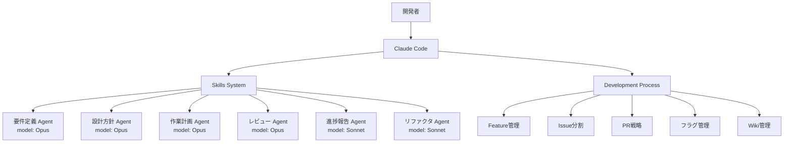

# 設計方針: 開発ルール改善とClaude Code Skill導入

**作成日**: 2025-11-05
**ブランチ**: feature/issue/133
**担当**: Claude Code

---

## 📋 要求・要件

### ビジネス要求
- アジャイル開発チームの開発効率向上
- AI（LLM）を活用した開発プロセスの自動化・最適化
- ナレッジの永続化と開発速度の両立

### 機能要件
1. **開発ルールの改善**
   - フィーチャー駆動開発とCIの統合
   - Featureチケット管理プロセスの確立
   - Issue分割戦略の明確化
   - フィーチャーフラグによる未完成コード管理

2. **Claude Code Skillの実装**
   - 要件定義スキル（Opus使用）
   - 設計方針作成スキル（Opus使用）
   - 作業計画立案スキル（Opus使用）
   - アーキテクチャレビュースキル（Opus使用）
   - 進捗報告スキル（Sonnet使用）
   - リファクタリングスキル（Sonnet + Codex CLI）

### 非機能要件
- 可読性: 開発ルールの明確性と一貫性
- 保守性: スキル定義の拡張性
- 効率性: AI活用による開発速度向上

---

## 🏗️ アーキテクチャ設計

### システム構成



### 技術選定
| 技術要素 | 選定技術 | 選定理由 |
|---------|---------|---------|
| スキル定義形式 | Markdown + YAML | 可読性・保守性 |
| エージェント実行 | Task Tool | Claude Code標準機能 |
| モデル選択 | Opus/Sonnet | タスク複雑度に応じた最適化 |
| コード操作 | Codex CLI (MCP) | リファクタリング自動化 |

### ディレクトリ構成
```
.claude/
├── skills/                    # Claude Code Skills
│   ├── requirements.md        # 要件定義スキル
│   ├── design-policy.md       # 設計方針作成スキル
│   ├── work-plan.md          # 作業計画立案スキル
│   ├── architecture-review.md # アーキテクチャレビュー
│   ├── progress-report.md    # 進捗報告スキル
│   └── refactoring.md        # リファクタリングスキル
├── commands/                  # Slash commands
│   └── skill-help.md         # スキル使用方法ヘルプ
└── settings.json              # Claude Code設定

docs/
├── procedures/                # 手順書
│   └── AGILE_WORKFLOW.md     # アジャイル開発ワークフロー
└── design/
    └── feature-driven-dev.md # フィーチャー駆動開発
```

---

## ✅ 制約条件チェック結果

### コード品質原則
- [x] SOLID原則: 遵守 / 各スキルは単一責任
- [x] KISS原則: 遵守 / シンプルなスキル定義
- [x] YAGNI原則: 遵守 / 必要最小限の機能のみ
- [x] DRY原則: 遵守 / 共通処理はテンプレート化

### アーキテクチャガイドライン
- [x] architecture-overview.md: 準拠 / Claude Code標準機能を活用
- [x] レイヤー分離: スキル層とプロセス層を分離

### 設定管理ルール
- [x] 環境変数: 該当なし（スキル定義は静的）
- [x] myVault: 該当なし（機密情報なし）

### 品質担保方針
- [x] テスト: スキル動作確認を実施予定
- [x] ドキュメント: CLAUDE.mdに使用方法明記

### CI/CD準拠
- [x] PRラベル: feature ラベルを付与予定
- [x] コミットメッセージ: 規約に準拠予定

### 参照ドキュメント遵守
- [x] 新規機能追加のため設計から開始

### 違反・要検討項目
なし

---

## 📝 設計上の決定事項

### 1. 開発ルールの統合方針
- **既存ルールとの共存**: 現行のCLAUDE.mdの構造を維持しつつ、新ルールを追加
- **段階的移行**: 既存プロジェクトへの影響を最小化
- **優先順位**: フィーチャー駆動開発 > Issue管理 > Wiki管理

### 2. スキル実装方針
- **モデル選択戦略**:
  - 複雑なタスク（要件定義、設計、計画、レビュー）: Opus
  - 定型タスク（進捗報告、リファクタリング）: Sonnet
- **エージェント呼び出し**: Task Toolのsubagent_typeで管理
- **パラメータ設計**: 各スキルは目的特化型のプロンプトテンプレート

### 3. フィーチャーフラグ実装
- **実装レベル**: アプリケーションレベル（各プロジェクト内）
- **管理方法**: 環境変数 + コード内フラグ
- **デフォルト**: すべて新機能はOFF

### 4. Wiki運用方針
- **初期段階**: GitHub Wikiの基本構造を設定
- **移行計画**: 既存ドキュメントの段階的移行
- **更新タイミング**: Feature完了時に必須

---

## 🔄 移行計画

### Phase 1: 基盤準備
- CLAUDE.md更新
- スキル定義ファイル作成
- 基本ドキュメント整備

### Phase 2: スキル実装
- 各スキルのプロンプト作成
- 動作確認・調整

### Phase 3: プロセス統合
- 開発ワークフロー文書化
- チーム周知・トレーニング

---

## 📊 成功指標

| 指標 | 現状 | 目標 | 測定方法 |
|------|------|------|---------|
| 要件定義時間 | 手動 2-3時間 | AI活用 30分 | 実測値 |
| 設計レビュー時間 | 1-2日 | 4時間以内 | PR承認時間 |
| Issue分割精度 | - | 90%以上 | 手戻り率 |
| ドキュメント更新率 | 60% | 100% | Feature完了時 |