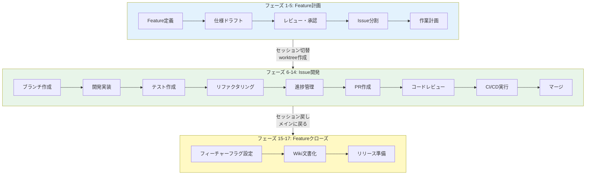

# Wiki文書化セッション情報とFeatureクローズ処理の明確化

**作業日**: 2025-11-05
**対応内容**: Wiki文書化の柔軟性追加、Featureクローズ処理の可視化

---

## 📋 修正内容

### 1. Wiki文書化のセッション柔軟性

#### 修正前
```markdown
| **16. Wiki文書化** | - | Sonnet | - | メイン | 仕様確定・文書化（手動作業） |
```

#### 修正後
```markdown
| **16. Wiki文書化** | - | Sonnet | - | メイン推奨 | 仕様確定・文書化（両セッション可） |
```

#### 変更理由

**Wiki文書化は両セッションで実施可能**:

| セッション | 実施可否 | 推奨度 | ユースケース |
|-----------|---------|-------|-------------|
| **メインセッション** | ✅ 可能 | ⭐⭐⭐ | Feature完了後の一括文書化（推奨） |
| **worktreeセッション** | ✅ 可能 | ⭐⭐ | Issue開発中の段階的文書化 |

**技術的根拠**:
- GitHub Wikiは独立した`.wiki.git`リポジトリとして管理
- どのセッションからでも`git clone`して編集可能
- worktreeセッションからでもWikiへのアクセスに制限なし

---

### 2. Featureクローズ処理の明確化

#### セッション区分説明の更新

**修正前**:
```markdown
- **フェーズ 1-5**: メインセッション（develop ブランチ）
- **フェーズ 6-16**: worktree セッション（issue ブランチ）
```

**修正後**:
```markdown
- **フェーズ 1-5**: メインセッション（develop ブランチ） - Feature計画
- **フェーズ 6-14**: worktree セッション（issue ブランチ） - Issue開発
- **フェーズ 15-17**: メインセッション（develop ブランチ） - **Featureクローズ処理**
```

#### フェーズマッピング表への区切り追加

```markdown
| **14. マージ** | - | Sonnet | - | worktree | developブランチへマージ（手動作業） |
| 🏁 **Featureクローズ処理** ||||| |
| **15. フィーチャーフラグ設定** | - | Sonnet | - | **← メイン** | フラグ設定（手動作業） |
| **16. Wiki文書化** | - | Sonnet | - | メイン推奨 | 仕様確定・文書化（両セッション可） |
| **17. リリース準備** | - | Sonnet | - | メイン | リリースノート作成等（手動作業） |
```

---

## 🔄 開発フロー全体像

### 3つのフェーズグループ



---

## 📝 運用パターン

### パターン1: Feature完了後の一括文書化（推奨）

```bash
# worktreeセッション - すべてのIssueを開発
cd ~/MySwiftAgent-worktrees/issue-201
# Issue #201開発・マージ

cd ~/MySwiftAgent-worktrees/issue-202
# Issue #202開発・マージ

cd ~/MySwiftAgent-worktrees/issue-203
# Issue #203開発・マージ

# ← メインセッションに戻る
cd ~/MySwiftAgent

# Featureクローズ処理
# 1. フィーチャーフラグ設定
vim .env
# FEATURE_USER_MANAGEMENT=true

# 2. Wiki文書化（メインセッションで一括）
git clone https://github.com/[org]/[repo].wiki.git
cd [repo].wiki
vim Feature-User-Management.md
# 確定仕様を記載
git add .
git commit -m "docs: add user management feature specification"
git push

# 3. リリース準備
gh release create v1.2.0
```

### パターン2: Issue単位での段階的文書化

```bash
# worktreeセッション - Issue #201
cd ~/MySwiftAgent-worktrees/issue-201
# 開発・テスト

# Issue完了後、その場でWiki部分更新
git clone https://github.com/[org]/[repo].wiki.git
cd [repo].wiki
vim Feature-User-Management.md
# Issue #201の内容を追記
git add .
git commit -m "docs: add profile API specification (Issue #201)"
git push

# 同様にIssue #202, #203...

# ← メインセッションに戻る
cd ~/MySwiftAgent

# Featureクローズ処理
# 1. フィーチャーフラグ設定
# 2. Wiki最終調整（メインセッション）
cd [repo].wiki
# 全体の整合性確認、清書
git add .
git commit -m "docs: finalize user management feature specification"
git push

# 3. リリース準備
```

---

## 🎯 改善効果

### Wiki文書化の柔軟性向上

| 側面 | 改善内容 |
|------|---------|
| **選択肢** | メイン推奨だが、worktreeでも実施可能 |
| **効率化** | Issue開発中に記憶が新しいうちに文書化可能 |
| **分散作業** | 複数Issue開発者が並行して文書更新可能 |
| **一貫性** | メインでの最終調整で品質担保 |

### Featureクローズ処理の可視性向上

| 側面 | 改善内容 |
|------|---------|
| **理解性** | フェーズ15-17がクローズ処理と明確 |
| **セッション切替** | 「← メイン」でセッション戻しを強調 |
| **区切り** | 🏁マークで視覚的に区別 |
| **運用性** | いつメインセッションに戻るかが明確 |

---

## ✅ 更新箇所

| ファイル | 行番号 | 更新内容 |
|---------|-------|---------|
| `CLAUDE.md` | 67-70 | セッション区分説明にFeatureクローズ処理追加 |
| `CLAUDE.md` | 88-91 | Featureクローズ処理の区切り追加、Wiki文書化を「メイン推奨（両セッション可）」に変更 |

---

## 📚 関連ドキュメント

- [並列開発環境（git worktree）](./CLAUDE.md#🔄-並列開発環境git-worktree)
- [ドキュメント（ナレッジ）管理](./CLAUDE.md#📚-ドキュメントナレッジ管理)