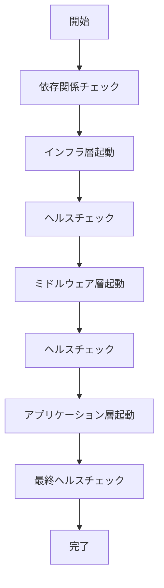

# 設計方針書: 受入テストの効率化（Issue #140）

**作成日**: 2025-11-06
**作成者**: Claude (Opus 4.1)
**バージョン**: 1.0.0

---

## 1. アーキテクチャ概要

### 1.1 システム全体構成

```
┌─────────────────────────────────────────────────────────────────┐
│                     統一起動スクリプト                           │
│                    (unified-start.sh)                           │
├─────────────────────────────────────────────────────────────────┤
│  コマンド層    │  設定層      │  ライブラリ層   │  監視層     │
├────────────────┼──────────────┼─────────────────┼──────────────┤
│ • start        │ • services   │ • port-manager  │ • health    │
│ • stop         │ • deps       │ • worktree      │ • status    │
│ • restart      │ • env        │ • process       │ • logs      │
│ • status       │              │ • docker        │              │
│ • logs         │              │                 │              │
└────────────────┴──────────────┴─────────────────┴──────────────┘
                               ↓
┌─────────────────────────────────────────────────────────────────┐
│                        サービス層                                │
├─────────────────────────────────────────────────────────────────┤
│  インフラ層    │  ミドルウェア層  │  アプリケーション層        │
├────────────────┼─────────────────┼────────────────────────────┤
│ • myVault      │ • myscheduler   │ • expertAgent              │
│ • jobqueue     │ • graphAiServer │ • myAgentDesk/commonUI     │
└────────────────┴─────────────────┴────────────────────────────┘
```

### 1.2 モジュール構造

```bash
scripts/
├── unified-start.sh          # メインエントリーポイント
├── config/
│   ├── services.yaml         # サービス定義（ポート、依存関係）
│   ├── dependencies.yaml     # 依存関係グラフ
│   └── worktree-ports.yaml   # worktree用ポートマッピング
├── lib/
│   ├── common.sh             # 共通関数（色出力、ログ等）
│   ├── port-manager.sh       # ポート管理
│   ├── process-manager.sh    # プロセス管理
│   ├── health-check.sh       # ヘルスチェック
│   ├── worktree-utils.sh     # worktree検出・管理
│   ├── env-loader.sh         # 環境変数読み込み
│   └── docker-utils.sh       # Docker管理（langfuse用）
└── templates/
    ├── env.template          # 環境変数テンプレート
    └── status.template       # ステータス表示テンプレート
```

---

## 2. コンポーネント設計

### 2.1 メインスクリプト（unified-start.sh）

**責務**: コマンドのルーティングと全体制御

```bash
#!/bin/bash
# 主要機能:
# - サブコマンド解析（start/stop/restart/status/logs）
# - オプション解析（--worktree, --parallel, --service）
# - ライブラリ読み込み
# - エラーハンドリング
```

### 2.2 ポート管理モジュール（port-manager.sh）

**責務**: ポート番号の割り当てと競合解決

```bash
# 主要関数:
# - detect_worktree_index()    # worktreeインデックス検出
# - calculate_ports()          # ポート番号計算
# - check_port_available()     # ポート使用状況確認
# - resolve_port_conflict()    # ポート競合解決
# - get_alternative_port()     # 代替ポート取得
```

### 2.3 プロセス管理モジュール（process-manager.sh）

**責務**: サービスプロセスのライフサイクル管理

```bash
# 主要関数:
# - start_service()            # サービス起動
# - stop_service()             # サービス停止
# - restart_service()          # サービス再起動
# - get_service_pid()          # PID取得
# - is_service_running()       # 稼働状況確認
# - cleanup_orphan_processes() # 孤立プロセス削除
```

### 2.4 ヘルスチェックモジュール（health-check.sh）

**責務**: サービスの健全性監視

```bash
# 主要関数:
# - check_service_health()     # 個別サービスヘルスチェック
# - check_all_health()         # 全サービスヘルスチェック
# - wait_for_healthy()         # 起動待機
# - get_health_endpoint()      # エンドポイント取得
# - format_health_status()     # ステータス表示整形
```

---

## 3. 技術選定の根拠

### 3.1 実装言語: Bash

**選定理由:**
- ✅ **既存資産との整合性**: dev-start.sh、setup-worktree.sh等が全てBash実装
- ✅ **依存関係最小化**: Python不要、追加インストール不要
- ✅ **POSIX準拠**: macOS/Linux両対応、CI/CD環境でも動作
- ✅ **プロセス管理に最適**: nohup、kill、pkillなどOSコマンド直接利用

**代替案（Python）を不採用とした理由:**
- ❌ 起動時のPython環境確認が必要
- ❌ 既存スクリプトとの統合が複雑
- ❌ シェルコマンド実行にsubprocess必要

### 3.2 設定ファイル形式: YAML

**選定理由:**
- ✅ **可読性**: 階層構造の依存関係を直感的に表現
- ✅ **既存ツールとの親和性**: yqコマンドで解析可能
- ✅ **将来の拡張性**: Docker Compose等への移行が容易

**実装方針:**
- 初期バージョンはBashハードコーディング（YAMLパーサー不要）
- Phase 2でYAML設定ファイル導入（yqコマンド使用）

### 3.3 依存ツール

| ツール | 用途 | 必須/オプション | 代替手段 |
|-------|------|---------------|----------|
| **curl** | ヘルスチェック | 必須 | なし |
| **lsof** | ポート使用確認 | 必須 | netstat（Linux） |
| **pkill** | プロセス終了 | 必須 | kill + ps |
| **jq** | JSON解析 | オプション | grep + sed |
| **yq** | YAML解析 | オプション（Phase 2） | Bash配列 |
| **docker** | langfuse起動 | オプション | なし |

---

## 4. データフロー設計

### 4.1 環境変数の読み込み順序


**優先順位（高→低）:**
1. コマンドライン引数（--port等）
2. .env.local（worktree固有）
3. 各プロジェクト/.env（プロジェクト固有）
4. スクリプトデフォルト値

### 4.2 サービス起動フロー



### 4.3 ポート割り当てアルゴリズム

```python
# 擬似コード
def calculate_port(service, worktree_index):
    base_ports = {
        'jobqueue': 8101,
        'myscheduler': 8102,
        'myVault': 8103,
        'expertAgent': 8104,
        'graphAiServer': 8105,
        'myAgentDesk': 5173,
        'commonUI': 8601
    }

    if service in ['myAgentDesk', 'commonUI']:
        # UI系は+1ずつ
        return base_ports[service] + worktree_index
    else:
        # API系は+10ずつ
        return base_ports[service] + (worktree_index * 10)
```

---

## 5. エラーハンドリング設計

### 5.1 エラー分類と対処

| エラー種別 | 検出方法 | 自動対処 | ユーザー通知 |
|-----------|---------|---------|-------------|
| **ポート競合** | lsof確認 | 既存プロセス停止提案 | 確認プロンプト表示 |
| **依存サービス未起動** | ヘルスチェック | 依存サービス起動 | 起動中メッセージ |
| **Python環境未構築** | .venv確認 | uv sync自動実行 | セットアップ通知 |
| **Docker未起動** | docker ps | スキップ（langfuseのみ） | 警告表示 |
| **権限不足** | エラーコード確認 | - | sudo実行提案 |
| **ディスク容量不足** | df確認 | - | エラー終了 |

### 5.2 リトライ戦略

```bash
# リトライ設定
MAX_RETRIES=3
RETRY_INTERVAL=2  # 秒
HEALTH_CHECK_TIMEOUT=30  # 秒

# 実装例
retry_with_backoff() {
    local command=$1
    local retries=0

    while [ $retries -lt $MAX_RETRIES ]; do
        if $command; then
            return 0
        fi
        retries=$((retries + 1))
        sleep $((RETRY_INTERVAL * retries))  # 指数バックオフ
    done

    return 1
}
```

### 5.3 ロールバック機能

```bash
# 起動済みサービスの記録
STARTED_SERVICES=()

# エラー時のロールバック
rollback_on_error() {
    echo "Error occurred. Rolling back..."
    for service in "${STARTED_SERVICES[@]}"; do
        stop_service "$service"
    done
    cleanup_temp_files
    exit 1
}

trap rollback_on_error ERR
```

---

## 6. 非機能要件の実現方法

### 6.1 起動時間3分以内の達成

**最適化戦略:**

1. **並列起動**
   ```bash
   # 同一層内のサービスを並列起動
   start_layer_parallel() {
       local layer_services=("$@")
       for service in "${layer_services[@]}"; do
           start_service "$service" &
       done
       wait  # 全バックグラウンドジョブ完了待機
   }
   ```

2. **依存関係の最適化**
   - 必須依存のみ待機（myVault等）
   - オプション依存は非同期起動

3. **キャッシュ活用**
   - Python仮想環境の再利用
   - node_modulesの存在確認

### 6.2 ヘルスチェックの実装

```bash
# 段階的ヘルスチェック
check_service_health() {
    local service=$1
    local port=$2
    local max_attempts=30

    # Level 1: ポート監視
    if ! check_port $port; then
        return 1
    fi

    # Level 2: HTTPレスポンス
    if ! curl -sf "http://localhost:$port/health" >/dev/null; then
        return 1
    fi

    # Level 3: ステータスコード確認（オプション）
    local status=$(curl -s "http://localhost:$port/health" | jq -r '.status' 2>/dev/null)
    if [ "$status" = "healthy" ]; then
        return 0
    fi

    return 1
}
```

### 6.3 リソース使用量の監視

```bash
# メモリ使用量チェック
check_memory_usage() {
    local threshold=8192  # 8GB in MB
    local available=$(free -m | awk 'NR==2{print $7}')  # Linux
    # macOS: vm_stat | grep "Pages free" | awk '{print $3*4/1024}'

    if [ "$available" -lt "$threshold" ]; then
        print_warning "Low memory: ${available}MB available (recommended: ${threshold}MB)"
        read -p "Continue anyway? (y/n): " confirm
        [ "$confirm" != "y" ] && exit 1
    fi
}
```

---

## 7. 実装フェーズの分割

### Phase 1: MVP実装（1週間）
- ✅ 基本的な起動/停止機能
- ✅ ハードコーディングされた依存関係
- ✅ 単一worktree対応
- ✅ 基本的なヘルスチェック

### Phase 2: worktree対応（1週間）
- ✅ 複数worktree並列起動
- ✅ ポート自動割り当て
- ✅ .env.local統合
- ✅ YAML設定ファイル導入

### Phase 3: 高度な機能（1週間）
- ✅ Docker Compose統合
- ✅ Web UIダッシュボード
- ✅ メトリクス収集
- ✅ 自動リカバリ機能

### Phase 4: 本番対応（オプション）
- ✅ systemd/launchd統合
- ✅ Kubernetes manifests生成
- ✅ CI/CD統合（GitHub Actions）

---

## 8. リスクと対策

### 8.1 技術リスク

| リスク | 影響度 | 発生確率 | 対策 | 緩和策 |
|-------|-------|---------|------|-------|
| **ポート競合による起動失敗** | 高 | 中 | 自動ポート検出 | 代替ポート機能、ユーザー確認 |
| **依存サービスの起動順序違反** | 高 | 低 | 依存グラフ管理 | リトライ機構、明示的待機 |
| **worktree検出の失敗** | 中 | 低 | git worktree list使用 | フォールバック処理 |
| **メモリ不足** | 中 | 中 | 事前チェック | 警告表示、段階的起動 |
| **Bashスクリプトの保守性** | 中 | 高 | モジュール分割 | Python移行パス準備 |

### 8.2 運用リスク

| リスク | 影響度 | 発生確率 | 対策 | 緩和策 |
|-------|-------|---------|------|-------|
| **設定ミスによる環境不整合** | 高 | 中 | 設定検証機能 | dry-runモード、設定確認表示 |
| **ログファイルの肥大化** | 低 | 高 | ログローテーション | 自動クリーンアップ |
| **プロセスのゾンビ化** | 中 | 低 | PID管理強化 | 定期的なヘルスチェック |
| **誤操作による本番影響** | 高 | 低 | 環境分離 | 本番ポート範囲を除外 |

---

## 9. 設計決定事項のサマリー

### 9.1 採用する設計

| 項目 | 決定事項 | 理由 |
|------|---------|------|
| **実装言語** | Bash | 既存資産との整合性、依存最小化 |
| **設定管理** | Phase1: ハードコード<br>Phase2: YAML | 段階的な複雑性導入 |
| **ポート管理** | 自動検出＋計算式 | worktree対応、競合回避 |
| **プロセス管理** | PIDファイル＋nohup | シンプル、確実 |
| **ログ管理** | サービス別ファイル | 既存ポリシー準拠 |
| **エラー処理** | trap + ロールバック | 安全性重視 |

### 9.2 採用しない設計

| 項目 | 不採用案 | 理由 |
|------|---------|------|
| **Docker Compose一括管理** | 全サービスコンテナ化 | 開発効率低下、既存資産活用不可 |
| **systemd/supervisord** | プロセス管理デーモン | 開発環境には過剰、macOS非対応 |
| **Python実装** | Python + Click/Typer | 起動時間増加、依存関係増加 |
| **分散設定** | 各サービスに起動スクリプト | 一元管理不可、保守性低下 |

### 9.3 移行戦略

**既存スクリプトからの段階的移行:**

1. **Phase 1**: unified-start.sh内部でdev-start.shを呼び出し
2. **Phase 2**: 機能を段階的にunified-start.shに統合
3. **Phase 3**: dev-start.shを廃止、エイリアス提供

```bash
# 後方互換性の維持
alias dev-start.sh="unified-start.sh --legacy"
```

---

## 10. 実装上の注意事項

### 10.1 コーディング規約

```bash
# 1. エラー処理
set -euo pipefail  # 厳密モード
trap cleanup EXIT  # 終了時クリーンアップ

# 2. 変数名
GLOBAL_VAR="value"     # グローバル変数は大文字
local local_var="value"  # ローカル変数は小文字

# 3. 関数名
function print_error() {  # snake_case使用
    echo "ERROR: $1" >&2
}

# 4. 引用符
"$variable"  # 常に引用符で囲む
```

### 10.2 テスト方針

```bash
# 単体テスト用関数
test_port_calculation() {
    local expected=8114
    local actual=$(calculate_port "expertAgent" 1)
    [ "$actual" -eq "$expected" ] || echo "FAIL: port calculation"
}

# 統合テストシナリオ
test_scenarios/
├── single_worktree.sh    # 単一worktree起動
├── multiple_worktree.sh  # 4 worktree同時起動
├── port_conflict.sh      # ポート競合解決
└── rollback.sh          # エラー時ロールバック
```

### 10.3 ドキュメント

```markdown
# 必須ドキュメント
docs/
├── unified-start-usage.md     # 使用方法
├── unified-start-config.md    # 設定リファレンス
├── unified-start-trouble.md   # トラブルシューティング
└── unified-start-dev.md       # 開発者向けガイド
```

---

## 11. 成功の測定基準

### 11.1 定量的指標

| 指標 | 現状 | 目標 | 測定方法 |
|------|------|------|---------|
| **起動時間** | 10-15分 | 3分以内 | time コマンド計測 |
| **コマンド数** | 7個別コマンド | 1コマンド | 実行履歴確認 |
| **並列実行数** | 1 | 4 | ps確認 |
| **起動成功率** | 70% | 95% | ログ分析 |

### 11.2 定性的指標

- ✅ POからの肯定的フィードバック
- ✅ 開発者の作業効率向上実感
- ✅ 環境構築関連の問い合わせ削減
- ✅ 新規参画者のオンボーディング時間短縮

---

## 12. 次のステップ

### 即時実行（Phase 1: 今週中）

1. **基本実装**
   ```bash
   # unified-start.sh の作成
   touch scripts/unified-start.sh
   chmod +x scripts/unified-start.sh
   ```

2. **ライブラリ分割**
   ```bash
   mkdir -p scripts/{config,lib,templates}
   # 既存dev-start.shから関数抽出
   ```

3. **テスト実装**
   ```bash
   # 基本動作確認
   ./scripts/unified-start.sh start
   ./scripts/unified-start.sh status
   ./scripts/unified-start.sh stop
   ```

### フォローアップ（Phase 2: 来週）

1. **worktree統合**
2. **YAML設定導入**
3. **並列起動実装**

---

**承認**: _______________________
**日付**: _______________________
