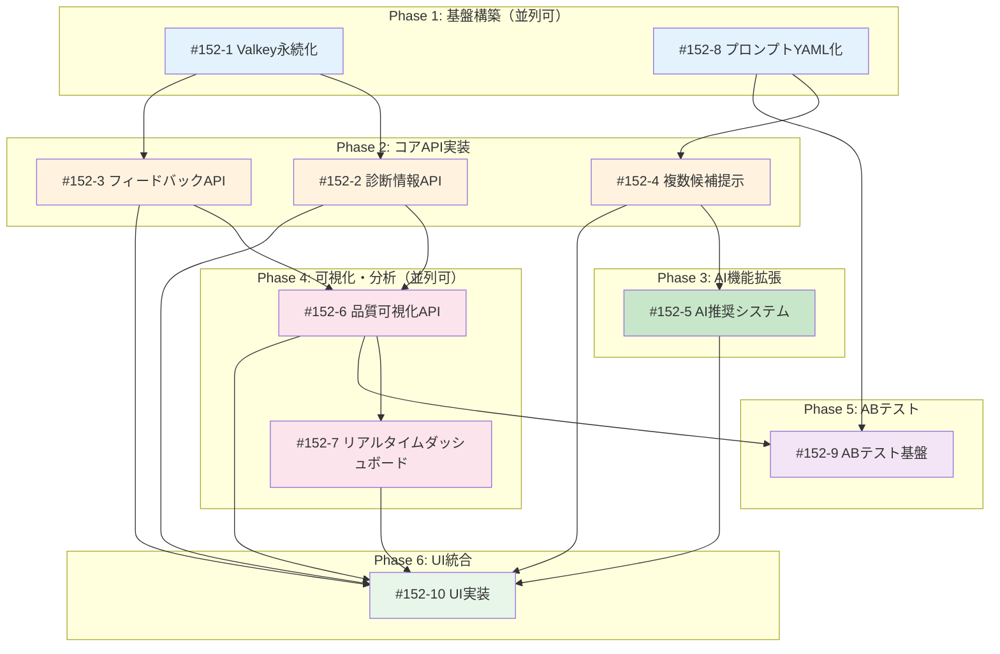

# Issue #152: MLOps要件定義エージェント導入 - Issue分割計画書

## Feature: 要件定義エージェントへのMLOps導入

**作成日**: 2025-11-12
**対象Issue**: #152
**優先度**: Medium (feature)
**採用UIパターン**: パターンD（革新的・実験的）
**プロジェクト**: expertAgent

---

## 📋 Feature概要

expertAgent の `/v1/chat/requirement-definition` API（要件定義エージェント）に対し、MLOps手法を導入することで、品質の継続的改善サイクルを実現します。

### 主要機能
1. **複数候補提示機能** - ユーザーに2パターンの要件解釈を提示
2. **フィードバック機能** - 要件定義APIの品質評価
3. **品質可視化ダッシュボード** - メトリクスの可視化
4. **診断情報取得** - プロンプト・LLMレスポンスの確認
5. **プロンプト外部管理** - YAML化による管理効率化
6. **ABテスト** - 統計的検定によるプロンプト改善

---

## 🎯 Issue一覧

### Issue #152-1: Valkey永続化基盤の実装
**概要**: 現在インメモリで管理している会話データをValkeyに永続化
**サイズ**: M (3日)
**優先度**: High
**作業見積**: 24時間
**担当候補**: Backend

**スコープ**:
- [ ] リポジトリ直下にvalkeyディレクトリを作成（設定・データ格納用）
- [ ] Valkeyクライアント設定追加
- [ ] ConversationStoreValkey実装
- [ ] 環境変数による切り替え機能
- [ ] scripts/dev-start.sh からのValkey起動機能
- [ ] docker-compose.yml へのValkeyサービス定義追加
- [ ] worktree環境毎のValkey起動（ポート番号自動割り当て）
- [ ] 単体テスト作成（カバレッジ90%以上）
- [ ] 結合テスト作成
- [ ] ドキュメント更新

**技術スタック**:
- 言語/FW: Python/FastAPI
- データベース: Valkey (Redis互換)
- パッケージ: valkey-py

**受入基準 (Acceptance Criteria)**:

#### 🤖 自動検証可能な基準（pm-auto-devが実施）

**機能要件**:
- [ ] リポジトリ直下にvalkeyディレクトリが作成される
- [ ] valkeyディレクトリ配下に設定ファイル・データファイルが格納される
- [ ] Valkey接続が正常に確立される
- [ ] 会話データがValkeyに保存される
- [ ] TTL機能が正しく動作する（24時間後に自動削除）
- [ ] trace_id、prompt_versionが保存・取得できる
- [ ] scripts/dev-start.sh からValkeyが起動可能
- [ ] docker-compose up でValkeyが起動可能
- [ ] worktree環境毎に独立したValkeyインスタンスが起動（ポート衝突なし）

**品質基準**:
- [ ] 単体テストカバレッジ 90%以上
- [ ] 結合テストカバレッジ 50%以上
- [ ] Ruff/MyPy エラーゼロ
- [ ] 読み書きレスポンスタイム 50ms以内

**テストケース**:
- [ ] 正常系: 会話データの保存・取得
- [ ] 異常系: Valkey接続エラー時のフォールバック
- [ ] エッジケース: 大量データ（1000会話）の処理

#### 👤 手動検証が必要な基準（ユーザーが実施）

**運用検証**:
- [ ] サーバー再起動後もデータが保持される
- [ ] 複数インスタンス間でデータ共有可能
- [ ] メモリ使用量が想定範囲内

---

### Issue #152-2: 診断情報取得API実装
**概要**: conversation_idからプロンプト・LLMレスポンス・トークン使用量を取得
**サイズ**: M (2日)
**優先度**: High
**作業見積**: 16時間
**担当候補**: Backend

**スコープ**:
- [ ] GET /v1/chat/diagnostics/{conversation_id} エンドポイント実装
- [ ] Langfuseトレーシング統合
- [ ] DiagnosticInfoスキーマ定義
- [ ] 単体テスト作成
- [ ] 結合テスト作成
- [ ] APIドキュメント更新

**技術スタック**:
- 言語/FW: Python/FastAPI
- 外部サービス: Langfuse (Self-hosted)
- ストレージ: Valkey

**受入基準 (Acceptance Criteria)**:

#### 🤖 自動検証可能な基準（pm-auto-devが実施）

**機能要件**:
- [ ] APIエンドポイント `/v1/chat/diagnostics/{conversation_id}` が実装される
- [ ] システムプロンプト全文が取得できる
- [ ] 各ターンのユーザー/LLMメッセージが取得できる
- [ ] トークン使用量が正確に記録される
- [ ] Langfuseトレースリンクが生成される

**品質基準**:
- [ ] 単体テストカバレッジ 90%以上
- [ ] 結合テストカバレッジ 50%以上
- [ ] Ruff/MyPy エラーゼロ
- [ ] レスポンスタイム 1秒以内

**テストケース**:
- [ ] 正常系: 既存会話の診断情報取得
- [ ] 異常系: 存在しないconversation_id（404エラー）
- [ ] エッジケース: 長い会話（50ターン以上）

#### 👤 手動検証が必要な基準（ユーザーが実施）

**診断情報確認**:
- [ ] プロンプトが正しく表示される
- [ ] LLMレスポンスが完全に取得できる
- [ ] Langfuseリンクが正しく機能する

---

### Issue #152-3: フィードバックAPI実装
**概要**: 要件定義API固有の4種類のスコアでフィードバック投稿
**サイズ**: S (1日)
**優先度**: High
**作業見積**: 8時間
**担当候補**: Backend

**スコープ**:
- [ ] POST /v1/chat/feedback エンドポイント実装
- [ ] RequirementFeedbackスキーマ定義
- [ ] Langfuse scores投稿統合
- [ ] 単体テスト作成
- [ ] 結合テスト作成

**技術スタック**:
- 言語/FW: Python/FastAPI
- 外部サービス: Langfuse

**受入基準 (Acceptance Criteria)**:

#### 🤖 自動検証可能な基準（pm-auto-devが実施）

**機能要件**:
- [ ] APIエンドポイント `/v1/chat/feedback` が実装される
- [ ] 4種類のスコア（requirement_clarity等）が投稿できる
- [ ] conversation_idとtrace_idが正しく紐づく
- [ ] Langfuseにスコアが保存される

**品質基準**:
- [ ] 単体テストカバレッジ 90%以上
- [ ] 結合テストカバレッジ 50%以上
- [ ] Ruff/MyPy エラーゼロ
- [ ] レスポンスタイム 500ms以内

**テストケース**:
- [ ] 正常系: フィードバック投稿成功
- [ ] 異常系: 無効なスコア値（1-5範囲外）
- [ ] エッジケース: 同一会話への複数フィードバック

#### 👤 手動検証が必要な基準（ユーザーが実施）

**フィードバック動作確認**:
- [ ] フィードバックフォームが正しく表示される
- [ ] 投稿後の確認メッセージが表示される

---

### Issue #152-4: 複数候補提示機能（基本実装）
**概要**: 初回メッセージに対し2つの要件解釈パターンを提示
**サイズ**: M (3日)
**優先度**: High
**作業見積**: 24時間
**担当候補**: Backend/Frontend

**スコープ**:
- [ ] MULTI_CANDIDATE_GENERATION_PROMPT作成
- [ ] stream_requirement_clarification()拡張
- [ ] SSE candidate_selectionイベント追加
- [ ] 候補選択ロジック実装
- [ ] 単体テスト作成
- [ ] 結合テスト作成

**技術スタック**:
- 言語/FW: Python/FastAPI
- LLM: Gemini 2.5 Flash
- 通信: Server-Sent Events (SSE)

**受入基準 (Acceptance Criteria)**:

#### 🤖 自動検証可能な基準（pm-auto-devが実施）

**機能要件**:
- [ ] 初回メッセージで2パターンが生成される
- [ ] 各候補に4つの観点が含まれる
- [ ] SSEイベントが正しく送信される
- [ ] 候補選択後に対話が継続される

**品質基準**:
- [ ] 単体テストカバレッジ 90%以上
- [ ] 結合テストカバレッジ 50%以上
- [ ] Ruff/MyPy エラーゼロ
- [ ] 生成時間 4秒以内

**テストケース**:
- [ ] 正常系: 2候補生成・選択・継続
- [ ] 異常系: LLM生成エラー
- [ ] エッジケース: 曖昧なユーザー入力

#### 👤 手動検証が必要な基準（ユーザーが実施）

**UX検証**:
- [ ] 候補が分かりやすく提示される
- [ ] 選択操作が直感的
- [ ] 候補の違いが明確

---

### Issue #152-5: AI推奨システム実装
**概要**: ユーザーメッセージを分析しAI推奨を提供
**サイズ**: M (2日)
**優先度**: Medium
**作業見積**: 16時間
**担当候補**: Backend

**スコープ**:
- [ ] AIRecommendationService実装
- [ ] キーワード分析ロジック
- [ ] 複雑度推定アルゴリズム
- [ ] 信頼度計算機能
- [ ] 単体テスト作成

**技術スタック**:
- 言語/FW: Python
- LLM: Gemini (オプション)

**受入基準 (Acceptance Criteria)**:

#### 🤖 自動検証可能な基準（pm-auto-devが実施）

**機能要件**:
- [ ] キーワード分析が正しく動作
- [ ] 複雑度推定が3段階で判定される
- [ ] 信頼度スコアが0-1の範囲で計算される
- [ ] 推奨理由が生成される

**品質基準**:
- [ ] 単体テストカバレッジ 90%以上
- [ ] Ruff/MyPy エラーゼロ
- [ ] 推奨精度 80%以上（テストデータ）
- [ ] 処理時間 100ms以内

**テストケース**:
- [ ] 正常系: シンプル/複雑ケースの判定
- [ ] 異常系: 空メッセージ
- [ ] エッジケース: 長文メッセージ（1000文字）

#### 👤 手動検証が必要な基準（ユーザーが実施）

**AI推奨検証**:
- [ ] 推奨が適切に表示される
- [ ] 推奨理由が納得感がある
- [ ] 信頼度表示が分かりやすい

---

### Issue #152-6: 品質可視化API実装
**概要**: 要件定義APIの品質メトリクスを集計・可視化
**サイズ**: M (2日)
**優先度**: Medium
**作業見積**: 16時間
**担当候補**: Backend

**スコープ**:
- [ ] GET /v1/observability/requirement-definition-metrics実装
- [ ] メトリクス集計ロジック
- [ ] キャッシュ機構実装
- [ ] RequirementDefinitionMetricsスキーマ定義
- [ ] 単体テスト作成

**技術スタック**:
- 言語/FW: Python/FastAPI
- 外部サービス: Langfuse
- キャッシュ: Valkey

**受入基準 (Acceptance Criteria)**:

#### 🤖 自動検証可能な基準（pm-auto-devが実施）

**機能要件**:
- [ ] 平均スコアが正しく計算される
- [ ] 対話ターン数が集計される
- [ ] 完了率が算出される
- [ ] モデル使用率が集計される

**品質基準**:
- [ ] 単体テストカバレッジ 90%以上
- [ ] Ruff/MyPy エラーゼロ
- [ ] レスポンスタイム 1秒以内（1000会話）
- [ ] キャッシュヒット率 80%以上

**テストケース**:
- [ ] 正常系: 30日間のメトリクス取得
- [ ] 異常系: データなし期間
- [ ] エッジケース: 大量データ（10000会話）

#### 👤 手動検証が必要な基準（ユーザーが実施）

**メトリクス確認**:
- [ ] 数値が妥当な範囲内
- [ ] グラフが正しく描画される

---

### Issue #152-7: リアルタイムダッシュボード実装
**概要**: SSEを使用したリアルタイムメトリクス配信
**サイズ**: M (2日)
**優先度**: Medium
**作業見積**: 16時間
**担当候補**: Backend/Frontend

**スコープ**:
- [ ] SSEストリーミングエンドポイント実装
- [ ] 差分データ取得ロジック
- [ ] フロントエンド統合（SvelteKit）
- [ ] リアルタイムグラフコンポーネント
- [ ] 結合テスト作成

**技術スタック**:
- Backend: Python/FastAPI/SSE
- Frontend: SvelteKit/Chart.js

**受入基準 (Acceptance Criteria)**:

#### 🤖 自動検証可能な基準（pm-auto-devが実施）

**機能要件**:
- [ ] SSEストリームが正常に動作
- [ ] 5秒ごとに更新される
- [ ] ハートビートが30秒ごとに送信
- [ ] 差分データのみ送信される

**品質基準**:
- [ ] 結合テストカバレッジ 50%以上
- [ ] メモリリークがない
- [ ] 同時接続 100クライアント対応

**テストケース**:
- [ ] 正常系: リアルタイム更新
- [ ] 異常系: 接続断・再接続
- [ ] エッジケース: 長時間接続（1時間）

#### 👤 手動検証が必要な基準（ユーザーが実施）

**ダッシュボード動作**:
- [ ] グラフがスムーズに更新される
- [ ] データ遅延が感じられない
- [ ] UIが直感的

---

### Issue #152-8: プロンプトYAML化実装
**概要**: 全プロンプトを外部YAMLファイルで管理（複数バージョン対応）
**サイズ**: L (4日)
**優先度**: Medium
**作業見積**: 32時間
**担当候補**: Backend

**スコープ**:
- [ ] expertAgent/prompts/ ディレクトリ構造の設計・作成
- [ ] プロンプト名ディレクトリ + 複数YAMLファイル管理機能
- [ ] jobTaskGeneratorAgents/prompts/ のYAML化（全プロンプト）
- [ ] workflowGeneratorAgents/prompts/ のYAML化（全プロンプト）
- [ ] PromptLoader実装（default.yaml自動フォールバック）
- [ ] リクエスト時のYAMLファイル名指定機能（API拡張）
- [ ] ホットリロード機能
- [ ] バージョン管理機能
- [ ] 単体テスト作成（カバレッジ90%以上）
- [ ] 4シナリオでの動作確認（jobTaskGeneratorAgents + ジョブマスタ登録確認）
- [ ] 4シナリオでの動作確認（workflowGeneratorAgents + ワークフロー生成・実行確認）
- [ ] ドキュメント更新

**技術スタック**:
- 言語/FW: Python/YAML
- 監視: watchdog
- エージェント: LangGraph (jobTaskGeneratorAgents, workflowGeneratorAgents)

**受入基準 (Acceptance Criteria)**:

#### 🤖 自動検証可能な基準（pm-auto-devが実施）

**機能要件**:
- [ ] expertAgent/prompts/ ディレクトリ構造が正しく作成される
- [ ] プロンプト名ディレクトリ配下に複数YAMLファイルを配置可能
- [ ] YAMLからプロンプトが読み込まれる（default.yaml自動フォールバック）
- [ ] リクエスト時にYAMLファイル名を指定可能（API拡張）
- [ ] バージョン切り替えが動作する
- [ ] ホットリロードが機能する
- [ ] キャッシュが正しく動作
- [ ] jobTaskGeneratorAgents の全プロンプトがYAML化される
- [ ] workflowGeneratorAgents の全プロンプトがYAML化される

**シナリオ検証（jobTaskGeneratorAgents）**:
- [ ] シナリオ1: 企業IR分析でジョブマスタ・タスクマスタ・インタフェースマスタが登録される
- [ ] シナリオ2: WebサイトPDF抽出でジョブマスタ・タスクマスタ・インタフェースマスタが登録される
- [ ] シナリオ3: Gmail検索ポッドキャスト生成でジョブマスタ・タスクマスタ・インタフェースマスタが登録される
- [ ] シナリオ4: キーワードポッドキャスト生成でジョブマスタ・タスクマスタ・インタフェースマスタが登録される

**シナリオ検証（workflowGeneratorAgents）**:
- [ ] シナリオ1: 企業IR分析のLLMワークフローが生成・実行可能
- [ ] シナリオ2: WebサイトPDF抽出のLLMワークフローが生成・実行可能
- [ ] シナリオ3: Gmail検索ポッドキャスト生成のLLMワークフローが生成・実行可能
- [ ] シナリオ4: キーワードポッドキャスト生成のLLMワークフローが生成・実行可能

**品質基準**:
- [ ] 単体テストカバレッジ 90%以上
- [ ] Ruff/MyPy エラーゼロ
- [ ] 読み込み時間 100ms以内
- [ ] 4シナリオ全てでジョブマスタ・タスクマスタ・インタフェースマスタ登録成功
- [ ] 4シナリオ全てでワークフロー生成・実行成功

**テストケース**:
- [ ] 正常系: プロンプト読み込み（default.yaml）
- [ ] 正常系: プロンプト読み込み（指定ファイル名）
- [ ] 異常系: 不正なYAML
- [ ] 異常系: 存在しないファイル名指定（default.yamlにフォールバック）
- [ ] エッジケース: ファイル変更検知

#### 👤 手動検証が必要な基準（ユーザーが実施）

**プロンプト管理**:
- [ ] エンジニア以外でも編集可能
- [ ] バージョン管理が分かりやすい
- [ ] ディレクトリ構造が直感的

**シナリオ動作確認**:
- [ ] シナリオ1（企業IR分析）の結果が妥当
- [ ] シナリオ2（WebサイトPDF抽出）の結果が妥当
- [ ] シナリオ3（Gmail検索ポッドキャスト）の結果が妥当
- [ ] シナリオ4（キーワードポッドキャスト）の結果が妥当

---

### Issue #152-9: ABテスト基盤実装
**概要**: プロンプトバージョンのABテスト機能
**サイズ**: L (4日)
**優先度**: Low
**作業見積**: 32時間
**担当候補**: Backend

**スコープ**:
- [ ] ABTestService実装
- [ ] バージョン割り当てロジック
- [ ] 統計検定機能（t検定）
- [ ] ABテストAPIエンドポイント
- [ ] 単体テスト・結合テスト作成

**技術スタック**:
- 言語/FW: Python/FastAPI
- 統計: scipy.stats

**受入基準 (Acceptance Criteria)**:

#### 🤖 自動検証可能な基準（pm-auto-devが実施）

**機能要件**:
- [ ] ランダムバージョン割り当て
- [ ] バージョン別メトリクス集計
- [ ] 統計的有意性検定（p値）
- [ ] 効果サイズ（Cohen's d）計算

**品質基準**:
- [ ] 単体テストカバレッジ 90%以上
- [ ] Ruff/MyPy エラーゼロ
- [ ] 統計計算精度 99.9%

**テストケース**:
- [ ] 正常系: AB比較レポート生成
- [ ] 異常系: サンプル数不足
- [ ] エッジケース: 有意差なし

#### 👤 手動検証が必要な基準（ユーザーが実施）

**ABテスト運用**:
- [ ] レポートが分かりやすい
- [ ] 意思決定に使える情報

---

### Issue #152-10: UI実装（フロントエンド統合）
**概要**: パターンDのUI実装とバックエンド統合
**サイズ**: L (5日)
**優先度**: Medium
**作業見積**: 40時間
**担当候補**: Frontend/Full-stack

**スコープ**:
- [ ] 候補選択UI実装
- [ ] フィードバックフォーム実装
- [ ] ダッシュボード画面実装
- [ ] 診断情報ビュー実装
- [ ] プロンプト管理画面実装
- [ ] E2Eテスト作成

**技術スタック**:
- FW: SvelteKit 2.x
- 言語: TypeScript
- UI: TailwindCSS

**受入基準 (Acceptance Criteria)**:

#### 🤖 自動検証可能な基準（pm-auto-devが実施）

**機能要件**:
- [ ] 全6機能のUIが実装される
- [ ] APIとの通信が正常
- [ ] レスポンシブデザイン対応
- [ ] アクセシビリティ対応

**品質基準**:
- [ ] E2Eテストカバレッジ 70%以上
- [ ] Lighthouse スコア 90以上
- [ ] TypeScriptエラー ゼロ

**テストケース**:
- [ ] 正常系: 全機能の操作フロー
- [ ] 異常系: API エラー処理
- [ ] エッジケース: モバイル表示

#### 👤 手動検証が必要な基準（ユーザーが実施）

**UI/UX検証**:
- [ ] 操作が直感的
- [ ] デザインが革新的（パターンD）
- [ ] パフォーマンスが良好

---

## 📊 Phase毎のイシュー管理

### Phase 1: 基盤構築（並列実行可能）

| Issue | 概要 | 依存 | 担当 | 見積 |
|-------|------|------|------|------|
| #152-1 | Valkey永続化基盤 | なし | Backend | 3日 |
| #152-8 | プロンプトYAML化 | なし | Backend | 2日 |

**Phase 1 完了条件**:
- [ ] Valkeyが稼働し、データ永続化可能
- [ ] プロンプトがYAMLで管理される

### Phase 2: コアAPI実装（一部並列可）

| Issue | 概要 | 依存 | 担当 | 見積 |
|-------|------|------|------|------|
| #152-2 | 診断情報API | #152-1 | Backend | 2日 |
| #152-3 | フィードバックAPI | #152-1 | Backend | 1日 |
| #152-4 | 複数候補提示（基本） | #152-8 | Backend | 3日 |

**Phase 2 完了条件**:
- [ ] `/pm-auto-dev 152-2,152-3,152-4` 完了（自動検証済み）
- [ ] 基本機能が全て動作確認OK

### Phase 3: AI機能拡張（Phase 2の#152-4完了後）

| Issue | 概要 | 依存 | 担当 | 見積 |
|-------|------|------|------|------|
| #152-5 | AI推奨システム | #152-4 | Backend | 2日 |

**Phase 3 完了条件**:
- [ ] `/pm-auto-dev 152-5` 完了（自動検証済み）
- [ ] AI推奨が適切に動作

### Phase 4: 可視化・分析（Phase 2完了後、並列可）

| Issue | 概要 | 依存 | 担当 | 見積 |
|-------|------|------|------|------|
| #152-6 | 品質可視化API | #152-2,3 | Backend | 2日 |
| #152-7 | リアルタイムダッシュボード | #152-6 | Backend/Frontend | 2日 |

**Phase 4 完了条件**:
- [ ] `/pm-auto-dev 152-6,152-7` 完了（自動検証済み）
- [ ] ダッシュボードでメトリクス確認OK

### Phase 5: ABテスト（Phase 1-4完了後）

| Issue | 概要 | 依存 | 担当 | 見積 |
|-------|------|------|------|------|
| #152-9 | ABテスト基盤 | #152-8,6 | Backend | 4日 |

**Phase 5 完了条件**:
- [ ] `/pm-auto-dev 152-9` 完了（自動検証済み）
- [ ] ABテストレポート生成OK

### Phase 6: UI統合（Phase 1-4完了後）

| Issue | 概要 | 依存 | 担当 | 見積 |
|-------|------|------|------|------|
| #152-10 | UI実装 | #152-2,3,4,5,6,7 | Frontend | 5日 |

**Phase 6 完了条件**:
- [ ] `/pm-auto-dev 152-10` 完了（E2Eテスト自動検証済み）
- [ ] 全機能がUIから操作可能

---

## 🔀 依存関係グラフ（Phase + Issue）

### 並列実行可能性マトリクス

| Phase | 並列実行可能なIssue | 理由 |
|-------|-------------------|------|
| Phase 1 | #152-1, #152-8 | 相互依存なし |
| Phase 2 | #152-2, #152-3 | 異なる機能領域 |
| Phase 4 | #152-6, #152-7（順次） | 可視化系の関連機能 |

### 依存関係マトリクス（詳細版）

| Issue | 依存先 | 並列実行可能 | ブロッカー |
|-------|--------|-------------|------------|
| #152-1 | なし | Yes | なし |
| #152-2 | #152-1 | Yes（#152-3と並列可） | Valkey基盤必要 |
| #152-3 | #152-1 | Yes（#152-2と並列可） | Valkey基盤必要 |
| #152-4 | #152-8 | No | プロンプトYAML化必要 |
| #152-5 | #152-4 | No | 複数候補機能必要 |
| #152-6 | #152-2,3 | No | 診断・フィードバック必要 |
| #152-7 | #152-6 | No | 品質API必要 |
| #152-8 | なし | Yes（#152-1と並列可） | なし |
| #152-9 | #152-8,6 | No | YAML化・品質API必要 |
| #152-10 | #152-2,3,4,5,6,7 | No | 全API機能必要 |

---

## 📅 マイルストーン計画

### Milestone 1: 基盤・コアAPI（Week 1-2）
- Phase 1: 基盤構築（並列実行）
  - #152-1: Valkey永続化（3日）
  - #152-8: プロンプトYAML化（2日）
- Phase 2: コアAPI実装
  - #152-2,3: 診断・フィードバック（3日、並列可）
  - #152-4: 複数候補提示（3日）

### Milestone 2: 拡張機能（Week 3）
- Phase 3: AI機能拡張
  - #152-5: AI推奨システム（2日）
- Phase 4: 可視化・分析
  - #152-6: 品質可視化API（2日）
  - #152-7: リアルタイムダッシュボード（2日）

### Milestone 3: 高度機能・UI（Week 4-5）
- Phase 5: ABテスト
  - #152-9: ABテスト基盤（4日）
- Phase 6: UI統合
  - #152-10: UI実装（5日）

---

## 👥 リソース配分

| 役割 | 必要人数 | スキル要件 | 担当Issue |
|------|---------|-----------|-----------|
| Backend | 2名 | Python/FastAPI/Valkey | #152-1〜9 |
| Frontend | 1名 | SvelteKit/TypeScript | #152-7,10 |
| Full-stack | 1名 | Python/SvelteKit | #152-4,7,10 |

---

## ⚠️ リスク評価

| Issue | リスク | 影響度 | 対策 |
|-------|-------|-------|------|
| #152-1 | Valkey接続障害 | 高 | インメモリフォールバック実装 |
| #152-4 | LLM生成品質 | 高 | プロンプトチューニング・テスト強化 |
| #152-5 | AI推奨精度 | 中 | 継続的な精度評価・改善 |
| #152-9 | 統計的有意性 | 中 | サンプル数の事前計算 |
| #152-10 | UI複雑性 | 高 | 段階的リリース・ユーザーテスト |

---

## ✅ 分割判断チェックリスト

各Issueについて確認:
- [x] 独立してデプロイ可能か
- [x] 1-5日で完了可能か
- [x] 明確な完了条件があるか（受入基準が2層構造で定義されているか）
- [x] テストが定義できるか
- [x] 他Issueへの影響が最小か
- [x] Phase間の依存関係が明確か
- [x] 並列実行可能なIssueが識別されているか

---

## 🚀 次のステップ

1. **Phase 1開始**: #152-1（Valkey）と#152-8（YAML化）を並列で着手
2. **詳細設計**: 各Issueの `/work-plan` で詳細作業計画立案
3. **実装開始**: `/pm-auto-dev` で自動開発・テスト実行
4. **段階的リリース**: Phase完了ごとにステージング環境でテスト

---

## 📚 参照ドキュメント

- [設計方針書](./design-policy.md)
- [要件定義書](./requirements-definition.md)
- [UIモックアップサマリー](./ui-mockup-summary.md)
- [開発ワークフロー](../../../docs/claude/01-development-workflow.md)
- [品質基準](../../../docs/claude/04-quality-standards.md)

---

**END OF DOCUMENT**---

## 🔗 作成されたGitHub Issue

### 親Issue
- #152: 要件定義エージェントへのMLOpsの導入
  - URL: https://github.com/Kewton/MySwiftAgent/issues/152

### 子Issue

#### Phase 1: 基盤構築（並列可）
- #169: Issue #152-1: Valkey永続化基盤の実装
  - URL: https://github.com/Kewton/MySwiftAgent/issues/169
  - サイズ: M、優先度: High、見積: 3日
  - 📌 並列実行可能: #177

- #177: Issue #152-8: プロンプトYAML化実装
  - URL: https://github.com/Kewton/MySwiftAgent/issues/177
  - サイズ: M、優先度: Medium、見積: 2日
  - 📌 並列実行可能: #169

#### Phase 2: コアAPI実装
- #171: Issue #152-2: 診断情報取得API実装
  - URL: https://github.com/Kewton/MySwiftAgent/issues/171
  - サイズ: M、優先度: High、見積: 2日
  - ⚠️ Blocked by: #169
  - 📌 並列実行可能: #172

- #172: Issue #152-3: フィードバックAPI実装
  - URL: https://github.com/Kewton/MySwiftAgent/issues/172
  - サイズ: S、優先度: High、見積: 1日
  - ⚠️ Blocked by: #169
  - 📌 並列実行可能: #171

- #173: Issue #152-4: 複数候補提示機能（基本実装）
  - URL: https://github.com/Kewton/MySwiftAgent/issues/173
  - サイズ: M、優先度: High、見積: 3日

#### Phase 3: AI機能拡張
- #174: Issue #152-5: AI推奨システム実装
  - URL: https://github.com/Kewton/MySwiftAgent/issues/174
  - サイズ: M、優先度: Medium、見積: 2日

#### Phase 4: 可視化・分析
- #175: Issue #152-6: 品質可視化API実装
  - URL: https://github.com/Kewton/MySwiftAgent/issues/175
  - サイズ: M、優先度: Medium、見積: 2日
  - ⚠️ Blocked by: #171

- #176: Issue #152-7: リアルタイムダッシュボード実装
  - URL: https://github.com/Kewton/MySwiftAgent/issues/176
  - サイズ: M、優先度: Medium、見積: 2日
  - ⚠️ Blocked by: #175

#### Phase 5: ABテスト
- #178: Issue #152-9: ABテスト基盤実装
  - URL: https://github.com/Kewton/MySwiftAgent/issues/178
  - サイズ: L、優先度: Low、見積: 4日

#### Phase 6: UI統合
- #170: Issue #152-10: UI実装（フロントエンド統合）
  - URL: https://github.com/Kewton/MySwiftAgent/issues/170
  - サイズ: L、優先度: Medium、見積: 5日

### 作成日時
2025-11-12

### 作成者
@maenokota
