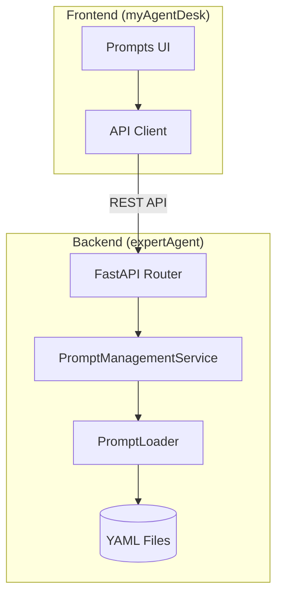

# Prompts Management API 設計方針書

## 概要

Issue #152（要件定義エージェントへのMLOps導入）の一環として、プロンプト管理用のREST APIを実装する。

### 背景
- #177（プロンプトYAML化）にて、プロンプトのYAMLファイル管理とPromptLoaderサービスが実装済み
- #170（UI実装）にて、フロントエンドのPrompts管理画面とAPIクライアントが実装済み
- **しかし、バックエンドのREST APIエンドポイントが未実装**

### 目的
フロントエンドUIからプロンプトの一覧表示、詳細表示、バージョン管理を行えるようにする。

---

## 1. アーキテクチャ設計

### システム構成図


### レイヤー構成
- **プレゼンテーション層**: FastAPI Router (`/v1/prompts`)
- **ビジネスロジック層**: PromptManagementService
- **データアクセス層**: PromptLoader (既存)
- **インフラストラクチャ層**: YAML ファイルシステム

---

## 2. 技術選定

| カテゴリ | 選定技術 | 選定理由 |
|---------|---------|---------|
| API Framework | FastAPI | 既存のExpertAgent基盤と統一 |
| バリデーション | Pydantic | 型安全なリクエスト/レスポンス定義 |
| データストレージ | YAML ファイル | #177で既に実装済み、シンプルな管理 |
| キャッシュ | インメモリキャッシュ | PromptLoaderに既存のPromptCache |

---

## 3. 設計パターン

### 適用パターン
- **Repository パターン**: PromptLoader が YAML ファイルへのアクセスを抽象化
- **Factory パターン**: PromptLoader.create_default() で標準インスタンス生成
- **Service パターン**: PromptManagementService がビジネスロジックを集約

---

## 4. データモデル設計

### 既存YAMLファイル構造
```
expertAgent/prompts/
├── evaluation/
│   └── default.yaml
├── interface_schema/
│   └── default.yaml
├── multi_candidate/
│   └── default.yaml
├── requirement_clarification/
│   └── default.yaml
├── task_breakdown/
│   └── default.yaml
├── validation_fix/
│   └── default.yaml
└── workflow_generation/
    └── default.yaml
```

### Pydantic スキーマ定義

```python
from pydantic import BaseModel
from typing import Optional
from datetime import datetime

class PromptVersion(BaseModel):
    """プロンプトバージョン"""
    id: str                    # バージョン名 (例: "default", "v2")
    version: int               # バージョン番号 (ファイル内のmetadata.version)
    content: str               # プロンプト本文
    description: str           # 説明
    created_at: datetime       # ファイル作成日時
    is_active: bool            # 現在アクティブか

class PromptTemplate(BaseModel):
    """プロンプトテンプレート"""
    id: str                    # プロンプト名 (ディレクトリ名)
    name: str                  # 表示名
    description: str           # 説明
    category: str              # カテゴリ
    current_version: int       # 現在のバージョン番号
    versions: list[PromptVersion]  # バージョン一覧
    created_at: datetime       # 作成日時
    updated_at: datetime       # 更新日時

class PromptListResponse(BaseModel):
    """プロンプト一覧レスポンス"""
    items: list[PromptTemplate]
    total: int
```

---

## 5. API設計

### RESTful エンドポイント

| メソッド | エンドポイント | 説明 |
|---------|--------------|------|
| GET | `/v1/prompts` | プロンプト一覧取得 |
| GET | `/v1/prompts/{prompt_id}` | プロンプト詳細取得 |
| POST | `/v1/prompts/{prompt_id}/versions` | 新バージョン作成 |
| POST | `/v1/prompts/{prompt_id}/versions/{version_id}/activate` | バージョン有効化 |

### 詳細仕様

#### GET /v1/prompts
プロンプトテンプレート一覧を取得

**レスポンス例**:
```json
{
  "items": [
    {
      "id": "requirement_clarification",
      "name": "Requirement Clarification",
      "description": "System prompt for requirement clarification",
      "category": "system",
      "current_version": 1,
      "versions": [
        {
          "id": "default",
          "version": 1,
          "content": "You are a helpful assistant...",
          "description": "Default version",
          "created_at": "2025-01-15T10:00:00Z",
          "is_active": true
        }
      ],
      "created_at": "2025-01-15T10:00:00Z",
      "updated_at": "2025-01-15T10:00:00Z"
    }
  ],
  "total": 7
}
```

#### GET /v1/prompts/{prompt_id}
特定プロンプトの詳細を取得

**パラメータ**:
- `prompt_id`: プロンプト識別子 (例: `requirement_clarification`)

**エラーレスポンス**:
- `404`: プロンプトが見つからない

#### POST /v1/prompts/{prompt_id}/versions
新しいバージョンを作成

**リクエストボディ**:
```json
{
  "content": "Updated prompt content...",
  "description": "Improved version with better examples"
}
```

**注意**: Phase 1では読み取り専用APIとして実装し、書き込みAPIは将来のPhaseで実装する

#### POST /v1/prompts/{prompt_id}/versions/{version_id}/activate
指定バージョンをアクティブ化

**注意**: Phase 1では読み取り専用APIとして実装

---

## 6. セキュリティ設計

### 認証/認可
- 現状: 認証なし（内部ネットワーク利用想定）
- 将来: ExpertAgent共通の認証機構を適用

### バリデーション
- Pydanticによる入力バリデーション
- パストラバーサル攻撃の防止（prompt_idの検証）

---

## 7. パフォーマンス設計

### キャッシング戦略
- PromptLoaderの既存キャッシュ機構を活用
- ファイル変更時はfile_watcherによるキャッシュ無効化

### レスポンス最適化
- 一覧APIでは概要情報のみ返却
- 詳細APIでフルコンテンツを返却

---

## 8. 実装計画

### Phase 1: 読み取り専用API（本Issue）
- `GET /v1/prompts` - プロンプト一覧
- `GET /v1/prompts/{prompt_id}` - プロンプト詳細

### Phase 2: 書き込みAPI（将来Issue）
- `POST /v1/prompts/{prompt_id}/versions` - 新バージョン作成
- `POST /v1/prompts/{prompt_id}/versions/{version_id}/activate` - バージョン有効化

---

## 9. 設計上の決定事項とトレードオフ

### 採用した設計
1. **YAMLファイルベースの永続化**
   - 理由: #177で既に実装済み、Git管理との親和性
   - トレードオフ: データベースと比較して検索機能が限定的

2. **既存PromptLoaderの拡張**
   - 理由: KISS原則、既存コードの再利用
   - トレードオフ: 複雑なクエリには対応しにくい

3. **Phase分割による段階的実装**
   - 理由: YAGNI原則、読み取り機能を優先
   - トレードオフ: 書き込み機能は後回し

### 代替案との比較
| 案 | メリット | デメリット | 採用 |
|----|---------|-----------|------|
| YAMLファイル | シンプル、Git管理可能 | 検索機能が限定的 | ✅ |
| SQLite | 高度な検索、トランザクション | 追加の複雑性 | ❌ |
| Valkey | 高速、キャッシュ統合 | 永続化が別途必要 | ❌ |

---

## 10. テスト計画

### 単体テスト
- PromptManagementService の各メソッド
- APIエンドポイントのバリデーション

### 統合テスト
- エンドポイント → サービス → PromptLoader の連携
- エラーハンドリング

### E2Eテスト
- フロントエンドUIからのAPI呼び出し
- デモモードとのフォールバック確認

---

## 参照

- 親Issue: #152（要件定義エージェントへのMLOps導入）
- 関連Issue: #177（プロンプトYAML化実装）- 完了
- 関連Issue: #170（UI実装）- 完了（フロントエンドPrompts画面）
