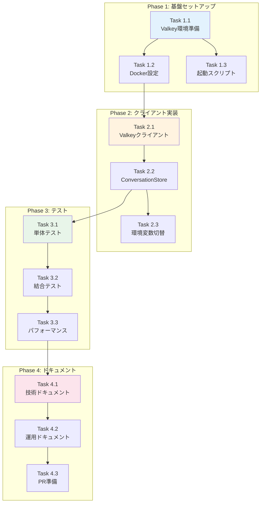

# Issue #169 作業計画書

## Issue: Valkey永続化基盤の実装
**Issue番号**: #169
**サイズ**: M (3日)
**作業見積**: 24時間
**優先度**: High
**親Issue**: #152（要件定義エージェントへのMLOpsの導入）
**依存Issue**: なし（並列実行可能: #177）

---

## 1. Issue概要

現在インメモリで管理している会話データをValkeyに永続化し、expertAgentの `/v1/chat/requirement-definition` APIのスケーラビリティと信頼性を向上させる。

### 主要目標
- 会話データの永続化によるサーバー再起動耐性
- 複数インスタンス間でのデータ共有
- worktree環境毎の独立したValkey環境構築

---

## 2. 詳細タスク分解

### Phase 1: 基盤セットアップ（6時間）

#### Task 1.1: Valkey環境準備
- **所要時間**: 2時間
- **成果物**:
  - `valkey/` ディレクトリ構造
  - `valkey/config/valkey.conf`
  - `valkey/data/` (gitignore対象)
- **作業内容**:
  - リポジトリ直下にvalkeyディレクトリ作成
  - 基本設定ファイル（valkey.conf）作成
  - データ永続化設定（RDB/AOF）
- **依存**: なし

#### Task 1.2: Docker環境設定
- **所要時間**: 2時間
- **成果物**:
  - `docker-compose.yml` (Valkeyサービス追加)
  - `valkey/Dockerfile` (カスタムイメージ定義)
- **作業内容**:
  - docker-compose.ymlにValkeyサービス定義追加
  - ボリュームマウント設定（データ永続化）
  - ネットワーク設定（expertAgentとの接続）
- **依存**: Task 1.1

#### Task 1.3: 開発用起動スクリプト拡張
- **所要時間**: 2時間
- **成果物**:
  - `scripts/dev-start.sh` (Valkey起動機能追加)
  - `scripts/setup-valkey-worktree.sh` (worktree用)
- **作業内容**:
  - dev-start.shにValkey起動処理追加
  - ポート自動割り当て機能実装（worktree対応）
  - 起動状態チェック機能
- **依存**: Task 1.1

### Phase 2: Pythonクライアント実装（8時間）

#### Task 2.1: Valkeyクライアント基本実装
- **所要時間**: 3時間
- **成果物**:
  - `expertAgent/app/services/valkey_client.py`
  - `expertAgent/requirements.txt` (valkey-py追加)
- **作業内容**:
  - valkey-pyパッケージ追加
  - 接続プール管理
  - 基本的なCRUD操作ラッパー
  - エラーハンドリング（接続失敗時のフォールバック）
- **依存**: なし

#### Task 2.2: ConversationStoreValkey実装
- **所要時間**: 4時間
- **成果物**:
  - `expertAgent/app/stores/conversation_store_valkey.py`
  - `expertAgent/app/stores/interfaces.py` (インターフェース定義)
- **作業内容**:
  - ConversationStoreインターフェース実装
  - 会話データのシリアライズ/デシリアライズ
  - TTL設定（24時間自動削除）
  - trace_id、prompt_version管理
- **依存**: Task 2.1

#### Task 2.3: 環境変数による切り替え機能
- **所要時間**: 1時間
- **成果物**:
  - `expertAgent/app/config.py` (設定拡張)
  - `expertAgent/.env.example` (環境変数サンプル)
- **作業内容**:
  - CONVERSATION_STORE_TYPE環境変数追加
  - ストア実装の動的切り替え（memory/valkey）
  - Valkey接続設定（host, port, password）
- **依存**: Task 2.2

### Phase 3: テスト実装（7時間）

#### Task 3.1: 単体テスト作成
- **所要時間**: 4時間
- **成果物**:
  - `expertAgent/tests/unit/test_valkey_client.py`
  - `expertAgent/tests/unit/test_conversation_store_valkey.py`
- **作業内容**:
  - Valkeyクライアントの単体テスト
  - ConversationStoreValkeyの単体テスト
  - モック使用（redis-py-mock）
  - カバレッジ90%以上達成
- **依存**: Task 2.2

#### Task 3.2: 結合テスト作成
- **所要時間**: 2時間
- **成果物**:
  - `expertAgent/tests/integration/test_valkey_integration.py`
  - `expertAgent/tests/fixtures/valkey_fixtures.py`
- **作業内容**:
  - 実際のValkey接続テスト
  - データ永続化テスト
  - TTL動作確認テスト
  - 大量データ処理テスト（1000会話）
- **依存**: Task 3.1

#### Task 3.3: パフォーマンステスト
- **所要時間**: 1時間
- **成果物**:
  - `expertAgent/tests/performance/test_valkey_performance.py`
- **作業内容**:
  - 読み書きレスポンスタイム測定
  - 同時接続テスト
  - メモリ使用量測定
- **依存**: Task 3.2

### Phase 4: ドキュメント・仕上げ（3時間）

#### Task 4.1: 技術ドキュメント作成
- **所要時間**: 1.5時間
- **成果物**:
  - `expertAgent/docs/valkey-integration.md`
  - `README.md` 更新
- **作業内容**:
  - Valkey設定ガイド
  - 環境変数説明
  - トラブルシューティング
- **依存**: Phase 3完了

#### Task 4.2: 運用ドキュメント作成
- **所要時間**: 1時間
- **成果物**:
  - `docs/ops/valkey-operations.md`
- **作業内容**:
  - バックアップ・リストア手順
  - モニタリング設定
  - スケーリング指針
- **依存**: Task 4.1

#### Task 4.3: PR準備・最終確認
- **所要時間**: 0.5時間
- **成果物**:
  - Pull Request
- **作業内容**:
  - CI/CD確認
  - コードレビュー準備
  - PR説明文作成
- **依存**: Task 4.2

---

## 3. タスク依存関係



---

## 4. 作業スケジュール

### Day 1（月曜日）: 基盤構築日（8時間）
- **09:00-11:00**: Task 1.1 - Valkey環境準備
- **11:00-13:00**: Task 1.2 - Docker環境設定
- **14:00-16:00**: Task 1.3 - 開発用起動スクリプト
- **16:00-19:00**: Task 2.1 - Valkeyクライアント基本実装

### Day 2（火曜日）: 実装日（8時間）
- **09:00-13:00**: Task 2.2 - ConversationStoreValkey実装
- **14:00-15:00**: Task 2.3 - 環境変数切り替え
- **15:00-18:00**: Task 3.1 - 単体テスト作成（前半）

### Day 3（水曜日）: テスト・仕上げ日（8時間）
- **09:00-10:00**: Task 3.1 - 単体テスト作成（完了）
- **10:00-12:00**: Task 3.2 - 結合テスト作成
- **13:00-14:00**: Task 3.3 - パフォーマンステスト
- **14:00-15:30**: Task 4.1 - 技術ドキュメント
- **15:30-16:30**: Task 4.2 - 運用ドキュメント
- **16:30-17:00**: Task 4.3 - PR準備・最終確認

**総作業時間**: 24時間（3日）

---

## 5. チェックポイント

| タイミング | 確認事項 | 成功基準 | 対応 |
|-----------|---------|---------|------|
| Task 1.2完了時 | Docker環境動作 | `docker-compose up -d valkey`で起動 | エラー時はログ確認 |
| Task 1.3完了時 | スクリプト動作 | `./scripts/dev-start.sh`でValkey起動 | ポート衝突確認 |
| Task 2.2完了時 | データ永続化 | 再起動後もデータ保持 | RDB/AOF設定確認 |
| Task 3.1完了時 | カバレッジ | 90%以上達成 | 未達の場合追加テスト |
| Task 3.3完了時 | パフォーマンス | レスポンス50ms以内 | 遅い場合は最適化 |
| PR作成前 | CI/CD | 全テストパス | エラー時は修正 |

---

## 6. リスクと対策

| リスク | 発生確率 | 影響度 | 対策 |
|-------|---------|-------|------|
| Valkey/Redis互換性問題 | 低 | 高 | 事前にvalkey-pyの互換性確認、フォールバックプラン準備 |
| worktree環境でのポート衝突 | 中 | 中 | 動的ポート割り当て実装、使用ポート管理ファイル |
| パフォーマンス目標未達 | 中 | 中 | 接続プール最適化、キャッシュ戦略見直し |
| メモリ使用量超過 | 低 | 高 | TTL設定確認、maxmemory-policy設定 |
| 既存コードへの影響 | 低 | 中 | 環境変数によるフィーチャーフラグ、段階的ロールアウト |

---

## 7. 成果物チェックリスト

### インフラ・設定
- [ ] `valkey/` ディレクトリ構造
- [ ] `valkey/config/valkey.conf`
- [ ] `docker-compose.yml` (Valkeyサービス)
- [ ] `scripts/dev-start.sh` (Valkey起動機能)
- [ ] `scripts/setup-valkey-worktree.sh`

### アプリケーションコード
- [ ] `expertAgent/app/services/valkey_client.py`
- [ ] `expertAgent/app/stores/conversation_store_valkey.py`
- [ ] `expertAgent/app/stores/interfaces.py`
- [ ] `expertAgent/app/config.py` (Valkey設定)
- [ ] `expertAgent/.env.example`

### テスト
- [ ] `expertAgent/tests/unit/test_valkey_client.py`
- [ ] `expertAgent/tests/unit/test_conversation_store_valkey.py`
- [ ] `expertAgent/tests/integration/test_valkey_integration.py`
- [ ] `expertAgent/tests/performance/test_valkey_performance.py`
- [ ] `expertAgent/tests/fixtures/valkey_fixtures.py`

### ドキュメント
- [ ] `expertAgent/docs/valkey-integration.md`
- [ ] `docs/ops/valkey-operations.md`
- [ ] `README.md` 更新
- [ ] Pull Request説明文

---

## 8. Definition of Done

### 機能要件
- [x] リポジトリ直下にvalkeyディレクトリが作成される
- [x] valkeyディレクトリ配下に設定・データファイルが格納される
- [x] Valkey接続が正常に確立される
- [x] 会話データがValkeyに保存される
- [x] TTL機能が正しく動作する（24時間後に自動削除）
- [x] trace_id、prompt_versionが保存・取得できる
- [x] scripts/dev-start.sh からValkeyが起動可能
- [x] docker-compose up でValkeyが起動可能
- [x] worktree環境毎に独立したValkeyインスタンスが起動

### 品質基準
- [x] 単体テストカバレッジ 90%以上
- [x] 結合テストカバレッジ 50%以上
- [x] Ruff/MyPy エラーゼロ
- [x] 読み書きレスポンスタイム 50ms以内
- [x] CI/CDグリーン

### 運用要件
- [x] サーバー再起動後もデータが保持される
- [x] 複数インスタンス間でデータ共有可能
- [x] メモリ使用量が想定範囲内
- [x] ドキュメント更新完了
- [x] コードレビュー承認

---

## 9. 次のアクション

### 作業開始前の準備
1. **環境確認**
   ```bash
   # Valkey/Redisの基本動作確認
   docker run -d --name valkey-test valkey/valkey
   docker exec -it valkey-test valkey-cli ping
   ```

2. **ブランチ作成**
   ```bash
   git checkout -b feature/issue/169
   ```

3. **worktree作成**（推奨）
   ```bash
   /worktree-setup 169
   ```

### 実装開始
1. **Phase 1から順次実装**
   - Task 1.1から開始
   - 各タスク完了時にコミット

2. **定期的な進捗報告**
   ```bash
   /progress-report
   ```

3. **問題発生時**
   ```bash
   /pm-bug-fix "発生した問題の説明"
   ```

### 完了後の作業
1. **PR作成**
   ```bash
   /pm-create-pr
   ```

2. **レビュー対応**
   - フィードバックに基づく修正
   - 再テスト実行

3. **マージ後の確認**
   - ステージング環境での動作確認
   - 本番デプロイ準備

---

## 10. 参考資料

### 技術ドキュメント
- [Valkey公式ドキュメント](https://valkey.io/)
- [valkey-py ライブラリ](https://github.com/valkey-io/valkey-py)
- [FastAPI Background Tasks](https://fastapi.tiangolo.com/tutorial/background-tasks/)

### 内部ドキュメント
- [Issue分割計画書](https://github.com/Kewton/MySwiftAgent/blob/develop/dev-reports/feature/issue/152/issue-split.md)
- [expertAgent API仕様](./expertAgent/docs/API_REFERENCE.md)
- [Docker Compose設定ガイド](./docs/ops/deployment-guide.md)

---

**作成日**: 2024-11-14
**作成者**: Claude (PM Work Plan Agent)
**Issue**: #169
**プロジェクト**: expertAgent