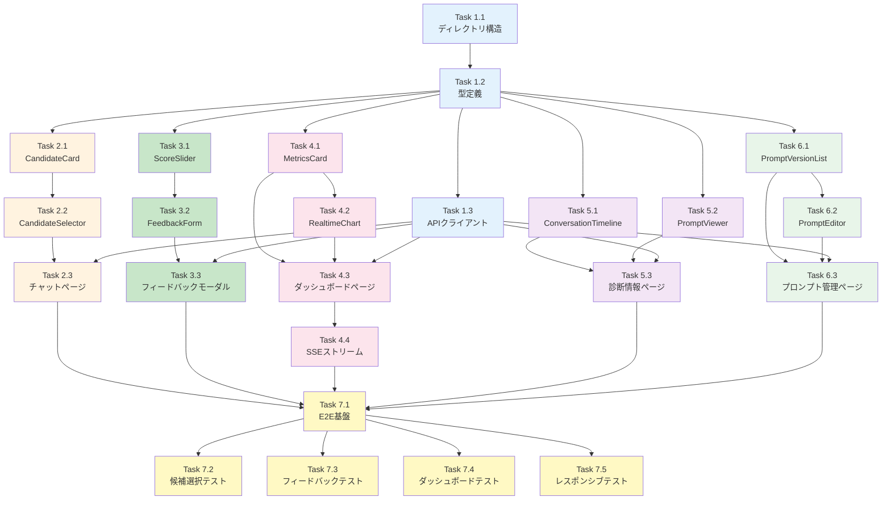

# Issue #170: UI実装（フロントエンド統合） - 作業計画書

## Issue概要

**Issue番号**: #170
**タイトル**: Issue #152-10: UI実装（フロントエンド統合）
**サイズ**: L (5日)
**作業見積**: 40時間
**優先度**: Medium
**Phase**: Phase 6（UI統合）
**親Issue**: #152

### 依存関係
- **依存先**:
  - #171（診断情報取得API） - 診断情報ビュー用API
  - #172（フィードバックAPI） - フィードバックフォーム用API
  - #173（複数候補提示機能） - 候補選択UI用API
  - #174（AI推奨システム） - AI推奨表示用API
  - #175（品質可視化API） - ダッシュボード用API
  - #176（リアルタイムダッシュボード） - SSEストリーミング
- **ブロック対象**: なし

### スコープ（受入基準より）
- [ ] 候補選択UI実装
- [ ] フィードバックフォーム実装
- [ ] ダッシュボード画面実装
- [ ] 診断情報ビュー実装
- [ ] プロンプト管理画面実装
- [ ] E2Eテスト作成

### 採用UIパターン
**パターンD: 革新的・実験的**（Issue分割計画書より）
- FR-1: 複数候補提示機能（AI推奨システム付き）
- FR-2: フィードバック機能（スマートフィードバック）
- FR-3: リアルタイムダッシュボード
- FR-4: 診断情報（統合ビュー）
- FR-5: プロンプト管理（バージョン切り替え）
- FR-6: ABテスト機能（統計的有意性検定）

---

## 詳細タスク分解

### Phase 1: 基盤・コンポーネント設計（6時間）

- [ ] **Task 1.1**: ディレクトリ構造設計・作成
  - 所要時間: 1.5時間
  - 成果物: `myAgentDesk/src/routes/mlops/`, `myAgentDesk/src/lib/mlops/`
  - 依存: なし
  - 内容:
    ```
    myAgentDesk/src/
    ├── routes/
    │   └── mlops/                    # MLOps機能ルート
    │       ├── +layout.svelte        # 共通レイアウト
    │       ├── +page.svelte          # ダッシュボード（ホーム）
    │       ├── chat/                 # チャット（候補選択）
    │       ├── diagnostics/          # 診断情報
    │       ├── prompts/              # プロンプト管理
    │       └── ab-tests/             # ABテスト（将来）
    └── lib/
        └── mlops/
            ├── components/           # MLOps専用コンポーネント
            ├── stores/               # 状態管理
            ├── api/                  # API クライアント
            └── types/                # TypeScript型定義
    ```

- [ ] **Task 1.2**: TypeScript型定義
  - 所要時間: 2時間
  - 成果物: `myAgentDesk/src/lib/mlops/types/index.ts`
  - 依存: Task 1.1
  - 内容:
    ```typescript
    // 必要な型定義
    - Candidate: 要件候補
    - FeedbackScore: フィードバックスコア
    - DiagnosticInfo: 診断情報
    - QualityMetrics: 品質メトリクス
    - PromptVersion: プロンプトバージョン
    - AIRecommendation: AI推奨
    - RealtimeMetrics: リアルタイムメトリクス
    ```

- [ ] **Task 1.3**: APIクライアント実装
  - 所要時間: 2.5時間
  - 成果物: `myAgentDesk/src/lib/mlops/api/client.ts`
  - 依存: Task 1.2
  - 内容:
    - expertAgent API統合
    - エラーハンドリング
    - リトライロジック
    - SSEクライアント（リアルタイムダッシュボード用）

### Phase 2: 候補選択UI実装（6時間）

- [ ] **Task 2.1**: CandidateCard コンポーネント
  - 所要時間: 2時間
  - 成果物: `myAgentDesk/src/lib/mlops/components/CandidateCard.svelte`
  - 依存: Task 1.2
  - 内容:
    - 4つの観点表示（ユーザー層、要件スコープ、技術制約、成功指標）
    - AI推奨バッジ表示
    - 選択状態のビジュアルフィードバック
    - アニメーション効果

- [ ] **Task 2.2**: CandidateSelector コンポーネント
  - 所要時間: 2時間
  - 成果物: `myAgentDesk/src/lib/mlops/components/CandidateSelector.svelte`
  - 依存: Task 2.1
  - 内容:
    - 2つの候補カード表示
    - 選択ロジック
    - AI推奨理由のツールチップ
    - 選択確定ボタン

- [ ] **Task 2.3**: チャットページ統合
  - 所要時間: 2時間
  - 成果物: `myAgentDesk/src/routes/mlops/chat/+page.svelte`
  - 依存: Task 2.2, Task 1.3
  - 内容:
    - SSEストリーミング対応
    - 候補選択フロー
    - 会話継続処理
    - ローディング状態管理

### Phase 3: フィードバックフォーム実装（5時間）

- [ ] **Task 3.1**: ScoreSlider コンポーネント
  - 所要時間: 1.5時間
  - 成果物: `myAgentDesk/src/lib/mlops/components/ScoreSlider.svelte`
  - 依存: Task 1.2
  - 内容:
    - 1-5スコアスライダー
    - ラベル表示（要件明確性、追加質問の適切さ等）
    - ビジュアルフィードバック

- [ ] **Task 3.2**: FeedbackForm コンポーネント
  - 所要時間: 2時間
  - 成果物: `myAgentDesk/src/lib/mlops/components/FeedbackForm.svelte`
  - 依存: Task 3.1
  - 内容:
    - 4種類のスコア入力（requirement_clarity等）
    - コメント欄（オプション）
    - 送信処理
    - 送信成功/失敗フィードバック

- [ ] **Task 3.3**: フィードバックモーダル統合
  - 所要時間: 1.5時間
  - 成果物: `myAgentDesk/src/lib/mlops/components/FeedbackModal.svelte`
  - 依存: Task 3.2, Task 1.3
  - 内容:
    - モーダルオープン/クローズ
    - API送信
    - 成功時のトースト通知

### Phase 4: ダッシュボード画面実装（8時間）

- [ ] **Task 4.1**: MetricsCard コンポーネント
  - 所要時間: 1.5時間
  - 成果物: `myAgentDesk/src/lib/mlops/components/MetricsCard.svelte`
  - 依存: Task 1.2
  - 内容:
    - KPI表示（平均スコア、対話ターン数、完了率）
    - トレンドアイコン（上昇/下降）
    - カラー指標

- [ ] **Task 4.2**: RealtimeChart コンポーネント
  - 所要時間: 2.5時間
  - 成果物: `myAgentDesk/src/lib/mlops/components/RealtimeChart.svelte`
  - 依存: Task 4.1
  - 内容:
    - Chart.js統合
    - リアルタイム更新（SSE）
    - 時間軸スクロール
    - 複数メトリクスライン

- [ ] **Task 4.3**: ダッシュボードページ実装
  - 所要時間: 2時間
  - 成果物: `myAgentDesk/src/routes/mlops/+page.svelte`
  - 依存: Task 4.1, Task 4.2, Task 1.3
  - 内容:
    - メトリクスカード4枚配置
    - リアルタイムチャート
    - 期間セレクター（7日/30日/90日）
    - フィルター（モデル別）

- [ ] **Task 4.4**: SSEストリーム統合
  - 所要時間: 2時間
  - 成果物: `myAgentDesk/src/lib/mlops/stores/realtimeStore.ts`
  - 依存: Task 4.3
  - 内容:
    - EventSource管理
    - 再接続ロジック
    - Svelteストア統合
    - メモリリーク対策（クリーンアップ）

### Phase 5: 診断情報ビュー実装（5時間）

- [ ] **Task 5.1**: ConversationTimeline コンポーネント
  - 所要時間: 2時間
  - 成果物: `myAgentDesk/src/lib/mlops/components/ConversationTimeline.svelte`
  - 依存: Task 1.2
  - 内容:
    - ユーザー/アシスタントメッセージ表示
    - タイムスタンプ
    - トークン使用量表示
    - 展開/折りたたみ

- [ ] **Task 5.2**: PromptViewer コンポーネント
  - 所要時間: 1.5時間
  - 成果物: `myAgentDesk/src/lib/mlops/components/PromptViewer.svelte`
  - 依存: Task 1.2
  - 内容:
    - システムプロンプト表示
    - シンタックスハイライト
    - コピーボタン

- [ ] **Task 5.3**: 診断情報ページ実装
  - 所要時間: 1.5時間
  - 成果物: `myAgentDesk/src/routes/mlops/diagnostics/+page.svelte`
  - 依存: Task 5.1, Task 5.2, Task 1.3
  - 内容:
    - conversation_id検索
    - 会話タイムライン
    - プロンプト表示
    - Langfuseリンク

### Phase 6: プロンプト管理画面実装（5時間）

- [ ] **Task 6.1**: PromptVersionList コンポーネント
  - 所要時間: 2時間
  - 成果物: `myAgentDesk/src/lib/mlops/components/PromptVersionList.svelte`
  - 依存: Task 1.2
  - 内容:
    - バージョン一覧表示
    - 現在のアクティブバージョンバッジ
    - バージョン切り替えボタン

- [ ] **Task 6.2**: PromptEditor コンポーネント
  - 所要時間: 1.5時間
  - 成果物: `myAgentDesk/src/lib/mlops/components/PromptEditor.svelte`
  - 依存: Task 6.1
  - 内容:
    - YAMLエディタ（読み取り専用）
    - バージョン比較ビュー
    - コピーボタン

- [ ] **Task 6.3**: プロンプト管理ページ実装
  - 所要時間: 1.5時間
  - 成果物: `myAgentDesk/src/routes/mlops/prompts/+page.svelte`
  - 依存: Task 6.1, Task 6.2, Task 1.3
  - 内容:
    - プロンプト一覧
    - バージョン詳細
    - ホットリロード状態表示

### Phase 7: E2Eテスト作成（5時間）

- [ ] **Task 7.1**: Playwright設定・基盤
  - 所要時間: 1時間
  - 成果物: `myAgentDesk/tests/e2e/mlops.spec.ts`
  - 依存: Phase 2-6完了
  - 内容:
    - テスト設定
    - ヘルパー関数
    - モックサーバー設定

- [ ] **Task 7.2**: 候補選択E2Eテスト
  - 所要時間: 1時間
  - 成果物: `myAgentDesk/tests/e2e/mlops/candidate-selection.spec.ts`
  - テストケース:
    - 候補表示確認
    - 選択操作
    - 会話継続

- [ ] **Task 7.3**: フィードバックE2Eテスト
  - 所要時間: 1時間
  - 成果物: `myAgentDesk/tests/e2e/mlops/feedback.spec.ts`
  - テストケース:
    - フォーム表示
    - スコア入力
    - 送信成功

- [ ] **Task 7.4**: ダッシュボードE2Eテスト
  - 所要時間: 1時間
  - 成果物: `myAgentDesk/tests/e2e/mlops/dashboard.spec.ts`
  - テストケース:
    - メトリクス表示
    - チャート描画
    - フィルター操作

- [ ] **Task 7.5**: レスポンシブ・アクセシビリティテスト
  - 所要時間: 1時間
  - 成果物: `myAgentDesk/tests/e2e/mlops/responsive.spec.ts`
  - テストケース:
    - モバイル表示
    - タブレット表示
    - キーボードナビゲーション
    - スクリーンリーダー対応

---

## タスク依存関係



---

## 作業スケジュール

### Day 1 (8時間)

| 時間 | タスク | 成果物 |
|------|--------|--------|
| 09:00-10:30 | Task 1.1: ディレクトリ構造設計 | `routes/mlops/`, `lib/mlops/` |
| 10:30-12:30 | Task 1.2: TypeScript型定義 | `types/index.ts` |
| 13:30-16:00 | Task 1.3: APIクライアント実装 | `api/client.ts` |
| 16:00-18:00 | Task 2.1: CandidateCard | `components/CandidateCard.svelte` |

### Day 2 (8時間)

| 時間 | タスク | 成果物 |
|------|--------|--------|
| 09:00-11:00 | Task 2.2: CandidateSelector | `components/CandidateSelector.svelte` |
| 11:00-13:00 | Task 2.3: チャットページ | `routes/mlops/chat/+page.svelte` |
| 14:00-15:30 | Task 3.1: ScoreSlider | `components/ScoreSlider.svelte` |
| 15:30-17:30 | Task 3.2: FeedbackForm | `components/FeedbackForm.svelte` |
| 17:30-19:00 | Task 3.3: フィードバックモーダル | `components/FeedbackModal.svelte` |

### Day 3 (8時間)

| 時間 | タスク | 成果物 |
|------|--------|--------|
| 09:00-10:30 | Task 4.1: MetricsCard | `components/MetricsCard.svelte` |
| 10:30-13:00 | Task 4.2: RealtimeChart | `components/RealtimeChart.svelte` |
| 14:00-16:00 | Task 4.3: ダッシュボードページ | `routes/mlops/+page.svelte` |
| 16:00-18:00 | Task 4.4: SSEストリーム統合 | `stores/realtimeStore.ts` |

### Day 4 (8時間)

| 時間 | タスク | 成果物 |
|------|--------|--------|
| 09:00-11:00 | Task 5.1: ConversationTimeline | `components/ConversationTimeline.svelte` |
| 11:00-12:30 | Task 5.2: PromptViewer | `components/PromptViewer.svelte` |
| 13:30-15:00 | Task 5.3: 診断情報ページ | `routes/mlops/diagnostics/+page.svelte` |
| 15:00-17:00 | Task 6.1: PromptVersionList | `components/PromptVersionList.svelte` |
| 17:00-18:30 | Task 6.2: PromptEditor | `components/PromptEditor.svelte` |

### Day 5 (8時間)

| 時間 | タスク | 成果物 |
|------|--------|--------|
| 09:00-10:30 | Task 6.3: プロンプト管理ページ | `routes/mlops/prompts/+page.svelte` |
| 10:30-11:30 | Task 7.1: E2E基盤 | `tests/e2e/mlops.spec.ts` |
| 11:30-12:30 | Task 7.2: 候補選択テスト | `tests/e2e/mlops/candidate-selection.spec.ts` |
| 13:30-14:30 | Task 7.3: フィードバックテスト | `tests/e2e/mlops/feedback.spec.ts` |
| 14:30-15:30 | Task 7.4: ダッシュボードテスト | `tests/e2e/mlops/dashboard.spec.ts` |
| 15:30-16:30 | Task 7.5: レスポンシブテスト | `tests/e2e/mlops/responsive.spec.ts` |
| 16:30-18:00 | 静的解析・最終確認 | TypeScript/ESLint/Lighthouse |

**総作業時間**: 40時間（5日）

---

## チェックポイント

| タイミング | 確認事項 | 対応 |
|-----------|---------|------|
| Day 1終了時 | 型定義とAPIクライアント動作確認 | curl/Postmanでモック確認 |
| Day 2終了時 | 候補選択・フィードバックUI動作確認 | 手動テスト実施 |
| Day 3終了時 | ダッシュボードSSE動作確認 | リアルタイム更新確認 |
| Day 4終了時 | 全画面の基本動作確認 | 画面遷移確認 |
| Day 5終了時 | E2Eテスト全パス | カバレッジ70%確認 |
| PR作成前 | Lighthouse 90以上 | パフォーマンス最適化 |

---

## リスクと対策

| リスク | 発生確率 | 影響 | 対策 |
|-------|---------|------|------|
| SSEストリーム不安定 | 中 | ダッシュボード不動 | ポーリングフォールバック実装 |
| Chart.js パフォーマンス | 中 | 描画遅延 | データポイント制限、デシメーション |
| 依存API未完了 | 高 | 統合不可 | モックAPI先行、後から差し替え |
| レスポンシブ対応漏れ | 低 | モバイル表示崩れ | Tailwind breakpoint活用 |
| TypeScriptエラー | 低 | ビルド失敗 | strict modeで早期検出 |

---

## 技術設計メモ

### 1. ディレクトリ構造

```
myAgentDesk/src/
├── routes/
│   └── mlops/
│       ├── +layout.svelte         # サイドバー・ヘッダー
│       ├── +page.svelte           # ダッシュボード（ホーム）
│       ├── +page.ts               # ダッシュボードデータローダー
│       ├── chat/
│       │   ├── +page.svelte       # 候補選択チャット
│       │   └── +page.ts
│       ├── diagnostics/
│       │   ├── +page.svelte       # 診断情報
│       │   └── +page.ts
│       └── prompts/
│           ├── +page.svelte       # プロンプト管理
│           └── +page.ts
└── lib/
    └── mlops/
        ├── components/
        │   ├── CandidateCard.svelte
        │   ├── CandidateSelector.svelte
        │   ├── ScoreSlider.svelte
        │   ├── FeedbackForm.svelte
        │   ├── FeedbackModal.svelte
        │   ├── MetricsCard.svelte
        │   ├── RealtimeChart.svelte
        │   ├── ConversationTimeline.svelte
        │   ├── PromptViewer.svelte
        │   ├── PromptVersionList.svelte
        │   └── PromptEditor.svelte
        ├── stores/
        │   ├── chatStore.ts
        │   ├── feedbackStore.ts
        │   ├── metricsStore.ts
        │   └── realtimeStore.ts
        ├── api/
        │   └── client.ts
        └── types/
            └── index.ts
```

### 2. APIクライアント設計

```typescript
// src/lib/mlops/api/client.ts
import type { Candidate, FeedbackScore, DiagnosticInfo, QualityMetrics } from '../types';

const BASE_URL = import.meta.env.VITE_EXPERT_AGENT_URL || 'http://localhost:8104/aiagent-api';

export class MLOpsApiClient {
  // 候補取得
  async getCandidates(conversationId: string): Promise<Candidate[]> {...}

  // 候補選択
  async selectCandidate(conversationId: string, candidateId: string): Promise<void> {...}

  // フィードバック送信
  async submitFeedback(conversationId: string, scores: FeedbackScore): Promise<void> {...}

  // 診断情報取得
  async getDiagnostics(conversationId: string): Promise<DiagnosticInfo> {...}

  // メトリクス取得
  async getMetrics(days: number): Promise<QualityMetrics> {...}

  // リアルタイムストリーム
  subscribeToMetrics(callback: (data: RealtimeMetrics) => void): () => void {...}

  // プロンプトバージョン一覧
  async getPromptVersions(): Promise<PromptVersion[]> {...}
}
```

### 3. SSEストリーム実装

```typescript
// src/lib/mlops/stores/realtimeStore.ts
import { writable } from 'svelte/store';
import type { RealtimeMetrics } from '../types';

function createRealtimeStore() {
  const { subscribe, set, update } = writable<RealtimeMetrics | null>(null);
  let eventSource: EventSource | null = null;

  return {
    subscribe,
    connect: (url: string) => {
      if (eventSource) eventSource.close();

      eventSource = new EventSource(url);

      eventSource.onmessage = (event) => {
        const data = JSON.parse(event.data);
        set(data);
      };

      eventSource.onerror = () => {
        // 再接続ロジック
        setTimeout(() => this.connect(url), 5000);
      };
    },
    disconnect: () => {
      if (eventSource) {
        eventSource.close();
        eventSource = null;
      }
    }
  };
}

export const realtimeMetrics = createRealtimeStore();
```

---

## 成果物チェックリスト

### コード（コンポーネント）
- [ ] `myAgentDesk/src/lib/mlops/components/CandidateCard.svelte`
- [ ] `myAgentDesk/src/lib/mlops/components/CandidateSelector.svelte`
- [ ] `myAgentDesk/src/lib/mlops/components/ScoreSlider.svelte`
- [ ] `myAgentDesk/src/lib/mlops/components/FeedbackForm.svelte`
- [ ] `myAgentDesk/src/lib/mlops/components/FeedbackModal.svelte`
- [ ] `myAgentDesk/src/lib/mlops/components/MetricsCard.svelte`
- [ ] `myAgentDesk/src/lib/mlops/components/RealtimeChart.svelte`
- [ ] `myAgentDesk/src/lib/mlops/components/ConversationTimeline.svelte`
- [ ] `myAgentDesk/src/lib/mlops/components/PromptViewer.svelte`
- [ ] `myAgentDesk/src/lib/mlops/components/PromptVersionList.svelte`
- [ ] `myAgentDesk/src/lib/mlops/components/PromptEditor.svelte`

### コード（ページ）
- [ ] `myAgentDesk/src/routes/mlops/+layout.svelte`
- [ ] `myAgentDesk/src/routes/mlops/+page.svelte`
- [ ] `myAgentDesk/src/routes/mlops/chat/+page.svelte`
- [ ] `myAgentDesk/src/routes/mlops/diagnostics/+page.svelte`
- [ ] `myAgentDesk/src/routes/mlops/prompts/+page.svelte`

### コード（ユーティリティ）
- [ ] `myAgentDesk/src/lib/mlops/types/index.ts`
- [ ] `myAgentDesk/src/lib/mlops/api/client.ts`
- [ ] `myAgentDesk/src/lib/mlops/stores/realtimeStore.ts`

### テスト
- [ ] `myAgentDesk/tests/e2e/mlops/candidate-selection.spec.ts`
- [ ] `myAgentDesk/tests/e2e/mlops/feedback.spec.ts`
- [ ] `myAgentDesk/tests/e2e/mlops/dashboard.spec.ts`
- [ ] `myAgentDesk/tests/e2e/mlops/responsive.spec.ts`

---

## Definition of Done

Issue完了条件：
- [ ] すべてのタスクが完了
- [ ] 全6機能のUIが実装される（候補選択、フィードバック、ダッシュボード、診断情報、プロンプト管理）
- [ ] APIとの通信が正常
- [ ] レスポンシブデザイン対応（モバイル/タブレット/デスクトップ）
- [ ] アクセシビリティ対応（キーボードナビゲーション、ARIA）
- [ ] E2Eテストカバレッジ70%以上
- [ ] Lighthouseスコア90以上
- [ ] TypeScriptエラーゼロ
- [ ] ESLintエラーゼロ
- [ ] CI/CDグリーン

### 受入基準（自動検証）
- [ ] 正常系: 全機能の操作フロー動作確認
- [ ] 異常系: APIエラー処理（トースト表示、リトライ）
- [ ] エッジケース: モバイル表示（320px〜）

### 受入基準（手動検証）
- [ ] 操作が直感的
- [ ] デザインが革新的（パターンD）
- [ ] パフォーマンスが良好

---

## 次のアクション

作業計画承認後：
1. **worktree作成**: `/worktree-setup 170`
2. **依存確認**: #171〜#176の完了状態確認（または先行してモックAPI作成）
3. **開発開始**: Task 1.1からディレクトリ構造作成開始
4. **進捗報告**: `/progress-report`で定期報告

---

## 参照ドキュメント

- [Issue分割計画書](../152/issue-split.md)
- [UIモックアップサマリー](../152/ui-mockup-summary.md)
- [品質基準](../../../docs/claude/04-quality-standards.md)
- [開発ワークフロー](../../../docs/claude/01-development-workflow.md)
- [既存モックアップ（パターンD）](../../../../myAgentDesk/src/routes/(preview)/mockups/feature-152/pattern-d/)

---

**作成日**: 2025-11-27
**作成者**: Claude Code
