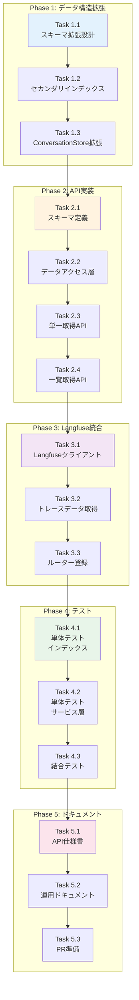

# Issue #171 作業計画書

## Issue: 診断情報取得API実装（拡張版）

**Issue番号**: #171 (Issue #152-2)
**サイズ**: L (3日)
**作業見積**: 24時間
**優先度**: High
**親Issue**: #152（要件定義エージェントへのMLOps導入）
**依存Issue**: #169（Valkey永続化インフラ実装）- ✅ 完了済み

---

## 1. Issue概要

conversation_idからプロンプト・LLMレスポンス・トークン使用量を取得し、**job/user/project/workflow単位での分析を可能にする**診断APIを実装します。これにより、expertAgentの会話データの可観測性（Observability）を実現し、MLOps基盤として必要な分析機能を提供します。

### 主要目標
- 診断情報取得APIエンドポイントの実装（単一 + 一覧）
- Job/User/Project/Workflow単位での分析基盤構築
- Langfuseトレーシング統合とタグ付け
- セカンダリインデックスによる高速検索
- パフォーマンス最適化（単一取得1秒、一覧取得2秒以内）

### 拡張要件の背景

MLOps基盤として以下の分析が必要：
- **Job単位**: ジョブ全体のコスト分析、品質評価
- **User単位**: ユーザー別使用量、パターン分析
- **Project単位**: プロジェクト別コスト集計、ROI計算
- **Workflow単位**: ワークフロー実行の追跡、最適化

---

## 2. 詳細タスク分解

### Phase 1: データ構造拡張・設計（6時間）

#### Task 1.1: Valkeyメタデータスキーマ拡張設計
- **所要時間**: 2時間
- **成果物**:
  - `expertAgent/app/schemas/conversation_metadata.py`
  - データ構造設計書
- **作業内容**:
  - ConversationMetadataスキーマ定義（job_id, user_id, project_id, workflow_id追加）
  - セカンダリインデックス戦略設計（Redis SET使用）
  - 後方互換性保証の設計
  - メタデータ取得元の明確化
- **依存**: なし

#### Task 1.2: セカンダリインデックス実装
- **所要時間**: 2時間
- **成果物**:
  - `expertAgent/app/stores/conversation_store_valkey.py`（拡張）
  - `expertAgent/app/services/index_manager.py`
- **作業内容**:
  - job_index:{job_id} -> Set[conversation_id]
  - user_index:{user_id} -> Set[conversation_id]
  - project_index:{project_id} -> Set[conversation_id]
  - workflow_index:{workflow_id} -> Set[conversation_id]
  - date_index:{YYYY-MM-DD} -> Set[conversation_id]
  - インデックス更新・削除ロジック
- **依存**: Task 1.1

#### Task 1.3: ConversationStore拡張実装
- **所要時間**: 2時間
- **成果物**:
  - `expertAgent/app/stores/interfaces.py`（拡張）
  - `expertAgent/app/stores/conversation_store_valkey.py`（拡張）
- **作業内容**:
  - list_conversations()メソッド追加
  - フィルタリング機能実装
  - ページネーション実装
  - 後方互換性テスト
- **依存**: Task 1.2

### Phase 2: 診断API実装（8時間）

#### Task 2.1: スキーマ定義
- **所要時間**: 2時間
- **成果物**:
  - `expertAgent/app/schemas/diagnostic.py`
- **作業内容**:
  - DiagnosticInfoスキーマ定義（拡張メタデータ含む）
  - DiagnosticListResponseスキーマ定義
  - DiagnosticFilterParamsスキーマ定義（job_id, user_id, project_id, workflow_id, start_date, end_date, limit, offset）
  - MessageTurnスキーマ定義
  - TokenUsageスキーマ定義
  - PaginationMetadataスキーマ定義
- **依存**: Task 1.3

#### Task 2.2: データアクセス層実装
- **所要時間**: 2時間
- **成果物**:
  - `expertAgent/app/services/conversation_service.py`
- **作業内容**:
  - Valkeyからの会話データ取得ロジック
  - インデックス経由のフィルタリング
  - ページネーション処理
  - データ変換ロジック（Valkey → Pydanticモデル）
- **依存**: Task 2.1

#### Task 2.3: エンドポイント実装（単一取得）
- **所要時間**: 2時間
- **成果物**:
  - `expertAgent/app/api/v1/diagnostic_endpoints.py`
- **作業内容**:
  - `GET /v1/chat/diagnostics/{conversation_id}` 実装
  - リクエストバリデーション
  - レスポンス生成
  - エラーハンドリング（404, 500）
  - ロギング実装
- **依存**: Task 2.2

#### Task 2.4: エンドポイント実装（一覧取得）
- **所要時間**: 2時間
- **成果物**:
  - `expertAgent/app/api/v1/diagnostic_endpoints.py`（拡張）
- **作業内容**:
  - `GET /v1/chat/diagnostics` 実装
  - クエリパラメータ処理（job_id, user_id, project_id, workflow_id, start_date, end_date）
  - ページネーション実装（limit, offset）
  - レスポンス生成（メタデータ含む）
  - パフォーマンス最適化
- **依存**: Task 2.3

### Phase 3: Langfuse統合拡張（4時間）

#### Task 3.1: Langfuseクライアント拡張
- **所要時間**: 1時間
- **成果物**:
  - `expertAgent/app/services/langfuse_service.py`（拡張）
- **作業内容**:
  - タグ付け機能実装（job_id, user_id, project_id, workflow_id）
  - メタデータ同期機能
  - トレースフィルタリング機能
- **依存**: Task 2.4

#### Task 3.2: トレースデータ取得拡張
- **所要時間**: 2時間
- **成果物**:
  - `expertAgent/app/services/langfuse_service.py`（拡張）
  - `expertAgent/app/services/diagnostic_aggregator.py`（拡張）
- **作業内容**:
  - タグベースのトレース検索
  - バッチ取得最適化
  - トークン使用量集計（Job単位、User単位）
  - キャッシュ戦略実装
- **依存**: Task 3.1

#### Task 3.3: ルーター登録・main.py統合
- **所要時間**: 1時間
- **成果物**:
  - `expertAgent/app/main.py`（更新）
- **作業内容**:
  - diagnostic_endpointsルーター登録
  - OpenAPI仕様生成確認
  - 起動テスト
- **依存**: Task 3.2

### Phase 4: テスト実装（6時間）

#### Task 4.1: 単体テスト実装（インデックス・ストア）
- **所要時間**: 2時間
- **成果物**:
  - `expertAgent/tests/unit/test_index_manager.py`
  - `expertAgent/tests/unit/test_conversation_store_valkey_extended.py`
- **作業内容**:
  - セカンダリインデックステスト
  - list_conversations()テスト
  - フィルタリングロジックテスト
  - ページネーションテスト
  - 後方互換性テスト
- **依存**: Task 3.3
- **カバレッジ目標**: 90%以上

#### Task 4.2: 単体テスト実装（サービス層・API）
- **所要時間**: 2時間
- **成果物**:
  - `expertAgent/tests/unit/test_conversation_service.py`
  - `expertAgent/tests/unit/test_langfuse_service_extended.py`
  - `expertAgent/tests/unit/test_diagnostic_aggregator.py`
- **作業内容**:
  - Valkeyモック実装
  - Langfuseモック実装
  - フィルタリングテスト（job_id, user_id, project_id, workflow_id）
  - ページネーションテスト
  - エラーハンドリングテスト
- **依存**: Task 4.1
- **カバレッジ目標**: 90%以上

#### Task 4.3: 結合テスト実装
- **所要時間**: 2時間
- **成果物**:
  - `expertAgent/tests/integration/test_diagnostic_api.py`
  - `expertAgent/tests/fixtures/diagnostic_fixtures.py`
- **作業内容**:
  - エンドツーエンドテスト（単一取得）
  - エンドツーエンドテスト（一覧取得）
  - フィルタリングシナリオテスト（複合条件）
  - パフォーマンステスト（レスポンスタイム検証）
  - 大量データテスト（1000件）
- **依存**: Task 4.2
- **カバレッジ目標**: 50%以上

### Phase 5: ドキュメント作成・仕上げ（3時間）

#### Task 5.1: API仕様書更新
- **所要時間**: 1.5時間
- **成果物**:
  - `expertAgent/docs/API_REFERENCE.md`（更新）
  - `expertAgent/docs/api/diagnostic-api.md`
- **作業内容**:
  - 両エンドポイント仕様記載
  - クエリパラメータ詳細
  - リクエスト/レスポンス例
  - フィルタリング使用例
  - エラーコード一覧
  - 使用例（curl, Python）
  - Langfuse連携説明
- **依存**: Task 4.3

#### Task 5.2: 運用ドキュメント作成
- **所要時間**: 1時間
- **成果物**:
  - `docs/ops/diagnostic-operations.md`
  - `expertAgent/docs/analytics-guide.md`
- **作業内容**:
  - 診断APIの使用方法
  - Job/User/Project単位での分析方法
  - トラブルシューティング
  - Langfuseダッシュボード活用法
  - パフォーマンスチューニング
- **依存**: Task 5.1

#### Task 5.3: PR準備・最終確認
- **所要時間**: 0.5時間
- **成果物**:
  - Pull Request
- **作業内容**:
  - `./scripts/pre-push-check-all.sh` 実行
  - CI/CD確認
  - コードレビュー準備
  - PR説明文作成
- **依存**: Task 5.2

---

## 3. タスク依存関係



---

## 4. 作業スケジュール

### Day 1（月曜日・8時間）: データ構造拡張・API基盤
- **09:00-11:00**: Task 1.1 - Valkeyメタデータスキーマ拡張設計
- **11:00-13:00**: Task 1.2 - セカンダリインデックス実装
- **14:00-16:00**: Task 1.3 - ConversationStore拡張実装
- **16:00-18:00**: Task 2.1 - スキーマ定義

### Day 2（火曜日・8時間）: API実装・Langfuse統合
- **09:00-11:00**: Task 2.2 - データアクセス層実装
- **11:00-13:00**: Task 2.3 - エンドポイント実装（単一取得）
- **14:00-16:00**: Task 2.4 - エンドポイント実装（一覧取得）
- **16:00-17:00**: Task 3.1 - Langfuseクライアント拡張
- **17:00-19:00**: Task 3.2 - トレースデータ取得拡張

### Day 3（水曜日・8時間）: テスト・ドキュメント・仕上げ
- **09:00-10:00**: Task 3.3 - ルーター登録・main.py統合
- **10:00-12:00**: Task 4.1 - 単体テスト（インデックス・ストア）
- **13:00-15:00**: Task 4.2 - 単体テスト（サービス層・API）
- **15:00-17:00**: Task 4.3 - 結合テスト
- **17:00-18:30**: Task 5.1 - API仕様書更新
- **18:30-19:30**: Task 5.2 - 運用ドキュメント作成
- **19:30-20:00**: Task 5.3 - PR準備・最終確認

**総作業時間**: 24時間（3日）

---

## 5. チェックポイント

| タイミング | 確認事項 | 成功基準 | 対応 |
|-----------|---------|---------|------|
| Task 1.2完了時 | セカンダリインデックス動作 | インデックス登録・取得成功 | Redis CLI確認 |
| Task 1.3完了時 | 後方互換性 | 既存APIが動作 | 手動テスト実行 |
| Task 2.4完了時 | フィルタリング動作 | 複合条件検索成功 | curl実行 |
| Task 3.2完了時 | Langfuseタグ付け | タグが正しく登録 | Langfuseダッシュボード確認 |
| Task 4.1完了時 | カバレッジ | 90%以上達成 | pytest-cov確認 |
| Task 4.3完了時 | パフォーマンス | 単一<1秒、一覧<2秒 | パフォーマンステスト |
| PR作成前 | CI/CD | 全テストパス | pre-push-check-all.sh |

---

## 6. リスクと対策

| リスク | 発生確率 | 影響度 | 対策 |
|-------|---------|-------|------|
| Langfuse接続エラー | 中 | 高 | モックで代替、Self-hosted設定確認 |
| セカンダリインデックスパフォーマンス低下 | 中 | 中 | バッチ処理最適化、キャッシュ追加 |
| 大量データでのメモリ不足 | 中 | 中 | ページネーション厳格化、limit上限設定 |
| 後方互換性破壊 | 低 | 高 | 既存テスト全実行、段階的移行 |
| job_id/user_id取得元が不明確 | 高 | 高 | リクエストコンテキストから取得、デフォルト値設定 |

---

## 7. 成果物チェックリスト

### スキーマ・モデル
- [ ] `expertAgent/app/schemas/conversation_metadata.py`
- [ ] `expertAgent/app/schemas/diagnostic.py`（拡張）

### インデックス・ストア層
- [ ] `expertAgent/app/services/index_manager.py`
- [ ] `expertAgent/app/stores/interfaces.py`（拡張）
- [ ] `expertAgent/app/stores/conversation_store_valkey.py`（拡張）

### サービス層
- [ ] `expertAgent/app/services/conversation_service.py`
- [ ] `expertAgent/app/services/langfuse_service.py`（拡張）
- [ ] `expertAgent/app/services/diagnostic_aggregator.py`（拡張）

### APIエンドポイント
- [ ] `expertAgent/app/api/v1/diagnostic_endpoints.py`
- [ ] `expertAgent/app/main.py`（更新）

### テスト
- [ ] `expertAgent/tests/unit/test_index_manager.py`
- [ ] `expertAgent/tests/unit/test_conversation_store_valkey_extended.py`
- [ ] `expertAgent/tests/unit/test_conversation_service.py`
- [ ] `expertAgent/tests/unit/test_langfuse_service_extended.py`
- [ ] `expertAgent/tests/unit/test_diagnostic_aggregator.py`
- [ ] `expertAgent/tests/integration/test_diagnostic_api.py`
- [ ] `expertAgent/tests/fixtures/diagnostic_fixtures.py`

### ドキュメント
- [ ] `expertAgent/docs/API_REFERENCE.md`（更新）
- [ ] `expertAgent/docs/api/diagnostic-api.md`
- [ ] `expertAgent/docs/analytics-guide.md`
- [ ] `docs/ops/diagnostic-operations.md`
- [ ] Pull Request説明文

---

## 8. Definition of Done

### データ構造拡張
- [ ] Valkeyメタデータにjob_id, user_id, project_id, workflow_idが保存される
- [ ] セカンダリインデックスが正しく作成される
- [ ] 既存のconversation_idベース操作が引き続き動作する（後方互換性）

### 機能要件
- [ ] APIエンドポイント `/v1/chat/diagnostics/{conversation_id}` が実装される
- [ ] APIエンドポイント `/v1/chat/diagnostics` （一覧取得）が実装される
- [ ] システムプロンプト全文が取得できる
- [ ] 各ターンのユーザー/LLMメッセージが取得できる
- [ ] トークン使用量が正確に記録される
- [ ] Langfuseトレースリンクが生成される

### フィルタリング機能
- [ ] job_idでフィルタリング可能
- [ ] user_idでフィルタリング可能
- [ ] project_idでフィルタリング可能
- [ ] workflow_idでフィルタリング可能
- [ ] 日付範囲でフィルタリング可能
- [ ] ページネーション動作

### 品質基準
- [ ] 単体テストカバレッジ 90%以上
- [ ] 結合テストカバレッジ 50%以上
- [ ] Ruff/MyPy エラーゼロ
- [ ] レスポンスタイム 1秒以内（単一取得）
- [ ] レスポンスタイム 2秒以内（一覧取得、100件まで）
- [ ] `./scripts/pre-push-check-all.sh` 成功
- [ ] CI/CDグリーン

### テストケース
- [ ] 正常系: 既存会話の診断情報取得
- [ ] 正常系: Job/User/Project/Workflow単位での一覧取得
- [ ] 正常系: 複合フィルタ
- [ ] 正常系: ページネーション
- [ ] 異常系: 存在しないconversation_id（404エラー）
- [ ] 異常系: 無効なクエリパラメータ（400エラー）
- [ ] エッジケース: 長い会話（50ターン以上）
- [ ] エッジケース: 大量データ取得（1000件）

### ドキュメント
- [ ] API仕様書更新完了
- [ ] 分析ガイド作成完了
- [ ] 運用ドキュメント作成完了
- [ ] コードレビュー承認

### 手動検証が必要な基準
- [ ] プロンプトが正しく表示される
- [ ] LLMレスポンスが完全に取得できる
- [ ] Langfuseリンクが正しく機能する
- [ ] Job単位でのコスト分析が可能
- [ ] User単位での使用量分析が可能
- [ ] Project単位でのメトリクス集計が可能
- [ ] Workflow単位での追跡が可能

---

## 9. 次のアクション

### 作業開始前の準備

1. **環境確認**
   ```bash
   # Langfuse SDK確認
   cd expertAgent
   uv pip list | grep langfuse

   # Valkey接続確認（#169実装内容）
   redis-cli -h localhost -p 6379 ping

   # Valkeyデータ確認
   redis-cli -h localhost -p 6379 keys "conversation:*"
   redis-cli -h localhost -p 6379 keys "*_index:*"
   ```

2. **依存Issue確認**
   ```bash
   # Issue #169の実装内容確認
   git log --oneline --grep="169"

   # Valkeyのキー設計確認
   redis-cli -h localhost -p 6379 --scan --pattern "conversation:*" | head -5
   ```

3. **設計方針書作成**
   ```bash
   # メタデータ取得元の設計
   # セカンダリインデックス戦略の文書化
   cd dev-reports/feature/issue/171
   # design-policy.md作成
   ```

4. **ブランチ作成**
   ```bash
   # worktreeで作業
   cd /Users/maenokota/share/work/github_kewton/MySwiftAgent
   ./scripts/worktree-create-from-issue.sh 171
   cd ../MySwiftAgent-worktrees/feature-issue-171
   git status
   ```

### 実装開始

1. **Phase 1から順次実装**
   - Task 1.1から開始
   - 各タスク完了時にコミット
   - TodoWrite toolでタスク管理

2. **定期的な進捗報告**
   ```bash
   /progress-report
   ```

3. **問題発生時**
   ```bash
   /pm-bug-fix "発生した問題の説明"
   ```

### 完了後の作業

1. **PR作成**
   ```bash
   /pm-create-pr
   ```

2. **レビュー対応**
   - フィードバックに基づく修正
   - 再テスト実行

3. **マージ後の確認**
   - ステージング環境での動作確認
   - Langfuseダッシュボードで可視化確認
   - Job/User/Project単位での分析テスト

---

## 10. 参考資料

### 技術ドキュメント
- [Langfuse Python SDK](https://langfuse.com/docs/sdk/python)
- [Langfuse Tracing](https://langfuse.com/docs/tracing)
- [Langfuse Tags](https://langfuse.com/docs/tracing-features/tags)
- [FastAPI Response Models](https://fastapi.tiangolo.com/tutorial/response-model/)
- [Pydantic Models](https://docs.pydantic.dev/latest/)
- [Redis SET Commands](https://redis.io/commands/?group=set)

### 内部ドキュメント
- [Issue分割計画書](https://github.com/Kewton/MySwiftAgent/blob/develop/dev-reports/feature/issue/152/issue-split.md)
- [Valkey永続化実装 (#169)](https://github.com/Kewton/MySwiftAgent/pull/181)
- [expertAgent API仕様](./expertAgent/docs/API_REFERENCE.md)
- [環境変数設定](./docs/design/environment-variables.md)
- [開発ワークフロー](./docs/claude/01-development-workflow.md)

### Langfuse Self-hosted設定
- Langfuse Host: `http://localhost:3000`（開発環境）
- 環境変数:
  - `LANGFUSE_HOST`
  - `LANGFUSE_PUBLIC_KEY`
  - `LANGFUSE_SECRET_KEY`
- myVault連携: シークレット管理使用

---

## 11. 実装上の注意点

### 1. Valkeyデータ構造拡張

Issue #169で実装されたデータ構造を以下のように拡張：

```python
# 現在（#169実装）
conversation_data = {
    "conversation_id": "conv-123",
    "messages": [...],
    "metadata": {
        "updated_at": "2025-11-15T...",
        "trace_id": "trace-456",
        "prompt_version": "v1.0",
        # **kwargsで拡張可能
    }
}

# 拡張後（#171実装）
conversation_data = {
    "conversation_id": "conv-123",
    "messages": [...],
    "metadata": {
        "updated_at": "2025-11-15T...",
        "trace_id": "trace-456",
        "prompt_version": "v1.0",
        "job_id": "job_12345",           # 追加
        "task_id": "task_67890",         # 追加
        "workflow_id": "workflow_abc",   # 追加
        "user_id": "user_alice",         # 追加
        "project_id": "project_x",       # 追加
    }
}

# セカンダリインデックス
# key: job_index:{job_id} -> Set[conversation_id]
# key: user_index:{user_id} -> Set[conversation_id]
# key: project_index:{project_id} -> Set[conversation_id]
# key: workflow_index:{workflow_id} -> Set[conversation_id]
# key: date_index:{YYYY-MM-DD} -> Set[conversation_id]
```

### 2. メタデータ取得元の設計

job_id/user_id/project_idの取得方法を明確化：

```python
# リクエストコンテキストから取得（推奨）
from contextvars import ContextVar

current_job_id: ContextVar[str] = ContextVar("current_job_id", default=None)
current_user_id: ContextVar[str] = ContextVar("current_user_id", default=None)
current_project_id: ContextVar[str] = ContextVar("current_project_id", default=None)

# または、リクエストヘッダーから取得
# X-Job-ID, X-User-ID, X-Project-ID
```

### 3. Langfuse統合

- Self-hosted Langfuseの接続設定
- トレースIDとconversation_idのマッピング
- job_id, user_id, project_idをLangfuseタグとして追加
- トークン使用量の集計方法
- エラーハンドリング（Langfuse接続失敗時）

### 4. パフォーマンス最適化

- セカンダリインデックス経由の検索最適化
- バッチ取得処理
- Langfuse APIコールの最適化
- レスポンスデータのキャッシュ検討
- ページネーション上限設定（デフォルト100件、最大1000件）

### 5. セキュリティ

- conversation_idの認証・認可（将来的に必要）
- user_id/project_idベースのアクセス制御
- Langfuse APIキーの安全な管理（myVault使用）
- 機密情報のマスキング検討

### 6. 後方互換性

- 既存のconversation_idベース操作は引き続き動作すること
- メタデータが存在しない古い会話データも取得可能
- インデックスが存在しない場合のフォールバック処理

---

**作成日**: 2025-11-15
**作成者**: Claude Code
**Issue**: #171
**親Issue**: #152
**依存Issue**: #169 ✅ 完了
**関連PR**: (実装後に記載)
