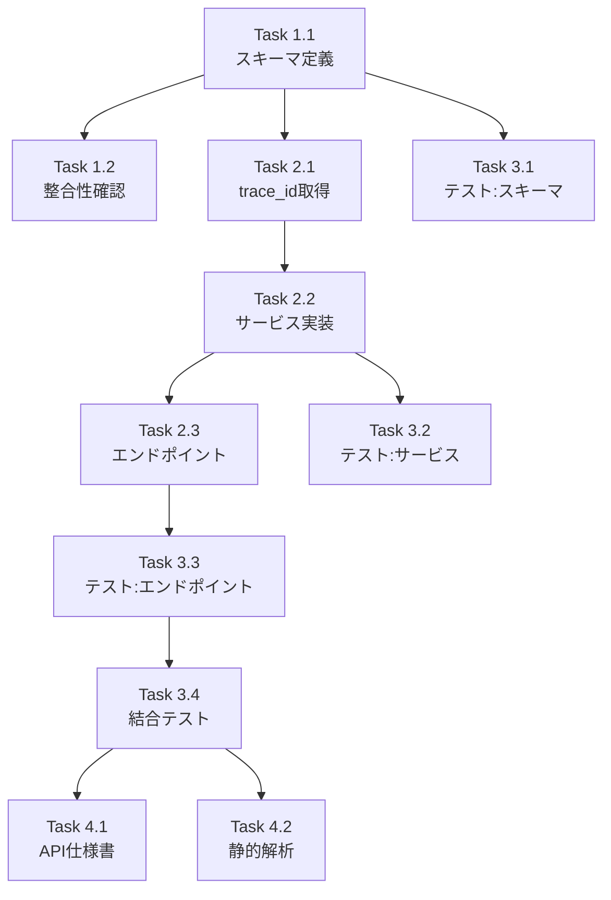

# Issue #172: フィードバックAPI実装 - 作業計画書

## Issue: Issue #152-3: フィードバックAPI実装

**Issue番号**: #172
**サイズ**: S (1日)
**作業見積**: 8時間
**優先度**: High
**依存Issue**: #169 (Valkey永続化基盤) - 完了済み

---

## 1. Issue概要の確認

要件定義API (`/v1/chat/requirement-definition`) 専用の4種類のフィードバックスコアを投稿できるAPIを実装します。

**主要機能**:
- `POST /v1/chat/feedback` エンドポイント
- 4種類の要件定義品質スコア（1-5）
- conversation_id → trace_id の紐づけ
- Langfuse scores への投稿統合

**4種類のスコア**:
1. `requirement_clarity` - 要件の明確さ
2. `interpretation_accuracy` - 解釈の正確さ
3. `response_helpfulness` - 回答の有用性
4. `overall_satisfaction` - 総合満足度

---

## 2. 詳細タスク分解

### Phase 1: スキーマ定義（1.5時間）

- [ ] **Task 1.1**: RequirementFeedbackスキーマ定義
  - 所要時間: 1時間
  - 成果物: `app/schemas/chat.py` (拡張)
  - 依存: なし
  - 内容:
    - `RequirementFeedbackRequest`: 4種類のスコア（1-5）+ conversation_id + コメント
    - `RequirementFeedbackResponse`: success, message, feedback_id
    - バリデーション: スコア範囲 1-5

- [ ] **Task 1.2**: 既存observabilityスキーマとの整合性確認
  - 所要時間: 0.5時間
  - 成果物: ドキュメント（設計メモ）
  - 依存: Task 1.1
  - 内容:
    - 既存 `ScoreRequest` との差異確認
    - スコア値の範囲変換（1-5 → 0.0-1.0）

### Phase 2: API実装（2.5時間）

- [ ] **Task 2.1**: trace_id取得ロジック実装
  - 所要時間: 1時間
  - 成果物: `app/services/conversation/conversation_store.py` (拡張)
  - 依存: Task 1.1
  - 内容:
    - `get_trace_id(conversation_id)` メソッド追加
    - Valkeyからtrace_idを取得

- [ ] **Task 2.2**: フィードバック投稿サービス実装
  - 所要時間: 0.5時間
  - 成果物: `app/services/feedback_service.py` (新規)
  - 依存: Task 2.1
  - 内容:
    - 4種類のスコアをLangfuseに投稿
    - スコア値変換（1-5 → 0.0-1.0）

- [ ] **Task 2.3**: POST /v1/chat/feedback エンドポイント実装
  - 所要時間: 1時間
  - 成果物: `app/api/v1/chat_endpoints.py` (拡張)
  - 依存: Task 2.2
  - 内容:
    - エンドポイント定義
    - リクエスト検証
    - エラーハンドリング

### Phase 3: テスト実装（3時間）

- [ ] **Task 3.1**: 単体テスト - スキーマ
  - 所要時間: 0.5時間
  - 成果物: `tests/unit/test_chat_feedback_schemas.py` (新規)
  - カバレッジ目標: 100%
  - 内容:
    - スコア範囲バリデーション
    - 必須フィールド検証

- [ ] **Task 3.2**: 単体テスト - サービス
  - 所要時間: 1時間
  - 成果物: `tests/unit/test_feedback_service.py` (新規)
  - カバレッジ目標: 90%
  - 内容:
    - trace_id取得ロジック
    - スコア変換ロジック
    - Langfuseモック

- [ ] **Task 3.3**: 単体テスト - エンドポイント
  - 所要時間: 1時間
  - 成果物: `tests/unit/test_chat_feedback_endpoints.py` (新規)
  - カバレッジ目標: 90%
  - 内容:
    - 正常系: フィードバック投稿成功
    - 異常系: 無効なスコア値
    - 異常系: 存在しないconversation_id

- [ ] **Task 3.4**: 結合テスト
  - 所要時間: 0.5時間
  - 成果物: `tests/integration/test_chat_feedback_flow.py` (新規)
  - シナリオ数: 3
  - 内容:
    - E2E: 会話 → フィードバック投稿 → Langfuse確認

### Phase 4: ドキュメント・品質確認（1時間）

- [ ] **Task 4.1**: API仕様書更新
  - 所要時間: 0.5時間
  - 成果物: `expertAgent/docs/API_REFERENCE.md` (更新)
  - 内容:
    - エンドポイント仕様
    - リクエスト/レスポンス例

- [ ] **Task 4.2**: 静的解析・フォーマット
  - 所要時間: 0.5時間
  - 成果物: N/A
  - 内容:
    - `uv run ruff check --fix`
    - `uv run ruff format`
    - `uv run mypy`

---

## 3. タスク依存関係



---

## 4. 作業スケジュール

### 1日計画（8時間）

**午前（4時間）**
- 09:00-10:00: Task 1.1（スキーマ定義）
- 10:00-10:30: Task 1.2（整合性確認）
- 10:30-11:30: Task 2.1（trace_id取得ロジック）
- 11:30-12:00: Task 2.2（サービス実装）
- 12:00-13:00: 昼休憩

**午後（4時間）**
- 13:00-14:00: Task 2.3（エンドポイント実装）
- 14:00-14:30: Task 3.1（スキーマテスト）
- 14:30-15:30: Task 3.2（サービステスト）
- 15:30-16:30: Task 3.3（エンドポイントテスト）
- 16:30-17:00: Task 3.4（結合テスト）
- 17:00-17:30: Task 4.1（API仕様書）
- 17:30-18:00: Task 4.2（静的解析）、PR作成

**総作業時間**: 8時間

---

## 5. 技術設計

### 5.1 スキーマ設計

```python
# app/schemas/chat.py に追加

class RequirementFeedbackRequest(BaseModel):
    """要件定義APIフィードバックリクエスト."""

    conversation_id: str = Field(..., description="会話ID")
    requirement_clarity: int = Field(..., ge=1, le=5, description="要件の明確さ (1-5)")
    interpretation_accuracy: int = Field(..., ge=1, le=5, description="解釈の正確さ (1-5)")
    response_helpfulness: int = Field(..., ge=1, le=5, description="回答の有用性 (1-5)")
    overall_satisfaction: int = Field(..., ge=1, le=5, description="総合満足度 (1-5)")
    comment: Optional[str] = Field(None, description="自由コメント", max_length=1000)


class RequirementFeedbackResponse(BaseModel):
    """要件定義APIフィードバックレスポンス."""

    success: bool = Field(..., description="投稿成功フラグ")
    message: str = Field(..., description="メッセージ")
    feedback_id: Optional[str] = Field(None, description="フィードバックID")
    scores_submitted: int = Field(..., description="投稿されたスコア数")
```

### 5.2 エンドポイント設計

```python
# POST /v1/chat/feedback
# Request: RequirementFeedbackRequest
# Response: RequirementFeedbackResponse

# 処理フロー:
# 1. conversation_id から trace_id を取得（Valkey経由）
# 2. 4種類のスコアをLangfuseに投稿
#    - スコア値変換: (score - 1) / 4  # 1-5 → 0.0-1.0
# 3. 結果を返却
```

### 5.3 スコア名マッピング

| スキーマ名 | Langfuse score name |
|-----------|---------------------|
| requirement_clarity | req_def_clarity |
| interpretation_accuracy | req_def_accuracy |
| response_helpfulness | req_def_helpfulness |
| overall_satisfaction | req_def_overall |

---

## 6. チェックポイント

| タイミング | 確認事項 | 対応 |
|-----------|---------|------|
| Task 2.1完了時 | trace_id取得動作確認 | ローカルテスト |
| Task 2.3完了時 | API動作確認 | curl実行 |
| Phase 3完了時 | カバレッジ90%達成 | 未達時追加テスト |
| PR作成前 | CI/CDパス | エラー時修正 |

---

## 7. リスクと対策

| リスク | 発生確率 | 影響 | 対策 |
|-------|---------|------|------|
| trace_id未保存のconversation | 中 | 404エラー | 適切なエラーメッセージ返却 |
| Langfuse接続エラー | 低 | 投稿失敗 | リトライロジック + エラー情報返却 |
| スコア範囲の設計変更 | 低 | 再実装 | 設計時に確認 |

---

## 8. 成果物チェックリスト

### コード
- [ ] `app/schemas/chat.py` (RequirementFeedbackRequest/Response追加)
- [ ] `app/services/feedback_service.py` (新規)
- [ ] `app/api/v1/chat_endpoints.py` (POST /feedback追加)

### テスト
- [ ] `tests/unit/test_chat_feedback_schemas.py`
- [ ] `tests/unit/test_feedback_service.py`
- [ ] `tests/unit/test_chat_feedback_endpoints.py`
- [ ] `tests/integration/test_chat_feedback_flow.py`

### ドキュメント
- [ ] `expertAgent/docs/API_REFERENCE.md` 更新

---

## 9. Definition of Done

Issue完了条件:
- [ ] すべてのタスクが完了
- [ ] 単体テストカバレッジ90%以上
- [ ] 結合テストカバレッジ50%以上
- [ ] CI/CDグリーン（Ruff/MyPyエラーゼロ）
- [ ] コードレビュー承認
- [ ] APIドキュメント更新完了
- [ ] レスポンスタイム500ms以内

---

## 10. 受入基準（自動検証）

### 機能要件
- [ ] APIエンドポイント `/v1/chat/feedback` が実装される
- [ ] 4種類のスコア（requirement_clarity等）が投稿できる
- [ ] conversation_idとtrace_idが正しく紐づく
- [ ] Langfuseにスコアが保存される

### テストケース
- [ ] 正常系: フィードバック投稿成功
- [ ] 異常系: 無効なスコア値（1-5範囲外）
- [ ] エッジケース: 同一会話への複数フィードバック

---

## 11. 次のアクション

作業計画承認後:
1. **worktree作成**: `/worktree-setup 172`
2. **TDD実装開始**: `/tdd-impl 172`
3. **進捗報告**: `/progress-report`
4. **PR作成**: `/pm-create-pr`

---

## 12. 関連ファイル（参照用）

### 既存実装（参考）
- `app/api/v1/observability_endpoints.py` - 既存のスコア投稿API
- `app/schemas/observability.py` - ScoreRequest/Response
- `app/services/observability_service.py` - submit_score()
- `app/services/langfuse_service.py` - score_trace()

### 拡張対象
- `app/schemas/chat.py` - スキーマ追加
- `app/api/v1/chat_endpoints.py` - エンドポイント追加
- `app/services/conversation/conversation_store.py` - trace_id取得メソッド追加
