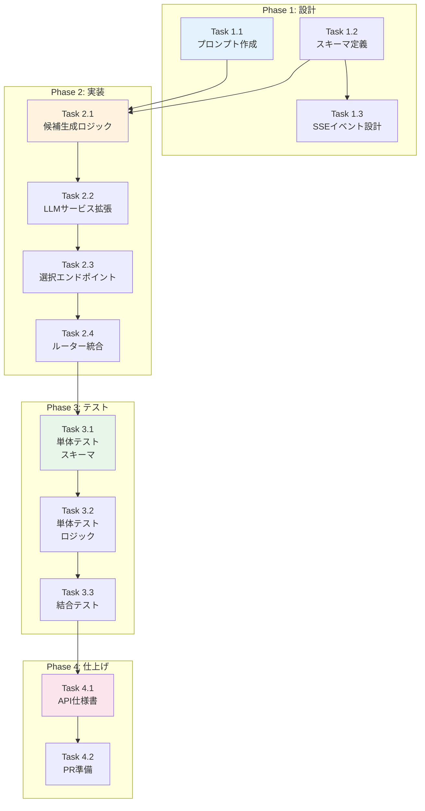

# Issue #173 作業計画書

## Issue: 複数候補提示機能（基本実装）

**Issue番号**: #173 (Issue #152-4)
**サイズ**: M (3日)
**作業見積**: 16時間
**優先度**: High
**親Issue**: #152（要件定義エージェントへのMLOps導入）
**依存Issue**: なし
**ブロック対象**: なし

---

## 1. Issue概要

初回メッセージに対し2つの要件解釈パターンを提示する機能を実装します。ユーザーの曖昧な入力から複数の解釈を生成し、選択肢を提示することで、要件定義の精度と効率を向上させます。

### 主要目標
- 初回メッセージで2つの要件解釈パターンを生成
- 各候補に4つの観点（データソース、処理内容、出力形式、スケジュール）を含める
- SSE candidate_selectionイベントで候補を送信
- 候補選択後に通常の対話フローへ継続

### 既存コードベース
- `expertAgent/app/api/v1/chat_endpoints.py` - チャットエンドポイント
- `expertAgent/app/services/conversation/llm_service.py` - LLMストリーミングサービス
- `expertAgent/app/schemas/chat.py` - チャットスキーマ
- `expertAgent/aiagent/langgraph/jobTaskGeneratorAgents/prompts/requirement_clarification.py` - 要件明確化プロンプト

---

## 2. 詳細タスク分解

### Phase 1: プロンプト・スキーマ設計（4時間）

#### Task 1.1: 複数候補生成プロンプト作成
- **所要時間**: 2時間
- **成果物**:
  - `expertAgent/aiagent/langgraph/jobTaskGeneratorAgents/prompts/multi_candidate.py`
  - `expertAgent/config/prompts/multi_candidate.yaml`
- **依存**: なし
- **内容**:
  - `MULTI_CANDIDATE_GENERATION_PROMPT` 定義
  - 2パターンの要件解釈を生成するプロンプト設計
  - 各候補に4観点を含める構造化出力指示
  - Gemini 2.5 Flash向け最適化

#### Task 1.2: 候補スキーマ定義
- **所要時間**: 1時間
- **成果物**: `expertAgent/app/schemas/chat.py` 拡張
- **依存**: なし
- **内容**:
  ```python
  class RequirementCandidate(BaseModel):
      candidate_id: str  # "A" or "B"
      title: str  # 候補の簡潔なタイトル
      data_source: str
      process_description: str
      output_format: str
      schedule: str
      confidence: float  # 解釈の確信度 (0.0-1.0)

  class CandidateSelectionEvent(BaseModel):
      candidates: List[RequirementCandidate]
      prompt_for_selection: str  # 選択を促すメッセージ

  class CandidateSelectRequest(BaseModel):
      conversation_id: str
      selected_candidate_id: str  # "A" or "B"
  ```

#### Task 1.3: SSEイベント設計
- **所要時間**: 1時間
- **成果物**: 設計ドキュメント
- **依存**: Task 1.2
- **内容**:
  - `candidate_selection` イベントの仕様定義
  - 既存イベント（`message`, `requirement_update`, `done`）との統合
  - フロントエンド連携仕様

---

### Phase 2: バックエンド実装（6時間）

#### Task 2.1: 複数候補生成ロジック実装
- **所要時間**: 2時間
- **成果物**: `expertAgent/app/services/conversation/candidate_generator.py`
- **依存**: Task 1.1, Task 1.2
- **内容**:
  - `generate_requirement_candidates()` 関数実装
  - 構造化出力でのLLM呼び出し
  - 2候補の生成とバリデーション
  - エラーハンドリング（1候補しか生成されない場合等）

#### Task 2.2: stream_requirement_clarification()拡張
- **所要時間**: 2時間
- **成果物**: `expertAgent/app/services/conversation/llm_service.py` 更新
- **依存**: Task 2.1
- **内容**:
  - 初回メッセージ判定ロジック
  - 初回時は`candidate_selection`イベントを先にyield
  - 非初回時は既存フローを維持
  - 候補選択状態の管理

#### Task 2.3: 候補選択エンドポイント実装
- **所要時間**: 1.5時間
- **成果物**: `expertAgent/app/api/v1/chat_endpoints.py` 追加
- **依存**: Task 2.2
- **内容**:
  - `POST /chat/select-candidate` エンドポイント
  - 選択された候補をRequirementStateに反映
  - 対話継続のトリガー

#### Task 2.4: ルーター登録・統合
- **所要時間**: 0.5時間
- **成果物**: `expertAgent/app/main.py` 更新確認
- **依存**: Task 2.3
- **内容**:
  - 新エンドポイントの動作確認
  - OpenAPI仕様生成確認

---

### Phase 3: テスト実装（4時間）

#### Task 3.1: 単体テスト（プロンプト・スキーマ）
- **所要時間**: 1.5時間
- **成果物**:
  - `expertAgent/tests/unit/test_multi_candidate_prompt.py`
  - `expertAgent/tests/unit/test_candidate_schemas.py`
- **依存**: Phase 2完了
- **カバレッジ目標**: 90%以上
- **テストケース**:
  - プロンプト生成テスト
  - スキーマバリデーションテスト
  - 候補ID("A"/"B")のバリデーション

#### Task 3.2: 単体テスト（候補生成ロジック）
- **所要時間**: 1.5時間
- **成果物**: `expertAgent/tests/unit/test_candidate_generator.py`
- **依存**: Task 3.1
- **カバレッジ目標**: 90%以上
- **テストケース**:
  - 正常系: 2候補生成
  - 異常系: LLM生成エラー
  - エッジケース: 曖昧なユーザー入力

#### Task 3.3: 結合テスト
- **所要時間**: 1時間
- **成果物**: `expertAgent/tests/integration/test_candidate_selection_api.py`
- **依存**: Task 3.2
- **カバレッジ目標**: 50%以上
- **テストシナリオ**:
  - 初回メッセージ → 候補提示 → 選択 → 対話継続
  - SSEイベントシーケンス検証
  - パフォーマンステスト（4秒以内）

---

### Phase 4: ドキュメント・仕上げ（2時間）

#### Task 4.1: API仕様書更新
- **所要時間**: 1時間
- **成果物**: `expertAgent/docs/API_REFERENCE.md` 更新
- **依存**: Phase 3完了
- **内容**:
  - 新SSEイベント仕様
  - `/chat/select-candidate` エンドポイント仕様
  - リクエスト/レスポンス例

#### Task 4.2: PR準備・最終確認
- **所要時間**: 1時間
- **成果物**: Pull Request
- **依存**: Task 4.1
- **内容**:
  - `./scripts/pre-push-check-all.sh` 実行
  - CI/CD確認
  - コードレビュー準備

---

## 3. タスク依存関係



---

## 4. 作業スケジュール

### Day 1（8時間）: 設計 + 実装前半

**午前 (4時間)**
- 09:00-11:00: Task 1.1 - 複数候補生成プロンプト作成
- 11:00-12:00: Task 1.2 - 候補スキーマ定義
- 12:00-13:00: Task 1.3 - SSEイベント設計

**午後 (4時間)**
- 14:00-16:00: Task 2.1 - 複数候補生成ロジック実装
- 16:00-18:00: Task 2.2 - stream_requirement_clarification()拡張

### Day 2（6時間）: 実装後半 + テスト

**午前 (3時間)**
- 09:00-10:30: Task 2.3 - 候補選択エンドポイント実装
- 10:30-11:00: Task 2.4 - ルーター登録・統合
- 11:00-12:30: Task 3.1 - 単体テスト（スキーマ）

**午後 (3時間)**
- 13:30-15:00: Task 3.2 - 単体テスト（ロジック）
- 15:00-16:00: Task 3.3 - 結合テスト

### Day 3（2時間）: ドキュメント・仕上げ

- 09:00-10:00: Task 4.1 - API仕様書更新
- 10:00-11:00: Task 4.2 - PR準備・最終確認

**総作業時間**: 16時間（約2日）

---

## 5. チェックポイント

| タイミング | 確認事項 | 成功基準 | 対応 |
|-----------|---------|---------|------|
| Task 1.1完了時 | プロンプト動作確認 | 2候補が生成される | 手動テスト |
| Task 2.2完了時 | SSEイベント確認 | candidate_selectionイベント送信 | curl実行 |
| Task 2.3完了時 | 選択フロー確認 | 選択後に対話継続 | E2Eテスト |
| Task 3.2完了時 | カバレッジ | 90%以上達成 | pytest-cov |
| Task 3.3完了時 | パフォーマンス | 生成時間4秒以内 | タイミング計測 |
| PR作成前 | CI/CD | 全テストパス | pre-push-check-all.sh |

---

## 6. リスクと対策

| リスク | 発生確率 | 影響度 | 対策 |
|-------|---------|-------|------|
| 2候補の差別化不足 | 中 | 中 | プロンプトで明確な観点の違いを指示 |
| LLM生成時間超過（>4秒） | 中 | 中 | Gemini 2.5 Flash使用、並列化検討 |
| 曖昧入力での候補品質低下 | 高 | 中 | フォールバック処理（1候補 + 質問） |
| フロントエンド連携複雑化 | 低 | 低 | 既存SSEパターンを踏襲 |

---

## 7. 成果物チェックリスト

### プロンプト・スキーマ
- [ ] `expertAgent/aiagent/langgraph/jobTaskGeneratorAgents/prompts/multi_candidate.py`
- [ ] `expertAgent/config/prompts/multi_candidate.yaml`
- [ ] `expertAgent/app/schemas/chat.py`（拡張）

### サービス・エンドポイント
- [ ] `expertAgent/app/services/conversation/candidate_generator.py`
- [ ] `expertAgent/app/services/conversation/llm_service.py`（更新）
- [ ] `expertAgent/app/api/v1/chat_endpoints.py`（更新）

### テスト
- [ ] `expertAgent/tests/unit/test_multi_candidate_prompt.py`
- [ ] `expertAgent/tests/unit/test_candidate_schemas.py`
- [ ] `expertAgent/tests/unit/test_candidate_generator.py`
- [ ] `expertAgent/tests/integration/test_candidate_selection_api.py`

### ドキュメント
- [ ] `expertAgent/docs/API_REFERENCE.md`（更新）

---

## 8. Definition of Done

### 機能要件
- [ ] 初回メッセージで2パターンが生成される
- [ ] 各候補に4つの観点が含まれる
- [ ] SSE `candidate_selection` イベントが正しく送信される
- [ ] 候補選択後に対話が継続される
- [ ] `/chat/select-candidate` エンドポイントが動作する

### 品質基準
- [ ] 単体テストカバレッジ 90%以上
- [ ] 結合テストカバレッジ 50%以上
- [ ] Ruff/MyPy エラーゼロ
- [ ] 生成時間 4秒以内
- [ ] `./scripts/pre-push-check-all.sh` 成功
- [ ] CI/CDグリーン

### テストケース
- [ ] 正常系: 2候補生成・選択・継続
- [ ] 異常系: LLM生成エラー
- [ ] エッジケース: 曖昧なユーザー入力

### ドキュメント
- [ ] API仕様書更新完了
- [ ] コードレビュー承認

### 手動検証（ユーザー実施）
- [ ] 候補が分かりやすく提示される
- [ ] 選択操作が直感的
- [ ] 候補の違いが明確

---

## 9. 次のアクション

### 作業開始前の準備

1. **環境確認**
   ```bash
   # Gemini API確認
   cd expertAgent
   uv pip list | grep langchain-google

   # 既存テスト確認
   uv run pytest tests/unit/test_chat_endpoints.py -v
   ```

2. **ブランチ作成**
   ```bash
   /worktree-setup 173
   ```

### 実装開始

1. **Phase 1から順次実装**
   - Task 1.1から開始
   - 各タスク完了時にコミット

2. **開発実行**
   ```bash
   /tdd-impl 173
   # または
   /pm-auto-dev 173
   ```

3. **定期的な進捗報告**
   ```bash
   /progress-report 173
   ```

### 完了後の作業

1. **PR作成**
   ```bash
   /pm-create-pr
   ```

2. **レビュー対応**

---

## 10. 技術詳細

### SSEイベントシーケンス（初回メッセージ）

```
Client                    Server
  |                         |
  |-- POST /requirement-definition -->
  |                         |
  |<-- SSE: candidate_selection ---
  |    {                    |
  |      "type": "candidate_selection",
  |      "data": {          |
  |        "candidates": [  |
  |          {"candidate_id": "A", ...},
  |          {"candidate_id": "B", ...}
  |        ],               |
  |        "prompt_for_selection": "..."
  |      }                  |
  |    }                    |
  |                         |
  |<-- SSE: done ----------|
  |                         |
  |-- POST /select-candidate -->
  |    {"selected_candidate_id": "A"}
  |                         |
  |<-- 200 OK, RequirementState ---
  |                         |
  |-- POST /requirement-definition -->
  |    (継続対話)           |
  |                         |
```

### 候補生成プロンプト設計方針

```yaml
# multi_candidate.yaml
system_prompt: |
  あなたは要件解釈の専門家です。
  ユーザーの曖昧な入力から、2つの異なる解釈パターンを生成してください。

  ## 生成ルール
  1. 各候補は4つの観点（データソース、処理内容、出力形式、スケジュール）を含む
  2. 候補Aと候補Bは明確に異なる解釈を提示
  3. 各候補には簡潔なタイトル（10文字以内）を付ける
  4. 確信度（confidence）は解釈の妥当性を0.0-1.0で表現

  ## 差別化の観点
  - 処理の深さ（簡易分析 vs 詳細分析）
  - 出力の粒度（サマリー vs 詳細レポート）
  - 自動化レベル（オンデマンド vs 定期実行）
  - データ範囲（最新のみ vs 過去データ含む）
```

---

**作成日**: 2025-11-26
**作成者**: Claude Code (Opus 4.5)
**Issue**: #173
**親Issue**: #152
**依存Issue**: なし
