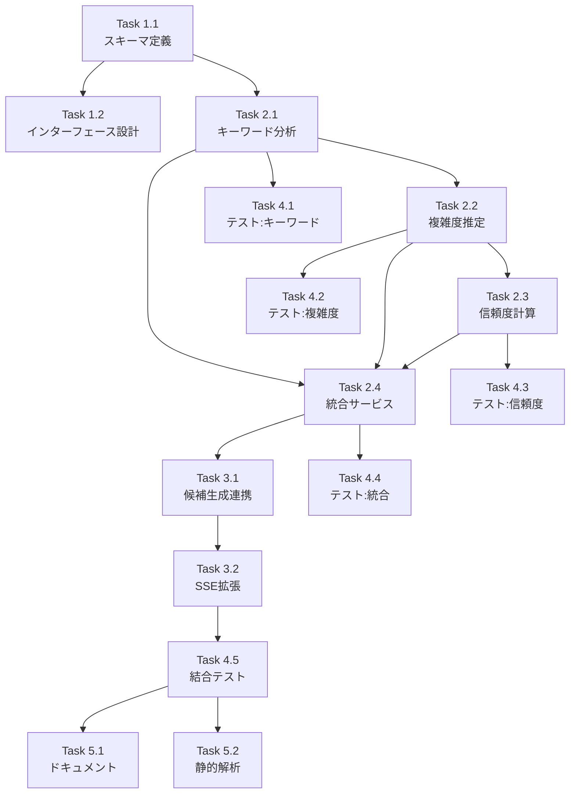

# Issue #174: AI推奨システム実装 - 作業計画書

## Issue: Issue #152-5: AI推奨システム実装

**Issue番号**: #174
**サイズ**: M (2日)
**作業見積**: 16時間
**優先度**: Medium
**依存Issue**: #173 (複数候補提示機能) - 完了済み

---

## 1. Issue概要の確認

ユーザーの初回メッセージを分析し、どの候補（AまたはB）を選択すべきかのAI推奨を提供するシステムを実装します。

**主要機能**:
- `AIRecommendationService` - AI推奨ロジック
- キーワード分析 - ユーザー入力からキーワード抽出
- 複雑度推定 - simple / medium / complex の3段階判定
- 信頼度計算 - 推奨の確信度（0.0-1.0）
- 推奨理由生成 - 人間に分かりやすい理由説明

**ユースケース**:
1. ユーザーが「売上データを月別に集計したい」と入力
2. システムが2候補（A: 簡易分析、B: 詳細レポート）を生成
3. AI推奨がユーザーの意図を分析し「候補Aを推奨（信頼度: 0.85）」と判定
4. 推奨理由：「シンプルな集計処理のため、簡易分析が適しています」

---

## 2. 詳細タスク分解

### Phase 1: スキーマ・インターフェース定義（2時間）

- [ ] **Task 1.1**: AI推奨スキーマ定義
  - 所要時間: 1時間
  - 成果物: `app/schemas/recommendation.py` (新規)
  - 依存: なし
  - 内容:
    - `AIRecommendation`: 推奨結果モデル
    - `ComplexityLevel`: Enum (simple, medium, complex)
    - `RecommendationReason`: 推奨理由

- [ ] **Task 1.2**: サービスインターフェース設計
  - 所要時間: 1時間
  - 成果物: 設計ドキュメント（メモ）
  - 依存: Task 1.1
  - 内容:
    - `AIRecommendationService` クラス設計
    - 候補生成との連携方法決定

### Phase 2: コアロジック実装（6時間）

- [ ] **Task 2.1**: キーワード分析ロジック実装
  - 所要時間: 1.5時間
  - 成果物: `app/services/recommendation/keyword_analyzer.py` (新規)
  - 依存: Task 1.1
  - 内容:
    - キーワード抽出（名詞、動詞、形容詞）
    - 重要度スコア計算
    - 定義済みキーワード辞書との照合

- [ ] **Task 2.2**: 複雑度推定アルゴリズム実装
  - 所要時間: 1.5時間
  - 成果物: `app/services/recommendation/complexity_estimator.py` (新規)
  - 依存: Task 2.1
  - 内容:
    - 3段階判定ロジック（simple, medium, complex）
    - 判定基準:
      - simple: 単一データソース、単純処理
      - medium: 複数データソース or 条件分岐
      - complex: 外部API連携、複雑な分析

- [ ] **Task 2.3**: 信頼度計算機能実装
  - 所要時間: 1.5時間
  - 成果物: `app/services/recommendation/confidence_calculator.py` (新規)
  - 依存: Task 2.2
  - 内容:
    - 信頼度スコア（0.0-1.0）計算
    - キーワードマッチ率
    - 複雑度判定の確実性

- [ ] **Task 2.4**: AIRecommendationService統合実装
  - 所要時間: 1.5時間
  - 成果物: `app/services/recommendation/ai_recommendation_service.py` (新規)
  - 依存: Task 2.1, 2.2, 2.3
  - 内容:
    - 各コンポーネントの統合
    - 推奨候補選択ロジック
    - 推奨理由テンプレート生成

### Phase 3: API統合（2時間）

- [ ] **Task 3.1**: 候補生成との連携実装
  - 所要時間: 1時間
  - 成果物: `app/services/conversation/candidate_generator.py` (拡張)
  - 依存: Task 2.4
  - 内容:
    - `generate_requirement_candidates()` 拡張
    - 推奨情報の付与

- [ ] **Task 3.2**: SSEイベントへの推奨情報追加
  - 所要時間: 1時間
  - 成果物: `app/schemas/chat.py` (拡張)
  - 依存: Task 3.1
  - 内容:
    - `CandidateSelectionEvent` に推奨情報追加
    - `recommended_candidate_id`, `recommendation_reason`, `confidence`

### Phase 4: テスト実装（5時間）

- [ ] **Task 4.1**: 単体テスト - キーワード分析
  - 所要時間: 1時間
  - 成果物: `tests/unit/test_keyword_analyzer.py` (新規)
  - カバレッジ目標: 90%
  - テストケース:
    - 正常系: 各種ユーザー入力
    - エッジケース: 空入力、長文

- [ ] **Task 4.2**: 単体テスト - 複雑度推定
  - 所要時間: 1時間
  - 成果物: `tests/unit/test_complexity_estimator.py` (新規)
  - カバレッジ目標: 90%
  - テストケース:
    - 正常系: simple/medium/complex各ケース
    - 境界値テスト

- [ ] **Task 4.3**: 単体テスト - 信頼度計算
  - 所要時間: 1時間
  - 成果物: `tests/unit/test_confidence_calculator.py` (新規)
  - カバレッジ目標: 90%
  - テストケース:
    - スコア範囲検証（0.0-1.0）
    - 計算精度検証

- [ ] **Task 4.4**: 単体テスト - 統合サービス
  - 所要時間: 1時間
  - 成果物: `tests/unit/test_ai_recommendation_service.py` (新規)
  - カバレッジ目標: 90%
  - テストケース:
    - E2E推奨生成フロー
    - 推奨精度80%以上（テストデータセット）

- [ ] **Task 4.5**: 結合テスト
  - 所要時間: 1時間
  - 成果物: `tests/integration/test_recommendation_flow.py` (新規)
  - シナリオ数: 3
  - 内容:
    - 候補生成 → 推奨判定 → SSE送信

### Phase 5: ドキュメント・品質確認（1時間）

- [ ] **Task 5.1**: API仕様書更新
  - 所要時間: 0.5時間
  - 成果物: `expertAgent/docs/API_REFERENCE.md` (更新)

- [ ] **Task 5.2**: 静的解析・フォーマット
  - 所要時間: 0.5時間
  - 内容:
    - `uv run ruff check --fix`
    - `uv run ruff format`
    - `uv run mypy`

---

## 3. タスク依存関係



---

## 4. 作業スケジュール

### Day 1 (8時間)

**午前（4時間）**
- 09:00-10:00: Task 1.1（スキーマ定義）
- 10:00-11:00: Task 1.2（インターフェース設計）
- 11:00-12:30: Task 2.1（キーワード分析）
- 12:30-13:30: 昼休憩

**午後（4時間）**
- 13:30-15:00: Task 2.2（複雑度推定）
- 15:00-16:30: Task 2.3（信頼度計算）
- 16:30-18:00: Task 2.4（統合サービス）

### Day 2 (8時間)

**午前（4時間）**
- 09:00-10:00: Task 3.1（候補生成連携）
- 10:00-11:00: Task 3.2（SSE拡張）
- 11:00-12:00: Task 4.1（テスト: キーワード）
- 12:00-13:00: 昼休憩

**午後（4時間）**
- 13:00-14:00: Task 4.2（テスト: 複雑度）
- 14:00-15:00: Task 4.3（テスト: 信頼度）
- 15:00-16:00: Task 4.4（テスト: 統合）
- 16:00-17:00: Task 4.5（結合テスト）
- 17:00-17:30: Task 5.1（ドキュメント）
- 17:30-18:00: Task 5.2（静的解析）、PR作成

**総作業時間**: 16時間（2日）

---

## 5. 技術設計

### 5.1 スキーマ設計

```python
# app/schemas/recommendation.py

from enum import Enum
from pydantic import BaseModel, Field

class ComplexityLevel(str, Enum):
    SIMPLE = "simple"      # 単一データソース、単純処理
    MEDIUM = "medium"      # 複数データソース or 条件分岐
    COMPLEX = "complex"    # 外部API連携、複雑な分析

class AIRecommendation(BaseModel):
    """AI推奨結果."""

    recommended_candidate_id: Literal["A", "B"] = Field(
        ..., description="推奨候補ID"
    )
    confidence: float = Field(
        ..., ge=0.0, le=1.0, description="信頼度 (0.0-1.0)"
    )
    complexity: ComplexityLevel = Field(
        ..., description="複雑度判定"
    )
    reason: str = Field(
        ..., description="推奨理由（人間向け）", max_length=200
    )
    keywords_detected: List[str] = Field(
        default_factory=list, description="検出キーワード"
    )
```

### 5.2 キーワード辞書設計

```python
# 複雑度判定用キーワード辞書
COMPLEXITY_KEYWORDS = {
    "simple": [
        "集計", "合計", "平均", "一覧", "表示", "出力",
        "CSV", "Excel", "レポート"
    ],
    "medium": [
        "比較", "分析", "グラフ", "複数", "条件",
        "フィルタ", "並べ替え", "グループ"
    ],
    "complex": [
        "予測", "機械学習", "AI", "自動化", "連携",
        "API", "リアルタイム", "通知", "自動"
    ]
}
```

### 5.3 推奨ロジック

```python
# AIRecommendationService.recommend() の概要
def recommend(
    user_message: str,
    candidates: List[RequirementCandidate]
) -> AIRecommendation:
    # 1. キーワード抽出
    keywords = keyword_analyzer.extract(user_message)

    # 2. 複雑度推定
    complexity = complexity_estimator.estimate(keywords)

    # 3. 候補スコアリング
    scores = {}
    for candidate in candidates:
        scores[candidate.candidate_id] = _score_candidate(
            candidate, keywords, complexity
        )

    # 4. 推奨決定
    recommended_id = max(scores, key=scores.get)
    confidence = _calculate_confidence(scores)

    # 5. 理由生成
    reason = _generate_reason(
        recommended_id, complexity, keywords
    )

    return AIRecommendation(...)
```

---

## 6. チェックポイント

| タイミング | 確認事項 | 対応 |
|-----------|---------|------|
| Task 2.1完了時 | キーワード抽出精度 | テストデータで検証 |
| Task 2.4完了時 | 推奨精度80%以上 | テストデータセットで検証 |
| Task 3.2完了時 | SSEイベント動作確認 | curl実行 |
| Phase 4完了時 | カバレッジ90%達成 | 未達時追加テスト |
| PR作成前 | CI/CDパス、処理時間100ms以内 | エラー時修正 |

---

## 7. リスクと対策

| リスク | 発生確率 | 影響 | 対策 |
|-------|---------|------|------|
| キーワード辞書が不足 | 中 | 推奨精度低下 | テストデータで事前検証、辞書拡張 |
| 複雑度判定が曖昧 | 中 | 信頼度低下 | 閾値チューニング、フォールバック |
| 処理時間100ms超過 | 低 | パフォーマンス要件未達 | キャッシュ導入、アルゴリズム最適化 |

---

## 8. 成果物チェックリスト

### コード
- [ ] `app/schemas/recommendation.py` (新規)
- [ ] `app/services/recommendation/__init__.py` (新規)
- [ ] `app/services/recommendation/keyword_analyzer.py` (新規)
- [ ] `app/services/recommendation/complexity_estimator.py` (新規)
- [ ] `app/services/recommendation/confidence_calculator.py` (新規)
- [ ] `app/services/recommendation/ai_recommendation_service.py` (新規)
- [ ] `app/services/conversation/candidate_generator.py` (拡張)
- [ ] `app/schemas/chat.py` (拡張)

### テスト
- [ ] `tests/unit/test_keyword_analyzer.py`
- [ ] `tests/unit/test_complexity_estimator.py`
- [ ] `tests/unit/test_confidence_calculator.py`
- [ ] `tests/unit/test_ai_recommendation_service.py`
- [ ] `tests/integration/test_recommendation_flow.py`

### ドキュメント
- [ ] `expertAgent/docs/API_REFERENCE.md` 更新

---

## 9. Definition of Done

Issue完了条件:
- [ ] すべてのタスクが完了
- [ ] 単体テストカバレッジ90%以上
- [ ] 推奨精度80%以上（テストデータ）
- [ ] 処理時間100ms以内
- [ ] CI/CDグリーン（Ruff/MyPyエラーゼロ）
- [ ] コードレビュー承認
- [ ] APIドキュメント更新完了

---

## 10. 受入基準（自動検証）

### 機能要件
- [ ] キーワード分析が正しく動作
- [ ] 複雑度推定が3段階で判定される
- [ ] 信頼度スコアが0-1の範囲で計算される
- [ ] 推奨理由が生成される

### テストケース
- [ ] 正常系: シンプル/複雑ケースの判定
- [ ] 異常系: 空メッセージ
- [ ] エッジケース: 長文メッセージ（1000文字）

---

## 11. 次のアクション

作業計画承認後:
1. **worktree作成**: `/worktree-setup 174`
2. **TDD実装開始**: `/tdd-impl 174`
3. **進捗報告**: `/progress-report`
4. **PR作成**: `/pm-create-pr`

---

## 12. 関連ファイル（参照用）

### 依存コンポーネント（#173で実装済み）
- `app/services/conversation/candidate_generator.py` - 候補生成サービス
- `app/schemas/chat.py` - RequirementCandidate, CandidateSelectionEvent

### 拡張対象
- `app/schemas/chat.py` - CandidateSelectionEvent に推奨情報追加
- `app/services/conversation/candidate_generator.py` - 推奨ロジック統合
