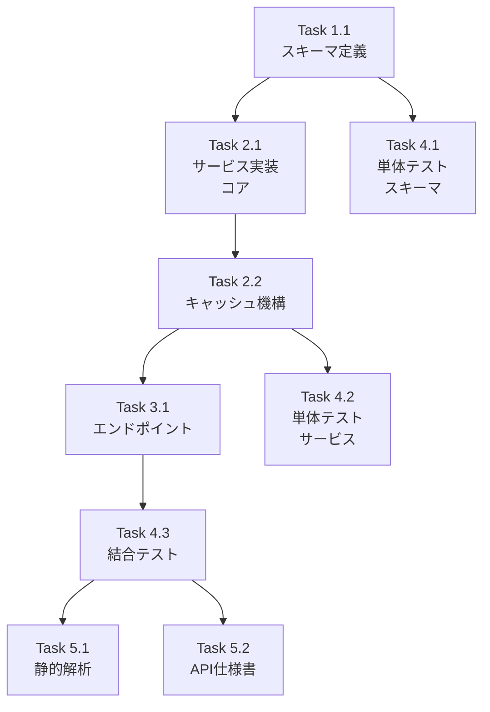

# Issue #175: 品質可視化API実装 - 作業計画書

## Issue: 品質可視化API実装
**Issue番号**: #175
**サイズ**: M
**作業見積**: 16時間（2日）
**優先度**: Medium
**依存Issue**: #171（診断情報取得API）✅ 完了済み、#172（フィードバックAPI）✅ 完了済み

---

## 2. 詳細タスク分解

### Phase 1: スキーマ定義

- [ ] **Task 1.1**: RequirementDefinitionMetricsスキーマ定義
  - 所要時間: 2時間
  - 成果物: `expertAgent/app/schemas/requirement_metrics.py`
  - 依存: なし
  - 詳細:
    - メトリクスリクエスト（期間指定、フィルタ）
    - メトリクスレスポンス（平均スコア、完了率、対話ターン数、モデル使用率）
    - 時系列データ構造
    - キャッシュ関連スキーマ

### Phase 2: サービス実装

- [ ] **Task 2.1**: RequirementMetricsService実装（コア）
  - 所要時間: 4時間
  - 成果物: `expertAgent/app/services/requirement_metrics_service.py`
  - 依存: Task 1.1
  - 詳細:
    - Langfuse APIからスコアデータ取得（trace_service活用）
    - 平均スコア計算ロジック（4種類: clarity, accuracy, helpfulness, overall）
    - 対話ターン数集計（observationsから計算）
    - 完了率算出（会話完了フラグ or ターン数閾値）
    - モデル使用率集計（generationのmodel情報）

- [ ] **Task 2.2**: キャッシュ機構実装（Valkey）
  - 所要時間: 2時間
  - 成果物: `expertAgent/app/services/requirement_metrics_service.py`（追記）
  - 依存: Task 2.1
  - 詳細:
    - ValkeyClientを使用したキャッシュ
    - キャッシュキー設計（期間+フィルタのハッシュ）
    - TTL設定（5分推奨）
    - キャッシュヒット/ミス判定
    - キャッシュ無効化機能

### Phase 3: エンドポイント実装

- [ ] **Task 3.1**: GET /v1/observability/requirement-definition-metrics実装
  - 所要時間: 2時間
  - 成果物: `expertAgent/app/api/v1/observability_endpoints.py`（追記）
  - 依存: Task 2.2
  - 詳細:
    - クエリパラメータ（days, from_date, to_date, tags）
    - レスポンス構造（summary, time_series, cache_info）
    - エラーハンドリング（Langfuse無効時、データなし）

### Phase 4: テスト実装

- [ ] **Task 4.1**: 単体テスト（スキーマ）
  - 所要時間: 1時間
  - 成果物: `expertAgent/tests/unit/test_requirement_metrics_schema.py`
  - カバレッジ目標: 95%

- [ ] **Task 4.2**: 単体テスト（サービス）
  - 所要時間: 2.5時間
  - 成果物: `expertAgent/tests/unit/test_requirement_metrics_service.py`
  - カバレッジ目標: 90%
  - 詳細:
    - スコア計算ロジックのテスト
    - キャッシュ動作のテスト
    - エッジケース（データなし、大量データ）

- [ ] **Task 4.3**: 結合テスト
  - 所要時間: 1.5時間
  - 成果物: `expertAgent/tests/integration/test_requirement_metrics_api.py`
  - 詳細:
    - 正常系: 30日間のメトリクス取得
    - 異常系: データなし期間
    - エッジケース: 大量データ（10000会話シミュレーション）
    - パフォーマンス: レスポンスタイム1秒以内

### Phase 5: 品質チェック・ドキュメント

- [ ] **Task 5.1**: 静的解析・フォーマット
  - 所要時間: 0.5時間
  - 成果物: Ruff/MyPyエラーゼロ

- [ ] **Task 5.2**: API仕様書更新
  - 所要時間: 0.5時間
  - 成果物: `expertAgent/docs/API_REFERENCE.md`（追記）

---

## 3. タスク依存関係



---

## 4. 作業スケジュール

### Day 1 (8時間)

**午前 (4時間)**
- 09:00-11:00: Task 1.1（スキーマ定義）
- 11:00-12:00: Task 4.1（単体テスト・スキーマ）

**午後 (4時間)**
- 13:00-17:00: Task 2.1（サービス実装・コア）

### Day 2 (8時間)

**午前 (4時間)**
- 09:00-11:00: Task 2.2（キャッシュ機構）
- 11:00-13:00: Task 3.1（エンドポイント実装）

**午後 (4時間)**
- 13:00-15:30: Task 4.2（単体テスト・サービス）
- 15:30-17:00: Task 4.3（結合テスト）
- 17:00-18:00: Task 5.1, 5.2（品質チェック・ドキュメント）

**総作業時間**: 16時間（2日）

---

## 5. 技術仕様

### 5.1 メトリクス集計ロジック

```python
# 平均スコア計算
# Langfuseのスコア名: req_def_clarity, req_def_accuracy, req_def_helpfulness, req_def_overall
# 値は0.0-1.0の範囲（FeedbackServiceで変換済み）

# 対話ターン数
# trace内のobservationsからtype="generation"をカウント

# 完了率
# 完了条件: 最終メッセージにエージェント終了マーカー or ターン数>=3

# モデル使用率
# observations.model から集計（例: gemini-2.5-flash: 85%, gpt-4: 15%）
```

### 5.2 キャッシュ戦略

```python
# キャッシュキー設計
cache_key = f"req_metrics:{hash(days + from_date + to_date + tags)}"

# TTL: 300秒（5分）
# 理由: メトリクスは頻繁に更新されないが、リアルタイム性も必要

# キャッシュヒット率目標: 80%以上
```

### 5.3 レスポンス構造

```python
class RequirementDefinitionMetrics(BaseModel):
    # 集計期間
    period: MetricsPeriod  # from_date, to_date, days

    # サマリーメトリクス
    summary: MetricsSummary
    #   total_conversations: int
    #   completed_conversations: int
    #   completion_rate: float (0.0-1.0)
    #   average_scores: AverageScores
    #     clarity: float
    #     accuracy: float
    #     helpfulness: float
    #     overall: float
    #   average_turn_count: float
    #   model_usage: Dict[str, float]  # model_name -> percentage

    # 時系列データ（オプション）
    time_series: Optional[List[DailyMetrics]]

    # キャッシュ情報
    cache_info: CacheInfo
    #   cache_hit: bool
    #   cached_at: Optional[datetime]
    #   ttl_remaining: Optional[int]
```

---

## 6. チェックポイント

| タイミング | 確認事項 | 対応 |
|-----------|---------|------|
| Task 1.1完了時 | スキーマがPydanticで正しく定義 | バリデーションテスト |
| Task 2.1完了時 | Langfuseからデータ取得成功 | ローカルLangfuseで動作確認 |
| Task 2.2完了時 | キャッシュが正常動作 | Valkeyでset/get確認 |
| Task 4.3完了時 | カバレッジ目標達成 | 90%未達の場合追加テスト |
| PR作成前 | CI/CDパス | エラー時は修正 |

---

## 7. リスクと対策

| リスク | 発生確率 | 影響 | 対策 |
|-------|---------|------|------|
| Langfuse API接続障害 | 中 | 集計不可 | エラーハンドリング、空レスポンス返却 |
| Valkey接続障害 | 中 | キャッシュ無効 | キャッシュなしでフォールバック |
| 大量データによる遅延 | 中 | レスポンス1秒超過 | ページネーション、キャッシュ活用 |
| スコアデータ不足 | 低 | 平均計算不可 | N/A表示、データなし警告 |

---

## 8. 成果物チェックリスト

### コード
- [ ] `expertAgent/app/schemas/requirement_metrics.py`
- [ ] `expertAgent/app/services/requirement_metrics_service.py`
- [ ] `expertAgent/app/api/v1/observability_endpoints.py`（追記）

### テスト
- [ ] `expertAgent/tests/unit/test_requirement_metrics_schema.py`
- [ ] `expertAgent/tests/unit/test_requirement_metrics_service.py`
- [ ] `expertAgent/tests/integration/test_requirement_metrics_api.py`

### ドキュメント
- [ ] `expertAgent/docs/API_REFERENCE.md`更新
- [ ] `dev-reports/feature/issue/175/work-plan.md`

---

## 9. Definition of Done

Issue完了条件：
- [ ] すべてのタスクが完了
- [ ] 単体テストカバレッジ90%以上
- [ ] 結合テストカバレッジ50%以上
- [ ] CI/CDグリーン（Ruff/MyPyエラーゼロ）
- [ ] レスポンスタイム1秒以内（1000会話）
- [ ] キャッシュヒット率80%以上（テストで確認）
- [ ] 正常系: 30日間のメトリクス取得成功
- [ ] 異常系: データなし期間でエラーなし
- [ ] エッジケース: 大量データ（10000会話）対応
- [ ] コードレビュー承認
- [ ] ドキュメント更新完了

---

## 10. 受入基準（Issue #175より）

### 🤖 自動検証可能な基準

**機能要件**:
- [ ] 平均スコアが正しく計算される
- [ ] 対話ターン数が集計される
- [ ] 完了率が算出される
- [ ] モデル使用率が集計される

**品質基準**:
- [ ] 単体テストカバレッジ 90%以上
- [ ] Ruff/MyPy エラーゼロ
- [ ] レスポンスタイム 1秒以内（1000会話）
- [ ] キャッシュヒット率 80%以上

**テストケース**:
- [ ] 正常系: 30日間のメトリクス取得
- [ ] 異常系: データなし期間
- [ ] エッジケース: 大量データ（10000会話）

### 👤 手動検証が必要な基準

- [ ] 数値が妥当な範囲内
- [ ] グラフが正しく描画される（#176で対応）

---

## 11. 次のアクション

作業計画承認後：
1. **ブランチ作成**: `feature/issue/175`
2. **worktree作成**（必要に応じて）: 別セッションで作業開始
3. **タスク実行**: 計画に従って実装
4. **進捗報告**: `/progress-report`で定期報告

---

## 12. 参照ドキュメント

- [Issue分割計画書](../152/issue-split.md)
- [API_REFERENCE.md](../../../expertAgent/docs/API_REFERENCE.md)
- [品質基準](../../../docs/claude/04-quality-standards.md)
- [開発ワークフロー](../../../docs/claude/01-development-workflow.md)

---

## 13. 技術的決定事項

### 既存コードの活用
- `trace_service.py`: Langfuse APIラッパー（`get_traces`, `get_scores_by_trace`）
- `ValkeyClient`: キャッシュ用（`expertAgent/app/services/valkey_client.py`）
- `ObservabilityService`: 既存のObservability機能を拡張
- `FeedbackService`: スコア名マッピング参照（`SCORE_MAPPING`）

### 新規実装
- `RequirementMetricsService`: メトリクス集計専用サービス
- `observability.py`スキーマ拡張: メトリクス関連スキーマ追加

### Langfuse APIの活用
```python
# 全トレース取得（期間指定）
trace_service.get_traces(limit=1000, from_timestamp=..., to_timestamp=...)

# トレース別スコア取得
trace_service.get_scores_by_trace(trace_id)

# トレース別Observation取得（ターン数計算用）
trace_service.get_observations_by_trace(trace_id)
```

---

**END OF DOCUMENT**
