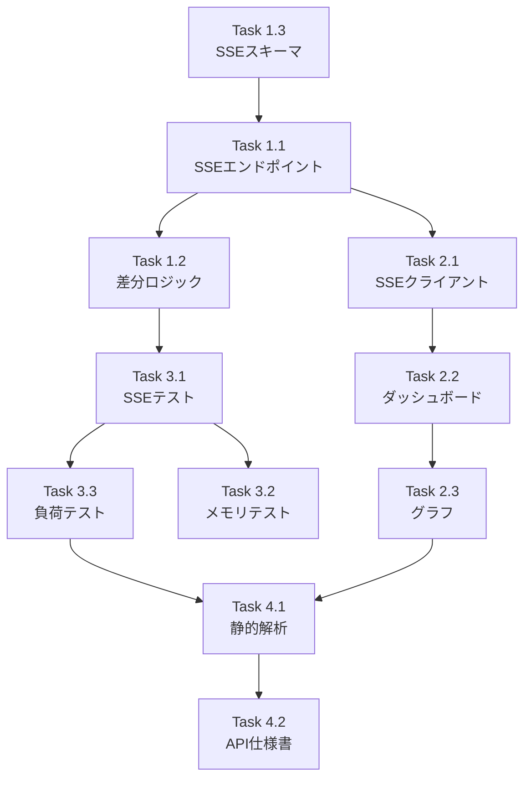

# Issue #176: リアルタイムダッシュボード実装 - 作業計画書

## Issue: リアルタイムダッシュボード実装
**Issue番号**: #176
**サイズ**: M
**作業見積**: 16時間（2日）
**優先度**: Medium
**依存Issue**: #175（品質可視化API）✅ 完了済み

---

## 1. 概要

SSE（Server-Sent Events）を使用してリアルタイムにメトリクスを配信し、フロントエンド（SvelteKit）で動的にダッシュボードを更新する機能を実装します。

### 技術スタック
- **Backend**: Python/FastAPI/SSE (sse-starlette)
- **Frontend**: SvelteKit/Chart.js (or Svelte-compatible charting)
- **データ取得**: #175で実装した品質可視化API

---

## 2. 詳細タスク分解

### Phase 1: Backend SSEエンドポイント実装

- [ ] **Task 1.1**: SSEストリーミングエンドポイント実装
  - 所要時間: 3時間
  - 成果物: `expertAgent/app/api/v1/observability_endpoints.py`（追記）
  - 依存: なし
  - 詳細:
    - `GET /v1/observability/metrics/stream` エンドポイント
    - EventSourceResponse使用（既存chat_endpointsを参考）
    - 5秒間隔でメトリクス送信
    - 30秒間隔でハートビート送信
    - 接続管理（クライアント追跡）

- [ ] **Task 1.2**: 差分データ取得ロジック実装
  - 所要時間: 2時間
  - 成果物: `expertAgent/app/services/metrics_stream_service.py`
  - 依存: Task 1.1
  - 詳細:
    - 前回送信データとの比較
    - 変更があった場合のみ差分送信
    - メモリ効率の良いデータ構造

- [ ] **Task 1.3**: SSEスキーマ定義
  - 所要時間: 1時間
  - 成果物: `expertAgent/app/schemas/metrics_stream.py`
  - 依存: なし
  - 詳細:
    - MetricsStreamEvent（イベントタイプ: update, heartbeat, error）
    - DiffMetrics（差分データ構造）
    - ConnectionInfo（接続状態）

### Phase 2: Frontend実装

- [ ] **Task 2.1**: SSEクライアントサービス実装
  - 所要時間: 2時間
  - 成果物: `myAgentDesk/src/lib/services/metricsStreamService.ts`
  - 依存: Task 1.1
  - 詳細:
    - EventSource接続管理
    - 自動再接続ロジック（exponential backoff）
    - エラーハンドリング
    - Svelte Store連携

- [ ] **Task 2.2**: リアルタイムダッシュボードコンポーネント
  - 所要時間: 3時間
  - 成果物: `myAgentDesk/src/lib/components/RealtimeDashboard.svelte`
  - 依存: Task 2.1
  - 詳細:
    - 既存モックアップ（pattern-d）をベースに実装
    - メトリクスカード（総合満足度、平均ターン数、完了率、平均時間）
    - ライブアクティビティフィード
    - 接続状態インジケーター

- [ ] **Task 2.3**: リアルタイムグラフコンポーネント
  - 所要時間: 2時間
  - 成果物: `myAgentDesk/src/lib/components/RealtimeChart.svelte`
  - 依存: Task 2.2
  - 詳細:
    - 時系列グラフ（Chart.js or Svelte-compatible）
    - スムーズなアニメーション更新
    - レスポンシブデザイン

### Phase 3: テスト実装

- [ ] **Task 3.1**: Backend SSEテスト
  - 所要時間: 1.5時間
  - 成果物: `expertAgent/tests/integration/test_metrics_stream_api.py`
  - 詳細:
    - SSE接続テスト
    - 5秒間隔更新テスト
    - ハートビートテスト
    - 接続断・再接続テスト

- [ ] **Task 3.2**: メモリリークテスト
  - 所要時間: 0.5時間
  - 成果物: `expertAgent/tests/integration/test_metrics_stream_api.py`（追記）
  - 詳細:
    - 長時間接続シミュレーション
    - クライアント切断後のリソース解放確認

- [ ] **Task 3.3**: 負荷テスト（同時接続）
  - 所要時間: 0.5時間
  - 成果物: `expertAgent/tests/integration/test_metrics_stream_load.py`
  - 詳細:
    - 100クライアント同時接続
    - レスポンス遅延測定

### Phase 4: 品質チェック・ドキュメント

- [ ] **Task 4.1**: 静的解析・フォーマット
  - 所要時間: 0.5時間
  - 成果物: Ruff/MyPy/TypeScriptエラーゼロ

- [ ] **Task 4.2**: API仕様書更新
  - 所要時間: 0.5時間
  - 成果物: `expertAgent/docs/API_REFERENCE.md`（追記）

---

## 3. タスク依存関係



---

## 4. 作業スケジュール

### Day 1 (8時間)

**午前 (4時間)**
- 09:00-10:00: Task 1.3（SSEスキーマ定義）
- 10:00-13:00: Task 1.1（SSEエンドポイント実装）

**午後 (4時間)**
- 14:00-16:00: Task 1.2（差分ロジック）
- 16:00-18:00: Task 2.1（SSEクライアントサービス）

### Day 2 (8時間)

**午前 (4時間)**
- 09:00-12:00: Task 2.2（ダッシュボードコンポーネント）
- 12:00-14:00: Task 2.3（グラフコンポーネント）

**午後 (4時間)**
- 14:00-15:30: Task 3.1（SSEテスト）
- 15:30-16:00: Task 3.2（メモリテスト）
- 16:00-16:30: Task 3.3（負荷テスト）
- 16:30-17:00: Task 4.1（静的解析）
- 17:00-17:30: Task 4.2（API仕様書）
- 17:30-18:00: PR作成準備

**総作業時間**: 16時間（2日）

---

## 5. 技術仕様

### 5.1 SSEイベント形式

```python
# イベントタイプ
class MetricsEventType(str, Enum):
    UPDATE = "update"       # メトリクス更新
    HEARTBEAT = "heartbeat" # 接続維持
    ERROR = "error"         # エラー通知

# SSEイベント例
event: update
data: {
  "timestamp": "2024-11-27T10:00:00Z",
  "metrics": {
    "average_scores": {...},
    "completion_rate": 0.87,
    "average_turns": 3.5
  },
  "diff": {
    "changed_fields": ["average_scores.overall"],
    "previous_values": {...}
  }
}

event: heartbeat
data: {"timestamp": "2024-11-27T10:00:30Z", "connection_id": "abc123"}
```

### 5.2 フロントエンドStore設計

```typescript
// metricsStore.ts
interface MetricsState {
  connected: boolean;
  lastUpdate: Date | null;
  metrics: RequirementMetrics | null;
  history: MetricsSnapshot[];
  error: string | null;
}

// 自動再接続設定
const RECONNECT_DELAYS = [1000, 2000, 4000, 8000, 16000]; // exponential backoff
```

### 5.3 接続管理

```python
# 接続追跡
active_connections: Dict[str, ConnectionInfo] = {}

# リソース解放
async def cleanup_connection(connection_id: str):
    if connection_id in active_connections:
        del active_connections[connection_id]
        logger.info(f"Connection {connection_id} cleaned up")
```

---

## 6. チェックポイント

| タイミング | 確認事項 | 対応 |
|-----------|---------|------|
| Task 1.1完了時 | SSE接続が確立される | curl --no-buffer で確認 |
| Task 1.2完了時 | 差分のみ送信される | ログで差分検出確認 |
| Task 2.2完了時 | ダッシュボードが更新される | ブラウザで動作確認 |
| Task 3.1完了時 | 全テストパス | pytest実行 |
| PR作成前 | CI/CDパス | エラー時は修正 |

---

## 7. リスクと対策

| リスク | 発生確率 | 影響 | 対策 |
|-------|---------|------|------|
| SSE接続不安定 | 中 | UX低下 | 自動再接続実装 |
| メモリリーク | 低 | サーバー不安定 | 定期的なリソース解放 |
| 高負荷時の遅延 | 中 | データ遅延 | 接続数制限、差分送信 |
| ブラウザ互換性 | 低 | 一部で動作しない | EventSource polyfill |

---

## 8. 成果物チェックリスト

### Backend
- [ ] `expertAgent/app/schemas/metrics_stream.py`
- [ ] `expertAgent/app/services/metrics_stream_service.py`
- [ ] `expertAgent/app/api/v1/observability_endpoints.py`（追記）

### Frontend
- [ ] `myAgentDesk/src/lib/services/metricsStreamService.ts`
- [ ] `myAgentDesk/src/lib/stores/metricsStore.ts`
- [ ] `myAgentDesk/src/lib/components/RealtimeDashboard.svelte`
- [ ] `myAgentDesk/src/lib/components/RealtimeChart.svelte`

### テスト
- [ ] `expertAgent/tests/integration/test_metrics_stream_api.py`
- [ ] `expertAgent/tests/integration/test_metrics_stream_load.py`

### ドキュメント
- [ ] `expertAgent/docs/API_REFERENCE.md`更新

---

## 9. Definition of Done

Issue完了条件：
- [ ] すべてのタスクが完了
- [ ] SSEストリームが正常に動作
- [ ] 5秒ごとにメトリクス更新
- [ ] 30秒ごとにハートビート送信
- [ ] 差分データのみ送信される
- [ ] 結合テストカバレッジ 50%以上
- [ ] メモリリークなし（長時間テスト確認）
- [ ] 同時接続 100クライアント対応
- [ ] 正常系: リアルタイム更新動作
- [ ] 異常系: 接続断・再接続動作
- [ ] CI/CDグリーン
- [ ] ドキュメント更新完了

---

## 10. 受入基準（Issue #176より）

### 🤖 自動検証可能な基準

**機能要件**:
- [ ] SSEストリームが正常に動作
- [ ] 5秒ごとに更新される
- [ ] ハートビートが30秒ごとに送信
- [ ] 差分データのみ送信される

**品質基準**:
- [ ] 結合テストカバレッジ 50%以上
- [ ] メモリリークがない
- [ ] 同時接続 100クライアント対応

**テストケース**:
- [ ] 正常系: リアルタイム更新
- [ ] 異常系: 接続断・再接続
- [ ] エッジケース: 長時間接続（1時間）

### 👤 手動検証が必要な基準

- [ ] グラフがスムーズに更新される
- [ ] データ遅延が感じられない
- [ ] UIが直感的

---

## 11. 既存リソース活用

### 参照すべき既存実装
1. **SSE実装例**: `expertAgent/app/api/v1/chat_endpoints.py`
   - EventSourceResponse使用パターン
   - イベントジェネレーター実装

2. **モックアップ**: `myAgentDesk/src/routes/(preview)/mockups/feature-152/pattern-d/+page.svelte`
   - ダッシュボードUIデザイン
   - メトリクスカード構造
   - ライブアクティビティフィード

3. **モックデータ**: `myAgentDesk/src/routes/(preview)/mockups/feature-152/data/mock.json`
   - メトリクスデータ構造
   - 表示すべき項目

4. **品質可視化API**: #175で実装
   - `RequirementMetricsService`からデータ取得
   - キャッシュ済みメトリクス活用

---

## 12. 次のアクション

作業計画承認後：
1. **ブランチ作成**: `feature/issue/176`
2. **worktree作成**: 別セッションで作業開始
3. **タスク実行**: 計画に従って実装
4. **進捗報告**: `/progress-report`で定期報告

---

## 13. 参照ドキュメント

- [Issue分割計画書](../152/issue-split.md)
- [API_REFERENCE.md](../../../expertAgent/docs/API_REFERENCE.md)
- [品質基準](../../../docs/claude/04-quality-standards.md)
- [開発ワークフロー](../../../docs/claude/01-development-workflow.md)

---

**END OF DOCUMENT**
