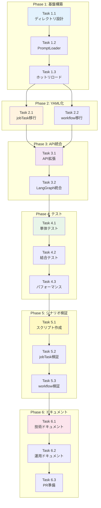

# Issue #177 作業計画書

## Issue: プロンプトYAML化実装
**Issue番号**: #177
**サイズ**: L (4日)
**作業見積**: 32時間
**優先度**: Medium
**親Issue**: #152（要件定義エージェントへのMLOpsの導入）
**依存Issue**: なし（並列実行可能: #169）

---

## 1. Issue概要

全プロンプトを外部YAMLファイルで管理し、複数バージョン対応を実現。expertAgent/prompts/ 配下にプロンプト名ディレクトリを作成し、jobTaskGeneratorAgentsとworkflowGeneratorAgentsの全プロンプトをYAML化。4つのシナリオで動作確認を実施。

### 主要目標
- プロンプトの外部化とバージョン管理
- ホットリロード機能の実装
- 4シナリオでのエージェント動作検証
- MLOps基盤の確立

---

## 2. 詳細タスク分解

### Phase 1: 基盤設計・構築（8時間）

#### Task 1.1: ディレクトリ構造設計
- **所要時間**: 2時間
- **成果物**:
  - `expertAgent/prompts/` ディレクトリ構造設計書
  - ディレクトリ命名規則ドキュメント
- **作業内容**:
  - プロンプト名ディレクトリ構造の設計
  - バージョン管理方式の決定（default.yaml, v1.yaml, v2.yaml）
  - ネーミングコンベンション策定
- **依存**: なし

#### Task 1.2: PromptLoaderクラス実装
- **所要時間**: 4時間
- **成果物**:
  - `expertAgent/app/services/prompt_loader.py`
  - `expertAgent/app/services/prompt_cache.py`
- **作業内容**:
  - YAMLファイル読み込み機能
  - default.yaml自動フォールバック機能
  - キャッシュメカニズム実装
  - エラーハンドリング（不正YAML、ファイル不在）
- **依存**: Task 1.1

#### Task 1.3: ホットリロード機能実装
- **所要時間**: 2時間
- **成果物**:
  - `expertAgent/app/services/file_watcher.py`
  - watchdog統合設定
- **作業内容**:
  - watchdogによるファイル監視
  - 変更検知時の自動リロード
  - キャッシュ無効化処理
- **依存**: Task 1.2

### Phase 2: プロンプトYAML化（12時間）

#### Task 2.1: jobTaskGeneratorAgentsプロンプト移行
- **所要時間**: 6時間
- **成果物**:
  - `expertAgent/prompts/job_task_generator/` 配下のYAMLファイル
    - `default.yaml`
    - `task_breakdown.yaml`
    - `interface_definition.yaml`
    - `validation.yaml`
    - `job_registration.yaml`
- **作業内容**:
  - 既存Pythonプロンプトの抽出
  - YAML形式への変換
  - プレースホルダー対応（{variable}形式）
  - プロンプトチェーン設定
- **依存**: Task 1.3

#### Task 2.2: workflowGeneratorAgentsプロンプト移行
- **所要時間**: 6時間
- **成果物**:
  - `expertAgent/prompts/workflow_generator/` 配下のYAMLファイル
    - `default.yaml`
    - `workflow_generation.yaml`
    - `task_extraction.yaml`
    - `validation.yaml`
    - `optimization.yaml`
- **作業内容**:
  - 既存Pythonプロンプトの抽出
  - YAML形式への変換
  - GraphAI連携プロンプト対応
  - エージェント選択ロジック
- **依存**: Task 1.3

### Phase 3: API統合・拡張（6時間）

#### Task 3.1: API拡張実装
- **所要時間**: 3時間
- **成果物**:
  - `expertAgent/app/api/v1/job_generator_endpoints.py` 更新
  - `expertAgent/app/api/v1/workflow_generator_endpoints.py` 更新
  - `expertAgent/app/schemas/prompt_config.py`
- **作業内容**:
  - prompt_versionパラメータ追加
  - YAMLファイル名指定機能
  - リクエストスキーマ拡張
  - レスポンスにプロンプトバージョン情報追加
- **依存**: Task 2.1, Task 2.2

#### Task 3.2: LangGraphエージェント統合
- **所要時間**: 3時間
- **成果物**:
  - `expertAgent/aiagent/langgraph/jobTaskGeneratorAgents/graph.py` 更新
  - `expertAgent/aiagent/langgraph/workflowGeneratorAgents/graph.py` 更新
- **作業内容**:
  - PromptLoader統合
  - 動的プロンプト切り替え
  - エージェント初期化処理更新
- **依存**: Task 3.1

### Phase 4: テスト実装（8時間）

#### Task 4.1: 単体テスト作成
- **所要時間**: 4時間
- **成果物**:
  - `expertAgent/tests/unit/test_prompt_loader.py`
  - `expertAgent/tests/unit/test_file_watcher.py`
  - `expertAgent/tests/unit/test_prompt_cache.py`
- **作業内容**:
  - PromptLoaderのテスト（正常系、異常系）
  - キャッシュ動作テスト
  - ホットリロードテスト
  - カバレッジ90%以上達成
- **依存**: Task 3.2

#### Task 4.2: 結合テスト作成
- **所要時間**: 2時間
- **成果物**:
  - `expertAgent/tests/integration/test_yaml_prompt_integration.py`
  - `expertAgent/tests/fixtures/prompt_fixtures.yaml`
- **作業内容**:
  - エンドツーエンドテスト
  - API経由でのプロンプト切り替えテスト
  - LangGraphエージェント動作確認
- **依存**: Task 4.1

#### Task 4.3: パフォーマンステスト
- **所要時間**: 2時間
- **成果物**:
  - `expertAgent/tests/performance/test_prompt_loading.py`
- **作業内容**:
  - 読み込み時間測定（目標: 100ms以内）
  - キャッシュヒット率測定
  - メモリ使用量測定
  - 並行アクセステスト
- **依存**: Task 4.2

### Phase 5: シナリオ検証（6時間）

#### Task 5.1: シナリオテストスクリプト作成
- **所要時間**: 2時間
- **成果物**:
  - `expertAgent/tests/scenarios/scenario1_ir_analysis.py`
  - `expertAgent/tests/scenarios/scenario2_pdf_extract.py`
  - `expertAgent/tests/scenarios/scenario3_gmail_podcast.py`
  - `expertAgent/tests/scenarios/scenario4_keyword_podcast.py`
- **作業内容**:
  - 各シナリオのリクエストペイロード作成
  - 期待値定義
  - アサーション実装
- **依存**: Task 4.3

#### Task 5.2: jobTaskGeneratorAgents検証
- **所要時間**: 2時間
- **成果物**:
  - シナリオ実行ログ
  - ジョブマスタ登録確認レポート
- **作業内容**:
  - 4シナリオ実行
  - ジョブマスタ・タスクマスタ・インタフェースマスタ登録確認
  - エラー処理確認
- **依存**: Task 5.1

#### Task 5.3: workflowGeneratorAgents検証
- **所要時間**: 2時間
- **成果物**:
  - ワークフロー生成確認レポート
  - GraphAI YAML出力確認
- **作業内容**:
  - 4シナリオでワークフロー生成
  - 実行可能性検証
  - エージェント選択妥当性確認
- **依存**: Task 5.2

### Phase 6: ドキュメント・仕上げ（2時間）

#### Task 6.1: 技術ドキュメント作成
- **所要時間**: 1時間
- **成果物**:
  - `expertAgent/docs/prompt-management.md`
  - `expertAgent/README.md` 更新
- **作業内容**:
  - プロンプト管理ガイド
  - YAML構造説明
  - バージョン管理方法
  - トラブルシューティング
- **依存**: Phase 5完了

#### Task 6.2: 運用ドキュメント作成
- **所要時間**: 0.5時間
- **成果物**:
  - `docs/ops/prompt-operations.md`
- **作業内容**:
  - プロンプト更新手順
  - A/Bテスト実施方法
  - ロールバック手順
- **依存**: Task 6.1

#### Task 6.3: PR準備・最終確認
- **所要時間**: 0.5時間
- **成果物**:
  - Pull Request
- **作業内容**:
  - CI/CD確認
  - コードレビュー準備
  - PR説明文作成
- **依存**: Task 6.2

---

## 3. タスク依存関係



---

## 4. 作業スケジュール

### Day 1（木曜日）: 基盤構築日（8時間）
- **09:00-11:00**: Task 1.1 - ディレクトリ構造設計
- **11:00-15:00**: Task 1.2 - PromptLoader実装
- **15:00-17:00**: Task 1.3 - ホットリロード機能

### Day 2（金曜日）: YAML化日（8時間）
- **09:00-12:00**: Task 2.1 - jobTaskGeneratorAgents移行（前半）
- **13:00-16:00**: Task 2.1 - jobTaskGeneratorAgents移行（後半）
- **16:00-18:00**: Task 2.2 - workflowGeneratorAgents移行（前半）

### Day 3（月曜日）: 統合・テスト日（8時間）
- **09:00-13:00**: Task 2.2 - workflowGeneratorAgents移行（後半）
- **14:00-16:30**: Task 3.1 - API拡張実装
- **16:30-19:00**: Task 3.2 - LangGraph統合

### Day 4（火曜日）: 検証・仕上げ日（8時間）
- **09:00-13:00**: Task 4.1 - 単体テスト作成
- **14:00-16:00**: Task 4.2 - 結合テスト、Task 4.3 - パフォーマンステスト
- **16:00-18:00**: Task 5.1, 5.2, 5.3 - シナリオ検証
- **18:00-19:00**: Task 6.1, 6.2, 6.3 - ドキュメント・PR準備

**総作業時間**: 32時間（4日）

---

## 5. チェックポイント

| タイミング | 確認事項 | 成功基準 | 対応 |
|-----------|---------|---------|------|
| Task 1.2完了時 | PromptLoader動作 | YAMLファイル読み込み成功 | エラー時はパス確認 |
| Task 1.3完了時 | ホットリロード動作 | ファイル変更検知 | watchdog設定確認 |
| Task 2.1完了時 | プロンプトYAML化 | 既存と同一動作 | diff確認 |
| Task 3.2完了時 | API統合 | リクエスト処理成功 | ログ確認 |
| Task 4.1完了時 | カバレッジ | 90%以上達成 | 未達の場合追加テスト |
| Task 5.2完了時 | ジョブマスタ登録 | 4シナリオ全て成功 | エラー時はプロンプト調整 |
| PR作成前 | CI/CD | 全テストパス | エラー時は修正 |

---

## 6. リスクと対策

| リスク | 発生確率 | 影響度 | 対策 |
|-------|---------|-------|------|
| 既存プロンプトとの互換性問題 | 中 | 高 | 段階的移行、A/Bテスト実施 |
| YAML構造の複雑化 | 中 | 中 | 明確な構造定義、バリデーション強化 |
| ホットリロードのパフォーマンス影響 | 低 | 中 | デバウンス処理、キャッシュ最適化 |
| シナリオテスト失敗 | 中 | 高 | デバッグログ強化、段階的検証 |
| バージョン管理の混乱 | 低 | 中 | 命名規則徹底、ドキュメント整備 |

---

## 7. 成果物チェックリスト

### インフラ・設定
- [ ] `expertAgent/prompts/` ディレクトリ構造
- [ ] プロンプト名ディレクトリ群
- [ ] 各プロンプトディレクトリ内のYAMLファイル

### アプリケーションコード
- [ ] `expertAgent/app/services/prompt_loader.py`
- [ ] `expertAgent/app/services/prompt_cache.py`
- [ ] `expertAgent/app/services/file_watcher.py`
- [ ] `expertAgent/app/schemas/prompt_config.py`
- [ ] API エンドポイント更新（job_generator, workflow_generator）
- [ ] LangGraphエージェント更新（graph.py）

### プロンプトYAMLファイル
- [ ] `expertAgent/prompts/job_task_generator/*.yaml`
- [ ] `expertAgent/prompts/workflow_generator/*.yaml`

### テスト
- [ ] `expertAgent/tests/unit/test_prompt_loader.py`
- [ ] `expertAgent/tests/unit/test_file_watcher.py`
- [ ] `expertAgent/tests/unit/test_prompt_cache.py`
- [ ] `expertAgent/tests/integration/test_yaml_prompt_integration.py`
- [ ] `expertAgent/tests/performance/test_prompt_loading.py`
- [ ] `expertAgent/tests/scenarios/scenario*.py` (4ファイル)

### ドキュメント
- [ ] `expertAgent/docs/prompt-management.md`
- [ ] `docs/ops/prompt-operations.md`
- [ ] `expertAgent/README.md` 更新
- [ ] Pull Request説明文

---

## 8. Definition of Done

### 機能要件
- [x] expertAgent/prompts/ ディレクトリ構造が正しく作成される
- [x] プロンプト名ディレクトリ配下に複数YAMLファイルを配置可能
- [x] YAMLからプロンプトが読み込まれる（default.yaml自動フォールバック）
- [x] リクエスト時にYAMLファイル名を指定可能（API拡張）
- [x] バージョン切り替えが動作する
- [x] ホットリロードが機能する
- [x] キャッシュが正しく動作する
- [x] jobTaskGeneratorAgents の全プロンプトがYAML化される
- [x] workflowGeneratorAgents の全プロンプトがYAML化される

### シナリオ検証（jobTaskGeneratorAgents）
- [x] シナリオ1: 企業IR分析でジョブマスタ・タスクマスタ・インタフェースマスタが登録される
- [x] シナリオ2: WebサイトPDF抽出でジョブマスタ・タスクマスタ・インタフェースマスタが登録される
- [x] シナリオ3: Gmail検索ポッドキャスト生成でジョブマスタ・タスクマスタ・インタフェースマスタが登録される
- [x] シナリオ4: キーワードポッドキャスト生成でジョブマスタ・タスクマスタ・インタフェースマスタが登録される

### シナリオ検証（workflowGeneratorAgents）
- [x] シナリオ1: 企業IR分析のLLMワークフローが生成・実行可能
- [x] シナリオ2: WebサイトPDF抽出のLLMワークフローが生成・実行可能
- [x] シナリオ3: Gmail検索ポッドキャスト生成のLLMワークフローが生成・実行可能
- [x] シナリオ4: キーワードポッドキャスト生成のLLMワークフローが生成・実行可能

### 品質基準
- [x] 単体テストカバレッジ 90%以上
- [x] Ruff/MyPy エラーゼロ
- [x] 読み込み時間 100ms以内
- [x] 4シナリオ全てでジョブマスタ・タスクマスタ・インタフェースマスタ登録成功
- [x] 4シナリオ全てでワークフロー生成・実行成功
- [x] CI/CDグリーン
- [x] ドキュメント更新完了
- [x] コードレビュー承認

---

## 9. 次のアクション

### 作業開始前の準備
1. **環境確認**
   ```bash
   # YAMLライブラリ確認
   python -c "import yaml; print(yaml.__version__)"

   # watchdog確認
   python -c "import watchdog; print(watchdog.__version__)"
   ```

2. **ブランチ確認**
   ```bash
   # worktreeで作業
   cd /Users/maenokota/share/work/github_kewton/MySwiftAgent-worktrees/feature-issue-177
   git status
   ```

3. **既存プロンプト調査**
   ```bash
   # 既存プロンプトファイルの確認
   find expertAgent/aiagent/langgraph -name "*.py" | xargs grep -l "prompt"
   ```

### 実装開始
1. **Phase 1から順次実装**
   - Task 1.1から開始
   - 各タスク完了時にコミット

2. **定期的な進捗報告**
   ```bash
   /progress-report
   ```

3. **問題発生時**
   ```bash
   /pm-bug-fix "発生した問題の説明"
   ```

### 完了後の作業
1. **PR作成**
   ```bash
   /pm-create-pr
   ```

2. **レビュー対応**
   - フィードバックに基づく修正
   - 再テスト実行

3. **マージ後の確認**
   - ステージング環境での動作確認
   - MLOps基盤としての運用開始準備

---

## 10. 参考資料

### 技術ドキュメント
- [YAML仕様](https://yaml.org/spec/)
- [Python watchdog](https://github.com/gorakhargosh/watchdog)
- [LangGraph公式ドキュメント](https://python.langchain.com/docs/langgraph)
- [FastAPI Background Tasks](https://fastapi.tiangolo.com/tutorial/background-tasks/)

### 内部ドキュメント
- [Issue分割計画書](https://github.com/Kewton/MySwiftAgent/blob/develop/dev-reports/feature/issue/152/issue-split.md)
- [GraphAIワークフロー生成ルール](./graphAiServer/docs/GRAPHAI_WORKFLOW_GENERATION_RULES.md)
- [expertAgent API仕様](./expertAgent/docs/API_REFERENCE.md)
- [Job Generator仕様](./docs/spec/job-generation-workflow.md)

### シナリオ詳細
1. **企業IR分析**: 指定企業の過去5年売上・ビジネスモデル変化分析
2. **WebサイトPDF抽出**: 全PDFファイル抽出・Google Driveアップロード
3. **Gmail検索ポッドキャスト**: ニュースレター要約・MP3生成
4. **キーワードポッドキャスト**: キーワードベースのポッドキャスト生成

---

**作成日**: 2024-11-14
**作成者**: Claude (PM Work Plan Agent)
**Issue**: #177
**プロジェクト**: expertAgent