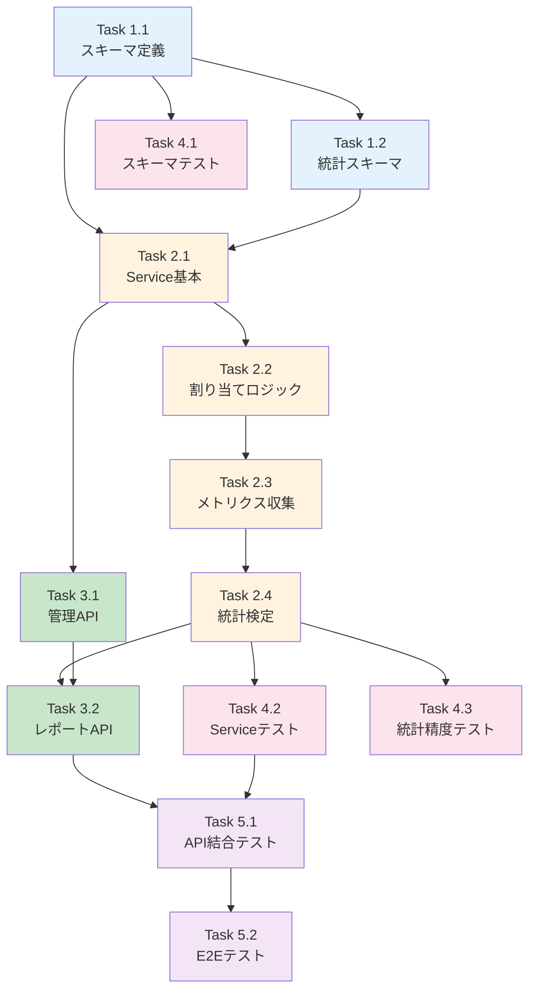

# Issue #178: ABテスト基盤実装 - 作業計画書

## Issue概要

**Issue番号**: #178
**タイトル**: Issue #152-9: ABテスト基盤実装
**サイズ**: L (4日)
**作業見積**: 32時間
**優先度**: Low
**Phase**: Phase 5（ABテスト）
**親Issue**: #152

### 依存関係
- **依存先**:
  - #177（プロンプトYAML化） - プロンプトのバージョン管理機能が必要
  - #175（品質可視化API） - メトリクス集計基盤が必要
- **ブロック対象**: なし

### スコープ（受入基準より）
- [ ] ABTestService実装
- [ ] バージョン割り当てロジック
- [ ] 統計検定機能（t検定）
- [ ] ABテストAPIエンドポイント
- [ ] 単体テスト・結合テスト作成

---

## 詳細タスク分解

### Phase 1: スキーマ・データモデル定義（4時間）

- [ ] **Task 1.1**: ABテストスキーマ定義
  - 所要時間: 2時間
  - 成果物: `expertAgent/app/schemas/ab_test.py`
  - 依存: なし
  - 内容:
    ```python
    # 必要なスキーマ
    - ABTestConfig: テスト設定（name, variants, weights, status）
    - ABTestVariant: バリアント定義（name, prompt_version, weight）
    - ABTestAssignment: 割り当て結果（session_id, variant_name, assigned_at）
    - ABTestMetrics: バリアント別メトリクス（variant_name, sample_size, mean, std）
    - ABTestReport: レポート（metrics, p_value, cohens_d, significance, winner）
    - ABTestCreateRequest/Response
    - ABTestReportRequest/Response
    ```

- [ ] **Task 1.2**: 統計結果スキーマ定義
  - 所要時間: 2時間
  - 成果物: `expertAgent/app/schemas/ab_test.py`（続き）
  - 依存: Task 1.1
  - 内容:
    ```python
    # 統計検定関連
    - TTestResult: t検定結果（t_statistic, p_value, degrees_of_freedom）
    - EffectSize: 効果サイズ（cohens_d, interpretation）
    - SignificanceLevel: 有意水準enum（0.05, 0.01, 0.001）
    ```

### Phase 2: ABTestService実装（12時間）

- [ ] **Task 2.1**: ABTestService基本実装
  - 所要時間: 4時間
  - 成果物: `expertAgent/app/services/ab_test_service.py`
  - 依存: Task 1.1, 1.2
  - 内容:
    - `create_test()`: ABテスト作成
    - `get_test()`: テスト情報取得
    - `list_tests()`: テスト一覧取得
    - `update_test_status()`: ステータス更新（draft/running/completed）
    - `delete_test()`: テスト削除

- [ ] **Task 2.2**: バージョン割り当てロジック実装
  - 所要時間: 3時間
  - 成果物: `expertAgent/app/services/ab_test_service.py`（続き）
  - 依存: Task 2.1
  - 内容:
    - `assign_variant()`: 重み付きランダム割り当て
    - `get_assignment()`: 既存割り当て取得（session_id基準）
    - `_weighted_random_choice()`: 内部ヘルパー
    - 割り当て永続化（Valkey使用、TTL付き）

- [ ] **Task 2.3**: メトリクス収集ロジック実装
  - 所要時間: 3時間
  - 成果物: `expertAgent/app/services/ab_test_service.py`（続き）
  - 依存: Task 2.2
  - 内容:
    - `collect_metrics()`: バリアント別メトリクス収集
    - `_fetch_variant_scores()`: Langfuseからスコア取得
    - `_group_by_variant()`: バリアント別グループ化
    - MetricsAggregationServiceとの連携

- [ ] **Task 2.4**: 統計検定機能実装（t検定）
  - 所要時間: 2時間
  - 成果物: `expertAgent/app/services/ab_test_service.py`（続き）
  - 依存: Task 2.3
  - 内容:
    - `perform_t_test()`: 独立2標本t検定（scipy.stats.ttest_ind）
    - `calculate_cohens_d()`: Cohen's d効果サイズ計算
    - `interpret_effect_size()`: 効果サイズ解釈（small/medium/large）
    - `check_significance()`: 有意性判定

### Phase 3: APIエンドポイント実装（6時間）

- [ ] **Task 3.1**: ABテスト管理エンドポイント実装
  - 所要時間: 3時間
  - 成果物: `expertAgent/app/api/v1/ab_test_endpoints.py`
  - 依存: Task 2.1
  - 内容:
    - `POST /v1/ab-tests`: テスト作成
    - `GET /v1/ab-tests`: テスト一覧取得
    - `GET /v1/ab-tests/{test_id}`: テスト詳細取得
    - `PUT /v1/ab-tests/{test_id}/status`: ステータス更新
    - `DELETE /v1/ab-tests/{test_id}`: テスト削除

- [ ] **Task 3.2**: ABテストレポートエンドポイント実装
  - 所要時間: 3時間
  - 成果物: `expertAgent/app/api/v1/ab_test_endpoints.py`（続き）
  - 依存: Task 2.4
  - 内容:
    - `POST /v1/ab-tests/{test_id}/report`: レポート生成
    - `GET /v1/ab-tests/{test_id}/assignment`: バリアント割り当て取得/生成
    - エラーハンドリング（サンプル数不足、テスト未完了等）

### Phase 4: 単体テスト作成（6時間）

- [ ] **Task 4.1**: スキーマ単体テスト
  - 所要時間: 1.5時間
  - 成果物: `expertAgent/tests/unit/test_ab_test_schemas.py`
  - カバレッジ目標: 95%
  - テストケース:
    - バリデーション正常系
    - 不正値エラー系
    - デフォルト値確認

- [ ] **Task 4.2**: ABTestService単体テスト
  - 所要時間: 3時間
  - 成果物: `expertAgent/tests/unit/test_ab_test_service.py`
  - カバレッジ目標: 90%
  - テストケース:
    - テスト作成・取得・更新・削除
    - バリアント割り当て（重み検証）
    - メトリクス収集
    - t検定（既知の値で精度検証）
    - Cohen's d計算

- [ ] **Task 4.3**: 統計計算精度テスト
  - 所要時間: 1.5時間
  - 成果物: `expertAgent/tests/unit/test_ab_test_statistics.py`
  - カバレッジ目標: 95%
  - テストケース:
    - 既知データセットでの検証（scipy結果と一致確認）
    - エッジケース（サンプル数=1、同値データ等）
    - 精度99.9%検証

### Phase 5: 結合テスト作成（4時間）

- [ ] **Task 5.1**: APIエンドポイント結合テスト
  - 所要時間: 2時間
  - 成果物: `expertAgent/tests/integration/test_ab_test_api.py`
  - シナリオ:
    - 正常系: テスト作成→割り当て→スコア記録→レポート生成
    - 異常系: サンプル数不足（422エラー）
    - エッジケース: 有意差なし判定

- [ ] **Task 5.2**: E2Eフロー結合テスト
  - 所要時間: 2時間
  - 成果物: `expertAgent/tests/integration/test_ab_test_flow.py`
  - シナリオ:
    - プロンプトバージョンA/Bの切り替え確認
    - Langfuseへのメトリクス記録確認
    - 複数セッションでの割り当て一貫性確認

---

## タスク依存関係



---

## 作業スケジュール

### Day 1 (8時間)

| 時間 | タスク | 成果物 |
|------|--------|--------|
| 09:00-11:00 | Task 1.1: スキーマ定義 | `schemas/ab_test.py` |
| 11:00-13:00 | Task 1.2: 統計スキーマ | `schemas/ab_test.py` |
| 14:00-18:00 | Task 2.1: Service基本実装 | `services/ab_test_service.py` |

### Day 2 (8時間)

| 時間 | タスク | 成果物 |
|------|--------|--------|
| 09:00-12:00 | Task 2.2: 割り当てロジック | `services/ab_test_service.py` |
| 13:00-16:00 | Task 2.3: メトリクス収集 | `services/ab_test_service.py` |
| 16:00-18:00 | Task 2.4: 統計検定 | `services/ab_test_service.py` |

### Day 3 (8時間)

| 時間 | タスク | 成果物 |
|------|--------|--------|
| 09:00-12:00 | Task 3.1: 管理API | `api/v1/ab_test_endpoints.py` |
| 13:00-16:00 | Task 3.2: レポートAPI | `api/v1/ab_test_endpoints.py` |
| 16:00-17:30 | Task 4.1: スキーマテスト | `tests/unit/test_ab_test_schemas.py` |
| 17:30-18:00 | main.pyルーター登録 | `main.py` |

### Day 4 (8時間)

| 時間 | タスク | 成果物 |
|------|--------|--------|
| 09:00-12:00 | Task 4.2: Serviceテスト | `tests/unit/test_ab_test_service.py` |
| 13:00-14:30 | Task 4.3: 統計精度テスト | `tests/unit/test_ab_test_statistics.py` |
| 14:30-16:30 | Task 5.1: API結合テスト | `tests/integration/test_ab_test_api.py` |
| 16:30-18:00 | Task 5.2: E2Eテスト | `tests/integration/test_ab_test_flow.py` |
| 18:00-18:30 | 静的解析・最終確認 | Ruff/MyPy/CI確認 |

**総作業時間**: 32.5時間（約4日）

---

## チェックポイント

| タイミング | 確認事項 | 対応 |
|-----------|---------|------|
| Task 2.2完了時 | 割り当て重みが正しく動作 | テストデータで検証 |
| Task 2.4完了時 | t検定結果がscipyと一致 | 既知データで検証 |
| Task 3.2完了時 | APIが正常に動作 | curl/Postmanで手動テスト |
| Day 4終了時 | カバレッジ90%以上 | pytest --cov で確認 |
| PR作成前 | CI/CDパス | GitHub Actionsで確認 |

---

## リスクと対策

| リスク | 発生確率 | 影響 | 対策 |
|-------|---------|------|------|
| Langfuseからのデータ取得遅延 | 中 | 実装遅延2時間 | モックを先行実装、キャッシュ活用 |
| サンプル数不足での統計計算 | 高 | エラー発生 | 最小サンプル数チェック実装（n≥30推奨） |
| 重み付き割り当ての偏り | 低 | ABテスト精度低下 | 乱数シード固定テストで検証 |
| scipy依存のインポートエラー | 低 | 起動失敗 | pyproject.tomlに依存追加 |

---

## 技術設計メモ

### 1. 統計検定アルゴリズム

```python
# t検定（独立2標本）
from scipy.stats import ttest_ind

def perform_t_test(group_a: list[float], group_b: list[float]) -> TTestResult:
    t_stat, p_value = ttest_ind(group_a, group_b, equal_var=False)  # Welch's t-test
    df = len(group_a) + len(group_b) - 2
    return TTestResult(t_statistic=t_stat, p_value=p_value, degrees_of_freedom=df)

# Cohen's d
def calculate_cohens_d(group_a: list[float], group_b: list[float]) -> float:
    mean_a, mean_b = np.mean(group_a), np.mean(group_b)
    pooled_std = np.sqrt((np.var(group_a) + np.var(group_b)) / 2)
    return (mean_a - mean_b) / pooled_std if pooled_std > 0 else 0.0
```

### 2. バリアント割り当てアルゴリズム

```python
import random

def assign_variant(variants: list[ABTestVariant], session_id: str) -> str:
    # 既存割り当てチェック（Valkey）
    existing = await valkey.get(f"ab_assignment:{session_id}")
    if existing:
        return existing

    # 重み付きランダム選択
    weights = [v.weight for v in variants]
    selected = random.choices(variants, weights=weights, k=1)[0]

    # 永続化（TTL: 30日）
    await valkey.set(f"ab_assignment:{session_id}", selected.name, ttl=2592000)
    return selected.name
```

### 3. Valkey キー設計

| キー | 形式 | TTL | 説明 |
|-----|------|-----|------|
| `ab_test:{test_id}` | JSON | なし | テスト設定 |
| `ab_assignment:{test_id}:{session_id}` | string | 30日 | 割り当て結果 |
| `ab_metrics_cache:{test_id}` | JSON | 5分 | メトリクスキャッシュ |

---

## 成果物チェックリスト

### コード
- [ ] `expertAgent/app/schemas/ab_test.py`
- [ ] `expertAgent/app/services/ab_test_service.py`
- [ ] `expertAgent/app/api/v1/ab_test_endpoints.py`
- [ ] `expertAgent/app/main.py`（ルーター登録）
- [ ] `expertAgent/pyproject.toml`（scipy依存追加）

### テスト
- [ ] `expertAgent/tests/unit/test_ab_test_schemas.py`
- [ ] `expertAgent/tests/unit/test_ab_test_service.py`
- [ ] `expertAgent/tests/unit/test_ab_test_statistics.py`
- [ ] `expertAgent/tests/integration/test_ab_test_api.py`
- [ ] `expertAgent/tests/integration/test_ab_test_flow.py`

### ドキュメント
- [ ] `expertAgent/docs/API_REFERENCE.md`更新（ABテストAPI追加）
- [ ] `dev-reports/feature/issue/178/work-plan.md`（本ファイル）

---

## Definition of Done

Issue完了条件：
- [ ] すべてのタスクが完了
- [ ] 単体テストカバレッジ90%以上
- [ ] 結合テストカバレッジ50%以上
- [ ] Ruff/MyPyエラーゼロ
- [ ] 統計計算精度99.9%（既知データで検証）
- [ ] CI/CDグリーン
- [ ] コードレビュー承認

### 受入基準（自動検証）
- [ ] ランダムバージョン割り当て動作確認
- [ ] バージョン別メトリクス集計動作確認
- [ ] 統計的有意性検定（p値）計算確認
- [ ] 効果サイズ（Cohen's d）計算確認
- [ ] 正常系: AB比較レポート生成
- [ ] 異常系: サンプル数不足（422エラー）
- [ ] エッジケース: 有意差なし判定

### 受入基準（手動検証）
- [ ] レポートが分かりやすい
- [ ] 意思決定に使える情報が含まれている

---

## 次のアクション

作業計画承認後：
1. **worktree確認**: `cd ~/MySwiftAgent-worktrees/feature-issue-178`（既存）
2. **依存確認**: #177, #175の完了状態確認
3. **開発開始**: Task 1.1からスキーマ定義開始
4. **進捗報告**: `/progress-report`で定期報告

---

## 参照ドキュメント

- [Issue分割計画書](../152/issue-split.md)
- [品質基準](../../../docs/claude/04-quality-standards.md)
- [開発ワークフロー](../../../docs/claude/01-development-workflow.md)
- [既存MetricsAggregationService](../../expertAgent/app/services/metrics_aggregation_service.py)
- [既存PromptLoader](../../expertAgent/app/services/prompt_loader.py)

---

**作成日**: 2025-11-27
**作成者**: Claude Code
