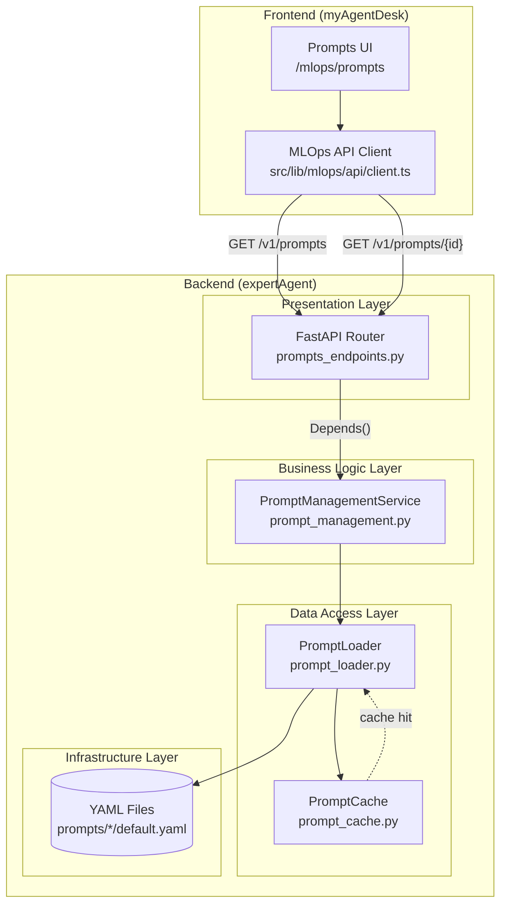
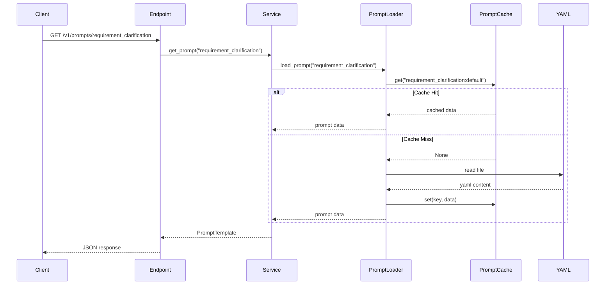

# 設計方針書: Issue #191 - プロンプト管理API実装

## 現状調査サマリ

### 対象プロジェクト
- **プロジェクト名**: expertAgent
- **主要モジュール**:
  - `app/services/prompt_loader.py` - PromptLoaderサービス（既存）
  - `app/services/prompt_cache.py` - PromptCacheサービス（既存）
  - `app/api/v1/` - FastAPIルーター群
  - `app/schemas/` - Pydanticスキーマ群

### 既存アーキテクチャパターン
| パターン | 使用箇所 | 目的 |
|----------|----------|------|
| **Factory Pattern** | `PromptLoader.create_default()` | デフォルト設定でのインスタンス生成 |
| **Singleton Pattern** | `PromptCache.get_instance()` | キャッシュの共有インスタンス |
| **Dependency Injection** | `Depends(get_service)` | サービスの注入 |
| **Repository Pattern** | `PromptLoader` | YAMLファイルへのアクセス抽象化 |
| **Service Layer Pattern** | `BaseService` 継承 | ビジネスロジックの分離 |

### 類似機能の設計
| 機能 | 設計概要 |
|------|----------|
| Observability API | `GET /traces`, `GET /traces/{id}`, `POST /scores` - 一覧/詳細/作成パターン |
| Marp Report API | `POST /marp-report`, `GET /marp-report/{id}` - 生成/取得パターン |
| Job Generator API | `POST /job-generator`, `GET /jobs/{id}/status` - 非同期生成パターン |

### モジュール間依存関係
```
prompts_endpoints.py
    └── PromptManagementService
            └── PromptLoader (既存)
                    └── PromptCache (既存)
                            └── YAML Files
```

### 既存API設計パターン
| 項目 | パターン |
|------|----------|
| エンドポイント命名規則 | ケバブケース（`/job-generator`, `/marp-report`） |
| レスポンス形式 | Pydantic BaseModel + Field(..., description="...") |
| エラーハンドリング | HTTPException(status_code, detail) |
| サービス注入 | `Depends(get_{service_name})` |

### 参照したドキュメント
- `dev-reports/feature/issue/152/prompts-api-design.md` - 設計方針書（親Issue）
- `expertAgent/docs/API_REFERENCE.md` - API仕様書
- `expertAgent/app/api/v1/observability_endpoints.py` - 参照実装
- `myAgentDesk/src/lib/mlops/types/index.ts` - フロントエンド型定義

### 設計上の制約
1. **Phase 1は読み取り専用**: GET /v1/prompts, GET /v1/prompts/{id} のみ
2. **既存PromptLoader活用**: 新規データアクセス層不要
3. **フロントエンド互換**: myAgentDeskの期待形式に準拠
4. **非同期処理**: 全エンドポイントはasync/await

---

## 1. アーキテクチャ設計

### システム構成図



### レイヤー構成

| レイヤー | 責務 | ファイル |
|----------|------|----------|
| **プレゼンテーション層** | HTTPリクエスト/レスポンス処理、バリデーション | `app/api/v1/prompts_endpoints.py` |
| **ビジネスロジック層** | プロンプトデータの変換、一覧/詳細取得ロジック | `app/services/prompt_management.py` |
| **データアクセス層** | YAMLファイル読み込み、キャッシュ管理 | `app/services/prompt_loader.py` (既存) |
| **スキーマ層** | リクエスト/レスポンスの型定義 | `app/schemas/prompts.py` |

---

## 2. 技術選定

| カテゴリ | 選定技術 | 選定理由 | 既存との整合性 |
|----------|----------|----------|----------------|
| フレームワーク | FastAPI | 既存expertAgent基盤 | ✅ 完全一致 |
| バリデーション | Pydantic v2 | 型安全なスキーマ定義 | ✅ 完全一致 |
| データストレージ | YAML ファイル | #177で実装済み、Git管理可能 | ✅ 完全一致 |
| キャッシュ | PromptCache（インメモリ） | 既存実装を再利用 | ✅ 完全一致 |
| ロギング | Python logging | 既存ロギング基盤 | ✅ 完全一致 |
| テスト | pytest + pytest-asyncio | 既存テスト基盤 | ✅ 完全一致 |

---

## 3. 設計パターン

### 採用パターンと理由

| パターン | 適用箇所 | 理由 | 既存使用例 |
|----------|----------|------|------------|
| **Dependency Injection** | エンドポイント → サービス | テスタビリティ向上、疎結合 | `observability_endpoints.py` |
| **Repository Pattern** | PromptLoader | データアクセスの抽象化 | `prompt_loader.py` (既存) |
| **Factory Pattern** | PromptLoader.create_default() | 設定済みインスタンス生成 | `prompt_loader.py` (既存) |
| **Service Layer** | PromptManagementService | ビジネスロジック集約 | `observability_service.py` |

### 新規パターン導入
**なし** - 既存パターンで全要件を満たせるため、新規パターンは導入しない。

---

## 4. データモデル設計

### YAMLファイル構造（既存）

```
expertAgent/prompts/
├── evaluation/
│   └── default.yaml
├── interface_schema/
│   └── default.yaml
├── multi_candidate/
│   └── default.yaml
├── requirement_clarification/
│   └── default.yaml
├── task_breakdown/
│   └── default.yaml
├── validation_fix/
│   └── default.yaml
└── workflow_generation/
    └── default.yaml
```

### YAMLファイルフィールド

```yaml
# 共通メタデータ
description: str          # プロンプトの説明
version: str              # バージョン識別子（例: "1.0"）
agent_type: str           # エージェントタイプ（jobTaskGeneratorAgents等）
purpose: str              # プロンプトの目的

# コンテンツ
system_prompt: str        # システムプロンプト本文（複数行）

# オプション
evaluation_principles: list  # 評価基準（オプション）
response_schema: dict        # 期待レスポンス形式（オプション）
```

### Pydanticスキーマ設計

```python
# app/schemas/prompts.py

from datetime import datetime
from pydantic import BaseModel, Field

class PromptVersion(BaseModel):
    """プロンプトバージョン."""

    id: str = Field(..., description="Version ID (e.g., 'default')")
    version: int = Field(..., description="Version number")
    content: str = Field(..., description="Full prompt content")
    description: str = Field(..., description="Version description")
    created_at: datetime = Field(..., description="Creation timestamp")
    is_active: bool = Field(default=True, description="Whether this version is active")

class PromptTemplate(BaseModel):
    """プロンプトテンプレート."""

    id: str = Field(..., description="Prompt ID (directory name)")
    name: str = Field(..., description="Display name")
    description: str = Field(..., description="Prompt description")
    category: str = Field(..., description="Category (e.g., 'system')")
    current_version: int = Field(..., description="Current version number")
    versions: list[PromptVersion] = Field(default_factory=list, description="Version list")
    created_at: datetime = Field(..., description="Creation timestamp")
    updated_at: datetime = Field(..., description="Last update timestamp")

class PromptListResponse(BaseModel):
    """プロンプト一覧レスポンス."""

    items: list[PromptTemplate] = Field(..., description="Prompt templates")
    total: int = Field(..., description="Total count")
```

### フロントエンド型定義との対応

| Backend (Python) | Frontend (TypeScript) | 備考 |
|------------------|----------------------|------|
| `PromptTemplate.id` | `PromptTemplate.id` | 完全一致 |
| `PromptTemplate.name` | `PromptTemplate.name` | 完全一致 |
| `PromptVersion.content` | `PromptVersion.content` | 完全一致 |
| `PromptVersion.is_active` | `PromptVersion.is_active` | 完全一致 |
| `datetime` | `string` (ISO 8601) | 自動シリアライズ |

---

## 5. API設計

### エンドポイント一覧

| メソッド | パス | 説明 | Phase |
|----------|------|------|-------|
| GET | `/v1/prompts` | プロンプト一覧取得 | Phase 1 |
| GET | `/v1/prompts/{prompt_id}` | プロンプト詳細取得 | Phase 1 |
| POST | `/v1/prompts/{prompt_id}/versions` | 新バージョン作成 | Phase 2 (将来) |
| POST | `/v1/prompts/{prompt_id}/versions/{version_id}/activate` | バージョン有効化 | Phase 2 (将来) |

### GET /v1/prompts

```python
@router.get(
    "/",
    response_model=PromptListResponse,
    summary="Get prompts list",
    description="Get all prompt templates with version information",
)
async def get_prompts(
    category: str | None = Query(None, description="Filter by category"),
    service: PromptManagementService = Depends(get_prompt_management_service),
) -> PromptListResponse:
```

**レスポンス例:**
```json
{
  "items": [
    {
      "id": "requirement_clarification",
      "name": "Requirement Clarification",
      "description": "System prompt for requirement clarification",
      "category": "system",
      "current_version": 1,
      "versions": [
        {
          "id": "default",
          "version": 1,
          "content": "You are a helpful assistant...",
          "description": "Default version",
          "created_at": "2025-01-15T10:00:00Z",
          "is_active": true
        }
      ],
      "created_at": "2025-01-15T10:00:00Z",
      "updated_at": "2025-01-15T10:00:00Z"
    }
  ],
  "total": 7
}
```

### GET /v1/prompts/{prompt_id}

```python
@router.get(
    "/{prompt_id}",
    response_model=PromptTemplate,
    summary="Get prompt detail",
    description="Get a specific prompt template with all versions",
)
async def get_prompt(
    prompt_id: str = Path(..., description="Prompt ID", pattern="^[a-z_]+$"),
    service: PromptManagementService = Depends(get_prompt_management_service),
) -> PromptTemplate:
```

**エラーレスポンス (404):**
```json
{
  "detail": "Prompt not found: nonexistent_prompt"
}
```

### エラーハンドリングパターン

```python
try:
    return await service.get_prompt(prompt_id)

except PromptNotFoundError as e:
    # 404 - リソースが見つからない
    raise HTTPException(status_code=404, detail=str(e)) from e

except ValueError as e:
    # 400 - バリデーションエラー
    logger.error(f"Validation error: {e}")
    raise HTTPException(status_code=400, detail=str(e)) from e

except ServiceError as e:
    # 500 - サービスエラー
    logger.exception("Service error")
    raise HTTPException(status_code=500, detail=str(e)) from e

except Exception:
    # 500 - 予期せぬエラー
    logger.exception("Unexpected error")
    raise HTTPException(status_code=500, detail="Internal server error") from None
```

---

## 6. セキュリティ設計

### 認証/認可

| 項目 | Phase 1 | Phase 2 (将来) |
|------|---------|----------------|
| 認証 | なし（内部ネットワーク想定） | ExpertAgent共通認証 |
| 認可 | なし | ロールベース（admin/viewer） |

### 入力バリデーション

| リスク | 対策 |
|--------|------|
| **パストラバーサル** | `prompt_id`を正規表現で検証: `pattern="^[a-z_]+$"` |
| **インジェクション** | Pydanticによる自動バリデーション |
| **不正リクエスト** | FastAPIによるスキーマ検証 |

```python
# パストラバーサル防止
prompt_id: str = Path(
    ...,
    description="Prompt ID",
    pattern="^[a-z_]+$",  # 英小文字とアンダースコアのみ
    min_length=1,
    max_length=50,
)
```

---

## 7. パフォーマンス設計

### キャッシング戦略



### パフォーマンス目標

| メトリクス | 目標値 | 測定方法 |
|------------|--------|----------|
| 一覧API レスポンス時間 | < 100ms | キャッシュヒット時 |
| 詳細API レスポンス時間 | < 50ms | キャッシュヒット時 |
| 初回読み込み | < 500ms | 7ファイル読み込み |
| 同時リクエスト | 100 req/s | 負荷テスト |

### 最適化ポイント

1. **インメモリキャッシュ**: PromptCacheによる初回読み込み後のキャッシュ
2. **遅延読み込み**: 詳細APIでのみフルコンテンツを読み込み
3. **一覧APIの軽量化**: 一覧ではメタデータのみ返却（オプション）

---

## 8. 実装詳細設計

### ファイル構成

```
expertAgent/
├── app/
│   ├── api/v1/
│   │   └── prompts_endpoints.py    # 新規作成
│   ├── schemas/
│   │   └── prompts.py              # 新規作成
│   ├── services/
│   │   ├── prompt_loader.py        # 既存
│   │   ├── prompt_cache.py         # 既存
│   │   └── prompt_management.py    # 新規作成
│   └── main.py                     # ルーター登録追加
└── tests/
    ├── unit/
    │   ├── test_prompts_schemas.py     # 新規作成
    │   └── test_prompt_management.py   # 新規作成
    └── integration/
        └── test_prompts_api.py         # 新規作成
```

### PromptManagementService 設計

```python
# app/services/prompt_management.py

"""Prompt management service.

Provides business logic for prompt template management,
wrapping PromptLoader with API-specific transformations.
"""

import logging
import os
from datetime import datetime
from pathlib import Path

from app.services.prompt_loader import PromptLoader, PromptNotFoundError
from app.schemas.prompts import PromptTemplate, PromptVersion, PromptListResponse

logger = logging.getLogger(__name__)


class PromptManagementService:
    """Prompt management service."""

    def __init__(self, prompt_loader: PromptLoader | None = None) -> None:
        """Initialize service.

        Args:
            prompt_loader: Optional PromptLoader instance (for testing)
        """
        self._loader = prompt_loader or PromptLoader.create_default()
        self._prompts_dir = self._loader.base_dir

    async def get_prompts(
        self,
        category: str | None = None,
    ) -> PromptListResponse:
        """Get all prompt templates.

        Args:
            category: Optional category filter

        Returns:
            PromptListResponse with all templates
        """
        templates: list[PromptTemplate] = []

        # List all prompt directories
        for prompt_dir in self._prompts_dir.iterdir():
            if prompt_dir.is_dir() and not prompt_dir.name.startswith("."):
                template = await self._load_template(prompt_dir.name)
                if template:
                    if category is None or template.category == category:
                        templates.append(template)

        return PromptListResponse(
            items=sorted(templates, key=lambda t: t.name),
            total=len(templates),
        )

    async def get_prompt(self, prompt_id: str) -> PromptTemplate:
        """Get a specific prompt template.

        Args:
            prompt_id: Prompt identifier

        Returns:
            PromptTemplate with all versions

        Raises:
            PromptNotFoundError: If prompt not found
        """
        template = await self._load_template(prompt_id)
        if template is None:
            raise PromptNotFoundError(f"Prompt not found: {prompt_id}")
        return template

    async def _load_template(self, prompt_id: str) -> PromptTemplate | None:
        """Load a prompt template from files.

        Args:
            prompt_id: Prompt identifier

        Returns:
            PromptTemplate or None if not found
        """
        try:
            # Get available versions
            versions = self._loader.list_versions(prompt_id)
            if not versions:
                return None

            # Load each version
            prompt_versions: list[PromptVersion] = []
            for version_id in versions:
                data = self._loader.load_prompt(prompt_id, version_id)
                prompt_versions.append(self._to_prompt_version(version_id, data))

            # Get file timestamps
            prompt_dir = self._prompts_dir / prompt_id
            created_at = self._get_file_created_time(prompt_dir)
            updated_at = self._get_file_modified_time(prompt_dir)

            # Build template
            default_data = self._loader.load_prompt(prompt_id, "default")
            return PromptTemplate(
                id=prompt_id,
                name=self._to_display_name(prompt_id),
                description=default_data.get("description", ""),
                category=default_data.get("agent_type", "system"),
                current_version=1,
                versions=prompt_versions,
                created_at=created_at,
                updated_at=updated_at,
            )
        except PromptNotFoundError:
            logger.debug(f"Prompt not found: {prompt_id}")
            return None

    def _to_prompt_version(
        self, version_id: str, data: dict
    ) -> PromptVersion:
        """Convert YAML data to PromptVersion."""
        return PromptVersion(
            id=version_id,
            version=int(data.get("version", "1").split(".")[0]) if data.get("version") else 1,
            content=data.get("system_prompt", ""),
            description=data.get("description", ""),
            created_at=datetime.now(),  # TODO: Use file timestamp
            is_active=(version_id == "default"),
        )

    def _to_display_name(self, prompt_id: str) -> str:
        """Convert prompt_id to display name."""
        return prompt_id.replace("_", " ").title()

    def _get_file_created_time(self, path: Path) -> datetime:
        """Get file creation time."""
        try:
            stat = path.stat()
            return datetime.fromtimestamp(stat.st_ctime)
        except OSError:
            return datetime.now()

    def _get_file_modified_time(self, path: Path) -> datetime:
        """Get file modification time."""
        try:
            stat = path.stat()
            return datetime.fromtimestamp(stat.st_mtime)
        except OSError:
            return datetime.now()
```

### main.py への登録

```python
# app/main.py に追加

from app.api.v1 import prompts_endpoints

# Include routers セクションに追加
app.include_router(
    prompts_endpoints.router, prefix="/v1", tags=["Prompts Management"]
)
```

---

## 9. 設計判断とトレードオフ

### 採用した設計判断

| 判断事項 | 選択 | 理由 | 代替案 |
|----------|------|------|--------|
| **データストレージ** | YAMLファイル | #177で実装済み、Git管理可能、シンプル | SQLite: 高度な検索可能だが追加複雑性 |
| **キャッシュ方式** | インメモリ（PromptCache） | 既存実装再利用、高速 | Valkey: 分散対応だが追加依存 |
| **サービス層追加** | PromptManagementService新規作成 | 責務分離、テスタビリティ | PromptLoader直接使用: シンプルだが責務肥大 |
| **Phase分割** | Phase 1は読み取りのみ | YAGNI原則、書き込みは後回し | 一括実装: 複雑性増大 |

### トレードオフ分析

| 設計選択 | メリット | デメリット | 許容理由 |
|----------|----------|------------|----------|
| YAMLファイル永続化 | シンプル、Git管理、既存実装 | 検索機能限定、同時書き込み非対応 | Phase 1は読み取りのみ、プロンプト数が少ない |
| インメモリキャッシュ | 高速、既存実装 | サーバー再起動でクリア | 再読み込みは軽量（7ファイル） |
| 同期的ファイル読み込み | シンプル、既存実装準拠 | 大量ファイル時にブロッキング | プロンプト数が少ない（7件） |

### リスク対策

| リスク | 影響度 | 発生確率 | 対策 |
|--------|--------|----------|------|
| YAML読み込みエラー | 中 | 低 | 既存PromptNotFoundError活用、ログ出力 |
| フロントエンド互換性 | 高 | 中 | TypeScript型定義との完全一致確認、E2Eテスト |
| パフォーマンス劣化 | 中 | 低 | キャッシュ活用、レスポンス時間監視 |
| パストラバーサル | 高 | 低 | 正規表現バリデーション |

---

## 10. テスト計画

### 単体テスト

| テスト対象 | テストケース | カバレッジ目標 |
|------------|--------------|----------------|
| `prompts.py` (スキーマ) | バリデーション、シリアライズ、デフォルト値 | 100% |
| `prompt_management.py` | get_prompts, get_prompt, エラーケース | 90%+ |
| `prompts_endpoints.py` | 正常系、404エラー、500エラー | 90%+ |

### 統合テスト

| テストケース | 説明 |
|--------------|------|
| GET /v1/prompts 正常系 | 7件のプロンプト一覧取得 |
| GET /v1/prompts/{id} 正常系 | 詳細取得、バージョン情報確認 |
| GET /v1/prompts/{id} 404 | 存在しないプロンプトでエラー |
| フロントエンド互換性 | レスポンス形式がTypeScript型と一致 |

### E2Eテスト

| テストケース | 説明 |
|--------------|------|
| Prompts UI表示 | デモモードではなく実データ表示確認 |
| バージョン選択 | バージョン切り替えで内容変更確認 |

---

## 参照ドキュメント

| ドキュメント | 用途 |
|--------------|------|
| [prompts-api-design.md](../152/prompts-api-design.md) | 親Issueの設計方針書 |
| [API_REFERENCE.md](../../../expertAgent/docs/API_REFERENCE.md) | expertAgent API仕様 |
| [observability_endpoints.py](../../../expertAgent/app/api/v1/observability_endpoints.py) | 参照実装パターン |
| [prompt_loader.py](../../../expertAgent/app/services/prompt_loader.py) | 既存PromptLoader実装 |
| [myAgentDesk types/index.ts](../../../myAgentDesk/src/lib/mlops/types/index.ts) | フロントエンド型定義 |

---

## 実装チェックリスト

- [ ] `app/schemas/prompts.py` - Pydanticスキーマ定義
- [ ] `app/services/prompt_management.py` - PromptManagementService実装
- [ ] `app/api/v1/prompts_endpoints.py` - FastAPIルーター実装
- [ ] `app/main.py` - ルーター登録
- [ ] `tests/unit/test_prompts_schemas.py` - スキーマ単体テスト
- [ ] `tests/unit/test_prompt_management.py` - サービス単体テスト
- [ ] `tests/integration/test_prompts_api.py` - 統合テスト
- [ ] Ruff/MyPyエラーゼロ確認
- [ ] 単体テストカバレッジ90%以上
- [ ] OpenAPI仕様ドキュメント確認

---

*作成日: 2025-12-10*
*Issue: #191*
*親Issue: #152*
