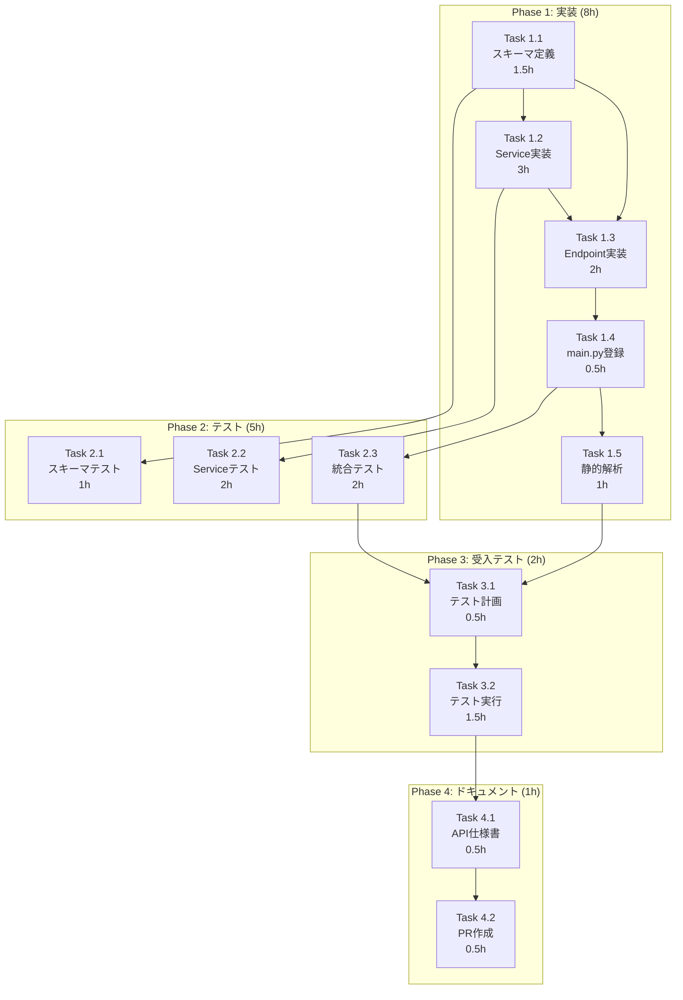

# 作業計画書: Issue #191 - プロンプト管理API実装

## 1. Issue概要の確認

```markdown
## Issue: プロンプト管理API実装
**Issue番号**: #191
**親Issue**: #152（要件定義エージェントへのMLOps導入）
**サイズ**: M（Medium）
**作業見積**: 16時間（2日）
**優先度**: High
**依存Issue**: #177（プロンプトYAML化）✅ 完了
**被依存Issue**: #170（UI実装）- デモモードで待機中
```

### 目的
- バックエンドREST APIエンドポイントを実装
- フロントエンドのデモモード表示を解消
- MLOps UIからプロンプト一覧・詳細を閲覧可能にする

### スコープ
- **In Scope**: GET /v1/prompts, GET /v1/prompts/{prompt_id}
- **Out of Scope**: POST/PUT/DELETE（Phase 2で実装）

---

## 2. 詳細タスク分解

### Phase 1: 実装タスク（8時間）

#### Task 1.1: Pydanticスキーマ定義
| 項目 | 内容 |
|------|------|
| **所要時間** | 1.5時間 |
| **成果物** | `expertAgent/app/schemas/prompts.py` |
| **依存** | なし |
| **内容** | PromptVersion, PromptTemplate, PromptListResponse スキーマ定義 |

#### Task 1.2: PromptManagementService実装
| 項目 | 内容 |
|------|------|
| **所要時間** | 3時間 |
| **成果物** | `expertAgent/app/services/prompt_management.py` |
| **依存** | Task 1.1 |
| **内容** | get_prompts(), get_prompt()メソッド、PromptLoaderラッパー |

#### Task 1.3: FastAPIルーター実装
| 項目 | 内容 |
|------|------|
| **所要時間** | 2時間 |
| **成果物** | `expertAgent/app/api/v1/prompts_endpoints.py` |
| **依存** | Task 1.1, Task 1.2 |
| **内容** | GET /prompts, GET /prompts/{prompt_id}エンドポイント |

#### Task 1.4: main.pyルーター登録
| 項目 | 内容 |
|------|------|
| **所要時間** | 0.5時間 |
| **成果物** | `expertAgent/app/main.py` 更新 |
| **依存** | Task 1.3 |
| **内容** | prompts_endpoints.routerをapp.include_router()で登録 |

#### Task 1.5: 静的解析チェック
| 項目 | 内容 |
|------|------|
| **所要時間** | 1時間 |
| **成果物** | Ruff/MyPyエラーゼロ |
| **依存** | Task 1.1〜1.4 |
| **内容** | `uv run ruff check`, `uv run mypy` 実行・修正 |

---

### Phase 2: テストタスク（5時間）

#### Task 2.1: スキーマ単体テスト
| 項目 | 内容 |
|------|------|
| **所要時間** | 1時間 |
| **成果物** | `expertAgent/tests/unit/test_prompts_schemas.py` |
| **依存** | Task 1.1 |
| **カバレッジ目標** | 100% |
| **テストケース** | バリデーション、シリアライズ、デフォルト値、エッジケース |

#### Task 2.2: サービス単体テスト
| 項目 | 内容 |
|------|------|
| **所要時間** | 2時間 |
| **成果物** | `expertAgent/tests/unit/test_prompt_management.py` |
| **依存** | Task 1.2 |
| **カバレッジ目標** | 90%+ |
| **テストケース** | get_prompts正常系、get_prompt正常系、get_prompt 404、モック注入 |

#### Task 2.3: 統合テスト
| 項目 | 内容 |
|------|------|
| **所要時間** | 2時間 |
| **成果物** | `expertAgent/tests/integration/test_prompts_api.py` |
| **依存** | Task 1.4 |
| **テストシナリオ数** | 5 |
| **テストケース** | 一覧取得、詳細取得、404エラー、フロントエンド互換性、OpenAPI仕様 |

---

### Phase 3: L3受入テストタスク（2時間）

#### Task 3.1: L3受入テスト計画
| 項目 | 内容 |
|------|------|
| **所要時間** | 0.5時間 |
| **成果物** | 受入テストシナリオ（本ドキュメントSection 8） |
| **依存** | Phase 1, Phase 2完了 |
| **内容** | 具体的なcurlコマンド、期待結果の定義 |

#### Task 3.2: L3受入テスト実行
| 項目 | 内容 |
|------|------|
| **所要時間** | 1.5時間 |
| **成果物** | `tests/acceptance/test_issue_191_prompts_api.sh` |
| **依存** | Task 3.1 |
| **内容** | サービス起動確認、API呼び出し、UI動作確認、エビデンス収集 |

---

### Phase 4: ドキュメント・PR作成（1時間）

#### Task 4.1: API仕様書更新
| 項目 | 内容 |
|------|------|
| **所要時間** | 0.5時間 |
| **成果物** | `expertAgent/docs/API_REFERENCE.md` 更新 |
| **依存** | Phase 3完了 |
| **内容** | Prompts Management APIセクション追加 |

#### Task 4.2: PR作成・レビュー依頼
| 項目 | 内容 |
|------|------|
| **所要時間** | 0.5時間 |
| **成果物** | Pull Request |
| **依存** | Task 4.1 |
| **内容** | PR作成、レビュー依頼、CIグリーン確認 |

---

## 3. タスク依存関係



---

## 4. 作業スケジュール

### Day 1（8時間）

| 時間 | タスク | 成果物 |
|------|--------|--------|
| 09:00-10:30 | Task 1.1: Pydanticスキーマ定義 | `app/schemas/prompts.py` |
| 10:30-11:30 | Task 2.1: スキーマ単体テスト | `tests/unit/test_prompts_schemas.py` |
| 11:30-12:00 | **チェックポイント1**: スキーマ動作確認 | - |
| 13:00-16:00 | Task 1.2: PromptManagementService実装 | `app/services/prompt_management.py` |
| 16:00-18:00 | Task 2.2: サービス単体テスト | `tests/unit/test_prompt_management.py` |

**Day 1 成果物**:
- [x] スキーマ定義完了
- [x] サービス実装完了
- [x] 単体テスト（スキーマ・サービス）完了

---

### Day 2（8時間）

| 時間 | タスク | 成果物 |
|------|--------|--------|
| 09:00-11:00 | Task 1.3: FastAPIルーター実装 | `app/api/v1/prompts_endpoints.py` |
| 11:00-11:30 | Task 1.4: main.py登録 | `app/main.py` 更新 |
| 11:30-12:00 | **チェックポイント2**: エンドポイント動作確認 | curl テスト |
| 13:00-14:00 | Task 1.5: 静的解析チェック | Ruff/MyPyエラーゼロ |
| 14:00-16:00 | Task 2.3: 統合テスト | `tests/integration/test_prompts_api.py` |
| 16:00-16:30 | Task 3.1: 受入テスト計画 | シナリオ定義 |
| 16:30-18:00 | Task 3.2: L3受入テスト実行 | `tests/acceptance/test_issue_191_prompts_api.sh` |
| 18:00-18:30 | Task 4.1: API仕様書更新 | `docs/API_REFERENCE.md` |
| 18:30-19:00 | Task 4.2: PR作成 | Pull Request |

**Day 2 成果物**:
- [x] エンドポイント実装完了
- [x] 統合テスト完了
- [x] L3受入テスト完了
- [x] ドキュメント更新完了
- [x] PR作成完了

---

## 5. チェックポイント

| タイミング | 確認事項 | 確認方法 | 対応 |
|-----------|---------|----------|------|
| Task 1.1完了後 | スキーマが正しく定義されているか | Python REPL でインスタンス生成 | 修正対応 |
| Task 1.4完了後 | エンドポイントが動作するか | curl でAPI呼び出し | 修正対応 |
| Task 2.3完了後 | カバレッジ90%達成 | `pytest --cov` 実行 | テスト追加 |
| Task 3.2完了後 | UI表示確認 | myAgentDesk /mlops/prompts 画面 | 修正対応 |
| PR作成前 | CI/CDグリーン | GitHub Actions | 修正対応 |

---

## 6. リスクと対策

| リスク | 発生確率 | 影響 | 対策 |
|-------|---------|------|------|
| **フロントエンド互換性問題** | 中 | 実装遅延2時間 | TypeScript型定義との完全一致確認、E2Eテスト |
| **PromptLoader API変更** | 低 | 実装遅延1時間 | 既存テスト確認、APIドキュメント参照 |
| **YAMLファイル形式不一致** | 低 | 実装遅延1時間 | 実際のYAMLファイル構造を事前確認 |
| **カバレッジ未達** | 中 | テスト追加1時間 | エッジケースのテスト事前計画 |
| **CI/CD失敗** | 低 | 修正1時間 | ローカルで事前に全チェック実行 |

---

## 7. 成果物チェックリスト

### コード
- [ ] `expertAgent/app/schemas/prompts.py`
- [ ] `expertAgent/app/services/prompt_management.py`
- [ ] `expertAgent/app/api/v1/prompts_endpoints.py`
- [ ] `expertAgent/app/main.py` (更新)

### テスト
- [ ] `expertAgent/tests/unit/test_prompts_schemas.py`
- [ ] `expertAgent/tests/unit/test_prompt_management.py`
- [ ] `expertAgent/tests/integration/test_prompts_api.py`
- [ ] `tests/acceptance/test_issue_191_prompts_api.sh`

### ドキュメント
- [ ] `expertAgent/docs/API_REFERENCE.md` (Prompts APIセクション追加)
- [ ] `dev-reports/feature/issue/191/requirements.md` ✅
- [ ] `dev-reports/feature/issue/191/design-policy.md` ✅
- [ ] `dev-reports/feature/issue/191/architecture-review.md` ✅
- [ ] `dev-reports/feature/issue/191/work-plan.md` ✅

---

## 8. L3受入テスト計画（具体的なコマンド）

### Step 1: サービス起動確認

```bash
# サービス起動
cd /Users/maenokota/share/work/github_kewton/MySwiftAgent
./scripts/dev-start.sh

# ヘルスチェック（必須）
echo "=== Health Check ==="
curl -sf http://localhost:8104/health && echo " ✅ expertAgent: healthy" || echo " ❌ expertAgent: unhealthy"
curl -sf http://localhost:8103/health && echo " ✅ myVault: healthy" || echo " ❌ myVault: unhealthy"
```

### Step 2: プロンプト一覧API（GET /v1/prompts）

```bash
echo "=== Test: GET /v1/prompts ==="

# 正常系テスト
curl -s -X GET http://localhost:8104/aiagent-api/v1/prompts \
  -H "Content-Type: application/json" | python3 -c "
import sys, json
data = json.load(sys.stdin)
print(f'Status: SUCCESS')
print(f'Total prompts: {data.get(\"total\", 0)}')
print(f'Items count: {len(data.get(\"items\", []))}')
for item in data.get('items', []):
    print(f'  - {item[\"id\"]}: {item[\"name\"]}')
"

# 期待するレスポンス:
# - HTTPステータス: 200
# - total: 7
# - items: 7件のPromptTemplate
```

### Step 3: プロンプト詳細API（GET /v1/prompts/{prompt_id}）

```bash
echo "=== Test: GET /v1/prompts/requirement_clarification ==="

# 正常系テスト
curl -s -X GET http://localhost:8104/aiagent-api/v1/prompts/requirement_clarification \
  -H "Content-Type: application/json" | python3 -c "
import sys, json
data = json.load(sys.stdin)
print(f'Status: SUCCESS')
print(f'ID: {data.get(\"id\")}')
print(f'Name: {data.get(\"name\")}')
print(f'Category: {data.get(\"category\")}')
print(f'Versions count: {len(data.get(\"versions\", []))}')
print(f'Content preview: {data.get(\"versions\", [{}])[0].get(\"content\", \"\")[:100]}...')
"

# 期待するレスポンス:
# - HTTPステータス: 200
# - id: "requirement_clarification"
# - versions: 1件以上
# - content: プロンプト本文が含まれる
```

### Step 4: 404エラーテスト

```bash
echo "=== Test: GET /v1/prompts/nonexistent_prompt (404) ==="

# 異常系テスト
HTTP_STATUS=$(curl -s -o /tmp/error_response.json -w "%{http_code}" \
  http://localhost:8104/aiagent-api/v1/prompts/nonexistent_prompt)

echo "HTTP Status: $HTTP_STATUS"
cat /tmp/error_response.json | python3 -c "
import sys, json
data = json.load(sys.stdin)
print(f'Error detail: {data.get(\"detail\", \"N/A\")}')
"

# 期待するレスポンス:
# - HTTPステータス: 404
# - detail: "Prompt not found: nonexistent_prompt"

if [ "$HTTP_STATUS" = "404" ]; then
    echo "✅ 404 Error test PASSED"
else
    echo "❌ 404 Error test FAILED (expected 404, got $HTTP_STATUS)"
fi
```

### Step 5: フロントエンドUI動作確認

```bash
echo "=== Test: Frontend UI Compatibility ==="

# フロントエンドが期待する形式でレスポンスが返ることを確認
curl -s -X GET http://localhost:8104/aiagent-api/v1/prompts \
  -H "Content-Type: application/json" | python3 -c "
import sys, json
data = json.load(sys.stdin)

# フロントエンド期待フィールドの確認
required_fields = ['items', 'total']
item_fields = ['id', 'name', 'description', 'category', 'current_version', 'versions', 'created_at', 'updated_at']
version_fields = ['id', 'version', 'content', 'description', 'created_at', 'is_active']

errors = []

# ルートフィールド確認
for field in required_fields:
    if field not in data:
        errors.append(f'Missing root field: {field}')

# itemsフィールド確認
if 'items' in data and len(data['items']) > 0:
    item = data['items'][0]
    for field in item_fields:
        if field not in item:
            errors.append(f'Missing item field: {field}')

    # versionsフィールド確認
    if 'versions' in item and len(item['versions']) > 0:
        version = item['versions'][0]
        for field in version_fields:
            if field not in version:
                errors.append(f'Missing version field: {field}')

if errors:
    print('❌ Frontend compatibility FAILED:')
    for err in errors:
        print(f'  - {err}')
    sys.exit(1)
else:
    print('✅ Frontend compatibility PASSED')
    print('  All required fields present')
"
```

### Step 6: OpenAPI仕様確認

```bash
echo "=== Test: OpenAPI Specification ==="

# Swagger UIでPrompts APIが表示されることを確認
curl -s http://localhost:8104/aiagent-api/openapi.json | python3 -c "
import sys, json
data = json.load(sys.stdin)

paths = data.get('paths', {})
prompts_list = '/v1/prompts' in paths
prompts_detail = '/v1/prompts/{prompt_id}' in paths

if prompts_list and prompts_detail:
    print('✅ OpenAPI specification PASSED')
    print('  - /v1/prompts: documented')
    print('  - /v1/prompts/{prompt_id}: documented')
else:
    print('❌ OpenAPI specification FAILED')
    if not prompts_list:
        print('  - /v1/prompts: NOT documented')
    if not prompts_detail:
        print('  - /v1/prompts/{prompt_id}: NOT documented')
    sys.exit(1)
"
```

### Step 7: エビデンス収集

```bash
echo "=== Collecting Evidence ==="

# レスポンスをファイルに保存
mkdir -p /tmp/issue_191_evidence
curl -s http://localhost:8104/aiagent-api/v1/prompts > /tmp/issue_191_evidence/prompts_list.json
curl -s http://localhost:8104/aiagent-api/v1/prompts/requirement_clarification > /tmp/issue_191_evidence/prompts_detail.json

echo "Evidence saved to /tmp/issue_191_evidence/"
ls -la /tmp/issue_191_evidence/

# サービスログ確認（エラーがないことを確認）
echo ""
echo "=== Recent Error Logs ==="
tail -20 expertAgent/logs/expertagent.log 2>/dev/null | grep -E "(ERROR|WARNING)" || echo "No errors found"
```

### Step 8: myAgentDesk UI確認（手動）

```bash
echo "=== Manual UI Verification ==="
echo "1. Open http://localhost:8501 in browser"
echo "2. Navigate to MLOps > Prompts"
echo "3. Verify:"
echo "   - [ ] プロンプト一覧が表示される（7件）"
echo "   - [ ] 'Not Found - Using demo mode' が表示されない"
echo "   - [ ] プロンプトをクリックすると詳細が表示される"
echo "   - [ ] バージョン情報が表示される"
echo "   - [ ] プロンプト本文（content）が表示される"
```

---

## 9. Definition of Done

Issue完了条件：

### コード品質
- [ ] すべての実装タスクが完了
- [ ] Ruff/MyPyエラーゼロ
- [ ] コードレビュー承認

### テスト
- [ ] 単体テストカバレッジ90%以上
- [ ] 統合テスト全シナリオパス
- [ ] **L3受入テスト全パス**（実際のサービス起動・API呼び出し確認）
- [ ] CI/CDグリーン

### ドキュメント
- [ ] API仕様書更新完了
- [ ] 作業ドキュメント完了（requirements, design-policy, architecture-review, work-plan）

### ビジネス要件
- [ ] GET /v1/prompts が7件のプロンプトを返す
- [ ] GET /v1/prompts/{id} が詳細を返す
- [ ] myAgentDesk UIでデモモードが解消される
- [ ] OpenAPI仕様にPrompts APIが含まれる

---

## 10. 次のアクション

### 作業計画承認後

1. **ブランチ作成**:
   ```bash
   git checkout develop
   git pull origin develop
   git checkout -b feature/issue/191
   ```

2. **worktree作成**（並列作業時）:
   ```bash
   ./scripts/setup-worktree.sh 191
   ```

3. **タスク実行**: 本計画に従って実装

4. **進捗報告**: `/progress-report` で定期報告

5. **PR作成**:
   ```bash
   gh pr create --title "feat(expertAgent): add Prompts Management API #191" \
     --body "## Summary
   - Add GET /v1/prompts endpoint
   - Add GET /v1/prompts/{prompt_id} endpoint
   - Implement PromptManagementService

   ## Test Plan
   - Unit tests: 90%+ coverage
   - Integration tests: 5 scenarios
   - L3 acceptance tests: passed

   Closes #191"
   ```

---

## 参照ドキュメント

| ドキュメント | 用途 |
|--------------|------|
| [requirements.md](./requirements.md) | 要件定義書 |
| [design-policy.md](./design-policy.md) | 設計方針書 |
| [architecture-review.md](./architecture-review.md) | アーキテクチャレビュー |
| [prompts-api-design.md](../152/prompts-api-design.md) | 親Issue設計方針書 |

---

*作成日: 2025-12-10*
*Issue: #191*
*見積: 16時間（2日）*
*ステータス: 承認待ち*
