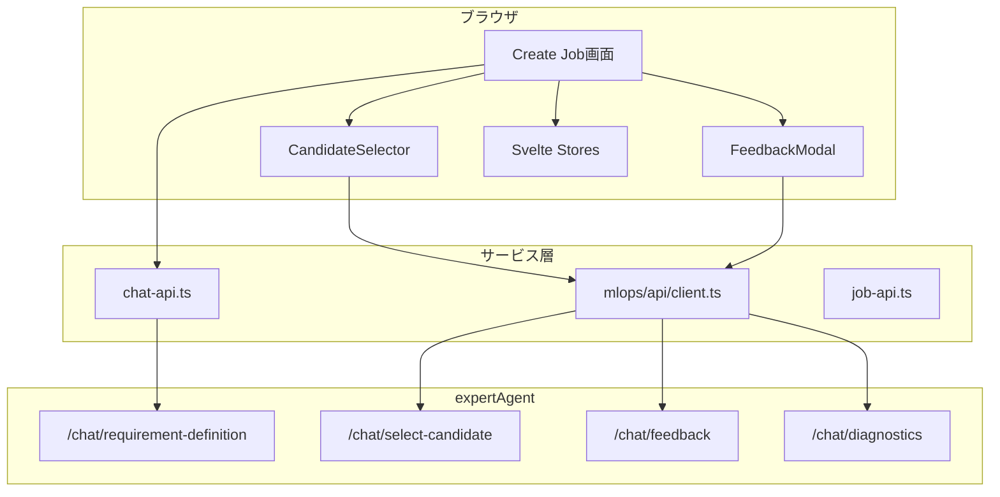
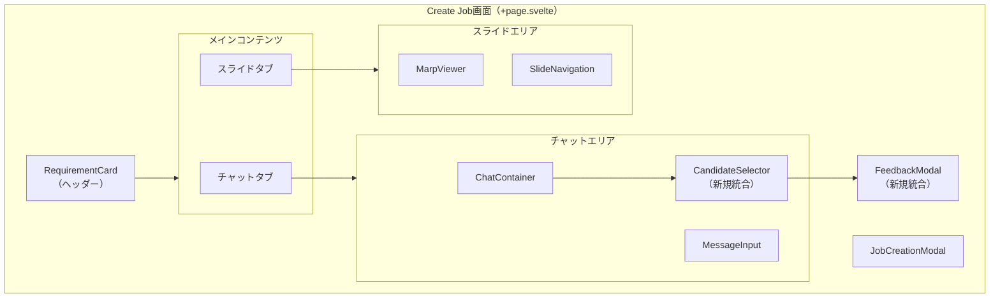
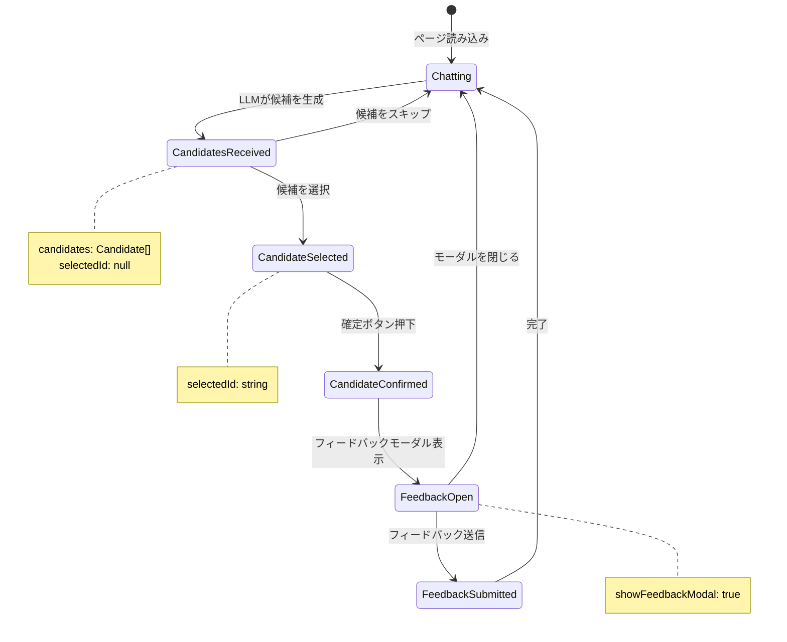

# 設計方針書: Issue #192 - Create JobとMLOps Chat UIの統合

## 現状調査サマリ

### 対象プロジェクト
- **プロジェクト名**: myAgentDesk（SvelteKit フロントエンド）
- **主要モジュール**:
  - `src/routes/create_job/+page.svelte` - Create Job画面（統合先）
  - `src/lib/mlops/components/` - MLOpsコンポーネント群（統合元）

### 既存アーキテクチャパターン

| パターン | 使用箇所 | 目的 |
|----------|---------|------|
| **Event Dispatcher** | CandidateSelector, FeedbackModal | 親コンポーネントへのイベント通知 |
| **Props-based Interface** | 全MLOpsコンポーネント | コンポーネント間データ受け渡し |
| **Svelte Store** | conversationStore, chatSession | グローバル状態管理 |
| **localStorage永続化** | Create Job画面 | ジョブ作成状態の復帰 |
| **SSEストリーミング** | chat-api.ts | リアルタイムLLM応答 |
| **ポーリング** | Create Job画面 | 非同期ジョブ状態監視（5秒間隔） |
| **i18n** | $lib/stores/locale | 国際化対応 |

### 類似機能の設計

#### CandidateSelectorコンポーネント
```typescript
// Props
export let candidates: Candidate[] = [];
export let selectedId: string | null = null;
export let loading = false;
export let disabled = false;

// Events
dispatch('select', { candidateId });
dispatch('confirm', { candidateId });
```
- ARIA roles（`listbox`, `option`）によるアクセシビリティ
- キーボード操作（Arrow Up/Down, Enter）
- Tailwind CSSによるスタイリング

#### FeedbackModalコンポーネント
```typescript
// Props
export let open = false;
export let conversationId: string;
export let loading = false;

// Events
dispatch('submit', scores);
dispatch('close');
```
- フォーカストラップ（Tab循環）
- Escapeキーで閉じる
- 外側クリックで閉じる

### モジュール間依存関係

```
Create Job画面
├── Svelte Stores
│   ├── conversationStore (会話履歴)
│   ├── chatSession (セッション状態)
│   └── innerSidebarOpen (サイドバー状態)
├── Services
│   ├── chat-api.ts (LLMチャット)
│   ├── job-api.ts (ジョブ作成)
│   └── marp-api.ts (スライド生成)
└── Components
    ├── ChatContainer
    ├── MessageInput
    ├── RequirementCard
    └── JobCreationModal

MLOps Components（統合対象）
├── CandidateSelector
│   └── CandidateCard
├── FeedbackModal
│   └── FeedbackForm
│       └── ScoreSlider
└── mlops/api/client.ts (MLOps API)
```

### 既存API設計パターン

| 項目 | パターン |
|------|----------|
| エンドポイント命名 | `/v1/{resource}/{action}` |
| レスポンス形式 | `{ success: boolean, data: T, message?: string }` |
| エラーハンドリング | HTTP Status + `{ detail: string }` |
| 認証 | なし（ローカル環境想定） |

### 参照したドキュメント
- `myAgentDesk/README.md` - プロジェクト構造、コンポーネントアーキテクチャ
- `dev-reports/feature/issue/192/requirements.md` - 要件定義書

### 設計上の制約
1. **既存コンポーネントの再利用**: MLOpsコンポーネントは変更せず再利用
2. **既存ワークフローの維持**: Create Job画面の既存機能に影響を与えない
3. **アクセシビリティ維持**: ARIA対応、キーボード操作の維持
4. **ダークモード対応**: 既存のTailwind CSSテーマを適用

---

## アーキテクチャ設計

### システム構成図



### レイヤー構成

| レイヤー | 責務 | 主要ファイル |
|---------|------|-------------|
| **Presentation** | UI表示、ユーザー操作 | `+page.svelte`, `*.svelte` |
| **State Management** | グローバル状態管理 | `$lib/stores/*.ts` |
| **Service** | API呼び出し、データ変換 | `$lib/services/*.ts`, `$lib/mlops/api/*.ts` |
| **Domain** | 型定義、ビジネスルール | `$lib/mlops/types/*.ts` |

### コンポーネント構成図（統合後）



---

## 技術選定

| カテゴリ | 選定技術 | 選定理由 | 既存との整合性 |
|---------|---------|---------|---------------|
| フレームワーク | SvelteKit 2.5.0 | 既存スタック | ✅ 完全一致 |
| 言語 | TypeScript 5.3.3 | 既存スタック | ✅ 完全一致 |
| スタイリング | Tailwind CSS 3.4.0 | 既存スタック | ✅ 完全一致 |
| 状態管理 | Svelte Store | 既存パターン | ✅ 完全一致 |
| テスト | Vitest + Playwright | 既存スタック | ✅ 完全一致 |
| i18n | $lib/stores/locale | 既存パターン | ✅ 完全一致 |

**新規技術導入**: なし（既存スタックで対応可能）

---

## 設計パターン

### 採用パターン

| パターン | 使用箇所 | 既存での使用 |
|----------|---------|-------------|
| **Event Dispatcher** | CandidateSelector → Create Job | CandidateSelector（既存） |
| **Props-based Interface** | コンポーネント間データ受け渡し | 全コンポーネント（既存） |
| **Svelte Store** | 候補選択状態、フィードバック状態 | conversationStore（既存） |
| **Conditional Rendering** | 候補表示条件分岐 | Create Job画面（既存） |
| **Error Boundary** | API呼び出しエラーハンドリング | Create Job画面（既存） |

### 新規パターン導入

**導入なし**: 既存パターンで全ての要件に対応可能

---

## 状態管理設計

### 状態遷移図



### 新規追加する状態変数

```typescript
// Create Job画面に追加する状態変数
let candidates: Candidate[] = [];           // 候補リスト
let selectedCandidateId: string | null = null; // 選択中の候補ID
let candidateLoading = false;               // 候補選択API呼び出し中
let showFeedbackModal = false;              // フィードバックモーダル表示
let feedbackLoading = false;                // フィードバック送信中
let feedbackSubmitted = false;              // フィードバック送信済み
```

### Svelte Store設計

```typescript
// 既存のchatSessionストアを拡張（変更不要、候補データはローカル状態で管理）
// 理由: 候補データは画面固有の一時的な状態であり、グローバル化の必要がない

// 代替案として検討したが採用しなかったもの:
// - candidateStore: 候補データは会話ごとに異なり、永続化不要のためローカル状態で十分
// - feedbackStore: フィードバック状態も一時的なものでグローバル化不要
```

---

## データモデル設計

### 型定義（既存の再利用）

```typescript
// src/lib/mlops/types/index.ts から再利用
interface Candidate {
  id: string;
  label: string;
  description: string;
  requirements: RequirementState;
  confidence: number;
}

interface FeedbackScores {
  requirement_clarity?: number;        // 1-5
  interpretation_accuracy?: number;    // 1-5
  response_helpfulness?: number;       // 1-5
  overall_satisfaction?: number;       // 1-5
  comment?: string;
}

interface RequirementState {
  data_source: string | null;
  process_description: string | null;
  output_format: string | null;
  schedule: string | null;
  completeness: number;
}
```

### 新規追加する型定義

```typescript
// src/lib/utils/candidate-parser.ts
interface CandidateParseResult {
  success: boolean;
  candidates: Candidate[];
  error?: string;
}

// LLMレスポンスから候補を抽出するパーサー
function parseCandidatesFromLLMResponse(response: string): CandidateParseResult;
```

---

## API設計

### 使用するAPI（既存）

| API | メソッド | 用途 |
|-----|---------|------|
| `/chat/select-candidate` | POST | 候補選択をバックエンドに通知 |
| `/chat/feedback` | POST | フィードバック送信 |
| `/chat/diagnostics/{id}` | GET | 会話診断情報取得 |

### リクエスト/レスポンス形式

#### POST /chat/select-candidate
```typescript
// Request
{
  conversation_id: string;
  selected_candidate_id: string;
}

// Response
{
  conversation_id: string;
  selected_candidate_id: string;
  requirements: RequirementState;
  message: string;
}
```

#### POST /chat/feedback
```typescript
// Request
{
  conversation_id: string;
  requirement_clarity?: number;
  interpretation_accuracy?: number;
  response_helpfulness?: number;
  overall_satisfaction?: number;
  comment?: string;
}

// Response
{
  success: boolean;
  message: string;
  feedback_id: string | null;
  scores_submitted: number;
}
```

---

## セキュリティ設計

### 入力バリデーション

| 項目 | バリデーション | 実装箇所 |
|------|---------------|---------|
| 候補ID | UUIDv4形式チェック | CandidateSelector |
| フィードバックスコア | 1-5の範囲チェック | FeedbackForm（既存） |
| コメント | 最大1000文字、XSSサニタイズ | FeedbackForm（既存） |
| 会話ID | UUIDv4形式チェック | chatSession Store |

### XSS対策

```typescript
// 既存のサニタイズ処理を適用（FeedbackForm.svelteで実装済み）
// コメント入力時にHTMLエスケープを実施
```

---

## パフォーマンス設計

### レンダリング最適化

| 項目 | 対策 |
|------|------|
| 候補リストの再レンダリング | `{#each candidates as candidate (candidate.id)}` でキー指定 |
| フィードバックモーダル | `{#if showFeedbackModal}` で条件レンダリング |
| スクロール | `afterUpdate` でスクロール位置を制御（既存パターン） |

### API呼び出し最適化

| 項目 | 対策 |
|------|------|
| 候補選択API | loading状態で二重送信防止 |
| フィードバックAPI | disabled状態で二重送信防止 |
| エラーリトライ | 指数バックオフで最大3回リトライ |

---

## 実装設計

### コンポーネント統合箇所

```svelte
<!-- src/routes/create_job/+page.svelte への追加 -->

<script lang="ts">
  // 新規import
  import CandidateSelector from '$lib/mlops/components/CandidateSelector.svelte';
  import FeedbackModal from '$lib/mlops/components/FeedbackModal.svelte';
  import { selectCandidate, submitFeedback } from '$lib/mlops/api/client';
  import { parseCandidatesFromLLMResponse } from '$lib/utils/candidate-parser';
  import type { Candidate, FeedbackScores } from '$lib/mlops/types';

  // 新規状態変数
  let candidates: Candidate[] = [];
  let selectedCandidateId: string | null = null;
  let candidateLoading = false;
  let showFeedbackModal = false;
  let feedbackLoading = false;

  // 候補選択ハンドラー
  function handleCandidateSelect(event: CustomEvent<{ candidateId: string }>) {
    selectedCandidateId = event.detail.candidateId;
  }

  // 候補確定ハンドラー
  async function handleCandidateConfirm(event: CustomEvent<{ candidateId: string }>) {
    candidateLoading = true;
    try {
      await selectCandidate(conversationId, event.detail.candidateId);
      showFeedbackModal = true;
    } catch (error) {
      console.error('Failed to select candidate:', error);
      // エラー表示
    } finally {
      candidateLoading = false;
    }
  }

  // フィードバック送信ハンドラー
  async function handleFeedbackSubmit(event: CustomEvent<FeedbackScores>) {
    feedbackLoading = true;
    try {
      await submitFeedback({
        conversation_id: conversationId,
        ...event.detail
      });
      showFeedbackModal = false;
      candidates = []; // 候補をクリア
    } catch (error) {
      console.error('Failed to submit feedback:', error);
      // エラー表示
    } finally {
      feedbackLoading = false;
    }
  }

  // フィードバックモーダルを閉じる
  function handleFeedbackClose() {
    showFeedbackModal = false;
  }
</script>

<!-- テンプレート追加箇所 -->
{#if candidates.length > 0}
  <CandidateSelector
    {candidates}
    selectedId={selectedCandidateId}
    loading={candidateLoading}
    on:select={handleCandidateSelect}
    on:confirm={handleCandidateConfirm}
  />
{/if}

<FeedbackModal
  open={showFeedbackModal}
  {conversationId}
  loading={feedbackLoading}
  on:submit={handleFeedbackSubmit}
  on:close={handleFeedbackClose}
/>
```

### LLMレスポンスパーサー

```typescript
// src/lib/utils/candidate-parser.ts
import type { Candidate, RequirementState } from '$lib/mlops/types';

interface CandidateParseResult {
  success: boolean;
  candidates: Candidate[];
  error?: string;
}

/**
 * LLMレスポンスから候補データを抽出する
 *
 * 想定フォーマット:
 * ```json
 * {
 *   "candidates": [
 *     {
 *       "id": "candidate_1",
 *       "label": "解釈A",
 *       "description": "...",
 *       "requirements": { ... },
 *       "confidence": 0.85
 *     }
 *   ]
 * }
 * ```
 */
export function parseCandidatesFromLLMResponse(response: string): CandidateParseResult {
  try {
    // JSONブロックを抽出
    const jsonMatch = response.match(/```json\s*([\s\S]*?)\s*```/);
    if (!jsonMatch) {
      // JSONブロックがない場合は候補なしとして処理
      return { success: true, candidates: [] };
    }

    const parsed = JSON.parse(jsonMatch[1]);

    if (!parsed.candidates || !Array.isArray(parsed.candidates)) {
      return { success: true, candidates: [] };
    }

    // バリデーション
    const candidates: Candidate[] = parsed.candidates
      .filter((c: unknown) => isValidCandidate(c))
      .map((c: unknown) => normalizeCandidate(c as RawCandidate));

    return { success: true, candidates };
  } catch (error) {
    console.error('Failed to parse candidates:', error);
    return {
      success: false,
      candidates: [],
      error: error instanceof Error ? error.message : 'Unknown error'
    };
  }
}

interface RawCandidate {
  id?: string;
  label?: string;
  description?: string;
  requirements?: Partial<RequirementState>;
  confidence?: number;
}

function isValidCandidate(obj: unknown): obj is RawCandidate {
  if (typeof obj !== 'object' || obj === null) return false;
  const c = obj as Record<string, unknown>;
  return typeof c.label === 'string' && typeof c.description === 'string';
}

function normalizeCandidate(raw: RawCandidate): Candidate {
  return {
    id: raw.id || crypto.randomUUID(),
    label: raw.label || 'Unknown',
    description: raw.description || '',
    requirements: {
      data_source: raw.requirements?.data_source || null,
      process_description: raw.requirements?.process_description || null,
      output_format: raw.requirements?.output_format || null,
      schedule: raw.requirements?.schedule || null,
      completeness: raw.requirements?.completeness || 0
    },
    confidence: raw.confidence || 0.5
  };
}
```

---

## 設計判断とトレードオフ

### 判断1: 候補データの状態管理

| 選択肢 | メリット | デメリット |
|--------|---------|----------|
| **ローカル状態（採用）** | シンプル、永続化不要 | 画面リロードで消失 |
| Svelte Store | 他コンポーネントからアクセス可能 | 過剰設計 |
| localStorage | 永続化 | 複雑化、不要なデータ残留 |

**採用理由**: 候補データは会話ごとの一時的なもので、永続化や他画面からのアクセスは不要

### 判断2: フィードバックモーダルの表示タイミング

| 選択肢 | メリット | デメリット |
|--------|---------|----------|
| **候補確定後に表示（採用）** | ワークフローが明確 | 追加クリック必要 |
| 候補選択後に自動表示 | クリック数削減 | 誤操作の可能性 |
| 別画面に遷移 | 機能分離 | UX分断 |

**採用理由**: 候補確定とフィードバック送信を明確に分離し、ユーザーの意図を確認

### 判断3: エラーハンドリング

| 選択肢 | メリット | デメリット |
|--------|---------|----------|
| **インラインエラー表示（採用）** | 画面遷移なし | 表示スペース必要 |
| トースト通知 | 控えめな表示 | 見逃しやすい |
| エラーモーダル | 確実に伝わる | UX中断 |

**採用理由**: 既存のCreate Job画面のエラーハンドリングパターンに合わせる

---

## テスト設計

### 単体テスト（Vitest）

| テスト対象 | テストケース |
|-----------|-------------|
| candidate-parser.ts | JSON抽出成功、JSON抽出失敗、空レスポンス、不正形式 |
| 候補選択ハンドラー | 正常系、エラー系、loading状態 |
| フィードバックハンドラー | 正常系、エラー系、バリデーション |

### E2Eテスト（Playwright）

| シナリオ | ステップ |
|----------|---------|
| 候補選択フロー | チャット → 候補表示 → 選択 → 確定 → フィードバック |
| キーボード操作 | Arrow Down → Arrow Up → Enter → Escape |
| エラーハンドリング | API失敗時のエラー表示確認 |

---

## 実装チェックリスト

- [ ] `src/lib/utils/candidate-parser.ts` 作成
- [ ] `src/routes/create_job/+page.svelte` にCandidateSelector統合
- [ ] `src/routes/create_job/+page.svelte` にFeedbackModal統合
- [ ] 状態変数の追加
- [ ] イベントハンドラーの実装
- [ ] エラーハンドリングの実装
- [ ] 単体テスト作成（candidate-parser）
- [ ] 統合テスト作成（+page.svelte）
- [ ] E2Eテスト作成
- [ ] ダークモード確認
- [ ] アクセシビリティ確認（キーボード操作）

---

## 参照ドキュメント

| ドキュメント | 内容 |
|--------------|------|
| `myAgentDesk/README.md` | プロジェクト構造、コンポーネントアーキテクチャ |
| `dev-reports/feature/issue/192/requirements.md` | 要件定義書 |
| `src/lib/mlops/components/CandidateSelector.svelte` | 統合対象コンポーネント |
| `src/lib/mlops/components/FeedbackModal.svelte` | 統合対象コンポーネント |
| `src/routes/create_job/+page.svelte` | 統合先画面 |

---

## 見積

| フェーズ | 工数 | 内訳 |
|---------|------|------|
| **Phase 1: 実装** | 2日 | パーサー実装、コンポーネント統合、状態管理 |
| **Phase 2: テスト** | 1日 | 単体テスト、E2Eテスト |
| **Phase 3: 品質** | 0.5日 | アクセシビリティ、ダークモード確認 |
| **Phase 4: ドキュメント** | 0.5日 | README更新、API仕様書更新 |
| **合計** | **4日** | |

---

*作成日: 2025-12-10*
*Issue: #192*
*ステータス: 設計方針策定完了*
