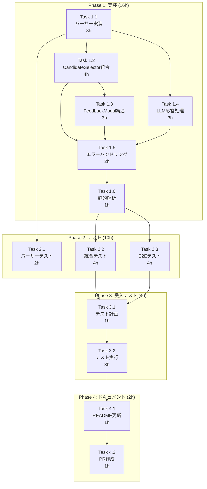

# 作業計画書: Issue #192 - Create JobとMLOps Chat UIの統合

## 1. Issue概要の確認

```markdown
## Issue: Create JobとMLOps Chat UIの統合
**Issue番号**: #192
**親Issue**: #152（要件定義エージェントへのMLOps導入）
**サイズ**: M（Medium）
**作業見積**: 32時間（4日）
**優先度**: High
**依存Issue**: #170（UI実装）✅ 完了、#191（プロンプト管理API）進行中
```

### 目的
- Create Job画面にCandidateSelector/FeedbackModalを統合
- ユーザー導線の分断を解消
- MLOpsメトリクス収集の効率化

### スコープ
- **In Scope**: CandidateSelector統合、FeedbackModal統合、LLMレスポンスパーサー
- **Out of Scope**: MLOps Chat画面の改修、バックエンドAPI変更

---

## 2. 詳細タスク分解

### Phase 1: 実装タスク（16時間）

#### Task 1.1: LLMレスポンスパーサー実装
| 項目 | 内容 |
|------|------|
| **所要時間** | 3時間 |
| **成果物** | `myAgentDesk/src/lib/utils/candidate-parser.ts` |
| **依存** | なし |
| **内容** | LLMレスポンスからCandidate[]を抽出するパーサー実装 |

**実装詳細**:
- JSONブロック抽出（```json ... ```）
- バリデーション（isValidCandidate）
- 正規化（normalizeCandidate）
- エラーハンドリング（CandidateParseResult）

#### Task 1.2: CandidateSelectorのCreate Job画面統合
| 項目 | 内容 |
|------|------|
| **所要時間** | 4時間 |
| **成果物** | `myAgentDesk/src/routes/create_job/+page.svelte` 更新 |
| **依存** | Task 1.1 |
| **内容** | CandidateSelectorコンポーネントのimport、状態変数追加、イベントハンドラー実装 |

**実装詳細**:
- import文追加（CandidateSelector, selectCandidate, parseCandidatesFromLLMResponse）
- 状態変数追加（candidates, selectedCandidateId, candidateLoading）
- handleCandidateSelect(), handleCandidateConfirm()実装
- 条件レンダリング（`{#if candidates.length > 0}`）

#### Task 1.3: FeedbackModalのCreate Job画面統合
| 項目 | 内容 |
|------|------|
| **所要時間** | 3時間 |
| **成果物** | `myAgentDesk/src/routes/create_job/+page.svelte` 更新 |
| **依存** | Task 1.2 |
| **内容** | FeedbackModalコンポーネントのimport、状態変数追加、イベントハンドラー実装 |

**実装詳細**:
- import文追加（FeedbackModal, submitFeedback）
- 状態変数追加（showFeedbackModal, feedbackLoading, feedbackSubmitted）
- handleFeedbackSubmit(), handleFeedbackClose()実装
- モーダルレンダリング

#### Task 1.4: LLMレスポンス処理の統合
| 項目 | 内容 |
|------|------|
| **所要時間** | 3時間 |
| **成果物** | `myAgentDesk/src/routes/create_job/+page.svelte` 更新 |
| **依存** | Task 1.1, Task 1.2 |
| **内容** | SSEストリーミング応答からの候補抽出処理を統合 |

**実装詳細**:
- onMessage コールバック内でパーサー呼び出し
- 候補検出時にcandidates状態を更新
- エラー時のフォールバック処理

#### Task 1.5: エラーハンドリング実装
| 項目 | 内容 |
|------|------|
| **所要時間** | 2時間 |
| **成果物** | `myAgentDesk/src/routes/create_job/+page.svelte` 更新 |
| **依存** | Task 1.2, Task 1.3 |
| **内容** | API呼び出し失敗時のエラー表示、リトライUI |

**実装詳細**:
- errorMessage状態変数追加
- インラインエラー表示コンポーネント
- リトライボタン

#### Task 1.6: 静的解析・フォーマット
| 項目 | 内容 |
|------|------|
| **所要時間** | 1時間 |
| **成果物** | ESLint/Prettier/TypeScriptエラーゼロ |
| **依存** | Task 1.1〜1.5 |
| **内容** | `npm run lint`, `npm run type-check` 実行・修正 |

---

### Phase 2: テストタスク（10時間）

#### Task 2.1: パーサー単体テスト
| 項目 | 内容 |
|------|------|
| **所要時間** | 2時間 |
| **成果物** | `myAgentDesk/src/lib/utils/candidate-parser.test.ts` |
| **依存** | Task 1.1 |
| **カバレッジ目標** | 100% |

**テストケース**:
- JSON抽出成功（正常系）
- JSON抽出失敗（JSONブロックなし）
- 空レスポンス
- 不正形式（バリデーション失敗）
- 部分的に有効な候補（一部のみ抽出）

#### Task 2.2: コンポーネント統合テスト
| 項目 | 内容 |
|------|------|
| **所要時間** | 4時間 |
| **成果物** | `myAgentDesk/src/routes/create_job/+page.test.ts` |
| **依存** | Task 1.2, Task 1.3 |
| **カバレッジ目標** | 70%（コンポーネント） |

**テストケース**:
- 候補表示（candidates.length > 0）
- 候補選択イベント
- 候補確定イベント
- フィードバックモーダル表示
- フィードバック送信
- エラー表示

#### Task 2.3: E2Eテスト
| 項目 | 内容 |
|------|------|
| **所要時間** | 4時間 |
| **成果物** | `myAgentDesk/tests/e2e/create-job-mlops.spec.ts` |
| **依存** | Phase 1完了 |
| **シナリオ数** | 3 |

**テストシナリオ**:
1. 候補選択フロー（チャット→候補表示→選択→確定→フィードバック）
2. キーボード操作（Arrow Down→Arrow Up→Enter→Escape）
3. エラーハンドリング（API失敗時のエラー表示確認）

---

### Phase 3: L3受入テストタスク（4時間）

#### Task 3.1: L3受入テスト計画
| 項目 | 内容 |
|------|------|
| **所要時間** | 1時間 |
| **成果物** | 受入テストシナリオ（本ドキュメントSection 8） |
| **依存** | Phase 1, Phase 2完了 |
| **内容** | 具体的なテストシナリオ、期待結果の定義 |

#### Task 3.2: L3受入テスト実行
| 項目 | 内容 |
|------|------|
| **所要時間** | 3時間 |
| **成果物** | `tests/acceptance/test_issue_192_create_job_mlops.sh` |
| **依存** | Task 3.1 |
| **内容** | サービス起動確認、UI操作確認、API連携確認、エビデンス収集 |

---

### Phase 4: ドキュメント・PR作成（2時間）

#### Task 4.1: README更新
| 項目 | 内容 |
|------|------|
| **所要時間** | 1時間 |
| **成果物** | `myAgentDesk/README.md` 更新 |
| **依存** | Phase 3完了 |
| **内容** | Create Job画面のMLOps機能説明追加 |

#### Task 4.2: PR作成・レビュー依頼
| 項目 | 内容 |
|------|------|
| **所要時間** | 1時間 |
| **成果物** | Pull Request |
| **依存** | Task 4.1 |
| **内容** | PR作成、レビュー依頼、CIグリーン確認 |

---

## 3. タスク依存関係



---

## 4. 作業スケジュール

### Day 1（8時間）

| 時間 | タスク | 成果物 |
|------|--------|--------|
| 09:00-12:00 | Task 1.1: パーサー実装 | `candidate-parser.ts` |
| 13:00-15:00 | Task 2.1: パーサー単体テスト | `candidate-parser.test.ts` |
| 15:00-17:00 | **チェックポイント1**: パーサー動作確認 | テスト全パス |
| 17:00-19:00 | Task 1.2: CandidateSelector統合（前半） | `+page.svelte` 更新開始 |

**Day 1 成果物**:
- [x] パーサー実装完了
- [x] パーサーテスト完了

---

### Day 2（8時間）

| 時間 | タスク | 成果物 |
|------|--------|--------|
| 09:00-11:00 | Task 1.2: CandidateSelector統合（後半） | 状態変数、ハンドラー |
| 11:00-14:00 | Task 1.3: FeedbackModal統合 | モーダル統合 |
| 14:00-17:00 | Task 1.4: LLM応答処理統合 | SSE処理更新 |
| 17:00-19:00 | Task 1.5: エラーハンドリング | エラー表示UI |

**Day 2 成果物**:
- [x] CandidateSelector統合完了
- [x] FeedbackModal統合完了
- [x] LLM応答処理統合完了

---

### Day 3（8時間）

| 時間 | タスク | 成果物 |
|------|--------|--------|
| 09:00-10:00 | Task 1.6: 静的解析 | ESLint/TypeScriptエラーゼロ |
| 10:00-12:00 | **チェックポイント2**: 手動動作確認 | UI動作OK |
| 13:00-17:00 | Task 2.2: コンポーネント統合テスト | `+page.test.ts` |
| 17:00-19:00 | Task 2.3: E2Eテスト（前半） | `create-job-mlops.spec.ts` 開始 |

**Day 3 成果物**:
- [x] 静的解析パス
- [x] 統合テスト完了

---

### Day 4（8時間）

| 時間 | タスク | 成果物 |
|------|--------|--------|
| 09:00-11:00 | Task 2.3: E2Eテスト（後半） | E2Eテスト完了 |
| 11:00-12:00 | Task 3.1: 受入テスト計画 | シナリオ定義 |
| 13:00-16:00 | Task 3.2: L3受入テスト実行 | `test_issue_192_*.sh` |
| 16:00-17:00 | Task 4.1: README更新 | `README.md` |
| 17:00-18:00 | Task 4.2: PR作成 | Pull Request |

**Day 4 成果物**:
- [x] E2Eテスト完了
- [x] L3受入テスト完了
- [x] ドキュメント更新完了
- [x] PR作成完了

---

## 5. チェックポイント

| タイミング | 確認事項 | 確認方法 | 対応 |
|-----------|---------|----------|------|
| Day 1終了時 | パーサーが正しく動作するか | `npm test candidate-parser` | 修正対応 |
| Day 2終了時 | UIが正しく表示されるか | 手動テスト（ブラウザ） | 修正対応 |
| Day 3終了時 | テストカバレッジ達成 | `npm run test:coverage` | テスト追加 |
| PR作成前 | CI/CDグリーン | GitHub Actions | 修正対応 |

---

## 6. リスクと対策

| リスク | 発生確率 | 影響 | 対策 |
|-------|---------|------|------|
| **LLMレスポンス形式のばらつき** | 高 | 候補パースが失敗 | 堅牢なパーサー実装、フォールバック（空配列返却） |
| **既存機能へのリグレッション** | 中 | ジョブ作成が動作しない | E2Eテストで既存フローも確認 |
| **CandidateSelectorのスタイル崩れ** | 低 | UI不整合 | ダークモードでの動作確認 |
| **FeedbackModalのフォーカス問題** | 低 | アクセシビリティ違反 | キーボード操作テスト |
| **API呼び出しタイムアウト** | 低 | UX低下 | loading状態表示、リトライUI |

---

## 7. 成果物チェックリスト

### コード
- [ ] `myAgentDesk/src/lib/utils/candidate-parser.ts`
- [ ] `myAgentDesk/src/routes/create_job/+page.svelte` (更新)

### テスト
- [ ] `myAgentDesk/src/lib/utils/candidate-parser.test.ts`
- [ ] `myAgentDesk/src/routes/create_job/+page.test.ts`
- [ ] `myAgentDesk/tests/e2e/create-job-mlops.spec.ts`
- [ ] `tests/acceptance/test_issue_192_create_job_mlops.sh`

### ドキュメント
- [ ] `myAgentDesk/README.md` (更新)
- [ ] `dev-reports/feature/issue/192/requirements.md` ✅
- [ ] `dev-reports/feature/issue/192/design-policy.md` ✅
- [ ] `dev-reports/feature/issue/192/architecture-review.md` ✅
- [ ] `dev-reports/feature/issue/192/work-plan.md` ✅

---

## 8. L3受入テスト計画（具体的なコマンド）

### Step 1: サービス起動確認

```bash
# サービス起動
cd /Users/maenokota/share/work/github_kewton/MySwiftAgent
./scripts/dev-start.sh

# ヘルスチェック（必須）
echo "=== Health Check ==="
curl -sf http://localhost:8104/health && echo " ✅ expertAgent: healthy" || echo " ❌ expertAgent: unhealthy"
curl -sf http://localhost:8103/health && echo " ✅ myVault: healthy" || echo " ❌ myVault: unhealthy"

# myAgentDesk起動
cd myAgentDesk && npm run dev &
sleep 5
curl -sf http://localhost:5173/health && echo " ✅ myAgentDesk: healthy" || echo " ❌ myAgentDesk: unhealthy"
```

### Step 2: MLOps API動作確認

```bash
echo "=== Test: MLOps APIs ==="

# 候補選択API確認
curl -s -X POST http://localhost:8104/aiagent-api/v1/chat/select-candidate \
  -H "Content-Type: application/json" \
  -d '{
    "conversation_id": "test-conv-192",
    "selected_candidate_id": "candidate_1"
  }' | python3 -c "
import sys, json
data = json.load(sys.stdin)
print(f'Status: {\"SUCCESS\" if \"conversation_id\" in data else \"FAILED\"}')"

# フィードバックAPI確認
curl -s -X POST http://localhost:8104/aiagent-api/v1/chat/feedback \
  -H "Content-Type: application/json" \
  -d '{
    "conversation_id": "test-conv-192",
    "requirement_clarity": 4,
    "interpretation_accuracy": 5,
    "response_helpfulness": 4,
    "overall_satisfaction": 4,
    "comment": "L3受入テスト"
  }' | python3 -c "
import sys, json
data = json.load(sys.stdin)
print(f'Status: {\"SUCCESS\" if data.get(\"success\") else \"FAILED\"}')"
```

### Step 3: UI統合動作確認（Playwright）

```bash
echo "=== Test: UI Integration (Playwright) ==="

cd myAgentDesk

# E2Eテスト実行
npx playwright test tests/e2e/create-job-mlops.spec.ts --reporter=list

# 期待する結果:
# - 候補選択フローテスト: PASSED
# - キーボード操作テスト: PASSED
# - エラーハンドリングテスト: PASSED
```

### Step 4: 手動UI確認（チェックリスト）

```bash
echo "=== Manual UI Verification ==="
echo "1. Open http://localhost:5173/create_job in browser"
echo ""
echo "確認項目:"
echo "  - [ ] チャットで要件を入力できる"
echo "  - [ ] LLMが候補を生成した場合、CandidateSelectorが表示される"
echo "  - [ ] 候補をクリックで選択できる"
echo "  - [ ] キーボード（Arrow Up/Down）で候補を選択できる"
echo "  - [ ] 確定ボタンで候補を確定できる"
echo "  - [ ] 確定後、FeedbackModalが表示される"
echo "  - [ ] 4段階評価（1-5）を入力できる"
echo "  - [ ] コメントを入力できる"
echo "  - [ ] フィードバック送信ボタンで送信できる"
echo "  - [ ] 送信後、モーダルが閉じる"
echo "  - [ ] ダークモードでも正しく表示される"
echo "  - [ ] 既存のジョブ作成フローが正常に動作する"
```

### Step 5: MLOps Dashboard確認

```bash
echo "=== Test: MLOps Dashboard ==="

# メトリクス確認
curl -s http://localhost:8104/aiagent-api/v1/observability/requirement-definition-metrics \
  | python3 -c "
import sys, json
data = json.load(sys.stdin)
print(f'Total sessions: {data.get(\"total_sessions\", 0)}')"

# 手動確認
echo ""
echo "手動確認:"
echo "  1. Open http://localhost:5173/mlops/dashboard"
echo "  2. Verify:"
echo "     - [ ] フィードバックがメトリクスに反映されている"
echo "     - [ ] 会話履歴がDiagnosticsで確認できる"
```

### Step 6: エビデンス収集

```bash
echo "=== Collecting Evidence ==="

mkdir -p /tmp/issue_192_evidence

# スクリーンショット取得（Playwright）
npx playwright test tests/e2e/create-job-mlops.spec.ts --update-snapshots

# ログ収集
cp -r myAgentDesk/test-results /tmp/issue_192_evidence/

echo "Evidence saved to /tmp/issue_192_evidence/"
ls -la /tmp/issue_192_evidence/
```

---

## 9. Definition of Done

Issue完了条件：

### コード品質
- [ ] すべての実装タスクが完了
- [ ] ESLint/TypeScriptエラーゼロ
- [ ] コードレビュー承認

### テスト
- [ ] パーサー単体テストカバレッジ100%
- [ ] コンポーネント統合テストカバレッジ70%+
- [ ] E2Eテスト全シナリオパス（3シナリオ）
- [ ] **L3受入テスト全パス**（実際のサービス起動・UI操作確認）
- [ ] CI/CDグリーン

### 機能確認
- [ ] CandidateSelectorがCreate Job画面で動作する
- [ ] FeedbackModalがCreate Job画面で動作する
- [ ] キーボード操作（Arrow Up/Down, Enter, Escape）が動作する
- [ ] ダークモードで正しく表示される
- [ ] 既存のジョブ作成フローに影響がない

### ドキュメント
- [ ] README更新完了
- [ ] 作業ドキュメント完了（requirements, design-policy, architecture-review, work-plan）

---

## 10. 次のアクション

### 作業計画承認後

1. **ブランチ作成**:
   ```bash
   git checkout develop
   git pull origin develop
   git checkout -b feature/issue/192
   ```

2. **worktree作成**（並列作業時）:
   ```bash
   ./scripts/worktree-create-from-issue.sh 192 feature
   ```

3. **タスク実行**: 本計画に従って実装

4. **進捗報告**: `/progress-report` で定期報告

5. **PR作成**:
   ```bash
   gh pr create --title "feat(myAgentDesk): integrate CandidateSelector and FeedbackModal into Create Job #192" \
     --body "## Summary
   - Integrate CandidateSelector component into Create Job page
   - Integrate FeedbackModal component into Create Job page
   - Implement LLM response parser for candidate extraction
   - Add error handling and loading states

   ## Test Plan
   - Unit tests: candidate-parser (100% coverage)
   - Integration tests: +page.svelte (70%+ coverage)
   - E2E tests: 3 scenarios (candidate selection, keyboard, error handling)
   - L3 acceptance tests: passed

   ## Screenshots
   [Add screenshots of CandidateSelector and FeedbackModal in Create Job page]

   Closes #192"
   ```

---

## 参照ドキュメント

| ドキュメント | 用途 |
|--------------|------|
| [requirements.md](./requirements.md) | 要件定義書 |
| [design-policy.md](./design-policy.md) | 設計方針書 |
| [architecture-review.md](./architecture-review.md) | アーキテクチャレビュー |
| [myAgentDesk/README.md](../../myAgentDesk/README.md) | プロジェクト構造 |

---

*作成日: 2025-12-10*
*Issue: #192*
*見積: 32時間（4日）*
*ステータス: 承認待ち*
